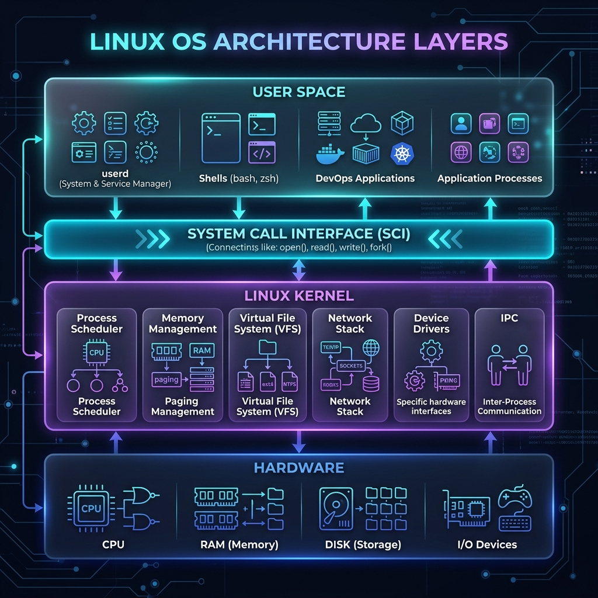
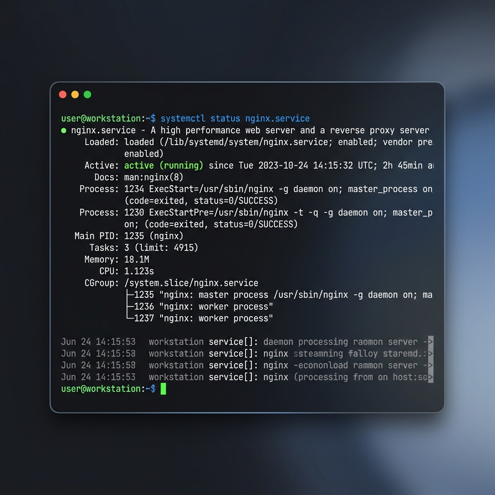

# 🐧 Day 02: Linux Architecture, Processes, and systemd

> **"Understanding the operating system under the hood eliminates guesswork during production incidents."**

Welcome to Day 02 of the **90 Days of DevOps** challenge! Today, we are deep-diving into **Linux internals**. As a DevOps Engineer, Linux is the bedrock of almost every production server, containerized app, and cloud infrastructure component. If you master how processes are scheduled, how user space interacts with the kernel, and how systemd monitors daemons, you can debug issues 10x faster instead of guessing.

---

## 🏗️ 1. The Core Components of Linux

Linux is split into distinct conceptual boundaries to ensure system stability, security, and hardware abstraction.



### 💻 The Kernel
The **Kernel** is the absolute core of the operating system. It has complete control over everything in the system and acts as the bridge between software and hardware.
- **Process Scheduling:** Decides which process gets CPU time, when, and for how long.
- **Memory Management:** Allocates virtual memory ranges to applications safely, preventing them from overwriting each other's memory.
- **Device Drivers:** Acts as the translator between hardware devices (Disk, NIC, GPU) and software.
- **System Calls (Syscalls):** The gatekeeper interface (`fork`, `execve`, `open`, `read`, `write`) allowing programs to request Kernel services securely.

### 👥 User Space
The **User Space** is the restricted area of system memory where user applications, shells, databases, and container runtimes (like Docker) run.
- Programs in User Space cannot access hardware or kernel memory directly.
- They must make **System Calls** to request the kernel to perform hardware operations on their behalf.
- This boundary ensures that a crashing user application (e.g., a buggy web server) doesn't bring down the entire operating system.

### 🔄 The Init System (systemd)
- When the computer boots up, the Linux Kernel initializes hardware and immediately spawns the very first user space process: **`systemd` (Process ID: `PID 1`)**.
- `systemd` is the parent of all other processes in the operating system.
- It is responsible for initializing the user space, starting services in parallel, managing system states (targets), and monitoring system daemons.

---

## 🔄 2. Process Creation & Management

In Linux, a **Process** is simply an executing instance of a program. Understanding how they live, transition, and die is key to troubleshooting CPU spikes and stuck tasks.

### 🐣 How Processes Are Born: `fork` and `exec`
1. **`fork()`**: A parent process clones itself to create a child process. The child gets a new unique Process ID (PID) but copies the parent's environment.
2. **`exec()`**: The child process replaces its own memory space and program code with the new program it actually wants to run (e.g., running `nginx` instead of the cloned shell).

### 🚦 Process States
At any given moment, a process can be in one of the following states:

| State Code | State Name | Description & DevOps Relevance |
| :--- | :--- | :--- |
| **R** | **Running / Runnable** | The process is either currently executing on a CPU core or sitting in the run queue, waiting for its turn. |
| **S** | **Interruptible Sleep** | The process is waiting for an event (like a database query response, network packet, or user input) and can be interrupted by signals. |
| **D** | **Uninterruptible Sleep** | Deep sleep. The process is waiting directly for hardware I/O (like reading from a slow disk). It cannot be interrupted or killed by `kill -9` until I/O completes. High counts of 'D' states indicate disk bottleneck. |
| **T** | **Stopped** | The process has been suspended by a signal (e.g., pressing `Ctrl + Z` in the terminal, or sending `SIGSTOP`). Can be resumed with `fg` or `bg` (`SIGCONT`). |
| **Z** | **Zombie** | The process has finished executing and died, but its entry remains in the Process Table because the parent has not yet read its exit code (via `wait()` system call). They consume zero memory/CPU but take up PID slots. |

---

## ⚙️ 3. What is systemd & Why It Matters

**`systemd`** is the standard system and service manager for modern Linux distributions (CentOS, RHEL, Ubuntu, Debian). 

### 🌟 Why it is a game-changer for DevOps:
1. **Parallel Initialization:** Unlike the legacy SysV init (which started services sequentially one-by-one), systemd starts independent services concurrently, dramatically reducing boot times.
2. **Cgroups Tracking:** It groups processes using **Control Groups (cgroups)**. If a service (like Apache) spawns 20 worker processes, systemd tracks them all under a single unit. Stopping the service guarantees every single subprocess is cleaned up.
3. **Automatic Restarts:** It actively monitors daemons and can be configured to automatically restart services if they crash (e.g., `Restart=on-failure`), ensuring high availability.
4. **Unified Logging:** It routes all standard output and error streams from services to `journald`, providing a single, structured, searchable journal.

---

## 🛠️ 4. Daily Essential Linux Commands for DevOps

Here are the **5 daily commands** that every DevOps engineer must master to inspect processes, diagnose resource usage, and manage services under systemd.

### 1️⃣ `ps aux` — Process Snapshot
- **DevOps Use Case:** Quickly locate a running process, find its PID, owner, or verify if a service daemon is running.
- **Flags:** `a` (all users), `u` (user-oriented format), `x` (processes without controlling terminals).

```bash
ps aux | grep nginx
```

**Example Output:**
```text
USER       PID %CPU %MEM    VSZ   RSS TTY      STAT START   TIME COMMAND
root      1235  0.0  0.1  57684  9324 ?        Ss   14:15   0:00 nginx: master process /usr/sbin/nginx -g daemon on;
www-data  1236  0.0  0.0  58120  5120 ?        S    14:15   0:00 nginx: worker process
www-data  1237  0.0  0.0  58120  5120 ?        S    14:15   0:00 nginx: worker process
rajat     4892  0.0  0.0  14224   980 pts/0    S+   14:30   0:00 grep --color=auto nginx
```

---

### 2️⃣ `top` — Real-Time Resource Monitor
- **DevOps Use Case:** Check system resource utilization (CPU/Memory) in real-time, see which process is hogging resources, and check system uptime and load averages.
- **Tip:** Press `M` to sort by memory usage, `P` to sort by CPU usage, and `q` to quit.

```bash
top -b -n 1 | head -n 15
```

**Example Output:**
```text
top - 14:32:10 up  2:17,  1 user,  load average: 0.15, 0.08, 0.02
Tasks: 124 total,   1 running, 123 sleeping,   0 stopped,   0 zombie
%Cpu(s):  1.5 us,  0.5 sy,  0.0 ni, 98.0 id,  0.0 wa,  0.0 hi,  0.0 si,  0.0 st
MiB Mem :   7956.4 total,   3120.2 free,   2480.1 used,   2356.1 buff/cache
MiB Swap:   2048.0 total,   2048.0 free,      0.0 used.   5120.8 avail Mem 

  PID USER      PR  NI    VIRT    RES    SHR S  %CPU  %MEM     TIME+ COMMAND
 1235 root      20   0   57684   9324   7120 S   0.0   0.1   0:00.12 nginx
 1410 postgres  20   0  356120  45124  32110 S   0.0   0.6   0:01.45 postgres
  890 root      20   0  210452  12480   9112 S   0.0   0.2   0:00.89 systemd-journal
```

---

### 3️⃣ `systemctl status <service>` — Check Service Health
- **DevOps Use Case:** Verify if a system daemon is running, inspect its PID, memory consumption, cgroup, and view its latest startup logs.
- **Visual Terminal Output:**



```bash
systemctl status nginx
```

**Example Output:**
```text
● nginx.service - A high performance web server and a reverse proxy server
     Loaded: loaded (/lib/systemd/system/nginx.service; enabled; vendor preset: enabled)
     Active: active (running) since Tue 2026-05-30 14:15:32 UTC; 2h 45min ago
       Docs: man:nginx(8)
    Process: 1234 ExecStart=/usr/sbin/nginx -g daemon on; (code=exited, status=0/SUCCESS)
   Main PID: 1235 (nginx)
      Tasks: 3 (limit: 4915)
     Memory: 18.1M
        CPU: 1.123s
     CGroup: /system.slice/nginx.service
             ├─1235 "nginx: master process /usr/sbin/nginx -g daemon on;"
             ├─1236 "nginx: worker process"
             └─1237 "nginx: worker process"
```

---

### 4️⃣ `systemctl restart <service>` — Manage Daemon Lifecycle
- **DevOps Use Case:** Safely restart a service after applying new configuration files (e.g., editing `nginx.conf` or modifying environment variables).
- **Tip:** Always run `systemctl reload <service>` if the service supports it. This reloads configs *without* dropping active connections!

```bash
sudo systemctl restart nginx
```
*(This command runs silently. To verify success, check its status again using `systemctl status nginx`)*

---

### 5️⃣ `journalctl -xe` — Modern Log Diagnostic Tool
- **DevOps Use Case:** Fetch system logs when a service fails to start or crashes.
- **Flags:** `-x` (adds catalog explanations to logs), `-e` (immediately jumps to the end of the journal).
- **Bonus Tip:** Use `journalctl -u nginx.service --since "1 hour ago"` to view logs for a specific service in a specific timeframe.

```bash
journalctl -u nginx.service -n 10 --no-pager
```

**Example Output:**
```text
-- Journal begins at Tue 2026-05-30 12:00:00 UTC, ends at Tue 2026-05-30 14:30:00 UTC. --
May 30 14:15:30 workstation systemd[1]: Starting A high performance web server...
May 30 14:15:31 workstation nginx[1234]: nginx: the configuration file /etc/nginx/nginx.conf syntax is ok
May 30 14:15:31 workstation nginx[1234]: nginx: configuration file /etc/nginx/nginx.conf test is successful
May 30 14:15:32 workstation systemd[1]: Started A high performance web server and a reverse proxy server.
```

---

## 📜 Learnings & DevOps Impact

Mastering Linux internals is not just about memorizing commands; it's about building a mental map of how the operating system executes instructions. As you proceed with the **90 Days of DevOps** challenge, you will see how these exact components form the basis of:
1. **Container Isolation (Docker):** Uses Linux namespaces (to isolate processes) and cgroups (to limit memory/CPU) which are kernel features.
2. **Kubernetes Pod Scheduling:** Manages how containerized processes are distributed across hardware resources.
3. **System Observability:** Reading logs and metrics from `/proc`, `journald`, and system signals.

Keep the momentum going! 🚀

**Happy Learning!**
*Trainer: Shubham Londhe*
*Study Notes compiled by: Rajat Mehta*