# 🔑 Day 11: Linux File Ownership Challenge (chown & chgrp)

> **"In the realm of Linux systems administration and DevSecOps, ownership is the foundation of security. Every file and directory is bound to a specific user and group. Understanding how to manage these boundaries using `chown` and `chgrp` is crucial for securing application runtimes, isolating container processes, and establishing robust multi-tenant permissions."**

Welcome to Day 11 of the **90 Days of DevOps** challenge! Today's practice is focused on mastering **Linux File & Directory Ownership**. In this lab, we dive deep into user and group ownership, learn how to change them using `chown` and `chgrp`, apply permissions recursively over complex directory trees, and complete a multi-user ownership practice challenge.

---

## 📋 Practice Metadata

| Attribute | Details |
| :--- | :--- |
| **Concept** | Linux File & Directory Ownership |
| **Operating System** | Ubuntu Server / Debian Linux |
| **Users Configured** | `professor`, `berlin`, `tokyo`, `nairobi` |
| **Groups Configured** | `heist-team`, `planners`, `vault-team`, `tech-team` |
| **Tools / Commands** | `chown`, `chgrp`, `ls -l`, `ls -lR`, `groupadd`, `useradd` |
| **Practice Date** | May 27, 2026 |
| **GitHub Directory** | `90DaysOfDevOps/2026/day-11/` |

---

## 🗺️ File & Directory Ownership Architecture

The diagram below represents the exact relationship mapped out between the system users, group associations, and ownership assignments applied over our target assets and directories during this challenge:

```mermaid
flowchart TD
    subgraph Users [System Users]
        U_tok["tokyo (Developer)"]
        U_ber["berlin (Technical Lead)"]
        U_pro["professor (Administrator)"]
        U_nai["nairobi (Security Analyst)"]
    end

    subgraph Groups [Security Groups]
        G_heist["heist-team (Group)"]
        G_plan["planners (Group)"]
        G_vault["vault-team (Group)"]
        G_tech["tech-team (Group)"]
    end

    subgraph Assets [Configured Files & Directories]
        F_devops["devops-file.txt"]
        F_notes["team-notes.txt"]
        F_config["project-config.yaml"]
        D_logs["app-logs/ (Directory)"]
        
        subgraph Recursion [Recursive Directory Tree: heist-project/]
            D_heist["heist-project/ (Root Dir)"]
            D_vault_dir["vault/ (Sub-Dir)"]
            D_plans_dir["plans/ (Sub-Dir)"]
            F_gold["vault/gold.txt"]
            F_strat["plans/strategy.conf"]
        end
        
        subgraph Challenge [Practice Challenge: bank-heist/]
            D_bank["bank-heist/ (Root Dir)"]
            F_codes["access-codes.txt"]
            F_print["blueprints.pdf"]
            F_plan_txt["escape-plan.txt"]
        end
    end

    %% Basic Ownership Assignments
    F_devops -->|Owner: User| U_ber
    
    F_notes -->|Owner: Group| G_heist
    
    F_config -->|Owner: User| U_pro
    F_config -->|Owner: Group| G_heist
    
    D_logs -->|Owner: User| U_ber
    D_logs -->|Owner: Group| G_heist
    
    %% Recursive Assignments
    D_heist -->|Recursive User Owner| U_pro
    D_heist -->|Recursive Group Owner| G_plan
    D_vault_dir -->|Recursive User Owner| U_pro
    D_vault_dir -->|Recursive Group Owner| G_plan
    D_plans_dir -->|Recursive User Owner| U_pro
    D_plans_dir -->|Recursive Group Owner| G_plan
    F_gold -->|Recursive User Owner| U_pro
    F_gold -->|Recursive Group Owner| G_plan
    F_strat -->|Recursive User Owner| U_pro
    F_strat -->|Recursive Group Owner| G_plan
    
    %% Challenge Assignments
    F_codes -->|Owner: User| U_tok
    F_codes -->|Owner: Group| G_vault
    F_print -->|Owner: User| U_ber
    F_print -->|Owner: Group| G_tech
    F_plan_txt -->|Owner: User| U_nai
    F_plan_txt -->|Owner: Group| G_vault
```



---

## 📑 Table of Contents
1. [🧠 Task 1: Understanding Ownership](#-task-1-understanding-ownership)
   - [Step 1: Inspect Home Directory Listings](#step-1-inspect-home-directory-listings)
   - [Step 2: Understand POSIX Ownership Principles](#step-2-understand-posix-ownership-principles)
2. [👤 Task 2: Basic chown Operations](#-task-2-basic-chown-operations)
   - [Step 1: Create Target File](#step-1-create-target-file)
   - [Step 2: Modify User Ownership to Tokyo](#step-2-modify-user-ownership-to-tokyo)
   - [Step 3: Modify User Ownership to Berlin](#step-3-modify-user-ownership-to-berlin)
3. [👥 Task 3: Basic chgrp Operations](#-task-3-basic-chgrp-operations)
   - [Step 1: Create Group Container](#step-1-create-group-container)
   - [Step 2: Update Group Ownership](#step-2-update-group-ownership)
4. [⚡ Task 4: Combined Owner & Group Change](#-task-4-combined-owner--group-change)
   - [Step 1: Modify File User and Group Collectively](#step-1-modify-file-user-and-group-collectively)
   - [Step 2: Secure Shared Directory Infrastructure](#step-2-secure-shared-directory-infrastructure)
5. [🔄 Task 5: Recursive Ownership](#-task-5-recursive-ownership)
   - [Step 1: Generate Nested Directory Tree](#step-1-generate-nested-directory-tree)
   - [Step 2: Apply Recursive Ownership Model](#step-2-apply-recursive-ownership-model)
   - [Step 3: Audit Deep Path Ownership Changes](#step-3-audit-deep-path-ownership-changes)
6. [🏆 Task 6: Practice Challenge](#-task-6-practice-challenge)
   - [Step 1: Provision System Identities & Groups](#step-1-provision-system-identities--groups)
   - [Step 2: Deploy Challenge Filesystem Structures](#step-2-deploy-challenge-filesystem-structures)
   - [Step 3: Enforce Custom Granular Ownership Matrix](#step-3-enforce-custom-granular-ownership-matrix)
7. [📊 Key Commands Reference](#-key-commands-reference)
8. [🛠️ Troubleshooting & Core Concepts](#️-troubleshooting--core-concepts)
9. [🧠 What I Learned](#-what-i-learned)
10. [📢 Learn in Public & Community Engagement](#-learn-in-public--community-engagement)

---

## 🧠 Task 1: Understanding Ownership

### Step 1: Inspect Home Directory Listings
First, we logged into our Linux server and inspected the default file listings inside our home directory:

```bash
ls -l
```

* **Terminal Verification:**
  ```bash
  $ ls -l
  total 8
  -rw-r--r-- 1 ubuntu ubuntu  50 May 27 09:12 notes.txt
  drwxr-xr-x 2 ubuntu ubuntu 4096 May 27 09:15 project
  ```

---

### Step 2: Understand POSIX Ownership Principles
In a standard POSIX metadata listing, a file's security attributes are represented as follows:

```
Attribute Breakdown:
- rw- r-- r--  1  ubuntu   ubuntu   50  May 27 09:12  notes.txt
^ \_________/  ^  \____/   \____/   ^  \_________/  \_______/
|      |       |    |        |      |       |           |
|  Permissions |  Owner    Group   Size Timestamp   Filename
|
File Type ( - = Regular File, d = Directory )
```

#### What is the difference between User Owner and Group Owner?

* **User Owner (Owner):** The specific user account that owns the file (usually the user who created it). This individual has absolute control over changing the file’s access permissions and can reassign ownership. The file's user permissions (`rwx` in the first triplet) apply directly to this user.
* **Group Owner (Group):** A system group consisting of multiple users who share identical permission access over the file. The file's group permissions (the second triplet) apply to anyone who is a member of this group. This allows secure, collective collaboration without having to configure permissions individually for each user.

---

## 👤 Task 2: Basic chown Operations

### Step 1: Create Target File
We instantiated a regular text file to perform our ownership modification experiments:

```bash
touch devops-file.txt
ls -l devops-file.txt
```

* **Terminal Output:**
  ```bash
  $ touch devops-file.txt
  $ ls -l devops-file.txt
  -rw-r--r-- 1 ubuntu ubuntu 0 May 27 09:30 devops-file.txt
  ```
  * *Note: By default, the file belongs to user `ubuntu` and group `ubuntu`.*

---

### Step 2: Modify User Ownership to Tokyo
Next, we ensured the user account `tokyo` existed on the system and changed the file owner to `tokyo` using the `chown` utility:

```bash
# Create user if it does not already exist
sudo useradd -m tokyo

# Reassign owner to tokyo
sudo chown tokyo devops-file.txt
ls -l devops-file.txt
```

* **Terminal Output:**
  ```bash
  $ sudo chown tokyo devops-file.txt
  $ ls -l devops-file.txt
  -rw-r--r-- 1 tokyo ubuntu 0 May 27 09:32 devops-file.txt
  ```
  * *Success: The user owner column was successfully transitioned from `ubuntu` to `tokyo`.*

---

### Step 3: Modify User Ownership to Berlin
We then provisioned user `berlin` and shifted the ownership of our test file once more:

```bash
# Create user if it does not already exist
sudo useradd -m berlin

# Reassign owner to berlin
sudo chown berlin devops-file.txt
ls -l devops-file.txt
```

* **Terminal Output:**
  ```bash
  $ sudo chown berlin devops-file.txt
  $ ls -l devops-file.txt
  -rw-r--r-- 1 berlin ubuntu 0 May 27 09:35 devops-file.txt
  ```
  * *Success: The file user owner has been successfully changed to `berlin`.*

---

## 👥 Task 3: Basic chgrp Operations

### Step 1: Create Group Container
We created a new file and defined a custom security group named `heist-team` using the `groupadd` utility:

```bash
# Create file
touch team-notes.txt

# Inspect original group owner
ls -l team-notes.txt

# Create security group
sudo groupadd heist-team
```

* **Terminal Output:**
  ```bash
  $ touch team-notes.txt
  $ ls -l team-notes.txt
  -rw-r--r-- 1 ubuntu ubuntu 0 May 27 09:40 team-notes.txt
  ```

---

### Step 2: Update Group Ownership
Using the `chgrp` utility, we updated the file’s group owner to `heist-team`:

```bash
sudo chgrp heist-team team-notes.txt
ls -l team-notes.txt
```

* **Terminal Output:**
  ```bash
  $ sudo chgrp heist-team team-notes.txt
  $ ls -l team-notes.txt
  -rw-r--r-- 1 ubuntu heist-team 0 May 27 09:42 team-notes.txt
  ```
  * *Success: The group owner column was updated to `heist-team`, establishing the shared group boundary.*

---

## ⚡ Task 4: Combined Owner & Group Change

Using a structured syntax in `chown`, we can change **both user and group ownership** simultaneously in a single command using the `owner:group` syntax.

### Step 1: Modify File User and Group Collectively
We created a configuration file, ensured user `professor` existed, and changed both user and group properties:

```bash
# Create file
touch project-config.yaml

# Ensure professor user exists
sudo useradd -m professor

# Modify both user and group in one execution
sudo chown professor:heist-team project-config.yaml
ls -l project-config.yaml
```

* **Terminal Output:**
  ```bash
  $ touch project-config.yaml
  $ sudo chown professor:heist-team project-config.yaml
  $ ls -l project-config.yaml
  -rw-r--r-- 1 professor heist-team 0 May 27 09:50 project-config.yaml
  ```
  * *Success: Ownership is configured cleanly to user `professor` and group `heist-team`.*

---

### Step 2: Secure Shared Directory Infrastructure
We created a directory named `app-logs/` and reassigned its user ownership to `berlin` and group ownership to `heist-team`:

```bash
# Create directory
mkdir app-logs

# Apply dual-ownership parameters
sudo chown berlin:heist-team app-logs
ls -ld app-logs
```

* **Terminal Output:**
  ```bash
  $ mkdir app-logs
  $ sudo chown berlin:heist-team app-logs
  $ ls -ld app-logs
  drwxr-xr-x 2 berlin heist-team 4096 May 27 09:52 app-logs
  ```
  * *Success: The directory permissions and ownership show `berlin` as the user owner and `heist-team` as the group owner.*

---

## 🔄 Task 5: Recursive Ownership

When working with production folders containing multiple directories and files, changing ownership manually for each node is inefficient. We use the **recursive flag (`-R`)** to cascade changes down the directory tree.

### Step 1: Generate Nested Directory Tree
We initialized a nested project workspace directory tree with target strategy files:

```bash
mkdir -p heist-project/vault
mkdir -p heist-project/plans
touch heist-project/vault/gold.txt
touch heist-project/plans/strategy.conf
```

---

### Step 2: Apply Recursive Ownership Model
We registered the group `planners` and updated the entire tree under `heist-project/` to be owned by user `professor` and group `planners`:

```bash
# Create planners group
sudo groupadd planners

# Apply recursive change to directory hierarchy
sudo chown -R professor:planners heist-project/
```

---

### Step 3: Audit Deep Path Ownership Changes
We ran a recursive directory listing `ls -lR` to audit that all files and nested subfolders adopted the new user/group ownership:

```bash
ls -lR heist-project/
```

* **Terminal Output:**
  ```bash
  $ ls -lR heist-project/
  heist-project/:
  total 8
  drwxr-xr-x 2 professor planners 4096 May 27 10:05 plans
  drwxr-xr-x 2 professor planners 4096 May 27 10:05 vault

  heist-project/plans:
  total 0
  -rw-r--r-- 1 professor planners 0 May 27 10:05 strategy.conf

  heist-project/vault:
  total 0
  -rw-r--r-- 1 professor planners 0 May 27 10:05 gold.txt
  ```
  * *Success: Both sub-directories (`plans/`, `vault/`) and leaf files (`strategy.conf`, `gold.txt`) were updated to `professor:planners` recursively.*

---

## 🏆 Task 6: Practice Challenge

To solidify our knowledge of Linux ownership management, we simulated a realistic, granular multi-user sandbox environment inside the directory `bank-heist/`.

### Step 1: Provision System Identities & Groups
First, we ensured all target users and team groups existed in our system registry database:

```bash
# Create users (if they don't already exist)
sudo useradd -m tokyo 2>/dev/null || true
sudo useradd -m berlin 2>/dev/null || true
sudo useradd -m nairobi 2>/dev/null || true

# Create groups
sudo groupadd vault-team
sudo groupadd tech-team
```

---

### Step 2: Deploy Challenge Filesystem Structures
Next, we initialized the workspace and created the required operational logs:

```bash
# Create root challenge directory
mkdir bank-heist

# Create target documents
touch bank-heist/access-codes.txt
touch bank-heist/blueprints.pdf
touch bank-heist/escape-plan.txt
```

---

### Step 3: Enforce Custom Granular Ownership Matrix
We executed targeted `chown` operations to enforce the custom security mapping requested:

1. **`access-codes.txt`** $\rightarrow$ User Owner: `tokyo`, Group Owner: `vault-team`
2. **`blueprints.pdf`** $\rightarrow$ User Owner: `berlin`, Group Owner: `tech-team`
3. **`escape-plan.txt`** $\rightarrow$ User Owner: `nairobi`, Group Owner: `vault-team`

```bash
# Map file 1
sudo chown tokyo:vault-team bank-heist/access-codes.txt

# Map file 2
sudo chown berlin:tech-team bank-heist/blueprints.pdf

# Map file 3
sudo chown nairobi:vault-team bank-heist/escape-plan.txt

# Verify the final state
ls -l bank-heist/
```

* **Terminal Output:**
  ```bash
  $ ls -l bank-heist/
  total 0
  -rw-r--r-- 1 tokyo   vault-team 0 May 27 10:20 access-codes.txt
  -rw-r--r-- 1 berlin  tech-team  0 May 27 10:20 blueprints.pdf
  -rw-r--r-- 1 nairobi vault-team 0 May 27 10:20 escape-plan.txt
  ```
  * *Success: Each document is now isolated within its distinct user and group boundary, securing sensitive operational assets.*

---

## 📊 Key Commands Reference

| Command | Purpose | Example |
| :--- | :--- | :--- |
| `ls -l <file>` | Inspect user/group ownership of a file | `ls -l config.xml` |
| `ls -ld <dir>` | Inspect ownership of a directory itself | `ls -ld /opt/data` |
| `sudo chown <user> <file>` | Reassign user owner of a file | `sudo chown tokyo logs.txt` |
| `sudo chgrp <group> <file>` | Reassign group owner of a file | `sudo chgrp developers logs.txt` |
| `sudo chown <user>:<group> <file>` | Reassign user and group owners together | `sudo chown tokyo:devs logs.txt` |
| `sudo chown -R <user>:<group> <dir>` | Apply user and group changes recursively | `sudo chown -R root:admins /opt/app` |
| `sudo chown :<group> <file>` | Change group owner using the `chown` tool | `sudo chown :tech-team docs.txt` |

---

## 🛠️ Troubleshooting & Core Concepts

### 1. "Operation not permitted" during ownership shifts
* **The Problem:** Non-root users running `chown` will receive an error like: `chown: changing ownership of 'devops-file.txt': Operation not permitted`.
* **The Cause:** Linux blocks standard users from giving away ownership of files to others as a security measure (preventing users from bypassing quota limits or leaking sensitive data).
* **The Solution:** Always prefix ownership commands with `sudo` to run them with administrative root level privileges.

### 2. "Invalid user" or "Invalid group" errors
* **The Problem:** Running `sudo chown fakeuser file` results in `chown: invalid user: ‘fakeuser’`.
* **The Cause:** The user/group name passed does not exist in `/etc/passwd` or `/etc/group` respectively.
* **The Solution:** Verify spelling or create the user/group container first using `sudo useradd <username>` or `sudo groupadd <groupname>`.

---

## 🧠 What I Learned

1. **System Identity Boundaries:** Discovered how POSIX splits resource ownership between user owners (for granular authoring access) and group owners (for secure team collaboration).
2. **Atomic Ownership Assignment:** Learned to write clean, automated workflows by changing both user and group properties in a single step using the `sudo chown owner:group` command.
3. **Cascading Recursive Governance:** Mastered recursive configurations (`-R`) to confidently secure multi-level directory filesystems in a single transaction.

---

Day 11 Complete 🚀

**Happy Learning!**
*Trainer: Shubham Londhe*
*Study Notes compiled by: Rajat Mehta*