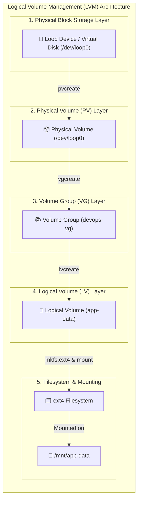
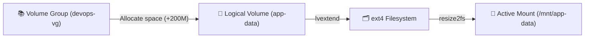

# 💾 Day 13: Linux Volume Management (LVM)

> **"In modern DevOps and cloud infrastructure, data demands grow dynamically. Hard-coding partition schemas binds your application to static hardware constraints. Linux Volume Management (LVM) provides an essential virtualization layer that decouples physical drives from file structures, permitting zero-downtime storage expansions and granular allocation on-the-fly."**

Welcome to Day 13 of the **90 Days of DevOps** challenge! Today, we dive deep into **Linux Volume Management (LVM)**, an industry-standard storage framework that allows administrators to aggregate physical hard disks into elastic, dynamic pools of storage, create logical volumes, format them, mount them, and resize them on-demand without service disruption.

---

## 📋 Lab Metadata

| Attribute | Details |
| :--- | :--- |
| **Concept** | Storage Virtualization & Dynamic Partitioning |
| **Operating System** | Ubuntu Server / Debian Linux |
| **Key Framework** | LVM2 (Logical Volume Manager version 2) |
| **Key Commands** | `pvcreate`, `vgcreate`, `lvcreate`, `lvextend`, `resize2fs`, `losetup` |
| **Lab Date** | May 29, 2026 |
| **GitHub Directory** | `90DaysOfDevOps/2026/day-13/` |

---

## 🗺️ LVM Architecture & Flow Overview

LVM creates an abstraction layer between physical hardware disks and standard filesystems. The flowchart below maps the topology implemented during today's lab session, taking a raw block storage device, promoting it through the three core LVM layers, and linking it to a directory mount point:



---

## 📑 Table of Contents
1. [🛠️ Phase 0: Preparing the Lab & Loop Device](#️-phase-0-preparing-the-lab--loop-device)
2. [🔍 Phase 1: Checking Initial System Storage](#-phase-1-checking-initial-system-storage)
3. [📦 Phase 2: Creating the Physical Volume (PV)](#-phase-2-creating-the-physical-volume-pv)
4. [📚 Phase 3: Building the Volume Group (VG)](#-phase-3-building-the-volume-group-vg)
5. [📐 Phase 4: Carving out the Logical Volume (LV)](#-phase-4-carving-out-the-logical-volume-lv)
6. [🗂️ Phase 5: Formatting and Mounting the Filesystem](#️-phase-5-formatting-and-mounting-the-filesystem)
7. [⚡ Phase 6: Dynamically Extending the Logical Volume](#-phase-6-dynamically-extending-the-logical-volume)
8. [🧠 Key Takeaways & LVM Core Concepts](#-key-takeaways--lvm-core-concepts)
9. [📊 LVM Key Command Quick Reference](#-lvm-key-command-quick-reference)
10. [📢 Learn in Public & Community Engagement](#-learn-in-public--community-engagement)
11. [📸 Verification Screenshot](#-verification-screenshot)

---

## 🛠️ Phase 0: Preparing the Lab & Loop Device

In enterprise environments, you would attach a physical SSD/HDD or an AWS EBS volume (e.g., `/dev/sdb`). If you do not have a spare physical drive, we can securely simulate one by creating a **virtual loopback device** using Linux's `losetup` utility.

### 1. Elevate Privileges to Root
LVM operations interact directly with kernel device drivers and partition tables, which requires root permissions.
```bash
sudo -i
```

### 2. Create a 1GB Empty Binary File
Use the data-duplicate (`dd`) utility to create a sparse file of zeroes in `/tmp`.
```bash
dd if=/dev/zero of=/tmp/disk1.img bs=1M count=1024
```
* **Expected Terminal Output:**
  ```text
  1024+0 records in
  1024+0 records out
  1073741824 bytes (1.1 GB, 1.0 GiB) copied, 0.457892 s, 2.3 GB/s
  ```

### 3. Bind the File to a Loop Device
Link the empty binary image file to the next free loopback block device.
```bash
losetup -fP /tmp/disk1.img
```

### 4. Verify Active Loop Devices
Confirm that `/tmp/disk1.img` has been mapped successfully to a system loop device (typically `/dev/loop0`).
```bash
losetup -a
```
* **Expected Terminal Output:**
  ```text
  /dev/loop0: [66205]:2309123 (/tmp/disk1.img)
  ```

---

## 🔍 Phase 1: Checking Initial System Storage

Before establishing LVM objects, audit the state of current system block devices, physical volumes, volume groups, logical volumes, and storage mounts.

```bash
lsblk
pvs
vgs
lvs
df -h
```

* **Expected Terminal Output:**
  ```text
  $ lsblk
  NAME                      MAJ:MIN RM  SIZE RO TYPE MOUNTPOINTS
  loop0                       7:0    0    1G  0 loop 
  sda                         8:0    0   20G  0 disk 
  ├─sda1                      8:1    0    1M  0 part 
  ├─sda2                      8:2    0    2G  0 part /boot
  └─sda3                      8:3    0   18G  0 part 
    └─ubuntu--vg-ubuntu--lv 253:0    0   18G  0 lvm  /

  $ pvs
  PV         VG        Fmt  Attr PSize  PFree
  /dev/sda3  ubuntu-vg lvm2 a--  18.00g    0 

  $ vgs
  VG        #PV #LV #SN Attr   VSize  VFree
  ubuntu-vg   1   1   0 wz--n- 18.00g    0 

  $ lvs
  LV        VG        Attr       LSize  Pool Origin Data%  Meta%  Move Log Cpy%Sync Convert
  ubuntu-lv ubuntu-vg -wi-ao---- 18.00g                                                    

  $ df -h /
  Filesystem                         Size  Used Avail Use% Mounted on
  /dev/mapper/ubuntu--vg-ubuntu--lv   18G  4.2G   13G  25% /
  ```

> [!NOTE]
> The current system has an existing root volume (`ubuntu-lv` inside `ubuntu-vg` on `/dev/sda3`). Our new 1GB disk `/dev/loop0` is recognized as a clean, unpartitioned block loop device ready for LVM provisioning.

---

## 📦 Phase 2: Creating the Physical Volume (PV)

The first step in using a raw block storage device under LVM is to format and designate it as an **LVM Physical Volume (PV)**. This writes LVM descriptors and metadata sectors to the start of the disk.

### 1. Initialize the Physical Volume
```bash
pvcreate /dev/loop0
```
* **Expected Terminal Output:**
  ```text
  Physical volume "/dev/loop0" successfully created.
  ```

### 2. Verify Physical Volumes
```bash
pvs
```
* **Expected Terminal Output:**
  ```text
  PV           VG        Fmt  Attr PSize  PFree   
  /dev/loop0             lvm2 ---   1.00g    1.00g
  /dev/sda3    ubuntu-vg lvm2 a--  18.00g       0 
  ```

---

## 📚 Phase 3: Building the Volume Group (VG)

With the Physical Volume initialized, we group it into an elastic storage pool called a **Volume Group (VG)**. A VG acts as a virtual container wrapping one or more physical disks together.

### 1. Build the Volume Group
Create a new Volume Group named `devops-vg` and assign our `/dev/loop0` physical volume to it.
```bash
vgcreate devops-vg /dev/loop0
```
* **Expected Terminal Output:**
  ```text
  Volume group "devops-vg" successfully created
  ```

### 2. Verify Volume Groups
```bash
vgs
```
* **Expected Terminal Output:**
  ```text
  VG        #PV #LV #SN Attr   VSize  VFree   
  devops-vg   1   0   0 wz--n-  1.00g    1.00g
  ubuntu-vg   1   1   0 wz--n- 18.00g       0 
  ```

---

## 📐 Phase 4: Carving out the Logical Volume (LV)

A Volume Group represents raw pooled capacity. To make it usable by applications, we partition this pool into a virtual disk called a **Logical Volume (LV)**. Think of LVs as flexible software-defined partitions.

### 1. Carve out a 500MB Logical Volume
Create a Logical Volume named `app-data` with a capacity of `500M` inside the `devops-vg` volume group.
```bash
lvcreate -L 500M -n app-data devops-vg
```
* **Expected Terminal Output:**
  ```text
  Logical volume "app-data" created.
  ```

### 2. Verify Logical Volumes
```bash
lvs
```
* **Expected Terminal Output:**
  ```text
  LV        VG        Attr       LSize  Pool Origin Data%  Meta%  Move Log Cpy%Sync Convert
  app-data  devops-vg -wi-a----- 500.00m                                                    
  ubuntu-lv ubuntu-vg -wi-ao----  18.00g                                                    
  ```

---

## 🗂️ Phase 5: Formatting and Mounting the Filesystem

Now that the software-defined partition `app-data` is ready, it is exposed under `/dev/devops-vg/app-data` (or `/dev/mapper/devops--vg-app--data`). Before data can be written, it must be formatted with a standard filesystem (e.g., EXT4) and mounted to a mount point directory.

### 1. Format the Logical Volume with EXT4
```bash
mkfs.ext4 /dev/devops-vg/app-data
```
* **Expected Terminal Output:**
  ```text
  mke2fs 1.46.5 (30-Dec-2021)
  Creating filesystem with 128000 4k blocks and 32000 inodes
  Filesystem UUID: b28d31a5-8c7c-4740-84cf-d84bf2be14ae
  Superblock backups stored on blocks: 
  	32768, 98304

  Allocating group tables: done                            
  Writing inode tables: done                            
  Creating journal (4096 blocks): done
  Writing superblocks and filesystem accounting information: done
  ```

### 2. Create the Mount Directory Path
```bash
mkdir -p /mnt/app-data
```

### 3. Mount the Logical Volume
Attach the newly formatted block volume to the application mount path.
```bash
mount /dev/devops-vg/app-data /mnt/app-data
```

### 4. Audit Filesystem Disk Space Usage
```bash
df -h /mnt/app-data
```
* **Expected Terminal Output:**
  ```text
  Filesystem                        Size  Used Avail Use% Mounted on
  /dev/mapper/devops--vg-app--data  477M  2.3M  439M   1% /mnt/app-data
  ```

---

## ⚡ Phase 6: Dynamically Extending the Logical Volume

The defining superpower of LVM is its ability to perform **zero-downtime, dynamic capacity expansions**. If the application processes write extensive telemetry and `/mnt/app-data` runs close to 100% capacity, we can dynamically extend the Logical Volume and scale the underlying filesystem instantly while it is online!



### 1. Extend the Logical Volume size by +200MB
Increase the software partition size by adding 200 Megabytes of unallocated space from the `devops-vg` pool.
```bash
lvextend -L +200M /dev/devops-vg/app-data
```
* **Expected Terminal Output:**
  ```text
  Size of logical volume devops-vg/app-data changed from 500.00 MiB (125 extents) to 700.00 MiB (175 extents).
  Logical volume devops-vg/app-data successfully resized.
  ```

### 2. Extend the Filesystem Online
At this stage, the partition (`LV`) is 700MB, but the filesystem (`EXT4`) on top of it still only recognizes the original 500MB size. Resize the filesystem dynamically to cover the entire newly allocated area.
```bash
resize2fs /dev/devops-vg/app-data
```
* **Expected Terminal Output:**
  ```text
  resize2fs 1.46.5 (30-Dec-2021)
  Filesystem at /dev/devops-vg/app-data is mounted on /mnt/app-data; on-line resizing required
  old_desc_blocks = 1, new_desc_blocks = 1
  The filesystem on /dev/devops-vg/app-data is now 179200 (4k) blocks long.
  ```

### 3. Verify Resized Space Availability
Check if the filesystem capacity has grown and is ready for usage immediately without rebooting or unmounting.
```bash
df -h /mnt/app-data
```
* **Expected Terminal Output:**
  ```text
  Filesystem                        Size  Used Avail Use% Mounted on
  /dev/mapper/devops--vg-app--data  671M  2.5M  626M   1% /mnt/app-data
  ```

> [!TIP]
> Notice how the usable storage grew seamlessly from **477M** to **671M** with a single online command sequence! This capability prevents emergency application maintenance windows when database or log storage runs low.

---

## 🧠 Key Takeaways & LVM Core Concepts

Through this lab, I mastered three critical infrastructure management concepts:

1. **Hardware Decoupling (Software-Defined Storage):** Traditional partitions are bound strictly to continuous physical blocks on a single disk. LVM decouples this boundary completely. An LVM Volume Group can span multiple physical SSDs, allowing a single logical partition to be much larger than any single physical drive.
2. **On-Line Scalability (Zero-Downtime Operations):** Filesystems can be dynamically grown while actively mounted and serving traffic. This eliminates maintenance windows, keeping production APIs up and running during unexpected disk depletion scenarios.
3. **Layered Isolation and Extensibility:** By standardizing operations across Physical Volumes (PV), Volume Groups (VG), and Logical Volumes (LV), DevOps engineers can cleanly orchestrate tiered backup workflows, standard swap operations, and fast volume snapshotting.

---

## 📊 LVM Key Command Quick Reference

| Command | Category | Purpose | Production Use Case Example |
| :--- | :--- | :--- | :--- |
| `pvcreate <dev>` | Physical Volume | Formats a raw block device for LVM. | Preparing an attached AWS EBS `/dev/xvdf` volume. |
| `pvs` / `pvdisplay` | Physical Volume | Displays status and metadata of PVs. | Auditing allocated physical space on local SSDs. |
| `vgcreate <name> <pv>`| Volume Group | Bundles PVs into an aggregate pool. | Creating a collective high-performance pool `prod-data-vg`. |
| `vgs` / `vgdisplay` | Volume Group | Audits the capacity boundaries of pools. | Checking how much free pool space remains to assign to LVs. |
| `lvcreate -L <sz> -n <n>`| Logical Volume | Carves a virtual partition out of a pool. | Allocating a `100G` database volume `db-vol` inside `prod-vg`. |
| `lvs` / `lvdisplay` | Logical Volume | Shows details of active logical volumes. | Verifying target disk volumes before resizing. |
| `lvextend -L +<sz> <lv>`| Scaling | Expands the logical volume boundaries. | Resizing a log storage disk immediately under heavy load. |
| `resize2fs <lv>` | Scaling | Resizes the underlying ext4 filesystem. | Forcing active system filesystem layers to match expanded LVs. |

---

Day 13 Complete 💾

**Happy Learning!**
*Trainer: Shubham Londhe*
*Study Notes compiled by: Rajat Mehta*