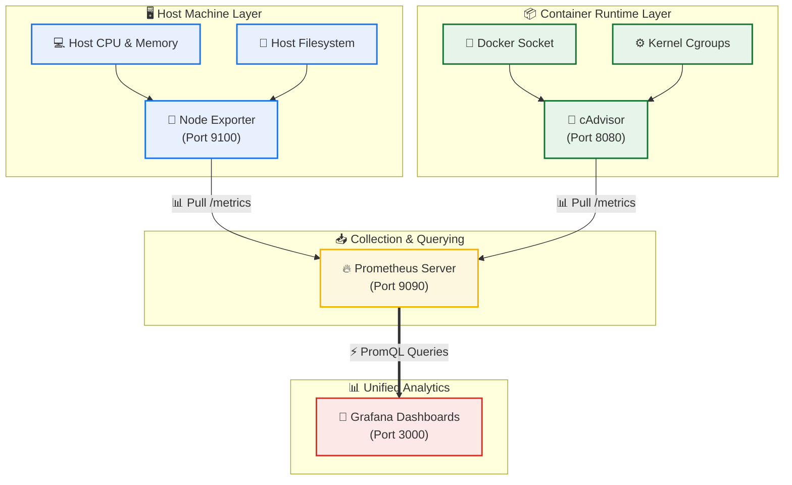

# Day 74: Advanced Metrics Collection and Visualization -- Node Exporter, cAdvisor, and Grafana Dashboards

[](https://prometheus.io)
[](https://grafana.com)
[](https://docker.com)
[](https://github.com/rajatmehta2/90DaysOfDevOps)
[](https://github.com/rajatmehta2/90DaysOfDevOps)

Welcome to **Day 74** of the **90 Days of DevOps Journey**! 🚀 

On [Day 73](../day-73/day-73-observability-prometheus.md), you successfully bootstrapped a containerized Prometheus server and configured it to scrape metrics from itself and a sample notes application. However, Prometheus was only monitoring applications. In production, observability must cover two critical layers:
1. **The Host Infrastructure**: The physical or virtual machine's health (CPU, RAM, Disk, Network).
2. **The Container Runtime**: The resource footprint of each individual running Docker container.

Today, we will expand our observability stack by adding **Node Exporter** (for host-level metrics) and Google's **cAdvisor** (for container-level metrics). We will then introduce **Grafana**, the industry-standard visualization engine, to query Prometheus and build rich, production-grade dashboards. Lastly, we will automate datasource configurations using GitOps-friendly **YAML provisioning**.

---

## 🏗️ Observability Stack Data Flow

The diagram below illustrates how telemetry streams flow from the host and Docker containers through specialized exporters into Prometheus, and are ultimately queried and visualized by Grafana:



---

## 🔌 Section 1: Host Metrics Collection with Node Exporter

**Node Exporter** is an official Prometheus exporter that queries Linux kernel statistics (CPU, memory, disk, network, filesystems) and exposes them as a text-formatted Prometheus endpoint on port `9100`.

### Step 1: Add Node Exporter to `docker-compose.yml`
Open the `docker-compose.yml` file from Day 73 and add the `node-exporter` service:

```yaml
  node-exporter:
    image: prom/node-exporter:latest
    container_name: node-exporter
    ports:
      - "9100:9100"
    volumes:
      - /proc:/host/proc:ro
      - /sys:/host/sys:ro
      - /:/rootfs:ro
    command:
      - '--path.procfs=/host/proc'
      - '--path.sysfs=/host/sys'
      - '--path.rootfs=/rootfs'
      - '--collector.filesystem.mount-points-exclude=^/(sys|proc|dev|host|etc)($$|/)'
    restart: unless-stopped
```

> [!NOTE]
> **Why are these read-only (`ro`) volume mounts critical?**
> *   `/proc` maps kernel-level data and running process info to Node Exporter.
> *   `/sys` provides detailed hardware and driver configurations (cgroups, temperature, etc.).
> *   `/` exposes host filesystem partitions so Node Exporter can read disk usage.
> Nodes are mounted as read-only (`ro`) to ensure Node Exporter never modifies any host configurations.

### Step 2: Configure Prometheus Scrape Job
Edit your `prometheus.yml` configuration to register Node Exporter as a scraping target:

```yaml
  - job_name: "node-exporter"
    static_configs:
      - targets: ["node-exporter:9100"]
```

### Step 3: Spin Up and Verify
Restart the Docker Compose stack to run the new exporter:

```bash
docker compose up -d
```

#### Terminal Execution Log:
```text
[+] Running 3/3
 ✔ Container prometheus     Running                                                                      0.0s
 ✔ Container notes-app      Running                                                                      0.0s
 ✔ Container node-exporter  Started                                                                      0.3s
```

Verify that Node Exporter is successfully scraping and exposing metrics locally using `curl`:

```bash
curl http://localhost:9100/metrics | head -20
```

#### Simulated Terminal Output:
```text
# HELP go_gc_duration_seconds A summary of the pause duration of garbage collection cycles.
# TYPE go_gc_duration_seconds summary
go_gc_duration_seconds{quantile="0"} 5.48e-06
go_gc_duration_seconds{quantile="0.25"} 8.35e-06
go_gc_duration_seconds{quantile="0.5"} 1.42e-05
go_gc_duration_seconds{quantile="0.75"} 2.38e-05
go_gc_duration_seconds{quantile="1"} 0.0001048
go_gc_duration_seconds_sum 0.0004218
go_gc_duration_seconds_count 14
# HELP go_goroutines Number of goroutines that currently exist.
# TYPE go_goroutines gauge
go_goroutines 8
# HELP go_info Information about the Go environment.
# TYPE go_info gauge
go_info{version="go1.21.5"} 1
```

---

### ⚡ Diagnostic Host PromQL Queries
Navigate to `http://localhost:9090/graph` and test these useful PromQL queries to check your host infrastructure:

#### 1. CPU Idle Percentage per Core
Shows the percentage of CPU cores currently resting idle.
```promql
node_cpu_seconds_total{mode="idle"}
```

#### 2. Host Memory Usage (Total vs Available)
Inspect the exact available and total RAM bytes on the host.
```promql
node_memory_MemTotal_bytes
node_memory_MemAvailable_bytes
```

#### 3. Memory Usage Percentage
Calculates the current memory utilization as an easy-to-read percentage.
```promql
(1 - node_memory_MemAvailable_bytes / node_memory_MemTotal_bytes) * 100
```

#### 4. Filesystem Storage Consumption %
Tracks the hard drive capacity consumed on the root partition.
```promql
(1 - node_filesystem_avail_bytes{mountpoint="/"} / node_filesystem_size_bytes{mountpoint="/"}) * 100
```

#### 5. Network Rx Ingress Bytes Rate
Calculates the average incoming network traffic throughput per second over a 5-minute window.
```promql
rate(node_network_receive_bytes_total[5m])
```

---

## 🔌 Section 2: Container Metrics Collection with cAdvisor

**cAdvisor** (Container Advisor) is a lightweight agent developed by Google that records resource usage and performance metrics of running containers on the host machine.

### Step 1: Add cAdvisor to `docker-compose.yml`
Add the cAdvisor service. To let cAdvisor fetch metadata about running containers, we mount the host's Docker socket daemon:

```yaml
  cadvisor:
    image: gcr.io/cadvisor/cadvisor:v0.49.1
    container_name: cadvisor
    ports:
      - "8080:8080"
    volumes:
      - /var/run/docker.sock:/var/run/docker.sock:ro
      - /sys:/sys:ro
      - /var/lib/docker/:/var/lib/docker:ro
    restart: unless-stopped
```

> [!NOTE]
> *   `/var/run/docker.sock` grants cAdvisor access to the local Docker daemon to inspect container names, metadata, and status.
> *   `/sys` reads cgroups stats where Docker manages system resource allocation.
> *   `/var/lib/docker/` monitors container root filesystems and disk write activity.

### Step 2: Configure Prometheus Scrape Job
Add the cAdvisor scrap config in `prometheus.yml`:

```yaml
  - job_name: "cadvisor"
    static_configs:
      - targets: ["cadvisor:8080"]
```

### Step 3: Apply Changes & Verify
Deploy the updated configuration:

```bash
docker compose up -d
```

#### Terminal Execution Log:
```text
[+] Running 4/4
 ✔ Container prometheus     Running                                                                      0.0s
 ✔ Container notes-app      Running                                                                      0.0s
 ✔ Container node-exporter  Running                                                                      0.0s
 ✔ Container cadvisor       Started                                                                      0.4s
```

You can now open your browser and navigate to `http://localhost:8080` to see the cAdvisor Web UI, listing metrics per container.

---

### ⚡ Container Diagnostic PromQL Queries
Verify these container-level queries in the Prometheus UI:

#### 1. Per-Container CPU Usage (Rate)
Calculates CPU core consumption rates across individual active containers.
```promql
rate(container_cpu_usage_seconds_total{name!=""}[5m])
```

#### 2. Per-Container Memory Consumption (MB)
Retrieves the memory footprint of active Docker containers in Megabytes.
```promql
container_memory_usage_bytes{name!=""} / 1024 / 1024
```

#### 3. Top 3 Containers by Memory Footprint
Isolates the top 3 most resource-intensive container workloads by memory usage.
```promql
topk(3, container_memory_usage_bytes{name!=""})
```

> [!TIP]
> The filter `{name!=""}` is critical. It removes cgroup system-level nodes, aggregate runtimes, and returns metrics exclusively for your named containers (e.g., `cadvisor`, `prometheus`, `notes-app`).

---

### ⚖️ Node Exporter vs. cAdvisor
Understanding the distinct capabilities of both exporters is key to architecting standard observability pipelines:

| Feature/Metric | Node Exporter | cAdvisor |
| :--- | :--- | :--- |
| **Primary Scope** | **Physical/Virtual Host System** | **Docker Containers & Runtimes** |
| **Data Source** | Host kernel paths (`/proc`, `/sys`, disk drives). | Cgroups, namespaces, and the Docker engine socket. |
| **Metrics Gathered** | CPU temperature, hardware health, OS updates, physical disk IOPS. | Resource limits, container restarts, internal process counts per container. |
| **Use Case Scenario** | *"Is my underlying AWS EC2 instance running out of total storage?"* | *"Why is container X bottlenecked and throttling CPU cycles?"* |

---

## 🎨 Section 3: Setting Up Grafana

**Grafana** is the visualization engine of our observability stack. It will connect to the Prometheus backend to build stunning dashboards and charts.

### Step 1: Add Grafana to `docker-compose.yml`
Add the Grafana service. We will define an admin credential set and mount a persistent data volume:

```yaml
  grafana:
    image: grafana/grafana-enterprise:latest
    container_name: grafana
    ports:
      - "3000:3000"
    volumes:
      - grafana_data:/var/lib/grafana
    environment:
      - GF_SECURITY_ADMIN_USER=admin
      - GF_SECURITY_ADMIN_PASSWORD=admin123
    restart: unless-stopped
```

At the bottom of `docker-compose.yml`, declare the required volume structures:

```yaml
volumes:
  prometheus_data:
  grafana_data:
```

### Step 2: Spin Up and Connect
Start Grafana:

```bash
docker compose up -d
```

#### Terminal Execution Log:
```text
[+] Running 6/6
 ✔ Network observability-stack_default    Created                                                        0.0s
 ✔ Volume observability-stack_grafana_d*  Created                                                        0.0s
 ✔ Container prometheus                   Running                                                        0.0s
 ✔ Container node-exporter                Running                                                        0.0s
 ✔ Container cadvisor                     Running                                                        0.0s
 ✔ Container grafana                      Started                                                        0.5s
```

1. Navigate to `http://localhost:3000`.
2. Log in using `admin` / `admin123`.
3. Add Prometheus as your Datasource:
   * **Connections** > **Data Sources** > **Add data source**.
   * Choose **Prometheus**.
   * Set the HTTP URL to `http://prometheus:9090` *(Note: Since Grafana is in the same Docker network as Prometheus, we use the container name `prometheus` instead of `localhost`)*.
   * Scroll down and click **Save & Test**. You should see a green success alert: *"Successfully queried the Prometheus API"*.

---

## 📊 Section 4: Building a Custom Grafana Dashboard

Let's design a professional **DevOps Observability Overview** dashboard containing 5 custom panels to visualize host and container metrics.

### Step-by-Step Dashboard Setup
1. In Grafana's left navigation sidebar, go to **Dashboards** > **New** > **New Dashboard** > **Add Visualization**.
2. Select your **Prometheus** datasource.
3. Configure the following 5 panels:

---

### Panel 1: Host CPU Usage %
* **Query (PromQL)**: 
  ```promql
  100 - (avg(rate(node_cpu_seconds_total{mode="idle"}[5m])) * 100)
  ```
* **Visualization**: **Gauge**
* **Title**: `CPU Usage %`
* **Settings**: Under panel properties, set color thresholds: Green (`< 60`), Yellow (`60 - 80`), Red (`>= 80`).

### Panel 2: Host Memory Usage %
* **Query (PromQL)**: 
  ```promql
  (1 - node_memory_MemAvailable_bytes / node_memory_MemTotal_bytes) * 100
  ```
* **Visualization**: **Gauge**
* **Title**: `Memory Usage %`
* **Settings**: Set threshold boundaries similar to CPU.

### Panel 3: Container CPU Usage (Time Series)
* **Query (PromQL)**: 
  ```promql
  rate(container_cpu_usage_seconds_total{name!=""}[5m]) * 100
  ```
* **Visualization**: **Time series**
* **Title**: `Container CPU Usage`
* **Legend (Options)**: Set display schema to `{{name}}` or `{{container_label_com_docker_compose_service}}` to display the human-readable service name.

### Panel 4: Container Memory Footprint
* **Query (PromQL)**: 
  ```promql
  container_memory_usage_bytes{name!=""} / 1024 / 1024
  ```
* **Visualization**: **Bar chart**
* **Title**: `Container Memory (MB)`
* **Legend**: `{{name}}`

### Panel 5: Root Disk Storage Usage
* **Query (PromQL)**: 
  ```promql
  (1 - node_filesystem_avail_bytes{mountpoint="/"} / node_filesystem_size_bytes{mountpoint="/"}) * 100
  ```
* **Visualization**: **Stat**
* **Title**: `Disk Usage %`

Save the dashboard with the name **"DevOps Observability Overview"**.

---

## ⚙️ Section 5: Auto-Provisioning Datasources via YAML

Configuring datasources manually through the UI is error-prone and not reproducible. A GitOps-focused approach leverages **Grafana Provisioning**, allowing us to define datasources as configuration files.

### Step 1: Create Provisioning Directory Structure
Run the following commands to initialize the provisioning directories:

```bash
mkdir -p grafana/provisioning/datasources
mkdir -p grafana/provisioning/dashboards
```

### Step 2: Define Datasources Configuration
Create a new file `grafana/provisioning/datasources/datasources.yml`:

```yaml
apiVersion: 1

datasources:
  - name: Prometheus
    type: prometheus
    access: proxy
    url: http://prometheus:9090
    isDefault: true
    editable: false
```

### Step 3: Mount Provisioning Directory in Docker Compose
Update your Grafana service definition in `docker-compose.yml` to mount the local provisioning directory:

```yaml
  grafana:
    image: grafana/grafana-enterprise:latest
    container_name: grafana
    ports:
      - "3000:3000"
    volumes:
      - grafana_data:/var/lib/grafana
      - ./grafana/provisioning:/etc/grafana/provisioning
    environment:
      - GF_SECURITY_ADMIN_USER=admin
      - GF_SECURITY_ADMIN_PASSWORD=admin123
    restart: unless-stopped
```

### Step 4: Restart Grafana
Recreate the Grafana container to mount the provisioning volumes:

```bash
docker compose up -d grafana
```

#### Terminal Execution Log:
```text
[+] Running 1/1
 ✔ Container grafana  Started                                                                            0.4s
```

> [!TIP]
> Navigate to **Connections** > **Data Sources** in Grafana. The `Prometheus` datasource will be present and pre-configured. Since `editable: false` was specified in the YAML configuration, this setting cannot be accidentally deleted or modified through the UI.

---

### 💡 Why Provision via YAML?
1. **Infrastructure as Code (IaC)**: Keep configurations in Git to trace changes over time.
2. **Disaster Recovery**: If the Grafana container data volume is deleted, the server spins back up with all connections fully configured.
3. **Automated Deployments**: Allows you to easily deploy pre-configured Grafana instances across staging, testing, and production environments.

---

## 🚀 Section 6: Importing Community Dashboards

Instead of building every dashboard from scratch, the Grafana community maintains pre-built dashboard templates.

### 🔌 Dashboard 1: Node Exporter Full (ID: `1860`)
This is the gold standard dashboard for host infrastructure monitoring.
1. In Grafana, click the `+` sign in the top-right corner or go to **Dashboards** > **New** > **Import**.
2. Under **Import via grafana.com**, enter ID `1860` and click **Load**.
3. Choose your auto-provisioned **Prometheus** datasource.
4. Click **Import**.

This dashboard visualizes CPU performance, RAM, network stats, system load, disk IOPs, and core temperatures out of the box.

### 🐳 Dashboard 2: Docker Containers Monitoring (ID: `193`)
Import community dashboard ID `193` using cAdvisor metrics:
1. Repeat the import process with ID `193`.
2. Select your **Prometheus** datasource.
3. Click **Import**.

This dashboard lists all running containers, displaying CPU/memory usage, network throughput, and aggregate disk reads/writes.

---

## 🛠️ Complete Configuration Blueprint

Here are the complete, production-ready system configuration blueprints.

### 1. Final `docker-compose.yml`
```yaml
services:
  prometheus:
    image: prom/prometheus:latest
    container_name: prometheus
    ports:
      - "9090:9090"
    volumes:
      - ./prometheus.yml:/etc/prometheus/prometheus.yml
      - prometheus_data:/prometheus
    command:
      - '--config.file=/etc/prometheus/prometheus.yml'
      - '--storage.tsdb.retention.time=30d'
      - '--storage.tsdb.retention.size=1GB'
    restart: unless-stopped

  node-exporter:
    image: prom/node-exporter:latest
    container_name: node-exporter
    ports:
      - "9100:9100"
    volumes:
      - /proc:/host/proc:ro
      - /sys:/host/sys:ro
      - /:/rootfs:ro
    command:
      - '--path.procfs=/host/proc'
      - '--path.sysfs=/host/sys'
      - '--path.rootfs=/rootfs'
      - '--collector.filesystem.mount-points-exclude=^/(sys|proc|dev|host|etc)($$|/)'
    restart: unless-stopped

  cadvisor:
    image: gcr.io/cadvisor/cadvisor:v0.49.1
    container_name: cadvisor
    ports:
      - "8080:8080"
    volumes:
      - /var/run/docker.sock:/var/run/docker.sock:ro
      - /sys:/sys:ro
      - /var/lib/docker/:/var/lib/docker:ro
    restart: unless-stopped

  grafana:
    image: grafana/grafana-enterprise:latest
    container_name: grafana
    ports:
      - "3000:3000"
    volumes:
      - grafana_data:/var/lib/grafana
      - ./grafana/provisioning:/etc/grafana/provisioning
    environment:
      - GF_SECURITY_ADMIN_USER=admin
      - GF_SECURITY_ADMIN_PASSWORD=admin123
    restart: unless-stopped

  notes-app:
    image: trainwithshubham/notes-app:latest
    container_name: notes-app
    ports:
      - "8000:8000"
    restart: unless-stopped

volumes:
  prometheus_data:
  grafana_data:
```

### 2. Final `prometheus.yml`
```yaml
global:
  scrape_interval: 15s
  evaluation_interval: 15s

scrape_configs:
  - job_name: "prometheus"
    static_configs:
      - targets: ["localhost:9090"]

  - job_name: "notes-app"
    static_configs:
      - targets: ["notes-app:8000"]

  - job_name: "node-exporter"
    static_configs:
      - targets: ["node-exporter:9100"]

  - job_name: "cadvisor"
    static_configs:
      - targets: ["cadvisor:8080"]
```

Check the status of all container services:
```bash
docker compose ps
```

#### Terminal Execution Log:
```text
NAME            IMAGE                              COMMAND                  SERVICE         CREATED         STATUS         PORTS
cadvisor        gcr.io/cadvisor/cadvisor:v0.49.1   "/usr/bin/cadvisor -…"   cadvisor        6 minutes ago   Up 6 minutes   0.0.0.0:8080->8080/tcp
grafana         grafana/grafana-enterprise:latest  "/run.sh"                grafana         6 minutes ago   Up 6 minutes   0.0.0.0:3000->3000/tcp
node-exporter   prom/node-exporter:latest          "/bin/node_exporter …"   node-exporter   6 minutes ago   Up 6 minutes   0.0.0.0:9100->9100/tcp
notes-app       trainwithshubham/notes-app:latest  "python3 manage.py r…"   notes-app       6 minutes ago   Up 6 minutes   0.0.0.0:8000->8000/tcp
prometheus      prom/prometheus:latest             "/bin/prometheus --c…"   prometheus      6 minutes ago   Up 6 minutes   0.0.0.0:9090->9090/tcp
```

---

## 📸 Section 7: Visual Verification & Screenshots

Below are the designated verification steps showing our Observability metrics stack and visual dashboards in action.

### 1. Prometheus Scraping Target Verification
The Prometheus Web UI **Status > Targets** page proving all 4 configured container scraping jobs (`prometheus`, `notes-app`, `node-exporter`, `cadvisor`) are reporting state **UP**:


### 2. Custom Grafana Dashboard (DevOps Observability Overview)
Showing real-time Gauges, Time-Series trends, Bar Charts, and Stat indicators monitoring both host system health and Docker containers:


### 3. Community Dashboard: Node Exporter Full (ID 1860)
The comprehensive community dashboard displaying deep system-level analytics of the host machine:


### 4. Community Dashboard: Docker Containers via cAdvisor (ID 193)
Showing resource usage metrics collected by cAdvisor across individual running containers:


---

## 🏆 Key Practice Takeaways & Summary

1. **Host vs Container Monitoring**: Use Node Exporter to monitor the host system's hardware, and cAdvisor to inspect the container layer.
2. **Unified Visualization**: Grafana aggregates Prometheus data sources into a single dashboard pane.
3. **Infrastructure as Code (IaC) for Dashboards/Datasources**: Automatically configuring datasources through YAML files enables reproducible monitoring stack deployments.
4. **Community Ecosystem**: Reusing verified community dashboards (like `1860` and `193`) saves hours of time.

### 📚 Day 74 Milestones Completed
- [x] Deployed Node Exporter to extract host machine metrics.
- [x] Deployed cAdvisor to capture Docker container resource statistics.
- [x] Defined and tested complex PromQL queries for both host and container layers.
- [x] Launched Grafana and unified the data access path from Prometheus.
- [x] Constructed a custom 5-panel dashboard from scratch.
- [x] Automated Grafana datasource configuration using YAML provisioning.
- [x] Imported community dashboards `1860` (Node Exporter) and `193` (cAdvisor) to inspect the stack.

---

**Happy Learning!**
*Trainer: Shubham Londhe*
*Study Notes compiled by: Rajat Mehta*