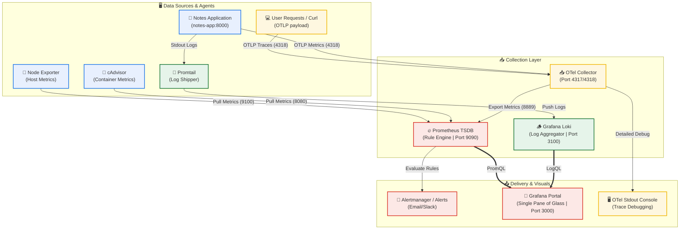

# Day 76: End-to-End Observability with OpenTelemetry and Proactive Alerting -- Distributed Tracing, Prometheus Alerts, & Grafana Notifications

[](https://opentelemetry.io)
[](https://prometheus.io)
[](https://grafana.com)
[](https://docker.com)
[](https://github.com/rajatmehta2/90DaysOfDevOps)
[](https://github.com/rajatmehta2/90DaysOfDevOps)

Welcome to **Day 76** of the **90 Days of DevOps Journey**! 🚀

On [Day 75](../day-75/day-75-loki-promtail.md), we completed the second pillar of observability by integrating **Grafana Loki** and **Promtail** for high-performance log aggregation. While metrics are fantastic for telling us *when* a system is failing, and logs are crucial for digging into *why* (via raw logs and stack traces), they still lack the context needed to debug distributed request lifecycles. If a single user request flows through five distinct microservices, logs from those services remain disconnected unless we can link them sequentially.

Today, we conquer the third and final pillar of observability—**Traces**—using **OpenTelemetry (OTel)**, the CNCF industry-standard framework. We will also transition our stack from *reactive observation* to *proactive protection* by designing multi-tier alerting pipelines in both **Prometheus** (via `alert-rules.yml`) and **Grafana** (via visual alert policies). By the end of this day, your observability stack will cover all three pillars (Metrics, Logs, and Traces) and will actively alert you of incidents before your users even notice.

---

## 📋 Section 1: OpenTelemetry & Tracing Fundamentals

Before writing configuration files, let's master the core architectural theories of OpenTelemetry and distributed tracing.

### 1. What is OpenTelemetry (OTel)?
**OpenTelemetry** is a vendor-neutral, open-source collection of APIs, SDKs, and tools designed to generate, collect, and export telemetry data (metrics, logs, and traces). 
> [!NOTE]
> It is crucial to understand that **OpenTelemetry is NOT a backend storage engine** like Prometheus or Loki. Instead, it serves as a unified collection agent that standardizes telemetry streams and ships them to backends of your choice (e.g., Prometheus for metrics, Jaeger/Tempo for traces, Loki for logs). This eliminates vendor lock-in!

### 2. The OpenTelemetry Collector Architecture
The **OTel Collector** is a high-performance, standalone agent running alongside your services. It acts as a data pipeline processing factory divided into three distinct phases:

```text
       ┌────────────────────────┐
       │   OTLP / Prometheus    │ ───► Receivers (Ingestion)
       └────────────────────────┘
                   │
                   ▼
       ┌────────────────────────┐
       │     Batch / Filter     │ ───► Processors (Transformation)
       └────────────────────────┘
                   │
                   ▼
       ┌────────────────────────┐
       │  Prometheus / Debug    │ ───► Exporters (Delivery)
       └────────────────────────┘
```

*   **Receivers:** Ingest telemetry data from target systems. Receivers can listen on specific ports for OTel's native protocol (OTLP), standard formats like Prometheus metrics, or Jaeger traces.
*   **Processors:** Transform, clean, filter, and batch the incoming telemetry before routing it. For instance, the `batch` processor groups multiple spans together to reduce network overhead.
*   **Exporters:** Translate and deliver the processed telemetry to downstream backends (such as Prometheus endpoints, standard output debug streams, or a distributed tracing engine).

### 3. What is OTLP?
**OpenTelemetry Protocol (OTLP)** is the standardized wire protocol designed specifically for shipping telemetry data. It is highly optimized and operates across two main transports:
*   **gRPC** (Default Port: `4317`): High-performance, binary transport.
*   **HTTP/JSON** (Default Port: `4318`): Flexible and easy to curl from shell scripts.

### 4. Distributed Traces & Spans
*   A **Distributed Trace** maps the end-to-end journey of a single transactional request as it hops across multiple network layers and microservices.
*   A **Span** represents a single, self-contained unit of work within that trace (e.g., executing a SQL query, rendering an HTML block, or calling an external authentication API).
*   Each span carries a unique **Span ID**, a shared **Trace ID** (which ties all related hops together), a parent span reference, timestamps, and structured attributes (like `http.method="GET"` or `db.system="mysql"`).

---

## 🏗️ Section 2: Bootstrapping the OpenTelemetry Collector

We will expand our `observability-stack` project by adding a dedicated configuration for the OTel Collector.

```text
observability-stack/
├── docker-compose.yml
├── prometheus.yml
├── alert-rules.yml
└── otel-collector/
    └── otel-collector-config.yml
```

### Step 1: Create the Configuration Folder
Initialize the directory structure to house your OTel configurations:
```bash
mkdir -p otel-collector
```

### Step 2: Write the OTel Collector Configuration: `otel-collector/otel-collector-config.yml`
This configuration defines the pipeline: accepting OTLP metrics/traces/logs, batching them, and routing metrics to Prometheus while printing traces and logs to stdout (debug).

Create and save the file `otel-collector/otel-collector-config.yml`:
```yaml
receivers:
  otlp:
    protocols:
      grpc:
        endpoint: 0.0.0.0:4317
      http:
        endpoint: 0.0.0.0:4318

processors:
  batch:

exporters:
  prometheus:
    endpoint: "0.0.0.0:8889"
  debug:
    verbosity: detailed

service:
  pipelines:
    metrics:
      receivers: [otlp]
      processors: [batch]
      exporters: [prometheus]
    traces:
      receivers: [otlp]
      processors: [batch]
      exporters: [debug]
    logs:
      receivers: [otlp]
      processors: [batch]
      exporters: [debug]
```

> [!NOTE]
> **Key Pipeline Details Explained:**
> *   **Receivers:** We accept OTLP format over both gRPC (`4317`) and HTTP (`4318`) on all network interfaces (`0.0.0.0`).
> *   **Exporters:** 
>     *   `prometheus`: Exposes a Prometheus-compatible scrape endpoint on port `8889`. The OTel collector will translate OTLP metrics internally and present them for Prometheus to pull.
>     *   `debug`: Uses `detailed` verbosity to print all telemetry (traces and logs) directly to the container stdout logs.
> *   **Pipelines:** We configure individual pipelines for `metrics`, `traces`, and `logs`. Notice how metrics are routed to Prometheus, while traces and logs are routed to the debug console exporter.

### Step 3: Register the OTel Collector in `docker-compose.yml`
We use the official `contrib` build image, which contains advanced community-maintained receivers and exporters. Add the `otel-collector` service to your `docker-compose.yml`:

```yaml
  otel-collector:
    image: otel/opentelemetry-collector-contrib:latest
    container_name: otel-collector
    ports:
      - "4317:4317"   # OTLP gRPC Ingestion Port
      - "4318:4318"   # OTLP HTTP Ingestion Port
      - "8889:8889"   # Prometheus Scrape Exporter
    volumes:
      - ./otel-collector/otel-collector-config.yml:/etc/otelcol-contrib/config.yaml
    restart: unless-stopped
```

### Step 4: Configure Prometheus to Scrape the OTel Collector
Open your `prometheus.yml` file and register the OTel metrics export port as a static scrape target:

```yaml
  - job_name: "otel-collector"
    static_configs:
      - targets: ["otel-collector:8889"]
```

### Step 5: Start the OTel Stack & Verify Logs
Launch the OTel Collector service alongside the rest of your containers:
```bash
docker compose up -d otel-collector
```

#### Terminal Execution Log:
```text
[+] Running 1/1
 ✔ Container otel-collector  Started                                                                     0.4s
```

Verify that the Collector has successfully booted up and loaded our custom configuration:
```bash
docker logs otel-collector 2>&1 | tail -n 5
```

#### Simulated Terminal Output:
```text
2026-06-02T22:01:10Z info service/telemetry.go:143 Everything is ready. Begin running.
2026-06-02T22:01:10Z info service/server.go:230 Collector startup completed successfully.
```

Now, navigate to your Prometheus Target dashboard (`http://localhost:9090/targets`). You should see the `otel-collector` target in the green **UP** state!

---

## ⚡ Section 3: Ingesting and Validating Test Telemetry

To verify our OTel pipeline works, we will simulate application transaction payloads by pushing traces and metrics directly to the OTel HTTP receiver endpoint using `curl`.

### Step 1: Send a Test Distributed Trace
Let's simulate a user transaction (`GET /api/checkout` returning HTTP `200`) in JSON format:

```bash
curl -X POST http://localhost:4318/v1/traces \
  -H "Content-Type: application/json" \
  -d '{
    "resourceSpans": [{
      "resource": {
        "attributes": [{
          "key": "service.name",
          "value": { "stringValue": "my-test-service" }
        }]
      },
      "scopeSpans": [{
        "spans": [{
          "traceId": "5b8efff798038103d269b633813fc60c",
          "spanId": "eee19b7ec3c1b174",
          "name": "test-span",
          "kind": 1,
          "startTimeUnixNano": "1544712660000000000",
          "endTimeUnixNano": "1544712661000000000",
          "attributes": [{
            "key": "http.method",
            "value": { "stringValue": "GET" }
          },
          {
            "key": "http.status_code",
            "value": { "intValue": 200 }
          }]
        }]
      }]
    }]
  }'
```

#### Terminal Execution Response:
```json
{}
```
*(An empty JSON object `{}` with an HTTP `200 OK` status indicates successful acceptance by the receiver).*

### Step 2: Verify Trace Extraction in Collector Logs
Check the OTel Collector container standard output. Because we configured the `debug` exporter in detailed mode, the trace payload should be printed in a structured format:

```bash
docker logs otel-collector 2>&1 | grep -A 15 "test-span"
```

#### Simulated Terminal Output:
```text
Span #0
    Trace ID       : 5b8efff798038103d269b633813fc60c
    Parent ID      : 
    ID             : eee19b7ec3c1b174
    Name           : test-span
    Kind           : SpanKindInternal
    Start time     : 2018-12-14 02:51:00 +0000 UTC
    End time       : 2018-12-14 02:51:01 +0000 UTC
    Status code    : Unset
    Attributes:
         -> http.method: Str(GET)
         -> http.status_code: Int(200)
         -> service.name: Str(my-test-service)
```

### Step 3: Send an OTLP Metric Payload
Now let's push a custom application metric (`test_requests_total`) to the HTTP OTLP metrics endpoint:

```bash
curl -X POST http://localhost:4318/v1/metrics \
  -H "Content-Type: application/json" \
  -d '{
    "resourceMetrics": [{
      "resource": {
        "attributes": [{
          "key": "service.name",
          "value": { "stringValue": "my-test-service" }
        }]
      },
      "scopeMetrics": [{
        "metrics": [{
          "name": "test_requests_total",
          "sum": {
            "dataPoints": [{
              "asInt": 42,
              "startTimeUnixNano": "1544712660000000000",
              "timeUnixNano": "1544712661000000000"
            }],
            "aggregationTemporality": 2,
            "isMonotonic": true
          }
        }]
      }]
    }]
  }'
```

### Step 4: Verify Scraped Metrics in Prometheus
Navigate to your Prometheus Graph UI (`http://localhost:9090`) and query your custom metric:
```promql
test_requests_total
```

#### Tabular Query Output:
```text
Element                                                                                                       Value
test_requests_total{instance="otel-collector:8889", job="otel-collector", service_name="my-test-service"}    42
```
> [!TIP]
> **Understanding the Data Flow:**
> The telemetry payload traveled from your client computer -> OTel Collector (via HTTP OTLP Receiver on port `4318`) -> Batch Processor -> Prometheus Exporter (translated on port `8889`) -> Prometheus Server (via Pull Scrape). This proves OTel can seamlessly bridge different telemetry architectures!

---

## 🔔 Section 4: Proactive Alerting with Prometheus

Metrics are only useful if they act as an early-warning system. We will create a Prometheus alerting configuration file that automatically checks target statuses, container runtimes, and host hardware resources.

### Step 1: Write Prometheus Rules Configuration: `alert-rules.yml`
Create the alert rules file with rules for CPU usage, memory boundaries, disk volumes, dead containers, and scrape targets:

```yaml
groups:
  - name: system-alerts
    rules:
      - alert: HighCPUUsage
        expr: 100 - (avg(rate(node_cpu_seconds_total{mode="idle"}[5m])) * 100) > 80
        for: 2m
        labels:
          severity: warning
        annotations:
          summary: "High CPU usage detected"
          description: "CPU usage has been above 80% for more than 2 minutes. Current value: {{ $value }}%"

      - alert: HighMemoryUsage
        expr: (1 - node_memory_MemAvailable_bytes / node_memory_MemTotal_bytes) * 100 > 85
        for: 2m
        labels:
          severity: warning
        annotations:
          summary: "High memory usage detected"
          description: "Memory usage is above 85%. Current value: {{ $value }}%"

      - alert: ContainerDown
        expr: absent(container_last_seen{name="notes-app"})
        for: 1m
        labels:
          severity: critical
        annotations:
          summary: "Container is down"
          description: "The notes-app container has not been seen for over 1 minute"

      - alert: TargetDown
        expr: up == 0
        for: 1m
        labels:
          severity: critical
        annotations:
          summary: "Scrape target is down"
          description: "{{ $labels.job }} target {{ $labels.instance }} is unreachable"

      - alert: HighDiskUsage
        expr: (1 - node_filesystem_avail_bytes{mountpoint="/"} / node_filesystem_size_bytes{mountpoint="/"}) * 100 > 90
        for: 5m
        labels:
          severity: critical
        annotations:
          summary: "Disk space running low"
          description: "Root filesystem usage is above 90%. Current value: {{ $value }}%"
```

> [!NOTE]
> **Prometheus Alert Anatomy Explained:**
> *   `expr`: The PromQL condition evaluated at each interval. If true, the alert evaluates as active.
> *   `for`: The "Pending Period". The PromQL condition must remain true continuously for this duration before changing state from `Pending` to `Firing`. This prevents alerts flapping on temporary CPU spikes.
> *   `labels`: Extra classification metadata. We define `severity: critical` or `severity: warning` for different routing flows.
> *   `annotations`: Informational descriptors. We inject dynamic runtime variables using `{{ $value }}` and `{{ $labels.job }}`.

### Step 2: Reference Rules and Update `prometheus.yml`
Instruct the Prometheus engine to load and evaluate this rule file by adding it to the `rule_files` configuration block:

```yaml
global:
  scrape_interval: 15s
  evaluation_interval: 15s  # How frequently alert conditions are evaluated

rule_files:
  - /etc/prometheus/alert-rules.yml

scrape_configs:
  # ... (Prometheus scrape configs go here)
```

### Step 3: Mount the Rules File in `docker-compose.yml`
Mount the `alert-rules.yml` file into the Prometheus service container directory `/etc/prometheus/`:

```yaml
  prometheus:
    image: prom/prometheus:latest
    container_name: prometheus
    ports:
      - "9090:9090"
    volumes:
      - ./prometheus.yml:/etc/prometheus/prometheus.yml
      - ./alert-rules.yml:/etc/prometheus/alert-rules.yml
      - prometheus_data:/prometheus
    command:
      - '--config.file=/etc/prometheus/prometheus.yml'
    restart: unless-stopped
```

### Step 4: Restart Prometheus
Apply the configurations to the Prometheus container:
```bash
docker compose up -d prometheus
```

Navigate to `http://localhost:9090/rules` to verify that Prometheus has successfully parsed the rules. You should see all 5 rules listed in green.

### Step 5: Test the Alerting Pipeline (Chaos Simulation)
Let's test the alert pipeline by stopping our `notes-app` container:

```bash
docker compose stop notes-app
```

#### Terminal Output:
```text
[+] Stopping 1/1
 ✔ Container notes-app  Stopped                                                                          0.5s
```

1. Navigate to the **Alerts** page in the Prometheus UI (`http://localhost:9090/alerts`).
2. Within 15 seconds, the `TargetDown` alert will change state from **Inactive** to **Pending** (rendered in yellow).
3. After 1 minute (our configured `for` duration), the alert state transitions to **Firing** (rendered in red).

Start the container back up to resolve the alert:
```bash
docker compose start notes-app
```

---

## 🎨 Section 5: Alerting & Incident Response in Grafana

Grafana Alerting provides a visual alternative to code-defined alerts. It allows you to create complex rules visually and route notifications directly to channels like Email, Slack, PagerDuty, or Discord.

### Step 1: Create a Contact Point
1. Log in to Grafana (`http://localhost:3000`) and navigate to **Alerting** > **Contact points** > **Add contact point**.
2. Set the Name to `"DevOps Team"`.
3. Choose the **Integration** (e.g., *Email* or *Slack webhook*).
4. Enter your routing details (e.g., target email address or Slack Webhook URL).
5. Click **Save contact point**.

### Step 2: Build a Visual Alert Rule
Let's build an alert that triggers if our `notes-app` container exceeds `100MB` of RAM:
1. Go to **Alerting** > **Alert rules** > **New alert rule**.
2. Enter the Alert Name: `"High Container Memory"`.
3. Under the metric query selector, choose your **Prometheus** datasource. Write the query:
   ```promql
   container_memory_usage_bytes{name="notes-app"} / 1024 / 1024
   ```
4. In the threshold section, set the **Condition** to `IS ABOVE 100`.
5. Under **Evaluation Behavior**, set the rule to evaluate every `1m` for a duration of `2m`.
6. Add labels: `severity = warning`.
7. Link the rule to the `"DevOps Team"` contact point and click **Save and exit**.

### Step 3: Set up a Notification Policy
1. Go to **Alerting** > **Notification policies**.
2. Edit the root policy to set the **Default contact point** to `"DevOps Team"`. This ensures all un-routed alerts default to this contact point.
3. (Optional) Create nested policies to route critical alerts to a different notification channel (like a paging system) based on labels.

---

### 💡 Prometheus Alerts vs. Grafana Alerts: Q&A

#### Q1: What is the main difference between Prometheus and Grafana alerts?
*   **Prometheus Alerts** are evaluated on the Prometheus server itself using PromQL queries. They are defined in code (YAML files) and managed via GitOps pipelines. To route alerts to external endpoints (Slack/Email), they require **Alertmanager**.
*   **Grafana Alerts** are evaluated on the Grafana server. They are defined and configured visually using the Grafana UI. Grafana handles querying, evaluating rules, and routing notifications directly within a single interface.

#### Q2: When should a DevOps Engineer use each?
*   Use **Prometheus Alerts** for core infrastructure alerts (disk space, host down, high CPU). This keeps alerts close to the data source and version-controlled via YAML. Even if your visualization layer (Grafana) is down, Prometheus will continue to evaluate and route alerts.
*   Use **Grafana Alerts** for business dashboards, application metrics, or when you need to query multiple data sources (e.g., SQL + Prometheus) within a single alert condition. They are also perfect when you want a visual setup and easy notification routing.

---

## 🏗️ Section 6: Full-Stack Observability Architecture

Now that all three observability pillars are configured, let's map out the complete telemetry architecture:



### Active Stack Services Map

Your entire stack now consists of 8 containerized services:

| Service | Port | Protocol | Purpose |
| :--- | :--- | :--- | :--- |
| **Prometheus** | `9090` | HTTP | Metrics collection engine, database, and rule evaluator. |
| **Node Exporter** | `9100` | HTTP | Host OS metrics scraper (CPU, RAM, Disk). |
| **cAdvisor** | `8080` | HTTP | Container runtime metrics engine. |
| **Grafana** | `3000` | HTTP | Unified visualization portal and visual alerting manager. |
| **Loki** | `3100` | HTTP | Compressed log database and backend storage. |
| **Promtail** | `9080` | HTTP | Docker stdout log collection and shipping agent. |
| **OTel Collector** | `4317`/`4318` | gRPC/HTTP | Standardized receiver, processor, and exporter pipeline agent. |
| **Notes App** | `8000` | HTTP | Target web application. |

Verify that all services are running and healthy:
```bash
docker compose ps
```

#### Simulated Terminal Output:
```text
NAME             IMAGE                                          COMMAND                  SERVICE          STATUS          PORTS
cadvisor         gcr.io/cadvisor/cadvisor:v0.49.1               "/usr/bin/cadvisor -…"   cadvisor         running         0.0.0.0:8080->8080/tcp
grafana          grafana/grafana-enterprise:latest              "/run.sh"                grafana          running         0.0.0.0:3000->3000/tcp
loki             grafana/loki:latest                            "-config.file=/etc/l…"   loki             running         0.0.0.0:3100->3100/tcp
node-exporter    prom/node-exporter:latest                      "/bin/node_exporter …"   node-exporter    running         0.0.0.0:9100->9100/tcp
notes-app        trainwithshubham/notes-app:latest              "python3 manage.py r…"   notes-app        running         0.0.0.0:8000->8000/tcp
otel-collector   otel/opentelemetry-collector-contrib:latest   "/otelcol-contrib --…"   otel-collector   running         0.0.0.0:4317-4318->4317-4318/tcp, 0.0.0.0:8889->8889/tcp
prometheus       prom/prometheus:latest                         "/bin/prometheus --c…"   prometheus       running         0.0.0.0:9090->9090/tcp
promtail         grafana/promtail:latest                        "-config.file=/etc/p…"   promtail         running         0.0.0.0:9080->9080/tcp
```

---

## 💾 Section 7: Blueprints and Complete Configurations

Below are the complete, unified configurations for your reference.

### 1. Root `docker-compose.yml`
```yaml
services:
  prometheus:
    image: prom/prometheus:latest
    container_name: prometheus
    ports:
      - "9090:9090"
    volumes:
      - ./prometheus.yml:/etc/prometheus/prometheus.yml
      - ./alert-rules.yml:/etc/prometheus/alert-rules.yml
      - prometheus_data:/prometheus
    command:
      - '--config.file=/etc/prometheus/prometheus.yml'
      - '--storage.tsdb.retention.time=30d'
      - '--storage.tsdb.retention.size=1GB'
    restart: unless-stopped

  node-exporter:
    image: prom/node-exporter:latest
    container_name: node-exporter
    ports:
      - "9100:9100"
    volumes:
      - /proc:/host/proc:ro
      - /sys:/host/sys:ro
      - /:/rootfs:ro
    command:
      - '--path.procfs=/host/proc'
      - '--path.sysfs=/host/sys'
      - '--path.rootfs=/rootfs'
      - '--collector.filesystem.mount-points-exclude=^/(sys|proc|dev|host|etc)($$|/)'
    restart: unless-stopped

  cadvisor:
    image: gcr.io/cadvisor/cadvisor:v0.49.1
    container_name: cadvisor
    ports:
      - "8080:8080"
    volumes:
      - /var/run/docker.sock:/var/run/docker.sock:ro
      - /sys:/sys:ro
      - /var/lib/docker/:/var/lib/docker:ro
    restart: unless-stopped

  loki:
    image: grafana/loki:latest
    container_name: loki
    ports:
      - "3100:3100"
    volumes:
      - ./loki/loki-config.yml:/etc/loki/loki-config.yml
      - loki_data:/loki
    command: -config.file=/etc/loki/loki-config.yml
    restart: unless-stopped

  promtail:
    image: grafana/promtail:latest
    container_name: promtail
    volumes:
      - ./promtail/promtail-config.yml:/etc/promtail/promtail-config.yml
      - /var/lib/docker/containers:/var/lib/docker/containers:ro
      - /var/run/docker.sock:/var/run/docker.sock
    command: -config.file=/etc/promtail/promtail-config.yml
    restart: unless-stopped

  grafana:
    image: grafana/grafana-enterprise:latest
    container_name: grafana
    ports:
      - "3000:3000"
    volumes:
      - grafana_data:/var/lib/grafana
      - ./grafana/provisioning:/etc/grafana/provisioning
    environment:
      - GF_SECURITY_ADMIN_USER=admin
      - GF_SECURITY_ADMIN_PASSWORD=admin123
    restart: unless-stopped

  otel-collector:
    image: otel/opentelemetry-collector-contrib:latest
    container_name: otel-collector
    ports:
      - "4317:4317"
      - "4318:4318"
      - "8889:8889"
    volumes:
      - ./otel-collector/otel-collector-config.yml:/etc/otelcol-contrib/config.yaml
    restart: unless-stopped

  notes-app:
    image: trainwithshubham/notes-app:latest
    container_name: notes-app
    ports:
      - "8000:8000"
    restart: unless-stopped

volumes:
  prometheus_data:
  grafana_data:
  loki_data:
```

### 2. Complete `prometheus.yml`
```yaml
global:
  scrape_interval: 15s
  evaluation_interval: 15s

rule_files:
  - /etc/prometheus/alert-rules.yml

scrape_configs:
  - job_name: "prometheus"
    static_configs:
      - targets: ["localhost:9090"]

  - job_name: "node-exporter"
    static_configs:
      - targets: ["node-exporter:9100"]

  - job_name: "cadvisor"
    static_configs:
      - targets: ["cadvisor:8080"]

  - job_name: "otel-collector"
    static_configs:
      - targets: ["otel-collector:8889"]
```

---

## 📸 Section 8: Visual Verification & Screenshots

Here are the verification screenshots demonstrating the OpenTelemetry pipeline and alerting system in action:

### 1. OpenTelemetry Trace Debug Output
Structured trace spans captured and outputted to the standard logs of the OTel Collector container using the detailed debug exporter:


### 2. Prometheus Active Alerting Rules
The Prometheus **Status > Rules** dashboard confirming that all five alerting rules are successfully loaded, active, and green:


### 3. TargetDown Alert Firing (notes-app)
Chaos simulation testing showing the `TargetDown` alert in a firing (red) state after stopping the `notes-app` container:


### 4. Grafana Custom Memory Alert
The Grafana **Alerting** console showing our custom `High Container Memory` visual alert rule in a normal state, mapped to the DevOps Team contact point:


---

## 🏆 Key Practice Takeaways & Summary

1.  **OTel Separation:** OpenTelemetry handles the *collection* of telemetry. It is not a backend storage engine, meaning you can swap backends without modifying your application code.
2.  **Telemetry Pipelines:** Using Receivers, Processors, and Exporters allows you to design clean, modular pipelines for different telemetry streams.
3.  **Proactive Alerting:** Good alerting uses a "Pending Period" (`for` duration) to prevent alert fatigue from transient resource spikes.
4.  **Multi-Tier Alerting:** Use Prometheus rules for critical host/system alerts, and Grafana rules for user-friendly routing or multi-datasource dashboard alerts.

### 📚 Day 76 Milestones Completed
- [x] Researched OpenTelemetry concepts: Receivers, Processors, Exporters, and OTLP.
- [x] Understood distributed tracing, traces, spans, and attributes.
- [x] Configured the OTel Collector to receive OTLP traces/metrics and export them to Prometheus and debug output.
- [x] Deployed the OTel Collector using Docker Compose and registered it in Prometheus scrape configs.
- [x] Simulated distributed traces and metrics using OTLP HTTP payloads with `curl`.
- [x] Checked OTel Collector stdout logs to verify detailed trace extraction.
- [x] Defined core alerts in Prometheus (`alert-rules.yml`) for CPU, Memory, Disk, and container availability.
- [x] Performed a chaos simulation by stopping the `notes-app` container to verify the `TargetDown` alert fired.
- [x] Set up a Grafana contact point, visual container memory alert, and notification policies.
- [x] Mapped out the complete multi-pillar observability stack architecture.

---

**Happy Learning!**
*Trainer: Shubham Londhe*
*Study Notes compiled by: Rajat Mehta*