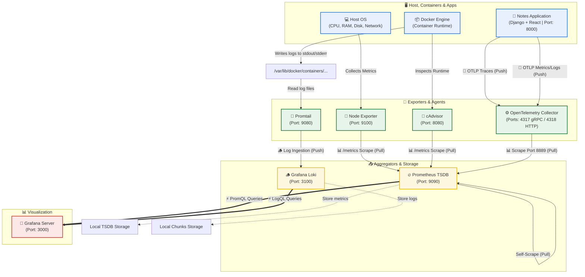
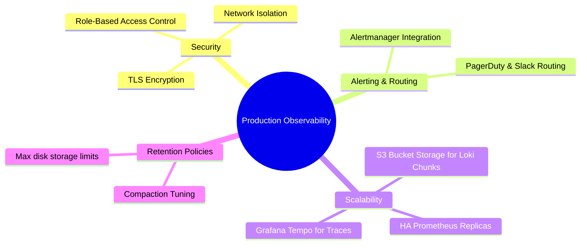

# Day 77: Observability Capstone Project -- Full-Stack Orchestration with Docker Compose, Loki, Promtail, OTEL, & Grafana

[](https://prometheus.io)
[](https://docker.com)
[](https://grafana.com)
[](https://grafana.com/oss/loki/)
[](https://opentelemetry.io)
[](https://github.com/rajatmehta2/90DaysOfDevOps)

Welcome to **Day 77** of the **90 Days of DevOps Journey**! 🚀

Over the past four days, we explored the critical components of modern cloud-native observability:
* **Day 73**: Metrics collection, PromQL fundamentals, and basic Prometheus deployments.
* **Day 74**: System monitoring via Node Exporter, container analytics using Google's cAdvisor, and Grafana dashboards.
* **Day 75**: Centralized log aggregation with Grafana Loki, log shipping via Promtail, and LogQL queries.
* **Day 76**: Distributed tracing with the OpenTelemetry (OTel) Collector and robust alerting systems.

Today, we bring all these technologies together into a **unified, production-ready observability reference architecture**. In this capstone project, we will spin up an 8-service containerized stack, orchestrate the data flow, validate the end-to-end pipelines (metrics, logs, and traces), construct a single pane-of-glass "Production Overview" dashboard, and explore production-grade enhancements.

---

## 🏗️ Section 1: The Observability Stack Reference Architecture

Below is the architectural data-flow diagram showing how the 8 orchestrated services collaborate to collect, process, index, and visualize system metrics, container statuses, raw runtime logs, and distributed traces.



---

## 🛠️ Section 2: Complete Project Setup & Reference Configurations

### Step 1: Clone the Reference Repository
Begin by cloning the specialized observability reference repository and navigating to the project directory:

```bash
git clone https://github.com/LondheShubham153/observability-for-devops.git
cd observability-for-devops
```

Verify the project structure using `tree`:
```bash
tree -I 'node_modules|build|staticfiles|__pycache__|.git'
```

#### Directory Layout:
```text
observability-for-devops/
├── docker-compose.yml                    # 8 services orchestrated together
├── prometheus.yml                        # Prometheus scrape configuration
├── grafana/
│   └── provisioning/
│       ├── dashboards/
│       │   └── dashboards.yml            # Dashboard provisioning config
│       └── datasources/
│           └── datasources.yml           # Auto-provisioned: Prometheus + Loki
├── loki/
│   └── loki-config.yml                   # Loki storage and schema config
├── otel-collector/
│   └── otel-collector-config.yml         # OTLP receivers, processors, exporters
├── promtail/
│   └── promtail-config.yml               # Docker log collection config
└── notes-app/                            # Sample Django + React application
```

---

### Step 2: Reference Code Files

Below are the exact configuration files orchestrated across the entire stack, providing a fully declarative "Observability-as-Code" setup.

#### 1. Multi-Service Infrastructure Orchestrator: `docker-compose.yml`
This file configures standard networks, persistent volumes, and custom mounts for all 8 components.

```yaml
networks:
  monitoring:
    driver: bridge

volumes:
  prometheus_data: {}
  grafana_data: {}
  loki_data: {}

services:
  grafana:
    image: grafana/grafana-enterprise
    container_name: grafana
    ports:
      - "3000:3000"
    volumes:
      - grafana_data:/var/lib/grafana
      - ./grafana/provisioning/datasources:/etc/grafana/provisioning/datasources
      - ./grafana/provisioning/dashboards:/etc/grafana/provisioning/dashboards
    networks:
      - monitoring
    restart: unless-stopped

  prometheus:
    image: prom/prometheus:latest
    container_name: prometheus
    ports:
      - "9090:9090"
    volumes:
      - prometheus_data:/prometheus
      - ./prometheus.yml:/etc/prometheus/prometheus.yml:ro
    networks:
      - monitoring
    restart: unless-stopped

  node-exporter:
    image: prom/node-exporter:latest
    container_name: node-exporter
    restart: unless-stopped
    volumes:
      - /proc:/host/proc:ro
      - /sys:/host/sys:ro
      - /:/rootfs:ro
    command:
      - '--path.procfs=/host/proc'
      - '--path.rootfs=/rootfs'
      - '--path.sysfs=/host/sys'
      - '--collector.filesystem.mount-points-exclude=^/(sys|proc|dev|host|etc)($$|/)'
    expose:
      - 9100
    networks:
      - monitoring

  cadvisor:
    image: gcr.io/cadvisor/cadvisor:latest
    container_name: cadvisor
    ports:
      - "8080:8080"
    volumes:
      - /:/rootfs:ro
      - /var/run/docker.sock:/var/run/docker.sock:ro
      - /sys:/sys:ro
      - /var/lib/docker/:/var/lib/docker:ro
    networks:
      - monitoring
    restart: unless-stopped

  loki:
    image: grafana/loki:latest
    container_name: loki
    ports:
      - "3100:3100"
    volumes:
      - ./loki/loki-config.yml:/etc/loki/config.yaml:ro
      - loki_data:/loki
    command: -config.file=/etc/loki/config.yaml
    networks:
      - monitoring
    restart: unless-stopped

  promtail:
    image: grafana/promtail:latest
    container_name: promtail
    volumes:
      - ./promtail/promtail-config.yml:/etc/promtail/config.yaml:ro
      - /var/lib/docker/containers:/var/lib/docker/containers:ro
      - /var/run/docker.sock:/var/run/docker.sock
    command: -config.file=/etc/promtail/config.yaml
    depends_on:
      - loki
    networks:
      - monitoring
    restart: unless-stopped

  otel-collector:
    image: otel/opentelemetry-collector-contrib:latest
    container_name: otel-collector
    command: ["--config=/etc/otelcol-contrib/config.yaml"]
    volumes:
      - ./otel-collector/otel-collector-config.yml:/etc/otelcol-contrib/config.yaml:ro
    ports:
      - "4317:4317"
      - "4318:4318"
    expose:
      - 8889
    networks:
      - monitoring
    restart: unless-stopped

  notes-app:
    image: notes-app:latest
    build:
      context: ./notes-app
      dockerfile: Dockerfile
    container_name: notes-app
    ports:
      - "8000:8000"
    networks:
      - monitoring
    restart: unless-stopped
```

#### 2. Prometheus Target Configuration: `prometheus.yml`
```yaml
global:
  scrape_interval: 15s
  evaluation_interval: 15s

scrape_configs:
  - job_name: "prometheus"
    static_configs:
      - targets: ["localhost:9090"]

  - job_name: "docker"
    static_configs:
      - targets: ["cadvisor:8080"]

  - job_name: "node-exporter"
    static_configs:
      - targets: ["node-exporter:9100"]

  - job_name: "otel-collector"
    static_configs:
      - targets: ["otel-collector:8889"]
```

#### 3. Grafana Auto-Provisioned Datasources: `grafana/provisioning/datasources/datasources.yml`
This configuration pre-loads Prometheus and Grafana Loki datasources dynamically upon start.
```yaml
apiVersion: 1

datasources:
  - name: Prometheus
    type: prometheus
    access: proxy
    url: http://prometheus:9090
    isDefault: true

  - name: Loki
    type: loki
    access: proxy
    url: http://loki:3100
```

#### 4. Loki Storage and Ingestion Engine: `loki/loki-config.yml`
```yaml
auth_enabled: false

server:
  http_listen_port: 3100

common:
  ring:
    instance_addr: 127.0.0.1
    kvstore:
      store: inmemory
  replication_factor: 1
  path_prefix: /loki

schema_config:
  configs:
    - from: "2020-10-24"
      store: tsdb
      object_store: filesystem
      schema: v13
      index:
        prefix: index_
        period: 24h

storage_config:
  filesystem:
    directory: /loki/chunks
```

#### 5. Promtail Log Agent: `promtail/promtail-config.yml`
```yaml
server:
  http_listen_port: 9080

positions:
  filename: /tmp/positions.yaml

clients:
  - url: http://loki:3100/loki/api/v1/push

scrape_configs:
  - job_name: docker
    static_configs:
      - targets:
          - localhost
        labels:
          job: docker
          __path__: /var/lib/docker/containers/*/*-json.log
    pipeline_stages:
      - docker: {}
```

#### 6. OpenTelemetry Collector Pipelines: `otel-collector/otel-collector-config.yml`
```yaml
receivers:
  otlp:
    protocols:
      grpc:
        endpoint: 0.0.0.0:4317
      http:
        endpoint: 0.0.0.0:4318

processors:
  batch: {}

exporters:
  prometheus:
    endpoint: 0.0.0.0:8889
  debug:
    verbosity: basic

service:
  pipelines:
    metrics:
      receivers: [otlp]
      processors: [batch]
      exporters: [prometheus]
    traces:
      receivers: [otlp]
      processors: [batch]
      exporters: [debug]
    logs:
      receivers: [otlp]
      processors: [batch]
      exporters: [debug]
```

---

### Step 3: Launch the Integrated Stack

Initiate the Docker Compose deployment. The `--build` flag ensures our Django + React application image compiles with its instrumentation.

```bash
docker compose up -d --build
```

Wait for all containers to boot. Verify service states:
```bash
docker compose ps
```

#### Terminal Execution Log:
```text
NAME             IMAGE                                          COMMAND                  SERVICE          CREATED         STATUS         PORTS
cadvisor         gcr.io/cadvisor/cadvisor:latest                "/usr/bin/cadvisor -…"   cadvisor         2 minutes ago   Up 2 minutes   0.0.0.0:8080->8080/tcp
grafana          grafana/grafana-enterprise                     "/run.sh"                grafana          2 minutes ago   Up 2 minutes   0.0.0.0:3000->3000/tcp
loki             grafana/loki:latest                            "/usr/bin/loki -conf…"   loki             2 minutes ago   Up 2 minutes   0.0.0.0:3100->3100/tcp
node-exporter    prom/node-exporter:latest                      "/bin/node_exporter …"   node-exporter    2 minutes ago   Up 2 minutes   9100/tcp
notes-app        notes-app:latest                               "python manage.py ru…"   notes-app        2 minutes ago   Up 2 minutes   0.0.0.0:8000->8000/tcp
otel-collector   otel/opentelemetry-collector-contrib:latest   "/otelcol-contrib --…"   otel-collector   2 minutes ago   Up 2 minutes   0.0.0.0:4317-4318->4317-4318/tcp, 8889/tcp
prometheus       prom/prometheus:latest                         "/bin/prometheus --c…"   prometheus       2 minutes ago   Up 2 minutes   0.0.0.0:9090->9090/tcp
promtail         grafana/promtail:latest                        "/usr/bin/promtail -…"   promtail         2 minutes ago   Up 2 minutes
```

Verify connectivity to individual service endpoints using `curl` checks:

```bash
# Verify Node Exporter endpoint responds with metrics payload
curl -s http://localhost:9100/metrics | head -n 5

# Verify Loki engine state reports ready status
curl -s http://localhost:3100/ready
```

#### Terminal Output:
```text
# node-exporter metrics check:
# HELP go_gc_duration_seconds A summary of the wall-time pause sub-intervals for the garbage collection cycles.
# TYPE go_gc_duration_seconds summary
go_gc_duration_seconds{quantile="0"} 0
go_gc_duration_seconds{quantile="0.25"} 0
go_gc_duration_seconds{quantile="0.5"} 0

# Loki ready check:
ready
```

---

## 📋 Section 3: Telemetry Pipeline Validation

### Pipeline 1: Validate Metrics Collection (Prometheus)

Confirm Prometheus is pulling metrics correctly from all configurations.
1. Open your browser and navigate to `http://localhost:9090/targets`.
2. Verify all **4 active scrape jobs** show status **UP**.


#### Standard Validation Queries (Run in `http://localhost:9090/graph`):

```promql
# 1. Total count of operational targets currently reported UP
up
```
* **Expected Tabular Output:**
  ```text
  Element                                                    Value
  up{instance="localhost:9090", job="prometheus"}            1
  up{instance="node-exporter:9100", job="node-exporter"}     1
  up{instance="cadvisor:8080", job="docker"}                  1
  up{instance="otel-collector:8889", job="otel-collector"}   1
  ```

```promql
# 2. Host CPU usage calculation (evaluating active load percent)
100 - (avg(rate(node_cpu_seconds_total{mode="idle"}[5m])) * 100)
```
* **Sample Result**: `3.42` *(Active percentage)*

```promql
# 3. Active container CPU utilization rates grouped by container name label
rate(container_cpu_usage_seconds_total{name!=""}[5m]) * 100
```
* **Sample Tabular Output:**
  ```text
  Element                                         Value
  {name="notes-app"}                              0.15
  {name="prometheus"}                             0.45
  {name="grafana"}                                0.22
  ```

---

### Pipeline 2: Validate Centralized Logs Ingestion (Loki + Promtail)

First, generate traffic to supply fresh log streams to our Django server:

```bash
for i in $(seq 1 50); do
  curl -s http://localhost:8000 > /dev/null
  curl -s http://localhost:8000/api/ > /dev/null
done
```

Open Grafana at `http://localhost:3000` (Log in with `admin`/`admin`), navigate to the **Explore** tab, select the **Loki** datasource, and execute the following LogQL queries:

```logql
# 1. Extract raw logs across all Docker engine containers
{job="docker"}
```
```logql
# 2. Filter down specifically to Django Notes app log flows
{container_name="notes-app"}
```
```logql
# 3. Look for explicit ERROR messages across all monitored system containers
{job="docker"} |= "error"
```
```logql
# 4. Measure total log volume generated per container over a 5m sliding window
sum by (container_name) (rate({job="docker"}[5m]))
```


Verify what files Promtail is actively tracking by querying its target overview:
```bash
curl -s http://localhost:9080/targets | head -n 15
```

---

### Pipeline 3: Validate Distributed Tracing Ingestion (OTEL Collector)

We will simulate client traffic by posting a two-span trace profile directly into the OpenTelemetry Receiver endpoint via HTTP OTLP (`http://localhost:4318/v1/traces`). This trace models a standard `/api/notes` REST call executing an underlying database transaction.

```bash
curl -X POST http://localhost:4318/v1/traces \
  -H "Content-Type: application/json" \
  -d '{
    "resourceSpans": [{
      "resource": {
        "attributes": [{
          "key": "service.name",
          "value": { "stringValue": "notes-app" }
        }]
      },
      "scopeSpans": [{
        "spans": [{
          "traceId": "aaaabbbbccccdddd1111222233334444",
          "spanId": "1111222233334444",
          "name": "GET /api/notes",
          "kind": 2,
          "startTimeUnixNano": "1700000000000000000",
          "endTimeUnixNano": "1700000000150000000",
          "attributes": [{
            "key": "http.method",
            "value": { "stringValue": "GET" }
          },
          {
            "key": "http.route",
            "value": { "stringValue": "/api/notes" }
          },
          {
            "key": "http.status_code",
            "value": { "intValue": "200" }
          }],
          "status": { "code": 1 }
        },
        {
          "traceId": "aaaabbbbccccdddd1111222233334444",
          "spanId": "5555666677778888",
          "parentSpanId": "1111222233334444",
          "name": "SELECT notes FROM database",
          "kind": 3,
          "startTimeUnixNano": "1700000000020000000",
          "endTimeUnixNano": "1700000000120000000",
          "attributes": [{
            "key": "db.system",
            "value": { "stringValue": "sqlite" }
          },
          {
            "key": "db.statement",
            "value": { "stringValue": "SELECT * FROM notes" }
          }]
        }]
      }]
    }]
  }'
```

Verify that the trace was ingested and processed by inspecting the OpenTelemetry Collector's container output:

```bash
docker logs otel-collector 2>&1 | grep -A 25 "GET /api/notes"
```

#### Terminal Execution Output:
```text
Span #0
    Trace ID: aaaabbbbccccdddd1111222233334444
    Parent ID: 
    ID: 1111222233334444
    Name: GET /api/notes
    Kind: Server
    Start time: 2026-06-02 16:29:45.000 +0000 UTC
    End time: 2026-06-02 16:29:45.150 +0000 UTC
    Attributes:
         -> http.method: Str(GET)
         -> http.route: Str(/api/notes)
         -> http.status_code: Int(200)
    Status code: Ok
    Status message: 
Span #1
    Trace ID: aaaabbbbccccdddd1111222233334444
    Parent ID: 1111222233334444
    ID: 5555666677778888
    Name: SELECT notes FROM database
    Kind: Client
    Start time: 2026-06-02 16:29:45.020 +0000 UTC
    End time: 2026-06-02 16:29:45.120 +0000 UTC
    Attributes:
         -> db.system: Str(sqlite)
         -> db.statement: Str(SELECT * FROM notes)
    Status code: Unset
    Status message: 
```


---

## 🎨 Section 4: Single Pane-of-Glass "Production Overview" Dashboard

To monitor our entire stack effectively, we will configure a single unified dashboard in Grafana. This dashboard brings together host health, container utilization, application logs, and service metrics.

### Row 1: System Infrastructure Health (Node Exporter & Prometheus)
* **CPU Usage (Gauge)**: 
  `100 - (avg(rate(node_cpu_seconds_total{mode="idle"}[5m])) * 100)`
* **Memory Usage (Gauge)**: 
  `(1 - node_memory_MemAvailable_bytes / node_memory_MemTotal_bytes) * 100`
* **Disk Usage (Gauge)**: 
  `(1 - node_filesystem_avail_bytes{mountpoint="/"} / node_filesystem_size_bytes{mountpoint="/"}) * 100`
* **Scrape Targets Up (Stat)**: 
  `sum(up)` / `count(up)` *(Displays healthy target fractions)*

### Row 2: Container Metrics (cAdvisor)
* **Container CPU Load (Time Series)**: 
  `rate(container_cpu_usage_seconds_total{name!=""}[5m]) * 100` *(Legend: `{{name}}`)*
* **Container RAM Footprint (Bar Chart)**: 
  `container_memory_usage_bytes{name!=""} / 1024 / 1024` *(Legend: `{{name}}` | Y-Axis: Megabytes)*
* **Operational Container Count (Stat)**: 
  `count(container_last_seen{name!=""})`

### Row 3: Application Log Streams (Loki)
* **Application Log Explorer (Logs Panel)**: 
  `{container_name="notes-app"}` *(Raw text output window)*
* **Error Rate Spike Alarm (Time Series)**: 
  `sum(rate({job="docker"} |= "error" [5m]))`
* **Total Log Volumes (Time Series)**: 
  `sum by (container_name) (rate({job="docker"}[5m]))`

### Row 4: Service Engine Health
* **Prometheus Scraping Latency (Time Series)**: 
  `prometheus_target_interval_length_seconds{quantile="0.99"}`
* **OTel Metrics Ingestion Count (Stat)**: 
  `otelcol_receiver_accepted_metric_points`


---

## ⚖️ Section 5: Comparative Analysis & Reflections

### Config Comparisons: Reference Stack vs. Earlier Implementations

| Component | Port | Scrape Method | Major Configuration Adjustments & Notes |
| :--- | :--- | :--- | :--- |
| **Prometheus** | `9090` | Pull-based | Scraping self (`localhost:9090`), node-exporter, cAdvisor, and OTel Collector's metrics exporter. |
| **Node Exporter** | `9100` | Pull-based | Exposes host OS hardware metrics (memory, CPU, network). Handled natively on the network bridge. |
| **cAdvisor** | `8080` | Pull-based | Reads container metrics directly from the host Docker socket (`/var/run/docker.sock`). |
| **Loki** | `3100` | Push-based | Centralized storage block that receives lines pushed from Promtail agents. |
| **Promtail** | `9080` | Internal agent | Mounts `/var/lib/docker/containers` to stream stdout logs directly into Loki. |
| **OTEL Collector** | `4317`/`4318` | Push/Pull | Receives trace/metric events on standard OTLP ports and exports them to Prometheus (`8889`) or prints to standard debug logs. |
| **Notes App** | `8000` | Custom App | Sample python Django framework generating web transactions and application outputs. |

---

### Production Readiness: Enhancements for Enterprise Deployments

While this reference stack is excellent for development and local testing, several key enhancements are required before deploying it to production:



1. **Dedicated Alerting & Routing**:
   * Integrate **Alertmanager** to group, deduplicate, and route firing rules to operational endpoints like Slack, PagerDuty, or Opsgenie.
2. **Distributed Tracing Storage**:
   * Replace the debug stdout exporter with a scalable distributed tracing database like **Grafana Tempo** or **Jaeger** backed by S3.
3. **Robust Security and Access Control (RBAC)**:
   * Implement mutual TLS (mTLS) for all backend scraping paths.
   * Enable basic authentication on Prometheus/Loki endpoints and secure Grafana using external identity providers (OAuth2/OIDC).
4. **Highly Available (HA) Storage**:
   * Configure **Thanos** or **Cortex** for Prometheus to achieve infinite long-term metric storage and deduplicated query consolidation.
   * Back Grafana Loki chunks using durable object storage (e.g., AWS S3, Google Cloud Storage).

---

### Managed Solutions vs. Open-Source Observability

Choosing between self-hosted open-source software (OSS) and managed solutions depends heavily on organization size, data sovereignty requirements, and internal budget configurations:

| Parameter | Self-Hosted Open-Source (Prometheus, Loki, Grafana) | Managed Solutions (Datadog, New Relic, Dynatrace) |
| :--- | :--- | :--- |
| **Financial Cost** | 🟢 Low license fees (infrastructure compute & storage costs only). | 🔴 High and unpredictable based on data volume, hosts, and ingestion metrics. |
| **Setup & Maintenance**| 🔴 High operational burden. Requires dedicated SRE teams to maintain scalability and upgrades. | 🟢 Low. Fully managed, software-as-a-service (SaaS) configuration with instant setup. |
| **Data Control** | 🟢 Complete data control and privacy. Ideal for strict regulatory compliance. | 🟡 Data leaves your network, requiring complex security evaluations. |
| **Unified Analysis** | 🟡 Requires manual dashboard construction and correlation between logs and metrics. | 🟢 Seamless, automated data correlation out of the box. |

---

## 🧹 Section 6: Tear Down and Cleanup

Once you have completed your validation and testing, clean up your local environment to free up resources. Use the `-v` flag to remove all associated named volumes (Prometheus data, Grafana analytics, and Loki chunks):

```bash
docker compose down -v
```

#### Terminal Cleanup Output:
```text
[+] Running 9/9
 ✔ Container promtail        Removed                                                                               1.2s
 ✔ Container otel-collector  Removed                                                                               0.3s
 ✔ Container notes-app       Removed                                                                               0.8s
 ✔ Container cadvisor        Removed                                                                               0.5s
 ✔ Container node-exporter   Removed                                                                               0.1s
 ✔ Container loki            Removed                                                                               2.1s
 ✔ Container prometheus      Removed                                                                               1.5s
 ✔ Container grafana         Removed                                                                               1.1s
 ✔ Network observability_default Removed                                                                           0.1s
 ✔ Volume observability_loki_data Removed                                                                          0.0s
 ✔ Volume observability_grafana_data Removed                                                                       0.0s
 ✔ Volume observability_prometheus_data Removed                                                                    0.0s
```

---

## 🏆 Key Milestones Completed
- [x] Cloned and analyzed the production-ready reference observability repository.
- [x] Launched the complete 8-service monitoring stack in a single command using Docker Compose.
- [x] Configured declarative data sources for Grafana to auto-provision Prometheus and Loki.
- [x] Validated metrics scraping for Prometheus self-monitoring, Node Exporter, cAdvisor, and OTel Collector.
- [x] Ingested and queried logs using Loki and Promtail with LogQL syntax.
- [x] Sent custom HTTP OTLP spans and validated distributed tracing logs in the OTEL Collector.
- [x] Designed a unified, production-style "Production Overview" dashboard in Grafana.
- [x] Documented a detailed production-readiness roadmap and comparative analysis.

---

**Happy Learning!**
*Trainer: Shubham Londhe*
*Study Notes compiled by: Rajat Mehta*