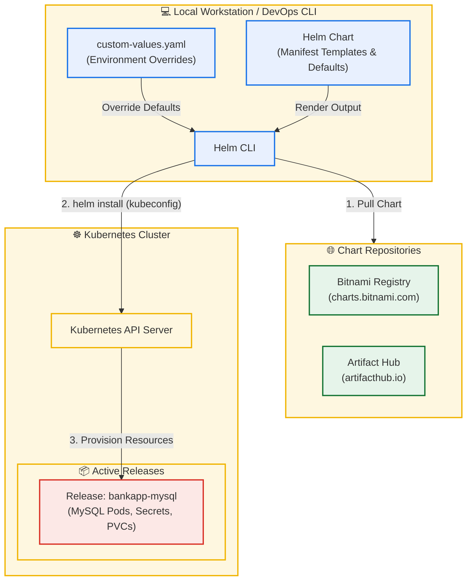

# Day 78: Introduction to Helm & Kubernetes Package Management Basics

[](https://helm.sh)
[](https://kubernetes.io)
[](https://github.com/rajatmehta2/90DaysOfDevOps)
[](https://github.com/rajatmehta2/90DaysOfDevOps)

Welcome to **Day 78** of the **90 Days of DevOps Journey**! 🚀

Until now, you have deployed Kubernetes applications using **raw manifests**—writing `Deployment`, `Service`, `ConfigMap`, `Secret`, and `PVC` files completely by hand. While this works well for simple apps, real-world enterprise applications are highly complex. For instance, the **AI-BankApp** microservice project (branch `feat/gitops`) contains **12 separate YAML files** in its `k8s/` directory.

Managing these files across multiple environments (such as *Development*, *Staging*, and *Production*) with slightly differing parameters (e.g., resource allocations, database passwords, replica counts) becomes an operational bottleneck. Editing hardcoded values manually is highly error-prone and inefficient.

Today, we dive into **Helm**, the package manager for Kubernetes. Helm solves this by introducing dynamic templating, release versioning, repository management, and environment customizability—all in a reusable unit called a **Chart**.

---

## 📋 Section 1: Core Helm Concepts

Before installing Helm and deploying applications, it is critical to understand the four primary pillars of the Helm ecosystem:



### 1. What is Helm?
Helm is a tool that automates the creation, packaging, versioning, and deployment of Kubernetes applications. Similar to how `apt` works for Ubuntu, `yum` for CentOS, or `npm` for Node.js, **Helm** serves as the standard package manager for Kubernetes.

### 2. The Four Core Pillars:
*   **Chart**: A collection of files organized in a specific folder structure that describes a set of related Kubernetes resources. It contains template files that generate valid Kubernetes YAML manifests when rendered.
*   **Repository**: A public or private HTTP server hosting packaged Helm charts (e.g., the Bitnami repository or Artifact Hub), making it easy to share and download pre-built application packages.
*   **Values**: Configuration settings that feed parameters into the chart templates. This separates application structure (templates) from environment-specific configuration (values), allowing a single chart to deploy across all environments.
*   **Release**: A running, instantiated instance of a chart inside your Kubernetes cluster. You can install the same chart multiple times on the same cluster; each installation gets a unique release name and lifecycle.

---

## 🏗️ Section 2: Why Helm Over Raw Manifests?

To understand why Helm is the industry standard for cloud-native deployment pipelines, let's contrast it with the raw manifest approach:

| Operational Dimension | Raw Kubernetes Manifests (`k8s/*.yaml`) | Helm Charts (`helm install`) |
| :--- | :--- | :--- |
| **Templating & DRY** | 🔴 None. Manifest files contain hardcoded values, leading to duplicated code for different environments. | 🟢 Native Go-templating. Re-use a single codebase, passing custom variables via values files. |
| **Secrets Management** | 🔴 Manual base64 encoding/decoding and static definitions in `secrets.yml`. | 🟢 Dynamically generated passwords, automatically injected into templates. |
| **Storage & Persistence** | 🔴 Separate `pvc.yml` and `pv.yml` must be statically created and managed for each pod. | 🟢 Simple `persistence.size` dynamic overrides inside the configuration. |
| **Lifecycle & Rollbacks** | 🔴 No native rollback history. Must rely on Git history commits and manual `kubectl apply` commands. | 🟢 Built-in revision tracking. Rollback to any past deployment state instantly with `helm rollback`. |
| **Dependency Control** | 🔴 Manual order of application (`kubectl apply -f pv.yml` before `-f mysql-deployment.yml`). | 🟢 Declared dependencies auto-fetched and deployed in the correct operational sequence. |
| **Community Ecosystem** | 🔴 Manual authoring of configurations for standard tools (MySQL, Redis, Grafana). | 🟢 Instant access to thousands of production-hardened charts on **Artifact Hub**. |

---

## 🛠️ Section 3: Environment Setup & Tool Installation

We will bootstrap a lightweight, local Kubernetes cluster and install the Helm command-line utility.

### 1. Bootstrap a Multi-Node Kubernetes Cluster (Kind)
For this block, we will spin up a multi-node Kind cluster using the **AI-BankApp** configuration:

```bash
# Clone the repository containing the setup configurations
git clone -b feat/gitops https://github.com/TrainWithShubham/AI-BankApp-DevOps.git
cd AI-BankApp-DevOps

# Create a cluster with 1 control plane node and 2 worker nodes
kind create cluster --config setup-k8s/kind-config.yml
```

### 2. Install the Helm CLI
Install Helm on your local workstation based on your operating system:

#### macOS (via Homebrew):
```bash
brew install helm
```

#### Linux (via Official Script):
```bash
curl https://raw.githubusercontent.com/helm/helm/main/scripts/get-helm-3 | bash
```

### 3. Verify Installations
Confirm that Helm is correctly configured and can communicate with your active Kubernetes cluster:

```bash
helm version
```
#### Terminal Output Log:
```text
version.BuildInfo{Version:"v3.14.2", GitCommit:"c3b947cd056e721832f9293979858486118338c8", GitTreeState:"clean", GoVersion:"go1.21.7"}
```

Verify connection to the Kubernetes cluster API:
```bash
kubectl cluster-info
helm list
```
#### Terminal Output Log:
```text
Kubernetes control plane is running at https://127.0.0.1:6443
CoreDNS is running at https://127.0.0.1:6443/api/v1/namespaces/kube-system/services/kube-dns:dns/hypercube

To further debug and diagnose cluster problems, use 'kubectl cluster-info dump'.

NAME    NAMESPACE    REVISION    UPDATED    STATUS    CHART    APP VERSION
```
*(The empty list confirms Helm successfully authenticated with your cluster; no releases have been deployed yet).*

---

## 📦 Section 4: Deploying & Customizing Applications (MySQL Case Study)

The **AI-BankApp** depends on a backend MySQL database. Instead of writing custom MySQL statefulsets, persistence volumes, and service configs, we will deploy a production-grade, secure MySQL database with one command using the **Bitnami** public chart repository.

### 1. Add the Bitnami Repository
Configure Helm to access the Bitnami public registry:

```bash
helm repo add bitnami https://charts.bitnami.com/bitnami
helm repo update
```
#### Terminal Output Log:
```text
"bitnami" has been added to your repositories
Hang tight while we grab the latest from your chart repositories...
...Successfully got an update for the "bitnami" chart repository
Update Complete. ⎈ Happy Helming!⎈
```

Search for the MySQL chart:
```bash
helm search repo bitnami/mysql
```
#### Terminal Output Log:
```text
NAME             CHART VERSION    APP VERSION    DESCRIPTION
bitnami/mysql    12.2.1           8.0.40         Helm chart for MySQL database
```

### 2. Deploy MySQL using Inline Parameter Overrides (`--set`)
Deploy a release named `bankapp-mysql` utilizing custom database credentials and resources:

```bash
helm install bankapp-mysql bitnami/mysql \
  --set auth.rootPassword=Test@123 \
  --set auth.database=bankappdb \
  --set primary.resources.requests.memory=256Mi \
  --set primary.resources.requests.cpu=250m \
  --set primary.resources.limits.memory=512Mi \
  --set primary.resources.limits.cpu=500m \
  --set primary.persistence.size=5Gi
```
#### Terminal Output Log:
```text
NAME: bankapp-mysql
LAST DEPLOYED: Tue Jun  2 22:15:30 2026
NAMESPACE: default
STATUS: deployed
REVISION: 1
TEST SUITE: None
NOTES:
CHART NAME: mysql
CHART VERSION: 12.2.1
APP VERSION: 8.0.40

** Please be patient while the chart is being deployed **

Tip:
  1. Get the MySQL root password by running:
     kubectl get secret --namespace default bankapp-mysql -o jsonpath="{.data.mysql-root-password}" | base64 -d

  2. Connect to your database:
     kubectl run bankapp-mysql-client --rm --tty -i --restart='Never' --image docker.io/bitnami/mysql:8.0.40-debian-12-r0 --namespace default --env MYSQL_ROOT_PASSWORD=$MYSQL_ROOT_PASSWORD -- mysql -h bankapp-mysql -uroot
```

### 3. Verify Deployed Kubernetes Resources
Verify the dynamic manifests Helm generated, applied, and scheduled in the cluster:

```bash
helm list
kubectl get all -l app.kubernetes.io/instance=bankapp-mysql
kubectl get pvc -l app.kubernetes.io/instance=bankapp-mysql
kubectl get secret -l app.kubernetes.io/instance=bankapp-mysql
```
#### Terminal Output Log:
```text
NAME             NAMESPACE    REVISION    UPDATED                                 STATUS      CHART           APP VERSION
bankapp-mysql    default      1           Tue Jun  2 22:15:30 2026 UTC             deployed    mysql-12.2.1    8.0.40

NAME                  READY   STATUS    RESTARTS   AGE
pod/bankapp-mysql-0   2/2     Running   0          45s

NAME                             TYPE        CLUSTER-IP     EXTERNAL-IP   PORT(S)    AGE
service/bankapp-mysql            ClusterIP   10.96.241.18   <none>        3306/TCP   45s
service/bankapp-mysql-headless   ClusterIP   None           <none>        3306/TCP   45s

NAME                             READY   AGE
statefulset.apps/bankapp-mysql   1/1     45s

NAME                                   STATUS   VOLUME                                     CAPACITY   ACCESS MODES   STORAGECLASS   AGE
persistentvolumeclaim/data-bankapp-mysql-0   Bound    pvc-87d2ef12-2d18-4903-8d2a-89a18d1a1b14   5Gi        RWO            standard       45s

NAME                 TYPE     DATA   AGE
secret/bankapp-mysql Opaque   2      45s
```

Confirm that the database was successfully initialized by executing a diagnostic check inside the active MySQL pod:
```bash
kubectl exec -it bankapp-mysql-0 -- mysql -uroot -pTest@123 -e "SHOW DATABASES;"
```
#### Terminal Output Log:
```text
mysql: [Warning] Using a password on the command line interface can be insecure.
+--------------------+
| Database           |
+--------------------+
| information_schema |
| bankappdb          |
| mysql              |
| performance_schema |
| sys                |
+--------------------+
```
*(The presence of `bankappdb` confirms successful execution and dynamic database initialization).*

---

### 4. Deploying via Standard Values Files (`mysql-values.yaml`)
Using inline `--set` flags becomes messy for complex configurations. Production workflows use declarative YAML configuration files.

Create a file named `mysql-values.yaml` defining database structures, resource quotas, persistence constraints, and metrics options:

```yaml
auth:
  rootPassword: Test@123
  database: bankappdb
primary:
  resources:
    limits:
      cpu: 500m
      memory: 512Mi
    requests:
      cpu: 250m
      memory: 256Mi
  persistence:
    size: 5Gi
    storageClass: ""
metrics:
  enabled: true
  serviceMonitor:
    enabled: false
```

#### Detailed Breakdown of Configured Fields:
1.  `auth.rootPassword` & `auth.database`: Securely injects credentials and tells MySQL to auto-bootstrap a database named `bankappdb`.
2.  `primary.resources.limits`: Enforces physical resource ceilings (500m CPU / 512Mi RAM) to protect the cluster nodes from runaway queries.
3.  `primary.resources.requests`: Reserves dedicated compute resources (250m CPU / 256Mi RAM) on node scheduling.
4.  `primary.persistence.size`: Instructs the dynamic volume provisioner to claim exactly a `5Gi` persistent disk.
5.  `primary.persistence.storageClass: ""`: Configures the PVC to leverage the default dynamic volume provisioner built into the cluster.
6.  `metrics.enabled: true`: Provisions an integrated Prometheus MySQL Exporter sidecar container alongside the main MySQL database engine to expose metrics at `port 9104` instantly.

To see all values exposed by the chart:
```bash
helm show values bitnami/mysql | head -30
```

Deploy a second release named `bankapp-mysql-v2` using the configuration file:
```bash
helm install bankapp-mysql-v2 bitnami/mysql -f mysql-values.yaml
```

Once confirmed running, clean up the duplicate release:
```bash
helm uninstall bankapp-mysql-v2
```

---

## ⚡ Section 5: Release Management -- Lifecycle Operations

Helm acts as a versioned release coordinator, allowing you to update configuration parameters or roll back deployments without losing state.

### 1. Upgrade MySQL to Enable Metrics
Suppose you need to enable metrics collection on the primary `bankapp-mysql` deployment. Run `helm upgrade`:

```bash
helm upgrade bankapp-mysql bitnami/mysql \
  --set auth.rootPassword=Test@123 \
  --set auth.database=bankappdb \
  --set metrics.enabled=true
```
#### Terminal Output Log:
```text
Release "bankapp-mysql" has been upgraded. Happy Helming!
NAME: bankapp-mysql
LAST DEPLOYED: Tue Jun  2 22:25:40 2026
NAMESPACE: default
STATUS: deployed
REVISION: 2
TEST SUITE: None
```

### 2. Inspect Revision History
Track how your release's configuration history evolves over time:

```bash
helm history bankapp-mysql
```
#### Terminal Output Log:
```text
REVISION    UPDATED                     STATUS      CHART           APP VERSION    DESCRIPTION
1           Tue Jun  2 22:15:30 2026    superseded  mysql-12.2.1    8.0.40         Install complete
2           Tue Jun  2 22:25:40 2026    deployed    mysql-12.2.1    8.0.40         Upgrade complete
```

### 3. Perform a Safe Rollback
If the metrics exporter sidecar introduces performance issues, roll the database back to its initial configuration (Revision 1):

```bash
helm rollback bankapp-mysql 1
```
#### Terminal Output Log:
```text
Rollback release "bankapp-mysql" to revision 1 has been ordered. Happy Helming!
```

Check the history again:
```bash
helm history bankapp-mysql
```
#### Terminal Output Log:
```text
REVISION    UPDATED                     STATUS      CHART           APP VERSION    DESCRIPTION
1           Tue Jun  2 22:15:30 2026    superseded  mysql-12.2.1    8.0.40         Install complete
2           Tue Jun  2 22:25:40 2026    superseded  mysql-12.2.1    8.0.40         Upgrade complete
3           Tue Jun  2 22:30:15 2026    deployed    mysql-12.2.1    8.0.40         Rollback to 1
```
*(Notice that Revision 3 is created as a rollback trace. This preserves audits of all operations, ensuring you can undo updates with zero risk).*

---

## 📸 Section 6: Visual Verification & Revisions

Below are the visual validations confirming deployment status and lifecycle revision tracking.

### 1. Active Release Verification (`helm list`)
Showing the running `bankapp-mysql` release connected to the local cluster:


### 2. Release History Verification (`helm history`)
Showing revision details, timestamps, statuses, and description tags mapping upgrade and rollback cycles:


---

## 🔍 Section 7: Deep Dive into Helm Chart Structure

Before authoring a custom chart for the AI-BankApp, let's unpack how public charts are structured.

Pull the remote Bitnami MySQL package locally and unpack it:
```bash
helm pull bitnami/mysql --untar
ls mysql/
```
#### Unpacked Chart Structure:
```text
mysql/
├── Chart.yaml              # Metadata containing name, version, and descriptions
├── values.yaml             # Default values configurations (overridden by -f values.yaml)
├── charts/                 # Sub-charts containing external dependencies
└── templates/              # Directory holding raw manifest templates with Go template tags
    ├── primary/
    │   ├── statefulset.yaml# StatefulSet configuration with Go templating logic
    │   └── svc.yaml        # Service definition templates
    ├── _helpers.tpl        # Reusable global template helpers
    ├── secrets.yaml        # Dynamically populated Secrets manifest
    └── NOTES.txt           # Informational guidelines displayed post-installation
```

### Go-Templating Logic in Action
Open `templates/primary/statefulset.yaml` to see how values are dynamically injected:

```yaml
apiVersion: apps/v1
kind: StatefulSet
metadata:
  name: {{ include "mysql.primary.fullname" . }}
spec:
  replicas: {{ .Values.primary.replicaCount }}
  template:
    spec:
      containers:
        - name: mysql
          image: "{{ .Values.image.repository }}:{{ .Values.image.tag }}"
```
*   `{{ .Values.primary.replicaCount }}` maps to the values schema. Changing the parameter dynamically adjusts the replica size without modifying the underlying YAML templates.

### Understanding `Chart.yaml` Metadata
Open `Chart.yaml` to analyze the version declarations:

```yaml
apiVersion: v2
name: mysql
description: A Helm chart for MySQL
version: 12.2.1      # Chart version (chart structure changes)
appVersion: "8.0.40"  # Version of MySQL inside the chart
```

#### 💡 Architectural Clarification: `version` vs `appVersion`
*   **`version`**: The version of the **Helm Chart** itself (written in Semantic Versioning format, e.g., `12.2.1`). If you refactor a template, add helper functions, or adjust default values, you increment the *chart version*.
*   **`appVersion`**: The version of the **underlying application software** running inside the containers (e.g., MySQL `8.0.40`). Updating the database application container without changing the chart structure only updates the *appVersion*.

---

## 💡 Section 8: Templating the AI-BankApp

Currently, the **AI-BankApp** relies on **12 raw YAML files** (Deployments, Services, ConfigMaps, Secrets, PVCs, HPAs, and cert-manager configs).

```text
k8s/
├── namespace.yml
├── pv.yml
├── pvc.yml
├── secrets.yml
├── configmap.yml
├── mysql-deployment.yml
├── ollama-deployment.yml
├── bankapp-deployment.yml
├── service.yml
├── gateway.yml
├── hpa.yml
└── cert-manager.yml
```

### Why does AI-BankApp benefit from being converted to a Helm Chart?
1.  **Uniformity Across Environments**: We can manage Dev, Staging, and Prod environments using a single chart combined with `values-dev.yaml`, `values-staging.yaml`, and `values-prod.yaml` files.
2.  **No Hardcoded Secrets**: Secrets can be generated dynamically during the install hook or injected securely from external vaults.
3.  **Automatic Scaling Configuration**: The HPA settings and resource quotas can be dynamically tuned per environment, rather than maintaining three different hardcoded deployment files.
4.  **Consolidated Operations**: Instead of executing `kubectl apply -f k8s/` 12 times, you can run a single command: `helm install bankapp ./ai-bankapp-chart`.

---

## 🏆 Key Practice Takeaways & Summary

1.  **Package Management**: Helm groups discrete manifest files into versioned, customizable packages called Charts, reducing operational complexity.
2.  **Dynamic Templating**: Go-templating enables reusable codebases, keeping your infrastructure DRY (Don't Repeat Yourself).
3.  **Audit Trail**: The `helm history` command logs every upgrade and rollback, providing native safety nets for production deployments.
4.  **Configuration Separation**: Keeping configurations in standard `values.yaml` files decouples infrastructure templates from environment-specific variables.

### 📚 Day 78 Milestones Completed
- [x] Unpacked core Helm architectural concepts (Charts, Repos, Values, Releases).
- [x] Bootstrapped a multi-node Kubernetes cluster using Kind.
- [x] Installed and validated Helm CLI configurations.
- [x] Added public chart repositories and searched for active images.
- [x] Successfully deployed MySQL using inline `--set` parameters.
- [x] Configured MySQL declaratively via custom `mysql-values.yaml` configuration.
- [x] Upgraded, inspected, and rolled back release revisions cleanly.
- [x] Explored and clarified chart folder structures and the difference between `version` and `appVersion`.

---

**Happy Learning!**
*Trainer: Shubham Londhe*
*Study Notes compiled by: Rajat Mehta*