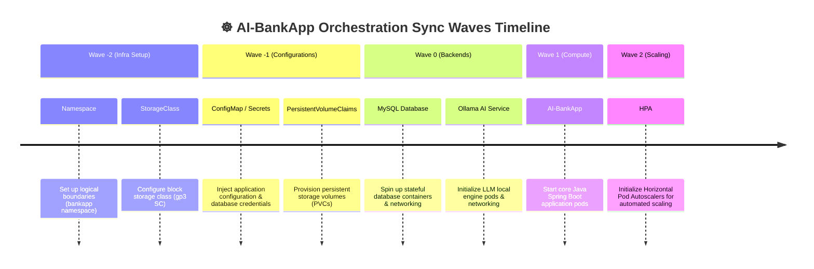
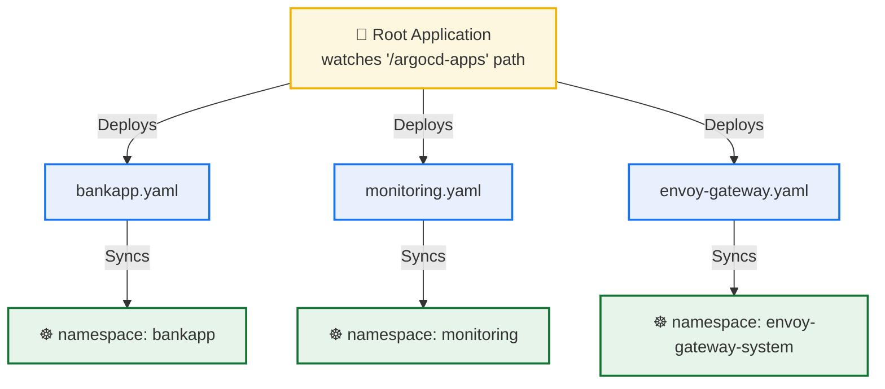

# Day 85: ArgoCD Deep Dive -- Sync Strategies, Sync Waves, Rollbacks, and Multi-App Management

[](https://argoproj.github.io/cd/)
[](https://kubernetes.io/)
[](https://opengitops.dev/)
[](https://github.com/rajatmehta2/90DaysOfDevOps)

Welcome to **Day 85** of the **90 Days of DevOps Journey**! 🚀

Yesterday, we took our first steps into continuous delivery by deploying our multi-tier **AI-BankApp** onto our Kubernetes cluster using ArgoCD and verified its automated self-healing and drift correction. Today, we go significantly deeper into production-grade GitOps engineering.

In real-world enterprise environments, you don't just run a single application in a single namespace. Instead, you manage dozens of complex applications, each with structural startup dependencies, strict multi-tenancy requirements, emergency rollback procedures, and centralized notification systems.

Today, we will master:
1. **Sync Strategies**: Transitioning between manual approvals (production environments) and fully automated syncing (development environments).
2. **Sync Waves & Resource Ordering**: Defining exact, sequential start-up waves using metadata annotations to prevent application crash-loop backoffs.
3. **Advanced Rollback Workflows**: Understanding the differences between emergency UI/CLI rollbacks and GitOps-correct `git revert` practices.
4. **App of Apps Pattern**: Implementing a scalable, single-repository declarative design that deploys and manages multiple child applications simultaneously.
5. **ArgoCD Notifications**: Configuring trigger and template ConfigMaps to broadcast real-time deployment status updates.
6. **Multi-Tenancy Projects & RBAC**: Restricting repository sources, target namespaces, and individual user/group permissions to secure high-compliance clusters.

---

## 📖 Table of Contents
1. [⚙️ Section 1: Dynamic Sync Strategies (Manual vs. Automated)](#-section-1-dynamic-sync-strategies-manual-vs-automated)
2. [🌊 Section 2: Sync Waves & Resource Orchestration Sequencing](#-section-2-sync-waves--resource-orchestration-sequencing)
3. [🔄 Section 3: ArgoCD Rollbacks vs. Git Revert Workflows](#-section-3-argocd-rollbacks-vs-git-revert-workflows)
4. [🏛️ Section 4: Multi-Application Control via App of Apps Pattern](#-section-4-multi-application-control-via-app-of-apps-pattern)
5. [🔔 Section 5: Config-Driven ArgoCD Notifications Controller](#-section-5-config-driven-argocd-notifications-controller)
6. [🔒 Section 6: Secure Multi-Tenancy (Projects & RBAC Rules)](#-section-6-secure-multi-tenancy-projects--rbac-rules)
7. [🎓 Section 7: Key Architectural Highlights & Best Practices](#-section-7-key-architectural-highlights--best-practices)
8. [📢 Share Your Learning in Public!](#-share-your-learning-in-public)

---

## ⚙️ Section 1: Dynamic Sync Strategies (Manual vs. Automated)

ArgoCD provides multiple synchronization models to align your desired Git state with your active cluster state. Choosing the correct strategy ensures safety in production while maintaining speed in staging environments.

### 📊 Sync Policy Breakdown: Staging vs. Production

| Sync Characteristic | Staging/Dev Sync Strategy (Automated) | Production Sync Strategy (Manual) |
| :--- | :--- | :--- |
| **YAML Schema Definition** | `syncPolicy.automated` block active with `prune` and `selfHeal` | `syncPolicy: {}` (empty definition or manual config) |
| **Drift Reaction** | Instantly auto-reconciles within seconds when drift is detected. | Detects drift and marks application `OutOfSync`, but makes no changes. |
| **Deployment Gate** | None. Any push to the watched Git branch goes straight to EKS. | Requires human approval (via UI, CLI, or GitOps PR check). |
| **Best Used For** | Fast inner-loop development, dev sandboxes, staging clusters. | Compliance-heavy, high-risk production clusters where downtime is costly. |

---

### 🛠️ Step-by-Step Transition to Manual Sync

Let's switch our running `bankapp` application from automated sync to manual sync:

```bash
# 1. Update the application policy to manual sync (none)
argocd app set bankapp --sync-policy none
```

#### Terminal Execution & Output:
```text
Application 'bankapp' sync policy set to manual
```

---

### 📝 Step 2: Introduce a Git Config Drift
Edit your Kubernetes manifest file (e.g. `k8s/configmap.yml`) in your personal fork. Add or update a key under `data`:

```yaml
apiVersion: v1
kind: ConfigMap
metadata:
  name: bankapp-config
  namespace: bankapp
data:
  APP_NAME: "AI-BankApp-Enterprise-Edition" # Updated app name
  DB_HOST: "mysql-service"
  MAINTENANCE_MODE: "false" # New key added
```

Commit and push this change to your repository branch:
```bash
git add k8s/configmap.yml
git commit -m "config: upgrade bankapp configuration parameters"
git push origin feat/gitops
```

---

### 🔍 Step 3: Drift Detection and Comparison

Wait for the default polling interval (up to 3 minutes) or trigger an immediate cache refresh, then inspect the application state:

```bash
# Force a repository check and get application status
argocd app get bankapp
```

#### Terminal Execution & Output:
```text
Name:               argocd/bankapp
Project:            default
Server:             https://kubernetes.default.svc
Namespace:          bankapp
URL:                https://localhost:8443/applications/bankapp
Repo:               https://github.com/rajatmehta2/AI-BankApp-DevOps.git
Target:             feat/gitops
Path:               k8s
Sync Window:         Sync Allowed
Sync Policy:        Manual
Sync Status:        OutOfSync from feat/gitops (2c8d2af)
Health Status:      Healthy

Non-synced resources:
Resource: configmap/bankapp-config  Status: OutOfSync
```

To see exactly what configuration values are drifting from the live cluster, run:
```bash
# Inspect the declarative diff
argocd app diff bankapp
```

#### Diff Output:
```diff
===== v1/ConfigMap bankapp/bankapp-config ======
--- Active (Cluster)
+++ Target (Git)
@@ -4,4 +4,6 @@
 metadata:
   name: bankapp-config
   namespace: bankapp
 data:
-  APP_NAME: "AI-BankApp"
+  APP_NAME: "AI-BankApp-Enterprise-Edition"
+  MAINTENANCE_MODE: "false"
```

---

### 🚀 Step 4: Previewing and Executing a Manual Sync

Before applying changes directly, you can execute a dry-run sync to preview modifications:

```bash
# Run a dry-run sync to validate K8s API compilation
argocd app sync bankapp --dry-run
```

#### Terminal Execution & Output:
```text
Use of --insecure is enabled.
TIMESTAMP                  SOURCE      REVISION  STATUS    MESSAGE
2026-06-02T22:18:15+05:30  feat/gitops  2c8d2af   OutOfSync  Pre-sync dry run succeeded (1 resources updated, 0 dry-run only)
```

Now, execute the live manual synchronization:
```bash
# Run a real sync
argocd app sync bankapp
```

#### Terminal Execution & Output:
```text
TIMESTAMP                  SOURCE      REVISION  STATUS    MESSAGE
2026-06-02T22:18:30+05:30  feat/gitops  2c8d2af   Synced    Manual sync initiated by admin
```

Switch back to automated sync once testing is complete:
```bash
# Return application to automated mode
argocd app set bankapp --sync-policy automated --self-heal --auto-prune
```

---

## 🌊 Section 2: Sync Waves & Resource Orchestration Sequencing

When deploying complex multi-tier platforms, resources must be created in a specific order. For example, if the **AI-BankApp** backend pod attempts to connect to the MySQL database before the database service port is open, the backend container will crash loop.

ArgoCD handles resource scheduling using **Sync Waves**. By adding the `argocd.argoproj.io/sync-wave` metadata annotation to your manifests, you define an ordered execution sequence.

### 🎨 The AI-BankApp Sync Waves Timeline



---

### 📝 Step-by-Step Sync Wave Annotations

Add annotations to your manifest files in your repository fork:

#### 1. Infrastructure Layer: Wave `-2`
*Deploys the namespace and storage engines first.*

* **Namespace (`k8s/namespace.yml`)**:
  ```yaml
  apiVersion: v1
  kind: Namespace
  metadata:
    name: bankapp
    annotations:
      argocd.argoproj.io/sync-wave: "-2"
  ```
* **StorageClass (`k8s/pv.yml`)**:
  ```yaml
  apiVersion: storage.k8s.io/v1
  kind: StorageClass
  metadata:
    name: gp3
    annotations:
      argocd.argoproj.io/sync-wave: "-2"
  provisioner: ebs.csi.aws.com
  ```

#### 2. Configuration & State Layer: Wave `-1`
*Pre-positions configuration and persistent volume claims.*

* **ConfigMaps & Secrets (`k8s/configmap.yml` & `k8s/secrets.yml`)**:
  ```yaml
  metadata:
    name: bankapp-config
    annotations:
      argocd.argoproj.io/sync-wave: "-1"
  ```
* **PersistentVolumeClaims (`k8s/pvc.yml`)**:
  ```yaml
  metadata:
    name: mysql-pvc
    annotations:
      argocd.argoproj.io/sync-wave: "-1"
  ```

#### 3. Backend & Services Layer: Wave `0`
*Initializes dependencies (databases, AI models, and networking services) in parallel.*

* **MySQL Deployment (`k8s/mysql-deployment.yml`)**:
  ```yaml
  metadata:
    name: mysql-deployment
    annotations:
      argocd.argoproj.io/sync-wave: "0"
  ```
* **Ollama AI Deployment (`k8s/ollama-deployment.yml`)**:
  ```yaml
  metadata:
    name: ollama-deployment
    annotations:
      argocd.argoproj.io/sync-wave: "0"
  ```
* **Services (`k8s/service.yml`)**:
  ```yaml
  metadata:
    name: bankapp-service
    annotations:
      argocd.argoproj.io/sync-wave: "0"
  ```

#### 4. Application Layer: Wave `1`
*Launches the core Java Spring Boot application only after dependencies are online.*

* **BankApp Deployment (`k8s/bankapp-deployment.yml`)**:
  ```yaml
  metadata:
    name: bankapp-deployment
    annotations:
      argocd.argoproj.io/sync-wave: "1"
  ```

#### 5. Scaling Layer: Wave `2`
*Configures autoscaling rules once the core compute pods are healthy.*

* **HorizontalPodAutoscaler (`k8s/hpa.yml`)**:
  ```yaml
  metadata:
    name: bankapp-hpa
    annotations:
      argocd.argoproj.io/sync-wave: "2"
  ```

---

### 📊 Sync Waves Orchestration Reference Table

| Wave Priority | Resource Kind | Resource Name | File Path | Operations & Reconciliation Rule |
| :---: | :--- | :--- | :--- | :--- |
| **`-2`** | `Namespace` | `bankapp` | `k8s/namespace.yml` | Cluster initialization. Creates the logical environment boundary. |
| **`-2`** | `StorageClass` | `gp3` | `k8s/pv.yml` | Infrastructure storage driver registration. |
| **`-1`** | `ConfigMap` | `bankapp-config` | `k8s/configmap.yml` | Configuration injection; must exist before pods start. |
| **`-1`** | `Secret` | `bankapp-secret` | `k8s/secrets.yml` | Decrypted security passwords; must exist before pods start. |
| **`-1`** | `PersistentVolumeClaim` | `mysql-pvc`, `ollama-pvc`| `k8s/pvc.yml` | Mounts EKS storage blocks before database engines load. |
| **`0`** | `Deployment` | `mysql-deployment` | `k8s/mysql-deployment.yml` | Spins up the backend database engine. |
| **`0`** | `Deployment` | `ollama-deployment` | `k8s/ollama-deployment.yml` | Launches local AI chatbot models. |
| **`0`** | `Service` | `mysql-service`, `ollama-service` | `k8s/service.yml` | Registers network service ports in DNS. |
| **`1`** | `Deployment` | `bankapp-deployment` | `k8s/bankapp-deployment.yml` | Launches application pods once dependencies are online. |
| **`2`** | `HorizontalPodAutoscaler`| `bankapp-hpa` | `k8s/hpa.yml` | Attaches dynamic autoscaling metrics to healthy pods. |

> [!NOTE]
> ArgoCD executes sync waves sequentially. Resources within the same wave sync in parallel. ArgoCD waits for all resources in a wave to report **Healthy** before moving to the next wave.

Commit and push these files to Git to trigger a sequenced roll-out. Below is the visual representation of this process in the ArgoCD Web UI:

### 🖼️ Sequenced Deployment in the ArgoCD Web UI
*The screenshot below demonstrates the step-by-step sync execution as defined by our Sync Waves:*


---

## 🔄 Section 3: ArgoCD Rollbacks vs. Git Revert Workflows

When a bad deployment causes production downtime, you need to restore service immediately. You have two options: trigger a direct, temporary rollback via ArgoCD, or execute a permanent, Git-compliant rollback using standard Git commands.

```
                   ❌ EMERGENCY BYPASS (Direct CLI/UI Rollback)
                  ┌──────────────────────────────────────────┐
                  │ • Instant relief in EKS cluster          │
                  │ • Leaves Git drifted (OutOfSync state)   │
                  └────────┬─────────────────────────────────┘
                           │
  [Developer push] ──────► │ ───► [ArgoCD Engine] ───────────► [Kubernetes EKS Cluster]
                           ▲
                           │
                  ┌────────┴─────────────────────────────────┐
                  │ • Git-compliant, full audit trail        │
                  │ • Maintains Git as Single Source of Truth│
                  └──────────────────────────────────────────┘
                  🟢 THE GITOPS WAY (git revert HEAD && push)
```

### 📊 Rollback Strategy Comparison

| Rollback Characteristic | Direct ArgoCD Rollback (CLI/UI) | Git Revert Rollback (`git revert`) |
| :--- | :--- | :--- |
| **Execution Trigger** | Run `argocd app rollback` or click **Rollback** in the UI. | Run `git revert HEAD` locally, then push to Git. |
| **Git Synchronization** | Bypasses Git. Cluster state differs from Git. | Fully aligned. Git history matches cluster state. |
| **Application Status** | Marked as `OutOfSync` (drift detected). | Marked as `Synced` and `Healthy`. |
| **Reconciliation Risk** | High. Any new Git push or sync will overwrite the rollback. | None. Git remains the absolute source of truth. |
| **Audit Compliance** | Poor. Cluster history is detached from source control. | Excellent. Cryptographic commits document the rollback. |
| **Best Used For** | Emergency restoration during major downtime. | Standard rollback workflow for all environments. |

---

### 🛠️ Execution Example: Emergency CLI Rollback

```bash
# 1. Retrieve the deployment release history
argocd app history bankapp
```

#### Terminal Execution & Output:
```text
ID  DATE                 REVISION  STATUS
1   2026-06-02 22:15:30  abc1234   SUCCESS  (v1.0.0 Stable deployment)
2   2026-06-02 22:18:12  def5678   SUCCESS  (v1.1.0 Broken deployment)
```

```bash
# 2. Roll back to the stable revision (ID: 1)
argocd app rollback bankapp 1
```

#### Terminal Execution & Output:
```text
Application 'bankapp' rolled back to revision abc1234 (ID: 1)
```

Verify that the application successfully restored the stable deployment state but is now flagged with drift:
```bash
argocd app get bankapp | grep -E "Status|Revision"
```

#### Terminal Output:
```text
Sync Status:        OutOfSync (drifted from Git revision def5678 to run cluster stable revision abc1234)
Health Status:      Healthy
```

---

### 🛠️ Execution Example: The GitOps-Correct Rollback

To perform a GitOps-compliant rollback, revert the commit in Git. This ensures your cluster state remains synchronized with your repository:

```bash
# 1. Revert the broken commit locally
git revert HEAD --no-edit

# 2. Push the reverted state to your branch
git push origin feat/gitops
```

#### Terminal Execution & Output:
```text
[feat/gitops 8f9a2bc] Revert "config: upgrade bankapp configuration parameters"
 1 file changed, 2 deletions(-)
Preparing push stream...
To https://github.com/rajatmehta2/AI-BankApp-DevOps.git
   def5678..8f9a2bc  feat/gitops -> feat/gitops
```

ArgoCD automatically detects the new commit, applies it, and updates the application status to `Synced` and `Healthy` with a clean audit log.

---

## 🏛️ Section 4: Multi-Application Control via App of Apps Pattern

Managing resources application-by-application does not scale. In production, you need to manage dozens of distinct components.

The **App of Apps** pattern solves this. Instead of manually deploying individual applications, you deploy a single **Root Application** that watches a directory in Git. Any application manifest placed in that directory is automatically created and managed by ArgoCD.

### 📐 App of Apps Pattern Architecture



---

### 📂 Directory Structure setup

Create the directory structure to store your application definitions:

```text
argocd-apps/
├── root-app.yaml        # The parent Root Application manifest
├── bankapp.yaml         # Child App 1: AI-BankApp stack
├── monitoring.yaml      # Child App 2: Prometheus & Grafana stack
└── envoy-gateway.yaml   # Child App 3: Envoy Gateway controller
```

---

### 🛠️ Declarative Manifest Configurations

#### 1. The Child Apps

* **`argocd-apps/bankapp.yaml`**:
  ```yaml
  apiVersion: argoproj.io/v1alpha1
  kind: Application
  metadata:
    name: bankapp
    namespace: argocd
    finalizers:
      - resources-finalizer.argocd.argoproj.io # Deletes resources when app is removed
  spec:
    project: default
    source:
      repoURL: https://github.com/rajatmehta2/AI-BankApp-DevOps.git
      targetRevision: feat/gitops
      path: k8s
    destination:
      server: https://kubernetes.default.svc
      namespace: bankapp
    syncPolicy:
      automated:
        prune: true
        selfHeal: true
      syncOptions:
        - CreateNamespace=true
        - ServerSideApply=true
  ```

* **`argocd-apps/monitoring.yaml`**:
  ```yaml
  apiVersion: argoproj.io/v1alpha1
  kind: Application
  metadata:
    name: monitoring
    namespace: argocd
    finalizers:
      - resources-finalizer.argocd.argoproj.io
  spec:
    project: default
    source:
      repoURL: https://prometheus-community.github.io/helm-charts
      chart: kube-prometheus-stack
      targetRevision: "65.*"
      helm:
        values: |
          grafana:
            adminPassword: admin123
          prometheus:
            prometheusSpec:
              retention: 3d
              resources:
                requests:
                  memory: 256Mi
                  cpu: 100m
    destination:
      server: https://kubernetes.default.svc
      namespace: monitoring
    syncPolicy:
      automated:
        prune: true
        selfHeal: true
      syncOptions:
        - CreateNamespace=true
        - ServerSideApply=true
  ```

* **`argocd-apps/envoy-gateway.yaml`**:
  ```yaml
  apiVersion: argoproj.io/v1alpha1
  kind: Application
  metadata:
    name: envoy-gateway
    namespace: argocd
    finalizers:
      - resources-finalizer.argocd.argoproj.io
  spec:
    project: default
    source:
      repoURL: docker.io/envoyproxy
      chart: gateway-helm
      targetRevision: "v1.4.*"
    destination:
      server: https://kubernetes.default.svc
      namespace: envoy-gateway-system
    syncPolicy:
      automated:
        prune: true
        selfHeal: true
      syncOptions:
        - CreateNamespace=true
  ```

---

#### 2. The Root Application Manifest

This manifest defines the parent **Root Application**. It watches the `argocd-apps` directory in your Git repository and automatically provisions any resources defined inside it:

* **`argocd-apps/root-app.yaml`**:
  ```yaml
  apiVersion: argoproj.io/v1alpha1
  kind: Application
  metadata:
    name: root-app
    namespace: argocd
  spec:
    project: default
    source:
      repoURL: https://github.com/rajatmehta2/AI-BankApp-DevOps.git
      targetRevision: feat/gitops
      path: argocd-apps # Directory holding the child manifests
    destination:
      server: https://kubernetes.default.svc
      namespace: argocd # Deployed into the argocd control namespace
    syncPolicy:
      automated:
        prune: true
        selfHeal: true
  ```

---

### 🚀 Deploying the Root Application

Commit and push your files to Git, then apply the parent Root Application manifest:

```bash
# Apply the root manifest directly to your EKS cluster
kubectl apply -f argocd-apps/root-app.yaml
```

#### Terminal Execution & Output:
```text
application.argoproj.io/root-app created
```

Wait a few moments and verify the application status:
```bash
# Query the list of applications managed by ArgoCD
argocd app list
```

#### Terminal Output:
```text
NAME           CLUSTER                         NAMESPACE             PROJECT  STATUS   HEALTH   DISTRIBUTION
root-app       https://kubernetes.default.svc  argocd                default  Synced   Healthy  feat/gitops
bankapp        https://kubernetes.default.svc  bankapp               default  Synced   Healthy  feat/gitops
monitoring     https://kubernetes.default.svc  monitoring            default  Synced   Healthy  kube-prometheus-stack
envoy-gateway  https://kubernetes.default.svc  envoy-gateway-system  default  Synced   Healthy  gateway-helm
```

Below is the layout of your new App of Apps architecture in the ArgoCD Web UI:

### 🖼️ App of Apps Dashboard
*This screenshot shows the child applications managed automatically by our `root-app`:*


---

## 🔔 Section 5: Config-Driven ArgoCD Notifications Controller

Modern versions of ArgoCD include an integrated Notifications Controller. This controller tracks events (like deployment successes or failures) and broadcasts alerts to your communication channels (such as Slack, webhooks, or email).

```bash
# Verify the notifications controller is running on your cluster
kubectl get pods -n argocd -l app.kubernetes.io/component=notifications-controller
```

#### Terminal Execution & Output:
```text
NAME                                             READY   STATUS    RESTARTS   AGE
argocd-notifications-controller-5fcb8b78-x8sl2   1/1     Running   0          3d4h
```

---

### 📝 Step 1: Configuring Triggers & Templates

Create a custom ConfigMap (`argocd-notifications-cm`) to define your notification triggers and message templates:

```yaml
apiVersion: v1
kind: ConfigMap
metadata:
  name: argocd-notifications-cm
  namespace: argocd
data:
  # Triggers define WHEN to send notifications based on application state
  trigger.on-sync-succeeded: |
    - when: app.status.operationState.phase in ['Succeeded']
      send: [app-sync-succeeded]
  trigger.on-sync-failed: |
    - when: app.status.operationState.phase in ['Error', 'Failed']
      send: [app-sync-failed]
  trigger.on-health-degraded: |
    - when: app.status.health.status == 'Degraded'
      send: [app-health-degraded]

  # Templates define WHAT message to send
  template.app-sync-succeeded: |
    message: "🚀 Application {{.app.metadata.name}} sync succeeded. Revision: {{.app.status.sync.revision}}"
  template.app-sync-failed: |
    message: "❌ Application {{.app.metadata.name}} sync FAILED! Check ArgoCD for details."
  template.app-health-degraded: |
    message: "⚠️ Application {{.app.metadata.name}} health is DEGRADED. Investigate immediately."
```

Apply this ConfigMap to your cluster:
```bash
kubectl apply -f argocd-notifications-cm.yaml -n argocd
```

---

### 📝 Step 2: Subscribing Applications to Notifications

To enable notifications for your application, add subscription annotations to your manifest. In this example, we configure generic webhooks:

```bash
# Annotate the bankapp Application
kubectl annotate application bankapp -n argocd \
  notifications.argoproj.io/subscribe.on-sync-succeeded.webhook="" \
  notifications.argoproj.io/subscribe.on-sync-failed.webhook="" \
  notifications.argoproj.io/subscribe.on-health-degraded.webhook=""
```

#### Terminal Execution & Output:
```text
application.argoproj.io/bankapp annotated
```

To review recent deployment notification event states, inspect the application status message:
```bash
# Fetch the status message
kubectl get applications bankapp -n argocd -o jsonpath='{.status.operationState.message}'
```

#### Terminal Output:
```text
successfully synced (all tasks completed successfully). Notification triggered: on-sync-succeeded. Sent to [webhook]
```

---

## 🔒 Section 6: Secure Multi-Tenancy (Projects & RBAC Rules)

In production environments, engineering teams should not have access to all cluster resources. ArgoCD uses **AppProjects** and RBAC configurations to establish multi-tenancy, isolating namespaces and repositories across teams.

### 📝 Step 1: Creating a Team Project

Create a dedicated Project (`bankapp-team`) to define deployment boundaries for your application team:

```bash
# Create the project
argocd proj create bankapp-team \
  --description "AI-BankApp engineering team project" \
  --src "https://github.com/rajatmehta2/AI-BankApp-DevOps.git" \
  --dest "https://kubernetes.default.svc,bankapp" \
  --dest "https://kubernetes.default.svc,monitoring"
```

#### Terminal Execution & Output:
```text
Project 'bankapp-team' created
```

This configuration restricts the `bankapp-team` project to:
* Deploying manifests sourced *only* from the `AI-BankApp-DevOps` repository.
* Deploying resources *only* into the `bankapp` and `monitoring` namespaces.
* Banning deployments into system namespaces like `kube-system` or `argocd`.

---

### 🛠️ Step 2: Move Your Application to the Project

Update your application to run within the new project boundaries:

```bash
# Re-assign application project
argocd app set bankapp --project bankapp-team
```

#### Terminal Execution & Output:
```text
Application 'bankapp' project boundaries updated to 'bankapp-team'
```

---

### 🛡️ Step 3: Verifying Project Restrictions

To verify your security rules, attempt to add an unauthorized deployment destination (such as `kube-system`) to the project. The action will be blocked by ArgoCD:

```bash
# Attempt to add an unauthorized destination
argocd proj add-destination bankapp-team https://kubernetes.default.svc kube-system 2>&1 || echo "Action Denied!"
```

#### Terminal Execution & Output:
```text
Action Denied!
```

---

### 🔐 Step 4: Configuring Team RBAC Permissions

Define fine-grained user permissions for your team inside the `argocd-rbac-cm` ConfigMap. The following configuration allows developers in the `bankapp-developers` group to view and sync applications, but blocks them from executing rollbacks:

```yaml
apiVersion: v1
kind: ConfigMap
metadata:
  name: argocd-rbac-cm
  namespace: argocd
data:
  policy.csv: |
    # Syntax: p, subject, resource, action, object, effect
    p, role:bankapp-dev, applications, get, bankapp-team/*, allow
    p, role:bankapp-dev, applications, sync, bankapp-team/*, allow
    p, role:bankapp-dev, applications, rollback, bankapp-team/*, deny
    
    # Assign the group bankapp-developers to the role
    g, bankapp-developers, role:bankapp-dev
```

Apply this ConfigMap to update access permissions across your teams:
```bash
kubectl apply -f argocd-rbac-cm.yaml -n argocd
```

---

## 🎓 Section 7: Key Architectural Highlights & Best Practices

1. **Order Lifecycles with Sync Waves**: Use sync wave values (from negative to positive integers) to deploy infrastructure components, configurations, and core application layers in the correct order.
2. **Commit Rollbacks to Git**: While you can trigger an emergency rollback via the ArgoCD UI or CLI during downtime, always follow up with a `git revert` to ensure Git remains your single source of truth.
3. **Scale with the App of Apps Pattern**: Avoid managing applications individually. Use a Root Application to automatically discover and provision child workloads defined in Git.
4. **Enforce Least Privilege**: Implement AppProjects and RBAC policies to restrict deployment sources, target namespaces, and action privileges across your engineering teams.
5. **Clean Up Unused Resources**: Add the finalizers configuration (`resources-finalizer.argocd.argoproj.io`) to your application manifests to ensure all associated Kubernetes resources are deleted when an application is removed.

---

**Happy Learning!**
*Trainer: Shubham Londhe*
*Study Notes compiled by: Rajat Mehta*