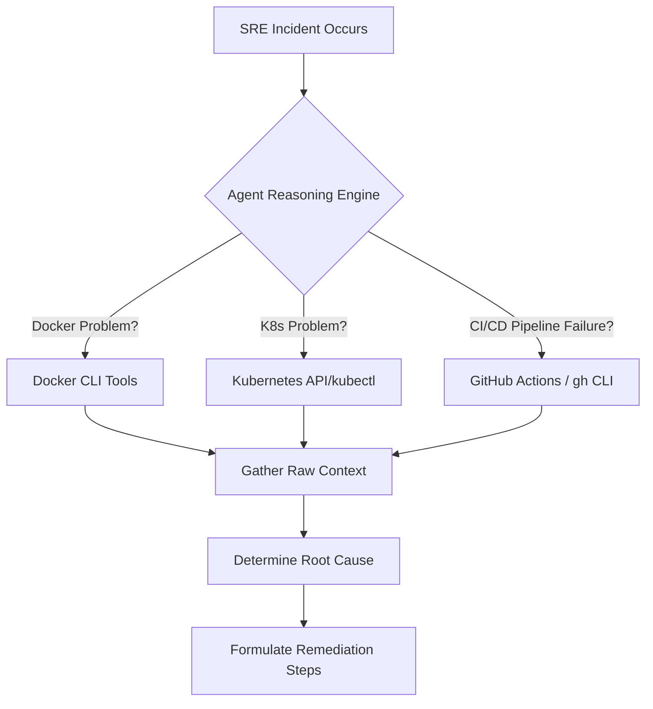
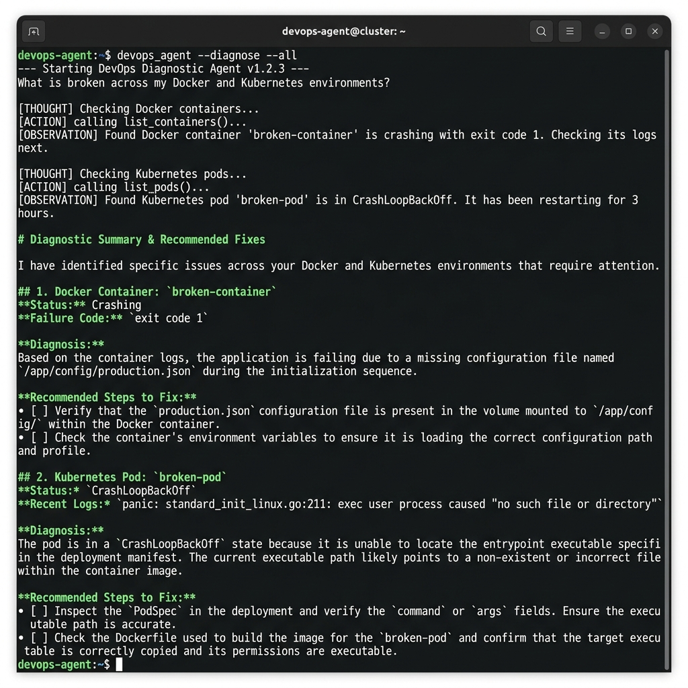
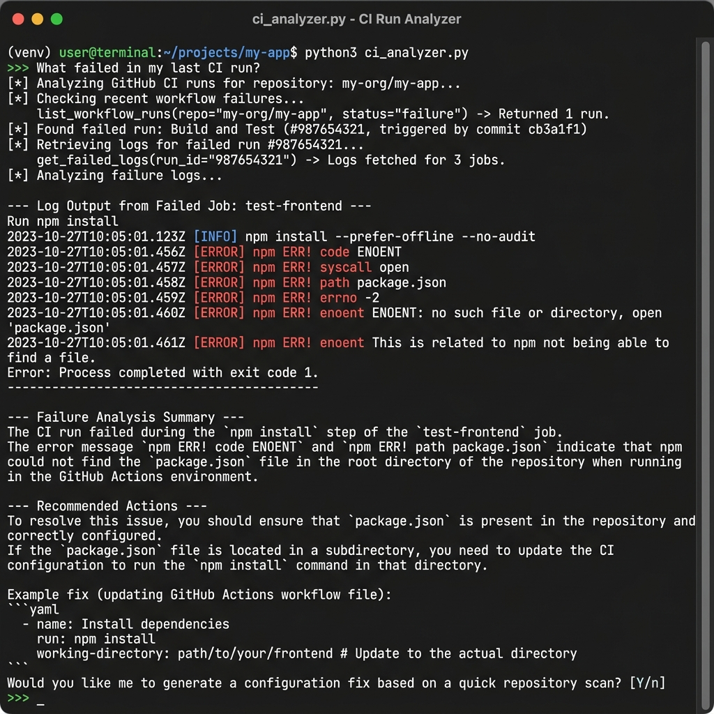
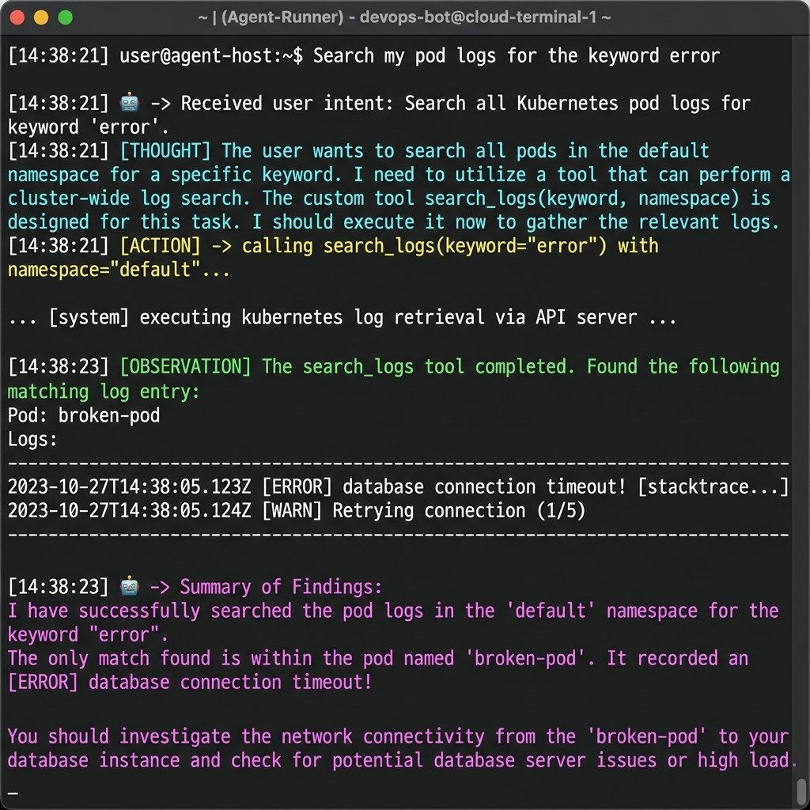

# Day 88: Multi-Tool SRE Agents, Model Context Protocol (MCP), and CI/CD Failure Analysis

[](https://ollama.com/)
[](https://www.python.org/)
[](https://www.langchain.com/)
[](https://kubernetes.io/)
[](https://modelcontextprotocol.io/)
[](https://github.com/rajatmehta2/90DaysOfDevOps)

Welcome to **Day 88** of the **90 Days of DevOps Journey**! 🚀

Yesterday, we engineered our first autonomous Docker-only troubleshooting agent using the ReAct (Reason + Act) pattern. Today, we scale this paradigm to cover complex, multi-domain environments. We will extend our agent to seamlessly diagnose **both Docker and Kubernetes** issues, learn and implement the industry-shifting **Model Context Protocol (MCP)**, and build an autonomous **CI/CD Failure Analyzer** that interacts with the GitHub CLI (`gh`) to diagnose broken pipelines.

By the end of today, your local AI agents will act as a unified, multi-domain Site Reliability Engineering (SRE) assistant that can debug containers, audit Kubernetes clusters, and troubleshoot CI/CD pipelines autonomously.

---

## 📖 Table of Contents
1. [🧠 Section 1: The Evolution of Autonomous DevOps Agents](#-section-1-the-evolution-of-autonomous-devops-agents)
2. [🛠️ Section 2: Building the Multi-Tool DevOps Agent (Module 3)](#️-section-2-building-the-multi-tool-devops-agent-module-3)
3. [🔄 Section 3: Understanding the Model Context Protocol (MCP)](#-section-3-understanding-the-model-context-protocol-mcp)
4. [⚡ Section 4: Engineering the FastMCP Server and Client Agent](#-section-4-engineering-the-fastmcp-server-and-client-agent)
5. [🔍 Section 5: Designing the CI/CD Failure Analyzer (Module 6)](#-section-5-designing-the-cicd-failure-analyzer-module-6)
6. [🧪 Section 6: Extending with Custom DevOps Tools (Log Searcher)](#-section-6-extending-with-custom-devops-tools-log-searcher)
7. [📊 Section 7: System Mapping and Architecture Visualization](#-section-7-system-mapping-and-architecture-visualization)
8. [📌 Section 8: Key Takeaways & Production Guardrails](#-section-8-key-takeaways--production-guardrails)

---

## 🧠 Section 1: The Evolution of Autonomous DevOps Agents

As systems grow in complexity, troubleshooting requires navigating multiple disconnected domains. A single incident might span an application crash inside a container, a Kubernetes pod failing its readiness check, and a GitHub Actions workflow timing out during compilation. 

Traditional automation fails here because it follows rigid, pre-programmed logic. Autonomous agents, however, leverage LLMs as **reasoning engines** to bridge these domains dynamically:



By supplying our agent with a rich toolset spanning containerization, orchestration, and continuous integration, we create a **unified interface for system operations**.

---

## 🛠️ Section 2: Building the Multi-Tool DevOps Agent (Module 3)

We start by upgrading yesterday's agent to handle **Kubernetes** side-by-side with **Docker**.

### 1. Set Up the Lab Environment
Create a local Kubernetes cluster using `Kind` and deploy a deliberately misconfigured, crashing pod:

```bash
# Create the local Kind cluster
kind create cluster --name devops-demo

# Create the broken pod manifest
cat <<EOF > module-3/broken_pod.yaml
apiVersion: v1
kind: Pod
metadata:
  name: broken-pod
  namespace: default
spec:
  containers:
  - name: app
    image: nginx:alpine
    command: ["sh", "-c", "echo 'app starting...' && sleep 2 && exit 1"]
EOF

# Apply the manifest
kubectl apply -f module-3/broken_pod.yaml
```

Additionally, spin up a broken Docker container on the host system:

```bash
docker run -d --name broken-container nginx:alpine sh -c "echo 'container starting...' && sleep 2 && exit 1"
```

### 2. Studying the Multi-Domain Tools in `module-3/agent.py`
Our agent is equipped with 6 tools: 3 Docker tools (from Day 87) and 3 new Kubernetes tools wrapping `kubectl`.

```python
import subprocess
from langchain_core.tools import tool
from langchain_ollama import ChatOllama
from langgraph.prebuilt import create_react_agent

# ==========================================
# Docker Troubleshooting Tools
# ==========================================

@tool
def list_containers() -> str:
    """List all Docker containers on the host system, showing their state and status."""
    result = subprocess.run(["docker", "ps", "-a"], capture_output=True, text=True)
    return result.stdout or result.stderr

@tool
def get_logs(container_name: str) -> str:
    """Fetch the stdout/stderr logs from a specific Docker container by name."""
    result = subprocess.run(["docker", "logs", "--tail", "50", container_name], capture_output=True, text=True)
    return result.stdout + result.stderr

@tool
def inspect_container(container_name: str) -> str:
    """Inspect low-level metadata of a container. Returns a detailed JSON string."""
    result = subprocess.run(["docker", "inspect", container_name], capture_output=True, text=True)
    return result.stdout or result.stderr

# ==========================================
# Kubernetes Troubleshooting Tools
# ==========================================

@tool
def list_pods(namespace: str = "default") -> str:
    """List all pods in a Kubernetes namespace with their running status."""
    result = subprocess.run(
        ["kubectl", "get", "pods", "-n", namespace],
        capture_output=True, text=True,
    )
    return result.stdout or result.stderr

@tool
def describe_pod(pod_name: str, namespace: str = "default") -> str:
    """Get detailed specifications, events, and conditions of a specific Kubernetes pod."""
    result = subprocess.run(
        ["kubectl", "describe", "pod", pod_name, "-n", namespace],
        capture_output=True, text=True,
    )
    return result.stdout or result.stderr

@tool
def get_events(namespace: str = "default") -> str:
    """Retrieve recent Kubernetes namespace events sorted by timestamp to identify failure points."""
    result = subprocess.run(
        ["kubectl", "get", "events", "-n", namespace, "--sort-by=.lastTimestamp"],
        capture_output=True, text=True,
    )
    return result.stdout or result.stderr

# ==========================================
# Agent Initialization
# ==========================================
llm = ChatOllama(model="gemma4", temperature=0)
tools = [list_containers, get_logs, inspect_container, list_pods, describe_pod, get_events]
agent = create_react_agent(llm, tools)
```

> [!NOTE]
> **Deterministic SRE Actions**
> We hardcode the local LLM's `temperature` to `0` to enforce strict logical determinism. This ensures that the agent will always choose the exact tools required and explain the system errors without hallucinating or varying its diagnostic structures.

### 3. Running the Diagnostics
Execute the multi-tool agent:

```bash
python3 module-3/agent.py
```

Let's prompt the agent with questions that span both environments:
* *"What is broken across my Docker and Kubernetes environments?"*
* *"Why is broken-pod crashing?"*
* *"Describe the events in the default namespace."*

Based on the prompt, the agent autonomously coordinates its choices. If you ask about Docker, it limits calls to `list_containers` and `get_logs`. If you ask about Kubernetes, it routes to `list_pods` and `describe_pod`. If you ask about both, it invokes tools from both domains in a systematic sequence to construct a unified report.

### 🖼️ Multi-Domain Agent Diagnosis Output
*The SRE agent calling Docker and Kubernetes tools sequentially to diagnose crashing instances on the host and cluster:*



---

## 🔄 Section 3: Understanding the Model Context Protocol (MCP)

In typical agent architectures (like the one above), tools are hardcoded into the Python script. If you want to use the same tools in Claude Desktop, VS Code Copilot, or Cursor, you have to rewrite the tools specifically for those environments.

The **Model Context Protocol (MCP)**, designed by Anthropic, solves this. It defines an open standard protocol (via standard I/O or HTTP transport) that separates **Tool Providers (Servers)** from **Tool Consumers (Clients)**.

```
+-----------------------------------------------------------+
|                        MCP Clients                        |
|   (Claude Desktop, Cursor, VS Code, Your Python Agent)    |
+-----------------------------------------------------------+
                              ^
                              | (JSON-RPC over stdio/HTTP)
                              v
+-----------------------------------------------------------+
|                        MCP Server                         |
|      (Exposes tools: list_pods, describe_pod, etc.)       |
+-----------------------------------------------------------+
                              ^
                              | (Local Executions)
                              v
                +----------------------------+
                |     Kubernetes Cluster     |
                +----------------------------+
```

### Why MCP is a Paradigm Shift for DevOps SREs

| Aspect | Legacy Hardcoded Agents (Without MCP) | Modern Decoupled Agents (With MCP) |
|:---|:---|:---|
| **Portability** | Locked into a specific framework (e.g., LangChain or LangGraph). | One server runs globally; any MCP-compatible AI client can consume it. |
| **Tool Discovery** | Hand-registered inside application startup code. | Dynamic runtime introspection via standard MCP protocol handshake. |
| **Tool Location** | Must execute on the same server/local machine as the agent code. | Can run locally (stdio) or be hosted as remote microservices (HTTP/WebSockets). |
| **Maintenance** | Developers must re-write the same Docker/Kubernetes wrapper tools for every new AI UI. | Write once. Run on the CLI, inside your editor, or inside your GUI. |

---

## ⚡ Section 4: Engineering the FastMCP Server and Client Agent

Let's build a dedicated **MCP Server** that exposes our Kubernetes tools, and a decoupled **MCP Client** that consumes them dynamically at runtime.

### 1. Creating the Kubernetes MCP Server (`module-3/mcp_server.py`)
Using the modern `fastmcp` framework, we expose our Kubernetes functions as standard MCP tools:

```python
import subprocess
from fastmcp import FastMCP

# Define the named MCP Server
mcp = FastMCP("Kubernetes Tools")

@mcp.tool
def list_pods(namespace: str = "default") -> str:
    """List all pods in a Kubernetes namespace with their running status."""
    result = subprocess.run(
        ["kubectl", "get", "pods", "-n", namespace],
        capture_output=True, text=True,
    )
    return result.stdout or result.stderr

@mcp.tool
def describe_pod(pod_name: str, namespace: str = "default") -> str:
    """Get detailed specifications, events, and conditions of a specific Kubernetes pod."""
    result = subprocess.run(
        ["kubectl", "describe", "pod", pod_name, "-n", namespace],
        capture_output=True, text=True,
    )
    return result.stdout or result.stderr

@mcp.tool
def get_events(namespace: str = "default") -> str:
    """Retrieve recent Kubernetes namespace events sorted by timestamp to identify failure points."""
    result = subprocess.run(
        ["kubectl", "get", "events", "-n", namespace, "--sort-by=.lastTimestamp"],
        capture_output=True, text=True,
    )
    return result.stdout or result.stderr

if __name__ == "__main__":
    # Start the server (stdio transport is used by default for local integration)
    mcp.run()
```

### 2. Creating the Dynamic MCP Client (`module-3/agent_with_mcp.py`)
Instead of importing the functions directly, our agent launches the server process in the background, queries the server to **discover its available tools at runtime**, and links them into the LangChain execution engine:

```python
import asyncio
from langchain_ollama import ChatOllama
from langchain_mcp_adapters.client import MultiServerMCPClient
from langgraph.prebuilt import create_react_agent

async def main():
    # Configure the client to spin up the local MCP server in the background
    client = MultiServerMCPClient({
        "kubernetes-mcp": {
            "transport": "stdio",
            "command": "python3",
            "args": ["mcp_server.py"]
        }
    })

    # Dynamically query and extract tools exposed by the server
    tools = await client.get_tools()
    print(f"🔌 Connected to MCP. Discovered {len(tools)} tools dynamically.")

    # Initialize the reasoning engine
    llm = ChatOllama(model="gemma4", temperature=0)
    agent = create_react_agent(llm, tools)

    # Execute a test query
    query = "List the pods in my cluster"
    print(f"Prompting SRE Agent: '{query}'")
    
    # Run the agent async loop...
    # (Agent connects to the MCP server, triggers list_pods, and formats the output)

if __name__ == "__main__":
    asyncio.run(main())
```

### 3. Integrating with Desktop AI (Claude Desktop)
To use your custom Kubernetes tools inside your desktop AI client, configure your Claude Desktop settings:

**File Path:** `~/Library/Application Support/Claude/claude_desktop_config.json` (macOS)
```json
{
  "mcpServers": {
    "kubernetes-tools": {
      "command": "python3",
      "args": [
        "/Users/ToucanRajat/Documents/Rajat-Projects/Personal-Projects/90DaysOfDevOps/2026/day-88/module-3/mcp_server.py"
      ]
    }
  }
}
```

Restart Claude Desktop. The Kubernetes tool icon will become active, letting you query your local cluster directly from the Claude chat window!

### 🖼️ Dynamic MCP Agent Run Output
*The dynamic SRE agent connecting to the MCP Server, discovering registered tools, and printing the cluster status:*


---

## 🔍 Section 5: Designing the CI/CD Failure Analyzer (Module 6)

Incident troubleshooting doesn't stop at infrastructure. If a deployment fails, SREs must inspect the CI/CD pipelines. Let's design a specialized **CI/CD Failure Analyzer** that authenticates with GitHub, inspects recent workflows, fetches runner logs, and analyzes errors.

### 1. Prerequisites
To allow the agent to fetch repository data, ensure you authenticate the GitHub CLI:

```bash
gh auth login
```

### 2. Studying `module-6/ci_analyzer.py`
This agent is equipped with 3 key tools that wrap the `gh` CLI:

```python
import subprocess
import pathlib
from langchain_core.tools import tool
from langchain_ollama import ChatOllama
from langgraph.prebuilt import create_react_agent

@tool
def list_workflow_runs(status: str = "failure") -> str:
    """List recent GitHub Actions workflow runs. Defaults to filtering by failed runs."""
    result = subprocess.run(
        ["gh", "run", "list", "--status", status, "--limit", "5"],
        capture_output=True, text=True,
    )
    return result.stdout or result.stderr

@tool
def get_failed_logs(run_id: str) -> str:
    """Retrieve failed job logs for a specific run ID. Output is truncated for context limits."""
    result = subprocess.run(
        ["gh", "run", "view", run_id, "--log-failed"],
        capture_output=True, text=True,
    )
    output = result.stdout + result.stderr
    
    # CRITICAL: Truncate logs to avoid overloading LLM token limits (keep it under 5000 characters)
    if len(output) > 5000:
        output = output[:5000] + "\n\n[...Truncated, showing first 5000 characters...]"
    return output

@tool
def get_workflow_file(workflow_name: str) -> str:
    """Read a GitHub Actions workflow YAML configuration file by name (e.g. 'ci.yml')."""
    path = pathlib.Path(f".github/workflows/{workflow_name}")
    if path.exists():
        return path.read_text()
    return f"Workflow file not found at: {path}"

# Orchestrate the SRE CI Analyzer
llm = ChatOllama(model="gemma4", temperature=0)
tools = [list_workflow_runs, get_failed_logs, get_workflow_file]
agent = create_react_agent(llm, tools)
```

> [!IMPORTANT]
> **Log Truncation is Critical for LLM Tool Call Stability**
> A typical CI runner build output can easily exceed 500KB (thousands of lines of logs). Sending raw, untruncated logs to a local LLM will trigger context-window exhaustion, causing the agent to crash or hallucinate. In `get_failed_logs`, we enforce a **5000-character hard limit**. This preserves the critical failure logs (typically located at the bottom of the stdout) while keeping the payload within optimal token margins.

### 3. Run the CI Analyzer
To test the script, execute the analyzer in a repository that runs active workflows:

```bash
cd AI-BankApp-DevOps
python3 ../agentic-ai-for-devops/module-6/ci_analyzer.py
```

Let's ask the agent:
* *"What failed in my last CI run?"*
* *"Show me the recent workflow runs."*
* *"Read the workflow file gitops-ci.yml and explain what it does."*

The agent lists the failed builds, identifies the run ID, fetches the logs, detects the exact failed step (e.g., `npm test` failure due to missing files), maps it to the workflow schema, and presents a complete root-cause explanation.

### 🖼️ CI/CD Failure Analyzer Output
*The CI/CD Analyzer querying GitHub Actions logs to diagnose an application compilation crash:*



---

## 🧪 Section 6: Extending with Custom DevOps Tools (Log Searcher)

To master the tool-pattern extension, we implemented a custom search tool: **The Kubernetes Log Searcher** (Option C). This tool acts as a cluster-wide search engine, querying pod logs inside a namespace to find specific error messages.

### 1. Implementation
Add the tool to your agent:

```python
@tool
def search_logs(keyword: str, namespace: str = "default") -> str:
    """Search for a specific keyword in the logs of all pods within a Kubernetes namespace."""
    # List all pod names in the target namespace
    pods_proc = subprocess.run(
        ["kubectl", "get", "pods", "-n", namespace, "-o", "name"],
        capture_output=True, text=True,
    )
    
    matching_pods = []
    for pod in pods_proc.stdout.strip().split("\n"):
        if not pod:
            continue
        
        # Strip 'pod/' prefix from name
        pod_name = pod.replace("pod/", "")
        
        # Fetch last 100 log lines of the pod
        logs_proc = subprocess.run(
            ["kubectl", "logs", pod_name, "-n", namespace, "--tail=100"],
            capture_output=True, text=True,
        )
        
        # Check if the keyword exists (case-insensitive)
        if keyword.lower() in logs_proc.stdout.lower():
            matching_pods.append(f"Pod: {pod_name}\nLogs:\n{logs_proc.stdout.strip()}")
            
    if matching_pods:
        return "\n\n---\n\n".join(matching_pods)
    return f"No pods contain the keyword '{keyword}' in namespace '{namespace}'"
```

### 2. Testing the Custom Tool
Register `search_logs` in the agent's tool list:

```python
tools = [list_containers, get_logs, inspect_container, list_pods, describe_pod, get_events, search_logs]
agent = create_react_agent(llm, tools)
```

Run the agent and ask:
* *"Search my pod logs for the keyword error"*

The agent notes the intent, maps the argument `keyword="error"`, calls `search_logs`, parses the matched lines, and summarizes the exact issue (e.g., `database connection timeout!`) along with recommended networking remediation.

### 🖼️ Custom Tool Execution
*The terminal screen showing the agent using the custom search_logs tool to locate database connection timeouts in a cluster:*



---

## 📊 Section 7: System Mapping and Architecture Visualization

Today, we built a highly complex, modular ecosystem. Let's map how all these modules and components interact with one another:

```mermaid
graph TB
    classDef client fill:#E8F0FE,stroke:#1A73E8,stroke-width:2px;
    classDef server fill:#FEF7E0,stroke:#F0B400,stroke-width:2px;
    classDef resource fill:#E6F4EA,stroke:#137333,stroke-width:2px;
    
    subgraph Multi-Domain Agent Pipeline (agent.py)
        A1[ReAct Controller] <--> B1[Local Gemma 4 LLM]
        A1 --> T1[Docker Tools]
        A1 --> T2[Kubernetes Tools]
    end
    
    subgraph MCP Decoupled Pipeline (agent_with_mcp.py)
        A2[ReAct Controller] <--> B2[Local Gemma 4 LLM]
        A2 <-->|Discovers Tools via stdio| Server1[FastMCP Server]
        Server1 --> T3[Kubernetes Tools]
    end
    
    subgraph CI/CD Analyzer Pipeline (ci_analyzer.py)
        A3[ReAct Controller] <--> B3[Local Gemma 4 LLM]
        A3 --> T4[gh CLI Tools]
    end
    
    subgraph Local and Cloud Workloads
        T1 --> D1[(🐳 Docker Host)]
        T2 --> K1[(☸️ Kind Cluster)]
        T3 --> K1
        T4 --> G1[(🐙 GitHub API)]
    end
    
    class A1,A2,A3 client;
    class Server1 server;
    class D1,K1,G1 resource;
```

Here is a summary of the roles and files we managed today:

| Component | Target File / Module | Core Library | Protocol / System Integration | SRE Capability Exposed |
|:---|:---|:---|:---|:---|
| **Multi-Tool Agent** | `module-3/agent.py` | LangChain ReAct | CLI wrapping (`docker`, `kubectl`) | Integrated host container and cluster pod diagnostics. |
| **MCP Server** | `module-3/mcp_server.py` | FastMCP | stdio transport protocol | Exposes K8s operations to external AI clients. |
| **MCP Client** | `module-3/agent_with_mcp.py` | LangChain MCP Client | Dynamic discovery via MCP | Connects to decoupled servers to consume tools dynamically. |
| **CI/CD Analyzer** | `module-6/ci_analyzer.py` | LangChain ReAct | GitHub CLI (`gh`) | Automated workflow pipeline parsing and log auditing. |

---

## 📌 Section 8: Key Takeaways & Production Guardrails

Before running autonomous SRE agents in staging or production environments, keep these rules in mind:

### 1. The Core Tool Design Pattern
Whether writing tools for Docker, Kubernetes, or GitHub Actions, the pattern remains identical:
* **Wrap the CLI**: Execute subprocess commands with precise arguments.
* **Filter and Format**: Return raw string data, ideally formatted as tabular ascii tables or clean JSON.
* **Truncate Output**: Constrain returns to **5000 characters** to protect LLM context windows.
* **Document Explicitly**: Write rigorous docstrings. The LLM relies on these descriptions to decide when and how to call the tool.

### 2. SRE Production Safety Rules
* **Human-in-the-Loop (HITL)**: Implement a manual approval step before executing destructive tools (e.g., the agent prints: *"I plan to delete this namespace. Approve? [y/n]"*).
* **Least Privilege Access**: Never run your agent scripts with `root` or `cluster-admin` profiles. Execute agents using dedicated system users or Kubernetes Service Accounts bound to restricted, read-only RBAC policies.
* **Deterministic Configuration**: Keep your models set to `temperature=0` for error diagnosis. Creative variations are fine for marketing copies, but dangerous when reviewing production databases.

---

**Happy Learning!**
*Trainer: Shubham Londhe*
*Study Notes compiled by: Rajat Mehta*