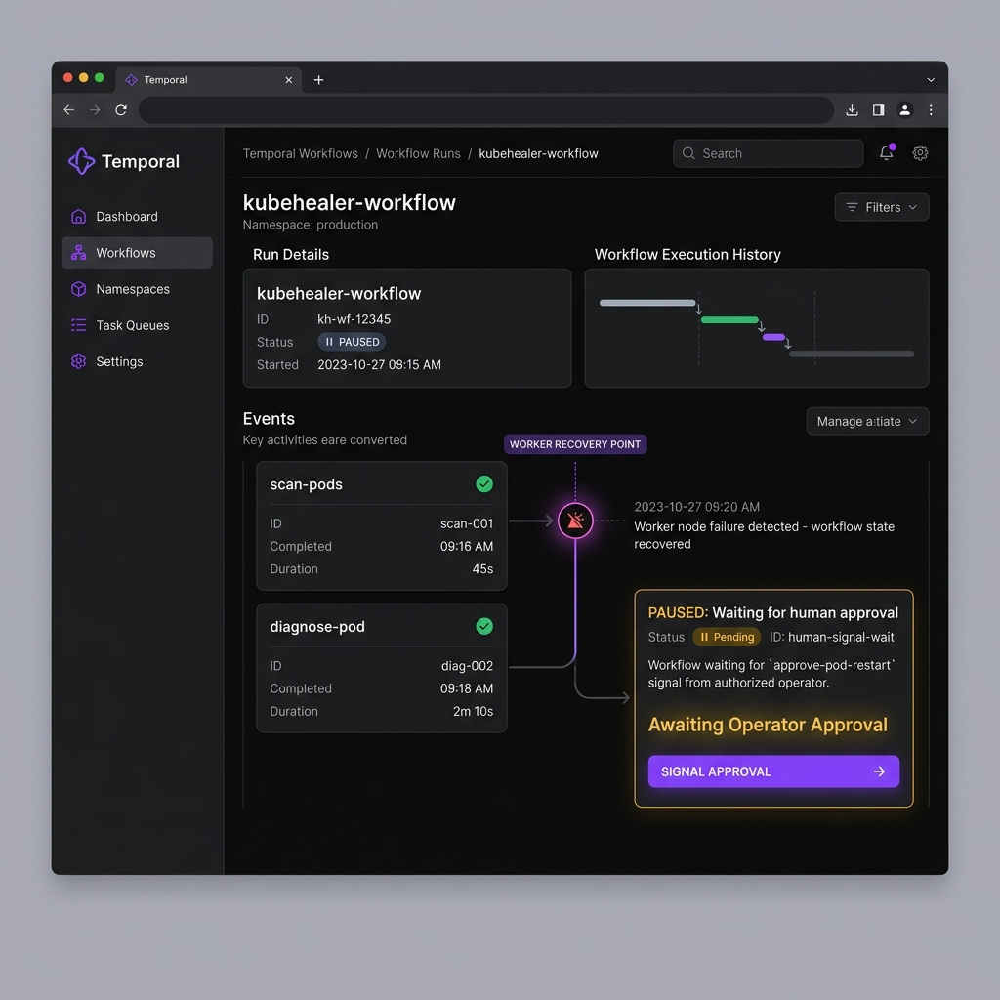

# Day 89: Production AI Agents: KubeHealer and AIOps

[](https://temporal.io/)
[](https://www.python.org/)
[](https://www.anthropic.com/)
[](https://kubernetes.io/)
[](https://github.com/TrainWithShubham/kubehealer)
[](https://github.com/rajatmehta2/90DaysOfDevOps)

Welcome to **Day 89** of the **90 Days of DevOps Journey**! 🚀

For the past few days, we have built AI agents that diagnose problems, search logs, and troubleshoot continuous integration pipelines. Today, we build a production-grade agent that does not just explain the problem—it **fixes it autonomously**. 

We introduce **KubeHealer**: a robust, production-grade AI agent designed to monitor a Kubernetes cluster for broken pods, diagnose the underlying root causes using Claude 3.5 Sonnet, formulate appropriate yaml patches, and apply those fixes—all while keeping humans in the loop for ultimate safety. More importantly, KubeHealer uses **Temporal** for durable execution. If the agent crashes in the middle of a complex multi-step repair, it picks up *exactly* where it left off, avoiding partial state updates or duplicate actions.

This is the transition to true **AIOps**—AI-powered operations. Not a conversational chatbot, but a resilient system that watches, reasons, and acts.

---

## 📖 Table of Contents
1. [🧠 Section 1: Foundations of AIOps and Production Guardrails](#-section-1-foundations-of-aiops-and-production-guardrails)
2. [🛠️ Section 2: KubeHealer Architecture Deep Dive](#-section-2-kubehealer-architecture-deep-dive)
3. [⚙️ Section 3: Setting Up the KubeHealer Environment](#-section-3-setting-up-the-kubehealer-environment)
4. [💥 Section 4: Deploying Intentionally Broken Applications](#-section-4-deploying-intentionally-broken-applications)
5. [⚡ Section 5: Orchestrating Autonomous Healing with KubeHealer](#-section-5-orchestrating-autonomous-healing-with-kubehealer)
6. [🔄 Section 6: Testing Durable Execution and Crash Recovery](#-section-6-testing-durable-execution-and-crash-recovery)
7. [⚖️ Section 7: SRE Guide: AI Agents vs Traditional Automation](#-section-7-sre-guide-ai-agents-vs-traditional-automation)
8. [🔗 Section 8: Mapping the 90-Day Challenge to Agentic AI](#-section-8-mapping-the-90-day-challenge-to-agentic-ai)
9. [📢 Section 9: Sharing Your Learning in Public](#-section-9-sharing-your-learning-in-public)

---

## 🧠 Section 1: Foundations of AIOps and Production Guardrails

### What is AIOps?
**AIOps** (Artificial Intelligence for IT Operations) combines big data, machine learning, and AI logic to automate primary IT operations processes. In a modern DevOps infrastructure, it serves to:
* **Ingest & Correlate:** Aggregates metrics, logs, events, and traces across highly distributed cloud resources.
* **Diagnose & Reason:** Uses cognitive engines (like Large Language Models) to perform Root Cause Analysis (RCA) on unexplained, dynamic incidents.
* **Remediate:** Coordinates CLI scripts, API triggers, and configuration changes to patch the failure state.
* **Escalate:** Automatically hands off the incident to human SRE teams with parsed, summarized event trails when it detects issues outside its authorized scope.

### The 6 Production Guardrails Every AI Agent Needs
Deploying an autonomous agent with infrastructure modification privileges requires ironclad control boundaries. The agent must never operate unchecked:

| Guardrail | Why it is Critical | KubeHealer Implementation Example |
| :--- | :--- | :--- |
| 🛡️ **Human Approval** | Prevents the agent from executing destructive, costly, or unsafe changes without explicit validation. | The agent pauses execution and displays proposed yaml patches, asking: `Approve all fixes? [yes/no]:` |
| 🌐 **Scope Limits** | Restricts the agent's write access to non-sensitive boundaries. | Bound by Kubernetes RBAC to operate only in allowed namespaces, leaving namespaces like `kube-system` untouched. |
| 📝 **Audit Trail** | Ensures full accountability for every action taken by the AI. | Temporal records every event, tool call, reasoning thought process, and API request in immutable workflow history. |
| ↩️ **Rollback Capability** | Allows operators to revert actions if the remediation degrades system performance. | The agent performs targeted `kubectl patch` commands rather than raw deletions, making it easier to reverse configurations. |
| ⏱️ **Timeout & Retry Limits** | Prevents the agent from entering infinite reasoning loops, calling APIs repeatedly, or consuming excessive tokens. | Configures a maximum of 3 retries per pod, and sets a strict 5-minute timeout per workflow execution. |
| 🚨 **Escalation Path** | Allows the agent to raise the alarm and step aside when a problem exceeds its knowledge or authorization. | If a missing dependency is identified (e.g., a missing ConfigMap), the agent logs: `CANNOT FIX - needs manual creation. Escalating.` |

> [!WARNING]
> **Traditional Automation vs AI Autonomy**
> Unlike standard Cron jobs or shell scripts that fail blindly when encountering unexpected states, an AIOps agent must dynamically adapt. However, this flexibility makes **human approval** and **RBAC-based scope limits** mandatory. Never run a self-healing agent in production with cluster-admin privileges.

### Why Durable Execution (Temporal) Matters
Traditional scripts run inside ephemeral processes (like a shell script or basic python runner). If the server hosting your script crashes, network packets drop, or the container restarts mid-remediation, the script dies:
* **The Danger:** You are left with an inconsistent state (e.g., container memory limit increased, but dependent config maps never updated).
* **The Solution (Temporal):** Temporal is a durable execution platform. It records every single workflow state change, activity execution, and variable assignment inside an external database. If the active KubeHealer worker process crashes during a repair:
  1. The worker process dies.
  2. A new worker starts up.
  3. Temporal **replays the event history** up to the exact crash point.
  4. The worker resumes execution seamlessly at the next incomplete activity—**without re-running already completed tasks** (like calling Claude again or scanning the pods).

---

## 🛠️ Section 2: KubeHealer Architecture Deep Dive

KubeHealer leverages three pillars to deliver reliable, durable self-healing:

1. **Reasoning Engine (Anthropic Claude 3.5 Sonnet):** Examines the pod logs, describes events, parses errors, and devises target fixes.
2. **Durable Orchestration (Temporal):** Guarantees that the multistep scan-diagnose-propose-approve-apply workflow runs reliably to completion, even during machine crashes.
3. **Execution Layer (Kubernetes client / kubectl):** The tools used by the worker to query cluster states and patch manifests.

### System Workflow Execution Flow
The sequence diagram below visualizes how the components interact during a standard remediation cycle:

```mermaid
sequenceDiagram
    autonumber
    actor Human as Operator
    participant Starter as Starter Script
    participant Temporal as Temporal Orchestrator
    participant Worker as KubeHealer Worker
    participant Claude as Claude 3.5 Sonnet
    participant K8s as Kubernetes API

    Starter->>Temporal: Trigger KubeHealer Workflow
    activate Temporal
    Temporal->>Worker: Run "Scan Pods" Activity
    Worker->>K8s: kubectl get pods -n default
    K8s-->>Worker: Return broken pods list
    Worker-->>Temporal: Report broken pods (web-app, memory-app, config-app)
    
    Temporal->>Worker: Run "Diagnose Pods" Activity
    rect rgb(30, 30, 40)
        Note over Worker, Claude: Loop for each broken pod
        Worker->>K8s: kubectl describe pod & logs
        K8s-->>Worker: Return detailed events & logs
        Worker->>Claude: Analyze diagnostics context
        Claude-->>Worker: Return root-cause analysis & proposed patch
    end
    Worker-->>Temporal: Report diagnoses and proposed patches
    
    Temporal->>Human: Pause & Wait for Signal (Human-in-the-Loop)
    Note over Human, Temporal: Operator reviews proposed fixes
    Human->>Temporal: Approve Fixes (Sends "yes" signal)
    
    Temporal->>Worker: Run "Apply Fixes" Activity
    rect rgb(40, 30, 30)
        Note over Worker, K8s: Apply patches to approved pods
        Worker->>K8s: kubectl patch pod (web-app, memory-app)
        Worker-->>Temporal: Fixes applied successfully (pods transition to Running)
    end
    
    deactivate Temporal
```



---

## ⚙️ Section 3: Setting Up the KubeHealer Environment

To run this production-grade lab, prepare your local system with the following setup.

### 1. Clone the KubeHealer Repository
Clone the repository containing the Temporal worker and starter scripts:
```bash
git clone https://github.com/TrainWithShubham/kubehealer.git
cd kubehealer
```

### 2. Provision a Local Kubernetes Cluster
Spin up a local multi-node cluster using `Kind` to host the intentionally broken workloads:
```bash
kind create cluster --name kubehealer-demo
```

### 3. Spin Up the Temporal Server
Start the local Temporal development server. This runs the orchestrator engine in the background and sets up the Web UI:
```bash
temporal server start-dev
```
* Once started, the **Temporal Web Console** is available at: [http://localhost:8233](http://localhost:8233)

### 4. Configure the Python Virtual Environment
Initialize a clean Python environment and install the required dependencies (including the Temporal SDK and Anthropic client):
```bash
# Create and activate virtual environment
python3 -m venv .venv
source .venv/bin/activate

# Install dependencies
pip install -r requirements.txt
```

### 5. Set Your Anthropic Claude API Key
Sign up at the [Anthropic Console](https://console.anthropic.com/) to get your API key, then export it in your terminal session:
```bash
export ANTHROPIC_API_KEY="your-api-key-here"
```

---

## 💥 Section 4: Deploying Intentionally Broken Applications

To demonstrate KubeHealer's intelligence and guardrails, we will deploy three distinct applications with unique failures.

### App 1: The Image Typo (Fixable)
This deployment contains a common spelling error inside the image path (`ngnix` instead of `nginx`), which triggers a standard `ImagePullBackOff` state.
```yaml
kubectl apply -f - <<EOF
apiVersion: v1
kind: Pod
metadata:
  name: web-app
  namespace: default
spec:
  containers:
  - name: web
    image: ngnix:latest
    ports:
    - containerPort: 80
EOF
```

### App 2: The Out-Of-Memory limit (Fixable)
This deployment specifies a strict memory limit of `1Mi` (1 Megabyte). Because Nginx requires significantly more memory to boot up, the container is instantly terminated by the kernel, triggering `CrashLoopBackOff` with `OOMKilled`.
```yaml
kubectl apply -f - <<EOF
apiVersion: v1
kind: Pod
metadata:
  name: memory-app
  namespace: default
spec:
  containers:
  - name: app
    image: nginx:alpine
    resources:
      limits:
        memory: "1Mi"
    command: ["sh", "-c", "echo 'starting' && sleep 3600"]
EOF
```

### App 3: The Missing Configuration Map (Unfixable / Escalation Required)
This application references an environment configuration source from an external `ConfigMap` called `app-config`. Because this ConfigMap does not exist in the cluster, the container fails to start, showing `CreateContainerConfigError`.
```yaml
kubectl apply -f - <<EOF
apiVersion: v1
kind: Pod
metadata:
  name: config-app
  namespace: default
spec:
  containers:
  - name: app
    image: nginx:alpine
    envFrom:
    - configMapRef:
        name: app-config
EOF
```

### Verification
Run `kubectl get pods` to verify that all three workloads are failing as expected:
```bash
kubectl get pods
```

**Output:**
```text
NAME         READY   STATUS                       RESTARTS   AGE
config-app   0/1     CreateContainerConfigError   0          45s
memory-app   0/1     CrashLoopBackOff             3          1m
web-app      0/1     ImagePullBackOff             0          1m20s
```

---

## ⚡ Section 5: Orchestrating Autonomous Healing with KubeHealer

Now, let's run our self-healing worker and witness how it analyzes the failures and proposes remediation patches.

### 1. Start the KubeHealer Worker
The worker polls Temporal for tasks and executes activities like listing pods, describing events, querying Claude, and applying patches. Run it in your terminal:
```bash
python3 worker.py
```

### 2. Trigger the Self-Healing Run
In a second terminal window, initiate the self-healing workflow:
```bash
python3 starter.py
```

### 3. Observe the Diagnostic Stage
KubeHealer acts in real-time. The starter initiates the run, and the worker executes the following logic:
1. **Scans** the cluster namespace to identify any pods in non-running states.
2. **Diagnoses** each pod by calling `kubectl describe pod` and fetching event logs.
3. **Presents context** to Claude, requesting a safe patch schema.
4. **Formulates** the exact changes required.

```text
Found 3 broken pods.

Proposed fixes:
1. web-app: Fix image typo (ngnix -> nginx)
2. memory-app: Increase memory limit (1Mi -> 128Mi)
3. config-app: CANNOT FIX - needs manual ConfigMap creation

Approve all fixes? [yes/no]:
```

### 🖼️ KubeHealer Proposing Fixes
*Here is the terminal window showing KubeHealer diagnosing the cluster, listing the exact root causes, and requesting operator approval:*


### 4. Approve and Run the Remediation
Type `yes` in the terminal to authorize the worker to continue:
* **`web-app` Remediation:** The worker sends a `kubectl patch` command to update the container's image tag to `nginx:latest`.
* **`memory-app` Remediation:** The worker patches the pod's resources limits config to `128Mi` of memory.
* **`config-app` Remediation:** The worker skips applying a patch because creating an arbitrary ConfigMap requires human architecture decisions. It logs an escalation ticket and keeps the pod as-is.

### 5. Final Cluster Verification
Verify that the approved pods have recovered successfully:
```bash
kubectl get pods
```

**Output:**
```text
NAME         READY   STATUS                       RESTARTS   AGE
config-app   0/1     CreateContainerConfigError   0          4m
memory-app   1/1     Running                      0          20s
web-app      1/1     Running                      0          15s
```
*The image typo and OOM pods are now healthy and running! The config-app remains in an error state, successfully bypassed as specified by our guardrails.*

---

## 🔄 Section 6: Testing Durable Execution and Crash Recovery

To demonstrate the power of durable execution using Temporal, we will simulate a worker crash during a live healing process.

### 1. Reset the Failures
Delete the current pods and redeploy the broken applications:
```bash
kubectl delete pod web-app memory-app config-app
# Apply the broken manifests from Section 4 again
```

### 2. Initiate the Process
Start the worker and starter:
```bash
python3 worker.py &
python3 starter.py
```

### 3. Kill the Worker Process Mid-Diagnosis
While KubeHealer is analyzing the pods (specifically *before* you type `yes` to the approval prompt), kill the active python worker:
```bash
# Locate and terminate the worker process
kill $(pgrep -f worker.py)
```
At this point, the worker process is dead. In a standard shell-script or non-durable agent, the run state is completely lost, leaving you with no logs, no recovery path, and potentially incomplete changes.

### 4. Restart the Worker
Start the python worker again:
```bash
python3 worker.py
```

### 5. Replay and Resume
Watch the logs! The new worker contacts the Temporal cluster, checks the current state of the workflow ID, and retrieves the complete execution history. It replays the completed activities (scanning and diagnostics) instantly without calling the Claude API a second time, and immediately displays the approval prompt:
```text
Proposed fixes:
1. web-app: Fix image typo (ngnix -> nginx)
2. memory-app: Increase memory limit (1Mi -> 128Mi)
3. config-app: CANNOT FIX - needs manual ConfigMap creation

Approve all fixes? [yes/no]:
```

### 🖼️ Temporal UI Workflow View
*The Temporal Console showing the entire event history of `kubehealer-workflow`, displaying successful activities, the crash recovery point, and the pending signal approval step:*



---

## ⚖️ Section 7: SRE Guide: AI Agents vs Traditional Automation

When designing your site reliability strategies, use the table below to decide whether to implement an autonomous AI agent or write standard procedural scripts.

| Scenario | Use AI Agents (KubeHealer) | Use Traditional Automation (Cron, Scripts) |
| :--- | :--- | :--- |
| **Problem Complexity** | Dynamic, unpredicted errors (e.g., application crashes with unknown stack traces). | Known, static problems (e.g., disk usage reached 90%, clear `/tmp`). |
| **Logic Type** | Cognitive reasoning and logical deduction using LLMs. | Rigid, procedural logic (`if container_status == dead, then restart`). |
| **Execution Safety** | Requires contextual approval gates and signal confirmations. | Can run completely unattended without human intervention. |
| **Failure Scope** | Multi-step dynamic changes across container, config, and network files. | Single-step targeted changes (e.g., scale replica counts). |
| **Cost Profile** | High compute/API cost (LLM tokens per run). | Extremely low compute cost (standard scripts run locally). |
| **Best Examples** | Pod troubleshooting, CI failure analysis, log auditing. | Autoscaling, metric-based alerts, daily backups. |

---

## 🔗 Section 8: Mapping the 90-Day Challenge to Agentic AI

Agentic AI acts as the connective tissue that bridges every single concept covered in this 90-day DevOps roadmap. Rather than learning tools in isolation, autonomous agents allow you to orchestrate them dynamically:

```
                  +-----------------------------------+
                  |      Autonomous SRE Agent         |
                  +-----------------------------------+
                                    |
     +------------------------------+------------------------------+
     |                              |                              |
     v                              v                              v
+------------+                +------------+                 +------------+
| Container  |                | Orchestrat.|                 | Monitor /  |
| Operations |                | Pipelines  |                 | Observab.  |
+------------+                +------------+                 +------------+
| CLI tools: |                | Actions &  |                 | Fetch logs,|
| docker ps, |                | GitOps:    |                 | Prometheus |
| inspect    |                | gh run list|                 | metrics    |
+------------+                +------------+                 +------------+
```

| Challenge Phase | What You Learned | How Agentic AI Integrates It |
| :--- | :--- | :--- |
| **Days 29–37 (Docker)** | Images, volume mounts, ports, and lifecycle commands. | SRE agents wrap standard Docker CLI inputs/outputs inside structured tool code to diagnose host processes. |
| **Days 40–49 (CI/CD)** | GitHub Actions workflows, runner environments, YAML syntax. | The CI/CD Failure Analyzer uses GitHub APIs to fetch logs, locate compilation errors, and propose code fixes. |
| **Days 50–67 (Kubernetes)** | Pod specs, services, ConfigMaps, RBAC, and cluster debugging. | KubeHealer queries `kubectl` endpoints and constructs live JSON patch payloads to automatically repair failed configurations. |
| **Days 73–77 (Observability)** | Prometheus metrics, Loki log ingestion, Grafana dashboards. | SRE agents can execute query parameters against Loki or Prometheus APIs to perform real-time error-pattern correlation. |
| **Days 84–86 (GitOps)** | ArgoCD sync loops, state drift detection, config management. | Self-healing agents can monitor ArgoCD drift states and automatically generate Git pull requests to reconcile code. |

---

**Happy Learning!**
*Trainer: Shubham Londhe*
*Study Notes compiled by: Rajat Mehta*