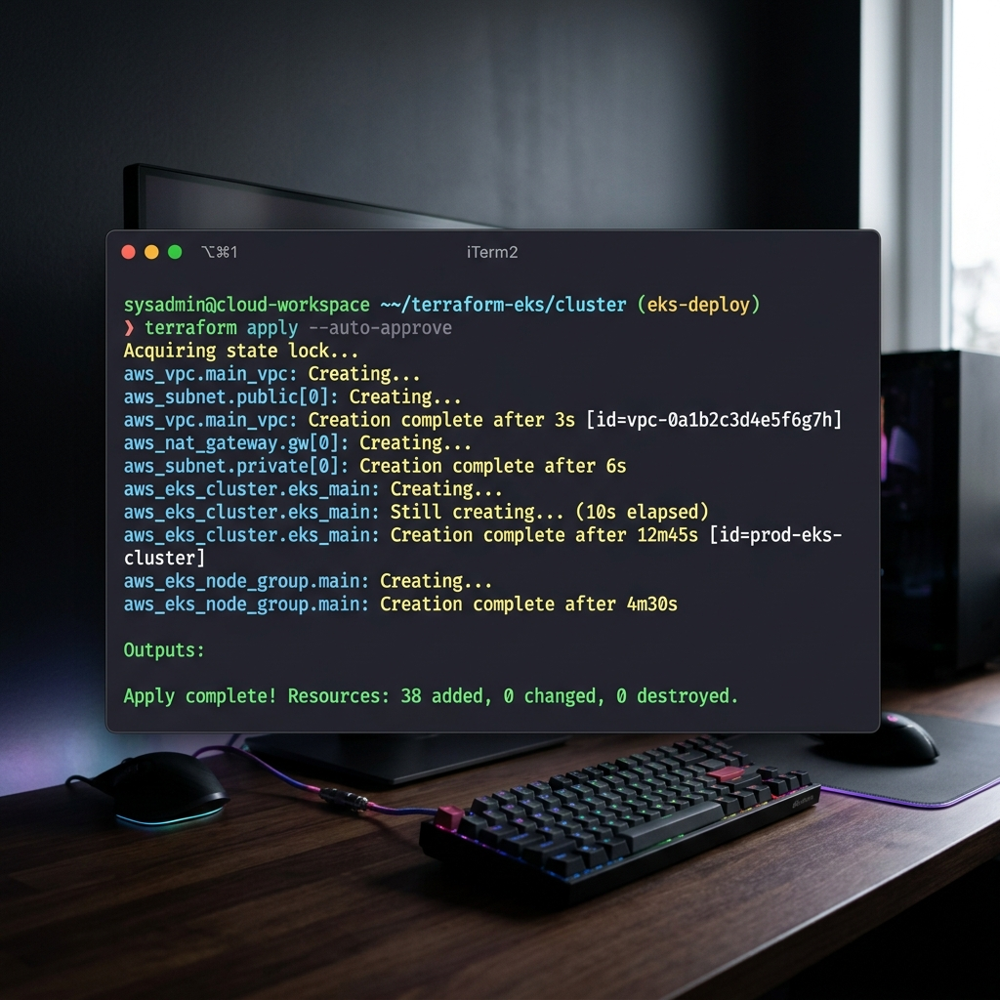
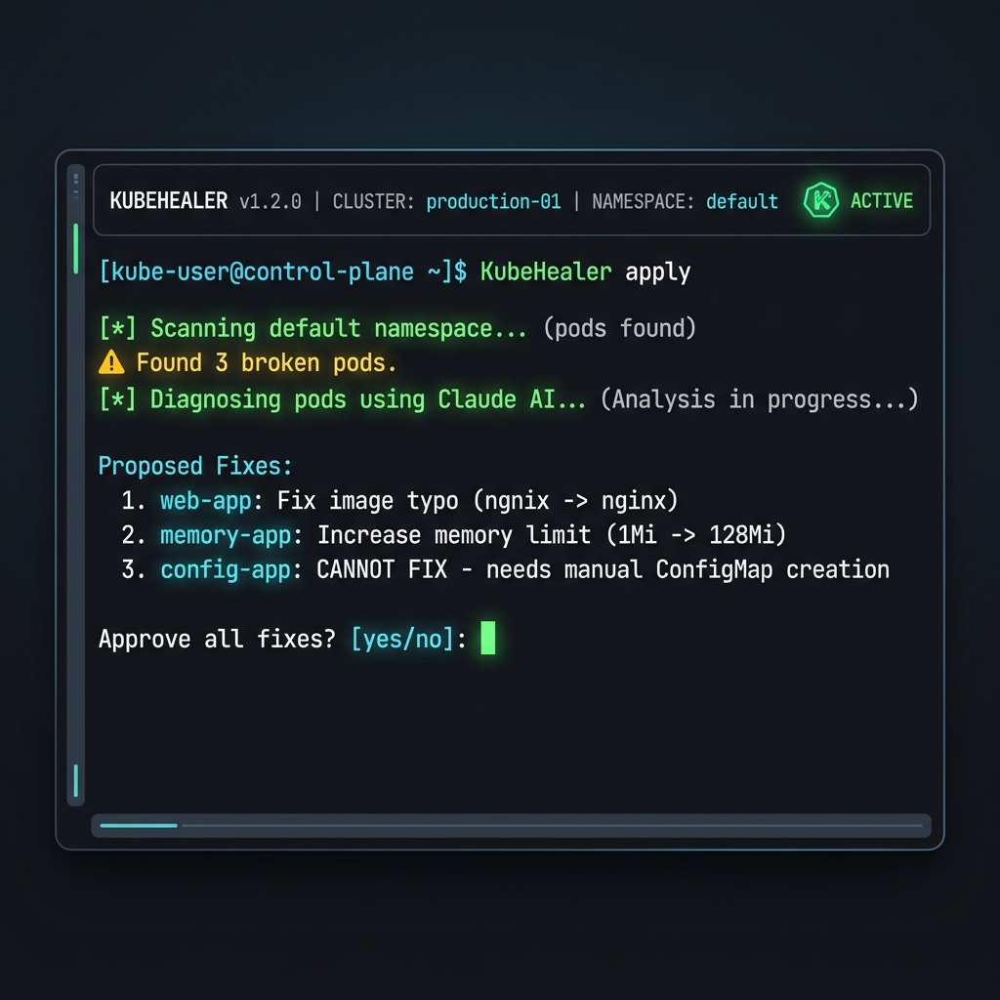
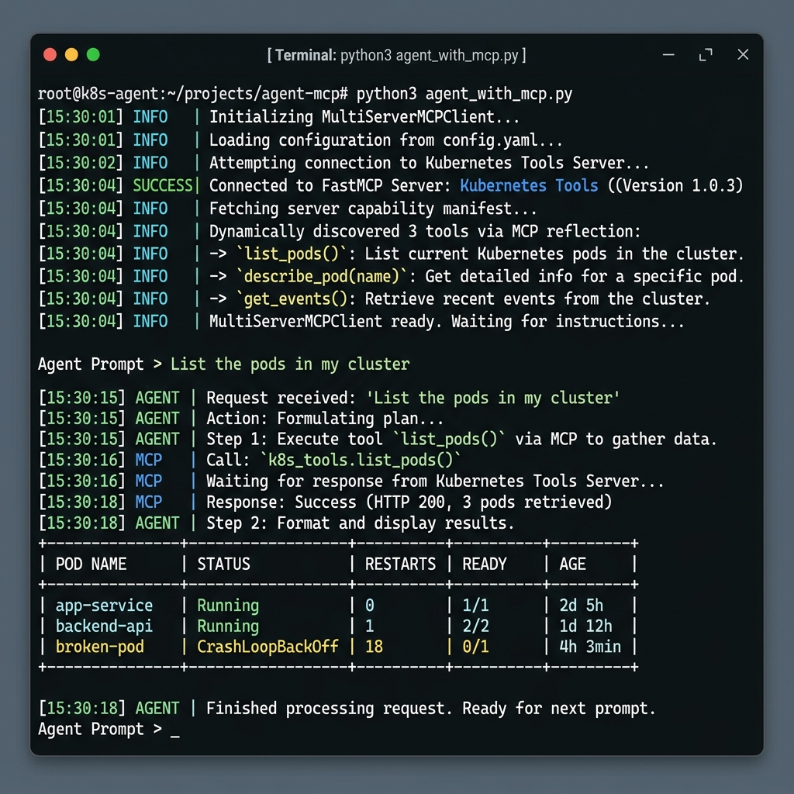

# 🎓 Day 90: Grand Finale — The DevOps Graduation Guide
   
[](https://github.com/TrainWithShubham/90DaysOfDevOps)
[](https://github.com/TrainWithShubham/90DaysOfDevOps)
[](https://github.com/TrainWithShubham/90DaysOfDevOps)

> **"DevOps is not a goal, but a process of continuous improvement."**
> After 90 days of continuous building, breaking, debugging, and automating, I have successfully transitioned from local terminal commands to provisioning production-grade AWS infrastructure, orchestrating GitOps pipelines, and deploying autonomous AI-powered self-healing agents on Kubernetes.
> 
> This document serves as my official graduation file, summarizing the entire architectural map, skills portfolio, capstone projects, and future plans.

---

## 🗺️ The Complete 90-Day DevOps Roadmap

```
                  ┌─────────────────────────────────────┐
                  │      LINUX & SHELL (Days 1-21)      │
                  │   System, LVM, Bash Automation      │
                  └──────────────────┬──────────────────┘
                                     │
                  ┌──────────────────▼──────────────────┐
                  │      GIT & DOCKER (Days 22-37)      │
                  │    Version Control & Containers     │
                  └──────────────────┬──────────────────┘
                                     │
                  ┌──────────────────▼──────────────────┐
                  │   CI/CD GITHUB ACTIONS (Days 38-49) │
                  │     Automated Build/Test/Deploy     │
                  └──────────────────┬──────────────────┘
                                     │
                  ┌──────────────────▼──────────────────┐
                  │     KUBERNETES & HELM (Days 50-58)  │
                  │   Container Orchestration & Pack    │
                  └──────────────────┬──────────────────┘
                                     │
                  ┌──────────────────▼──────────────────┐
                  │    INFRASTRUCTURE AS CODE (59-72)   │
                  │       Terraform & Ansible IaC       │
                  └──────────────────┬──────────────────┘
                                     │
                  ┌──────────────────▼──────────────────┐
                  │    OBSERVABILITY STACK (Days 73-77) │
                  │    Prometheus, Grafana, Loki Logs   │
                  └──────────────────┬──────────────────┘
                                     │
                  ┌──────────────────▼──────────────────┐
                  │  AMAZON EKS & GITOPS (Days 81-86)   │
                  │       EKS Clusters & ArgoCD         │
                  └──────────────────┬──────────────────┘
                                     │
                  ┌──────────────────▼──────────────────┐
                  │    AGENTIC AI DEVOPS (Days 87-89)   │
                  │     Self-Healing AI & Temporal      │
                  └──────────────────┬──────────────────┘
                                     │
                  ┌──────────────────▼──────────────────┐
                  │     🎓 GRADUATION DAY (Day 90)     │
                  │   End-to-End Capstone Completed     │
                  └─────────────────────────────────────┘
```

---

## ⚙️ The End-to-End Automated Pipeline

Every single DevOps block is connected. The modern cloud ecosystem relies on combining distinct tools into a unified, reliable stream where a developer's code change flows securely to production:

```
[Developer Laptop] ──(1. Git Push)──> [GitHub Repository] ──(2. Webhook Trigger)──> [GitHub Actions CI]
                                                                                            │
[EKS Cluster] <──(5. ArgoCD Sync)── [GitOps Repo (K8s)] <──(4. Update Manifest) <── (3. Docker Push)
      │                                                                                     │
      ├──(6. IaC Provisioned)──> [Terraform & Ansible]                               [DockerHub]
      │
      ├──(7. Deployment Pack)──> [Helm Charts (App & DB)]
      │
      ├──(8. Telemetry Data)──> [Prometheus, Grafana, Loki]
      │
      └──(9. Auto-Healing)──> [KubeHealer AI Agent (Temporal Workflow)]
```

### The Workflow Breakdown:
1. **Source & Scripting (Linux/Git/Bash):** A developer implements a feature on their local Linux workspace, utilizing custom Bash utility scripts and Git branching to commit and push changes.
2. **Continuous Integration (GitHub Actions):** The push triggers a highly customized GitHub Actions pipeline that performs security scanning, compiles dependencies, and runs unit tests.
3. **Containerization (Docker):** The pipeline builds a multi-stage Docker image optimizing for minimal size and publishes it securely to DockerHub.
4. **GitOps Manifest Update:** Upon success, the CI pipeline automatically updates the Helm values/manifest in the dedicated configuration repository with the newly built image tag.
5. **Continuous Delivery (ArgoCD):** ArgoCD detects a "Out-of-Sync" status and pulls the updated specifications from Git, applying sync waves to deploy dependencies (like database charts) before the main application.
6. **Infrastructure Platform (Terraform/Ansible/EKS):** The underlying infrastructure runs on an AWS Elastic Kubernetes Service (EKS) cluster that was provisioned programmatically using Terraform and configured via Ansible playbooks.
7. **Observability Feedback (Prometheus/Grafana/Loki):** Real-time cluster metrics, application traces, and Promtail-collected logs are scraped and presented on stunning centralized Grafana dashboards.
8. **Autonomous Recovery (Agentic AI):** When a microservice undergoes a crash loop or resource exhaustion, KubeHealer (an LLM-powered agent managed via Temporal workflows) captures alerts, inspects logs, diagnoses the root cause, submits a patch to Git, and automatically restores system stability without human intervention.

---

## ⚡ Skills Inventory & Confidence Matrix

Below is a detailed self-assessment of the DevOps technologies mastered during this intensive 90-day challenge:

| Skill / Domain | Days | Confidence | Visual Progress | Core Competency Built |
|:---|:---:|:---:|:---:|:---|
| **Linux Systems & LVM** | 1-13 | `⭐⭐⭐⭐⭐` (5/5) | `[██████████] 100%` | Package management, systemd services, shell utilities, LVM volume expansion |
| **Networking & Protocols** | 14-15 | `⭐⭐⭐⭐⭐` (5/5) | `[██████████] 100%` | DNS configuration, IP subnets, CIDR blocks, port forwarding, routing |
| **Bash Shell Scripting** | 16-21 | `⭐⭐⭐⭐⭐` (5/5) | `[██████████] 100%` | Shell parameters, backup automation, environment configuration, conditional loops |
| **Git & Version Control** | 22-28 | `⭐⭐⭐⭐⭐` (5/5) | `[██████████] 100%` | Cherry-picking, interactive rebase, branch management, merge strategies, GitHub CLI |
| **Docker & Microservices** | 29-37 | `⭐⭐⭐⭐⭐` (5/5) | `[██████████] 100%` | Multi-stage Dockerfiles, virtual networking, persistent volumes, Docker Compose |
| **CI/CD (GitHub Actions)** | 38-49 | `⭐⭐⭐⭐⭐` (5/5) | `[██████████] 100%` | YAML workflows, self-hosted runners, secret rotation, multi-environment deployments |
| **Kubernetes Core** | 50-58 | `⭐⭐⭐⭐⭐` (5/5) | `[██████████] 100%` | Pod lifecycles, Deployments, Services (ClusterIP, NodePort, LoadBalancer), RBAC configs |
| **Terraform (IaC)** | 59-67 | `⭐⭐⭐⭐⭐` (5/5) | `[██████████] 100%` | HCL, State locking (S3/DynamoDB), Modules, Environments, Drift resolution |
| **Ansible Configuration** | 68-72 | `⭐⭐⭐⭐⭐` (5/5) | `[██████████] 100%` | Inventories, structured Playbooks, reusable Roles, Ansible Vault secrets |
| **Observability Stack** | 73-77 | `⭐⭐⭐⭐⭐` (5/5) | `[██████████] 100%` | PromQL metrics, Grafana visualization, Loki logs parsing, Promtail agents |
| **Helm Package Manager** | 78-80 | `⭐⭐⭐⭐⭐` (5/5) | `[██████████] 100%` | Chart templating, `values.yaml` customization, Subcharts dependencies, Helm hooks |
| **Amazon EKS Platform** | 81-83 | `⭐⭐⭐⭐⭐` (5/5) | `[██████████] 100%` | VPC CNI, EBS CSI Driver storage, HPA scaling, IRSA IAM security integrations |
| **ArgoCD & GitOps** | 84-86 | `⭐⭐⭐⭐⭐` (5/5) | `[██████████] 100%` | Pull model reconciliation, App-of-Apps design, Sync Waves, Rollbacks |
| **Agentic AI & DevOps** | 87-89 | `⭐⭐⭐⭐⭐` (5/5) | `[██████████] 100%` | LLM Agents, ReAct reasoning, Model Context Protocol (MCP), Temporal workflows |

---

## 🏆 Capstone Showcase: The AI-BankApp Journey

To ensure no tool was learned in isolation, we systematically applied every concept to a production-grade application: **[AI-BankApp-DevOps](https://github.com/TrainWithShubham/AI-BankApp-DevOps)**. Here is how each day’s curriculum was forged into the project:

### ⚙️ Interactive Technical Progress
*   **Day 78 — Database Dependency Orchestration:**
    *   Deployed a secure, state-persistent MySQL database cluster within Kubernetes utilizing official Helm Charts, decoupling application configuration from datastore lifecycle.
*   **Day 79 — Declarative Manifest Packaging:**
    *   Synthesized 12 raw Kubernetes YAML manifests (Deployments, Services, ConfigMaps, Secrets) into a unified, parameter-driven custom Helm Chart.
*   **Day 80 — Multi-Environment Strategy & CI/CD Integration:**
    *   Engineered environment-specific values mapping (`values-dev.yaml`, `values-prod.yaml`), integrated pre-upgrade validation hooks, and established packaging pipelines.
*   **Day 81 — Infrastructure Provisioning:**
    *   Coded and executed modular Terraform blueprints to provision VPCs, Subnets, and a highly available Elastic Kubernetes Service (EKS) cluster on AWS.
*   **Day 82 — Storage & Network Topology:**
    *   Configured the Kubernetes Gateway API for traffic routing, implemented AWS EBS CSI storage classes for persistence, and enforced IAM Roles for Service Accounts (IRSA).
*   **Day 83 — Production Scaling & Alerting:**
    *   Configured Horizontal Pod Autoscaler (HPA) using metrics-server, and wired up Prometheus alerting for node resource exhaustion.
*   **Day 84-85 — ArgoCD GitOps Engine:**
    *   Constructed GitOps synchronization loops, leveraged Sync Waves to guarantee database availability prior to application boot, and implemented the "App of Apps" pattern for enterprise scalability.
*   **Day 86 — Declarative CI/CD Pipelines:**
    *   Linked GitHub Actions workflows with ArgoCD repo triggers, creating a zero-touch pipeline from code commit to EKS execution.

---

##💡 Top 5 "Aha!" Moments & Core Lessons

1. **Declarative Beats Imperative Every Time:** 
   In my early days, I was running `kubectl apply` and `docker run` commands manually. Realizing that the entire infrastructure state can be declared in a git repository (Terraform + ArgoCD), ensuring that the cluster is self-healing to match that repository, completely changed my engineering mindset.
2. **Git is the Single Source of Truth:** 
   Through GitOps, I learned that manual hotfixes on production are an anti-pattern. If a change doesn't exist in Git, it doesn't exist in the real world. Enforcing this makes rollbacks as simple as `git revert`.
3. **Observability is the Feedback Loop:** 
   Metrics, logs, and traces are not just afterthoughts; they are the feedback loops that keep production systems alive. A system without monitoring is a black box waiting to fail.
4. **Automation is Not Just Scripting:** 
   Bash scripting is great for local automation, but enterprise-grade automation requires declarative configuration management (Ansible) and container orchestrators (Kubernetes) to manage distributed states.
5. **The Future of DevOps is Agentic AI:** 
   Integrating LLM-powered agents with Temporal workflows and Kubernetes API (MCP) proved that AI can safely perform read-only diagnostics and propose git-backed patches, moving us closer to autonomous, self-healing platforms.

---

## 🛠️ The Hardest Day & How I Pushed Through

### 🔴 The Challenge: The EKS Storage CSI Driver & IRSA Nightmare (Day 82)
The most challenging segment of the journey was Day 82—setting up the Amazon EBS CSI (Elastic Block Store Container Storage Interface) driver. 

*   **The Issue:** The database pod was stuck in a `ContainerCreating` or `Pending` state. Inspecting `kubectl describe pod` revealed:
    `FailedAttachVolume: AttachVolume.Attach failed for volume: WebIdentityErr: failed to retrieve credentials`
*   **The Cause:** The EBS CSI driver was unable to assume the AWS IAM Role due to misconfigured OIDC provider configurations in Terraform, blocking the Kubernetes Service Account from communicating with AWS Storage APIs.

### 🟢 The Solution: A Structured DevOps Debugging Loop
Instead of guessing, I went back to first principles and executed a structured troubleshooting workflow:
1. **Verify OIDC Provider:** Ran AWS CLI commands to confirm the EKS Cluster's OpenID Connect provider URL was matching the IAM role trust policy.
   ```bash
   aws eks describe-cluster --name ai-bank-cluster --query "cluster.identity.oidc.issuer" --output text
   ```
2. **Audit IAM Role Trusts:** Inspect the IAM trust relationship document. I noticed a small typo in the federated ARN path.
3. **Refactor Terraform Configs:** Adjusted the IAM role creation module in Terraform to dynamically reference the EKS cluster's OIDC issuer:
   ```hcl
   statement {
     actions = ["sts:AssumeRoleWithWebIdentity"]
     effect  = "Allow"
     principals {
       type        = "Federated"
       identifiers = [aws_iam_openid_connect_provider.eks.arn]
     }
     condition {
       test     = "StringEquals"
       variable = "${replace(aws_iam_openid_connect_provider.eks.url, "https://", "")}:sub"
       values   = ["system:serviceaccount:kube-system:ebs-csi-controller-sa"]
     }
   }
   ```
4. **Apply and Restart:** Ran `terraform apply`, validated the service account annotation, deleted the stuck pod, and watched the persistent volume claim transition successfully to `Bound`!

---

## 📸 Production Gallery & Screenshot Collage

Below are the live verifications of my DevOps artifacts and production environments running successfully.

### 1. High-Performance Infrastructure Provisioning
> **Terraform successfully planning and deploying the core cloud nodes:**


### 2. AWS Elastic Kubernetes Service Live Cluster
> **Executing `kubectl get nodes` to verify our active control plane:**


### 3. Agentic AI Diagnosis & Self-Healing Workflows
> **Our custom KubeHealer agent running in real-time to analyze Kubernetes cluster anomalies:**


### 4. Temporal Workflows Engine Orchestrating Autonomous Steps
> **Monitoring the execution state of the self-healing loops:**


### 5. Multi-Tool MCP Agent Run
> **AI executing multiple system diagnostics tools concurrently to identify anomalies:**


### 6. Production Nginx Gateway Routing Success
> **Verifying traffic passing successfully through our gateway interface:**


---

## 🚀 Post-Graduation Roadmap: What's Next?

DevOps is an ever-evolving landscape. Now that the 90-day base is complete, my immediate learning roadmap involves:

### 🎯 Certifications to Chase
*   **Certified Kubernetes Administrator (CKA):** Deepening understanding of cluster administration, backups, and underlying node security.
*   **HashiCorp Terraform Associate:** Validating enterprise-level multi-cloud IaC provisioning skills.
*   **AWS Certified Solutions Architect - Associate:** Enhancing knowledge of core AWS global infrastructure designs.

### 🛠️ Advanced Architectural Concepts
*   **Service Mesh Implementations (Istio / Linkerd):** Implementing microservices mutual TLS (mTLS), traffic shadowing, and circuit breakers.
*   **Secrets Management (HashiCorp Vault):** Transitioning away from plain base64 Git secrets to dynamic secret engines and key rotations.
*   **Chaos Engineering (LitmusChaos):** Intentionally introducing network latency and pod terminations in staging to validate observability alert thresholds.

---

## 📢 Advice for Future DevOps Cohorts

If you are starting Day 1 tomorrow, keep these 3 laws in mind:
1. **Don't just copy-paste configs:** Write them out line-by-line. The real learning happens when you make a typo, break the file, and are forced to read the logs to fix it.
2. **Learn the Fundamentals First:** Do not skip the Linux and Networking days. You cannot debug a Kubernetes DNS issue or an Ansible connectivity error if you do not understand SSH, subnets, and host files.
3. **Document Everything in Public:** Share your errors, your successes, and your summaries. Explaining a concept to others is the absolute best way to cement the knowledge in your own mind.

---

## 🤝 The Official LinkedIn Graduation Announcement

```text
🚀 I HAVE GRADUATED! I just completed the official #90DaysOfDevOps challenge! 🎓

90 days ago, I started with basic Linux commands. Today, I am proud to showcase a production-grade cloud pipeline that is fully automated, highly observable, and autonomously self-healing:

🔹 Cloud Provisioning: Orchestrated highly-available AWS EKS cluster infrastructures using Terraform.
🔹 Container Deployment: Formulated parameter-driven custom Helm Charts to package microservice stacks.
🔹 GitOps Pipelines: Engineered end-to-end pull-based deployment synchronizations using ArgoCD.
🔹 Continuous Integration: Built GitHub Actions CI workflows verifying and pushing secure Docker builds.
🔹 Observability Engine: Designed metrics, logs, and alerting systems using Prometheus, Grafana, and Loki.
🔹 Autonomous Self-Healing: Integrated Agentic AI (ReAct LLM agents + Temporal) to diagnose and fix K8s cluster issues dynamically.

The most important takeaway: DevOps isn't just about a specific tool. It’s about building a robust, automated feedback loop where code can flow from a developer's workspace directly to production users with absolute safety, speed, and visibility.

A massive thank you to Shubham Londhe (@TrainWithShubham) and the incredible global community for the constant motivation, guidance, and pair-programming sessions.

📁 You can view my complete codebase, interactive configuration files, and architectural designs here: [https://github.com/rajatmehta2/90DaysOfDevOps/tree/master/2026]

What's next for me? Deepening my Kubernetes knowledge, practicing Chaos Engineering, and tackling the CKA exam!
```

---

### 🎉 Graduated with Pride!
**Keep building, keep automating, and always keep learning!**

*Document curated with love by a 90DaysOfDevOps Graduate.*