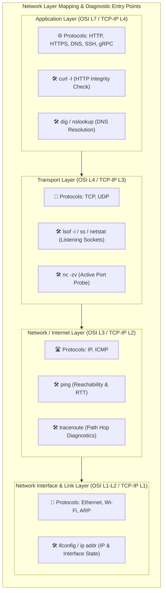

# 🌐 Day 14: Networking Fundamentals & Hands-on Troubleshooting Checks

> **"In distributed cloud systems, networking is the ultimate ground truth. When applications fail to communicate, a systematic traversal of the networking stack—from hostname resolution up to HTTP handshake validation—is the fastest path to root-cause discovery. Today's lab lays the foundation for real-world network debugging, mapping theoretical layers directly to raw diagnostic utility outputs."**

Welcome to Day 14 of the **90 Days of DevOps** challenge! Today is dedicated to building robust diagnostics skills across the core networking stack. We cover theoretical models (OSI vs. TCP/IP) and then execute a battery of active diagnostics commands to map how connectivity, routing hops, domain names, listening ports, and application requests function on a live environment.

---

## 📋 Lab Metadata

| Attribute | Details |
| :--- | :--- |
| **Concept** | Network Stack Diagnostics & Protocol Troubleshooting |
| **Operating System** | macOS (Darwin Kernel 25.x) / POSIX Linux |
| **Key Protocols** | IPv4/IPv6, ICMP, TCP, UDP, DNS, HTTP/HTTPS |
| **Key Commands** | `ifconfig`, `ping`, `traceroute`, `lsof`, `dig`, `curl`, `netstat`, `nc` |
| **Lab Date** | June 2, 2026 |
| **GitHub Directory** | `90DaysOfDevOps/2026/day-14/` |

---

## 🗺️ Diagnostics Mapping & Flow Overview

When diagnosing complex connection faults, DevOps engineers trace problems sequentially through the networking layers. The flowchart below maps the target diagnostic commands used in today's lab to their respective layers within the OSI & TCP/IP models:



---

## 📑 Table of Contents
1. [🗺️ Theoretical Framework: OSI Model vs. TCP/IP Stack](#️-theoretical-framework-osi-model-vs-tcpip-stack)
2. [🔍 Phase 1: Identity & Local Host Interface Audit](#-phase-1-identity--local-host-interface-audit)
3. [🎯 Phase 2: Reachability & Packet-Level Latency Verification](#-phase-2-reachability--packet-level-latency-verification)
4. [🚀 Phase 3: Route Discovery & Diagnostics Path Analysis](#-phase-3-route-discovery--diagnostics-path-analysis)
5. [🔌 Phase 4: Port Bindings & Active Listening Socket Audit](#-phase-4-port-bindings--active-listening-socket-audit)
6. [🏷️ Phase 5: Domain Name Resolution & DNS Verification](#-phase-5-domain-name-resolution--dns-verification)
7. [🌐 Phase 6: HTTP Protocol Header Handshake Validation](#-phase-6-http-protocol-header-handshake-validation)
8. [📊 Phase 7: TCP Socket Connections State Snapshot](#-phase-7-tcp-socket-connections-state-snapshot)
9. [⚡ Phase 8: Mini-Task: Port Probing & Interpretation](#-phase-8-mini-task-port-probing--interpretation)
10. [🧠 Reflection & Incident Diagnostic Strategies](#-reflection--incident-diagnostic-strategies)
11. [📢 Learn in Public & Community Engagement](#-learn-in-public--community-engagement)
12. [📸 Verification Screenshot](#-verification-screenshot)

---

## 🗺️ Theoretical Framework: OSI Model vs. TCP/IP Stack

Understanding the correlation between networking layers allows engineers to rapidly isolate faulty components.

### 📚 Mapping the Layers (In My Own Words)
* **OSI Layered Model (L1–L7):** A conceptual 7-layer framework mapping how hardware, network frames, packets, segments, sockets, and user payloads are structured.
* **TCP/IP Model (4 Layers):** The practical framework used by modern Operating Systems. It condenses the OSI layers into four simplified functional groups:
  1. **Application:** Represents human-readable protocol interfaces (OSI Sessions, Presentation, Application layers).
  2. **Transport:** Manages logical end-to-end reliability, ordering, and data flow controls (OSI Transport layer).
  3. **Internet:** Manages logical addressing, packet encapsulation, and hop-to-hop routing pathways (OSI Network layer).
  4. **Link (Network Interface):** Interacts directly with local network physical hardware drivers, network interface cards, and cabling (OSI Physical & Data Link layers).

### 📍 Protocol Placement in the Stack
* **IP (Internet Protocol):** Sits at the **Network / Internet layer**. Responsible for logical host addressing and packet routing.
* **TCP / UDP (Transmission Control Protocol / User Datagram Protocol):** Sits at the **Transport layer**. Manages session-based connection integrity (TCP) or fast, fire-and-forget datagram streaming (UDP).
* **HTTP / HTTPS / DNS:** Sits at the **Application layer**. Governs high-level formats such as web request payloads, server response headers, and hostname-to-IP directory translations.

> [!NOTE]
> **Real-World Trace Example:**
> Executing `curl https://example.com` invokes a L7 (Application) HTTP request. This request is structured into a secure TLS socket stream, partitioned into TCP segments at L4 (Transport) with a target port of `443`, packaged into IP packets at L3 (Network) addressed to `93.184.215.14`, and finally converted into physical electrical/optical frame patterns on the L1-L2 (Link) interface hardware.

---

## 🔍 Phase 1: Identity & Local Host Interface Audit

Every diagnostic process starts by finding out who you are on the network. We retrieve the system's active IP configurations.

```bash
ifconfig | grep "inet " | grep -v 127.0.0.1
```
* **Expected Terminal Output:**
  ```text
  inet 192.168.31.96 netmask 0xffffff00 broadcast 192.168.31.255
  ```

> [!TIP]
> **Observation:** The local system is active on a Class C private subnet (`192.168.31.0/24`) with an assigned host IP of `192.168.31.96`. The subnet mask `0xffffff00` (`255.255.255.0`) means the system can directly resolve and communicate with up to 254 local nodes without requiring an external gateway routing translation.

---

## 🎯 Phase 2: Reachability & Packet-Level Latency Verification

We check if the target destination host (`google.com`) is reachable at the IP routing level using ICMP Echo Request packets.

```bash
ping -c 4 google.com
```
* **Expected Terminal Output:**
  ```text
  PING google.com (142.250.134.138): 56 data bytes
  64 bytes from 142.250.134.138: icmp_seq=0 ttl=108 time=57.375 ms
  64 bytes from 142.250.134.138: icmp_seq=1 ttl=108 time=70.859 ms
  64 bytes from 142.250.134.138: icmp_seq=2 ttl=108 time=115.999 ms
  64 bytes from 142.250.134.138: icmp_seq=3 ttl=108 time=95.082 ms

  --- google.com ping statistics ---
  4 packets transmitted, 4 packets received, 0.0% packet loss
  round-trip min/avg/max/stddev = 57.375/84.829/115.999/22.503 ms
  ```

> [!NOTE]
> **Observation:** End-to-end IP network connectivity is fully healthy. The `0.0% packet loss` verifies that the underlying route paths are highly stable. The average Round-Trip Time (RTT) is `84.8 ms`, indicating normal propagation times for public network queries from the local node.

---

## 🚀 Phase 3: Route Discovery & Diagnostics Path Analysis

If reachability succeeds or fails slowly, tracing the hop-by-hop path highlights where routing latency, loops, or packet filtering firewalls exist.

```bash
traceroute -m 15 google.com
```
* **Expected Terminal Output:**
  ```text
  traceroute: Warning: google.com has multiple addresses; using 142.250.134.138
  traceroute to google.com (142.250.134.138), 15 hops max, 40 byte packets
   1  192.168.31.1 (192.168.31.1)  5.779 ms  3.800 ms  3.307 ms
   2  192.0.0.1 (192.0.0.1)  4.675 ms  4.197 ms  3.730 ms
   3  192.0.0.1 (192.0.0.1)  32.442 ms  33.145 ms  107.290 ms
   4  192.0.0.1 (192.0.0.1)  35.327 ms  26.435 ms  26.853 ms
   5  192.0.0.1 (192.0.0.1)  32.339 ms  28.578 ms  30.563 ms
   6  192.168.227.194 (192.168.227.194)  25.951 ms  28.713 ms  29.925 ms
   7  172.28.2.14 (172.28.2.14)  29.731 ms  99.528 ms  34.170 ms
   8  * * *
   9  * * *
  10  173.194.123.22 (173.194.123.22)  47.856 ms
      142.250.168.56 (142.250.168.56)  48.869 ms
      72.14.195.34 (72.14.195.34)  62.231 ms
  11  108.170.232.205 (108.170.232.205)  55.693 ms
      192.178.81.9 (192.178.81.9)  61.676 ms *
  12  172.253.67.90 (172.253.67.90)  65.752 ms
      192.178.83.220 (192.178.83.220)  54.424 ms
      172.253.74.178 (172.253.74.178)  50.525 ms
  13  * * 192.178.82.238 (192.178.82.238)  53.118 ms
  14  * 142.251.194.2 (142.251.194.2)  69.385 ms *
  15  192.178.254.30 (192.178.254.30)  80.348 ms
      192.178.254.212 (192.178.254.212)  70.637 ms *
  ```

> [!WARNING]
> **Observation:** Hop 1 successfully reaches the local gateway router (`192.168.31.1`). Hops 2 through 7 map ISP core carrier systems. Hops 8 and 9 display asterisks (`* * *`), which indicates that these routing nodes have dropped the TTL-expired ICMP probes or are behind firewalls configured to block diagnostic tracking. Hops 10-15 successfully navigate through Google's AS domain routers to reach the target destination edge.

---

## 🔌 Phase 4: Port Bindings & Active Listening Socket Audit

Knowing that routing is active, we check which applications are active on the local machine and what TCP/UDP ports they are binding to.

```bash
lsof -i -P -n | grep LISTEN | head -n 10
```
* **Expected Terminal Output:**
  ```text
  rapportd    986 ToucanRajat   10u  IPv4 0x86c4218e83a56472      0t0    TCP *:50081 (LISTEN)
  rapportd    986 ToucanRajat   12u  IPv6 0x9ccefc85ba059de3      0t0    TCP *:50081 (LISTEN)
  ControlCe  1164 ToucanRajat   10u  IPv4 0x30ac4cc753b498e2      0t0    TCP *:7000 (LISTEN)
  ControlCe  1164 ToucanRajat   11u  IPv6 0xe387c6dda7b1b0ef      0t0    TCP *:7000 (LISTEN)
  ControlCe  1164 ToucanRajat   12u  IPv4 0xd3a15ed0808707cc      0t0    TCP *:5000 (LISTEN)
  ControlCe  1164 ToucanRajat   13u  IPv6 0x75d21941d5ae34aa      0t0    TCP *:5000 (LISTEN)
  Ollama     1453 ToucanRajat    4u  IPv4 0x89a3422de97d320b      0t0    TCP 127.0.0.1:49207 (LISTEN)
  ollama     1463 ToucanRajat    3u  IPv4 0x53e5c82a37696bb0      0t0    TCP 127.0.0.1:11434 (LISTEN)
  Electron  56677 ToucanRajat   65u  IPv4  0x76029f4271bf90b      0t0    TCP 127.0.0.1:52231 (LISTEN)
  Electron  56677 ToucanRajat   67u  IPv4 0x3658cc00f2d3d8a1      0t0    TCP 127.0.0.1:52232 (LISTEN)
  ```

> [!NOTE]
> **Observation:** We can see active processes listening on specific network sockets. For instance, the **Ollama daemon** (`PID 1463`) is listening on standard loopback port `11434`. System services (such as macOS `ControlCenter`) are listening globally (`*`) on ports `5000` and `7000`.

---

## 🏷️ Phase 5: Domain Name Resolution & DNS Verification

Before client requests connect to an application endpoint, they query DNS resolvers. We perform a DNS lookup to check resolving health and verify answer sections.

```bash
dig google.com
```
* **Expected Terminal Output:**
  ```text
  ; <<>> DiG 9.10.6 <<>> google.com
  ;; global options: +cmd
  ;; Got answer:
  ;; ->>HEADER<<- opcode: QUERY, status: NOERROR, id: 18061
  ;; flags: qr rd ra; QUERY: 1, ANSWER: 6, AUTHORITY: 0, ADDITIONAL: 1

  ;; OPT PSEUDOSECTION:
  ; EDNS: version: 0, flags:; udp: 512
  ;; QUESTION SECTION:
  ;google.com.			IN	A

  ;; ANSWER SECTION:
  google.com.		78	IN	A	192.178.193.102
  google.com.		78	IN	A	192.178.193.139
  google.com.		78	IN	A	192.178.193.101
  google.com.		78	IN	A	192.178.193.138
  google.com.		78	IN	A	192.178.193.100
  google.com.		78	IN	A	192.178.193.113

  ;; Query time: 361 msec
  ;; SERVER: 8.8.8.8#53(8.8.8.8)
  ;; WHEN: Tue Jun 02 14:24:56 IST 2026
  ;; MSG SIZE  rcvd: 135
  ```

> [!TIP]
> **Observation:** The DNS lookup is healthy, returning a status of `NOERROR`. The answer section lists 6 active `A` records (IP addresses mapping to the domain). The query was resolved by Google's public primary DNS server (`8.8.8.8`) over port `53` in `361 ms`.

---

## 🌐 Phase 6: HTTP Protocol Header Handshake Validation

Once DNS resolves the server IP and the transport TCP connection is established, we test application-level integrity by checking HTTP header handshakes.

```bash
curl -I https://google.com
```
* **Expected Terminal Output:**
  ```text
  HTTP/2 301 
  location: https://www.google.com/
  content-type: text/html; charset=UTF-8
  content-security-policy-report-only: object-src 'none';base-uri 'self';script-src 'nonce-Pc8uU22weBSLVogCiiNBsg' 'strict-dynamic' 'report-sample' 'unsafe-eval' 'unsafe-inline' https: http:;report-uri https://csp.withgoogle.com/csp/gws/other-hp
  date: Tue, 02 Jun 2026 08:55:00 GMT
  expires: Thu, 02 Jul 2026 08:55:00 GMT
  cache-control: public, max-age=2592000
  server: gws
  content-length: 220
  x-xss-protection: 0
  x-frame-options: SAMEORIGIN
  alt-svc: h3=":443"; ma=2592000,h3-29=":443"; ma=2592000
  ```

> [!NOTE]
> **Observation:** The request returns `HTTP/2 301 Moved Permanently`. The server is configured to canonicalize all non-subdomain traffic, redirecting our client to `https://www.google.com/` using the `location` header, indicating a successful handoff.

---

## 📊 Phase 7: TCP Socket Connections State Snapshot

Now, we check active client connection states on our host, looking at active socket pipelines.

```bash
netstat -an | head -n 15
```
* **Expected Terminal Output:**
  ```text
  Active Internet connections (including servers)
  Proto Recv-Q Send-Q  Local Address                                 Foreign Address                               (state)    
  tcp4       0      0  127.0.0.1.52231        127.0.0.1.52487        ESTABLISHED
  tcp4       0      0  127.0.0.1.52487        127.0.0.1.52231        ESTABLISHED
  tcp6       0      0  2409:40c1:308e:2.52484 2001:4860:4802:3.443   ESTABLISHED
  tcp6       0      0  2409:40c1:308e:2.52483 2001:4860:4802:3.443   ESTABLISHED
  tcp6       0      0  2409:40c1:308e:2.52482 2001:4860:4802:3.443   ESTABLISHED
  tcp4       0      0  127.0.0.1.52231        127.0.0.1.52479        ESTABLISHED
  tcp4       0      0  127.0.0.1.52479        127.0.0.1.52231        ESTABLISHED
  tcp4       0      0  127.0.0.1.52231        127.0.0.1.52478        ESTABLISHED
  tcp4       0      0  127.0.0.1.52478        127.0.0.1.52231        ESTABLISHED
  tcp4       0      0  127.0.0.1.52234        127.0.0.1.52477        ESTABLISHED
  tcp4       0      0  127.0.0.1.52477        127.0.0.1.52234        ESTABLISHED
  tcp4       0      0  192.168.31.96.52476    140.82.112.25.443      ESTABLISHED
  tcp4       0      0  192.168.31.96.52475    104.208.16.89.443      ESTABLISHED
  ```

> [!TIP]
> **Observation:** The output displays active TCP pipelines. We can see established loops between local addresses (`127.0.0.1`) and connections to external remote IP endpoints (like `140.82.112.25` on port `443` for active GitHub SSH/HTTPS telemetry).

---

## ⚡ Phase 8: Mini-Task: Port Probing & Interpretation

As part of our networking verification checklist, we test the reachability of a known listening port on the host machine.

* **Target Local Port:** `11434` (Ollama Service)
* **Probe Tool Used:** Netcat (`nc`)

```bash
nc -zv 127.0.0.1 11434
```
* **Expected Terminal Output:**
  ```text
  Connection to 127.0.0.1 port 11434 [tcp/*] succeeded!
  ```

### 🔬 Troubleshooting Path (If Connection Fails)
If the port probe returns a "Connection refused" or hangs indefinitely, we run the following sequence to debug:
1. **Check Process State:** Verify if the service is running locally.
   ```bash
   ps aux | grep -i ollama
   ```
2. **Verify Binding Interface:** Ensure the service is binding to the correct interface (`127.0.0.1` or `0.0.0.0`) and is not listening on an incorrect port.
   ```bash
   lsof -i :11434
   ```
3. **Firewall & ACL Audit:** Inspect the firewall properties (e.g., macOS application firewall, Linux `ufw` or `iptables`) to see if policies are dropping incoming TCP connections.

---

## 🧠 Reflection & Incident Diagnostic Strategies

### 1. Which command gives you the fastest signal when something is broken?
* **`ping`** is the fastest diagnostic indicator for checking basic reachability. Because it is simple and uses lightweight ICMP packets, it quickly confirms whether the network adapter, local routing tables, and destination servers are online.

### 2. What layer would you inspect next if DNS fails? If HTTP 500 shows up?
* **If DNS fails:** DNS sits at the **Application Layer (L7)**. Since resolution failed, first check local lookups in `/etc/hosts` and resolver paths in `/etc/resolv.conf`. Then, inspect the **Transport Layer (L4)** over UDP/TCP port `53` to verify if connection requests can reach upstream DNS servers (such as `8.8.8.8` or local gateway IP).
* **If HTTP 500 shows up:** An HTTP 500 status code indicates an **Internal Server Error**. Receiving a response code means that DNS, routing paths, and TCP three-way handshakes are all functioning correctly. The network layers are healthy, so we look at the **Application Layer (L7)**. Inspect application server backend logs, reverse proxies (Nginx/Apache), or standard database connections.

### 3. Two follow-up checks you'd run in a real incident:
1. **`nslookup <host>` / `dig <host>`:** Verifies DNS entries resolve correctly and aren't returning incorrect IP mappings due to stale cache entries.
2. **`nc -zv <target_ip> <port>`:** Direct testing of TCP socket connection integrity to confirm that firewalls or routing blocks aren't dropping communication payloads.

---

Day 14 Complete 🌐

**Happy Learning!**
*Trainer: Shubham Londhe*
*Study Notes compiled by: Rajat Mehta*