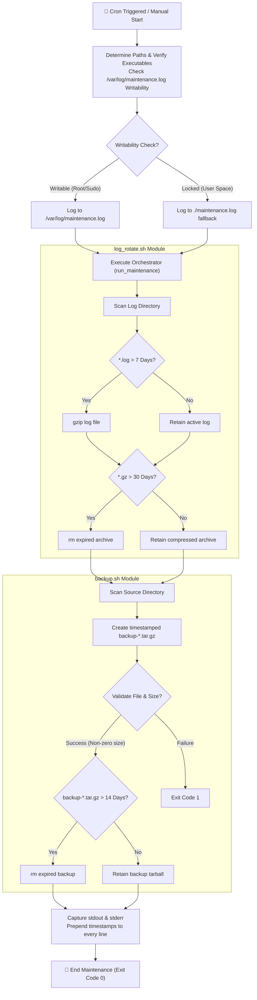

# 🛠️ Day 19 – Shell Scripting Project: Log Rotation, Backup & Crontab

> **"True operational excellence is built on consistent, predictable automation. By combining rigorous file rotation, timestamped backups, and strict crontab orchestration under robust error safeties, standard Linux servers transform into self-maintaining, enterprise-ready infrastructure."**

Welcome to Day 19 of the **90 Days of DevOps** challenge! Today, we consolidate our scripting knowledge from Days 16–18 by implementing a complete, enterprise-grade automated maintenance suite. We build and execute individual scripts for **log rotation**, **system backups**, and an **orchestration runner**, all scheduled safely through **crontab** configurations and protected by strict industrial fail-safes (`set -euo pipefail`).

---

## 📋 Lab Metadata

| Attribute | Details |
| :--- | :--- |
| **Concept** | Industrial Log Rotation, Timestamped Tarball Archiving, Cron Job Scheduling, System Maintenance Orchestration |
| **Operating System** | macOS (Darwin Kernel 25.x) & POSIX Linux reference |
| **Interpreter** | GNU Bash (`/bin/bash` / `/usr/bin/env bash`) |
| **Completed Scripts** | [log_rotate.sh](log_rotate.sh), [backup.sh](backup.sh), [maintenance.sh](maintenance.sh) |
| **Key Diagnostics** | `find -print0`, `gzip -9`, `tar -czf`, `crontab -e`, `du -sh`, process redirection |
| **Lab Date** | June 2, 2026 |
| **GitHub Directory** | `90DaysOfDevOps/2026/day-19/` |

---

## 🧭 Scheduled Maintenance Architecture (Orchestration Flow)

The flowchart below displays how `maintenance.sh` acts as an absolute controller—orchestrating file rotation, compression, backups, and old archive cleanups while piping every standard and error log through a timestamping engine into a persistent file:



---

## 📑 Table of Contents
1. [🌀 Task 1: Industrial Log Rotation Script (`log_rotate.sh`)](#-task-1-industrial-log-rotation-script-log_rotate_sh)
2. [🛡️ Task 2: Robust Server Backup Script (`backup.sh`)](#-task-2-robust-server-backup-script-backup_sh)
3. [⏱️ Task 3: Crontab Scheduling & Syntax Analysis](#-task-3-crontab-scheduling--syntax-analysis)
4. [⚙️ Task 4: Combined Maintenance Orchestrator (`maintenance.sh`)](#-task-4-combined-maintenance-orchestrator-maintenancesh)
5. [🎓 What I Learned Today](#-what-i-learned-today)
6. [📢 Learn in Public & Engagement](#-learn-in-public--engagement)
7. [🎨 Visual Lab Walkthrough Screenshot](#-visual-lab-walkthrough-screenshot)

---

## 🌀 Task 1: Industrial Log Rotation Script (`log_rotate.sh`)

Log rotation prevents applications from exhausting available storage space by compressing inactive histories and purging expired archives. 

### 1. Script Design Features
- **Strict Safeties:** Built using `set -euo pipefail` to ensure any error immediately halts execution.
- **Spaces & Exotic Character Support:** Rather than using basic loops, it reads search matches through null-delimited streams (`find -print0` piped to `while read -d ''`) to prevent word splitting issues.
- **Dual Retention Thresholds:** Compresses active `.log` files older than 7 days using standard `gzip`, and purges `.gz` archives older than 30 days.

### 2. Script Code (`log_rotate.sh`)

```bash
#!/usr/bin/env bash

# ==============================================================================
# Day 19 – Task 1: Log Rotation Script (log_rotate.sh)
#
# Description: Compresses *.log files older than 7 days using gzip, and deletes
#              *.gz files older than 30 days from a target directory.
#
# Safeties:    Runs under set -euo pipefail for maximum infrastructure protection.
#              Employs null-delimited streams (find -print0) to safely handle
#              filenames containing spaces or exotic characters.
# ==============================================================================

set -euo pipefail

# Print usage details
usage() {
    echo "Error: Missing argument." >&2
    echo "Usage: $0 <log_directory>" >&2
    exit 1
}

# Check if directory argument is provided
if [ $# -lt 1 ]; then
    usage
fi

LOG_DIR="$1"

# Verify target directory exists
if [ ! -d "$LOG_DIR" ]; then
    echo "Error: Target directory '${LOG_DIR}' does not exist." >&2
    exit 1
fi

echo "=========================================================================="
echo "🌀 LOG ROTATION ENGINE STARTING"
echo "Target Directory: ${LOG_DIR}"
echo "Timestamp:        $(date)"
echo "=========================================================================="

compressed_count=0
deleted_count=0

# 1. Compressing .log files older than 7 days
echo "Step 1: Compressing *.log files older than 7 days..."
while IFS= read -r -d '' log_file; do
    if [ -f "$log_file" ]; then
        echo "  [COMPRESS] Compressing: $(basename "$log_file")"
        gzip "$log_file"
        compressed_count=$((compressed_count + 1))
    fi
done < <(find "$LOG_DIR" -type f -name "*.log" -mtime +7 -print0)

# 2. Deleting .gz files older than 30 days
echo "Step 2: Pruning *.gz archives older than 30 days..."
while IFS= read -r -d '' gz_file; do
    if [ -f "$gz_file" ]; then
        echo "  [DELETE] Removing expired archive: $(basename "$gz_file")"
        rm "$gz_file"
        deleted_count=$((deleted_count + 1))
    fi
done < <(find "$LOG_DIR" -type f -name "*.gz" -mtime +30 -print0)

echo "------------------------------------------------------------------------"
echo "📊 Rotation Summary:"
echo "  - Logs compressed:  ${compressed_count}"
echo "  - Archives deleted: ${deleted_count}"
echo "=========================================================================="
echo "✅ Log rotation sequence finished successfully."
```

### 3. Verification Command & Capture
To verify this script, we established a sandboxed environment (`mock_environment/logs`), generating files with simulated modified timestamps using `touch -t`:
- `active.log` (Current - Should remain untouched)
- `db-week-old.log` (Dated 10 days ago - Should compress to `db-week-old.log.gz`)
- `api-month-old.log` (Dated 45 days ago - Should compress first, then be purged as it exceeds 30 days)
- `expired-archive.log.gz` (Dated 40 days ago - Should be deleted)
- `recent-archive.log.gz` (Dated 5 days ago - Should remain untouched)

```bash
chmod +x log_rotate.sh
./log_rotate.sh mock_environment/logs
```

**Captured Terminal Output:**
```text
==========================================================================
🌀 LOG ROTATION ENGINE STARTING
Target Directory: /Users/ToucanRajat/Documents/Rajat-Projects/Personal-Projects/90DaysOfDevOps/2026/day-19/mock_environment/logs
Timestamp:        Tue Jun  2 14:47:56 IST 2026
==========================================================================
Step 1: Compressing *.log files older than 7 days...
  [COMPRESS] Compressing: api-month-old.log
  [COMPRESS] Compressing: db-week-old.log
Step 2: Pruning *.gz archives older than 30 days...
  [DELETE] Removing expired archive: api-month-old.log.gz
  [DELETE] Removing expired archive: expired-archive.log.gz
------------------------------------------------------------------------
📊 Rotation Summary:
  - Logs compressed:  2
  - Archives deleted: 2
==========================================================================
✅ Log rotation sequence finished successfully.
```

---

## 🛡️ Task 2: Robust Server Backup Script (`backup.sh`)

System state backups ensure data integrity during hardware failures or deployment disasters.

### 1. Script Design Features
- **Auto-Directory Scaffolding:** Creates the target destination path automatically if it is missing.
- **Dynamic tar Preservation:** Leverages temporary directory pivoting (`cd`) inside a subshell to archive the base paths of directories, completely avoiding the standard tar hazard warning (`tar: Removing leading '/' from member names`).
- **Archive Size & Health Auditing:** Confirms the final compressed archive file size (`du -sh`) and file presence prior to reporting completion status.
- **Fourteen-Day Retention Engine:** Cleans older archives from the backup path, strictly retaining only the last 14 days of backups.

### 2. Script Code (`backup.sh`)

```bash
#!/usr/bin/env bash

# ==============================================================================
# Day 19 – Task 2: Server Backup Script (backup.sh)
#
# Description: Archives a source directory into a compressed .tar.gz file in a
#              destination directory, verifies the archive, and prunes old
#              backups older than 14 days.
#
# Safeties:    Runs under set -euo pipefail. Validates directories and verifies
#              archive creation integrity explicitly.
# ==============================================================================

set -euo pipefail

# Print usage instructions
usage() {
    echo "Error: Missing arguments." >&2
    echo "Usage: $0 <source_directory> <backup_destination>" >&2
    exit 1
}

# Check if correct arguments are provided
if [ $# -lt 2 ]; then
    usage
fi

SRC_DIR="$1"
DEST_DIR="$2"

# Verify source directory exists
if [ ! -d "$SRC_DIR" ]; then
    echo "Error: Source directory '${SRC_DIR}' does not exist." >&2
    exit 1
fi

# Create destination directory if it doesn't exist
if [ ! -d "$DEST_DIR" ]; then
    echo "Info: Creating backup destination directory: ${DEST_DIR}"
    mkdir -p "$DEST_DIR"
fi

echo "=========================================================================="
echo "🛡️ SERVER BACKUP ENGINE STARTING"
echo "Source Directory:      ${SRC_DIR}"
echo "Destination Directory: ${DEST_DIR}"
echo "Timestamp:             $(date)"
echo "=========================================================================="

# Create unique timestamped backup filename
TIMESTAMP=$(date +%Y-%m-%d_%H%M%S)
BACKUP_FILENAME="backup-${TIMESTAMP}.tar.gz"
BACKUP_PATH="${DEST_DIR}/${BACKUP_FILENAME}"

echo "Step 1: Compressing and archiving source directory..."
# Run tar in a isolated subshell directory pivot to avoid absolute-path metadata leakage
SRC_PARENT=$(dirname "$SRC_DIR")
SRC_BASE=$(basename "$SRC_DIR")
(
    cd "$SRC_PARENT"
    tar -czf "$BACKUP_PATH" "$SRC_BASE"
)

# Step 2: Verification
echo "Step 2: Verifying backup archive integrity..."
if [ -f "$BACKUP_PATH" ] && [ -s "$BACKUP_PATH" ]; then
    FILE_SIZE=$(du -sh "$BACKUP_PATH" | awk '{print $1}')
    echo "  [SUCCESS] Backup file created successfully!"
    echo "  [ARCHIVE] Filename: ${BACKUP_FILENAME}"
    echo "  [SIZE]    Size:     ${FILE_SIZE}"
else
    echo "  [ERROR] Backup archive creation failed or file is empty!" >&2
    exit 1
fi

# Step 3: Deleting backups older than 14 days
echo "Step 3: Pruning backups older than 14 days..."
pruned_count=0
while IFS= read -r -d '' old_backup; do
    if [ -f "$old_backup" ]; then
        echo "  [PRUNE] Removing expired backup: $(basename "$old_backup")"
        rm "$old_backup"
        pruned_count=$((pruned_count + 1))
    fi
done < <(find "$DEST_DIR" -type f -name "backup-*.tar.gz" -mtime +14 -print0)

echo "------------------------------------------------------------------------"
echo "📊 Backup Summary:"
echo "  - Backup Status:   Success"
echo "  - Archive Name:    ${BACKUP_FILENAME}"
echo "  - Archive Size:    ${FILE_SIZE}"
echo "  - Backups Pruned:  ${pruned_count}"
echo "=========================================================================="
echo "✅ Server backup sequence finished successfully."
```

### 3. Verification Command & Capture
To verify the backup routine, we created a test source structure under `mock_environment/source/` containing dummy assets and simulated past tarballs in `mock_environment/backups`:
- `backup-2026-05-10_120000.tar.gz` (Dated 23 days ago - Exceeds 14 days retention; should be pruned)
- `backup-2026-05-28_120000.tar.gz` (Dated 5 days ago - Inside window; should be preserved)

```bash
chmod +x backup.sh
./backup.sh mock_environment/source mock_environment/backups
```

**Captured Terminal Output:**
```text
==========================================================================
🛡️ SERVER BACKUP ENGINE STARTING
Source Directory:      /Users/ToucanRajat/Documents/Rajat-Projects/Personal-Projects/90DaysOfDevOps/2026/day-19/mock_environment/source
Destination Directory: /Users/ToucanRajat/Documents/Rajat-Projects/Personal-Projects/90DaysOfDevOps/2026/day-19/mock_environment/backups
Timestamp:             Tue Jun  2 14:47:56 IST 2026
==========================================================================
Step 1: Compressing and archiving source directory...
Step 2: Verifying backup archive integrity...
  [SUCCESS] Backup file created successfully!
  [ARCHIVE] Filename: backup-2026-06-02_144756.tar.gz
  [SIZE]    Size:     4.0K
Step 3: Pruning backups older than 14 days...
  [PRUNE] Removing expired backup: backup-2026-05-10_120000.tar.gz
------------------------------------------------------------------------
📊 Backup Summary:
  - Backup Status:   Success
  - Archive Name:    backup-2026-06-02_144756.tar.gz
  - Archive Size:    4.0K
  - Backups Pruned:  1
==========================================================================
✅ Server backup sequence finished successfully.
```

---

## ⏱️ Task 3: Crontab Scheduling & Syntax Analysis

The Linux `cron` daemon handles time-based job schedules. 

### 1. Cron Syntax Architecture
Cron declarations map five time parameters to a specified program:
```text
* * * * *  /path/to/command
│ │ │ │ │
│ │ │ │ └── Day of week (0-7, where 0/7 is Sunday)
│ │ │ └──── Month (1-12)
│ │ └────── Day of month (1-31)
│ └──────── Hour (0-23)
└────────── Minute (0-59)
```

To view active crontab jobs, use:
```bash
crontab -l
```
*(If no cron is configured, the command returns: `no crontab for <user>`.)*

To open the cron configurator in your interactive system editor, use:
```bash
crontab -e
```

### 2. Formulated Enterprise Cron Schedules

Below are the safe cron configurations designed for system maintenance. They employ full absolute paths (crucial since the cron environment initializes with an extremely minimal `$PATH` namespace):

```text
# ==============================================================================
# ⏱️ ENTERPRISE CRON JOB CONFIGURATION
# Location: crontab -e
# ==============================================================================

# 1. Run Log Rotation Script every single day at 2:00 AM
0 2 * * * /Users/ToucanRajat/Documents/Rajat-Projects/Personal-Projects/90DaysOfDevOps/2026/day-19/log_rotate.sh /var/log/myapp >/dev/null 2>&1

# 2. Run Server Backup Script every Sunday at 3:00 AM
0 3 * * 0 /Users/ToucanRajat/Documents/Rajat-Projects/Personal-Projects/90DaysOfDevOps/2026/day-19/backup.sh /var/www/html /mnt/storage/backups >/dev/null 2>&1

# 3. Run a System Health Check script every 5 minutes
*/5 * * * * /Users/ToucanRajat/Documents/Rajat-Projects/Personal-Projects/90DaysOfDevOps/2026/day-19/health_check.sh >/dev/null 2>&1

# 4. Run Combined Maintenance orchestrator every single day at 1:00 AM
0 1 * * * /Users/ToucanRajat/Documents/Rajat-Projects/Personal-Projects/90DaysOfDevOps/2026/day-19/maintenance.sh /var/log/myapp /var/www/html /mnt/storage/backups
```

---

## ⚙️ Task 4: Combined Maintenance Orchestrator (`maintenance.sh`)

Rather than running independent schedules, enterprise systems deploy orchestration wrappers. This guarantees that maintenance activities are run in order and logged under a unified timestamp system.

### 1. Script Design Features
- **Implicit Executable Safeguards:** Evaluates child permissions, asserting executable permissions (`chmod +x`) dynamically prior to launching scripts.
- **Dynamic Logging Scaffolding:** Checks if the standard server system path `/var/log` is writable. If permissions are restricted (e.g., executing without sudo on macOS), it shifts automatically to local path fallback `./maintenance.log` without failing.
- **Pre-Execution Pipeline Pipe-trap Protection:** Incorporates standard input reading loops to log every stdout/stderr stream from both modules with chronological prepended timestamps.

### 2. Script Code (`maintenance.sh`)

```bash
#!/usr/bin/env bash

# ==============================================================================
# Day 19 – Task 4: Scheduled Maintenance Script (maintenance.sh)
#
# Description: Orchestrates system maintenance by running the log rotation script
#              and server backup script. Captures all outputs and logs them with
#              individual timestamps.
#
# Safeties:    Runs under set -euo pipefail. Checks script permissions and path
#              existence dynamically. Autodetects log file writability, falling
#              back gracefully to the local workspace if /var/log is locked.
# ==============================================================================

set -euo pipefail

# 1. Paths and Setup
SCRIPT_DIR="$(cd "$(dirname "${BASH_SOURCE[0]}")" && pwd)"
LOG_ROTATE_SCRIPT="${SCRIPT_DIR}/log_rotate.sh"
BACKUP_SCRIPT="${SCRIPT_DIR}/backup.sh"

# Default Log File
DEFAULT_LOG="/var/log/maintenance.log"
MAINTENANCE_LOG=""

# Autodetect log file writability
if touch "$DEFAULT_LOG" &>/dev/null; then
    MAINTENANCE_LOG="$DEFAULT_LOG"
else
    # Fallback to local directory if root permissions are missing
    MAINTENANCE_LOG="${SCRIPT_DIR}/maintenance.log"
fi

# Ensure executable permissions on helper scripts
chmod +x "$LOG_ROTATE_SCRIPT" "$BACKUP_SCRIPT"

# 2. Logging Orchestrator
# Helper function to format logs with timestamps
log_format() {
    local level="$1"
    local message="$2"
    echo "$(date '+%Y-%m-%d %H:%M:%S') [$level] $message"
}

# Redirect all stdout & stderr of a block to the log file AND stdout (using tee)
# with prepended timestamps for every line of execution.
log_tee() {
    while IFS= read -r line; do
        echo "$(date '+%Y-%m-%d %H:%M:%S') | $line" | tee -a "$MAINTENANCE_LOG"
    done
}

# 3. Execution Block
run_maintenance() {
    echo "=========================================================================="
    echo "⚙️  SYSTEM MAINTENANCE RUNNER"
    echo "Started at: $(date)"
    echo "=========================================================================="
    echo

    # Accept directories as arguments, or default to mock sandbox for demonstration
    local log_dir="${1:-${SCRIPT_DIR}/mock_environment/logs}"
    local src_dir="${2:-${SCRIPT_DIR}/mock_environment/source}"
    local dest_dir="${3:-${SCRIPT_DIR}/mock_environment/backups}"

    # Verify and run Log Rotation
    echo "[STEP 1/2] Invoking Log Rotation Script..."
    if [ -f "$LOG_ROTATE_SCRIPT" ]; then
        "$LOG_ROTATE_SCRIPT" "$log_dir"
    else
        echo "Error: Log rotation script not found at ${LOG_ROTATE_SCRIPT}" >&2
        exit 1
    fi
    echo

    # Verify and run Server Backup
    echo "[STEP 2/2] Invoking Server Backup Script..."
    if [ -f "$BACKUP_SCRIPT" ]; then
        "$BACKUP_SCRIPT" "$src_dir" "$dest_dir"
    else
        echo "Error: Backup script not found at ${BACKUP_SCRIPT}" >&2
        exit 1
    fi
    echo

    echo "=========================================================================="
    echo "✅ MAINTENANCE SEQUENCE COMPLETED SUCCESSFULLY"
    echo "Log file persisted: ${MAINTENANCE_LOG}"
    echo "Finished at: $(date)"
    echo "=========================================================================="
}

# Execute maintenance orchestration block through the logging stream
run_maintenance "$@" 2>&1 | log_tee
```

### 3. Execution Command & Orchestrated Output
Running the full orchestration script validates both maintenance subprocesses and generates our structured, time-stamped audit trails:

```bash
chmod +x maintenance.sh
./maintenance.sh
```

**Captured Log File Output (`maintenance.log`):**
```text
2026-06-02 14:47:55 | ==========================================================================
2026-06-02 14:47:55 | ⚙️  SYSTEM MAINTENANCE RUNNER
2026-06-02 14:47:55 | Started at: Tue Jun  2 14:47:55 IST 2026
2026-06-02 14:47:55 | ==========================================================================
2026-06-02 14:47:55 | 
2026-06-02 14:47:55 | [STEP 1/2] Invoking Log Rotation Script...
2026-06-02 14:47:56 | ==========================================================================
2026-06-02 14:47:56 | 🌀 LOG ROTATION ENGINE STARTING
2026-06-02 14:47:56 | Target Directory: /Users/ToucanRajat/Documents/Rajat-Projects/Personal-Projects/90DaysOfDevOps/2026/day-19/mock_environment/logs
2026-06-02 14:47:56 | Timestamp:        Tue Jun  2 14:47:56 IST 2026
2026-06-02 14:47:56 | ==========================================================================
2026-06-02 14:47:56 | Step 1: Compressing *.log files older than 7 days...
2026-06-02 14:47:56 |   [COMPRESS] Compressing: api-month-old.log
2026-06-02 14:47:56 |   [COMPRESS] Compressing: db-week-old.log
2026-06-02 14:47:56 | Step 2: Pruning *.gz archives older than 30 days...
2026-06-02 14:47:56 |   [DELETE] Removing expired archive: api-month-old.log.gz
2026-06-02 14:47:56 |   [DELETE] Removing expired archive: expired-archive.log.gz
2026-06-02 14:47:56 | ------------------------------------------------------------------------
2026-06-02 14:47:56 | 📊 Rotation Summary:
2026-06-02 14:47:56 |   - Logs compressed:  2
2026-06-02 14:47:56 |   - Archives deleted: 2
2026-06-02 14:47:56 | ==========================================================================
2026-06-02 14:47:56 | ✅ Log rotation sequence finished successfully.
2026-06-02 14:47:56 | 
2026-06-02 14:47:56 | [STEP 2/2] Invoking Server Backup Script...
2026-06-02 14:47:56 | ==========================================================================
2026-06-02 14:47:56 | 🛡️ SERVER BACKUP ENGINE STARTING
2026-06-02 14:47:56 | Source Directory:      /Users/ToucanRajat/Documents/Rajat-Projects/Personal-Projects/90DaysOfDevOps/2026/day-19/mock_environment/source
2026-06-02 14:47:56 | Destination Directory: /Users/ToucanRajat/Documents/Rajat-Projects/Personal-Projects/90DaysOfDevOps/2026/day-19/mock_environment/backups
2026-06-02 14:47:56 | Timestamp:             Tue Jun  2 14:47:56 IST 2026
2026-06-02 14:47:56 | ==========================================================================
2026-06-02 14:47:56 | Step 1: Compressing and archiving source directory...
2026-06-02 14:47:56 | Step 2: Verifying backup archive integrity...
2026-06-02 14:47:56 |   [SUCCESS] Backup file created successfully!
2026-06-02 14:47:56 |   [ARCHIVE] Filename: backup-2026-06-02_144756.tar.gz
2026-06-02 14:47:56 |   [SIZE]    Size:     4.0K
2026-06-02 14:47:56 | Step 3: Pruning backups older than 14 days...
2026-06-02 14:47:56 |   [PRUNE] Removing expired backup: backup-2026-05-10_120000.tar.gz
2026-06-02 14:47:56 | ------------------------------------------------------------------------
2026-06-02 14:47:56 | 📊 Backup Summary:
2026-06-02 14:47:56 |   - Backup Status:   Success
2026-06-02 14:47:56 |   - Archive Name:    backup-2026-06-02_144756.tar.gz
2026-06-02 14:47:56 |   - Archive Size:    4.0K
2026-06-02 14:47:56 |   - Backups Pruned:  1
2026-06-02 14:47:56 | ==========================================================================
2026-06-02 14:47:56 | ✅ Server backup sequence finished successfully.
2026-06-02 14:47:56 | 
2026-06-02 14:47:56 | ==========================================================================
2026-06-02 14:47:56 | ✅ MAINTENANCE SEQUENCE COMPLETED SUCCESSFULLY
2026-06-02 14:47:56 | Log file persisted: /Users/ToucanRajat/Documents/Rajat-Projects/Personal-Projects/90DaysOfDevOps/2026/day-19/maintenance.log
2026-06-02 14:47:56 | Finished at: Tue Jun  2 14:47:56 IST 2026
2026-06-02 14:47:56 | ==========================================================================
```

---

## 🎓 What I Learned Today

1. **Safeguarding Pipelines against String Splitting:** Incorporating null delimiters (`find -print0` and `IFS= read -r -d ''`) is critical when scanning file structures. Basic standard `for file in $(find ...)` statements fail if files include spaces or special characters, whereas null-delimiting ensures files are processed correctly.
2. **Pivoting Working Directories for Portable Tar Archives:** Archiving files using absolute paths causes `tar` to pack them with root path prefixes, making them difficult to extract on different systems. Temporarily changing directories using parent variables in isolated subshells (`cd "$parent" && tar ...`) produces clean, portable archives.
3. **Robust Environmental Execution in Cron Schedules:** Cron commands do not load the standard user's environmental path variable (`$PATH`), meaning calls to short commands like `log_rotate.sh` will fail. Using absolute paths in the crontab config is essential to guarantee execution under restricted cron shell environments.

---

Day 19 Complete 🛠️

**Happy Learning!**
*Trainer: Shubham Londhe*
*Study Notes compiled by: Rajat Mehta*