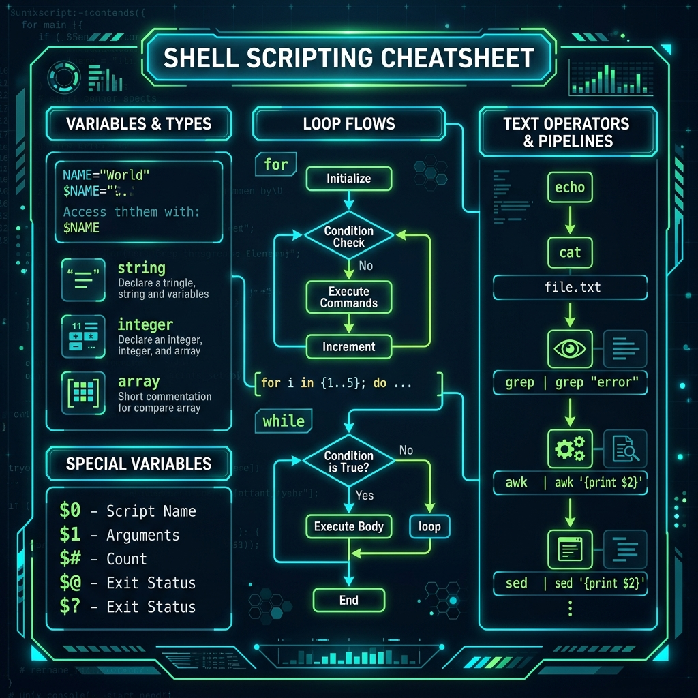

# 📝 Day 21 – Shell Scripting Cheat Sheet: Build Your Own Reference Guide

> **"Shell scripting is the digital glue that binds Unix primitives into production-grade orchestration. A masterfully structured cheat sheet is more than a syntax reminder—it is a cognitive map for rapid diagnostics, fail-safe automation, and high-performance infrastructure operations."**

Welcome to Day 21 of the **90 Days of DevOps** challenge! Today, we consolidate everything we have learned over the shell scripting modules into a single, production-grade, highly structured **Personal Cheat Sheet**. This document is designed to serve as an instant, zero-friction reference on the job, in staging environments, or during live production incident responses.

---

## 📋 Lab Metadata

| Attribute | Details |
| :--- | :--- |
| **Concept** | POSIX Shell Standards, Modular Code structures, Text Stream Parsing, Safe Pipeline Flags, Process Control, Error Audits |
| **Operating System** | macOS (Darwin Kernel 25.x) & POSIX Linux Reference |
| **Interpreter** | GNU Bash (`/bin/bash` / `/usr/bin/env bash`) |
| **Target Document** | [shell_scripting_cheatsheet.md](shell_scripting_cheatsheet.md) |
| **Key Command Interfaces** | `chmod +x`, `grep -E`, `awk -F`, `sed -E`, `cut -d`, `sort -rn`, `uniq -c` |
| **Lab Date** | June 2, 2026 |
| **GitHub Directory** | `90DaysOfDevOps/2026/day-21/` |

---

## 📑 Table of Contents
1. [📊 Quick Reference Syntax Summary](#-quick-reference-syntax-summary)
2. [⚙️ Task 1: Shell Scripting Basics](#️-task-1-shell-scripting-basics)
3. [🚨 Task 2: Operators & Conditional Controls](#-task-2-operators--conditional-controls)
4. [🔁 Task 3: Iteration & Loop Structures](#-task-3-iteration--loop-structures)
5. [📦 Task 4: Modular Functions & Return Values](#-task-4-modular-functions--return-values)
6. [🏆 Task 5: Stream & Text Processing Powerhouses](#-task-5-stream--text-processing-powerhouses)
7. [⚡ Task 6: Enterprise One-Liners & Patterns](#-task-6-enterprise-one-liners--patterns)
8. [🛡️ Task 7: Deflationary Error Handling & Safe Execution Mode](#️-task-7-deflationary-error-handling--safe-execution-mode)
9. [🎨 Visual Reference Dashboard](#-visual-reference-dashboard)

---

## 📊 Quick Reference Syntax Summary

Below is an instant lookup matrix summarizing core Unix/Linux shell constructs:

| Category | Key Syntax | Practical Example | Details / Use Case |
| :--- | :--- | :--- | :--- |
| **Variable** | `VAR="value"` | `API_ENDPOINT="https://api.dev"` | Declare variables without spacing around `=`. |
| **Argument** | `$1`, `$2`, `$#` | `if [ "$#" -lt 2 ]; then` | Process script command line inputs. |
| **Conditional** | `if [[ condition ]]; then` | `if [[ -f "/etc/nginx.conf" ]]; then` | Safe double-bracket POSIX/Bash expression evaluation. |
| **For Loop** | `for item in list; do` | `for host in svr-01 svr-02; do` | Iterate sequentially over structured elements. |
| **While Loop** | `while read line; do` | `while read -r line; do ... done < log.txt` | Stream and parse file content line-by-line. |
| **Function** | `func_name() { ... }` | `cleanup() { rm -rf "$TMP"; }` | Create re-usable code blocks with local scope. |
| **Grep** | `grep -E "regex" file` | `grep -E -i "error\|fatal" system.log` | Scan files using Extended Regular Expressions. |
| **Awk** | `awk '{print $col}'` | `awk -F: '{print $1}' /etc/passwd` | Column-based text stream manipulation and reports. |
| **Sed** | `sed 's/old/new/g'` | `sed -i 's/port=80/port=443/g' env.cfg` | In-place text stream transformations. |

---

## ⚙️ Task 1: Shell Scripting Basics

### 1. The Shebang (`#!/bin/bash` vs `#!/usr/bin/env bash`)
The shebang is the very first line of a script, instructing the kernel which interpreter to use to execute the script's instruction stream.
* **`#!/bin/bash`**: Hardcodes the interpreter path. Can cause scripts to fail if `bash` is installed in a non-standard path (e.g., `/usr/local/bin/bash` on FreeBSD or macOS custom homebrew environments).
* **`#!/usr/bin/env bash`**: **Best Practice.** Queries the system's `$PATH` to dynamically locate the active `bash` executable. Offers maximum portability across diverse UNIX environments.

### 2. Running a Script
To execute a shell script, the file must have read and execute permissions.
```bash
# 1. Grant execute permissions to the file owner
chmod +x deploy.sh

# 2. Execute directly in the current shell via file path (respects Shebang)
./deploy.sh

# 3. Explicitly invoke with Bash (overrides/ignores Shebang and missing +x flag)
bash deploy.sh
```

### 3. Comment Standards
Proper documentation keeps scripts maintainable:
```bash
# This is a standard single-line comment describing the variable below
PORT=8080

echo "Initializing on Port $PORT" # Inline comment explaining operations
```

### 4. Variable Rules & Quoting Paradigms
Variables are typed implicitly as strings in Bash. Spaces around the assignment operator `=` are strictly prohibited.
* **Double Quotes (`"..."`)**: Allows variable expansion (`$VAR`) and command substitution (`$(command)`).
* **Single Quotes (`'...'`)**: Treats every character inside literally. No expansions are performed.
* **Unquoted (`$VAR`)**: Subject to **Word Splitting** and **Path Expansion (globbing)**. Highly dangerous; can lead to catastrophic bugs.

```bash
USER_NAME="Alice"

echo "Hello, $USER_NAME"  # Output: Hello, Alice (Variables expand)
echo 'Hello, $USER_NAME'  # Output: Hello, $USER_NAME (Literal string)
```

### 5. Reading User Input
Capture dynamic terminal input cleanly using the `read` command.
```bash
# -p specifies the prompt text, -s hides the keystrokes (useful for secrets/passwords)
read -p "Enter Target Domain: " TARGET_DOMAIN
read -s -p "Enter Admin API token: " API_TOKEN
```

### 6. Command-Line Arguments (Special Parameters)
Special variables mapped to incoming command arguments during shell invocation:
* **`$0`**: The filename or relative path of the executing script.
* **`$1` to `$9`**: Positional arguments passed to the script (e.g., first, second). For arguments greater than 9, wrap them in brackets (e.g., `${10}`).
* **`$#`**: The total count of positional arguments passed.
* **`$@`**: All positional arguments individually quoted (`"$1" "$2" ...`). **Always use this format** to preserve whitespace.
* **`$*`**: All positional arguments as a single concatenated string, separated by the first character of `$IFS` (Internal Field Separator).
* **`$?`**: The exit status of the most recently executed command (0 is success, non-zero indicates failure).

```bash
# Example script: args_test.sh
echo "Script Path: $0"
echo "First Argument: $1"
echo "Total Arguments: $#"
echo "All Arguments (Safe): $@"
```

#### 🧪 Basics Script Live Console Output
```text
$ chmod +x args_test.sh
$ ./args_test.sh production force-deploy 5
Script Path: ./args_test.sh
First Argument: production
Total Arguments: 3
All Arguments (Safe): production force-deploy 5
$ echo $?
0
```

---

## 🚨 Task 2: Operators & Conditional Controls

### 1. String Comparisons
Always wrap variables in double quotes inside conditions to prevent word-splitting failures.
* **`[[ "$A" = "$B" ]]`** (or `==`): True if string `$A` matches `$B`.
* **`[[ "$A" != "$B" ]]`**: True if string `$A` does not match `$B`.
* **`[[ -z "$A" ]]`**: True if string `$A` is empty (zero length).
* **`[[ -n "$A" ]]`**: True if string `$A` is not empty (non-zero length).

### 2. Integer Comparisons
Use these specific operators for evaluating numeric values:
* **`-eq`**: Equal to
* **`-ne`**: Not equal to
* **`-lt`**: Less than
* **`-gt`**: Greater than
* **`-le`**: Less than or equal to
* **`-ge`**: Greater than or equal to

```bash
PORT=80
if [[ "$PORT" -eq 80 ]]; then
    echo "Serving HTTP traffic."
fi
```

### 3. File Test Operators
Critical check expressions before attempting read/write operations on system resources:
* **`-f "$FILE"`**: Checks if the target path is a regular file.
* **`-d "$DIR"`**: Checks if the target path is a directory.
* **`-e "$PATH"`**: Checks if the target file/folder exists.
* **`-r "$FILE"`**: True if the file has read permissions.
* **`-w "$FILE"`**: True if the file has write permissions.
* **`-x "$FILE"`**: True if the file has execute permissions.
* **`-s "$FILE"`**: True if file exists and has a size greater than 0 (not empty).

### 4. Standard Conditional Syntax (`if`, `elif`, `else`)
```bash
MEM_UTILIZATION=$(free -m | awk '/Mem:/ {print int($3/$2 * 100)}')

if [[ "$MEM_UTILIZATION" -ge 90 ]]; then
    echo "CRITICAL: Memory utilization is at ${MEM_UTILIZATION}%"
elif [[ "$MEM_UTILIZATION" -ge 75 ]]; then
    echo "WARNING: Memory utilization is at ${MEM_UTILIZATION}%"
else
    echo "OK: Memory utilization is healthy (${MEM_UTILIZATION}%)"
fi
```

### 5. Logical Operators
* **`&&`**: Logical AND (both conditions must be true).
* **`||`**: Logical OR (at least one condition must be true).
* **`!`**: Logical NOT (inverts the condition's result).

```bash
# Execute only if configuration exists AND service is active
if [[ -f "/etc/nginx/nginx.conf" ]] && systemctl is-active --quiet nginx; then
    echo "Nginx config is in place and system is running."
fi
```

### 6. Case Selection Statements (`case ... esac`)
Used as a clean alternative to deep nested `if-elif` blocks when checking single string patterns.
```bash
read -p "Select Deployment Action [start|stop|restart]: " ACTION

case "$ACTION" in
    "start")
        echo "Launching service processes..."
        ;;
    "stop"|"shutdown")
        echo "Gracefully terminating service processes..."
        ;;
    "restart")
        echo "Rebooting service daemon..."
        ;;
    *)
        echo "Error: Unknown action directive '$ACTION'" >&2
        exit 1
        ;;
esac
```

---

## 🔁 Task 3: Iteration & Loop Structures

### 1. For Loops
Iterate over fixed sequences, numeric ranges, or files.

```bash
# A. List-Based Iteration
for environment in dev staging prod; do
    echo "Configuring cluster namespace for: $environment"
done

# B. C-Style Loop (Ideal for numeric counters)
for ((i=1; i<=3; i++)); do
    echo "Ping attempt #$i..."
done

# C. Bracket-Based Numeric Range
for index in {1..5}; do
    echo "Spawning node-${index}..."
done
```

### 2. While Loops
Executes code blocks as long as the evaluation condition remains True.
```bash
COUNT=1
while [[ "$COUNT" -le 3 ]]; do
    echo "Polling server - Status: Waiting... (Attempt $COUNT)"
    COUNT=$((COUNT + 1))
done
```

### 3. Until Loops
Executes code blocks as long as the evaluation condition is False, halting immediately once it evaluates to True.
```bash
TIMEOUT=5
until [[ "$TIMEOUT" -eq 0 ]]; do
    echo "Healthcheck stabilizing... Retrying in ${TIMEOUT}s"
    TIMEOUT=$((TIMEOUT - 1))
done
```

### 4. Loop Controls (`break` and `continue`)
* **`break`**: Instantly terminates the loop container, shifting execution flow to the subsequent line.
* **`continue`**: Skips the remaining operations inside the current iteration loop and jumps straight to the next evaluation.

```bash
for file in *; do
    if [[ ! -f "$file" ]]; then
        continue # Ignore directories, skip to next file
    fi
    if grep -q "SECRET_KEY" "$file"; then
        echo "CRITICAL SECURITY TRIGGER: Found secret key inside $file"
        break # Exit loop immediately to lock diagnostics
    fi
done
```

### 5. Loop Over Directory Files
Always wrap iteration patterns safely to handle missing file matches without crashing.
```bash
# Safely process each log file in the directory
for file in *.log; do
    # Prevent execution errors if no .log files are present
    [[ -f "$file" ]] || continue
    
    echo "Compressing log file: $file"
    gzip "$file"
done
```

### 6. Processing Command Output (Line-by-Line Reading)
Streams stream-lines or file text inputs using `while read` coupled with strict Internal Field Separator controls.
```bash
# Read input files line-by-line safely
while IFS= read -r line; do
    echo "Active User Session: $line"
done < "users.txt"
```

---

## 📦 Task 4: Modular Functions & Return Values

Functions isolate, reuse, and modularize logical parts of shell scripts.

### 1. Defining & Calling Functions
Always define functions before invoking them inside shell environments.
```bash
# Option A: Standard syntax (Recommended)
log_info() {
    echo -e "[$(date '+%H:%M:%S')] [\033[0;32mINFO\033[0m] $1"
}

# Option B: Using the function keyword
function log_warn {
    echo -e "[$(date '+%H:%M:%S')] [\033[0;33mWARN\033[0m] $1"
}

# Call functions like standard console commands (do NOT write parenthesis)
log_info "Initializing database schema validation..."
log_warn "Disk space utilization is approaching warning threshold."
```

### 2. Passing Arguments to Functions
Functions possess independent parameter structures, shadowing the script's global arguments (`$1`, `$2` inside a function refer only to its local inputs).
```bash
calculate_sum() {
    local num1=$1
    local num2=$2
    local sum=$((num1 + num2))
    echo "$sum" # Data output standard
}

# Invoke the function with parameters
TOTAL_COST=$(calculate_sum 45 55)
echo "Total Calculated Cost: $TOTAL_COST"
```

### 3. Scope Isolation: Local Variables
Always mark variables inside function containers with the **`local`** keyword to prevent polluting the global namespace.
```bash
var_scope_test() {
    local LOCAL_VAR="I am scoped inside the function"
    GLOBAL_VAR="I can modify anything globally!"
}
```

### 4. Return Values (`return` vs `echo`)
* **`return`**: ONLY returns numeric exit codes (values 0–255). Used to communicate execution success or failure status.
* **`echo` / stdout**: Used to transmit actual structured data, strings, or numbers back to the parent execution stream via command substitutions.

```bash
check_root_permissions() {
    if [[ "$EUID" -ne 0 ]]; then
        return 1 # Error: Non-root user
    fi
    return 0 # Success
}

if check_root_permissions; then
    echo "Root context verified. Running upgrade..."
else
    echo "Error: This operation requires administrative privileges." >&2
    exit 1
fi
```

---

## 🏆 Task 5: Stream & Text Processing Powerhouses

DevOps engineers spend a significant amount of time manipulating logs and command outputs. Mastery of these 9 text tools is essential:

### 1. `grep` — Scan Patterns & Files
* **Syntax**: `grep [options] "pattern" file`
* **Essential Flags**:
  * `-i`: Case-insensitive search.
  * `-v`: Invert search (returns lines that do *not* match).
  * `-c`: Count lines matching the pattern instead of showing matches.
  * `-n`: Prepend matched lines with their respective line numbers.
  * `-r`: Search directories recursively.
  * `-E`: Enable Extended Regular Expressions (supports `|`, `+`, `?`).

```bash
# Find all occurrences of "ERROR" or "FAIL" in production logs
grep -E -n -i "error|fail" prod_app.log
```

### 2. `awk` — Structural Column Manipulation
* **Syntax**: `awk -F"delimiter" 'pattern {action}' file`
* **Core Primitives**:
  * `$1`, `$2`, `$NF`: Refer to the first, second, and final columns.
  * `-F:`: Sets custom field separators (defaults to space/tabs).
  * `BEGIN` / `END`: Runs routines before or after processing lines.

```bash
# Print username and system shell path from system account configurations
awk -F: '{print $1 " uses shell " $7}' /etc/passwd
```

### 3. `sed` — Stream Line Transformations
* **Syntax**: `sed [options] 'command' file`
* **Key Commands**:
  * `'s/search/replace/g'`: Replaces search terms globally.
  * `'/pattern/d'`: Deletes lines matching the specified pattern.
  * `-i`: Performs edit operations **in-place** directly on the file.

```bash
# Replace old domain with new domain inside API configurations
sed -i 's/api-old.internal/api-new.internal/g' services.conf
```

### 4. `cut` — Extract Specific Substrings & Columns
* **Syntax**: `cut [options] file`
* **Flags**:
  * `-d "char"`: Sets custom column separator delimiter.
  * `-f N`: Extracts field index number.
  * `-c N-M`: Extracts characters from character index N to M.

```bash
# Extract only the IP addresses from server connections
echo "192.168.1.15,dev-svr,active" | cut -d',' -f1
```

### 5. `sort` — Order Streams Alphabetically or Numerically
* **Syntax**: `sort [options] file`
* **Flags**:
  * `-n`: Perform numeric sort instead of alphabetical string sorting.
  * `-r`: Reverse sorting output order (descending).
  * `-k N`: Sort based on values inside column index N.

```bash
# Sort numeric file sizes in descending order
cat sizes.txt | sort -rn
```

### 6. `uniq` — Deduplicate Repeated Lines
* **Syntax**: `uniq [options] file`
* **Important Note**: `uniq` only detects consecutive identical lines. **Always pair it with `sort` first!**
* **Flags**:
  * `-c`: Prepend duplicate lines with their frequency counts.
  * `-d`: Only display repeating/duplicate lines.
  * `-u`: Only display non-repeating/unique lines.

```bash
# Find and count the frequency of each error level in the logs
grep "Level:" system.log | sort | uniq -c
```

### 7. `tr` — Translate or Delete Character Streams
* **Syntax**: `tr [options] "source" "replace"`
* **Flags**:
  * `-d`: Delete matching characters from the input stream.
  * `-s`: Squeeze sequential duplicate characters into a single instance.

```bash
# Convert lower-case strings to upper-case
echo "deploy-staging" | tr 'a-z' 'A-Z'

# Remove Windows-style carriage return symbols from text files
cat script.sh | tr -d '\r' > unix_script.sh
```

### 8. `wc` — Calculate Word, Character, and Line Counts
* **Syntax**: `wc [options] file`
* **Flags**:
  * `-l`: Output the total count of lines.
  * `-w`: Output the total count of words.
  * `-c`: Output the total count of bytes.

```bash
# Verify the total number of lines in a server access log
wc -l < access.log
```

### 9. `head` & `tail` — Access Boundaries of Streams
* **Syntax**: `head/tail [options] file`
* **Flags**:
  * `-n N`: Number of lines to output (defaults to 10).
  * `-f` (tail only): Follow mode. Appends new incoming stream lines dynamically in real-time.

```bash
# Tail system alerts in real-time
tail -f -n 20 /var/log/system.log
```

---

## ⚡ Task 6: Enterprise One-Liners & Patterns

Here are 7 real-world, high-impact pipeline command chains that you can run directly on target systems:

### 1. Locate and Delete Files Older Than 7 Days
Finds all `.log` files inside the target path that haven't been modified in the last 7 days and deletes them safely.
```bash
find /var/log/nginx -name "*.log" -type f -mtime +7 -delete
```

### 2. Aggregate Total Line Counts for All Log Files
Aggregates and totals the line count for every log file in the current working directory recursively.
```bash
find . -name "*.log" -exec wc -l {} +
```

### 3. Replace a Configuration String Across Multiple Files
Modifies a database host IP across all `.conf` files nested inside the configurations directory in-place.
```bash
find ./configs -type f -name "*.conf" -exec sed -i 's/10.0.1.55/10.0.2.99/g' {} +
```

### 4. Check if a System Service is Active
A fail-safe way to verify a running process inside automated monitoring checks or cron scripts.
```bash
systemctl is-active --quiet nginx && echo "NGINX: ACTIVE" || echo "NGINX: FAILED"
```

### 5. Monitor and Alert High Disk Usage
Prints high-severity alerts for any mounting disk partition that exceeds 80% usage capacity.
```bash
df -h | awk 'NR>1 {gsub("%","",$5); if($5 > 80) print "CRITICAL WARNING: Partition " $1 " is at " $5 "%"}'
```

### 6. Curl and Parse Values from JSON APIs
Pulls a structured user account profile from an endpoint and prints their specific variables using `jq`.
```bash
curl -s "https://api.github.com/users/octocat" | jq -r '.name + " has " + (.public_repos|tostring) + " public repositories."'
```

### 7. Real-Time Error Log Filtering with Buffer Flushing
Tails system event logs in real-time, flushing buffers immediately to capture error strings without delay.
```bash
tail -f /var/log/syslog | grep --line-buffered -E -i "error|critical|fatal"
```

---

## 🛡️ Task 7: Deflationary Error Handling & Safe Execution Mode

Production scripts should never fail silently. Use this collection of error-handling best practices to ensure your scripts run safely:

### 1. Bash Strict Mode (Safe Flag Assertions)
Place these flags at the top of your scripts to exit early and capture bugs before they propagate:
```bash
# Enable ultimate system safeties
set -euo pipefail
```
* **`set -e`**: Aborts script execution immediately if any command returns a non-zero exit status.
* **`set -u`**: Treats attempts to expand unset variables as immediate execution errors, halting execution.
* **`set -o pipefail`**: Changes the exit status of a pipeline to the value of the last command to exit with a non-zero status. Prevents hidden failures inside pipelines.
* **`set -x`**: Debugging aid. Outputs every command to standard error (prefixed with `+`) before executing it.

### 2. Trap Signals for Resource Cleanup
Use `trap` to catch interruptions, errors, or script exits, ensuring temp files are cleaned up and resources are released.
```bash
# Create a secure temporary configuration file
TEMP_DECRYPTION_FILE=$(mktemp /tmp/deploy_secrets.XXXXXX)

# Define a cleanup routine
cleanup_temp_resources() {
    echo -e "\n🧹 Trapped signal! Executing emergency file cleanups..."
    rm -f "$TEMP_DECRYPTION_FILE"
}

# Register the cleanup routine to run on script exit, interruption, or termination signals
trap cleanup_temp_resources EXIT INT TERM
```

#### 🧪 Safe Debug Script Live Console Output
Below is a demonstration of execution tracing (`set -x`) and signal trapping (`trap`) when a user triggers a manual termination command (`Ctrl+C`):
```text
$ ./safe_deploy.sh
+ mktemp /tmp/deploy_secrets.XXXXXX
+ TEMP_DECRYPTION_FILE=/tmp/deploy_secrets.y8R3ka
+ trap cleanup_temp_resources EXIT INT TERM
+ echo 'Starting secure container deployment...'
Starting secure container deployment...
+ sleep 10
^C
🧹 Trapped signal! Executing emergency file cleanups...
```

---

## 🎨 Visual Reference Dashboard

Below is a detailed engineering flowchart and cheat sheet infographic mapping key variable structures, evaluation pathways, loop controllers, and steam text pipelines:



---

Day 21 Complete 📝

**Happy Learning!**
*Trainer: Shubham Londhe*
*Study Notes compiled by: Rajat Mehta*