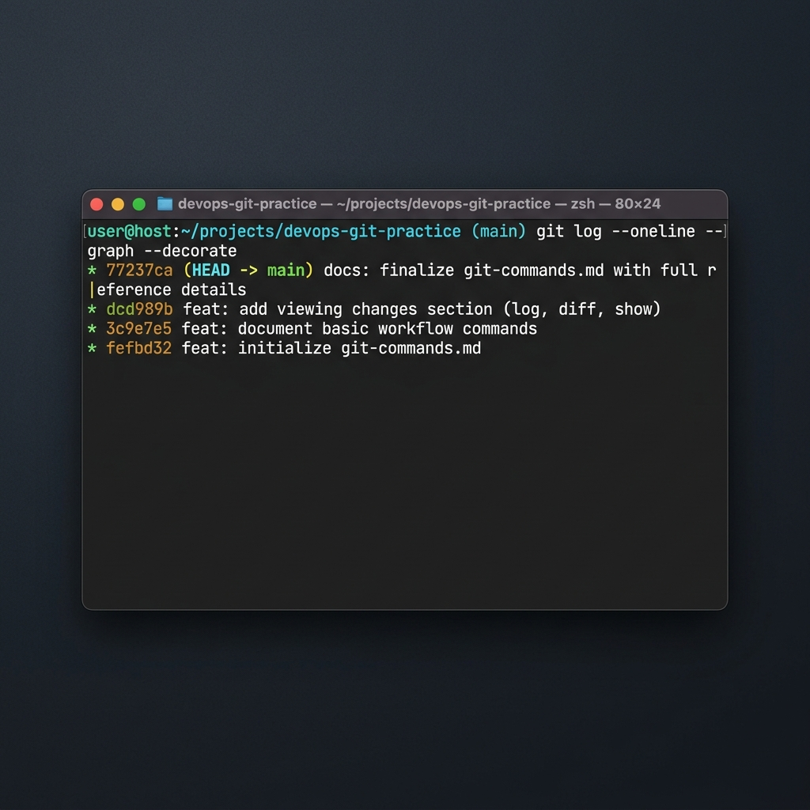

# 📝 Day 22 – Introduction to Git: Lab Notes & Conceptual Review

> **"Version control is the bedrock of DevOps. It transforms software development from an uncoordinated sequence of manual file updates into a trackable, repeatable, and collaborative process. Without Git, the automation pipelines, infrastructure-as-code models, and cloud-native practices we rely on today would not be possible."**

Welcome to Day 22 of the **90 Days of DevOps** challenge! Today, I transitioned into the version control module by configuring the local Git environment, bootstrapping a new workspace, inspecting internal Git tracking mechanisms, and orchestrating a multi-commit local project history. Below are the official lab execution logs, technical reviews, and conceptual answers.

---

## 📋 Lab Metadata

| Attribute | Details |
| :--- | :--- |
| **Concept** | Git Internals, Object Trees, Staging Index, Commit Workflows, Global Configurations, Working vs Staged Contexts |
| **Operating System** | macOS (Darwin Kernel 25.x) & POSIX Linux Reference |
| **Workspace Folder** | `devops-git-practice/` |
| **Interface** | Git CLI v2.50.x (Apple Git) |
| **Target Document** | [day-22-notes.md](day-22-notes.md) |
| **Lab Date** | June 2, 2026 |
| **GitHub Directory** | `90DaysOfDevOps/2026/day-22/` |

---

## 📑 Table of Contents
1. [💻 Lab Walkthrough & Execution Log](#-lab-walkthrough--execution-log)
   - [Task 1: Install and Configure Git](#task-1-install-and-configure-git)
   - [Task 2: Create Your Git Project](#task-2-create-your-git-project)
   - [Task 4 & 5: Staging, Committing, and Building History](#task-4--5-staging-committing-and-building-history)
2. [🔍 Deep Dive: The `.git/` Directory Structure](#-deep-dive-the-git-directory-structure)
3. [❓ Conceptual Q&A (Task 6)](#-conceptual-qa-task-6)
4. [📊 Visual Verification & History Log](#-visual-verification--history-log)

---

## 💻 Lab Walkthrough & Execution Log

Here is the exact terminal trace and command outputs recorded during today's local hands-on laboratory tasks:

### Task 1: Install and Configure Git
First, I verified the local Git installation and initialized the global developer identity (name and email), which is used by Git to sign commits.

```bash
# 1. Verify Git installation path and version
$ git --version
git version 2.50.1 (Apple Git-155)

# 2. Configure global user identity
$ git config --global user.name "rajatmehta2"
$ git config --global user.email "rajat.mehta2@gmail.com"

# 3. Verify configuration properties
$ git config --list --global
user.name=rajatmehta2
user.email=rajat.mehta2@gmail.com
```

---

### Task 2: Create Your Git Project
Next, I created the dedicated training workspace directory and initialized it as a new local Git repository.

```bash
# 1. Create a fresh project directory
$ mkdir -p devops-git-practice
$ cd devops-git-practice

# 2. Initialize Git repository
$ git init
Initialized empty Git repository in /Users/ToucanRajat/Documents/Rajat-Projects/Personal-Projects/90DaysOfDevOps/2026/day-22/devops-git-practice/.git/

# 3. Check initial repository status
$ git status
On branch main

No commits yet

nothing to commit (create/copy files and use "git add" to track)
```

---

### Task 4 & 5: Staging, Committing, and Building History
I created `git-commands.md` and added updates iteratively to create a multi-commit history in the repository. The workflow below shows how each modification was staged and committed:

#### Commit 1: Initializing Setup & Configuration
```bash
# 1. Stage the initial document structure
$ git add git-commands.md

# 2. Check staged changes
$ git status
On branch main

No commits yet

Changes to be committed:
  (use "git rm --cached <file>..." to unstage)
	new file:   git-commands.md

# 3. Record the first commit
$ git commit -m "feat: initialize git-commands.md with setup & configuration commands"
[main (root-commit) fefbd32] feat: initialize git-commands.md with setup & configuration commands
 1 file changed, 10 insertions(+)
 create mode 100644 git-commands.md
```

#### Commit 2: Documenting Basic Workflow
```bash
# 1. Edit the reference file to add workflow details
# 2. Stage and commit changes
$ git add git-commands.md
$ git commit -m "feat: document basic workflow commands (add, commit, status)"
[main 3c9e7e5] feat: document basic workflow commands (add, commit, status)
 1 file changed, 10 insertions(+)
```

#### Commit 3: Adding Viewing Changes Section
```bash
# 1. Edit the file to include history analysis command definitions
# 2. Stage and commit changes
$ git add git-commands.md
$ git commit -m "feat: add viewing changes section (log, diff, show)"
[main dcd989b] feat: add viewing changes section (log, diff, show)
 1 file changed, 11 insertions(+)
```

#### Commit 4: Finalizing Document Details
```bash
# 1. Update the document with professional styling and instructions
# 2. Stage and commit changes
$ git add git-commands.md
$ git commit -m "docs: finalize git-commands.md with full reference details"
[main 77237ca] docs: finalize git-commands.md with full reference details
 1 file changed, 319 insertions(+), 22 deletions(-)
```

---

## 🔍 Deep Dive: The `.git/` Directory Structure

When running `git init`, Git creates a hidden directory called `.git/` in the project root. This directory contains all the metadata and version history for your repository. If you delete it, your project returns to a plain folder and all commit history is lost.

Below is an overview of the active files inside `.git/` after initializing:

```bash
$ ls -la .git
total 24
drwxr-xr-x   9 ToucanRajat  staff  288 Jun  2 14:56 .
drwxr-xr-x   3 ToucanRajat  staff   96 Jun  2 14:56 ..
-rw-r--r--   1 ToucanRajat  staff   21 Jun  2 14:56 HEAD
-rw-r--r--   1 ToucanRajat  staff  137 Jun  2 14:56 config
-rw-r--r--   1 ToucanRajat  staff   73 Jun  2 14:56 description
drwxr-xr-x  16 ToucanRajat  staff  512 Jun  2 14:56 hooks
drwxr-xr-x   3 ToucanRajat  staff   96 Jun  2 14:56 info
drwxr-xr-x   4 ToucanRajat  staff  128 Jun  2 14:56 objects
drwxr-xr-x   4 ToucanRajat  staff  128 Jun  2 14:56 refs
```

### Component Breakdown & Purposes

| File/Folder | Type | Purpose & Functionality |
| :--- | :--- | :--- |
| **`HEAD`** | File | A pointer file that tracks your current active branch or commit (e.g., `ref: refs/heads/main`). |
| **`config`** | File | Contains repository-specific configurations, remote URLs, and branch tracking preferences. |
| **`description`** | File | Used exclusively by GitWeb to display repository summaries. Ignored by modern tools. |
| **`hooks/`** | Directory | Contains sample client-side or server-side scripts triggered by Git events (e.g., `pre-commit`, `commit-msg`). |
| **`info/`** | Directory | Contains global exclusion rules in `info/exclude` that behave similarly to a local `.gitignore` file. |
| **`objects/`** | Directory | The main Git database. Stores compressed content (blobs), folder structures (trees), and commit records. |
| **`refs/`** | Directory | Holds references (pointers) to branches (`refs/heads/`), tags (`refs/tags/`), and remote branches. |

---

## ❓ Conceptual Q&A (Task 6)

### 1. What is the difference between `git add` and `git commit`?
* **`git add`** acts as a compiler step for changes. It copies modifications from the **Working Directory** to the **Staging Area** (index). Running `git add` prepares your changes for the next snapshot but does not save them permanently.
* **`git commit`** takes everything currently in the **Staging Area** and writes it as a permanent snapshot to the local **Git Database**. This creates a commit hash (SHA-1/SHA-256 ID) that allows you to track, revert, or share those changes.

---

### 2. What does the Staging Area do? Why doesn't Git just commit directly?
The **Staging Area** (also called the "index") is an intermediate cache between your working directory and your commit history. It allows you to select exactly which changes should go into the next commit.

#### Why Git doesn't commit directly:
1. **Atomic Commits:** Staging allows you to group related changes together. If you modify 5 different files to fix 3 different bugs, committing directly would save everything in a single, messy snapshot. With staging, you can stage and commit each fix separately.
2. **Review Opportunities:** It gives you a final chance to run `git diff --staged` and review exactly what is being committed before saving it to history.
3. **Partial Commits:** Staging allows you to stage specific lines or files while leaving other experimental edits unstaged (`git add -p`).

---

### 3. What information does `git log` show you?
The `git log` command displays the chronological history of commits on your active branch.

#### Each entry in the log contains:
* **Commit Hash:** A unique alphanumeric identifier (SHA-1/SHA-256) representing the specific snapshot.
* **Author Info:** The developer's configured name and email.
* **Commit Date:** The exact timestamp showing when the commit was created.
* **Commit Message:** The descriptive text written by the developer during the commit step.
* **Refs / Branch Pointers:** Displays branch pointers (`main`, `feature/`), tags, or HEAD locations.

---

### 4. What is the `.git/` folder and what happens if you delete it?
The `.git/` folder is a hidden directory that serves as the repository's local database. It stores the version history, object database, configuration files, and branch refs.

> [!CAUTION]
> If you delete the `.git/` directory, your project returns to a plain, untracked folder. All historical versions, commit records, branches, and staging information are permanently deleted. The actual files in your working directory will remain intact, but you will not be able to recover past versions of them.

---

### 5. What is the difference between a Working Directory, Staging Area, and Repository?
Git structures your environment into three main logical zones:

```
┌────────────────────────┐       git add       ┌────────────────────────┐
│   Working Directory    │  ─────────────────> │   Staging Area (Index) │
│  (Untracked/Modified)  │                     │   (Prepared Changes)   │
└────────────────────────┘                     └────────────────────────┘
            │                                               │
            │                                               │ git commit
            │                                               ▼
            │     git checkout                 ┌────────────────────────┐
            └───────────────────────────────── │    Local Repository    │
                                               │   (.git Directory DB)  │
                                               └────────────────────────┘
```

1. **Working Directory (Sandbox):** The local folder on your computer where you create, modify, and delete project files. Git monitors this area for changes but does not track them automatically until they are staged.
2. **Staging Area (Curation Desk):** A hidden index file that caches the specific changes you want to include in your next commit.
3. **Repository (Local Database):** The `.git/` directory that stores all confirmed commits, version logs, branches, and object histories.

---

## 📊 Visual Verification & History Log

The screenshot below shows the command-line output of `git log --oneline --graph --decorate` in our practice workspace, displaying a clean local history:

```bash
$ git log --oneline --graph --decorate
* 77237ca (HEAD -> main) docs: finalize git-commands.md with full reference details
* dcd989b feat: add viewing changes section (log, diff, show)
* 3c9e7e5 feat: document basic workflow commands (add, commit, status)
* fefbd32 feat: initialize git-commands.md with setup & configuration commands
```

### Verified Terminal Commit History Screenshot:


---

Day 22 Complete 📝

**Happy Learning!**
*Trainer: Shubham Londhe*
*Study Notes compiled by: Rajat Mehta*