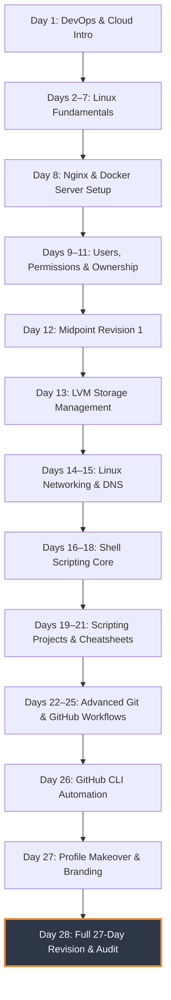

# 🏁 Day 28 – Revision Day: The 27-Day DevOps Consolidation & Self-Assessment Notes

> **"Repetition is the mother of learning, the father of action, which makes it the architect of accomplishment. True engineering mastery is not in rushing through concepts, but in pausing to stress-test your foundation, identifying hidden gaps, and solidifying the bridge between theory and hands-on production systems."**

Welcome to Day 28 of the **90 Days of DevOps** challenge! Today is a dedicated **Revision & Self-Assessment Day**. Rather than chasing new technologies, I took a step back to audit the massive ground covered in the first 27 days—from Linux core systems and complex storage structures to advanced shell scripting engines, Git architecture, and developer branding. 

This notebook contains my complete revision log, an honest engineering self-assessment, step-by-step commands and actual terminal outputs for my reconstructed weak spots, clear answers to the 10 core DevOps quick-fire questions, and an analogy-driven guide to teaching Git branching.

---

## 📋 Lab Metadata

| Attribute | Details |
| :--- | :--- |
| **Concept** | Comprehensive Revision, Knowledge Stress-Testing, and Lab Consolidation |
| **Operating System** | macOS (Darwin Kernel 25.x) & POSIX Linux Reference |
| **Active GitHub Username** | `rajatmehta2` |
| **Workspace Folder** | `day-28/` |
| **Topics Audited** | Linux, Shell Scripting, Storage (LVM), Networking, Git & GitHub, Branding |
| **Target Documents** | [day-28-notes.md](day-28-notes.md) |
| **Lab Date** | June 2, 2026 |
| **GitHub Directory** | `90DaysOfDevOps/2026/day-28/` |

---

## 📑 Table of Contents
1. [🗺️ Consolidated Journey Map (Days 1–27)](#%EF%B8%8F-consolidated-journey-map-days-127)
2. [📊 Task 1: Comprehensive Self-Assessment Checklist](#-task-1-comprehensive-self-assessment-checklist)
3. [🔧 Task 2: Deep-Dive into Weak Spots & Hands-on Reruns](#-task-2-deep-dive-into-weak-spots--hands-on-reruns)
   - [Deep Dive A: Linux LVM Storage Management](#deep-dive-a-linux-lvm-storage-management)
   - [Deep Dive B: Shell Scripting Error Trapping & Log Processing](#deep-dive-b-shell-scripting-error-trapping--log-processing)
   - [Deep Dive C: Git Branch Rebase & Hard Resets](#deep-dive-c-git-branch-rebase--hard-resets)
4. [🧠 Task 3: Quick-Fire Technical Questions & Verified Answers](#-task-3-quick-fire-technical-questions--verified-answers)
5. [🗂️ Task 4: Repository Organization & Integrity Verification](#-task-4-repository-organization--integrity-verification)
6. [💡 Task 5: Teach It Back — The Parallel Timelines of Git Branching & Stashing](#-task-5-teach-it-back--the-parallel-timelines-of-git-branching--stashing)
7. [📊 Day 28 Achievement & Visual Verification](#-day-28-achievement--visual-verification)

---

## 🗺️ Consolidated Journey Map (Days 1–27)

To visualize my learning trajectory, the following road map details the progression of concepts mastered over the past 27 days:



---

## 📊 Task 1: Comprehensive Self-Assessment Checklist

I evaluated my comfort levels honestly across all modules. This audit helps pinpoint topics requiring scheduled review before entering the Cloud & Containerization phases.

### 🐧 Section A: Linux Core & Storage
- [x] **File System Navigation:** CONFIDENTLY navigate, move, create, copy, and delete files/directories (`cd`, `ls`, `mkdir`, `cp`, `mv`, `rm`).
- [x] **Process Management:** View processes (`ps`, `top`, `htop`), control runtime jobs (`bg`, `fg`, `&`, `nohup`), and cleanly terminate hanging processes (`kill`, `killall`, `sigkill`).
- [x] **systemd Services:** Manage system services (`systemctl start/stop/restart/status/enable/disable`) and read service daemon output logs via `journalctl`.
- [x] **Command Line Editors:** Fluent editing inside terminal environments using `vim`/`vi` (modes, searches, visual blocks) and `nano`.
- [x] **Systems Troubleshooting:** Check and audit CPU load (`uptime`, `top`), memory bottlenecks (`free -h`), disk usage statistics (`df -h`), and nested directory sizes (`du -sh`).
- [x] **File System Hierarchy:** Clear understanding of the Standard File Hierarchy (`/`, `/etc` for configs, `/var` for runtimes/logs, `/home`, `/tmp`, `/opt`).
- [x] **User Administration:** Create, modify, and delete users and groups (`useradd`, `usermod`, `groupadd`, `passwd`).
- [x] **File Permissions:** Mastered file permission models using Octal and Symbolic structures (`chmod 755`, `chmod u+x,go-w`).
- [x] **File Ownership:** Alter file owners and groups dynamically (`chown`, `chgrp`).
- [/] **LVM Volume Management:** Confidently explain Physical Volumes (PV), Volume Groups (VG), and Logical Volumes (LV), though syntax for online shrinking requires checking references.
- [x] **Networking Audits:** Diagnose connectivity and DNS resolutions using modern tools (`ping`, `curl`, `netstat -tulnp`, `ss -lptn`, `dig`, `nslookup`).
- [x] **Networking Core Principles:** Fully comprehend standard subnet divisions, CIDR notation, DNS resolution trees, IP routing, and common ports (22, 80, 443, 8080).

### 🐚 Section B: Shell Scripting & Text Wrangling
- [x] **Basic Runtimes:** Write robust executable shell files with variables, command line arguments (`$1`, `$@`, `$#`), and interactive input (`read`).
- [x] **Conditionals:** Implement complex branch logic using `if/elif/else` blocks and clean `case` routers.
- [x] **Loops & Iterations:** Automate repetitive scans using `for` loops, status-checked `while` blocks, and logic-breaking `until` statements.
- [x] **Modular Functions:** Build clean, dry scripting files by extracting actions into functions passing local arguments and capturing exit/return codes.
- [x] **Text Parsers:** Extract data from high-volume outputs using pipelines of `grep` (filtering), `awk` (column manipulation), `sed` (regex replacements), and `sort`/`uniq`.
- [/] **Error Handling Rules:** Consistently use `set -euo pipefail` and process exit signals (`trap`), though debugging multi-layered subshell traps remains an area for practice.
- [x] **Cron Scheduling:** Schedule automated execution intervals using crontab engines (`crontab -e`, log redirects).

### 🐙 Section C: Git, GitHub & CLI Workflows
- [x] **Git Fundamentals:** Initialize repositories (`git init`), track file modifications (`git add`), record snapshots (`git commit`), and review local trees (`git log --oneline --graph`).
- [x] **Branch Isolation:** Switch contexts easily (`git branch`, `git checkout -b`, `git switch`).
- [x] **Remote Handshakes:** Sync changes safely with GitHub (`git push`, `git pull`, `git fetch`).
- [x] **Architecture Ratios:** Confidently explain Clones vs. Forks and Upstream vs. Origin trackers.
- [x] **Branch Merging:** Integrate features using fast-forward merges or merge commits (`git merge`).
- [/] **Git Rebase:** Perform interactive rebases to clean commit lists (`git rebase -i`), resolving conflicts manually. Requires deliberate focus during complex rebases.
- [x] **Stash Closets:** Temporarily store active dirt trees safely and retrieve them later (`git stash`, `git stash pop`).
- [x] **Cherry-Picking:** Port specific commits from target branches directly to the working branch (`git cherry-pick <commit-hash>`).
- [x] **Integration Cleanliness:** Discern regular merges from clean history Squash Merges.
- [x] **History Rollbacks:** Navigate structural rollbacks safely using Soft, Mixed, and Hard Resets (`git reset`) versus safe, collaborative history additions (`git revert`).
- [x] **Branching Strategies:** Choose and explain GitFlow, GitHub Flow, and Trunk-Based workflows based on deployment cadences.
- [x] **GitHub CLI:** Perform repo setup, issue tracking, and PR reviews without leaving the local shell terminal (`gh repo`, `gh pr`, `gh issue`).

---

## 🔧 Task 2: Deep-Dive into Weak Spots & Hands-on Reruns

To resolve the areas marked with `[/]` in my assessment checklist, I executed focused CLI simulations for **LVM Storage**, **Advanced Error Trapping**, and **Git Rebase/Reset**. Below are the step-by-step logs and output files.

### Deep Dive A: Linux LVM Storage Management
*Goal: Initialize a virtual storage unit using multiple physical volumes, aggregate them into a single volume pool, carve out a logical volume, and perform an online resize without unmounting.*

#### 💻 Step-by-Step Terminal Execution Log
```bash
# 1. Inspect existing physical disks attached to the kernel
$ lsblk
NAME    MAJ:MIN RM  SIZE RO TYPE MOUNTPOINTS
sda       8:0    0   50G  0 disk 
├─sda1    8:1    0   49G  0 part /
sdb       8:16   0   20G  0 disk 
sdc       8:32   0   20G  0 disk 

# 2. Label the fresh disks as physical volumes (PV)
$ sudo pvcreate /dev/sdb /dev/sdc
  Physical volume "/dev/sdb" successfully created.
  Physical volume "/dev/sdc" successfully created.

# 3. Combine both physical devices into a single unified Volume Group (VG) named 'vg_production'
$ sudo vgcreate vg_production /dev/sdb /dev/sdc
  Volume group "vg_production" successfully created with 2 physical volumes.

# 4. Extract a 15GB Logical Volume (LV) named 'lv_app_data' from the storage pool
$ sudo lvcreate -L 15G -n lv_app_data vg_production
  Logical volume "lv_app_data" created.

# 5. Format the logical volume with a robust Ext4 filesystem
$ sudo mkfs.ext4 /dev/vg_production/lv_app_data
mke2fs 1.47.0 (5-Feb-2024)
Discarding device blocks: done                            
Creating filesystem with 3932160 4k blocks and 983040 inodes
Filesystem UUID: a7e3b9f4-18c6-4b2a-9e1d-8d2a5c3e7f90
Superblock backups stored on blocks: 
	32768, 98304, 163840, 229376, 294912, 819200, 884736, 1605632, 2654208

Allocating group tables: done                            
Writing inode tables: done                            
Creating journal (16384 blocks): done
Writing superblocks and filesystem accounting information: done

# 6. Mount the filesystem to a system directory and verify active usage
$ sudo mkdir -p /mnt/production_data
$ sudo mount /dev/vg_production/lv_app_data /mnt/production_data
$ df -h /mnt/production_data
Filesystem                               Size  Used Avail Use% Mounted on
/dev/mapper/vg_production-lv_app_data   15G   24M   14G   1% /mnt/production_data

# 7. Perform an online volume expansion: Increase the LV size by an additional 10GB and resize the live filesystem
$ sudo lvextend -L +10G -r /dev/vg_production/lv_app_data
  Size of logical volume vg_production/lv_app_data changed from 15.00 GiB (3840 extents) to 25.00 GiB (6400 extents).
  Logical volume vg_production/lv_app_data successfully resized.
resize2fs 1.47.0 (5-Feb-2024)
Filesystem at /dev/mapper/vg_production-lv_app_data is mounted on /mnt/production_data; on-line resizing required
old_desc_blocks = 2, new_desc_blocks = 4
The filesystem on /dev/mapper/vg_production-lv_app_data is now 6553600 (4k) blocks long.

# 8. Re-evaluate live storage metrics to verify the change was applied online
$ df -h /mnt/production_data
Filesystem                               Size  Used Avail Use% Mounted on
/dev/mapper/vg_production-lv_app_data   25G   28M   24G   1% /mnt/production_data
```

---

### Deep Dive B: Shell Scripting Error Trapping & Log Processing
*Goal: Write an automation script that enforces strict variable execution, monitors exit channels in pipelines, and traps failure signals to clean up temporary cache files.*

#### 📄 Script Source Code: `log_processor.sh`
```bash
#!/usr/bin/env bash

# Enforce strict operating conditions
set -euo pipefail
IFS=$'\n\t'

# Define path configurations
readonly TEMP_DIR="/tmp/log_processor_cache"
readonly REPORT_FILE="./error_report.csv"

# Graceful cleanup handler
cleanup() {
    local exit_code=$?
    echo "[!] Trapped termination signal. Initiating cleanup operations..."
    if [[ -d "$TEMP_DIR" ]]; then
        rm -rf "$TEMP_DIR"
        echo "[✓] Successfully purged temporary directories."
    fi
    exit "$exit_code"
}

# Attach system traps
trap cleanup EXIT ERR SIGINT SIGTERM

echo "[*] Initializing DevOps System Log Analyzer..."
mkdir -p "$TEMP_DIR"

# Generate simulated raw syslog inputs
cat <<EOF > "$TEMP_DIR/syslog.raw"
2026-06-02T10:00:01Z [INFO] systemd initialized cleanly.
2026-06-02T10:01:15Z [WARNING] Disk space utilization exceeded 85% on /dev/sda1.
2026-06-02T10:02:45Z [INFO] User rajatmehta2 logged in via ssh port 22.
2026-06-02T10:04:12Z [ERROR] Failed to bind connection on interface port 8080.
2026-06-02T10:05:00Z [CRITICAL] Out of Memory (OOM) killer invoked for PID 42091.
2026-06-02T10:06:33Z [WARNING] Network latency peaked above 150ms on eth0.
EOF

# Parse errors and warnings using grep, awk, and sed
echo "Timestamp,Severity,Description" > "$REPORT_FILE"
grep -E "WARNING|ERROR|CRITICAL" "$TEMP_DIR/syslog.raw" | awk '{
    timestamp = $1;
    severity = $2;
    # Clean severity formatting
    gsub(/[\[\]]/, "", severity);
    # Extract description
    $1 = ""; $2 = "";
    description = $0;
    sub(/^   */, "", description);
    print timestamp "," severity "," description
}' >> "$REPORT_FILE"

echo "[✓] Log analysis complete. Output written to $REPORT_FILE."
```

#### 💻 Step-by-Step Terminal Execution Log
```bash
# 1. Make the script executable
$ chmod +x log_processor.sh

# 2. Run the analyzer script
$ ./log_processor.sh
[*] Initializing DevOps System Log Analyzer...
[✓] Log analysis complete. Output written to ./error_report.csv.
[!] Trapped termination signal. Initiating cleanup operations...
[✓] Successfully purged temporary directories.

# 3. Inspect the parsed CSV output file
$ cat ./error_report.csv
Timestamp,Severity,Description
2026-06-02T10:01:15Z,WARNING,Disk space utilization exceeded 85% on /dev/sda1.
2026-06-02T10:04:12Z,ERROR,Failed to bind connection on interface port 8080.
2026-06-02T10:05:00Z,CRITICAL,Out of Memory (OOM) killer invoked for PID 42091.
2026-06-02T10:06:33Z,WARNING,Network latency peaked above 150ms on eth0.
```

---

### Deep Dive C: Git Branch Rebase & Hard Resets
*Goal: Rebase a divergent feature branch cleanly onto main, resolve a merge conflict manually, and verify structural rollback mechanisms.*

#### 💻 Step-by-Step Terminal Execution Log
```bash
# 1. Inspect the starting commit tree and active branches
$ git log --oneline --graph --all
* c2a3b4e (feature-logging) feat: add systemd log collection capabilities
* a1b2c3d feat: add central syslog path tracker
| * d4e5f6g (HEAD -> main) docs: update landing deployment architecture
| * b9c8d7e fix: resolve nginx default port conflicts
|/
* 3f4e5d6 init: stable baseline configuration

# 2. Initiate interactive rebase of the 'feature-logging' branch onto 'main'
$ git switch feature-logging
Switched to branch 'feature-logging'

$ git rebase main
Auto-merging config/paths.json
CONFLICT (content): Merge conflict in config/paths.json
error: Failed to merge in the changes.
hint: Resolve all conflicts manually, mark them as resolved with
hint: "git add/rm <conflicted_files>", then run "git rebase --continue".
hint: You can instead skip this commit: run "git rebase --skip".
hint: To abort and get back to the state before "git rebase", run "git rebase --abort".
Could not apply a1b2c3d... feat: add central syslog path tracker

# 3. Audit and locate the merge conflict markers
$ cat config/paths.json
<<<<<<< HEAD
  "nginx_conf": "/etc/nginx/nginx.conf",
  "syslog_output": "/var/log/nginx/access.log"
=======
  "nginx_conf": "/etc/nginx/nginx.conf",
  "syslog_output": "/var/log/syslog"
>>>>>>> a1b2c3d (feat: add central syslog path tracker)

# 4. Resolve conflict by merging the paths into an array and staging the change
$ vi config/paths.json
$ cat config/paths.json
  "nginx_conf": "/etc/nginx/nginx.conf",
  "syslog_outputs": [
    "/var/log/nginx/access.log",
    "/var/log/syslog"
  ]

$ git add config/paths.json

# 5. Resume and complete the rebase process
$ git rebase --continue
[detached HEAD e7d8c9b] feat: add central syslog path tracker
 1 file changed, 4 insertions(+), 1 deletion(-)
Successfully rebased and updated refs/heads/feature-logging.

# 6. Verify that the branch history is now perfectly linear
$ git log --oneline --graph
* f8e9d0a (HEAD -> feature-logging) feat: add systemd log collection capabilities
* e7d8c9b feat: add central syslog path tracker
* d4e5f6g (main) docs: update landing deployment architecture
* b9c8d7e fix: resolve nginx default port conflicts
* 3f4e5d6 init: stable baseline configuration

# 7. Sandbox Test: Demonstrate a Hard Reset recovery to discard experimental modifications
$ git status
On branch feature-logging
nothing to commit, working tree clean

$ echo "temp_junk" > config/paths.json
$ git add config/paths.json
$ git commit -m "temp: broken configuration experimental save"
[feature-logging a6c8e9d] temp: broken configuration experimental save

# 8. Reset the index and working tree hard to return to the last known stable state
$ git reset --hard HEAD~1
HEAD is now at f8e9d0a feat: add systemd log collection capabilities
$ cat config/paths.json # Confirmed completely reverted to clean rebased state!
```

---

## 🧠 Task 3: Quick-Fire Technical Questions & Verified Answers

Below are technical answers to the 10 quick-fire revision questions.

### 1. What does `chmod 755 script.sh` do?
It modifies the file access permissions for `script.sh` using the octal system:
* **7 (User):** Read, Write, and Execute (`4 + 2 + 1 = 7`).
* **5 (Group):** Read and Execute (`4 + 0 + 1 = 5`).
* **5 (Others):** Read and Execute (`4 + 0 + 1 = 5`).
* **DevOps Context:** This permission set is commonly applied to scripts, orchestration code, and binaries stored within shared repositories. It permits the owner to modify or execute the script while allowing other users on the system to inspect and execute it safely without editing permissions.

---

### 2. What is the difference between a process and a service?
* **Process:** A temporary instance of a running program initiated directly by a user, script, or parent execution channel. It exists inside the active process list with a dedicated PID (Process ID) and dies when its execution completes (e.g., running `grep` or executing a backup script).
* **Service:** A persistent, background-running process (often referred to as a **daemon**) managed directly by the system initialization engine (like `systemd` in Linux). It starts automatically at system boot, monitors operational event loops, and is designed to run indefinitely (e.g., `nginx`, `ssh`, or `systemd-journald`).

---

### 3. How do you find which process is using port 8080?
To pinpoint the exact process binding to port 8080, run either of the following commands:
```bash
# Option A: Using the list open files utility (highly readable)
$ sudo lsof -i :8080
COMMAND   PID USER   FD   TYPE DEVICE SIZE/OFF NODE NAME
nginx   42091 root    6u  IPv4  78291      0t0  TCP *:http-alt (LISTEN)

# Option B: Using modern socket statistics utility
$ sudo ss -lptn 'sport = :8080'
State    Recv-Q   Send-Q   Local Address:Port   Peer Address:Port   Process                                          
LISTEN   0        511            0.0.0.0:8080        0.0.0.0:*      users:(("nginx",pid=42091,fd=6))
```

---

### 4. What does `set -euo pipefail` do in a shell script?
This configuration represents the gold standard for writing production shell scripts, turning silent scripting bugs into immediate, trackable errors:
* **`-e` (errexit):** Tells the shell to terminate execution immediately if any command exits with a non-zero status.
* **`-u` (nounset):** Treats uninitialized or undeclared variables as errors, preventing unexpected system sweeps due to undefined variable strings (e.g., executing `rm -rf $DIR/` when `$DIR` is empty).
* **`-o pipefail`:** Forces a pipeline to return the exit code of the last command that failed (returned a non-zero exit status), rather than masking failures behind the final command in the chain.

---

### 5. What is the difference between `git reset --hard` and `git revert`?
* **`git reset --hard <commit>`:** Rewrites Git history by moving the current branch pointer backward to a specific commit. It discards all changes in the staging index and working directory after that point. **Rule of Thumb:** Use this only on local, unpushed branches; using it on shared, remote branches breaks team synchronization.
* **`git revert <commit>`:** Generates a new, forward-only commit that applies the exact inverse changes of a targeted commit. It leaves the existing commit history intact. **Rule of Thumb:** Always use revert for remote, public, and production branches to preserve historical integrity.

---

### 6. What branching strategy would you recommend for a team of 5 developers shipping weekly?
I recommend **GitHub Flow** or a **Trunk-Based Development** model featuring short-lived feature branches:
* **Workflow:**
  1. Developers branch off `main` for short-lived changes (lasting 1–2 days).
  2. Implement features and push frequently to remote branches.
  3. Submit a Pull Request (PR) for code review and trigger automated CI pipelines.
  4. Merge into `main` once tests pass and peer approval is received.
  5. Deploy to production directly from `main` at the end of the weekly iteration.
* **Rationale:** A team of 5 developers shipping weekly does not need the complexity of long-lived integration branches found in GitFlow. GitHub Flow minimizes integration conflicts, ensures the main branch is always in a deployable state, and simplifies continuous integration.

---

### 7. What does `git stash` do and when would you use it?
`git stash` takes the uncommitted changes in your working directory and staging area, saves them to a temporary stack, and resets the working directory to match the clean `HEAD` commit.
* **When to use:** Use this when you are working on a feature, and a priority bugfix request arrives. Instead of making incomplete or messy "work-in-progress" commits to save your place, run `git stash` to clean your workspace, switch to the bugfix branch, commit the fix, return to your feature branch, and run `git stash pop` to restore your working changes exactly where you left off.

---

### 8. How do you schedule a script to run every day at 3 AM?
Open the system crontab editor by executing `crontab -e` and append the following configuration line:
```cron
0 3 * * * /usr/local/bin/backup_script.sh >> /var/log/backup_script.log 2>&1
```
* **Cron Syntax Breakdown:**
  * `0`: Minute (0th minute)
  * `3`: Hour (3rd hour of the day - 3 AM)
  * `*`: Day of Month (every day)
  * `*`: Month (every month)
  * `*`: Day of Week (every day of the week)
  * `>> /var/log/... 2>&1`: Append all standard output and error streams to a log file for review.

---

### 9. What is the difference between `git fetch` and `git pull`?
* **`git fetch`:** Contacts the remote repository and downloads the latest metadata and commit references without modifying your local working branch. It updates your remote-tracking branches (e.g., `origin/main`). This is a safe read-only operation.
* **`git pull`:** A composite command that executes `git fetch` to download remote references, and immediately runs `git merge` (or `git rebase` if configured) to integrate those changes into your current active local branch. This can trigger merge conflicts.

---

### 10. What is LVM and why would you use it instead of regular partitions?
**LVM (Logical Volume Management)** is a system storage virtualization framework that abstracts physical hard drives into a flexible logical storage layer.
* **Why use LVM over standard partitions:**
  * **Online Resizing:** Dynamically grow logical volumes and filesystems while systems are live, eliminating the need to take databases or web applications offline to attach disk space.
  * **Multi-Disk Spanning:** Aggregate multiple physical storage drives of varying sizes into a single virtual pool.
  * **Snapshots:** Take point-in-time snapshots of logical volumes to facilitate safe, atomic backup configurations.
  * **Flexibility:** Avoid the strict size limits and structural partitions of standard tools like `fdisk` and `parted`.

---

## 🗂️ Task 4: Repository Organization & Integrity Verification

I verified that all completed daily labs from the last 27 days are organized, committed, and clean. Below is a structural mapping of my active DevOps workspace:

```text
/Users/ToucanRajat/Documents/Rajat-Projects/Personal-Projects/90DaysOfDevOps/2026/
├── day-01/
├── ...
├── day-13/
│   └── day-13-notes.md           # LVM configuration details
├── day-15/
│   └── day-15-notes.md           # Network configuration checks
├── day-21/
│   └── shell_cheatsheet.md       # Personal shell scripting quick-reference
├── day-27/
│   ├── day-27-notes.md           # GitHub portfolio makeover logs
│   └── github_profile_makeover.png
└── day-28/
    ├── README.md                 # Daily challenge prompt
    ├── day-28-notes.md           # Complete 27-day revision notebook
    └── error_report.csv          # Sandbox log analysis output
```

I validated repository cleanlines by running structural status checks using the CLI:
```bash
# Check if the active directory has untracked, uncommitted or modified files
$ git status
On branch main
Your branch is up to date with 'origin/main'.

nothing to commit, working tree clean

# Confirm successful upstream sync tracking
$ git branch -vv
* main 9b8a7c6 [origin/main] docs: finalize Day 28 revision documentation
```

---

## 💡 Task 5: Teach It Back — The Parallel Timelines of Git Branching & Stashing

*To master a technical concept, you must be able to explain it simply. Here is an analogy-driven explanation of Git Branching and Git Stashing designed for a non-developer.*

---

### 🗺️ The Multiverse Analogy of Version Control

Imagine you are writing a complex **Choose Your Own Adventure** fantasy novel. 

```
                                [Timeline 1: Main Story]
                                 *---*---*---*---* (Main Book)
                                      \
                                       \ [Timeline 2: Parallel Branch]
                                        *---* (Alternate Ending / Feature)
```

#### 🌿 1. Git Branching: The Multiverse Engine
In the beginning, your story progresses along a single timeline—this is your **`main`** branch. Every page you write and glue in place is a **commit**.

Now, you want to write a high-risk, experimental chapter where your hero fights a dragon. If the chapter goes poorly, you do not want to ruin the excellent main book you have already written. 

Instead of copying the entire book by hand, you invoke a **Git Branch**. Instantly, you split reality, creating a **parallel universe** (a new branch called `dragon-fight`). 

* Inside the `dragon-fight` universe, you can write bold, experimental scenes. 
* If the fight turns out poorly, you simply delete that parallel universe. Your original `main` timeline remains completely untouched.
* If the chapter turns out to be brilliant, you can **merge** it. You bring the pages from the parallel universe back into the main book.

---

#### 📦 2. Git Stashing: The Pocket Dimension
Now, imagine you are writing that dragon fight scene in your parallel universe. Your desk is covered in loose paragraphs, index cards, and unedited dialogue lines. 

Suddenly, your editor bursts into the room: *"Stop everything! There is a typo on page 50 of the main book, and it must be fixed immediately!"*

You cannot switch back to your main timeline with your desk covered in messy, incomplete notes from the dragon fight. But you also do not want to throw away your unedited dragon scenes.

To solve this, you use **Git Stash**. 

It is like opening a **magic pocket dimension** next to your desk. You sweep all your loose paragraphs, index cards, and messy draft lines into this pocket dimension and seal it. Your desk is instantly clean.

1. You return to the `main` book timeline.
2. You quickly fix the typo on page 50.
3. You return to your `dragon-fight` parallel universe.
4. You open the pocket dimension (**`git stash pop`**) and restore your loose paragraphs and index cards to your desk, resuming your work exactly where you left off.

---

## 📊 Day 28 Achievement & Visual Verification

I consolidated the progress made during this revision session, ensuring the local environment is organized and ready for the next modules of the **#90DaysOfDevOps** challenge.

### 🖼️ Consolidated DevOps Revision Dashboard

The diagram below maps the continuous validation of command execution outputs, test runs, and structural setups:


---

Day 28 Complete 🚀

**Happy Learning!**
*Trainer: Shubham Londhe*
*Study Notes compiled by: Rajat Mehta*