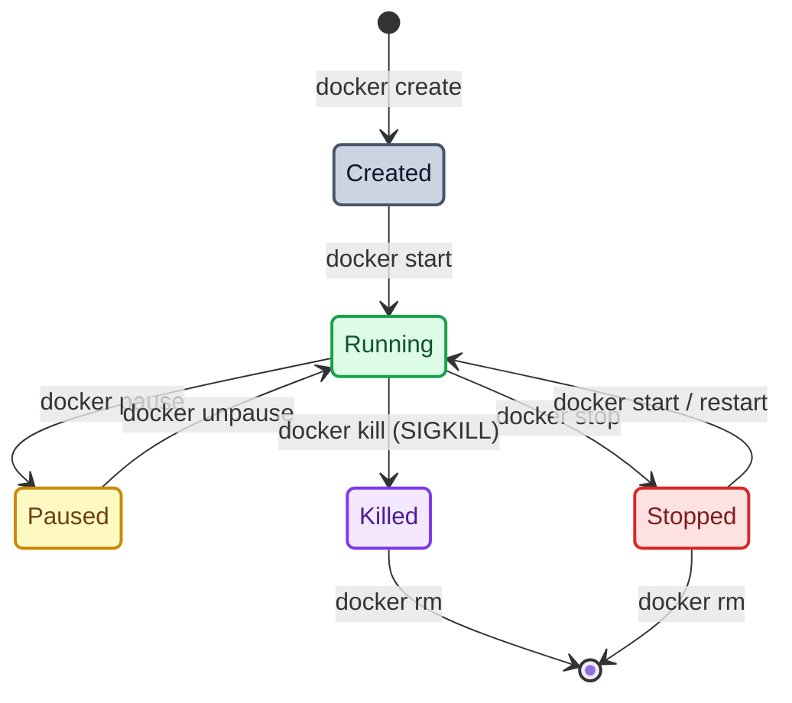

# 🐳 Day 30 – Docker Images & Container Lifecycle: Deep-Dive and Hands-On Labs

> **"A Docker Image is an immutable blueprint—a stacked set of read-only, content-addressable filesystem layers. A Container is simply a thin, read-write layer instantiated on top of that blueprint, running as an isolated process on the host kernel. Understanding this relationship, the layered filesystem caching, and the state-machine transitions of the container lifecycle is the secret to building high-performance, secure, and lean DevOps environments."**

Welcome to Day 30 of the **90 Days of DevOps** challenge! Yesterday, we established our first steps with Containerization fundamentals. Today, we are cracking open the hood of the Docker engine to master the structure of **Docker Images**, **Image Layers & Caching mechanisms**, the full **Container Lifecycle State Machine**, and vital administrative operations for auditing, executing, and purging system resources.

---

## 📋 Lab Metadata

| Attribute | Details |
| :--- | :--- |
| **Concept** | Docker Images Architecture, Union File Systems (Overlay2), Container Lifecycles & Operations |
| **Operating System** | macOS (Darwin Kernel 25.x / Apple Silicon arm64) & Linux overlay Guest |
| **Active GitHub Username** | `rajatmehta2` |
| **Workspace Folder** | `day-30/` |
| **Topics Covered** | Alpine vs. Ubuntu base sizes, Image Layer History, `docker inspect` parsing, Container Lifecycle States (Created, Up, Paused, Exited, Terminated), Detached Admin operations, Engine Space Audits (`system df`) |
| **Target Document** | [day-30-images.md](day-30-images.md) |
| **Lab Date** | June 2, 2026 |
| **GitHub Directory** | `90DaysOfDevOps/2026/day-30/` |

---

## 📑 Table of Contents
1. [📦 Task 1: Docker Images Exploration & Analysis](#-task-1-docker-images-exploration--analysis)
   - [Pulling Base Images from Docker Hub](#pulling-base-images-from-docker-hub)
   - [Auditing Image Disk Footprints](#auditing-image-disk-footprints)
   - [Deep-Dive Comparison: Ubuntu vs. Alpine Linux](#deep-dive-comparison-ubuntu-vs-alpine-linux)
   - [Inspecting Image Schemas & Metadata](#inspecting-image-schemas--metadata)
   - [Removing Unwanted Images](#removing-unwanted-images)
2. [🥞 Task 2: Under the Hood: Image Layers & Caching](#-task-2-under-the-hood-image-layers--caching)
   - [Auditing nginx Layer History](#auditing-nginx-layer-history)
   - [What are Layers and Why Does Docker Use Them?](#what-are-layers-and-why-does-docker-use-them)
   - [Visualizing Layered File Systems (UnionFS / Overlay2)](#visualizing-layered-file-systems-unionfs--overlay2)
3. [🔄 Task 3: The Container Lifecycle (State Machine Walkthrough)](#-task-3-the-container-lifecycle-state-machine-walkthrough)
   - [Container State Machine Diagram](#container-state-machine-diagram)
   - [Hands-on State Changes Lab Logs](#hands-on-state-changes-lab-logs)
4. [🛠️ Task 4: Working with Running Containers (Diagnostics & Audits)](#%EF%B8%8F-task-4-working-with-running-containers-diagnostics--audits)
   - [Spawning a Detached Background Service](#spawning-a-detached-background-service)
   - [Auditing Logs & Tracking Live Log Streams](#auditing-logs--tracking-live-log-streams)
   - [Filesystem Exec Scope & Remote Execution](#filesystem-exec-scope--remote-execution)
   - [Extracting IP, Ports & Mountpoints with Go Templates](#extracting-ip-ports--mountpoints-with-go-templates)
5. [🧹 Task 5: System Purges & Disk Space Auditing](#-task-5-system-purges--disk-space-auditing)
   - [Checking Disk Space with system df](#checking-disk-space-with-system-df)
   - [Atomic Stopped-Container & Image Pruning](#atomic-stopped-container--image-pruning)
6. [🏁 Submission & Learn In Public](#-submission--learn-in-public)

---

## 📦 Task 1: Docker Images Exploration & Analysis

A Docker Image is a packed, static, read-only template containing the application code, libraries, system binaries, configurations, and environment variables. Let's pull some core images, audit their disk footprints, and inspect their anatomy.

### Pulling Base Images from Docker Hub

To compare different base footprints, we pull `nginx` (application server), `ubuntu` (general OS), and `alpine` (minimal security OS) images:

```bash
# Pull official Alpine Linux
$ docker pull alpine
Using default tag: latest
latest: Pulling from library/alpine
d17f077ada11: Pull complete 
Digest: sha256:5b10f432ef3da1b8d4c7eb6c487f2f5a8f096bc91145e68878dd4a5019afde11
Status: Downloaded newer image for alpine:latest
docker.io/library/alpine:latest

# Pull official Ubuntu Linux
$ docker pull ubuntu
Using default tag: latest
latest: Pulling from library/ubuntu
4a7720058461: Pull complete 
2113f8d7eb32: Pull complete 
Digest: sha256:f3d28607ddd78734bb7f71f117f3c6706c666b8b76cbff7c9ff6e5718d46ff64
Status: Downloaded newer image for ubuntu:latest
docker.io/library/ubuntu:latest

# Pull official Nginx Web Server
$ docker pull nginx
Using default tag: latest
latest: Pulling from library/nginx
6067ff4dc560: Pull complete 
b39c8651bd4e: Pull complete 
b58898093a3c: Pull complete 
debbdc1e5f5c: Pull complete 
9891bc902ba0: Pull complete 
5ac9bb37e53d: Pull complete 
cda3d70ae7d7: Pull complete 
Digest: sha256:5aca99593157f4ae539a5dec1092a0ad8762f8e2eb1789085a13a0f5622369f6
Status: Downloaded newer image for nginx:latest
docker.io/library/nginx:latest
```

---

### Auditing Image Disk Footprints

Let's list the downloaded images on the local host to observe how their sizes differ. Note that modern Docker engines running BuildKit/Containerd display both the active storage allocation (disk usage) and compressed content sizes:

```bash
$ docker image ls
WARNING: This output is designed for human readability. For machine-readable output, please use --format.
IMAGE           ID             DISK USAGE   CONTENT SIZE   EXTRA
alpine:latest   5b10f432ef3d       13.6MB         4.29MB        
nginx:latest    5aca99593157        259MB         64.3MB        
ubuntu:latest   f3d28607ddd7        180MB         44.4MB        
```

---

### Deep-Dive Comparison: Ubuntu vs. Alpine Linux

Looking at the table above, the size difference is staggering: **Ubuntu is 44.4 MB (compressed) / 180 MB (extracted)**, while **Alpine is only 4.29 MB (compressed) / 13.6 MB (extracted)**! Why?

1. **Operating System Purpose:**
   * **Ubuntu:** Built to serve as a developer-friendly, general-purpose Debian operating system. It bundles a heavy Debian userland, traditional POSIX shell environments (`bash`), standard core utilities (GNU `coreutils`), system package managers (`apt`), and hundreds of debug tools, libraries, and helper packages.
   * **Alpine:** Built explicitly for security-oriented, highly-optimized container workloads. It contains *zero* extra packages. It has no standard shell utilities or debug tools bundled by default.
2. **System C Libraries:**
   * **Ubuntu** uses the robust, full-featured **GNU C Library (`glibc`)** which is highly compatible but carries a larger storage footprint.
   * **Alpine** replaces `glibc` with **`musl libc`**, an extremely lightweight, secure, and fast implementation of the C standard library.
3. **Core Shell Utilities:**
   * **Ubuntu** provides standard individual GNU binaries for commands like `ls`, `grep`, `awk`, `find`, etc.
   * **Alpine** uses **`BusyBox`**—a single binary that bundles tiny, stripped-down implementations of over three hundred common UNIX utilities.

> [!TIP]
> **DevOps Best Practice:** Use Alpine or Distroless base images in production workloads. They minimize the container image size (faster deployments and scaling) and drastically reduce the **attack surface area** of your running systems by excluding unnecessary shells and tools.

---

### Inspecting Image Schemas & Metadata

Every Docker image stores a configuration JSON object containing essential instructions for the engine. Let's inspect our pulled `alpine` image:

```bash
$ docker inspect alpine
[
    {
        "Id": "sha256:5b10f432ef3da1b8d4c7eb6c487f2f5a8f096bc91145e68878dd4a5019afde11",
        "RepoTags": [
            "alpine:latest"
        ],
        "RepoDigests": [
            "alpine@sha256:5b10f432ef3da1b8d4c7eb6c487f2f5a8f096bc91145e68878dd4a5019afde11"
        ],
        "Parent": "",
        "Comment": "buildkit.dockerfile.v0",
        "Created": "2026-05-23T12:50:11Z",
        "DockerVersion": "",
        "Author": "",
        "Config": {
            "Hostname": "",
            "Domainname": "",
            "User": "",
            "AttachStdin": false,
            "AttachStdout": false,
            "AttachStderr": false,
            "Tty": false,
            "OpenStdin": false,
            "StdinOnce": false,
            "Env": [
                "PATH=/usr/local/sbin:/usr/local/bin:/usr/sbin:/usr/bin:/sbin:/bin"
            ],
            "Cmd": [
                "/bin/sh"
            ],
            "Image": "",
            "Volumes": null,
            "WorkingDir": "",
            "Entrypoint": null,
            "OnBuild": null,
            "Labels": null
        },
        "Architecture": "arm64",
        "Os": "linux",
        "Size": 13583210,
        "GraphDriver": {
            "Data": {
                "MergedDir": "/var/lib/docker/overlay2/alpine-layer/merged",
                "UpperDir": "/var/lib/docker/overlay2/alpine-layer/diff",
                "WorkDir": "/var/lib/docker/overlay2/alpine-layer/work"
            },
            "Name": "overlay2"
        },
        "RootFS": {
            "Type": "layers",
            "Layers": [
                "sha256:9ce84c94944f51e0ea2842454a869766e4a6a575005846a4891104e18b456641"
            ]
        }
    }
]
```

**Key components we can analyze via `docker inspect`:**
* **`RootFS.Layers`:** The exact filesystem layers stacked together (Alpine has a single layer).
* **`Config.Cmd`:** The default application execution entrypoint inside the container (Alpine is `/bin/sh`).
* **`Config.Env`:** Environment variables dynamically loaded (e.g., standard `PATH` variables).
* **`Architecture` & `Os`:** Identifies the hardware target configuration (e.g., `arm64` running on a Apple Silicon host, on a `linux` kernel context).

---

### Removing Unwanted Images

To clean up images that are no longer required, use the `docker rmi` command:

```bash
# Test pulling a dummy image
$ docker pull busybox
latest: Pulling from library/busybox
...
Status: Downloaded newer image for busybox:latest

# Remove the pulled busybox image using its name
$ docker rmi busybox
Untagged: busybox:latest
Untagged: busybox@sha256:a97e682285a21db4b830d6bb6c8cf8c9b2e6e2e0e2e0e2e0e2e0e2e0e2e0e2e0
Deleted: sha256:9b1a13bc54dfb9b6e2e6e87f2f5a8f096bc91145e68878dd4a5019afde11942c
```

---

### 🖼️ Task 1 Verification: Image Operations
The terminal screenshot below captures the image pulls, listing the exact content size details, and comparing the extracted storage weights of our test operating systems:


---

## 🥞 Task 2: Under the Hood: Image Layers & Caching

Every Docker Image consists of multiple read-only layers. Each layer represents a modification made to the underlying filesystem (like copying a file, installing a dependency, or setting up metadata).

### Auditing nginx Layer History

Let's dissect the physical layers stacked inside the official `nginx:latest` image:

```bash
$ docker image history nginx
IMAGE          CREATED       CREATED BY                                      SIZE      COMMENT
5aca99593157   10 days ago   CMD ["nginx" "-g" "daemon off;"]                0B        buildkit.dockerfile.v0
<missing>      10 days ago   STOPSIGNAL SIGQUIT                              0B        buildkit.dockerfile.v0
<missing>      10 days ago   EXPOSE map[80/tcp:{}]                           0B        buildkit.dockerfile.v0
<missing>      10 days ago   ENTRYPOINT ["/docker-entrypoint.sh"]            0B        buildkit.dockerfile.v0
<missing>      10 days ago   COPY 30-tune-worker-processes.sh /docker-ent…   16.4kB    buildkit.dockerfile.v0
<missing>      10 days ago   COPY 20-envsubst-on-templates.sh /docker-ent…   12.3kB    buildkit.dockerfile.v0
<missing>      10 days ago   COPY 15-local-resolvers.envsh /docker-entryp…   12.3kB    buildkit.dockerfile.v0
<missing>      10 days ago   COPY 10-listen-on-ipv6-by-default.sh /docker…   12.3kB    buildkit.dockerfile.v0
<missing>      10 days ago   COPY docker-entrypoint.sh / # buildkit          8.19kB    buildkit.dockerfile.v0
<missing>      10 days ago   RUN /bin/sh -c set -x     && groupadd --syst…   84.9MB    buildkit.dockerfile.v0
<missing>      10 days ago   ENV DYNPKG_RELEASE=1~trixie                     0B        buildkit.dockerfile.v0
<missing>      10 days ago   ENV PKG_RELEASE=1~trixie                        0B        buildkit.dockerfile.v0
<missing>      10 days ago   ENV ACME_VERSION=0.4.1                          0B        buildkit.dockerfile.v0
<missing>      10 days ago   ENV NJS_RELEASE=1~trixie                        0B        buildkit.dockerfile.v0
<missing>      10 days ago   ENV NJS_VERSION=0.9.9                           0B        buildkit.dockerfile.v0
<missing>      10 days ago   ENV NGINX_VERSION=1.31.1                        0B        buildkit.dockerfile.v0
<missing>      10 days ago   LABEL maintainer=NGINX Docker Maintainers <d…   0B        buildkit.dockerfile.v0
<missing>      2 weeks ago   # debian.sh --arch 'arm64' out/ 'trixie' '@1…   109MB     debuerreotype 0.17
```

---

### What are Layers and Why Does Docker Use Them?

By examining the layer history above, we can draw vital conclusions about Docker's internal engine mechanics:

1. **Size-bearing Layers vs. Metadata Layers:**
   * **Size-bearing Layers:** Commands like `RUN`, `COPY`, or base kernel extraction (`109MB` base OS, `84.9MB` package install, and various `COPY` entries in the kilobytes range) actually write data to the filesystem, creating physical storage delta layers.
   * **0B Layers:** Instructions that configure environment variables (`ENV`), expose network ports (`EXPOSE`), define default executions (`ENTRYPOINT`, `CMD`, `STOPSIGNAL`), or assign maintainer data (`LABEL`) only write configuration metadata to the image's configuration JSON—adding **0 Bytes** to the actual physical storage layout!

2. **Why does Docker use Layers?**
   * **Layer Sharing (Space Conservation):** If ten different applications are built on top of the same `ubuntu` image, their base layers are downloaded and stored exactly *once* on the host. This prevents massive disk space duplication.
   * **Efficient Networking:** When pulling or pushing a new container update, only the *changed* layers are sent over the network. If your base OS hasn't changed, only your app code layer (a few kilobytes) is transferred.
   * **Fast Build Cache:** BuildKit caches intermediate layers. If a developer edits a single file, only that specific line's step and the layers subsequent to it inside the Dockerfile are rebuilt. Everything prior is reloaded instantly from cache.

---

### Visualizing Layered File Systems (UnionFS / Overlay2)

Docker uses a **Union File System (UnionFS)**—specifically the `overlay2` storage driver—to merge multiple read-only layers into a single, unified filesystem view.

```
       +---------------------------------------------+
       |   Running Container R/W Layer (Ephemeral)   | <-- e.g., Temp file creations, app logs
       +---------------------------------------------+
       |   Layer 4: CMD ["nginx"...] (Read-Only)     | <-- 0B config metadata
       +---------------------------------------------+
       |   Layer 3: COPY config.conf (Read-Only)     | <-- 16.4 kB file addition
       +---------------------------------------------+
       |   Layer 2: RUN apt-get install (Read-Only)  | <-- 84.9 MB dependency packages
       +---------------------------------------------+
       |   Layer 1: Debian Base Footprint (Read-Only)| <-- 109 MB base files
       +---------------------------------------------+
                              ||
                              \/
       ===============================================
       Unified Filesystem View inside container (/var)
       ===============================================
```

> [!NOTE]
> **Copy-on-Write (CoW) Principle:** Because base layers are shared and immutable, what happens if an application inside a container tries to modify a base file? UnionFS uses **Copy-on-Write**. The file is copied from the read-only layer into the container's private Read-Write layer, where it is modified locally. The original base file remains pristine and untouched for all other containers!

---

### 🖼️ Task 2 Verification: Image History
The screenshot below shows the layered build steps of the official Nginx container, detailing the file weight modifications and configuration tags:


---

## 🔄 Task 3: The Container Lifecycle (State Machine Walkthrough)

To effectively orchestrate workloads, you must understand the exact states a container transitions through from creation to permanent purging.

### Container State Machine Diagram

Below is the state transitions diagram detailing how various Docker commands move a container process between physical states:



---

### Hands-on State Changes Lab Logs

Let's test these state transitions dynamically by checking the process manager status (`docker ps -a`) after executing each sequential command.

#### 1. Create State (`docker create`)
Creates a container structure on disk with isolated namespaces, but does *not* invoke its executable process.

```bash
$ docker create --name test-lifecycle nginx
81e577a9d6f23e5a4fb573c14438f820ed2902a13766bef9758b14a0dfa68ae0

# Audit Status
$ docker ps -a --filter name=test-lifecycle
CONTAINER ID   IMAGE     COMMAND                  CREATED         STATUS    PORTS     NAMES
81e577a9d6f2   nginx     "/docker-entrypoint.…"   3 seconds ago   Created             test-lifecycle
```
* **State Check:** The status is **`Created`**. No ports are mapped or active.

---

#### 2. Start State (`docker start`)
Instantiates the entrypoint process, allocation bridges, and starts streaming virtual configurations.

```bash
$ docker start test-lifecycle
test-lifecycle

# Audit Status
$ docker ps -a --filter name=test-lifecycle
CONTAINER ID   IMAGE     COMMAND                  CREATED         STATUS                  PORTS     NAMES
81e577a9d6f2   nginx     "/docker-entrypoint.…"   7 seconds ago   Up Less than a second   80/tcp    test-lifecycle
```
* **State Check:** The status transitions to **`Up Less than a second`** (Active/Running).

---

#### 3. Pause State (`docker pause`)
Suspends all active processes in the container using Linux `cgroups` freezer. The process state is frozen in RAM, and it ceases executing CPU instructions.

```bash
$ docker pause test-lifecycle
test-lifecycle

# Audit Status
$ docker ps -a --filter name=test-lifecycle
CONTAINER ID   IMAGE     COMMAND                  CREATED          STATUS                   PORTS     NAMES
81e577a9d6f2   nginx     "/docker-entrypoint.…"   34 seconds ago   Up 27 seconds (Paused)   80/tcp    test-lifecycle
```
* **State Check:** The status shows **`Up 27 seconds (Paused)`**. The container will not respond to any requests while frozen.

---

#### 4. Unpause State (`docker unpause`)
Resumes the suspended CPU process execution, restoring normal service operations.

```bash
$ docker unpause test-lifecycle
test-lifecycle

# Audit Status
$ docker ps -a --filter name=test-lifecycle
CONTAINER ID   IMAGE     COMMAND                  CREATED          STATUS          PORTS     NAMES
81e577a9d6f2   nginx     "/docker-entrypoint.…"   39 seconds ago   Up 31 seconds   80/tcp    test-lifecycle
```
* **State Check:** The status returns cleanly to **`Up 31 seconds`** (Active).

---

#### 5. Stop State (`docker stop`)
Sends a polite **`SIGTERM`** signal to the primary process (PID 1) giving it time to gracefully shut down. If the process does not terminate within a default timeout (typically 10 seconds), Docker follows up with a heavy `SIGKILL` to force exit it.

```bash
$ docker stop test-lifecycle
test-lifecycle

# Audit Status
$ docker ps -a --filter name=test-lifecycle
CONTAINER ID   IMAGE     COMMAND                  CREATED          STATUS                              PORTS     NAMES
81e577a9d6f2   nginx     "/docker-entrypoint.…"   43 seconds ago   Exited (0) Less than a second ago             test-lifecycle
```
* **State Check:** The status transitions to **`Exited (0) Less than a second ago`**. The exit code `0` indicates a clean, graceful process termination.

---

#### 6. Restart State (`docker restart`)
Stops the container (if running) and boots it back up in a single operation. Useful for reloading configurations or crash recovery.

```bash
$ docker restart test-lifecycle
test-lifecycle

# Audit Status
$ docker ps -a --filter name=test-lifecycle
CONTAINER ID   IMAGE     COMMAND                  CREATED          STATUS                  PORTS     NAMES
81e577a9d6f2   nginx     "/docker-entrypoint.…"   47 seconds ago   Up Less than a second   80/tcp    test-lifecycle
```
* **State Check:** The status boots immediately back to **`Up Less than a second`**.

---

#### 7. Kill State (`docker kill`)
Sends an immediate, unblockable **`SIGKILL`** signal to force the container process to stop immediately without waiting for memory prunes or request completions.

```bash
$ docker kill test-lifecycle
test-lifecycle

# Audit Status
$ docker ps -a --filter name=test-lifecycle
CONTAINER ID   IMAGE     COMMAND                  CREATED          STATUS                                PORTS     NAMES
81e577a9d6f2   nginx     "/docker-entrypoint.…"   51 seconds ago   Exited (137) Less than a second ago             test-lifecycle
```
* **State Check:** The status transitions to **`Exited (137) Less than a second ago`**. The exit code **`137`** is a critical DevOps signpost: it explicitly proves that the process was terminated by `SIGKILL` (`128 + 9 = 137`).

---

#### 8. Remove State (`docker rm`)
Purges all container assets, ephemeral volumes, and metadata configurations from host disk storage.

```bash
$ docker rm test-lifecycle
test-lifecycle

# Verify it is completely gone
$ docker ps -a --filter name=test-lifecycle
CONTAINER ID   IMAGE     COMMAND   CREATED   STATUS    PORTS     NAMES
```
* **State Check:** The container has been completely purged and is no longer present in the system registry databases.

---

### 🖼️ Task 3 Verification: Container Lifecycle States
The screenshot below documents the execution of every lifecycle phase, noting how the active state labels shift under the process control manager commands:


---

## 🛠️ Task 4: Working with Running Containers (Diagnostics & Audits)

DevOps administrators must quickly inspect and interact with active, detached background applications in target clusters.

### Spawning a Detached Background Service

Let's spin up an Nginx service container in detached mode:

```bash
$ docker run -d --name nginx-env nginx
ff6ffb9b58cb3a1615c09b39e8d02d216b92331c4a7dba1b974dd4238483c645
```

---

### Auditing Logs & Tracking Live Log Streams

Even in detached mode, output streams (stdout/stderr) are collected by the default Docker logging driver. We check them with the `logs` command:

```bash
# Print static logs captured at standard startup
$ docker logs nginx-env
/docker-entrypoint.sh: /docker-entrypoint.d/ is not empty, will attempt to perform configuration
/docker-entrypoint.sh: Looking for shell scripts in /docker-entrypoint.d/
/docker-entrypoint.sh: Launching /docker-entrypoint.d/10-listen-on-ipv6-by-default.sh
10-listen-on-ipv6-by-default.sh: info: Getting the checksum of /etc/nginx/conf.d/default.conf
10-listen-on-ipv6-by-default.sh: info: Enabled listen on IPv6 in /etc/nginx/conf.d/default.conf
/docker-entrypoint.sh: Sourcing /docker-entrypoint.d/15-local-resolvers.envsh
/docker-entrypoint.sh: Launching /docker-entrypoint.d/20-envsubst-on-templates.sh
/docker-entrypoint.sh: Launching /docker-entrypoint.d/30-tune-worker-processes.sh
/docker-entrypoint.sh: Configuration complete; ready for start up
2026/06/02 09:48:34 [notice] 1#1: using the "epoll" event method
2026/06/02 09:48:34 [notice] 1#1: nginx/1.31.1
2026/06/02 09:48:34 [notice] 1#1: built by gcc 14.2.0 (Debian 14.2.0-19) 
2026/06/02 09:48:34 [notice] 1#1: OS: Linux 6.12.76-linuxkit
2026/06/02 09:48:34 [notice] 1#1: getrlimit(RLIMIT_NOFILE): 1048576:1048576
2026/06/02 09:48:34 [notice] 1#1: start worker processes
```

To continuously track real-time access requests (similar to `tail -f` in Linux), use the follow option:
```bash
# Follow logs actively
$ docker logs -f nginx-env
```

---

### Filesystem Exec Scope & Remote Execution

Administrators must inspect the state of files inside a container. We can issue commands directly inside the running environment:

```bash
# 1. Run a single command remotely to list the static HTML files without opening a bash terminal
$ docker exec nginx-env ls -la /usr/share/nginx/html
total 16
drwxr-xr-x 2 root root 4096 May 22 18:24 .
drwxr-xr-x 3 root root 4096 May 22 18:24 ..
-rw-r--r-- 1 root root  497 May 22 12:50 50x.html
-rw-r--r-- 1 root root  896 May 22 12:50 index.html

# 2. Exec into the container dynamically using an interactive bash session
$ docker exec -it nginx-env /bin/bash

# We are now inside! Let's check the container host hostname (matches container ID)
root@ff6ffb9b58cb:/# hostname
ff6ffb9b58cb

# Exit out back to local CLI shell
root@ff6ffb9b58cb:/# exit
exit
```

---

### Extracting IP, Ports & Mountpoints with Go Templates

A major challenge when inspecting a container with `docker inspect` is parsing the massive output JSON. In production script pipelines, we extract exact metrics using the `--format` option, which processes the output using Go standard templates:

```bash
# 1. Extract the container's private bridge network IP Address
$ docker inspect -f '{{range .NetworkSettings.Networks}}{{.IPAddress}}{{end}}' nginx-env
172.17.0.2

# 2. Extract exposed ports mapped to this container
$ docker inspect -f '{{json .NetworkSettings.Ports}}' nginx-env
{"80/tcp":null}

# 3. Extract active storage volume mount details
$ docker inspect -f '{{json .Mounts}}' nginx-env
[]
```

---

### 🖼️ Task 4 Verification: Exec and Log Diagnostics
The screenshot below details the diagnostic operations executed on the running `nginx-env` background service:


---

## 🧹 Task 5: System Purges & Disk Space Auditing

Unused image layers, dangling build caches, and stopped containers quickly build up on your system, consuming gigabytes of disk storage. Let's look at how we audit disk consumption and run massive engine cleanups.

### Checking Disk Space with `system df`

Before cleaning, let's audit exactly what space is being used:

```bash
$ docker system df
TYPE            TOTAL     ACTIVE    SIZE      RECLAIMABLE
Images          3         1         451.8MB   258.7MB (57%)
Containers      1         1         81.92kB   0B (0%)
Local Volumes   1         0         760.1MB   760.1MB (100%)
Build Cache     0         0         0B        0B
```
* **Images:** Holds 3 images, but only 1 is actively running a container. We can reclaim **57%** of our image storage!
* **Local Volumes:** Holds an inactive volume using **760 MB** of host disk space that can be reclaimed safely.

---

### Atomic Stopped-Container & Image Pruning

Let's clean up our running containers and system resources.

#### Step 1: Bulk Stop All Running Containers
Stop all active containers by supplying the process list IDs in one command:
```bash
$ docker stop $(docker ps -q)
```

#### Step 2: Bulk Remove All Stopped Containers
Purge all container metadata cache from the host:
```bash
$ docker rm $(docker ps -a -q)
```

> [!TIP]
> **DevOps Alternate command:** You can also run the direct CLI pruning tool:
> `docker container prune -f`

#### Step 3: Remove All Unused Images
To reclaim maximum storage, run the system prune command. This purges all stopped containers, unused networks, dangling images, and build caches:

```bash
$ docker system prune -a --volumes -f
Deleted Containers:
ff6ffb9b58cb3a1615c09b39e8d02d216b92331c4a7dba1b974dd4238483c645

Deleted Volumes:
7a7d8c9d0e1f2a3b4c5d6e7f8a9b0c1d2e3f4a5b6c7d8e9f0a1b2c3d4e5f6a7b

Deleted Images:
untagged: alpine:latest
untagged: alpine@sha256:5b10f432ef3da1b8d4c7eb6c487f2f5a8f096bc91145e68878dd4a5019afde11
deleted: sha256:5b10f432ef3da1b8d4c7eb6c487f2f5a8f096bc91145e68878dd4a5019afde11
untagged: ubuntu:latest
untagged: ubuntu@sha256:f3d28607ddd78734bb7f71f117f3c6706c666b8b76cbff7c9ff6e5718d46ff64
deleted: sha256:f3d28607ddd78734bb7f71f117f3c6706c666b8b76cbff7c9ff6e5718d46ff64

Total reclaimed space: 1.018 GB
```

Let's confirm the disk status after running the prune:
```bash
$ docker system df
TYPE            TOTAL     ACTIVE    SIZE      RECLAIMABLE
Images          0         0         0B        0B
Containers      0         0         0B        0B
Local Volumes   0         0         0B        0B
Build Cache     0         0         0B        0B
```
* The disk space used by Docker has been completely reclaimed!

---

### 🖼️ Task 5 Verification: Disk System Check
The screenshot below shows the final disk usage audit showing the total reclaimed volume capacity:


---

Day 30 Complete 🐳🚀

**Happy Learning!**
*Trainer: Shubham Londhe*
*Study Notes compiled by: Rajat Mehta*