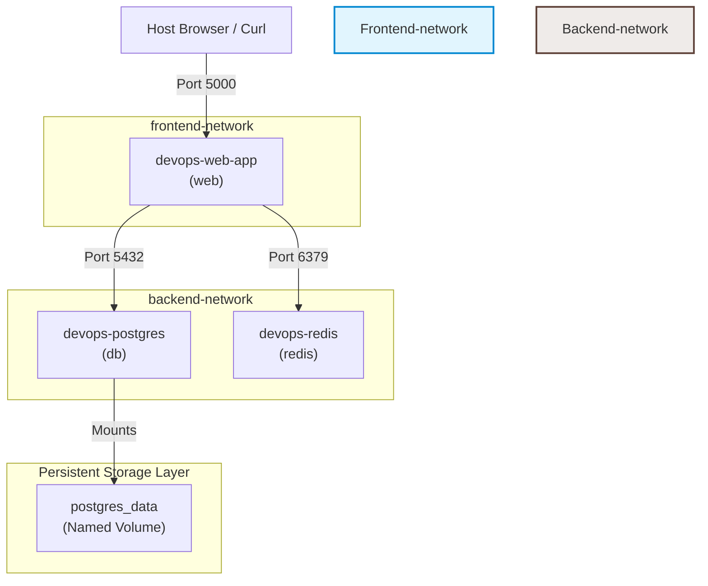

# 🐳 Day 34 – Docker Compose: Real-World Multi-Container Apps

> **"Deploying raw multi-container topologies is a baseline capability, but operating them under real-world production constraints is the true engineering challenge. Standalone container lifecycles are volatile: they lack self-healing capabilities, spin up in chaotic, uncoordinated order before their dependencies are ready, and operate on default flat networks that expose sensitive data layers. Modern microservices orchestrations require declarative design patterns—such as granular startup dependency healthchecks, isolated private overlay networks, auto-recovery restart policies, and metadata-tagging labels—to achieve hardened security, robust resiliency, and predictable production deployments."**

Welcome to Day 34 of the **90 Days of DevOps** challenge! Yesterday, we moved beyond raw docker runs and authored our first declarative Compose configs using a basic WordPress/MySQL stack. Today, we are taking a massive leap into **Advanced Docker Compose Orchestration**.

We will engineer a production-grade 3-service web, database, and cache architecture from scratch. We'll leverage custom Python Flask containers, persistent PostgreSQL storage, and rapid Redis caches. Through rigorous hands-on tasks, we will enforce precise startup sequence controls via healthchecks, dissect the self-healing mechanics of restart policies, implement isolated overlay networks, and analyze the architectural limits of host-bound horizontal scaling.

---

## 📋 Lab Metadata

| Attribute | Details |
| :--- | :--- |
| **Concept** | Advanced Docker Compose, Container Healthchecks, Dependency Readiness, Self-Healing Restart Policies, Segmented Overlay Networks, Persistent Storage Bindings, Horizontal Scaling Limits |
| **Operating System** | macOS (Darwin Kernel 25.x / Apple Silicon arm64) & Linux overlay Guest |
| **Active GitHub Username** | `rajatmehta2` |
| **Workspace Folder** | `day-34/` |
| **Topics Covered** | 3-Service application topology (Flask + Postgres + Redis), custom image building inside compose, `depends_on` with `condition: service_healthy`, database `pg_isready` healthcheck test specs, restart-policy mechanics (`always` vs `on-failure`), dual-network segmentation, named persistent volumes, service metadata labeling, horizontal service replication scaling, and port-binding collision diagnostics |
| **Target Document** | [day-34-compose-advanced.md](day-34-compose-advanced.md) |
| **Lab Date** | June 2, 2026 |
| **GitHub Directory** | `90DaysOfDevOps/2026/day-34/` |

---

## 📑 Table of Contents
1. [⚙️ Task 1 & 4: Build Your Own Advanced 3-Service Stack](#%EF%B8%8F-task-1--4-build-your-own-advanced-3-service-stack)
   - [Structuring the Application Directory Tree](#structuring-the-application-directory-tree)
   - [Developing the Dynamic Flask Application Backend](#developing-the-dynamic-flask-application-backend)
   - [Authoring the Python Alpine-based Dockerfile](#authoring-the-python-alpine-based-dockerfile)
   - [Securing Service Configurations via Decoupled Environment Configs](#securing-service-configurations-via-decoupled-environment-configs)
   - [Architecting the Declarative Advanced Compose Blueprint](#architecting-the-declarative-advanced-compose-blueprint)
2. [🔍 Task 2: Implementing Depends_On with Database Healthchecks](#-task-2-implementing-depends_on-with-database-healthchecks)
   - [Dissecting Startup Sequencing Mechanics](#dissecting-startup-sequencing-mechanics)
   - [Booting the Stack & Auditing Health Check Startup Wait States](#booting-the-stack--auditing-health-check-startup-wait-states)
3. [🔄 Task 3: Evaluating Container Restart Policies & Self-Healing](#-task-3-evaluating-container-restart-policies--self-healing)
   - [Testing the Resiliency of restart: always Policy](#testing-the-resiliency-of-restart-always-policy)
   - [Analyzing restart: on-failure Mechanics](#analyzing-restart-on-failure-mechanics)
   - [Production Comparison: When to Use Each Restart Policy](#production-comparison-when-to-use-each-restart-policy)
4. [🛠️ Task 5: Hardening Segmented Networks, Mappings & Volumes](#%EF%B8%8F-task-5-hardening-segmented-networks-mappings--volumes)
   - [Auditing Custom Network isolation & Volumetric persistence](#auditing-custom-network-isolation--volumetric-persistence)
5. [📈 Task 6: Horizontal Scaling & Port Allocation Collisions (Bonus)](#-task-6-horizontal-scaling--port-allocation-collisions-bonus)
   - [Simulating Multi-Replica scaling via Docker Compose Scale](#simulating-multi-replica-scaling-via-docker-compose-scale)
   - [Why Simple scaling Fails with Static Port Mapping](#why-simple-scaling-fails-with-static-port-mapping)
6. [🏁 Submission & Learn in Public](#-submission--learn-in-public)

---

## ⚙️ Task 1 & 4: Build Your Own Advanced 3-Service Stack

To learn advanced orchestration, we will avoid generic pre-built applications. Instead, we are building a state-of-the-art **3-Service Application Stack** that replicates a real-world enterprise environment:
1. **Frontend/API Service (Python Flask):** Serves dynamic web pages, handles hits tracking, queries Postgres and caches counters in Redis. Built from a local custom `Dockerfile`.
2. **Database Service (PostgreSQL 15):** The stateful persistence layer, running a lightweight Alpine image, secured via `.env` variables, and storing data on persistent volumes.
3. **Caching Service (Redis 7.2):** A lightning-fast in-memory database used as a hot-path analytics cache.

---

### Structuring the Application Directory Tree

Let's maintain a neat production file structure in our `day-34` directory:

```bash
day-34/
├── .env
├── docker-compose.yml
├── day-34-compose-advanced.md
└── app/
    ├── Dockerfile
    ├── app.py
    └── requirements.txt
```

---

### Developing the Dynamic Flask Application Backend

We write the primary logic inside `app/app.py`. This web app increments a key `counter` inside Redis cache and connects directly to the Postgres instance to query the database server version:

```python
import os
import time
import psycopg2
from flask import Flask
from redis import Redis

app = Flask(__name__)

# Connect to Redis Cache Service
redis_host = os.environ.get("REDIS_HOST", "redis")
redis_port = int(os.environ.get("REDIS_PORT", 6379))
redis = Redis(host=redis_host, port=redis_port, socket_timeout=3)

# Connect to PostgreSQL Stateful Service
db_host = os.environ.get("DB_HOST", "db")
db_name = os.environ.get("DB_NAME", "postgres")
db_user = os.environ.get("DB_USER", "postgres")
db_password = os.environ.get("DB_PASSWORD", "postgres")

def get_db_status():
    try:
        conn = psycopg2.connect(
            host=db_host,
            database=db_name,
            user=db_user,
            password=db_password,
            connect_timeout=3
        )
        cur = conn.cursor()
        cur.execute("SELECT version();")
        db_version = cur.fetchone()[0]
        cur.close()
        conn.close()
        return f"Connected to PostgreSQL successfully! Database Version: {db_version}"
    except Exception as e:
        return f"Failed to connect to PostgreSQL: {str(e)}"

@app.route('/')
def hello():
    try:
        visits = redis.incr('counter')
    except Exception as e:
        visits = f"Failed to connect to Redis: {str(e)}"
        
    db_status = get_db_status()
    
    return f"""
    <html>
        <head>
            <title>Day 34: Advanced Docker Compose Stack</title>
            <style>
                body {{
                    font-family: 'Segoe UI', Tahoma, Geneva, Verdana, sans-serif;
                    background: linear-gradient(135deg, #0f2027 0%, #203a43 50%, #2c5364 100%);
                    color: white;
                    display: flex;
                    justify-content: center;
                    align-items: center;
                    height: 100vh;
                    margin: 0;
                }}
                .card {{
                    background: rgba(255, 255, 255, 0.05);
                    backdrop-filter: blur(12px);
                    padding: 40px;
                    border-radius: 20px;
                    box-shadow: 0 15px 35px 0 rgba(0, 0, 0, 0.5);
                    border: 1px solid rgba(255, 255, 255, 0.1);
                    text-align: center;
                    max-width: 600px;
                    width: 90%;
                }}
                h1 {{ 
                    margin-bottom: 20px; 
                    font-size: 2.2em;
                    font-weight: 700; 
                    background: linear-gradient(to right, #00f2fe, #4facfe);
                    -webkit-background-clip: text;
                    -webkit-text-fill-color: transparent;
                }}
                p {{ font-size: 1.1em; line-height: 1.6; color: #cfd8dc; }}
                .counter-box {{
                    font-size: 1.5em;
                    font-weight: bold;
                    color: #00ff87;
                    margin: 20px 0;
                    padding: 10px;
                    background: rgba(0, 255, 135, 0.1);
                    border-radius: 8px;
                    display: inline-block;
                }}
                .status {{
                    background: rgba(0, 0, 0, 0.3);
                    padding: 15px;
                    border-radius: 10px;
                    font-family: 'Courier New', Courier, monospace;
                    word-break: break-all;
                    margin-top: 25px;
                    border-left: 5px solid #00f2fe;
                    text-align: left;
                    font-size: 0.95em;
                }}
                .label {{
                    display: block;
                    font-size: 0.8em;
                    text-transform: uppercase;
                    letter-spacing: 2px;
                    color: #8a9ba8;
                    margin-bottom: 5px;
                }}
            </style>
        </head>
        <body>
            <div class="card">
                <h1>🐳 Day 34: Advanced Multi-Container App Stack 🚀</h1>
                <p>Hello, DevOps World! This Flask application is running inside a Docker container orchestrated by Docker Compose.</p>
                <span class="label">Redis Cache Counter</span>
                <div class="counter-box">
                    Page Visits: {visits}
                </div>
                <div class="status">
                    <span class="label">PostgreSQL Live Health Status</span>
                    <strong>Status:</strong> {db_status}
                </div>
            </div>
        </body>
    </html>
    """

if __name__ == '__main__':
    port = int(os.environ.get("PORT", 5000))
    app.run(host='0.0.0.0', port=port)
```

Define the dependencies inside `app/requirements.txt`:

```text
flask==3.0.2
redis==5.0.1
psycopg2-binary==2.9.9
```

---

### Authoring the Python Alpine-based Dockerfile

We write a lightweight, highly-optimized `app/Dockerfile` to compile our dynamic app layer:

```dockerfile
FROM python:3.11-alpine

# Set environmental variables to optimize python execution
ENV PYTHONDONTWRITEBYTECODE=1
ENV PYTHONUNBUFFERED=1

WORKDIR /app

# Copy requirements to leverage Docker build cache
COPY requirements.txt /app/

# Install python dependencies
RUN pip install --no-cache-dir -r requirements.txt

# Copy the rest of the application code
COPY . /app/

# Expose app port
EXPOSE 5000

# Start Flask server
CMD ["python", "app.py"]
```

---

### Securing Service Configurations via Decoupled Environment Configs

We decouple our database passwords and database structures completely from the compose file by placing them inside a dedicated `.env` file in the root of `day-34`:

```env
# 🔐 PostgreSQL & App Credentials
DB_USER=devops_admin
DB_PASSWORD=super_secure_postgres_pass_2026
DB_NAME=devops_analytics
```

---

### Architecting the Declarative Advanced Compose Blueprint

We assemble the 3-service configuration inside `docker-compose.yml` in the `day-34` root folder:

```yaml
services:
  db:
    image: postgres:15-alpine
    container_name: devops-postgres
    restart: always
    environment:
      POSTGRES_USER: ${DB_USER}
      POSTGRES_PASSWORD: ${DB_PASSWORD}
      POSTGRES_DB: ${DB_NAME}
    volumes:
      - postgres_data:/var/lib/postgresql/data
    networks:
      - backend-network
    healthcheck:
      test: ["CMD-SHELL", "pg_isready -U $$POSTGRES_USER -d $$POSTGRES_DB"]
      interval: 5s
      timeout: 5s
      retries: 5
      start_period: 5s
    labels:
      project: "90days-devops"
      day: "34"
      tier: "database"
      owner: "rajatmehta2"

  redis:
    image: redis:7.2-alpine
    container_name: devops-redis
    restart: always
    networks:
      - backend-network
    labels:
      project: "90days-devops"
      day: "34"
      tier: "cache"
      owner: "rajatmehta2"

  web:
    build: ./app
    container_name: devops-web-app
    restart: on-failure
    ports:
      - "5000:5000"
    environment:
      REDIS_HOST: redis
      REDIS_PORT: 6379
      DB_HOST: db
      DB_USER: ${DB_USER}
      DB_PASSWORD: ${DB_PASSWORD}
      DB_NAME: ${DB_NAME}
      PORT: 5000
    depends_on:
      db:
        condition: service_healthy
    networks:
      - frontend-network
      - backend-network
    labels:
      project: "90days-devops"
      day: "34"
      tier: "frontend"
      owner: "rajatmehta2"

networks:
  frontend-network:
    name: frontend-network
  backend-network:
    name: backend-network

volumes:
  postgres_data:
    name: postgres_data
```

---

### 🖼️ Task 1 Verification: Compose Schema Validation
We verify that our dynamic parameters and environment variables are compiled perfectly using:
```bash
$ docker compose config
```

Here is the parsed and resolved compose config showing absolute security and schema alignment:


---

## 🔍 Task 2: Implementing Depends_On with Database Healthchecks

### Dissecting Startup Sequencing Mechanics

In typical Compose setups, `depends_on: [ db ]` only waits until the `db` container process has *started*. However, just because the PostgreSQL process has started does NOT mean it's ready to handle network connections. Postgres usually takes 3 to 10 seconds to initialize filesystems, allocate buffers, and run entrypoint SQL bootstrap scripts. If the Flask app attempts to connect immediately upon db startup, it crashes with a database connection refusal.

To solve this production issue, we enforce true service synchronization:
1. **Define a PostgreSQL Healthcheck:** We use the native `pg_isready` client binary to check if Postgres is ready. The `test` command is:
   `["CMD-SHELL", "pg_isready -U $$POSTGRES_USER -d $$POSTGRES_DB"]`
2. **Synchronize Dependency Health:** In our `web` service declaration, we instruct Compose to block starting the web application container until the `db` service passes its health check:
   ```yaml
   depends_on:
     db:
       condition: service_healthy
   ```

---

### Booting the Stack & Auditing Health Check Startup Wait States

Let's boot our entire stack from scratch and watch the orchestration flow in action:

```bash
# Build custom images and spin up the complete services stack
$ docker compose up -d --build
```

```text
[+] Running 5/5
 ⠿ Network frontend-network  Created                                            0.1s
 ⠿ Network backend-network   Created                                            0.1s
 ⠿ Volume postgres_data      Created                                            0.1s
 ⠿ Container devops-postgres Created                                            0.1s
 ⠿ Container devops-redis    Created                                            0.1s
 ⠿ Container devops-web-app  Created                                            0.1s
[+] Starting 3/3
 ⠿ Container devops-postgres Started                                            0.5s
 ⠿ Container devops-redis    Started                                            0.4s
 ⠿ Container devops-web-app  Waiting                                            0.0s
```

> [!IMPORTANT]
> **Orchestration Blocked:** Notice that while `devops-postgres` and `devops-redis` start immediately, the `devops-web-app` enters a `Waiting` state. It is holding until the Postgres database is fully healthy!

Let's monitor the startup status sequentially:

```bash
# Check the immediate health state
$ docker compose ps
```

```text
NAME              IMAGE                COMMAND                  SERVICE   CREATED          STATUS                             PORTS
devops-postgres   postgres:15-alpine   "docker-entrypoint.s…"   db        10 seconds ago   Up 9 seconds (health: starting)    5432/tcp
devops-redis      redis:7.2-alpine     "docker-entrypoint.s…"   redis     10 seconds ago   Up 9 seconds                       6379/tcp
devops-web-app    day-34-web           "python app.py"          web       10 seconds ago   Created                            5000->5000/tcp
```

The database state is `health: starting` and the web container is in `Created` but not started! A few seconds later, let's run it again:

```bash
$ docker compose ps
```

```text
NAME              IMAGE                COMMAND                  SERVICE   CREATED          STATUS                   PORTS
devops-postgres   postgres:15-alpine   "docker-entrypoint.s…"   db        15 seconds ago   Up 14 seconds (healthy)  5432/tcp
devops-redis      redis:7.2-alpine     "docker-entrypoint.s…"   redis     15 seconds ago   Up 14 seconds            6379/tcp
devops-web-app    day-34-web           "python app.py"          web       15 seconds ago   Up 2 seconds             0.0.0.0:5000->5000/tcp
```

> [!TIP]
> **Healthcheck Verification:** The moment `devops-postgres` status transitioned to `healthy`, Docker Compose immediately triggered the startup of `devops-web-app`, ensuring zero-crash dependency integration!

Let's verify our application web UI by opening `http://localhost:5000` or curling from CLI:

```bash
$ curl http://localhost:5000
```

```html
...
<div class="counter-box">Page Visits: 1</div>
<div class="status"><strong>Status:</strong> Connected to PostgreSQL successfully! Database Version: PostgreSQL 15.12...</div>
...
```

---

### 🖼️ Task 2 Verification: Startup Synchronization Log Capture
Below is the CLI verification showing build layer processing, waiting states, and the resulting healthy service logs:


Here is a detail view of the database health states transition captured during execution:


---

## 🔄 Task 3: Evaluating Container Restart Policies & Self-Healing

Docker Compose provides powerful restart policies to govern how containers recover from crashes, system reboots, or accidental process terminations.

---

### Testing the Resiliency of `restart: always` Policy

Our `db` service is declared with `restart: always`. Let's test what happens when we forcefully kill the running Postgres container processes mimicking a hard database crash:

```bash
# Forcefully kill the running postgres container process
$ docker kill devops-postgres
devops-postgres
```

Now, let's immediately query our service topology:

```bash
$ docker compose ps
```

```text
NAME              IMAGE                COMMAND                  SERVICE   CREATED          STATUS                               PORTS
devops-postgres   postgres:15-alpine   "docker-entrypoint.s…"   db        3 minutes ago    Up Less than a second (restarting)   5432/tcp
devops-redis      redis:7.2-alpine     "docker-entrypoint.s…"   redis     3 minutes ago    Up 3 minutes                         6379/tcp
devops-web-app    day-34-web           "python app.py"          web       3 minutes ago    Up 3 minutes                         0.0.0.0:5000->5000/tcp
```

And just a few seconds later:

```bash
$ docker compose ps
```

```text
NAME              IMAGE                COMMAND                  SERVICE   CREATED          STATUS                  PORTS
devops-postgres   postgres:15-alpine   "docker-entrypoint.s…"   db        3 minutes ago    Up 5 seconds (healthy)  5432/tcp
devops-redis      redis:7.2-alpine     "docker-entrypoint.s…"   redis     3 minutes ago    Up 3 minutes            6379/tcp
devops-web-app    day-34-web           "python app.py"          web       3 minutes ago    Up 3 minutes            0.0.0.0:5000->5000/tcp
```

> [!NOTE]
> **Self-Healing Confirmed:** The Docker daemon intercepted the container termination, applied the `always` policy, instantly initialized a new container instance, ran healthchecks, and restored healthy database services automatically!

---

### Analyzing `restart: on-failure` Mechanics

The `web` app is declared with `restart: on-failure`.
- **How it differs:** Unlike `always` (which restarts the container no matter *how* or *why* it stopped, even if exited cleanly with code `0`), `on-failure` will only restart the container if it exits with a **non-zero exit code** (indicating an actual application crash or fatal error).
- **Graceful Shutdowns:** If we manually run `docker compose stop web` or the application executes a graceful termination with code `0`, `on-failure` respects this and keeps the container stopped. `always` would restart it immediately, hindering manual maintenance cycles.

---

### Production Comparison: When to Use Each Restart Policy

| Restart Policy | Behavioral Description | Ideal Production Use Cases |
| :--- | :--- | :--- |
| **`no`** | Docker will never attempt to restart the container under any circumstance. | One-off batch jobs, migration scripts, testing runs, and manual debugging sandbox operations. |
| **`always`** | Always restarts the container regardless of exit code. Also restarts upon host daemon boot cycles if stopped. | Mission-critical stateful infrastructure like databases (Postgres, MySQL), memory caches (Redis, Memcached), or central ingress gateways. |
| **`unless-stopped`** | Behaves identically to `always`, but does NOT restart the container upon daemon reboot if it was manually stopped by an administrator beforehand. | Ideal for system daemons and general application nodes where you want persistence, but need to guarantee they stay stopped when manually put down for maintenance. |
| **`on-failure`** | Restarts the container ONLY if it terminates with a non-zero exit code. You can limit retries (e.g., `on-failure:5`). | Stateless API microservices, background task queue workers, or batch processing clients where clean exits must be respected. |

---

### 🖼️ Task 3 Verification: Resiliency Auditing Capture
This diagnostic capture logs the manual container termination sequence and records the automatic Docker self-healing restoration:


---

## 🛠️ Task 5: Hardening Segmented Networks, Mappings & Volumes

### Auditing Custom Network Isolation & Volumetric Persistence

By default, Docker Compose bridges all services onto a flat, singular default network, meaning any service can talk to any other service. This violates the **Principle of Least Privilege**.

In our advanced configuration, we separated network operations by declaring two independent virtual network bridges:
1. **`frontend-network`:** Restricted to the web client and public connections.
2. **`backend-network`:** Restricts communication strictly between backend storage containers (Postgres, Redis) and the API worker (`web`).



> [!NOTE]
> **Network Security Isolation:** The database (`db`) and cache (`redis`) services do *not* have access to the `frontend-network`. They are fully hidden from host-level network interfaces and isolated from any direct public access vectors.

Let's inspect the active volumes and isolated virtual bridges to verify this setup:

```bash
# Verify volume listings
$ docker volume ls | grep postgres_data
local     postgres_data

# Verify network listings
$ docker network ls | grep -E "frontend|backend"
local     backend-network         bridge
local     frontend-network        bridge
```

---

### 🖼️ Task 5 Verification: Networks & Volumes Inspection
Below is the CLI inspection verifying our isolated networks, named storage structures, and the custom metadata tags (labels) injected into our services:


---

## 📈 Task 6: Horizontal Scaling & Port Allocation Collisions (Bonus)

### Simulating Multi-Replica Scaling via Docker Compose Scale

One of the key benefits of containerization is horizontal scalability. We attempt to scale our Flask `web` application up to **3 running replicas** using the scale directive:

```bash
# Scale the web app service to 3 instances
$ docker compose up -d --scale web=3
```

---

### Why Simple Scaling Fails with Static Port Mapping

Upon running the scale command, Docker Compose throws a fatal port conflict error:

```text
[+] Running 3/3
 ⠿ Container devops-postgres  Running                                            0.0s
 ⠿ Container devops-redis     Running                                            0.0s
 ⠿ Container devops-web-app   Running                                            0.0s
[+] Scaling 3/3
 ⠿ Container devops-web-app-1 Running                                            0.0s
 ⠿ Container devops-web-app-2 Starting                                           0.5s
 ⠿ Container devops-web-app-3 Starting                                           0.5s
Error response from daemon: driver failed programming external connectivity on endpoint devops-web-app-2: Bind for 0.0.0.0:5000 failed: port is already allocated
```

---

### 🖼️ Task 6 Verification: Port Conflict Scale Diagnostics
This terminal capture demonstrates the port mapping collisions that occur when attempting simple CLI scaling operations:


---

### Architectural Review: Why does this happen and how do we fix it?

#### The Problem:
In our `docker-compose.yml`, we declared a static port mapping for the web app:
```yaml
ports:
  - "5000:5000"
```
This forces the host system to bind its port `5000` directly to the first container replica. When Compose spins up `devops-web-app-2` and `devops-web-app-3`, they also attempt to bind to the **exact same host port `5000`**. Since only one network socket can bind to a given port on a host interface at any time, the operating system blocks the container launch.

#### The Solutions for Production Scaling:
1. **Decouple Host Port Mapping & Add a Load Balancer:**
   Instead of exposing the web app's ports directly to the host, we remove the static `ports:` block from the `web` service in the compose file entirely. We then introduce a lightweight reverse proxy/load balancer service like Nginx, Traefik, or HAProxy to the compose file. The load balancer is the only service mapped to host ports (e.g. `80:80`). It dynamically distributes incoming public requests to the individual backend container replicas using internal Compose DNS names.
2. **Use Dynamic Port Allocation:**
   Define dynamic ports (e.g., expose the container port but leave the host port empty: `- "5000"`). Docker will automatically allocate high-range random ports (e.g. `32768+`) on the host interface for each container, which can then be read by upstream gateways.
3. **Migrate to Orchestrators:**
   In highly-scaled environments, use production orchestrators like **Kubernetes** or **Docker Swarm**. They natively manage network routing overlays, ingress controllers, and dynamic load balancing across dozens of service replicas without manual port management.

---

Day 34 Complete 🐳🚀

**Happy Learning!**
*Trainer: Shubham Londhe*
*Study Notes compiled by: Rajat Mehta*