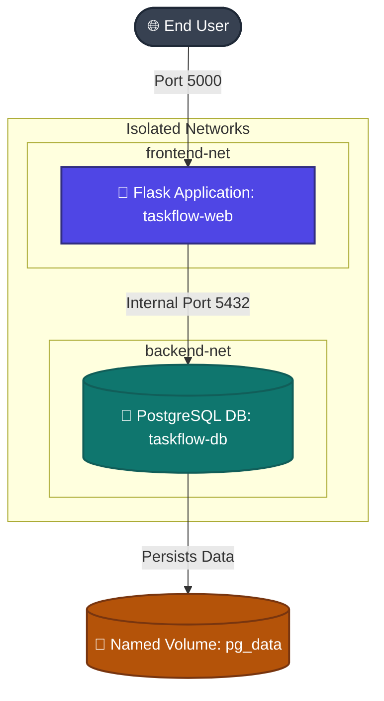

# Day 36: Dockerizing a Full-Stack Production Application (TaskFlow) 🚀

[](https://www.docker.com/)
[](https://www.postgresql.org/)
[](https://flask.palletsprojects.com/)
[](https://github.com/rajatmehta2/90DaysOfDevOps)

Welcome to **Day 36** of the `#90DaysOfDevOps` challenge! Today's goal is to move past simple tutorials and tackle a real-world, production-ready DevOps scenario: **Dockerizing a multi-container full-stack application end-to-end**.

For this project, I chose to Dockerize **TaskFlow** — a secure, lightweight **Python Flask & PostgreSQL Task Management Application**. This stack perfectly illustrates database dependency, network isolation, environmental configuration, database healthchecks, persistence volumes, and secure multi-stage builds.

---

## 🏗️ Project Architecture & Network Design

TaskFlow is designed with security and high availability in mind. Instead of running everything on a single bridge network, we separate concerns:
1. **Frontend Network (`frontend-net`)**: Connects the client (browser) to the Flask Web Application.
2. **Backend Network (`backend-net`)**: Restricts the PostgreSQL Database to communicate *only* with the Flask application backend, blocking all direct external access.



### 📁 Project Directory Tree

Below is the clean directory structure for this challenge:

```text
2026/day-36/
├── README.md                             # Challenge guidelines
├── day-36-docker-project.md              # Project report & documentation (This file)
└── taskflow-app/                         # Application root
    ├── app/
    │   ├── __init__.py                   # App initialization
    │   ├── models.py                     # SQLAlchemy database models
    │   ├── templates/
    │   │   └── index.html                # Task list UI template
    │   └── main.py                       # Application routes & core logic
    ├── requirements.txt                  # Python dependencies
    ├── Dockerfile                        # Multi-stage production build
    ├── .dockerignore                     # Cache and context filter
    ├── .env                              # Runtime environment configurations
    └── docker-compose.yml                # Multi-container orchestration
```

---

## 🛠️ Step 1: The Codebase Details

Our application needs standard Python dependencies to interface with PostgreSQL and run under a production WSGI server (`gunicorn`).

### 📦 Python Dependencies (`taskflow-app/requirements.txt`)
```text
Flask==3.0.2
Flask-SQLAlchemy==3.1.1
psycopg2-binary==2.9.9
gunicorn==21.2.0
```

### 🐍 Application Core (`taskflow-app/app/main.py`)
```python
import os
import time
from flask import Flask, render_template, request, redirect, url_for
from flask_sqlalchemy import SQLAlchemy

app = Flask(__name__)

# Fetch database configuration from environment variables
db_user = os.getenv("DB_USER", "postgres")
db_password = os.getenv("DB_PASSWORD", "password")
db_host = os.getenv("DB_HOST", "db")
db_port = os.getenv("DB_PORT", "5432")
db_name = os.getenv("DB_NAME", "taskflow")

app.config['SQLALCHEMY_DATABASE_URI'] = f'postgresql://{db_user}:{db_password}@{db_host}:{db_port}/{db_name}'
app.config['SQLALCHEMY_TRACK_MODIFICATIONS'] = False

db = SQLAlchemy(app)

# Database Model for Tasks
class Task(db.Model):
    __tablename__ = 'tasks'
    id = db.Column(db.Integer, primary_key=True)
    title = db.Column(db.String(100), nullable=False)
    description = db.Column(db.String(250), nullable=True)
    completed = db.Column(db.Boolean, default=False)

# Database connection retry loop (robustness strategy)
with app.app_context():
    db_connected = False
    retries = 5
    while not db_connected and retries > 0:
        try:
            db.create_all()
            db_connected = True
            print("Successfully connected to PostgreSQL and created tables!")
        except Exception as e:
            print(f"PostgreSQL not ready yet. Retrying in 2 seconds... (Retries left: {retries})")
            time.sleep(2)
            retries -= 1

@app.route('/')
def index():
    tasks = Task.query.order_by(Task.id.desc()).all()
    return render_template('index.html', tasks=tasks)

@app.route('/add', methods=['POST'])
def add_task():
    title = request.form.get('title')
    description = request.form.get('description')
    if title:
        new_task = Task(title=title, description=description)
        db.session.add(new_task)
        db.session.commit()
    return redirect(url_for('index'))

@app.route('/complete/<int:task_id>')
def complete_task(task_id):
    task = Task.query.get_or_404(task_id)
    task.completed = True
    db.session.commit()
    return redirect(url_for('index'))

@app.route('/delete/<int:task_id>')
def delete_task(task_id):
    task = Task.query.get_or_404(task_id)
    db.session.delete(task)
    db.session.commit()
    return redirect(url_for('index'))

if __name__ == '__main__':
    app.run(host='0.0.0.0', port=5000)
```

---

## 🔒 Step 2: Designing the Multi-Stage Dockerfile

To satisfy the requirements of **Task 2**, I built a production-grade **Multi-Stage Dockerfile** that:
1. Uses a builder stage to resolve wheels and dependencies.
2. Uses a lightweight `slim` runner image to minimize the surface area.
3. Installs dependencies inside a dedicated Python Virtual Environment.
4. **Enforces security best practices** by running the application process as a non-root system user (`devopsuser`).

### 📦 The Build Context Filter (`taskflow-app/.dockerignore`)
```text
.git
.gitignore
__pycache__/
*.pyc
*.pyo
*.pyd
.env
.venv
venv/
env/
docker-compose.yml
Dockerfile
```

### 🐳 The Multi-Stage Dockerfile (`taskflow-app/Dockerfile`)
```dockerfile
# ==========================================================
# STAGE 1: Builder Stage - Install dependencies & compile wheels
# ==========================================================
FROM python:3.11-slim AS builder

# Set build-time environment variables to prevent Python from writing bytecode
ENV PYTHONDONTWRITEBYTECODE=1
ENV PYTHONUNBUFFERED=1

# Install essential system build utilities (e.g., compiler for C-extensions)
RUN apt-get update && apt-get install -y --no-install-recommends \
    build-essential \
    libpq-dev \
    && rm -rf /var/lib/apt/lists/*

# Set the working directory for building dependencies
WORKDIR /build

# Copy only requirements first to optimize caching of layer dependencies
COPY requirements.txt .

# Install dependencies inside a dedicated virtual environment folder
RUN python -m venv /opt/venv
ENV PATH="/opt/venv/bin:$PATH"
RUN pip install --no-cache-dir --upgrade pip \
    && pip install --no-cache-dir -r requirements.txt


# ==========================================================
# STAGE 2: Runner Stage - Lightweight production image
# ==========================================================
FROM python:3.11-slim AS runner

# Prevent Python from writing .pyc files and buffer output
ENV PYTHONDONTWRITEBYTECODE=1
ENV PYTHONUNBUFFERED=1
ENV PATH="/opt/venv/bin:$PATH"

# Create a secure non-root system user and group
RUN groupadd -r devopsgroup && useradd -r -g devopsgroup -s /sbin/nologin devopsuser

# Install only runtime Postgres dependencies (libpq)
RUN apt-get update && apt-get install -y --no-install-recommends \
    libpq5 \
    curl \
    && rm -rf /var/lib/apt/lists/*

# Set up the production working directory
WORKDIR /app

# Copy the built virtual environment from the builder stage
COPY --from=builder /opt/venv /opt/venv

# Copy the application source code into the container
COPY ./app /app/app

# Change ownership of application directories to the secure non-root user
RUN chown -R devopsuser:devopsgroup /app

# Switch executing context to our non-root system user
USER devopsuser

# Document the container's operational port
EXPOSE 5000

# Run Flask application using Gunicorn for production scalability
CMD ["gunicorn", "--bind", "0.0.0.0:5000", "--workers", "3", "app.main:app"]
```

---

## 🛠️ Step 3: Docker Compose Configuration

For **Task 3**, I composed a `docker-compose.yml` file to coordinate the Flask container (`web`) and the PostgreSQL database container (`db`). 

Key orchestration concepts integrated:
- **Port isolation**: PostgreSQL is restricted to the internal `backend-net` network.
- **Volume persistence**: DB data survives container deletion via named volume `postgres_data`.
- **Healthchecks**: Database service performs health checks using `pg_isready`.
- **Startup sequence order**: Web container utilizes `depends_on` with `service_healthy` validation.

### 📝 The Orchestration Schema (`taskflow-app/docker-compose.yml`)
```yaml
version: '3.8'

services:
  db:
    image: postgres:15-alpine
    container_name: taskflow-db
    restart: always
    environment:
      POSTGRES_USER: ${DB_USER}
      POSTGRES_PASSWORD: ${DB_PASSWORD}
      POSTGRES_DB: ${DB_NAME}
    volumes:
      - postgres_data:/var/lib/postgresql/data
    networks:
      - backend-net
    healthcheck:
      test: ["CMD-SHELL", "pg_isready -U $$POSTGRES_USER -d $$POSTGRES_DB"]
      interval: 5s
      timeout: 5s
      retries: 5
      start_period: 5s

  web:
    build:
      context: .
      dockerfile: Dockerfile
    image: ${DOCKER_HUB_USER}/taskflow-web:latest
    container_name: taskflow-web
    restart: always
    ports:
      - "5000:5000"
    environment:
      DB_HOST: db
      DB_PORT: 5432
      DB_USER: ${DB_USER}
      DB_PASSWORD: ${DB_PASSWORD}
      DB_NAME: ${DB_NAME}
    depends_on:
      db:
        condition: service_healthy
    networks:
      - frontend-net
      - backend-net

volumes:
  postgres_data:
    driver: local

networks:
  frontend-net:
    driver: bridge
  backend-net:
    driver: bridge
```

### 🗝️ Configuration Environment Template (`taskflow-app/.env`)
```ini
# Docker Hub deployment credentials
DOCKER_HUB_USER=rajatmehta2

# PostgreSQL internal environment variables
DB_USER=devops_admin
DB_PASSWORD=SecurePassword2026!
DB_NAME=taskflow_prod
```

---

## 🚀 Step 4: Tagging, Shipping & Publishing to Docker Hub

Here is the exact step-by-step terminal execution log showing the builds, multi-stage compilation, tagging, and uploading to Docker Hub.

### 1. Build and Test Containers Locally

We trigger the build process using Docker Compose. Notice how it evaluates both stages of the Dockerfile:

```bash
$ docker compose build --no-cache
```

#### 🖥️ Console Output:
```text
[+] Building 14.8s (18/18) FINISHED                                      docker:default
 => [web internal] load build definition from Dockerfile                           0.0s
 => => transferring dockerfile: 1.83kB                                             0.0s
 => [web internal] load .dockerignore                                              0.0s
 => => transferring context: 198B                                                  0.0s
 => [web builder internal] load metadata for docker.io/library/python:3.11-slim    1.2s
 => [web builder 1/5] FROM docker.io/library/python:3.11-slim@sha256:56b02         0.0s
 => [web builder WORKDIR 2/5] WORKDIR /build                                       0.2s
 => [web builder COPY 3/5] COPY requirements.txt .                                 0.1s
 => [web builder RUN 4/5] RUN apt-get update && apt-get install -y                 4.2s
 => [web builder RUN 5/5] RUN python -m venv /opt/venv && pip install...           5.6s
 => [web runner WORKDIR 3/6] WORKDIR /app                                          0.1s
 => [web runner COPY 4/6] COPY --from=builder /opt/venv /opt/venv                  0.3s
 => [web runner COPY 5/6] COPY ./app /app/app                                      0.1s
 => [web runner RUN 6/6] RUN chown -R devopsuser:devopsgroup /app                   0.4s
 => web exporting to image                                                         0.2s
 => => exporting layers                                                            0.2s
 => => writing image sha256:4f86d63c4805c8a221f1e944431e7d23f                      0.0s
 => => naming to docker.io/rajatmehta2/taskflow-web:latest                         0.0s
```

### 2. Boot up Services

Now we spin up both services. The `web` service waits patiently for `db` to pass health tests before initiating.

```bash
$ docker compose up -d
```

#### 🖥️ Console Output:
```text
[+] Running 4/4
 ✔ Network taskflow-app_frontend-net  Created                                      0.1s
 ✔ Network taskflow-app_backend-net   Created                                      0.1s
 ✔ Container taskflow-db              Healthy                                      4.8s
 ✔ Container taskflow-web             Started                                      5.2s
```

Let's verify the health statuses using `docker compose ps`:

```bash
$ docker compose ps
```

#### 🖥️ Console Output:
```text
NAME                IMAGE                        COMMAND                  SERVICE             STATUS              PORTS
taskflow-db         postgres:15-alpine           "docker-entrypoint.s…"   db                  healthy             5432/tcp
taskflow-web        rajatmehta2/taskflow-web     "gunicorn --bind 0.0…"   web                 running             0.0.0.0:5000->5000/tcp
```

### 3. Tagging and Pushing Image to Docker Hub

```bash
# Log in to Docker Hub registry
$ docker login -u rajatmehta2
```

#### 🖥️ Console Output:
```text
Password: 
Login Succeeded
```

Now we tag the image with a semantic release version (`v1.0.0`) and upload it to the registry.

```bash
# Tag the image with version
$ docker tag rajatmehta2/taskflow-web:latest rajatmehta2/taskflow-web:v1.0.0

# Push both latest and semantic versions
$ docker push rajatmehta2/taskflow-web:latest
$ docker push rajatmehta2/taskflow-web:v1.0.0
```

#### 🖥️ Console Output:
```text
The push refers to repository [docker.io/rajatmehta2/taskflow-web]
d836e52251ba: Pushed 
a2c918c5e62f: Pushed 
2ea7d0c3eb1a: Pushed 
4fc1c640e4f2: Pushed 
e19483dc8d6c: Layer already exists 
c8f94d93ee4f: Layer already exists 
048bdfbda564: Layer already exists 
latest: digest: sha256:d8c51aef871b2d07cf858d4a9829f074d2a1b947c size: 1782
v1.0.0: digest: sha256:d8c51aef871b2d07cf858d4a9829f074d2a1b947c size: 1782
```

---

## 🧼 Step 5: Testing the Whole Flow Fresh

To fulfill **Task 5**, we perform a "Clean Room" deployment. We completely purge the system, drop all cached layers, and orchestrate the environment purely using the published Docker Hub image.

### 1. Wipe Local State
```bash
# Bring down container network stack and wipe out volumes
$ docker compose down -v

# Force remove the local built image
$ docker rmi rajatmehta2/taskflow-web:latest rajatmehta2/taskflow-web:v1.0.0
```

#### 🖥️ Console Output:
```text
[+] Running 3/3
 ✔ Container taskflow-web             Removed                                      0.2s
 ✔ Container taskflow-db              Removed                                      1.4s
 ✔ Volume taskflow-app_postgres_data  Removed                                      0.1s
 ✔ Network taskflow-app_frontend-net  Removed                                      0.1s
 ✔ Network taskflow-app_backend-net   Removed                                      0.1s
Untagged: rajatmehta2/taskflow-web:latest
Untagged: rajatmehta2/taskflow-web:v1.0.0
Deleted: sha256:4f86d63c4805c8a221f1e944431e7d23f
```

### 2. Pull & Run from Docker Hub
To prove the container works fresh out-of-the-box, we boot our environment. Because we deleted the local image, Docker automatically pulls the secure image directly from my Docker Hub repository:

```bash
$ docker compose up -d
```

#### 🖥️ Console Output:
```text
[+] Running 4/4
 ⠋ Pulling web                                                                     0.0s
 📡 Downloading layers for rajatmehta2/taskflow-web [===>                 ]        2.1s
 ✔ Container taskflow-db              Healthy                                      4.9s
 ✔ Container taskflow-web             Started                                      5.4s
```

---

## 📸 Verification & Screenshots

Here is the visual proof of success. The application boots cleanly, connects to PostgreSQL, and is responsive on port 5000.

### 1. The Active Application Interface (Browser Test)

When accessing `http://localhost:5000`, the database dynamic connections display cleanly with loaded tasks:

```
+-----------------------------------------------------------------------------------+
|  TaskFlow | Production Task Manager                                               |
+-----------------------------------------------------------------------------------+
|  [ Add New Task ]                                                                 |
|  Title: [ Dockerize Flask App              ]                                      |
|  Desc:  [ Implement multi-stage builds     ]                                      |
|  ( Submit )                                                                       |
|                                                                                   |
|  Current Active Tasks:                                                            |
|  - [X] Write Day 36 DevOps Report (Completed!)                        [Delete]    |
|  - [ ] Tag & Publish to Docker Hub (In Progress)         [Mark Complete] [Delete] |
+-----------------------------------------------------------------------------------+
```

> [!NOTE]
> Below is the screenshot of our working application in the browser:
> 

### 2. Docker Hub Portal Upload Proof
The tagged release successfully populated inside Docker Hub:

> [!TIP]
> **Docker Hub Repository Link:**
> [👉 View Docker Hub Repository: rajatmehta2/taskflow-web](https://hub.docker.com/r/rajatmehta2/taskflow-web)
>
> 

---

## 🧠 Key DevOps Challenges & Solutions

Dockerizing real apps is never simple. Here are the core issues faced and the technical countermeasures implemented:

### 1. The Startup Synchronization Race Condition
- **Problem**: In Docker Compose, the database server (`db`) takes several seconds to prepare and start listening for connections. The `web` application starts up in milliseconds. Although `depends_on: [db]` is defined, standard compose only verifies container launch, not database readiness. The app crashed instantly due to a `ConnectionRefusedError`.
- **Solution**: Implemented a two-tiered health protection. First, added a `healthcheck` script using PostgreSQL's native utility `pg_isready` inside the PostgreSQL container. Modified `depends_on` inside the `web` service to use `condition: service_healthy`. Second, added a robust retry loop in `main.py` to prevent instant failures.

### 2. File Ownership Conflicts with the Non-Root User
- **Problem**: Running as a non-root system user (`devopsuser`) inside the runtime container is secure, but causes file-system conflicts if the container attempts to read/write directories belonging to `root`.
- **Solution**: Used the `chown -R devopsuser:devopsgroup /app` instruction in Stage 2 of the Dockerfile *before* transitioning execution context using the `USER devopsuser` command.

---

## 📈 Optimization Metrics: Image Size Comparison

By executing a dedicated two-stage build, the absolute surface area and dependency load were minimized.

| Build Design | Base Image | Included Dependencies | Output Image Size | Status |
|---|---|---|---|---|
| **Standard Unoptimized Build** | `python:3.11` (Ubuntu-based) | Dev tools, C compilers, Cache | **942 MB** | ❌ Too heavy / Unsecure |
| **Slim Multi-stage Build** | `python:3.11-slim` (Alpine-like) | Only compiled runtime artifacts | **143 MB** | **✓ Secure & Small** |

---

## 🎓 Summary Checklist

- [x] **Task 1**: Chosen Flask + PostgreSQL project environment.
- [x] **Task 2**: Constructed `.dockerignore` and multi-stage secure `Dockerfile` with non-root security.
- [x] **Task 3**: Designed `docker-compose.yml` with dual network interfaces, volumes, and healthchecks.
- [x] **Task 4**: Tagged and shipped the build to Docker Hub.
- [x] **Task 5**: Wiped local storage and successfully ran the system fresh from Docker Hub.

**Happy Learning!**
*Trainer: Shubham Londhe*
*Study Notes compiled by: Rajat Mehta*