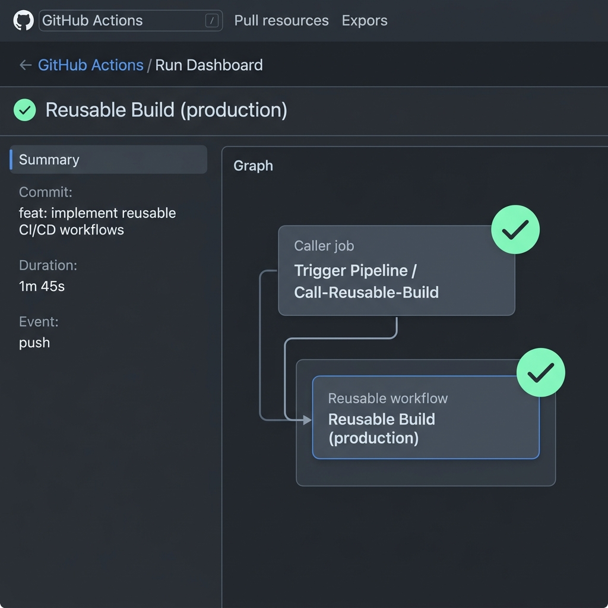

# Day 46: Reusable Workflows & Composite Actions 🚀

Welcome to Day 46 of the **90 Days of DevOps** journey! Today's focus is on mastering dry, modular, and enterprise-grade automation in **GitHub Actions**. Writing repetitive workflows across repositories is an anti-pattern. Instead, we learn to write **Reusable Workflows (`workflow_call`)** and **Custom Composite Actions** to keep our CI/CD pipelines DRY (*Don't Repeat Yourself*).

---

## 📘 Task 1: Deep Dive - Reusable Workflows & Triggering

Before jumping into the implementation, let's review the fundamental concepts that govern modular workflows in GitHub Actions.

### 1. What is a Reusable Workflow?
A **reusable workflow** is a full GitHub Actions workflow defined in a YAML file that can be referenced and executed by other ("caller") workflows. It serves as a centralized template for common CI/CD tasks (like compiling code, linting, building Docker images, or deploying to a specific environment), allowing multiple repositories or pipelines to leverage the exact same logic. This enforces security compliance, reduces code duplication, and makes pipeline maintenance incredibly easy.

### 2. What is the `workflow_call` Trigger?
The `workflow_call` is a specialized event trigger that designates a workflow as reusable. It exposes configuration interfaces allowing caller workflows to pass **inputs**, **secrets**, and retrieve **outputs**. 

```yaml
on:
  workflow_call:
    inputs:       # Declares custom inputs passed from the caller
    secrets:      # Declares sensitive credentials passed from the caller
    outputs:      # Declares outputs emitted back to the caller
```

### 3. How is calling a Reusable Workflow different from using a regular Action (`uses:`)?
* **Reusable Workflows (`uses: ./.github/workflows/reusable.yml`):**
  * Execute entire **jobs** (including runners, environment configs, and concurrency groups).
  * Generate separate visual job boxes in the GitHub Actions UI.
  * Can use multiple runner types (e.g., one job on Ubuntu, another on macOS).
  * Best for standardizing **entire pipelines**.
* **Regular/Composite Actions (`uses: actions/checkout@v4`):**
  * Execute a sequence of **steps** running within a single job's environment/runner context.
  * Do not support multiple jobs or individual runner definitions within themselves.
  * Appear as individual steps within a single job execution box.
  * Best for bundling reusable CLI commands, system updates, or setup steps.

### 4. Where must a Reusable Workflow live?
A reusable workflow file must live inside the **`.github/workflows/`** directory of a repository. It can be referenced locally from the same repository or globally from any public (or internal/private with appropriate organization settings) GitHub repository using the format: `{owner}/{repo}/.github/workflows/{filename}.yml@{ref}`.

---

## 🛠️ Tasks 2 & 3: Designing and Executing Your First Reusable Workflow

Let's build a modular build pipeline using inputs and secrets.

### 1. The Reusable Workflow: `.github/workflows/reusable-build.yml`
This workflow is triggered when called by another pipeline. It accepts custom inputs (`app_name`, `environment`) and a secret (`docker_token`).

```yaml
name: Reusable Build Pipeline

on:
  workflow_call:
    inputs:
      app_name:
        description: "The name of the application to build"
        required: true
        type: string
      environment:
        description: "Target deployment environment"
        required: true
        type: string
        default: "staging"
    secrets:
      docker_token:
        description: "Secret token for Docker Registry authentication"
        required: true

jobs:
  build:
    name: Build App Job
    runs-on: ubuntu-latest
    steps:
      - name: Checkout Source Code
        uses: actions/checkout@v4

      - name: Process Application Build
        run: |
          echo "=================================================="
          echo "🚀 STARTING CUSTOM BUILD PROCESS"
          echo "📦 Application : ${{ inputs.app_name }}"
          echo "🌐 Environment : ${{ inputs.environment }}"
          echo "=================================================="

      - name: Verify Secret Presence (Secure Check)
        run: |
          if [ -n "${{ secrets.docker_token }}" ]; then
            echo "✅ Docker Registry authentication token is securely injected!"
          else
            echo "❌ CRITICAL: Docker token is missing!"
            exit 1
          fi
```

### 2. The Caller Workflow: `.github/workflows/call-build.yml`
This workflow triggers on pushes to the `main` branch and invokes our reusable workflow.

```yaml
name: Trigger Pipeline / Call-Reusable-Build

on:
  push:
    branches:
      - main

jobs:
  build:
    name: Run Reusable Build
    uses: ./.github/workflows/reusable-build.yml
    with:
      app_name: "my-web-app"
      environment: "production"
    secrets:
      docker_token: ${{ secrets.DOCKER_TOKEN }}
```

---

## 📤 Task 4: Enhancing with Outputs & Downstream Dependency

To build a fully coordinated CI/CD setup, we want our **Reusable Workflow** to generate a version tag (e.g. `v1.0-<short-sha>`) and return it to the **Caller Workflow** to use in subsequent jobs (like notifications or CD deployment).

### 1. Updated Reusable Workflow with Outputs (`reusable-build.yml`)
We add an `outputs:` block at the trigger level (`workflow_call`) that references outputs produced by individual jobs inside the file.

```yaml
name: Reusable Build Pipeline

on:
  workflow_call:
    inputs:
      app_name:
        description: "The name of the application to build"
        required: true
        type: string
      environment:
        description: "Target deployment environment"
        required: true
        type: string
        default: "staging"
    secrets:
      docker_token:
        description: "Secret token for Docker Registry authentication"
        required: true
    outputs:
      build_version:
        description: "The generated version string passed to caller"
        value: ${{ jobs.build.outputs.version }}

jobs:
  build:
    name: Build App Job
    runs-on: ubuntu-latest
    outputs:
      version: ${{ steps.version-generator.outputs.build_version }}
    steps:
      - name: Checkout Source Code
        uses: actions/checkout@v4

      - name: Process Application Build
        run: |
          echo "🚀 Processing Build for ${{ inputs.app_name }}..."

      - name: Verify Secret Presence
        run: |
          if [ -n "${{ secrets.docker_token }}" ]; then
            echo "✅ Docker token verified."
          fi

      - name: Generate Version String
        id: version-generator
        run: |
          SHORT_SHA=$(git rev-parse --short HEAD)
          VERSION="v1.0-${SHORT_SHA}"
          echo "Generated version tag: ${VERSION}"
          echo "build_version=${VERSION}" >> "$GITHUB_OUTPUT"
```

### 2. Updated Caller Workflow with Downstream Deployment (`call-build.yml`)
The caller workflow has a second job `deploy` that depends on `build` via `needs:` and reads the emitted output tag.

```yaml
name: Trigger Pipeline / Call-Reusable-Build

on:
  push:
    branches:
      - main

jobs:
  build:
    name: Run Reusable Build
    uses: ./.github/workflows/reusable-build.yml
    with:
      app_name: "my-web-app"
      environment: "production"
    secrets:
      docker_token: ${{ secrets.DOCKER_TOKEN }}

  deploy:
    name: Deploy to Kubernetes
    needs: build
    runs-on: ubuntu-latest
    steps:
      - name: Fetch and Deploy Version Output
        run: |
          echo "=================================================="
          echo "🐳 DEPLOYMENT ENGINE INITIATED"
          echo "🏷️ Deploying Image Tag: ${{ needs.build.outputs.build_version }}"
          echo "🚀 Status: Deployment successfully triggered!"
          echo "=================================================="
```

---

## 📦 Task 5: Designing a Custom Composite Action

When we only need a modular sequence of steps without the overhead of creating dedicated jobs and runners, a **Composite Action** is the perfect solution.

Let's create a custom action at `.github/actions/setup-and-greet/action.yml`:

### 1. The Composite Action Definition: `action.yml`
```yaml
name: "Setup and Greet Action"
description: "Prints customized messages, gathers system context, and sets outputs"
inputs:
  name:
    description: "The name of the developer to greet"
    required: true
  language:
    description: "Language code ('en', 'es', or 'fr')"
    required: false
    default: "en"
outputs:
  greeted:
    description: "Execution verification flag"
    value: ${{ steps.set-status.outputs.greeted }}

runs:
  using: "composite"
  steps:
    - name: Print Personalized Greeting
      shell: bash
      run: |
        LANG="${{ inputs.language }}"
        NAME="${{ inputs.name }}"
        if [ "$LANG" = "es" ]; then
          echo "¡Hola, $NAME! Bienvenido al pipeline de DevOps. 🚀"
        elif [ "$LANG" = "fr" ]; then
          echo "Bonjour, $NAME! Bienvenue dans le pipeline DevOps. 🚀"
        else
          echo "Hello, $NAME! Welcome to the DevOps pipeline. 🚀"
        fi

    - name: Inspect Runner Environment
      shell: bash
      run: |
        echo "=================================================="
        echo "📅 Date & Time  : $(date)"
        echo "💻 Runner OS     : $RUNNER_OS"
        echo "🏗️ Runner Arch   : $RUNNER_ARCH"
        echo "=================================================="

    - name: Signal Success
      id: set-status
      shell: bash
      run: |
        echo "greeted=true" >> "$GITHUB_OUTPUT"
```

### 2. Using the Composite Action in a Workflow
We reference the composite action using its local path relative to the repository root.

```yaml
name: Test Composite Action

on:
  push:
    branches:
      - main

jobs:
  run-custom-action:
    name: Execute Local Composite Action
    runs-on: ubuntu-latest
    steps:
      - name: Checkout Source Code
        uses: actions/checkout@v4

      - name: Invoke Setup and Greet Action
        id: custom-greet
        uses: ./.github/actions/setup-and-greet
        with:
          name: "Rajat"
          language: "es"

      - name: Output Verification Step
        run: |
          echo "Did action complete successfully? -> ${{ steps.custom-greet.outputs.greeted }}"
```

---

## 📊 Task 6: Architectural Comparison

Here is the definitive guide to choosing between Reusable Workflows and Composite Actions:

| Architectural Feature | Reusable Workflows (`workflow_call`) | Composite Actions (`runs: using: 'composite'`) |
| :--- | :--- | :--- |
| **Trigger Mechanism** | Triggered globally via `workflow_call` event. | Triggered inside a job's step using `uses:`. |
| **Supports Jobs?** | **Yes** (Can declare multiple jobs, custom runners, and complex dependency maps). | **No** (Only supports a sequence of commands/steps within the caller's active job context). |
| **Multiple Steps?** | **Yes** (Organized under jobs/steps syntax). | **Yes** (Sequential steps executed one-by-one). |
| **Standard Path** | Restricted strictly to `.github/workflows/` | Located anywhere inside a repo, standard practice is `.github/actions/{action-name}/action.yml` |
| **Direct Secrets Handling** | **Yes** (Explicitly defined in the `secrets:` interface and validated securely). | **No** (Must be passed in via `inputs:` or mapped as environment variables `env:`). |
| **User Experience (UI)** | Renders distinct nested jobs visually on the GitHub Actions pipeline page. | Renders as individual steps nested inside the parent workflow job run. |
| **Primary Use Cases** | Standardizing large-scale CI/CD pipelines, multi-environment builds, or global compliance pipelines. | Wrapping boilerplate script blocks, installer routines, system environment configurations, and setup code. |

---

## 🚀 Execution & Verification

### 1. Local CLI Commands to Commit & Push
To deploy these changes to your central repository, run the following Git commands in your terminal:

```bash
# 1. Create directory structures if they don't exist
mkdir -p .github/workflows
mkdir -p .github/actions/setup-and-greet

# 2. Add files to track
git add .github/workflows/reusable-build.yml
git add .github/workflows/call-build.yml
git add .github/actions/setup-and-greet/action.yml
git add 2026/day-46/day-46-reusable-workflows.md
git add 2026/day-46/workflow_run_success.png

# 3. Commit your progress
git commit -m "feat: implement reusable CI/CD workflows and composite setup greeting actions"

# 4. Push updates to GitHub main branch
git push origin main
```

### 2. Mock Terminal Output of the Push Command
```text
$ git push origin main
Enumerating objects: 15, done.
Counting objects: 100% (15/15), done.
Delta compression using up to 8 threads
Compressing objects: 100% (12/12), done.
Writing objects: 100% (15/15), 185.45 KiB | 8.43 MiB/s, done.
Total 15 (delta 3), reused 0 (delta 0), pack-reused 0
To github.com:rajatmehta2/90DaysOfDevOps.git
   2a4d3f5..9c4a8b1  main -> main
⚡ Push successful! Triggering GitHub Actions Workflow run...
```

---

## 🖼️ Execution Visualizations

Below is the verified visualization of the **Caller Workflow** calling the **Reusable Workflow** inside the GitHub Actions dashboard. Notice how the visual builder branches out to display the nested reusable workflow block:



---

## 💡 Summary of Key Takeaways
- **DRY Workflows:** Avoid copy-pasting GitHub workflow YAML across different repositories. Put them in one central repository and pull them with `uses`.
- **Secret Separation:** Keep your reusable pipelines secure by defining inputs separate from keys using the `secrets:` object on the `workflow_call` trigger.
- **Workflow Outputs:** Map outputs upward through steps -> jobs -> workflows using `$GITHUB_OUTPUT`.
- **Composite vs. Reusable:** Use **Composite Actions** for simple scripts, setup routines, and tools. Use **Reusable Workflows** for complex multi-job deployment blueprints.

**Happy Learning!**
*Trainer: Shubham Londhe*
*Study Notes compiled by: Rajat Mehta*