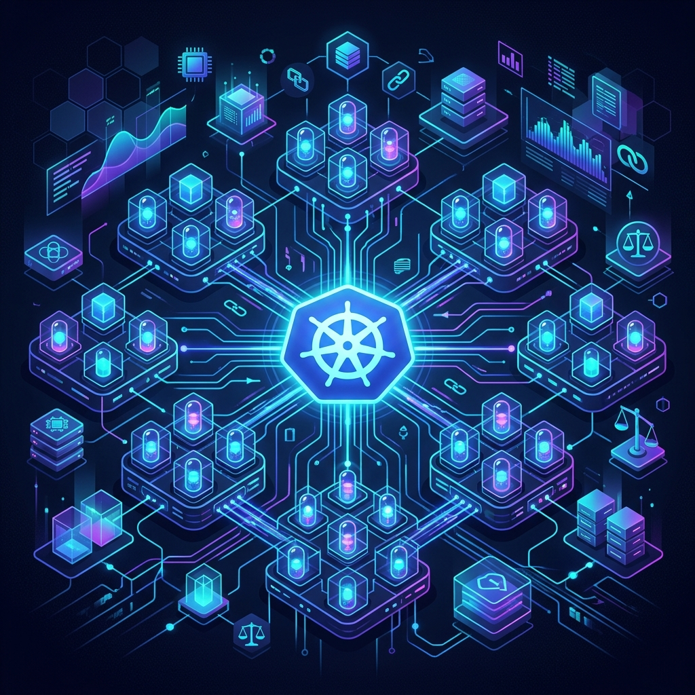
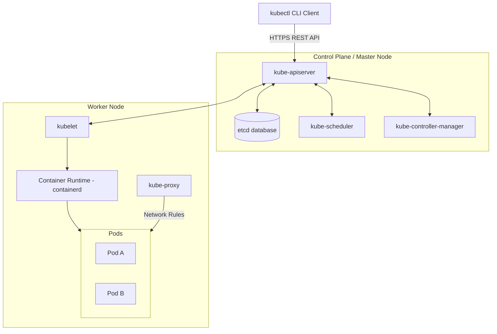

# Day 50: Kubernetes Architecture and Local Cluster Setup



Welcome to **Day 50** of the **90 Days of DevOps** challenge! Having mastered Docker and containerization, it's time to scale up. In a production environment, managing hundreds of containers across multiple hosts manually is impossible. This is where **Kubernetes (K8s)**—the industry-standard container orchestration engine—comes into play.

Today, we will dive deep into Kubernetes history and architecture, configure our local machine, and spin up a local Kubernetes cluster using **kind (Kubernetes in Docker)**.

---

## 📖 Task 1: The Kubernetes Story & Origin

### 1. Why was Kubernetes created?
While **Docker** excels at packaging, distributing, and running individual containers on a single host, it lacks native mechanisms to handle multi-host deployments, automated scaling, and complex networking out of the box. 

**Kubernetes** was created to solve these exact orchestration challenges:
*   **High Availability & Self-Healing:** Automatically restarts failed containers, replaces pods when nodes die, and schedules them elsewhere.
*   **Horizontal Scaling:** Seamlessly scales container replicas up or down based on resource usage.
*   **Service Discovery & Load Balancing:** Gives containers their own IP addresses and a single DNS name for a set of containers, balancing traffic across them.
*   **Automated Rollouts/Rollbacks:** Deploys updates progressively while monitoring application health, rolling back automatically if things go wrong.

### 2. Who created Kubernetes and what inspired it?
Kubernetes was designed and built by **Google** in 2014, drawing upon over a decade of Google's experience running containerized workloads at planetary scale. It was inspired by **Borg** (and later **Omega**), Google’s internal cluster management system. Google open-sourced Kubernetes in 2014 and donated it to the **Cloud Native Computing Foundation (CNCF)** as its seed technology.

### 3. What does the name "Kubernetes" mean?
The name **Kubernetes** originates from the Greek word **κυβερνήτης** (kybernētēs), which translates to **"helmsman"**, **"pilot"**, or **"governor"**. It is the root word for both "cybernetics" and "government". The common abbreviation **"K8s"** is a numeronym replacing the 8 letters between "K" and "s".

---

## 🏗️ Task 2: Kubernetes Architecture

Kubernetes follows a **Master-Worker (Control Plane-Node)** architecture. The **Control Plane** manages the global state, scheduling, and orchestration, while **Worker Nodes** host the actual application containers.

### 🌐 Architectural Flow Diagram



### 🧠 Core Component Deep-Dive

#### 1. Control Plane (Master Node) Components
*   **`kube-apiserver` (The Front Door):** The central management hub. Every administrative task, CLI command, and internal component interaction goes through this REST API. It authenticates, authorizes, and validates all requests.
*   **`etcd` (The Source of Truth):** A highly available, distributed key-value store. It stores the entire state of the cluster (config, status, discovery metadata). If it's not in `etcd`, it doesn't exist in the cluster.
*   **`kube-scheduler` (The Brain):** Watches for newly created Pods that have no assigned node, and selects the optimal Worker Node for them to run on, considering resource constraints, affinity policies, and hardware requirements.
*   **`kube-controller-manager` (The Enforcer):** Runs background controller loops to regulate the state of the cluster. It constantly compares the *desired state* (e.g., "run 3 replicas of App X") with the *actual state* (e.g., "only 2 replicas are running") and executes changes to close the gap.

#### 2. Worker Node Components
*   **`kubelet` (The Node Agent):** An agent running on each worker node. It ensures that the containers described in PodSpecs are running and healthy. It communicates directly with the Control Plane's API server.
*   **`kube-proxy` (The Network Coordinator):** A network proxy running on each node. It maintains network rules on hosts, enabling network communication to Pods from inside or outside the cluster.
*   **Container Runtime:** The software responsible for actually running the containers. K8s supports runtimes conforming to the Container Runtime Interface (CRI), most commonly **containerd** or **CRI-O**.

---

### 🔄 Trace Request Flow: `kubectl apply -f pod.yaml`

What happens under the hood when a pod is deployed?

```
[ kubectl CLI ] 
       │ (1) Sends YAML declaration via POST request
       ▼
[ kube-apiserver ] <══(2) Authenticates, validates, & saves state══> [ etcd ]
       ▲
       │ (3) Watches API server, detects new unassigned Pod
       ▼
[ kube-scheduler ] 
       │ (4) Evaluates nodes, assigns target Node, updates API
       ▼
[ kube-apiserver ] <══(5) Updates Pod metadata with Node assignment══> [ etcd ]
       ▲
       │ (6) Watches API server, notices Pod is assigned to its Node
       ▼
[ kubelet (Node) ] 
       │ (7) Invokes CRI to pull image and launch container
       ▼
[ Container Runtime (containerd) ] ──▶ Launches Container/Pod!
```

1.  **`kubectl`** parses your YAML file and sends an HTTP POST request containing the Pod configuration to the **`kube-apiserver`**.
2.  The **`kube-apiserver`** authenticates/authorizes the user, validates the schema, and writes the Pod configuration to **`etcd`**.
3.  The **`kube-scheduler`** detects the new Pod in `etcd` (via API Server) that doesn't have a `nodeName` assigned yet.
4.  The scheduler filters and scores the available worker nodes and determines the best node for the Pod. It sends this decision back to the **`kube-apiserver`**.
5.  The **`kube-apiserver`** writes the scheduled node assignment back to **`etcd`**.
6.  The **`kubelet`** on the assigned worker node, which constantly watches the API Server for changes, detects that a Pod has been assigned to its host.
7.  The **`kubelet`** communicates with the local **Container Runtime (CRI)** to pull the container image and start the container.
8.  The **`kubelet`** monitors the container status and reports health and status metrics back to the API Server.

---

### ⚡ Failure Scenarios: What Breaks?

> [!WARNING]
> **What happens if the API Server goes down?**
> The cluster becomes static. You cannot deploy new applications, update existing ones, scale configurations, or run `kubectl` commands. However, already-running applications on worker nodes will continue to operate normally, as their local container runtimes and network rules (kube-proxy) remain functional.

> [!CAUTION]
> **What happens if a Worker Node goes down?**
> The `kubelet` on that node stops reporting heartbeats to the API Server. The **Node Controller** in the Control Plane detects this failure. After a timeout period (default is 5 minutes), the Control Plane marks the node as unreachable and schedules all its active Pods to other healthy worker nodes in the cluster to maintain desired availability.

---

## 🛠️ Task 3: Installing `kubectl`

The command-line tool `kubectl` allows us to run commands against Kubernetes clusters.

### macOS (Homebrew)
```bash
brew install kubectl
```

### Linux (Debian/Ubuntu/RHEL)
```bash
curl -LO "https://dl.k8s.io/release/\$(curl -L -s https://dl.k8s.io/release/stable.txt)/bin/linux/amd64/kubectl"
chmod +x kubectl
sudo mv kubectl /usr/local/bin/
```

### Windows (Chocolatey)
```bash
choco install kubernetes-cli
```

### 🔍 Verification
Confirm that the client CLI is successfully installed:

```bash
kubectl version --client
```

**Output:**
```text
Client Version: v1.35.0
Kustomize Version: v5.6.0
```

---

## 🚀 Task 4: Local Cluster Setup (Choosing `kind`)

For local development, we have two excellent options: **kind (Kubernetes in Docker)** and **minikube**.

### 🤝 Why we chose `kind`
For our local environment, we chose **Option A: kind** due to several factors:
1.  **Lightweight Containerization:** `kind` runs Kubernetes nodes as lightweight Docker containers rather than launching resource-heavy hypervisors/Virtual Machines.
2.  **Ultra-fast Boot Times:** Spins up multi-node or single-node clusters in under 45 seconds.
3.  **Docker Native:** Integrates seamlessly into existing Docker workflows and runs flawlessly inside modern containerized environments.

### 📥 1. Installing `kind`
```bash
# macOS
brew install kind

# Linux
curl -Lo ./kind https://kind.sigs.k8s.io/dl/latest/kind-linux-amd64
chmod +x ./kind
sudo mv ./kind /usr/local/bin/kind
```

### 🏗️ 2. Spin Up a Kubernetes Cluster
Let's create a local cluster named `devops-cluster`:

```bash
kind create cluster --name devops-cluster
```

**Real Terminal Output:**
```text
Creating cluster "devops-cluster" ...
 • Ensuring node image (kindest/node:v1.35.0) 🖼  ...
 ✓ Ensuring node image (kindest/node:v1.35.0) 🖼
 • Preparing nodes 📦   ...
 ✓ Preparing nodes 📦 
 • Writing configuration 📜  ...
 ✓ Writing configuration 📜
 • Starting control-plane 🕹️  ...
 ✓ Starting control-plane 🕹️
 • Installing CNI 🔌  ...
 ✓ Installing CNI 🔌
 • Installing StorageClass 💾  ...
 ✓ Installing StorageClass 💾
Set kubectl context to "kind-devops-cluster"
You can now use your cluster with:

kubectl cluster-info --context kind-devops-cluster

Have a nice day! 👋
```

---

## 🔍 Task 5: Exploring the Cluster

With the cluster fully operational, we explore its runtime details using our newly installed `kubectl` command-line utility.

### 1. Check Cluster Info
```bash
kubectl cluster-info
```
**Output:**
```text
Kubernetes control plane is running at https://127.0.0.1:53894
CoreDNS is running at https://127.0.0.1:53894/api/v1/namespaces/kube-system/services/kube-dns:dns/proxy

To further debug and diagnose cluster problems, use 'kubectl cluster-info dump'.
```

---

### 2. Verify and List Cluster Nodes
Let's verify that our control-plane node is ready and connected.

```bash
kubectl get nodes -o wide
```

**Output:**
```text
NAME                           STATUS   ROLES           AGE   VERSION   INTERNAL-IP   EXTERNAL-IP   OS-IMAGE                         KERNEL-VERSION     CONTAINER-RUNTIME
devops-cluster-control-plane   Ready    control-plane   65s   v1.35.0   172.18.0.2    <none>        Debian GNU/Linux 12 (bookworm)   6.12.76-linuxkit   containerd://2.2.0
```

---

### 3. List Cluster Namespaces
Namespaces isolate resources within a single physical cluster.

```bash
kubectl get namespaces
```

**Output:**
```text
NAME                 STATUS   AGE
default              Active   65s
kube-node-lease      Active   65s
kube-public          Active   65s
kube-system          Active   65s
local-path-storage   Active   61s
```

---

### 4. Inspect Kube-System Architecture Pods
The architectural elements discussed in Task 2 are running inside our cluster as native pods under the `kube-system` namespace. Let's see them in action!

```bash
kubectl get pods -n kube-system
```

**Output:**
```text
NAME                                                   READY   STATUS    RESTARTS   AGE
coredns-7d764666f9-77qfp                               1/1     Running   0          55s
coredns-7d764666f9-sjhfg                               1/1     Running   0          55s
etcd-devops-cluster-control-plane                      1/1     Running   0          64s
kindnet-hgd8d                                          1/1     Running   0          55s
kube-apiserver-devops-cluster-control-plane            1/1     Running   0          64s
kube-controller-manager-devops-cluster-control-plane   1/1     Running   0          62s
kube-proxy-m5p5t                                       1/1     Running   0          55s
kube-scheduler-devops-cluster-control-plane            1/1     Running   0          64s
```

#### 🧩 Mapping `kube-system` Pods to Architecture

| Kube-System Pod Name | Matches Architectural Component | Responsibility |
| :--- | :--- | :--- |
| **`kube-apiserver-devops-cluster-control-plane`** | **`kube-apiserver`** (Control Plane) | Exposes the K8s API. Orchestrates all requests. |
| **`etcd-devops-cluster-control-plane`** | **`etcd`** (Control Plane) | Key-value database storing all cluster state. |
| **`kube-controller-manager-devops-cluster...`** | **`kube-controller-manager`** (Control Plane) | Ensures actual cluster state matches desired state. |
| **`kube-scheduler-devops-cluster-control-plane`** | **`kube-scheduler`** (Control Plane) | Schedules new Pods onto available, healthy nodes. |
| **`kube-proxy-m5p5t`** | **`kube-proxy`** (Worker Node Component) | Manages local firewall / IP table rules for Pod networks. |
| **`coredns-7d764666f9-77qfp`** | **CoreDNS** (System Add-on) | Serves as the internal cluster-wide DNS server. |
| **`kindnet-hgd8d`** | **Container Network Interface (CNI)** | Implements the Pod network overlay for kind. |

---

### 5. Review Pods in All Namespaces
```bash
kubectl get pods -A
```

**Output:**
```text
NAMESPACE            NAME                                                   READY   STATUS    RESTARTS   AGE
kube-system          coredns-7d764666f9-77qfp                               1/1     Running   0          55s
kube-system          coredns-7d764666f9-sjhfg                               1/1     Running   0          55s
kube-system          etcd-devops-cluster-control-plane                      1/1     Running   0          64s
kube-system          kindnet-hgd8d                                          1/1     Running   0          55s
kube-system          kube-apiserver-devops-cluster-control-plane            1/1     Running   0          64s
kube-system          kube-controller-manager-devops-cluster-control-plane   1/1     Running   0          62s
kube-system          kube-proxy-m5p5t                                       1/1     Running   0          55s
kube-system          kube-scheduler-devops-cluster-control-plane            1/1     Running   0          64s
local-path-storage   local-path-provisioner-67b8995b4b-5qk76                1/1     Running   0          55s
```

---

## 🔄 Task 6: Cluster Lifecycle Operations

Building muscle memory for cluster lifecycle operations is essential for developer productivity.

### 1. Identify Contexts & Current Active Context
`kubectl` can interact with many different Kubernetes clusters. Each endpoint config is managed as a **context** in our local Kubernetes configuration.

```bash
# Check the current active context
kubectl config current-context
```
**Output:**
```text
kind-devops-cluster
```

```bash
# List all locally configured contexts
kubectl config get-contexts
```
**Output:**
```text
CURRENT   NAME                  CLUSTER               AUTHINFO              NAMESPACE
*         kind-devops-cluster   kind-devops-cluster   kind-devops-cluster   
          minikube              minikube              minikube              default
```

---

### 🔑 Understanding Kubeconfig
*   **What is it?** A configuration file (conventionally called `kubeconfig`) containing cluster connection endpoints, SSL certificates, client credentials, and context definitions. It is what allows `kubectl` to find and securely authenticate with your API Server.
*   **Where is it stored?** The default path is **`~/.kube/config`** on your machine. You can view the merged configuration using:
    ```bash
    kubectl config view
    ```

---

### 🏗️ 2. Clean teardown and rebuild
To wipe out a cluster completely and recreate it:

```bash
# Delete the cluster
kind delete cluster --name devops-cluster
```
**Output:**
```text
Deleting cluster "devops-cluster" ...
Deleted nodes: ["devops-cluster-control-plane"]
```

```bash
# Recreate the cluster
kind create cluster --name devops-cluster
```

---

## 💡 Quick Tips & Pro-Tricks

*   **Compact namespace checks:** Instead of writing `--all-namespaces`, use the shorthand flag `-A`:
    ```bash
    kubectl get pods -A
    ```
*   **Detailed resource listings:** Add `-o wide` to fetch container runtimes, node IPs, and kernel versions.
*   **Detailed inspections:** Use `kubectl describe node devops-cluster-control-plane` to see resource capacities, allocations, system metrics, and logs.
*   **Cluster recovery:** If `kubectl` times out, check that Docker is running (`docker ps`) and verify cluster status with:
    ```bash
    kind get clusters
    ```

**Happy Learning!**
*Trainer: Shubham Londhe*
*Study Notes compiled by: Rajat Mehta*