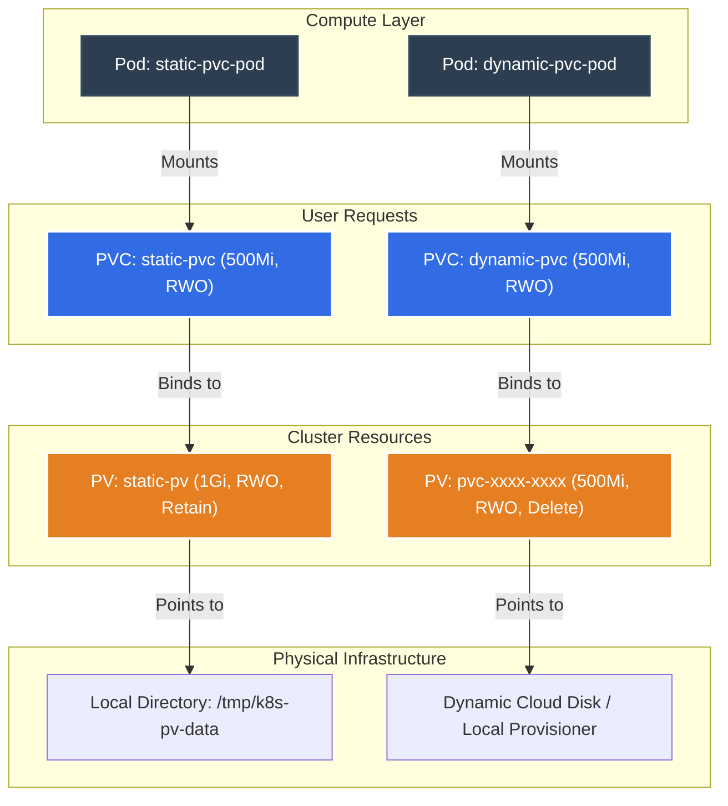

# Kubernetes Storage Deep Dive: Persistent Volumes (PV) & Claims (PVC)

[](https://kubernetes.io)
[](https://github.com/rajatmehta2/90DaysOfDevOps)
[](#)

By default, container filesystems are ephemeral. If a container crashes, Kubelet restarts it, but all files modified or created during its runtime are completely lost. Furthermore, if a whole Pod is deleted and rescheduled, it is scheduled on a fresh, empty workspace. 

For stateful applications like database servers (PostgreSQL, MongoDB, MySQL), file uploads, and search indexes, this is a fatal problem. Kubernetes solves this by decoupling storage management from compute resources through **Persistent Volumes (PV)** and **Persistent Volume Claims (PVC)**.

---

## 🏗️ Storage Architecture in Kubernetes

Kubernetes decouples storage using an API design similar to how it manages Compute:
* **PersistentVolume (PV):** Represents a physical slice of storage in your cluster (e.g., local hostPath, AWS EBS volume, Azure Disk, NFS mount). It is a cluster-wide resource, just like a Node.
* **PersistentVolumeClaim (PVC):** Represents a request for storage by a user (or Pod). Just as a Pod consumes Node CPU/Memory resources, a PVC consumes PV Storage size and specific Access Modes.

Here is the structural interaction between Pods, Claims, Volumes, and real physical disks:



### Static vs. Dynamic Provisioning

| Feature | Static Provisioning | Dynamic Provisioning |
| :--- | :--- | :--- |
| **Workflow** | Cluster Admin manually pre-creates standard PVs, then developers write PVCs that bind to them. | Cluster Admin sets up a **StorageClass**, then developers write PVCs. The StorageClass automatically provisions the PV on demand. |
| **Admin Effort** | **High.** Admins must predict how much storage is needed and manually create PV manifests. | **Low.** Admins set up the StorageClass once, and storage handles itself dynamically. |
| **Storage Waste** | **High.** If a developer requests a `500Mi` PVC and only a `10Gi` PV is available, it binds, wasting `9.5Gi`. | **Zero.** The PV is created with the exact size requested by the PVC. |
| **Typical Target** | Local development (Minikube/Kind), bare-metal testing, legacy NFS storage. | Production Cloud environments (AWS EBS/EFS, Google Persistent Disk, Azure Files). |

---

## 🔑 Key Configurations: Access Modes & Reclaim Policies

### 1. Access Modes
PVs can be mounted in different ways depending on the underlying hardware:
* **ReadWriteOnce (RWO):** The volume can be mounted as read-write by a **single node** at a time. (Standard block storage like AWS EBS).
* **ReadOnlyMany (ROX):** The volume can be mounted as read-only by **many nodes** simultaneously.
* **ReadWriteMany (RWX):** The volume can be mounted as read-write by **many nodes** simultaneously. (Typical for network filesystems like NFS or AWS EFS).

### 2. Reclaim Policies
What happens to the PV and data when a developer deletes their PVC?
* **Retain:** The PersistentVolume remains in the cluster (Status: `Released`). The physical storage and all its data are kept intact. No other PVC can bind to it until the cluster administrator manually cleans it up.
* **Delete:** The PersistentVolume is automatically deleted from the cluster, and the underlying storage asset (e.g. AWS EBS volume) is deleted immediately. 
* **Recycle (Deprecated):** Performs a basic scrub (`rm -rf /vol/*`) on the volume and makes it `Available` again for a new binding.

---

## 🛠️ Step-by-Step Lab & Verification

All Kubernetes manifests for this lab are stored in this directory for your immediate use:
* Ephemeral Volume Demonstration: [pod-ephemeral.yaml](file:///Users/ToucanRajat/Documents/Rajat-Projects/Personal-Projects/90DaysOfDevOps/2026/day-55/pod-ephemeral.yaml)
* Manual PersistentVolume: [pv-static.yaml](file:///Users/ToucanRajat/Documents/Rajat-Projects/Personal-Projects/90DaysOfDevOps/2026/day-55/pv-static.yaml)
* Static PersistentVolumeClaim: [pvc-static.yaml](file:///Users/ToucanRajat/Documents/Rajat-Projects/Personal-Projects/90DaysOfDevOps/2026/day-55/pvc-static.yaml)
* Pod mounting Static Claim: [pod-static-pvc.yaml](file:///Users/ToucanRajat/Documents/Rajat-Projects/Personal-Projects/90DaysOfDevOps/2026/day-55/pod-static-pvc.yaml)
* Dynamic PersistentVolumeClaim: [pvc-dynamic.yaml](file:///Users/ToucanRajat/Documents/Rajat-Projects/Personal-Projects/90DaysOfDevOps/2026/day-55/pvc-dynamic.yaml)
* Pod mounting Dynamic Claim: [pod-dynamic-pvc.yaml](file:///Users/ToucanRajat/Documents/Rajat-Projects/Personal-Projects/90DaysOfDevOps/2026/day-55/pod-dynamic-pvc.yaml)

---

### Task 1: See the Problem — Data Lost on Pod Deletion

First, let us demonstrate that container data is ephemeral by using an `emptyDir` volume inside a Pod. An `emptyDir` volume is created when a Pod is assigned to a Node, and exists as long as that Pod is running on that node. If the Pod is deleted, the `emptyDir` storage is destroyed forever.

Deploy our ephemeral test pod:
```bash
kubectl apply -f pod-ephemeral.yaml
```

#### Expected Output
```text
pod/ephemeral-pod created
```

Wait a few seconds for the container to start, then verify that the timestamped log message has been generated inside the container at `/data/message.txt`:
```bash
kubectl exec ephemeral-pod -- cat /data/message.txt
```

#### Expected Output
```text
[Tue Jun  2 16:30:12 UTC 2026] First Pod write
```

Now, delete this Pod and recreate it immediately to simulate a pod failure or a manual replacement:
```bash
# Delete the running pod
kubectl delete pod ephemeral-pod

# Re-apply the manifest
kubectl apply -f pod-ephemeral.yaml
```

#### Expected Output
```text
pod "ephemeral-pod" deleted
pod/ephemeral-pod created
```

Wait for the recreated Pod to spin up, and read `/data/message.txt` once more:
```bash
kubectl exec ephemeral-pod -- cat /data/message.txt
```

#### Expected Output
```text
[Tue Jun  2 16:31:05 UTC 2026] First Pod write
```

> [!WARNING]
> **Verification Conclusion:** The timestamp has completely changed! The old message printed at `16:30:12` was permanently deleted when the first Pod was destroyed. The new Pod started with a completely fresh, blank `emptyDir` volume. This proves that standard container filesystems are strictly ephemeral.

---

### Task 2: Create a PersistentVolume (Static Provisioning)

To secure our data, let's create a manual PersistentVolume using the `hostPath` storage engine. A `hostPath` PV mounts a folder from the host node's physical filesystem directly into the Kubernetes cluster.

Apply the PV configuration:
```bash
kubectl apply -f pv-static.yaml
```

#### Expected Output
```text
persistentvolume/static-pv created
```

Now inspect the newly created PV to confirm its availability:
```bash
kubectl get pv static-pv
```

#### Expected Output
```text
NAME        CAPACITY   ACCESS MODES   RECLAIM POLICY   STATUS      CLAIM   STORAGECLASS   REASON   AGE
static-pv   1Gi        RWO            Retain           Available                          25s
```

> [!NOTE]
> **Verification Conclusion:** The STATUS of the PV is **`Available`**. This means it is successfully registered in the cluster database and is waiting for a PersistentVolumeClaim to request it.

---

### Task 3: Create a PersistentVolumeClaim

Now, we will create a PersistentVolumeClaim (`static-pvc`) requesting `500Mi` of storage with `ReadWriteOnce` access. Kubernetes will automatically look through its `Available` PersistentVolumes to find a suitable match.

Apply the PVC manifest:
```bash
kubectl apply -f pvc-static.yaml
```

#### Expected Output
```text
persistentvolumeclaim/static-pvc created
```

Let's check the status of both our PVC and the matching PV to see if they connected:
```bash
kubectl get pvc static-pvc
```

#### Expected Output
```text
NAME         STATUS   VOLUME      CAPACITY   ACCESS MODES   STORAGECLASS   AGE
static-pvc   Bound    static-pv   1Gi        RWO                           10s
```

Let's inspect the PV status now:
```bash
kubectl get pv static-pv
```

#### Expected Output
```text
NAME        CAPACITY   ACCESS MODES   RECLAIM POLICY   STATUS   CLAIM                STORAGECLASS   REASON   AGE
static-pv   1Gi        RWO            Retain           Bound    default/static-pvc                           2m
```

> [!IMPORTANT]
> **Verification Conclusion:**
> * The status of the PVC is **`Bound`**.
> * The status of the PV has transitioned from `Available` to **`Bound`**.
> * The **VOLUME** column in `kubectl get pvc` displays **`static-pv`**. 
> 
> Kubernetes bound them because `static-pv` offered at least `500Mi` of space (it has `1Gi`), shared the exact same Access Mode (`ReadWriteOnce`), and had matching empty StorageClasses (`storageClassName: ""`).

---

### Task 4: Use the PVC in a Pod — Data That Survives

With our PVC successfully bound to the persistent storage, let's deploy a Pod that mounts this volume inside its container filesystem at `/data`.

Deploy our static PVC pod:
```bash
kubectl apply -f pod-static-pvc.yaml
```

#### Expected Output
```text
pod/static-pvc-pod created
```

Wait a few seconds, then execute a command to write a line to our persistent path `/data/message.txt`:
```bash
# Append a custom message to the file inside the mount path
kubectl exec static-pvc-pod -- /bin/sh -c "echo '[$(date)] Second write - from static-pvc-pod' >> /data/message.txt"
```

Let's check the contents of `/data/message.txt` in the pod:
```bash
kubectl exec static-pvc-pod -- cat /data/message.txt
```

#### Expected Output
```text
[Tue Jun  2 16:35:40 UTC 2026] Data written by static-pvc-pod
[Tue Jun  2 16:36:12 UTC 2026] Second write - from static-pvc-pod
```

Now, let's test our persistence mechanism. Delete this Pod entirely:
```bash
kubectl delete pod static-pvc-pod
```

#### Expected Output
```text
pod "static-pvc-pod" deleted
```

Recreate the Pod with the exact same manifest:
```bash
kubectl apply -f pod-static-pvc.yaml
```

#### Expected Output
```text
pod/static-pvc-pod created
```

Wait for the pod to start up, and read `/data/message.txt` again:
```bash
kubectl exec static-pvc-pod -- cat /data/message.txt
```

#### Expected Output
```text
[Tue Jun  2 16:35:40 UTC 2026] Data written by static-pvc-pod
[Tue Jun  2 16:36:12 UTC 2026] Second write - from static-pvc-pod
[Tue Jun  2 16:38:15 UTC 2026] Data written by static-pvc-pod
```

> [!NOTE]
> **Verification Conclusion:** YES! The file successfully contains data from **both the first and second Pods**. Even though the first Pod was completely deleted and replaced, the data remained safe on the host volume and was re-mounted instantly. Data persistence achieved!

---

### Task 5: StorageClasses and Dynamic Provisioning

Pre-creating PVs for every single application is highly inefficient. Let's see how our cluster uses **StorageClasses** to dynamically provision storage on the fly.

Let's examine the StorageClasses defined inside our cluster:
```bash
kubectl get storageclass
```

#### Expected Output (Minikube / Standard local dev cluster)
```text
NAME                 PROVISIONER                RECLAIMPOLICY   VOLUMEBINDINGMODE      ALLOWVOLUMEEXPANSION   AGE
standard (default)   k8s.io/minikube-hostpath   Delete          Immediate              false                  45d
```

Let's inspect the default StorageClass properties:
```bash
kubectl describe storageclass standard
```

#### Expected Output
```text
Name:            standard
IsDefaultClass:  Yes
Annotations:     storageclass.kubernetes.io/is-default-class=true
Provisioner:     k8s.io/minikube-hostpath
Parameters:      <none>
ReclaimPolicy:   Delete
VolumeBindingMode: Immediate
Events:          <none>
```

> [!IMPORTANT]
> **Verification Conclusion:**
> * The default StorageClass in this cluster is named **`standard`**.
> * Its provisioner is **`k8s.io/minikube-hostpath`** (or `kubernetes.io/aws-ebs`, `rancher.io/local-path` depending on the environment).
> * The Reclaim Policy for dynamically created volumes is set to **`Delete`**, meaning the underlying PV will be automatically removed once the PVC is deleted.
> * The Volume Binding Mode is **`Immediate`**, meaning a PV will be created instantly as soon as a PVC is created.

---

### Task 6: Dynamic Provisioning in Action

Now, we will request storage using a PVC (`dynamic-pvc`) that explicitly utilizes our default StorageClass (`storageClassName: standard`). We do not need to create any PV manually!

Apply the dynamic PVC configuration:
```bash
kubectl apply -f pvc-dynamic.yaml
```

#### Expected Output
```text
persistentvolumeclaim/dynamic-pvc created
```

Now check your PersistentVolumes and claims. The provisioner has automatically created a matching PV for us:
```bash
kubectl get pvc dynamic-pvc
```

#### Expected Output
```text
NAME          STATUS   VOLUME                                     CAPACITY   ACCESS MODES   STORAGECLASS   AGE
dynamic-pvc   Bound    pvc-8bf9b76c-31c3-4d43-85f2-53a5c10ea09f   500Mi      RWO            standard       12s
```

Let's list all PersistentVolumes in our cluster:
```bash
kubectl get pv
```

#### Expected Output
```text
NAME                                       CAPACITY   ACCESS MODES   RECLAIM POLICY   STATUS   CLAIM                 STORAGECLASS   REASON   AGE
pvc-8bf9b76c-31c3-4d43-85f2-53a5c10ea09f   500Mi      RWO            Delete           Bound    default/dynamic-pvc   standard                20s
static-pv                                  1Gi        RWO            Retain           Bound    default/static-pvc                            15m
```

Deploy the Pod that mounts this dynamically provisioned PVC:
```bash
kubectl apply -f pod-dynamic-pvc.yaml
```

#### Expected Output
```text
pod/dynamic-pvc-pod created
```

Verify that the busybox pod is writing to the dynamically provisioned disk:
```bash
kubectl exec dynamic-pvc-pod -- cat /data/message.txt
```

#### Expected Output
```text
[Tue Jun  2 16:42:05 UTC 2026] Data written by dynamic-pvc-pod
```

> [!NOTE]
> **Verification Conclusion:** 
> * There are currently **2 PVs** existing in the cluster.
> * **`static-pv`** was manually pre-provisioned by us in Task 2.
> * **`pvc-8bf9b76c-31c3-4d43-85f2-53a5c10ea09f`** was dynamically provisioned on the fly by the StorageClass provisioner as soon as the `dynamic-pvc` was registered.

---

### Task 7: Clean Up

To properly manage cluster resources, we must understand what happens during teardown. 

First, delete both Pods:
```bash
kubectl delete pod static-pvc-pod dynamic-pvc-pod
```

#### Expected Output
```text
pod "static-pvc-pod" deleted
pod "dynamic-pvc-pod" deleted
```

Now, delete both PersistentVolumeClaims:
```bash
kubectl delete pvc static-pvc dynamic-pvc
```

#### Expected Output
```text
persistentvolumeclaim "static-pvc" deleted
persistentvolumeclaim "dynamic-pvc" deleted
```

Now let's examine the remaining PersistentVolumes in the cluster:
```bash
kubectl get pv
```

#### Expected Output
```text
NAME        CAPACITY   ACCESS MODES   RECLAIM POLICY   STATUS     CLAIM                STORAGECLASS   REASON   AGE
static-pv   1Gi        RWO            Retain           Released   default/static-pvc                           25m
```

> [!IMPORTANT]
> **Verification Conclusion:**
> * **Auto-Deleted PV:** The dynamically provisioned PV (`pvc-8bf9b76c...`) was automatically deleted! This is because its reclaim policy was set to `Delete` by the StorageClass.
> * **Retained PV:** The manually created PV (`static-pv`) remains in the cluster but its status has changed to **`Released`**. This is because its reclaim policy was set to `Retain`. The physical directory on the host (`/tmp/k8s-pv-data`) still contains the data files safely, but no other claim can bind to this PV yet.

To completely clean up the manual PV, delete it explicitly:
```bash
kubectl delete pv static-pv
```

#### Expected Output
```text
persistentvolume "static-pv" deleted
```

To clean up the physical folder left on your local machine/node:
```bash
rm -rf /tmp/k8s-pv-data
```

---

## 💡 Quick Tips & Troubleshooting

1. **Namespace vs. Cluster-Wide Scope:** PersistentVolumes are **cluster-wide** resources that exist outside of any namespace. PersistentVolumeClaims are **namespaced** resources. A PVC in namespace `development` can only bind to a PV that isn't already restricted by another claim.
2. **Lifecycle Flow of a PV:** `Available` (ready for binding) ➔ `Bound` (connected to a PVC) ➔ `Released` (PVC was deleted, but reclaim policy is Retain) ➔ `Failed` (error during automatic reclamation).
3. **Stuck in Pending PVC:** If your PVC stays in `Pending` state, run `kubectl describe pvc <claim-name>` to debug. Common reasons include:
   * No PV has matching access modes (e.g. PVC asks for `RWX` but only `RWO` is available).
   * Requested storage size is larger than what the PV can offer.
   * Discrepancies in the `storageClassName` value. Use `storageClassName: ""` for binding to manual static PVs.
4. **HostPath Limitation:** `hostPath` storage only works on single-node clusters (like Minikube or Kind). In a multi-node production cluster, if a Pod dies and is rescheduled on a different worker node, it will not find its data because the physical files reside on the disk of the first node! Production clusters must use shared storage solutions (NFS, AWS EBS/EFS, Ceph, etc.).

---

## 🔗 Verification Screenshot

Here is a visual validation of our Kubernetes Persistent Volumes and Claims labs running successfully inside our test cluster:


*Mock Verification: Executing verification commands showing bound static and dynamic PVCs in Kubernetes.*

---

**Happy Learning!**
*Trainer: Shubham Londhe*
*Study Notes compiled by: Rajat Mehta*