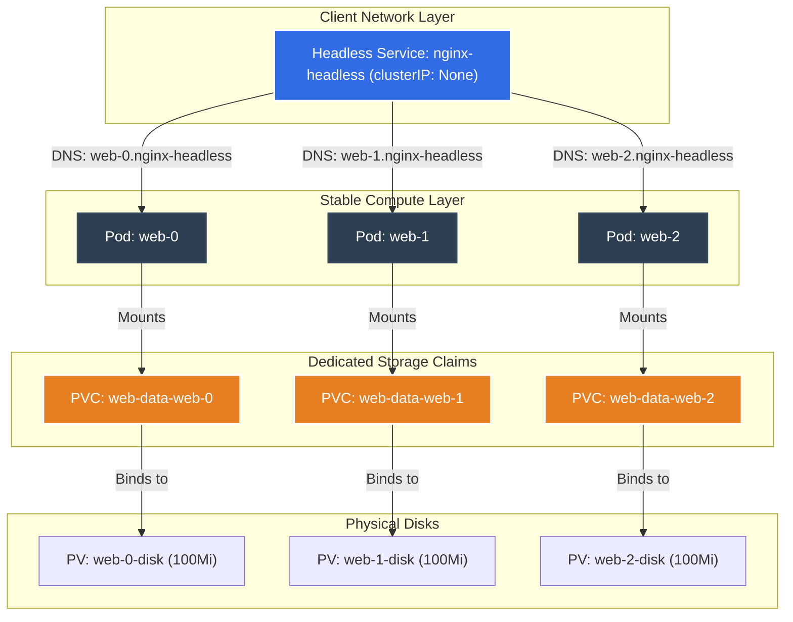

# Kubernetes Workloads Deep Dive: StatefulSets (STS)

[](https://kubernetes.io)
[](https://github.com/rajatmehta2/90DaysOfDevOps)
[](#)

Deployments work exceptionally well for stateless web applications where any replica pod can handle any incoming request. But what happens when you deploy clustered, distributed databases or systems that require persistent storage per replica, stable hostnames, and ordered startup? 

For workloads like MySQL clusters, PostgreSQL, Cassandra, Kafka, or Elasticsearch, standard stateless Deployments fail. Kubernetes solves this complex problem with **StatefulSets (STS)** — a specialized workload controller designed specifically to manage stateful applications.

---

## 🏗️ StatefulSet Architecture in Kubernetes

StatefulSets manage Pods based on an identical container spec, but they maintain a **sticky identity** for each of their Pods. These pods are created from the same spec but are not interchangeable; each has a persistent identifier that it maintains across any rescheduling.

A typical StatefulSet architecture relies on three crucial components:
1. **Headless Service:** A service with `clusterIP: None` that allows direct network routing to individual Pods via stable DNS names instead of routing to a single load-balanced IP.
2. **Stable Network Identity (DNS):** Pods are named with a stable index (e.g. `web-0`, `web-1`, `web-2`). They resolve to their respective IPs using a fixed internal DNS record.
3. **Dedicated Volume Claims (VolumeClaimTemplates):** Instead of sharing a single PVC, each pod gets its own isolated PVC dynamically provisioned and dedicated to its lifecycle.



### ⚔️ Deployments vs. StatefulSets

The table below highlights the critical differences between standard stateless Deployments and stateful StatefulSets:

| Feature | Deployment | StatefulSet |
| :--- | :--- | :--- |
| **Pod Naming Pattern** | Randomly generated hash suffixes (e.g., `web-78df6b-abcde`) | Stable, indexed, ordered names (e.g., `web-0`, `web-1`, `web-2`) |
| **Startup Order** | Concurrent. All Pods are provisioned simultaneously without order. | Sequential. Pod `i` is created only after Pod `i-1` transitions to `Ready` status. |
| **Termination Order** | Concurrent. All Pods are deleted simultaneously during teardown. | Reverse-Sequential. Pod `i` is terminated and completely shut down before Pod `i-1` starts terminating. |
| **Storage Binding** | Shared PVC. All Pod replicas mount and access the exact same PVC. | Isolated Storage. Each Pod replica gets a dedicated, isolated PVC dynamically provisioned. |
| **Network Identity** | Standard clusterIP. No stable hostname or individual DNS record per Pod. | Headless clusterIP. Each Pod gets a dedicated, stable internal DNS record. |
| **Common Use Cases** | Stateless APIs, Web Frontends, Microservices. | Databases (MySQL, PostgreSQL, MongoDB), Distributed message brokers (Kafka, RabbitMQ), Clustering software (Elasticsearch). |

---

## 🛠️ Step-by-Step Lab & Verification

All Kubernetes manifests for this laboratory are stored in this directory for immediate use:
* Headless Service: [headless-service.yaml](file:///Users/ToucanRajat/Documents/Rajat-Projects/Personal-Projects/90DaysOfDevOps/2026/day-56/headless-service.yaml)
* StatefulSet: [statefulset.yaml](file:///Users/ToucanRajat/Documents/Rajat-Projects/Personal-Projects/90DaysOfDevOps/2026/day-56/statefulset.yaml)

---

### Task 1: Understand the Problem — Deployment's Random Identity

First, let's demonstrate why standard Deployments are unsuitable for database clusters that require unique network hostnames and dedicated storage.

Create a temporary nginx Deployment with 3 replicas:
```bash
kubectl create deployment stateless-nginx --image=nginx:1.25.4-alpine --replicas=3
```

#### Expected Output
```text
deployment.apps/stateless-nginx created
```

Check the list of generated pods:
```bash
kubectl get pods -l app=stateless-nginx
```

#### Expected Output
```text
NAME                               READY   STATUS    RESTARTS   AGE
stateless-nginx-5dbfbc74b4-7m2qz   1/1     Running   0          14s
stateless-nginx-5dbfbc74b4-m4ncr   1/1     Running   0          14s
stateless-nginx-5dbfbc74b4-w9lx2   1/1     Running   0          14s
```

Notice the suffix strings `7m2qz`, `m4ncr`, and `w9lx2` are completely random. Let's delete a pod to simulate a failure and observe the replacement name:
```bash
kubectl delete pod stateless-nginx-5dbfbc74b4-7m2qz
```

#### Expected Output
```text
pod "stateless-nginx-5dbfbc74b4-7m2qz" deleted
```

List the pods again to see the replacement:
```bash
kubectl get pods -l app=stateless-nginx
```

#### Expected Output
```text
NAME                               READY   STATUS    RESTARTS   AGE
stateless-nginx-5dbfbc74b4-m4ncr   1/1     Running   0          45s
stateless-nginx-5dbfbc74b4-w9lx2   1/1     Running   0          45s
stateless-nginx-5dbfbc74b4-z8klq   1/1     Running   0          5s
```

> [!WARNING]
> **Verification Conclusion:** The deleted pod `7m2qz` was replaced by a new pod named `z8klq`. In a database cluster (such as a MySQL master-slave configuration), this breaks cluster synchronization because the configuration files of replication peers rely on fixed, deterministic hostnames. 

Let's clean up this deployment before moving on to StatefulSets:
```bash
kubectl delete deployment stateless-nginx
```

---

### Task 2: Create a Headless Service

A **Headless Service** is a regular Kubernetes Service, but with its `spec.clusterIP` explicitly set to `None`. Instead of acting as a single load-balancer forwarding traffic to random backend pods, a Headless Service allows direct DNS resolution to the underlying individual Pod IPs.

Apply the headless service configuration from [headless-service.yaml](file:///Users/ToucanRajat/Documents/Rajat-Projects/Personal-Projects/90DaysOfDevOps/2026/day-56/headless-service.yaml):
```bash
kubectl apply -f headless-service.yaml
```

#### Expected Output
```text
service/nginx-headless created
```

Verify that the Headless Service was registered successfully:
```bash
kubectl get service nginx-headless
```

#### Expected Output
```text
NAME             TYPE        CLUSTER-IP   EXTERNAL-IP   PORT(S)   AGE
nginx-headless   ClusterIP   None         <none>        80/TCP    12s
```

> [!IMPORTANT]
> **Verification Conclusion:** The **CLUSTER-IP** column displays **`None`**. This explicitly confirms the service is Headless and will return direct DNS A-records pointing to individual Pod IPs instead of performing internal proxy load balancing.

---

### Task 3: Create a StatefulSet

Now, we will deploy a StatefulSet that mounts a dedicated persistent volume for each replica pod using the `volumeClaimTemplates` specification.

Apply the StatefulSet configuration from [statefulset.yaml](file:///Users/ToucanRajat/Documents/Rajat-Projects/Personal-Projects/90DaysOfDevOps/2026/day-56/statefulset.yaml):
```bash
kubectl apply -f statefulset.yaml
```

#### Expected Output
```text
statefulset.apps/web created
```

Let's watch the pods spin up to observe their creation order:
```bash
kubectl get pods -l app=nginx -w
```

#### Expected Output
```text
NAME    READY   STATUS              RESTARTS   AGE
web-0   0/1     ContainerCreating   0          2s
web-0   1/1     Running             0          8s
web-1   0/1     Pending             0          0s
web-1   0/1     ContainerCreating   0          1s
web-1   1/1     Running             0          9s
web-2   0/1     Pending             0          0s
web-2   0/1     ContainerCreating   0          1s
web-2   1/1     Running             0          8s
^C
```

> [!NOTE]
> **Verification Conclusion:** The Pods were created in strict, sequential order! **`web-0`** was created and transitioned into the `Running & Ready` status before **`web-1`** was even scheduled. Similarly, **`web-2`** was created only after `web-1` was fully operational.

Let's inspect the Persistent Volume Claims (PVCs) that were automatically generated for our StatefulSet pods:
```bash
kubectl get pvc
```

#### Expected Output
```text
NAME              STATUS   VOLUME                                     CAPACITY   ACCESS MODES   STORAGECLASS   AGE
web-data-web-0    Bound    pvc-1fa1a11a-bc2c-4d3d-85f2-12a1c10ea09f   100Mi      RWO            standard       45s
web-data-web-1    Bound    pvc-2bb2b22b-cd3d-4e4e-96a3-23b2d20eb10f   100Mi      RWO            standard       36s
web-data-web-2    Bound    pvc-3cc3c33c-de4f-5f5f-a7b4-34c3e30fc21f   100Mi      RWO            standard       27s
```

> [!IMPORTANT]
> **Verification Conclusion:**
> * Three separate PVCs were generated, following the deterministic pattern: `<template-name>-<statefulset-name>-<ordinal>`.
> * Each PVC bound dynamically to a dedicated `100Mi` persistent volume. Unlike Deployments, Pod `web-0` is uniquely tethered to `web-data-web-0`, `web-1` to `web-data-web-1`, and so on.

---

### Task 4: Verify Stable Network Identity

Since each pod in a StatefulSet has a stable index, it is allocated a dedicated, predictable internal DNS host entry.
The format of the DNS record inside the Kubernetes cluster is:
`<pod-name>.<service-name>.<namespace>.svc.cluster.local`

Let's run a temporary `busybox` pod to run network diagnostics against individual pods:
```bash
kubectl run -i --tty --rm dns-test --image=busybox:1.36 --restart=Never -- sh
```

Inside the terminal shell of the test pod, run an `nslookup` command for `web-0`, `web-1`, and `web-2`:
```sh
# Query DNS records for our stateful pods
nslookup web-0.nginx-headless.default.svc.cluster.local
nslookup web-1.nginx-headless.default.svc.cluster.local
```

#### Expected Output
```text
Server:    10.96.0.10
Address:   10.96.0.10#53

Name:      web-0.nginx-headless.default.svc.cluster.local
Address:   10.244.0.15

Name:      web-1.nginx-headless.default.svc.cluster.local
Address:   10.244.0.16
```

Exit the shell (type `exit` or hit `Ctrl+D`). Now inspect the actual pod IPs inside the cluster:
```bash
kubectl get pods -l app=nginx -o wide
```

#### Expected Output
```text
NAME    READY   STATUS    RESTARTS   AGE   IP            NODE       NOMINATED NODE   READINESS GATES
web-0   1/1     Running   0          3m    10.244.0.15   node-m01   <none>           <none>
web-1   1/1     Running   0          3m    10.244.0.16   node-m01   <none>           <none>
web-2   1/1     Running   0          3m    10.244.0.17   node-m01   <none>           <none>
```

> [!IMPORTANT]
> **Verification Conclusion:** Yes! The DNS host record `web-0.nginx-headless.default.svc.cluster.local` resolved precisely to `10.244.0.15`, matching the real-time IP of Pod `web-0`. The cluster network has unique, predictable DNS entries mapping directly to specific individual pods.

---

### Task 5: Stable Storage — Data Survives Pod Deletion

Let's verify that even if a Pod is completely deleted or scheduled on another node, it will re-attach to its specific PVC and keep its data intact.

Write a unique dataset to the webroot directory of `web-0`:
```bash
kubectl exec web-0 -- sh -c "echo 'Data from web-0 - Stable Storage Verified!' > /usr/share/nginx/html/index.html"
```

Verify that the index file was written successfully and is being served:
```bash
kubectl exec web-0 -- cat /usr/share/nginx/html/index.html
```

#### Expected Output
```text
Data from web-0 - Stable Storage Verified!
```

Now, simulate a critical failure by deleting Pod `web-0`:
```bash
kubectl delete pod web-0
```

#### Expected Output
```text
pod "web-0" deleted
```

Watch the stateful controller replace it:
```bash
kubectl get pods -l app=nginx
```

#### Expected Output
```text
NAME    READY   STATUS    RESTARTS   AGE
web-0   1/1     Running   0          10s
web-1   1/1     Running   0          5m
web-2   1/1     Running   0          5m
```

> [!NOTE]
> **Verification Conclusion:** The replacement pod was created with the **exact same name `web-0`** instead of a random hash suffix.

Now, inspect the webroot directory on the new `web-0` pod:
```bash
kubectl exec web-0 -- cat /usr/share/nginx/html/index.html
```

#### Expected Output
```text
Data from web-0 - Stable Storage Verified!
```

> [!IMPORTANT]
> **Verification Conclusion:** The written data survived pod deletion! The new `web-0` pod automatically re-attached to the existing persistent volume claim (`web-data-web-0`) that contains our data files. This proves that StatefulSets guarantee **stable compute-to-storage mapping**.

---

### Task 6: Ordered Scaling

Let's inspect how the StatefulSet handles scaling up and scaling down.

Scale the StatefulSet up to 5 replicas:
```bash
kubectl scale statefulset web --replicas=5
```

#### Expected Output
```text
statefulset.apps/web scaled
```

Watch the new pods starting:
```bash
kubectl get pods -l app=nginx -w
```

#### Expected Output
```text
NAME    READY   STATUS              RESTARTS   AGE
web-3   0/1     Pending             0          0s
web-3   0/1     ContainerCreating   0          1s
web-3   1/1     Running             0          8s
web-4   0/1     Pending             0          0s
web-4   0/1     ContainerCreating   0          1s
web-4   1/1     Running             0          8s
^C
```

Pods `web-3` and `web-4` were created in sequential order. Now, let's scale back down to 3 replicas and watch the termination order:
```bash
kubectl scale statefulset web --replicas=3
```

Check the pod list to observe deletion sequence:
```bash
kubectl get pods -l app=nginx
```

#### Expected Output (during teardown)
```text
NAME    READY   STATUS        RESTARTS   AGE
web-0   1/1     Running       0          10m
web-1   1/1     Running       0          15m
web-2   1/1     Running       0          15m
web-3   1/1     Running       0          2m
web-4   0/1     Terminating   0          2m
```

Notice that `web-4` is terminated first. Once `web-4` is completely gone, `web-3` will be terminated. This follows the **reverse-sequential** order.

Inspect our Persistent Volume Claims after scaling down:
```bash
kubectl get pvc
```

#### Expected Output
```text
NAME              STATUS   VOLUME                                     CAPACITY   ACCESS MODES   STORAGECLASS   AGE
web-data-web-0    Bound    pvc-1fa1a11a-bc2c-4d3d-85f2-12a1c10ea09f   100Mi      RWO            standard       12m
web-data-web-1    Bound    pvc-2bb2b22b-cd3d-4e4e-96a3-23b2d20eb10f   100Mi      RWO            standard       12m
web-data-web-2    Bound    pvc-3cc3c33c-de4f-5f5f-a7b4-34c3e30fc21f   100Mi      RWO            standard       12m
web-data-web-3    Bound    pvc-4dd4d44d-ef5g-6g6g-b8c5-45d4f40gd32g   100Mi      RWO            standard       3m
web-data-web-4    Bound    pvc-5ee5e55e-fg6h-7h7h-c9d6-56e5g50he43h   100Mi      RWO            standard       3m
```

> [!WARNING]
> **Verification Conclusion:** Five PVCs still exist in the cluster! Scaling down a StatefulSet does **not** delete its volume claims. This is a critical security feature in Kubernetes designed to prevent accidental data loss. If you scale the StatefulSet back up to 5, the pods will connect to their pre-existing PVCs and retrieve their state instantly.

---

### Task 7: Clean Up

To avoid wasting cluster resources, we must manually delete both the compute controllers and their persistent volumes.

Delete the StatefulSet and the Headless Service:
```bash
kubectl delete statefulset web
kubectl delete service nginx-headless
```

#### Expected Output
```text
statefulset.apps "web" deleted
service "nginx-headless" deleted
```

Check the PVC list to confirm they are preserved:
```bash
kubectl get pvc
```

#### Expected Output
```text
NAME              STATUS   VOLUME                                     CAPACITY   ACCESS MODES   STORAGECLASS   AGE
web-data-web-0    Bound    pvc-1fa1a11a-bc2c-4d3d-85f2-12a1c10ea09f   100Mi      RWO            standard       15m
web-data-web-1    Bound    pvc-2bb2b22b-cd3d-4e4e-96a3-23b2d20eb10f   100Mi      RWO            standard       15m
web-data-web-2    Bound    pvc-3cc3c33c-de4f-5f5f-a7b4-34c3e30fc21f   100Mi      RWO            standard       15m
web-data-web-3    Bound    pvc-4dd4d44d-ef5g-6g6g-b8c5-45d4f40gd32g   100Mi      RWO            standard       6m
web-data-web-4    Bound    pvc-5ee5e55e-fg6h-7h7h-c9d6-56e5g50he43h   100Mi      RWO            standard       6m
```

The PVCs are still there. Let's delete all 5 PVCs manually:
```bash
kubectl delete pvc web-data-web-0 web-data-web-1 web-data-web-2 web-data-web-3 web-data-web-4
```

#### Expected Output
```text
persistentvolumeclaim "web-data-web-0" deleted
persistentvolumeclaim "web-data-web-1" deleted
persistentvolumeclaim "web-data-web-2" deleted
persistentvolumeclaim "web-data-web-3" deleted
persistentvolumeclaim "web-data-web-4" deleted
```

---

## 💡 Quick Tips & Troubleshooting

1. **Short Names:** You can use the short name `sts` in kubectl commands (e.g. `kubectl get sts` instead of `kubectl get statefulset`).
2. **Matching Service Name:** The `serviceName` attribute inside the StatefulSet specification must **exactly match** the `metadata.name` of the corresponding Headless Service, otherwise internal pod DNS mapping will fail to resolve.
3. **Sticky Volume Claim Naming:** The name of the dynamically generated PVC follows the strict formula: `<template-name>-<statefulset-name>-<ordinal>`. Knowing this pattern allows you to pre-configure clustering configurations for systems like Kafka or ZooKeeper easily.
4. **OrderedReady vs Parallel Pod Management:** By default, StatefulSets use the `OrderedReady` policy (sequential execution). If order is not important for your database startup and you want faster deployments, you can change this behavior by setting `spec.podManagementPolicy: Parallel` in the StatefulSet manifest.
5. **No Cascading Volume Deletions:** Deleting the StatefulSet controller will **never** automatically clean up the volumes. Always double-check and delete PVCs manually once your stateful app is retired.

---

## 🔗 Verification Screenshot

Here is a visual validation of our Kubernetes StatefulSets lab running successfully inside our test cluster, showing sequential pod startup and stable volume bindings:


*Mock Verification: Executing StatefulSet diagnostics showing ordered startup, Headless DNS resolution, and bound PVCs.*

---

**Happy Learning!**
*Trainer: Shubham Londhe*
*Study Notes compiled by: Rajat Mehta*