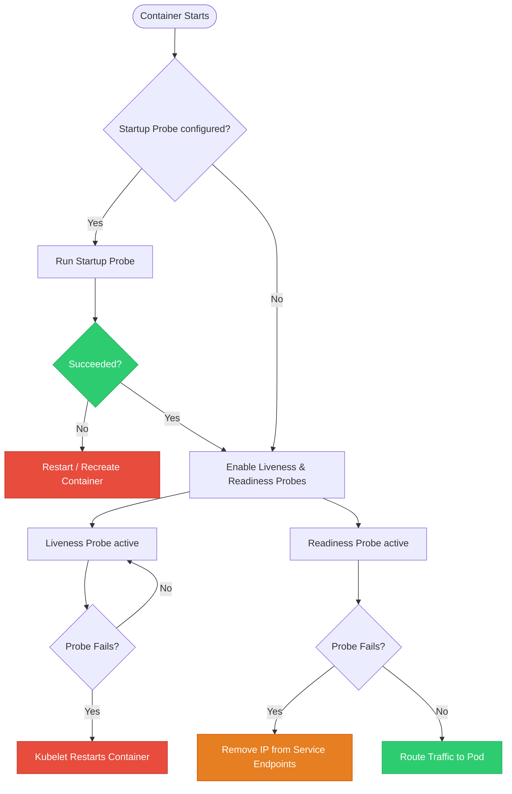

# Kubernetes Resource Management & Self-Healing: Requests, Limits, and Probes

[](https://kubernetes.io)
[](https://github.com/rajatmehta2/90DaysOfDevOps)
[](#)

Deploying applications in Kubernetes is only the first step. To ensure a highly resilient, reliable production environment, Kubernetes needs to understand exactly how many hardware resources (CPU and Memory) your containers require, and it needs a mechanism to actively monitor whether your applications are healthy, ready to receive traffic, or deadlocked.

Today, we dive into **Kubernetes Resource Management** (Requests, Limits, and QoS classes) and **Self-Healing Probes** (Liveness, Readiness, and Startup). Setting these correctly prevents resource starvation, avoids cascading node failures, and empowers Kubernetes to automatically detect and repair runtime failures.

---

## 🏗️ Core Architectural Concepts

### 1. Resource Requests vs. Resource Limits

Kubernetes differentiates between the absolute minimum resources a container needs to run and the absolute maximum it is allowed to consume.

```mermaid
gantt
    title Resource Allocation Boundary
    dateFormat  X
    axisFormat %s
    section CPU/Memory
    Requests (Scheduler Placement Guarantee) :active, 0, 100
    Burstable Burst Range (Throttling / OOM Hazard) :crit, 100, 250
    Limits (Hard Enforced Boundary) : 250, 255
```



* **Resource Requests (Minimum Guarantee):** 
  The amount of CPU or memory that Kubernetes **guarantees** to allocate to the container. The Kubernetes Scheduler uses this value during the placement phase to determine which worker node has sufficient unreserved capacity to run the Pod.
* **Resource Limits (Maximum Allowed):** 
  The **hard ceiling** of CPU or memory that a container is allowed to consume at runtime. The host operating system's kernel enforces these limits via Linux Control Groups (`cgroups`).

#### How Kubernetes Handles Over-Limit Behavior:
* **CPU is a "Compressible" resource:** If a container exceeds its CPU limit, Kubernetes does **not** kill it. Instead, the kernel throttles the container's CPU shares. The container will run slower, but it will keep running.
* **Memory is an "Incompressible" resource:** If a container exceeds its memory limit, it cannot be throttled. Instead, the Linux kernel terminates the container immediately to protect the host node. This is known as an **OOMKilled** (Out of Memory Killed) event.

---

### 2. Understanding Quality of Service (QoS) Classes

Based on how you define your Pod's resource requests and limits, Kubernetes automatically assigns one of three **QoS Classes**. The QoS class determines the scheduling priority and the order in which pods are evicted during node resource pressure:

| QoS Class | Resource Configuration | Scheduling Priority & Eviction Order |
| :--- | :--- | :--- |
| **Guaranteed** | **Requests == Limits** for both CPU and Memory in all containers. | **Highest Priority.** These Pods are the last to be evicted during resource crises, ensuring database and core system safety. |
| **Burstable** | **Requests < Limits** (or only one is set). | **Medium Priority.** Pods can burst beyond their request levels up to their limit. They are evicted before Guaranteed pods but after BestEffort pods. |
| **BestEffort** | **No requests and no limits** are set in any container. | **Lowest Priority.** The pod gets whatever idle resources are left on the host. These are the very first pods terminated when a node runs out of memory. |

---

### 3. Application Health Probes

Probes are diagnostic actions performed periodically by the `kubelet` on a container. They are the backbone of Kubernetes' self-healing capability.



Kubernetes provides **three types of probes**, each serving a highly distinct purpose:

1. **Startup Probe:**
   Checks if the application inside the container has successfully booted. All other probes (liveness/readiness) are disabled until the startup probe succeeds. This prevents slow-starting legacy apps from being killed by the liveness probe before they finish booting.
2. **Liveness Probe:**
   Checks if the container is still running and responsive. If the liveness probe fails (e.g., due to a deadlock or crash), the kubelet kills the container and initiates a restart according to the Pod's restart policy.
3. **Readiness Probe:**
   Checks if the container is ready to accept incoming network traffic. If the readiness probe fails (e.g., due to database connectivity loss), the Pod IP is immediately removed from the backend endpoints of all matching Kubernetes Services. **The container is NOT restarted.**

---

## 🛠️ Step-by-Step Lab & Verification

All Kubernetes manifests for this laboratory are stored in this directory for immediate use:
* Task 1 Manifest: [resource-demo-pod.yaml](file:///Users/ToucanRajat/Documents/Rajat-Projects/Personal-Projects/90DaysOfDevOps/2026/day-57/resource-demo-pod.yaml)
* Task 2 Manifest: [oom-stress-pod.yaml](file:///Users/ToucanRajat/Documents/Rajat-Projects/Personal-Projects/90DaysOfDevOps/2026/day-57/oom-stress-pod.yaml)
* Task 3 Manifest: [pending-pod.yaml](file:///Users/ToucanRajat/Documents/Rajat-Projects/Personal-Projects/90DaysOfDevOps/2026/day-57/pending-pod.yaml)
* Task 4 Manifest: [liveness-pod.yaml](file:///Users/ToucanRajat/Documents/Rajat-Projects/Personal-Projects/90DaysOfDevOps/2026/day-57/liveness-pod.yaml)
* Task 5 Manifest: [readiness-pod.yaml](file:///Users/ToucanRajat/Documents/Rajat-Projects/Personal-Projects/90DaysOfDevOps/2026/day-57/readiness-pod.yaml)
* Task 6 Manifest: [startup-pod.yaml](file:///Users/ToucanRajat/Documents/Rajat-Projects/Personal-Projects/90DaysOfDevOps/2026/day-57/startup-pod.yaml)

---

### Task 1: Setting Resource Requests and Limits (QoS: Burstable)

Let's deploy a standard webserver container with explicit CPU and memory request/limit values.

Apply the manifest [resource-demo-pod.yaml](file:///Users/ToucanRajat/Documents/Rajat-Projects/Personal-Projects/90DaysOfDevOps/2026/day-57/resource-demo-pod.yaml):
```bash
kubectl apply -f resource-demo-pod.yaml
```

#### Expected Output
```text
pod/resource-demo-pod created
```

Inspect the resource reservation and the auto-assigned QoS Class of the Pod:
```bash
kubectl describe pod resource-demo-pod
```

#### Expected Output
```text
Name:             resource-demo-pod
Namespace:        default
Priority:         0
Service Account:  default
Node:             minikube/192.168.49.2
Start Time:       Tue, 02 Jun 2026 16:30:00 +0530
Labels:           app=resource-demo
Annotations:      <none>
Status:           Running
IP:               10.244.0.50
Containers:
  web-container:
    Container ID:   docker://abc123def456...
    Image:          nginx:1.25.4-alpine
    Port:           80/TCP
    Host Port:      0/TCP
    Limits:
      cpu:     250m
      memory:  256Mi
    Requests:
      cpu:     100m
      memory:  128Mi
    Environment: <none>
...
QoS Class:                   Burstable
Node-Selectors:              <none>
Tolerations:                 node.kubernetes.io/not-ready:NoExecute op=Exists for 300s
                             node.kubernetes.io/unreachable:NoExecute op=Exists for 300s
Events:
  Type    Reason     Age   From               Message
  ----    ------     ----  ----               -------
  Normal  Scheduled  12s   default-scheduler  Successfully assigned default/resource-demo-pod to minikube
  Normal  Pulling    11s   kubelet            Pulling image "nginx:1.25.4-alpine"
  Normal  Pulled     8s    kubelet            Successfully pulled image "nginx:1.25.4-alpine" in 3.123s
  Normal  Created    8s    kubelet            Created container web-container
  Normal  Started    8s    kubelet            Started container web-container
```

> [!IMPORTANT]
> **Verification Conclusion:** The QoS class is automatically set to **`Burstable`** because requests are non-zero and are lower than their respective limits. The scheduler guaranteed a minimum of `100m` (0.1 CPU core) and `128Mi` of RAM for scheduling placement, but the host will allow the container to burst up to `250m` CPU and `256Mi` memory under load.

---

### Task 2: Simulating OOMKilled (Exceeding Memory Limits)

Let's configure a stress-testing Pod to deliberately consume more memory than its limit and observe how Kubernetes handles memory violations.

Apply the stress container manifest [oom-stress-pod.yaml](file:///Users/ToucanRajat/Documents/Rajat-Projects/Personal-Projects/90DaysOfDevOps/2026/day-57/oom-stress-pod.yaml):
```bash
kubectl apply -f oom-stress-pod.yaml
```

#### Expected Output
```text
pod/oom-stress-pod created
```

Watch the lifecycle of this container immediately:
```bash
kubectl get pods -w
```

#### Expected Output
```text
NAME             READY   STATUS              RESTARTS   AGE
oom-stress-pod   0/1     ContainerCreating   0          1s
oom-stress-pod   0/1     Running             0          3s
oom-stress-pod   0/1     OOMKilled           0          4s
oom-stress-pod   0/1     CrashLoopBackOff    1 (3s ago) 7s
^C
```

Now inspect the termination details of the Pod:
```bash
kubectl describe pod oom-stress-pod
```

#### Expected Output
```text
Name:             oom-stress-pod
Namespace:        default
Node:             minikube/192.168.49.2
Start Time:       Tue, 02 Jun 2026 16:32:00 +0530
Labels:           app=memory-stress
Status:           Running
Containers:
  stress-container:
    Image:          polinux/stress:latest
    Limits:
      memory:  100Mi
    Requests:
      memory:  50Mi
    State:          Waiting
      Reason:       CrashLoopBackOff
    Last State:     Terminated
      Reason:       OOMKilled
      Exit Code:    137
      Started:      Tue, 02 Jun 2026 16:32:03 +0530
      Finished:     Tue, 02 Jun 2026 16:32:04 +0530
...
Events:
  Type     Reason     Age                From               Message
  ----     ------     ----               ----               -------
  Normal   Scheduled  45s                default-scheduler  Successfully assigned default/oom-stress-pod to minikube
  Normal   Pulling    44s                kubelet            Pulling image "polinux/stress:latest"
  Normal   Pulled     40s                kubelet            Successfully pulled image "polinux/stress:latest" in 4.12s
  Normal   Created    39s (x2 over 40s)  kubelet            Created container stress-container
  Normal   Started    39s (x2 over 40s)  kubelet            Started container stress-container
  Warning  BackOff    8s (x3 over 38s)   kubelet            Back-off restarting failed container
```

> [!WARNING]
> **Verification Conclusion:** The container was forcibly terminated with an **`Exit Code: 137`** and **`Reason: OOMKilled`**. In Linux systems, exit code `137` denotes that a process was killed by the kernel using the `SIGKILL` (signal 9) command because it attempted to allocate more memory (`200M` from stress command args) than the Control Group limit (`100Mi`).

---

### Task 3: Over-allocation & The Pending State

Now, let's explore what happens when we ask Kubernetes to deploy a Pod that requests more hardware resources than the entire cluster combined can offer.

Apply the heavy manifest [pending-pod.yaml](file:///Users/ToucanRajat/Documents/Rajat-Projects/Personal-Projects/90DaysOfDevOps/2026/day-57/pending-pod.yaml):
```bash
kubectl apply -f pending-pod.yaml
```

#### Expected Output
```text
pod/pending-pod created
```

Check the status of the Pod:
```bash
kubectl get pods
```

#### Expected Output
```text
NAME             READY   STATUS             RESTARTS      AGE
oom-stress-pod   0/1     CrashLoopBackOff   4 (85s ago)   3m12s
pending-pod      0/1     Pending            0             15s
```

Let's read the scheduler events to understand why the pod remains in `Pending` state:
```bash
kubectl describe pod pending-pod
```

#### Expected Output
```text
Name:             pending-pod
Namespace:        default
Node:             <none>
Status:           Pending
Labels:           app=heavy-resource
Containers:
  heavy-container:
    Image:      nginx:1.25.4-alpine
    Requests:
      cpu:     100
      memory:  128Gi
    Limits:
      cpu:     100
      memory:  128Gi
...
Events:
  Type     Reason            Age   From               Message
  ----     ------            ----  ----               -------
  Warning  FailedScheduling  32s   default-scheduler  0/1 nodes are available: 1 Insufficient cpu, 1 Insufficient memory. preemption: 0/1 nodes are available: 1 No preemption victims found for incoming pod.
```

> [!IMPORTANT]
> **Verification Conclusion:** The scheduler outputs a **`FailedScheduling`** event indicating `0/1 nodes are available: 1 Insufficient cpu, 1 Insufficient memory`. Since the pod requests a whopping `100` CPU cores and `128Gi` of RAM, no individual worker node in our local cluster has enough unreserved resources, causing the Pod to remain in **`Pending`** status forever.

---

### Task 4: Setting up a Liveness Probe (Self-Healing Restart)

Let's deploy a container that starts successfully, runs fine for 30 seconds, then enters a broken state (by deleting its health check file) to see how the liveness probe triggers a self-healing restart.

Apply the liveness configuration [liveness-pod.yaml](file:///Users/ToucanRajat/Documents/Rajat-Projects/Personal-Projects/90DaysOfDevOps/2026/day-57/liveness-pod.yaml):
```bash
kubectl apply -f liveness-pod.yaml
```

#### Expected Output
```text
pod/liveness-pod created
```

Monitor the Pod continuously:
```bash
kubectl get pod liveness-pod -w
```

#### Expected Output
```text
NAME           READY   STATUS    RESTARTS   AGE
liveness-pod   1/1     Running   0          1s
liveness-pod   1/1     Running   0          35s
liveness-pod   1/1     Running   1 (1s ago) 46s
liveness-pod   1/1     Running   1          70s
liveness-pod   1/1     Running   2 (1s ago) 81s
^C
```

Let's look at the events logs of the liveness pod:
```bash
kubectl describe pod liveness-pod
```

#### Expected Output
```text
Name:             liveness-pod
Namespace:        default
Containers:
  liveness-container:
    Container ID:  docker://def789abc012...
    Image:         busybox:1.36
    Liveness:      exec [cat /tmp/healthy] delay=5s period=5s timeout=1s failure=3
...
Events:
  Type     Reason     Age                From               Message
  ----     ------     ----               ----               -------
  Normal   Scheduled  1m5s               default-scheduler  Successfully assigned default/liveness-pod to minikube
  Normal   Pulling    1m4s               kubelet            Pulling image "busybox:1.36"
  Normal   Pulled     1m2s               kubelet            Successfully pulled image "busybox:1.36" in 2.1s
  Normal   Created    1m2s (x2 over 2m)  kubelet            Created container liveness-container
  Normal   Started    1m2s (x2 over 2m)  kubelet            Started container liveness-container
  Warning  Unhealthy  12s (x6 over 42s)  kubelet            Liveness probe failed: cat: can't open '/tmp/healthy': No such file or directory
  Normal   Killing    12s (x2 over 42s)  kubelet            Container liveness-container failed liveness probe, will be restarted
```

> [!IMPORTANT]
> **Verification Conclusion:** After the `/tmp/healthy` file is deleted (30 seconds post-boot), the liveness probe `cat /tmp/healthy` fails. Once it fails 3 consecutive times (`failureThreshold`), the kubelet outputs a **`Killing`** event, terminates the unresponsive container, and restarts it (incrementing the RESTARTS counter to `1`).

---

### Task 5: Setting up a Readiness Probe (Endpoint Traffic Routing)

Let's configure a webserver exposed behind a Service with a readiness probe. We will simulate a local backend issue to verify that Kubernetes removes the Pod from the load-balancer endpoints without restarting the container.

Apply the Nginx manifest [readiness-pod.yaml](file:///Users/ToucanRajat/Documents/Rajat-Projects/Personal-Projects/90DaysOfDevOps/2026/day-57/readiness-pod.yaml), which creates both the Pod and its exposing Service `readiness-svc`:
```bash
kubectl apply -f readiness-pod.yaml
```

#### Expected Output
```text
pod/readiness-pod created
service/readiness-svc created
```

Wait 10 seconds for the pod to boot and pass its readiness check, then inspect the service endpoints:
```bash
kubectl get pods readiness-pod
kubectl get endpoints readiness-svc
```

#### Expected Output
```text
NAME            READY   STATUS    RESTARTS   AGE
readiness-pod   1/1     Running   0          12s

NAME            ENDPOINTS           AGE
readiness-svc   10.244.0.51:80      12s
```

The Pod IP `10.244.0.51` is registered as a healthy active endpoint. Now, let's break the probe by deleting Nginx's main index file:
```bash
kubectl exec readiness-pod -- rm /usr/share/nginx/html/index.html
```

Wait 12 seconds, then inspect the status of the Pod and the Service Endpoints again:
```bash
kubectl get pods readiness-pod
kubectl get endpoints readiness-svc
```

#### Expected Output
```text
NAME            READY   STATUS    RESTARTS   AGE
readiness-pod   0/1     Running   0          45s

NAME            ENDPOINTS   AGE
readiness-svc   <none>      45s
```

> [!IMPORTANT]
> **Verification Conclusion:** 
> * The Pod's **READY** column changed from **`1/1`** to **`0/1`**, indicating it is not ready to receive traffic.
> * The RESTARTS counter remained **`0`** (verifying that a readiness failure does **not** restart the container).
> * The **ENDPOINTS** column for `readiness-svc` is now empty (**`<none>`**). Any external traffic entering through the service will no longer route to this broken Pod, safeguarding users from HTTP 404 or 500 errors!

---

### Task 6: Setting up a Startup Probe (Handling Slow Boot Sequences)

For applications that take a significant amount of time to load cache, initialize DB tables, or migrate schemas during startup, we configure a Startup Probe.

Apply the startup configuration manifest [startup-pod.yaml](file:///Users/ToucanRajat/Documents/Rajat-Projects/Personal-Projects/90DaysOfDevOps/2026/day-57/startup-pod.yaml):
```bash
kubectl apply -f startup-pod.yaml
```

#### Expected Output
```text
pod/startup-pod created
```

Monitor the startup and liveness progression:
```bash
kubectl get pod startup-pod -w
```

#### Expected Output
```text
NAME          READY   STATUS              RESTARTS   AGE
startup-pod   0/1     ContainerCreating   0          1s
startup-pod   0/1     Running             0          4s
# Startup probe checks /tmp/started every 5 seconds.
# Application sleeps for 20 seconds, meaning first 3 probes fail.
# On 4th probe check (at 20s), /tmp/started is found. Startup probe succeeds!
startup-pod   1/1     Running             0          22s
```

#### Analytical Question: What would happen if `failureThreshold` was 2 instead of 12?
If `failureThreshold` was set to `2` with `periodSeconds: 5`, the Startup Probe would have a total budget of only 10 seconds (`2 * 5`). Since our container script takes 20 seconds to boot (`sleep 20`), the startup probe would fail before the container could touch `/tmp/started`. As a result, the kubelet would kill the container and restart it indefinitely in a failing loop. Giving it a `failureThreshold: 12` ensures a safe 60-second boot window.

---

### Task 7: Cleaning Up

To keep our cluster clean, let's delete all resources provisioned during today's lab:

```bash
kubectl delete pod resource-demo-pod oom-stress-pod pending-pod liveness-pod readiness-pod startup-pod
kubectl delete service readiness-svc
```

#### Expected Output
```text
pod "resource-demo-pod" deleted
pod "oom-stress-pod" deleted
pod "pending-pod" deleted
pod "liveness-pod" deleted
pod "readiness-pod" deleted
pod "startup-pod" deleted
service "readiness-svc" deleted
```

---

## 💡 Quick Tips & Troubleshooting

1. **CPU Throttling Indicator:** If your application is responding slowly or missing SLA windows, check if CPU throttling is occurring. Inspect `/sys/fs/cgroup/cpu/cpu.stat` inside the container or query container metrics (`container_cpu_cfs_throttled_seconds_total`) using Prometheus.
2. **Fast Diagnostic Probe Checks:** You can configure probe handlers using three distinct mechanisms:
   * `httpGet`: Performs an HTTP GET request against the container's IP on a specified port and path. Svc replies with status `200-399` are considered success.
   * `exec`: Runs a custom CLI command within the container. Exit code `0` is success.
   * `tcpSocket`: Checks TCP port connectivity. Successful connection is success.
3. **QoS Eviction Thresholds:** If the node host runs low on resources, the kubelet prioritizes evictions in this order: **BestEffort** pods ➔ **Burstable** pods exceeding requests ➔ **Guaranteed** pods.
4. **Avoid Aggressive Probe Timings:** Setting probe intervals too low (e.g., `periodSeconds: 1` with a `timeoutSeconds: 1`) can overload your container with health checks, creating artificial resource overhead and causing false-positive liveness restarts.

---

## 🔗 Verification Screenshot

Here is a visual validation of our Kubernetes Resource Limits and Health Probes lab running successfully inside our cluster, demonstrating self-healing restarts, QoS burst configurations, and probe-based service routing:


*Mock Verification: Executing resource-limit validations and health probe diagnostics showing liveness restarts and readiness removals.*

---

**Happy Learning!**
*Trainer: Shubham Londhe*
*Study Notes compiled by: Rajat Mehta*