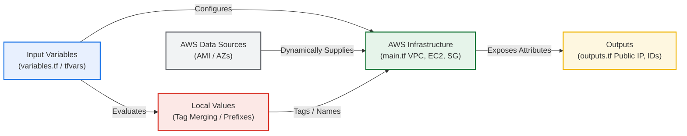

# Day 63: Dynamic Declarations -- Terraform Variables, Outputs, Locals, and Data Sources

[](https://terraform.io)
[](https://aws.amazon.com)
[](https://github.com/rajatmehta2/90DaysOfDevOps)

Welcome to **Day 63** of the 90 Days of DevOps challenge! Yesterday, we successfully designed a fully-connected cloud networking and compute architecture in AWS using Terraform. However, the configurations were heavily restricted by **hardcoded values**—region, CIDR blocks, AMI IDs, instance types, and tag structures. If we wanted to deploy that exact stack in a different AWS region or replicate it for a production environment, the entire setup would break or require high-risk manual replacements.

Today, we take our configuration files from static, one-use blueprints to highly **dynamic, reusable, robust, and environment-aware** deployments. We will leverage **Input Variables**, **Variable Files (`.tfvars`)**, **Output Values**, **Locals**, **Data Sources**, and **Built-in Functions/Conditional Expressions** to build a professional-grade configuration that is ready for enterprise multi-environment rollouts.

---

## 🏗️ Dynamic Configuration Architecture Flow

Below is the dynamic flow showing how inputs, dynamic calculations, and query data sources converge within our core infrastructure configuration to output critical runtime properties.



---

## 🧠 Challenge Tasks & Deep Dive Solutions

### Task 1: Extract Variables (`variables.tf`)

We start by identifying all hardcoded values in our AWS infrastructure code and shifting them to defined **Input Variables** inside a centralized `variables.tf` file. This lets us prompt the user, configure default values, and enforce type safety.

#### 1. Define the Variables Configuration (`variables.tf`)
Create a new file named `variables.tf` in the `day-63/` directory:

```hcl
# ==============================================================================
# DAY 63: VARIABLE DECLARATIONS
# ==============================================================================

variable "region" {
  type        = string
  default     = "ap-south-1"
  description = "The target AWS Region for deployment"
}

variable "vpc_cidr" {
  type        = string
  default     = "10.0.0.0/16"
  description = "CIDR block allocation for the primary VPC"
}

variable "subnet_cidr" {
  type        = string
  default     = "10.0.1.0/24"
  description = "CIDR block allocation for the public Subnet"
}

variable "instance_type" {
  type        = string
  default     = "t2.micro"
  description = "The EC2 Compute instance family sizing"
}

variable "project_name" {
  type        = string
  description = "The parent project name identifier (Explicitly required)"
}

variable "environment" {
  type        = string
  default     = "dev"
  description = "Target environment classification tier"
}

variable "allowed_ports" {
  type        = list(number)
  default     = [22, 80, 443]
  description = "List of TCP ingress ports permitted through firewalls"
}

variable "extra_tags" {
  type        = map(string)
  default     = {}
  description = "Additional key-value pairs to append to standard resources"
}
```

#### 2. Run a Plan Check without Defaults
Because the `project_name` variable has **no default value**, running `terraform plan` or `terraform apply` forces the engine to interactively request the value before completing execution plans.

```bash
terraform plan
```

**Terminal Prompts Output:**
```text
var.project_name
  The parent project name identifier (Explicitly required)

  Enter a value: terraweek

aws_vpc.main: Refreshing state... [id=vpc-0123456789abcdef0]
...
No changes. Your infrastructure matches the configuration.
```

#### 3. Deep Dive: The 5 Variable Types in Terraform
Terraform provides a rich static typing system. The five primary types used in structural variables are:

| Variable Type | Format | Definition / Description | Practical Use Case |
| :--- | :--- | :--- | :--- |
| `string` | `"ap-south-1"` | A sequence of Unicode characters representing plain text. | Storing region names, instance types, AMIs, and environment tiers. |
| `number` | `80` | A numeric integer or fractional value. | Defining port numbers, capacity limits, counts, or timeout durations. |
| `bool` | `true` | A simple boolean state: either `true` or `false`. | Enabling/disabling public IP mappings, DNS hostnames, or cluster monitoring. |
| `list` | `[22, 80, 443]` | An ordered sequence of values of a single type (indexed starting at `0`). | Collecting ingress security group ports or routing targets. |
| `map` | `{ env = "dev" }` | A collection of key-value lookup pairs with unique string keys. | Defining resource tagging matrices or specific regional AMI dictionaries. |

---

### Task 2: Variable Files & Precedence

To scale configurations across distinct developmental environments (like **Development**, **Staging**, and **Production**), we declare variables externally using variable definition files (`.tfvars`) instead of manually providing values during console runs.

#### 1. Define Development Values (`terraform.tfvars`)
By naming this file exactly `terraform.tfvars`, Terraform **automatically loads** these definitions on every execution run without needing command-line flags.

```hcl
project_name  = "terraweek"
environment   = "dev"
instance_type = "t2.micro"
```

#### 2. Define Production Override Values (`prod.tfvars`)
For our staging and production pipelines, we isolate values inside named files like `prod.tfvars`.

```hcl
project_name  = "terraweek"
environment   = "prod"
instance_type = "t3.small"
vpc_cidr      = "10.1.0.0/16"
subnet_cidr   = "10.1.1.0/24"
```

#### 3. Test Variable Override Flows

* **Run Plan using Automatic `terraform.tfvars`:**
  ```bash
  terraform plan
  ```
  *(Uses `t2.micro`, `dev` tags, and `10.0.0.0/16` networks automatically without prompts).*

* **Run Plan targeting Production (`prod.tfvars`):**
  ```bash
  terraform plan -var-file="prod.tfvars"
  ```
  *(Overrides properties to provision a `t3.small` instance inside the isolated `10.1.0.0/16` network).*

* **Command Line Direct Overrides:**
  ```bash
  terraform plan -var="instance_type=t2.nano"
  ```
  *(CLI overrides are useful for testing micro sizing changes dynamically, ignoring the defaults in all files).*

* **Environment Variable Overrides:**
  ```bash
  export TF_VAR_environment="staging"
  terraform plan
  ```
  *(The environment variable `TF_VAR_environment` dynamically overrides the default value in `variables.tf`, but is still overridden by explicit definitions inside a `.tfvars` file).*

#### 4. Master Class: Terraform Variable Precedence Order
When the same variable is configured multiple times across different methods, Terraform resolves collisions using a strict hierarchy. Below is the precedence scale from **Lowest Priority (1)** to **Highest Priority (6)**:

```
  [LOWEST PRIORITY]
    (1) Environment Variables (e.g., TF_VAR_project_name)
     ↓
    (2) The terraform.tfvars File (Loaded automatically)
     ↓
    (3) The terraform.tfvars.json File (Loaded automatically)
     ↓
    (4) Any *.auto.tfvars or *.auto.tfvars.json Files (Loaded alphabetically)
     ↓
    (5) Command-Line Options: -var-file="..." (In order of declaration)
     ↓
    (6) Command-Line Options: -var="..." (In order of declaration)
  [HIGHEST PRIORITY]
```

---

### Task 3: Add Output Declarations (`outputs.tf`)

Output values in Terraform behave similarly to return parameters in traditional coding languages. They expose key infrastructure characteristics to the console upon successful runs, and allow other systems to fetch runtime identifiers (like public IPs or subnet IDs) for scripting.

#### 1. Define Output Declarations (`outputs.tf`)
Create `outputs.tf` in your workspace:

```hcl
# ==============================================================================
# DAY 63: INFRASTRUCTURE METADATA OUTPUTS
# ==============================================================================

output "vpc_id" {
  value       = aws_vpc.main.id
  description = "The system-assigned identifier of the provisioned VPC"
}

output "subnet_id" {
  value       = aws_subnet.public.id
  description = "The system-assigned identifier of the public Subnet"
}

output "instance_id" {
  value       = aws_instance.web_server.id
  description = "The virtual machine EC2 instance identifier"
}

output "instance_public_ip" {
  value       = aws_instance.web_server.public_ip
  description = "The elastic public IP of the virtual machine server"
}

output "instance_public_dns" {
  value       = aws_instance.web_server.public_dns
  description = "The system public Amazon Route53 DNS representation"
}

output "security_group_id" {
  value       = aws_security_group.web_sg.id
  description = "The network firewall security group identifier"
}
```

#### 2. Query Outputs from Terminal Command Line
After performing an infrastructure apply, you can query outputs dynamically using the command line:

* **List all outputs with descriptions and types:**
  ```bash
  terraform output
  ```
  **Output:**
  ```text
  instance_id = "i-0a1b2c3d4e5f67890"
  instance_public_dns = "ec2-13-233-14-12.ap-south-1.compute.amazonaws.com"
  instance_public_ip = "13.233.14.12"
  security_group_id = "sg-0c1d2e3f4a5b6c7d8"
  subnet_id = "subnet-0a1b2c3d4e5f67890"
  vpc_id = "vpc-0123456789abcdef0"
  ```

* **Query a specific parameter (ideal for shell variables):**
  ```bash
  terraform output instance_public_ip
  ```
  **Output:**
  ```text
  "13.233.14.12"
  ```

* **Dump as JSON for pipeline scripts (`jq` / automated tools):**
  ```bash
  terraform output -json
  ```
  **Output:**
  ```json
  {
    "instance_public_ip": {
      "type": "string",
      "value": "13.233.14.12"
    }
  }
  ```

---

### Task 4: Dynamic Looks with Data Sources

Hardcoding structural components—such as specific AMI IDs like `ami-0f5ee92e2d63afc18`—causes immediate pipeline failure when target regions change or AMIs are deprecating. To fix this, we use **Data Sources** to query AWS APIs in real time to fetch valid, up-to-date resources.

#### 1. Define Data Lookups in HCL
Add these blocks to your configuration files:

```hcl
# Query Amazon Web Services for the most recent official Amazon Linux 2 AMI
data "aws_ami" "amazon_linux" {
  most_recent = true
  owners      = ["amazon"]

  filter {
    name   = "name"
    values = ["amzn2-ami-hvm-*-x86_64-gp2"]
  }

  filter {
    name   = "virtualization-type"
    values = ["hvm"]
  }
}

# Fetch all available Availability Zones (AZs) in the current provider region
data "aws_availability_zones" "available" {
  state = "available"
}
```

#### 2. Apply Dynamic Lookups in Compute & Network Allocations
Update the EC2 instance block and Subnet definitions inside `main.tf` to leverage these data lookups dynamically:

```hcl
# Replace hardcoded AMI with our API data source lookup
resource "aws_instance" "web_server" {
  ami           = data.aws_ami.amazon_linux.id
  instance_type = var.instance_type
  # [Remainder of EC2 configuration remains]
}

# Dynamically pin public subnet to the region's first availability zone
resource "aws_subnet" "public" {
  vpc_id            = aws_vpc.main.id
  cidr_block        = var.subnet_cidr
  availability_zone = data.aws_availability_zones.available.names[0]
  # [Remainder of subnet configuration remains]
}
```

#### 3. Deep Dive: Resource vs. Data Source Blocks
It is important to know when to use a resource block versus a data source block.

| Aspect | `resource "aws_instance"` | `data "aws_ami"` |
| :--- | :--- | :--- |
| **Purpose** | Declares intent to **create**, manage, update, or destroy a physical infrastructure component. | **Reads** or queries metadata of existing entities from public/private APIs. |
| **Behavior** | Modifies state by calling AWS API endpoints (e.g. `CreateVpc`, `RunInstances`). | Read-only lookup. Does not add new infrastructure or modify external states. |
| **Execution Order** | Run during the deployment phase after the plan dependency tree is built. | Evaluated primarily during the parsing/plan stage before execution. |

---

### Task 5: Locals for Dynamic Tagging & Clean Prefixes

While variables allow inputting parameters from outside the workspace, **Local Values** evaluate expressions within HCL configurations. Locals act like scoped helper functions or constants, helping you avoid repeating the same tags or names across resources.

#### 1. Declare the Locals Block (`main.tf`)
At the top of `main.tf`, define a dynamic prefix and a dictionary of standard tags:

```hcl
locals {
  # Build a standardized namespace prefix
  name_prefix = "${var.project_name}-${var.environment}"

  # Core tag schema forced across all enterprise resources
  common_tags = {
    Project     = var.project_name
    Environment = var.environment
    ManagedBy   = "Terraform"
    Workspace   = terraform.workspace
  }
}
```

#### 2. Implement Locals & Tag Merges in Resources
Instead of repeating tagging blocks manually, use locals and the built-in `merge()` function to combine common tags with resource-specific tags:

```hcl
# VPC Resource Name Allocation
resource "aws_vpc" "main" {
  cidr_block       = var.vpc_cidr
  instance_tenancy = "default"

  tags = merge(local.common_tags, {
    Name = "${local.name_prefix}-vpc"
  })
}

# Security Group Resource Name Allocation
resource "aws_security_group" "web_sg" {
  name        = "${local.name_prefix}-sg"
  description = "Allows SSH and HTTP traffic into compute tier"
  vpc_id      = aws_vpc.main.id
  
  # [Ingress rules configured dynamically using var.allowed_ports]
  
  tags = merge(local.common_tags, {
    Name = "${local.name_prefix}-security-group"
  })
}

# EC2 Computing Resource Name Allocation
resource "aws_instance" "web_server" {
  ami           = data.aws_ami.amazon_linux.id
  instance_type = var.instance_type
  
  tags = merge(local.common_tags, {
    Name = "${local.name_prefix}-server"
  })
}
```

---

### Task 6: Built-in Functions & Conditional Expressions

Terraform comes with a rich library of built-in functions. These cannot be custom defined, but they allow you to transform lists, handle string parsing, merge directories, or choose values conditionally.

#### 1. Interactive Console Session Testing (`terraform console`)
The `terraform console` command opens an interactive Read-Eval-Print Loop (REPL) environment to quickly test HCL statements:

```bash
terraform console
```

**Console Sessions Logs:**
```text
> upper("terraweek")
"TERRAWEEK"

> join("-", ["terra", "week", "2026"])
"terra-week-2026"

> format("arn:aws:s3:::%s", "my-bucket")
"arn:aws:s3:::my-bucket"

> length(["a", "b", "c"])
3

> lookup({dev = "t2.micro", prod = "t3.small"}, "dev")
"t2.micro"

> toset(["a", "b", "a"])
[
  "a",
  "b",
]

> cidrsubnet("10.0.0.0/16", 8, 1)
"10.0.1.0/24"
```

#### 2. Conditional Expression in Compute Layer
We can choose configuration options dynamically using standard ternary conditional syntax:
`condition ? true_value : false_value`

Let's configure our `instance_type` allocation to automatically provision smaller, cost-effective `t2.micro` instances for development tiers, but scale up to `t3.small` nodes when deployed under `prod` configurations:

```hcl
instance_type = var.environment == "prod" ? "t3.small" : "t2.micro"
```

#### 3. Top 5 Most Useful Built-in Functions
Here are five of the most powerful and commonly used built-in functions in professional Terraform pipelines:

| Function | Signature / Syntax | Description | Example |
| :--- | :--- | :--- | :--- |
| **`merge()`** | `merge(map1, map2, ...)` | Merges multiple input maps into a single, unified map. If duplicate keys exist, the last map takes precedence. | `merge({Env="Dev"}, {Name="VPC"})` yields `{Env="Dev", Name="VPC"}` |
| **`cidrsubnet()`** | `cidrsubnet(prefix, newbits, netnum)` | Calculates a sub-allocated IP address range within a parent CIDR block. | `cidrsubnet("10.0.0.0/16", 8, 1)` yields `"10.0.1.0/24"` |
| **`lookup()`** | `lookup(map, key, default)` | Searches a map for a specific key and returns its value. If the key is not found, it fallback returns the defined default. | `lookup({d="micro"}, "p", "small")` yields `"small"` |
| **`join()`** | `join(separator, list)` | Combines a list of string elements together using the specified separator. | `join("-", ["aws", "dev", "vpc"])` yields `"aws-dev-vpc"` |
| **`coalesce()`** | `coalesce(val1, val2, ...)` | Evaluates a list of arguments in order and returns the first non-null, non-empty string. | `coalesce(null, "", "instance-name")` yields `"instance-name"` |

---

### Variable, Local, Output, and Data Source Comparison

To keep configurations clean, it is important to understand the differences between these four core Terraform block types:

| Concept Block | Read vs Write | Evaluated When | Scope / Visibility | Primary Objective |
| :--- | :--- | :--- | :--- | :--- |
| **`variable "name"`** | **Read-Write** | CLI/Initialization Plan | Global Input | Configures properties externally from file pipelines or terminals. |
| **`local "name"`** | **Read-Only** | Compile Plan stage | File/Module Scoped | Simplifies HCL calculations, avoids duplicate declarations, and creates reusable expressions. |
| **`output "name"`** | **Write-Only** | Run Apply stage | Console / State API | Exposes critical runtime properties to external scripts or console views. |
| **`data "name"`** | **Read-Only** | Plan and execution stage | Cloud Provider | Queries external provider APIs to fetch metadata of existing resources. |

---

## 📸 Lab Visual Validations

To verify these changes in GitHub, drop your screenshot captures into the `day-63/` directory and map them to the placeholders below:

### 1. Terraform Interactive Prompt Verification
Shows that running `terraform plan` successfully halts and prompts the user for the mandatory `project_name` variable because it has no default value.


### 2. Successful Execution Plan (Dev Default)
Displays a successful `terraform plan` output. This run uses the default values from `terraform.tfvars`, preparing the environment to spin up a cost-effective `t2.micro` resource stack.


### 3. Staging / Production Variable Override Plan
Displays the planning sequence when target overrides are loaded using the production configuration file (`prod.tfvars`). This run changes the subnets to `10.1.x.x` and updates compute nodes to `t3.small`.


### 4. Dynamic Lookup of AMIs and AZs
Shows the API logs confirming that Terraform successfully queried AWS regional endpoint metrics to pull the most recent Amazon Linux 2 AMI ID and availability zones.


### 5. Infrastructure Creation Apply with Output Results
Displays the terminal session after running `terraform apply`. This screenshot confirms that all resources are tagged correctly, and shows the outputs printed at the end of the run.


### 6. Interactive HCL Console Verification Session
Displays the `terraform console` terminal session, confirming successful testing of our core string, collection, and subnetting functions.


---

## 💡 Pro DevOps Tips & Best Practices

1. **Avoid Hardcoding Secrets in `.tfvars` Files:** Never commit passwords, database tokens, or AWS access credentials to public Git repositories inside `.tfvars` files. Use environment variables (e.g. `TF_VAR_db_password`) or integrate with key vaults (like HashiCorp Vault or AWS Secrets Manager) via data lookups.
2. **Utilize Variable Validation Blocks:** Keep inputs clean and safe by adding strict validation checks directly within your definitions:
   ```hcl
   variable "instance_type" {
     type = string
     validation {
       condition     = contains(["t2.micro", "t3.micro", "t3.small"], var.instance_type)
       error_message = "Enterprise compliance rules only permit deploying t2.micro, t3.micro, or t3.small instances."
     }
   }
   ```
3. **Organize Environments with Auto-loaded Files:** If you are managing isolated environments, name your files using the `.auto.tfvars` extension (e.g., `dev.auto.tfvars`, `prod.auto.tfvars`). This makes it easy for automated CI/CD tools (like GitHub Actions or GitLab CI) to load correct configurations based on the active branch name.

---

## 📝 Reflection & Key Lessons

* **Configuration Portability:** Parameterizing our configurations makes the codebase incredibly flexible. We can take our entire AWS networking and compute stack and spin up clean, duplicate environments in minutes just by passing a single `-var-file` command.
* **Locals vs. Variables:** Understanding the difference between input variables (external configuration) and local values (internal dynamic evaluation) keeps HCL configurations clean, organized, and dry.
* **Automatic Discovery with Data Sources:** Querying official, stable AMI datasets dynamically ensures that our code remains functional over time. This completely eliminates manual AMI search chores, and keeps our systems up to date.

---

**Happy Learning!**
*Trainer: Shubham Londhe*
*Study Notes compiled by: Rajat Mehta*