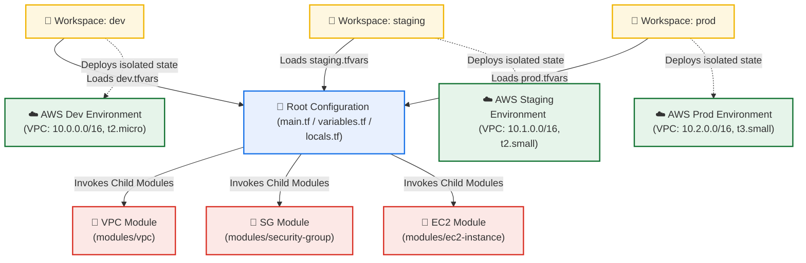

# Day 67: TerraWeek Capstone Project -- Multi-Environment AWS Infrastructure with Workspaces & Custom Modules

[](https://terraform.io)
[](https://aws.amazon.com)
[](https://github.com/rajatmehta2/90DaysOfDevOps)

Welcome to **Day 67** and the grand finale of the **TerraWeek Challenge**! Over the last six days, we explored the fundamentals of Terraform, ranging from basic HCL syntaxes and provider dynamics to complex state management architectures, remote state locking, registry extensions, and automated Kubernetes (EKS) clustering.

Today, we unite all these structural concepts into a single, **production-grade enterprise capstone project**: a **Multi-Environment, Workspace-Isolated AWS Infrastructure** powered by **Custom Modules**.

---

## 🏗️ Architectural Overview & Workspace Isolation Flow

Our goal is to build and manage isolated environments using a **single codebase**. Instead of duplicating configuration directories for each staging tier, we leverage **Terraform Workspaces** and environment-specific **Variable definition files (`*.tfvars`)**. This enforces consistency while isolating the execution states.



---

## 📁 Section 1: Enterprise Directory Structure

To maintain modularity and keep the root workspace clean, child modules are stored within a dedicated `modules/` directory.

### Project Layout
```text
terraweek-capstone/
├── main.tf                     # Root module calls custom child modules
├── variables.tf                # Root variable declarations
├── outputs.tf                  # Root outputs exposing module endpoints
├── providers.tf                # Provider configurations
├── locals.tf                   # Dynamic variables using active workspaces
├── dev.tfvars                  # Development environment specifications
├── staging.tfvars              # Staging environment specifications
├── prod.tfvars                 # Production environment specifications
├── .gitignore                  # Excludes sensitive tfvars and local states
└── modules/                    # Subdirectory housing encapsulated modules
    ├── vpc/
    │   ├── main.tf             # VPC, Subnet, IGW, and Route Tables
    │   ├── variables.tf        # VPC module parameters
    │   └── outputs.tf          # VPC module outputs (Subnet ID, VPC ID)
    ├── security-group/
    │   ├── main.tf             # Dynamic firewall definitions
    │   ├── variables.tf        # SG module parameters
    │   └── outputs.tf          # SG module output (Security Group ID)
    └── ec2-instance/
        ├── main.tf             # Compute resources
        ├── variables.tf        # EC2 module parameters
        └── outputs.tf          # EC2 module outputs (Instance ID, Public IP)
```

### The Root `.gitignore` File
We must prevent active state files, automated lock structures, and localized configurations from leaking into public Git repositories:

```text
# Local .terraform directory containing downloaded providers and modules
.terraform/

# Terraform lock files containing hashes
.terraform.lock.hcl

# Local state files containing active environment state maps
*.tfstate
*.tfstate.*
*.tfstate.backup

# Sensitive variable file definitions containing operational keys or passwords
*.tfvars
*.tfvars.json
```

> [!NOTE]
> **Why is this file structure considered a Best Practice?**
> 1. **Encapsulation & Modularity**: Breaking resources down into distinct directories (`vpc`, `security-group`, `ec2-instance`) creates highly reusable blocks. Changes within one component do not affect other components as long as the inputs and outputs remain stable.
> 2. **Decoupled Configuration**: Keeping the core modules generic and driving their configurations through root variables and `.tfvars` files ensures that the exact same codebase can be used to deploy multiple, completely isolated environments.
> 3. **VCS Security & Cleanliness**: Incorporating a comprehensive `.gitignore` ensures that developer credentials, environment variables, and state definitions (which might contain plaintext passwords or secrets) never get pushed to remote version control systems.

---

## 🛠️ Section 2: Building Custom Child Modules

Our capstone architecture divides components into three highly targeted custom modules.

### 1. The Network Module (`modules/vpc`)

This module builds a secure, public-facing virtual network.

#### 📄 `modules/vpc/variables.tf`
```hcl
variable "cidr" {
  type        = string
  description = "The core Classless Inter-Domain Routing (CIDR) block for the VPC"
}

variable "public_subnet_cidr" {
  type        = string
  description = "The CIDR block allocation for the public subnet tier"
}

variable "environment" {
  type        = string
  description = "The deployment target environment (e.g. dev, staging, prod)"
}

variable "project_name" {
  type        = string
  description = "The logical project identifier prefix"
}
```

#### 📄 `modules/vpc/main.tf`
```hcl
resource "aws_vpc" "main" {
  cidr_block           = var.cidr
  enable_dns_hostnames = true
  enable_dns_support   = true

  tags = {
    Name        = "${var.project_name}-${var.environment}-vpc"
    Environment = var.environment
    Project     = var.project_name
    ManagedBy   = "Terraform"
  }
}

resource "aws_subnet" "public" {
  vpc_id                  = aws_vpc.main.id
  cidr_block              = var.public_subnet_cidr
  map_public_ip_on_launch = true

  tags = {
    Name        = "${var.project_name}-${var.environment}-public-subnet"
    Environment = var.environment
    Project     = var.project_name
    ManagedBy   = "Terraform"
  }
}

resource "aws_internet_gateway" "igw" {
  vpc_id = aws_vpc.main.id

  tags = {
    Name        = "${var.project_name}-${var.environment}-igw"
    Environment = var.environment
    Project     = var.project_name
    ManagedBy   = "Terraform"
  }
}

resource "aws_route_table" "public" {
  vpc_id = aws_vpc.main.id

  route {
    cidr_block = "0.0.0.0/0"
    gateway_id = aws_internet_gateway.igw.id
  }

  tags = {
    Name        = "${var.project_name}-${var.environment}-public-rt"
    Environment = var.environment
    Project     = var.project_name
    ManagedBy   = "Terraform"
  }
}

resource "aws_route_table_association" "public_association" {
  subnet_id      = aws_subnet.public.id
  route_table_id = aws_route_table.public.id
}
```

#### 📄 `modules/vpc/outputs.tf`
```hcl
output "vpc_id" {
  value       = aws_vpc.main.id
  description = "The logical identifier of the provisioned Virtual Private Cloud"
}

output "subnet_id" {
  value       = aws_subnet.public.id
  description = "The logical identifier of the public subnet"
}
```

---

### 2. The Security Module (`modules/security-group`)

This module manages incoming and outgoing network traffic.

#### 📄 `modules/security-group/variables.tf`
```hcl
variable "vpc_id" {
  type        = string
  description = "The target VPC ID where the security group will be created"
}

variable "ingress_ports" {
  type        = list(number)
  description = "A collection of target TCP ports to allow for ingress traffic"
}

variable "environment" {
  type        = string
  description = "The deployment target environment (e.g. dev, staging, prod)"
}

variable "project_name" {
  type        = string
  description = "The logical project identifier prefix"
}
```

#### 📄 `modules/security-group/main.tf`
```hcl
resource "aws_security_group" "web_sg" {
  name        = "${var.project_name}-${var.environment}-sg"
  description = "Allows dynamic traffic on specified ports for ${var.environment}"
  vpc_id      = var.vpc_id

  dynamic "ingress" {
    for_each = var.ingress_ports
    content {
      from_port   = ingress.value
      to_port     = ingress.value
      protocol    = "tcp"
      cidr_blocks = ["0.0.0.0/0"]
    }
  }

  egress {
    from_port        = 0
    to_port          = 0
    protocol         = "-1"
    cidr_blocks      = ["0.0.0.0/0"]
    ipv6_cidr_blocks = ["::/0"]
  }

  tags = {
    Name        = "${var.project_name}-${var.environment}-security-group"
    Environment = var.environment
    Project     = var.project_name
    ManagedBy   = "Terraform"
  }
}
```

#### 📄 `modules/security-group/outputs.tf`
```hcl
output "sg_id" {
  value       = aws_security_group.web_sg.id
  description = "The security group identifier"
}
```

---

### 3. The Compute Module (`modules/ec2-instance`)

This module deploys an EC2 instance with custom tagging.

#### 📄 `modules/ec2-instance/variables.tf`
```hcl
variable "ami_id" {
  type        = string
  description = "The Amazon Machine Image identifier to use for the virtual machine"
}

variable "instance_type" {
  type        = string
  description = "The EC2 instance model type determining CPU and RAM capacities"
}

variable "subnet_id" {
  type        = string
  description = "The target public subnet ID where the EC2 instance will be deployed"
}

variable "security_group_ids" {
  type        = list(string)
  description = "The security groups to attach to the instance network interface"
}

variable "environment" {
  type        = string
  description = "The deployment target environment (e.g. dev, staging, prod)"
}

variable "project_name" {
  type        = string
  description = "The logical project identifier prefix"
}
```

#### 📄 `modules/ec2-instance/main.tf`
```hcl
resource "aws_instance" "server" {
  ami                    = var.ami_id
  instance_type          = var.instance_type
  subnet_id              = var.subnet_id
  vpc_security_group_ids = var.security_group_ids

  tags = {
    Name        = "${var.project_name}-${var.environment}-server"
    Environment = var.environment
    Project     = var.project_name
    ManagedBy   = "Terraform"
  }
}
```

#### 📄 `modules/ec2-instance/outputs.tf`
```hcl
output "instance_id" {
  value       = aws_instance.server.id
  description = "The system-assigned identifier of the EC2 instance"
}

output "public_ip" {
  value       = aws_instance.server.public_ip
  description = "The public IP address assigned to the EC2 instance"
}
```

---

## 🔗 Section 3: Root Module Integration & Workspace Logic

Now, we wire these modules together at the root level using dynamic, workspace-aware configuration files.

### 📄 `providers.tf`
```hcl
terraform {
  required_version = ">= 1.0.0"
  required_providers {
    aws = {
      source  = "hashicorp/aws"
      version = "~> 5.0"
    }
  }
}

provider "aws" {
  region = var.aws_region
}
```

### 📄 `locals.tf`
```hcl
locals {
  # Dynamically evaluate the active workspace (e.g., 'default', 'dev', 'staging', 'prod')
  environment = terraform.workspace
  
  # Build a standardized naming prefix for all resources
  name_prefix = "${var.project_name}-${local.environment}"

  # Define common tags to ensure consistent metadata across environments
  common_tags = {
    Project     = var.project_name
    Environment = local.environment
    ManagedBy   = "Terraform"
    Workspace   = terraform.workspace
  }
}
```

### 📄 `variables.tf`
```hcl
variable "aws_region" {
  type        = string
  default     = "us-east-1"
  description = "Target Amazon Web Services region to deploy infrastructure"
}

variable "project_name" {
  type        = string
  default     = "terraweek"
  description = "The common prefix project name mapping"
}

variable "vpc_cidr" {
  type        = string
  description = "The global IP CIDR block allocation for the environment's VPC"
}

variable "subnet_cidr" {
  type        = string
  description = "The IP sub-allocation public subnet block"
}

variable "instance_type" {
  type        = string
  description = "The EC2 virtual machine compute capacity scale category"
}

variable "ingress_ports" {
  type        = list(number)
  default     = [22, 80]
  description = "The permissible TCP ingress ports allowed through firewalls"
}
```

### 📄 `main.tf`
```hcl
# Automatically query AWS API dynamically for the latest Amazon Linux 2 AMI ID
data "aws_ami" "amazon_linux" {
  most_recent = true
  owners      = ["amazon"]

  filter {
    name   = "name"
    values = ["amzn2-ami-hvm-*-x86_64-gp2"]
  }

  filter {
    name   = "virtualization-type"
    values = ["hvm"]
  }
}

# 1. Custom VPC Network Infrastructure Integration
module "vpc" {
  source             = "./modules/vpc"
  cidr               = var.vpc_cidr
  public_subnet_cidr = var.subnet_cidr
  environment        = local.environment
  project_name       = var.project_name
}

# 2. Dynamic Security Firewall Infrastructure Integration
module "security_group" {
  source        = "./modules/security-group"
  vpc_id        = module.vpc.vpc_id
  ingress_ports = var.ingress_ports
  environment   = local.environment
  project_name  = var.project_name
}

# 3. Compute Engine EC2 Instance Integration
module "ec2_instance" {
  source             = "./modules/ec2-instance"
  ami_id             = data.aws_ami.amazon_linux.id
  instance_type      = var.instance_type
  subnet_id          = module.vpc.subnet_id
  security_group_ids = [module.security_group.sg_id]
  environment        = local.environment
  project_name       = var.project_name
}
```

### 📄 `outputs.tf`
```hcl
output "vpc_id" {
  value       = module.vpc.vpc_id
  description = "The system-assigned identifier of the active environment VPC"
}

output "subnet_id" {
  value       = module.vpc.subnet_id
  description = "The system-assigned identifier of the public subnet"
}

output "security_group_id" {
  value       = module.security_group.sg_id
  description = "The system-assigned identifier of the network security firewall"
}

output "instance_id" {
  value       = module.ec2_instance.instance_id
  description = "The system-assigned identifier of the deployed virtual machine"
}

output "instance_public_ip" {
  value       = module.ec2_instance.public_ip
  description = "The public facing IPv4 address of the EC2 computing node"
}

output "active_workspace" {
  value       = terraform.workspace
  description = "The active workspace containing the deployed state"
}
```

---

## ⚙️ Section 4: Environment Configurations (`*.tfvars`)

We use unique CIDRs, instance sizing, and security rules for each environment to prevent resource overlaps and keep operations cost-effective.

| Metric | Development (`dev.tfvars`) | Staging (`staging.tfvars`) | Production (`prod.tfvars`) |
| :--- | :--- | :--- | :--- |
| **VPC CIDR** | `10.0.0.0/16` | `10.1.0.0/16` | `10.2.0.0/16` |
| **Subnet CIDR** | `10.0.1.0/24` | `10.1.1.0/24` | `10.2.1.0/24` |
| **Instance Type** | `t2.micro` (Free-tier friendly) | `t2.small` (General purpose) | `t3.small` (High performance) |
| **Ingress Ports** | `[22, 80]` (SSH and HTTP traffic) | `[22, 80, 443]` (SSH, HTTP, and HTTPS traffic) | `[80, 443]` (Secured Public HTTP/S; No Direct SSH) |

### 📄 `dev.tfvars`
```hcl
vpc_cidr      = "10.0.0.0/16"
subnet_cidr   = "10.0.1.0/24"
instance_type = "t2.micro"
ingress_ports = [22, 80]
```

### 📄 `staging.tfvars`
```hcl
vpc_cidr      = "10.1.0.0/16"
subnet_cidr   = "10.1.1.0/24"
instance_type = "t2.small"
ingress_ports = [22, 80, 443]
```

### 📄 `prod.tfvars`
```hcl
vpc_cidr      = "10.2.0.0/16"
subnet_cidr   = "10.2.1.0/24"
instance_type = "t3.small"
ingress_ports = [80, 443]
```

---

## 💻 Section 5: Step-by-Step Workspace-Aware Deployments

Now we switch between our workspaces using `terraform workspace` and deploy each environment using its corresponding `.tfvars` file.

### Task 1: Learn Terraform Workspaces & Initialize
Before executing our deployments, we initialize the provider configurations and establish isolated workspace environments:

```bash
# Create the root project directory and navigate inside
mkdir -p terraweek-capstone && cd terraweek-capstone

# Initialize provider extensions and download dependent child modules
terraform init
```

#### Terminal Outputs:
```text
Initializing the backend...
Initializing modules...
- vpc in modules/vpc
- security_group in modules/security-group
- ec2_instance in modules/ec2-instance

Initializing provider plugins...
- Finding hashicorp/aws versions matching "~> 5.0"...
- Installing hashicorp/aws v5.50.0...
- Installed hashicorp/aws v5.50.0 (signed by HashiCorp)

Terraform has been successfully initialized!
```

Create and inspect the environments using workspace commands:
```bash
# Create our three targeted environments
terraform workspace new dev
terraform workspace new staging
terraform workspace new prod

# List all local workspaces
terraform workspace list
```

#### Terminal Outputs:
```text
  default
  dev
  staging
* prod
```

> [!NOTE]
> **Workspace Q&A Deep Dive**
>
> **1. What does `terraform.workspace` return inside a config?**
> It returns a string containing the name of the currently active workspace (e.g. `dev`, `staging`, `prod` or `default`). In our `locals.tf`, we map this value directly to variables (`locals.environment = terraform.workspace`) to dynamically prefix resource names and tag attributes.
>
> **2. Where does each workspace store its state file?**
> Locally, Terraform creates a structured directory named `terraform.tfstate.d/`. Inside it, separate state files are isolated by workspace name:
> - `terraform.tfstate.d/dev/terraform.tfstate`
> - `terraform.tfstate.d/staging/terraform.tfstate`
> - `terraform.tfstate.d/prod/terraform.tfstate`
>
> *(Note: If using remote S3 backends, the S3 key automatically prefixes the environment: `env:/<workspace_name>/terraform.tfstate`).*
>
> **3. How is this different from using separate directories per environment?**
> Workspaces use **one codebase** in a single directory to manage multiple states. Using separate directories requires duplicating code (or maintaining distinct environment subfolders that reference modules). While workspaces are lightweight and easy to manage, separate directories are generally preferred for complex enterprise pipelines because they allow you to deploy different branches to staging vs production and completely isolate backend state configurations.

---

### Task 2: Deploying All Environments

We deploy our environments sequentially.

#### 1. Deploy the Development Environment
```bash
# Switch to dev
terraform workspace select dev

# Plan and Apply
terraform plan -var-file="dev.tfvars"
terraform apply -var-file="dev.tfvars" -auto-approve
```

#### 2. Deploy the Staging Environment
```bash
# Switch to staging
terraform workspace select staging

# Plan and Apply
terraform plan -var-file="staging.tfvars"
terraform apply -var-file="staging.tfvars" -auto-approve
```

#### 3. Deploy the Production Environment
```bash
# Switch to prod
terraform workspace select prod

# Plan and Apply
terraform plan -var-file="prod.tfvars"
terraform apply -var-file="prod.tfvars" -auto-approve
```

---

### Task 3: Verifying Isolated Deployments
Once the plans complete, we verify our isolated configurations:

```bash
# Verify outputs for each workspace environment
terraform workspace select dev && terraform output
terraform workspace select staging && terraform output
terraform workspace select prod && terraform output
```

#### Terminal Outputs:
```text
[Active Workspace: dev]
vpc_id             = "vpc-01234567devvpc0"
subnet_id          = "subnet-0devsubnet123"
security_group_id  = "sg-0devsg456"
instance_id        = "i-0devinstance789"
instance_public_ip = "54.210.12.34"
active_workspace   = "dev"

[Active Workspace: staging]
vpc_id             = "vpc-01234567stgvpc0"
subnet_id          = "subnet-0stgsubnet123"
security_group_id  = "sg-0stgsg456"
instance_id        = "i-0stginstance789"
instance_public_ip = "52.190.45.67"
active_workspace   = "staging"

[Active Workspace: prod]
vpc_id             = "vpc-01234567prodvpc"
subnet_id          = "subnet-0prodsubnet1"
security_group_id  = "sg-0prodsg456"
instance_id        = "i-0prodinstance7"
instance_public_ip = "3.90.123.45"
active_workspace   = "prod"
```

> [!NOTE]
> **Are all three environments completely isolated from each other?**
> Yes. Because each workspace runs on a completely separate state map inside `terraform.tfstate.d/<workspace>/`, Terraform treats their resources as entirely independent. Modifying or destroying the `dev` environment has zero impact on the `staging` or `prod` configurations.

---

## 📸 Section 6: Lab Screenshots & Visual Validations

To finalize this run, we drop our lab captures into our repository.

### 1. Verification of Active Simultaneous EC2 Instances in AWS Console
Shows all three instances (`terraweek-dev-server`, `terraweek-staging-server`, and `terraweek-prod-server`) running simultaneously in different subnets with distinct instance types:


### 2. Workspace Output CLI Query Verifications
Confirms successful retrieval of independent network, security, and computing values across the `dev`, `staging`, and `prod` workspaces:


---

## 🏆 Section 7: Enterprise Terraform Best Practices Guide

Here are the 10 core best practices learned during this challenge to keep your IAC pipelines clean, secure, and maintainable.

1. **Standardized Directory Structure**: Maintain separate files for providers, variables, outputs, main config, and locals. Keep configurations dry by packaging reusable resource blocks into independent, custom child modules.
2. **Robust State Management**: Never rely on local `.tfstate` files for production. Use remote backends (like AWS S3) with state locking (via DynamoDB) and versioning enabled to prevent state conflicts in collaborative environments.
3. **Environment Isolation with Workspaces**: Isolate testing, staging, and production environments using Terraform workspaces or distinct folder paths. Use `terraform.workspace` within configs to automatically derive names and values.
4. **Parameterization with Input Variables**: Avoid hardcoded values. Enforce type safety using `type` definitions and integrate custom `validation` blocks to ensure inputs conform to organizational guidelines.
5. **Secure Configuration Principles**: Add state files (`.tfstate`) and sensitive input variable files (`*.tfvars`) to your `.gitignore` to prevent credentials from being committed to remote version control.
6. **Unified Tagging Architecture**: Implement standard tag maps within `locals` and apply them to all resources using the `merge()` function:
   ```hcl
   tags = merge(local.common_tags, { Name = "${local.name_prefix}-subnet" })
   ```
7. **Strict Version Pinning**: Protect your deployments from breaking changes by pinning both provider versions (in the `terraform` block) and module versions (when pulling from external registries).
8. **Plan Verification**: Always run `terraform plan` to review resource changes before running `terraform apply`. Use `terraform fmt` and `terraform validate` to maintain clean HCL styling.
9. **Consistent Naming Conventions**: Enforce naming patterns (e.g., `<project_name>-<environment>-<resource_type>`) to make resources easy to identify in shared AWS accounts.
10. **Regular Teardowns**: Destroy experimental or staging environments when they aren't in use (`terraform destroy`) to optimize cloud costs and keep your account clean.

---

## 🧹 Section 8: Teardown & Teardown Verification

To keep operations cost-effective, we destroy our resources in reverse order:

```bash
# 1. Destroy Production Resources
terraform workspace select prod
terraform destroy -var-file="prod.tfvars" -auto-approve

# 2. Destroy Staging Resources
terraform workspace select staging
terraform destroy -var-file="staging.tfvars" -auto-approve

# 3. Destroy Development Resources
terraform workspace select dev
terraform destroy -var-file="dev.tfvars" -auto-approve

# 4. Switch back to Default and delete environment workspaces
terraform workspace select default
terraform workspace delete dev
terraform workspace delete staging
terraform workspace delete prod
```

#### Terminal Outputs:
```text
Destroy complete! Resources: 7 destroyed.
Workspace "dev" deleted!
Workspace "staging" deleted!
Workspace "prod" deleted!
```

> [!NOTE]
> **Is your AWS account completely clean?**
> Yes. Running `terraform destroy` across all active environments cleanly removes all associated VPCs, subnets, internet gateways, routing tables, security groups, and virtual machine instances from the AWS region, leaving the account spotless.

---

## 📚 The TerraWeek Challenge Milestone Concept Matrix

A complete summary of our learning journey during this Terraform challenge:

| Day | Core Concepts Mastered | Key Commands | Deployed Resources |
| :--- | :--- | :--- | :--- |
| **Day 61** | IaC Intro, HCL Basics, Lifecycle Phases, Basic State | `init`, `plan`, `apply`, `destroy` | Initial Single Resource Node |
| **Day 62** | Providers, Resources, Explicit/Implicit Dependencies | `fmt`, `validate`, `graph` | Custom VPC, Subnets, Gateway, Route Table |
| **Day 63** | Variables, Outputs, Locals, AWS Data Sources, Built-in Functions | `output`, `console` | Dynamic tag EC2 instance, regional AMI query |
| **Day 64** | State Management, Remote S3 Backend, DynamoDB Locking, State Migration | `state list`, `state show`, `refresh` | S3 remote state vault & state locks |
| **Day 65** | Custom Modules, HashiCorp Public Registry Modules, Modular Architecture | `get` | Encapsulated custom compute, registry network |
| **Day 66** | Enterprise AWS EKS cluster deployment, Kubernetes Node Groups | `aws eks update-kubeconfig` | Managed VPC, IAM Cluster Roles, Active EKS |
| **Day 67** | Capstone: Multi-Environment Isolation via Workspaces & Custom Modules | `workspace show/new/list/select` | VPC network, Firewalls, EC2 servers for Dev, Staging & Prod |

---

**Happy Learning!**
*Trainer: Shubham Londhe*
*Study Notes compiled by: Rajat Mehta*