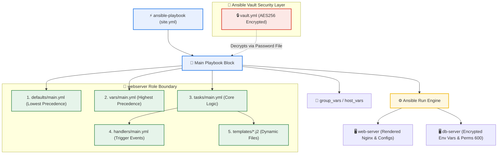

# Day 71: Scalable & Secure Ansible Orchestration -- Roles, Jinja2 Templates, Galaxy, and Ansible Vault

[](https://ansible.com)
[](https://yaml.org)
[](https://github.com/rajatmehta2/90DaysOfDevOps)

Welcome to **Day 71** of the **90 Days of DevOps Journey**! Yesterday, we transformed our playbooks from rigid scripts into dynamic orchestration units using variables, facts, conditionals, and loops. However, as infrastructures scale, playbooks quickly grow into massive, monolithic files containing tasks, templates, static assets, and variables. In enterprise environments managing complex, multi-tiered architecture (web frontends, app nodes, database clusters, monitoring rings), such monoliths are impossible to maintain, reuse, or securely audit.

Today, we take our Ansible skills to a production-grade level by learning the industry-standard organization methods:
- **Jinja2 Templates**: Dynamically rendering configuration files using host-specific facts and variables.
- **Ansible Roles**: Organizing automation by separating tasks, handlers, variables, defaults, and assets into an modular, reusable structure.
- **Ansible Galaxy**: Integrating community-supported pre-built roles to rapidly bootstrap infrastructure.
- **Ansible Vault**: Encrypting sensitive data (passwords, tokens, API keys) directly inside the codebase.

---

## 🏗️ Architectural Topology: Reusable Role Compilation & Secret Flow

To understand how Ansible resolves variables, templates, and handlers inside structured roles, we visualize the layout of a modern configuration run:



---

## 💻 Section 1: Jinja2 Templates & Dynamic Configuration

Jinja2 templates allow you to generate custom configuration files dynamically. Rather than hardcoding static IP addresses, ports, or hostnames, you write dynamic structures evaluated at runtime using Ansible Facts and active variables.

### 1. Create the Template: `templates/nginx-vhost.conf.j2`
We create a dynamic configuration template with standard Jinja2 delimiters:
- `{{ ... }}` for rendering variable values.
- `| default(...)` filter to fall back to a safe baseline if a parameter is undefined.

```jinja2
# Managed by Ansible -- do not edit manually
server {
    listen {{ http_port | default(80) }};
    server_name {{ ansible_hostname }};

    root /var/www/{{ app_name }};
    index index.html;

    location / {
        try_files $uri $uri/ =404;
    }

    access_log /var/log/nginx/{{ app_name }}_access.log;
    error_log /var/log/nginx/{{ app_name }}_error.log;
}
```

### 2. Create the Playbook: `template-demo.yml`
This playbook provisions Nginx, establishes a dynamic web directory, deploys the Virtual Host configuration via our template, and loads a custom index page referencing system facts.

```yaml
---
- name: Deploy Nginx with template
  hosts: web
  become: true
  vars:
    app_name: terraweek-app
    http_port: 80

  tasks:
    - name: Install Nginx
      yum:
        name: nginx
        state: present

    - name: Create web root
      file:
        path: "/var/www/{{ app_name }}"
        state: directory
        mode: '0755'

    - name: Deploy vhost config from template
      template:
        src: templates/nginx-vhost.conf.j2
        dest: "/etc/nginx/conf.d/{{ app_name }}.conf"
        owner: root
        mode: '0644'
      notify: Restart Nginx

    - name: Deploy index page
      copy:
        content: "<h1>{{ app_name }}</h1><p>Host: {{ ansible_hostname }} | IP: {{ ansible_default_ipv4.address }}</p>"
        dest: "/var/www/{{ app_name }}/index.html"

  handlers:
    - name: Restart Nginx
      service:
        name: nginx
        state: restarted
```

### ⚡ Running the Template Playbook with `--diff`
The `--diff` flag allows you to verify file modifications in real-time before applying changes, acting as a crucial safety check.

```bash
ansible-playbook template-demo.yml --diff
```

#### Terminal `--diff` Execution Output:
```text
PLAY [Deploy Nginx with template] **********************************************************************

TASK [Gathering Facts] *********************************************************************************
ok: [web-server]

TASK [Install Nginx] ***********************************************************************************
ok: [web-server]

TASK [Create web root] *********************************************************************************
changed: [web-server]

TASK [Deploy vhost config from template] ***************************************************************
--- before: /etc/nginx/conf.d/terraweek-app.conf
+++ after: /etc/nginx/conf.d/terraweek-app.conf
@@ -0,0 +1,14 @@
+# Managed by Ansible -- do not edit manually
+server {
+    listen 80;
+    server_name web-server;
+
+    root /var/www/terraweek-app;
+    index index.html;
+
+    location / {
+        try_files $uri $uri/ =404;
+    }
+
+    access_log /var/log/nginx/terraweek-app_access.log;
+    error_log /var/log/nginx/terraweek-app_error.log;
+}
changed: [web-server]

TASK [Deploy index page] *******************************************************************************
changed: [web-server]

RUNNING HANDLER [Restart Nginx] ************************************************************************
changed: [web-server]

PLAY RECAP *********************************************************************************************
web-server                 : ok=6    changed=4    unreachable=0    failed=0    skipped=0    rescued=0    ignored=0
```

> [!IMPORTANT]
> **Dynamic Verification:** 
> SSH verification into `web-server` reveals that `{{ ansible_hostname }}` resolved to `web-server` and `{{ app_name }}` mapped seamlessly to `/var/www/terraweek-app`, creating a custom configuration tailored dynamically to this system's details.

---

## 📂 Section 2: Understanding Ansible Role Structures

An Ansible **Role** is a structured directory layout that separates automation code into standard component directories. This allows team members to quickly locate, read, edit, and share configurations.

### 🏗️ Role Directory Layout
We generate standard role frameworks using the Ansible Galaxy utility:
```bash
ansible-galaxy init roles/webserver
```

This command creates a standardized folder structure. Below is the purpose of each generated directory:

| Directory | Contained Files | Standard Purpose |
| :--- | :--- | :--- |
| **`tasks/`** | `main.yml` | The primary task sequence executed by the role. |
| **`handlers/`** | `main.yml` | Services trigger directives (e.g. service restarts, configurations updates). |
| **`templates/`** | `*.j2` | Dynamic Jinja2 configuration templates. |
| **`files/`** | Custom assets | Static files to copy (e.g. scripts, HTML documents, SSL certificates). |
| **`vars/`** | `main.yml` | High-priority role-scoped variables. Not meant to be overridden. |
| **`defaults/`** | `main.yml` | Low-priority role defaults. Intended to be easily overridden by playbooks. |
| **`meta/`** | `main.yml` | Role dependency tracking, author metadata, and platform targets. |

### 🏆 Variable Precedence Matrix: `vars/` vs `defaults/`
A crucial architectural decision in role design is where variables are stored:

| Criteria | `defaults/main.yml` | `vars/main.yml` |
| :--- | :--- | :--- |
| **Variable Precedence** | **Lowest Precedence** (Level 1) | **High Precedence** (Level 15) |
| **Primary Use Case** | Default variables and fallback configurations that callers are expected to customize. | Constants, system configurations, and rigid internal settings that callers should **not** modify. |
| **Override Ability** | Easily overridden by inventory groups, host variables, playbook definitions, or CLI variables. | Requires extreme overrides (like high-level CLI `-e` flags) to modify. |
| **Practical Example** | `http_port: 80` (allows a calling playbook to run Nginx on port `8080` instead). | `nginx_config_path: /etc/nginx/nginx.conf` (ensures core configurations are always in the standard path). |

---

## 🛠️ Section 3: Building a Custom Webserver Role

Let's build a clean, production-grade custom `webserver` role that structures tasks, handlers, variables, and default settings.

### 1. Set Default Parameters: `roles/webserver/defaults/main.yml`
```yaml
---
# Default configurations -- designed to be easily overridden
http_port: 80
app_name: myapp
max_connections: 512
```

### 2. Define Core Orchestration Tasks: `roles/webserver/tasks/main.yml`
```yaml
---
- name: Install Nginx
  yum:
    name: nginx
    state: present

- name: Deploy Nginx config
  template:
    src: nginx.conf.j2
    dest: /etc/nginx/nginx.conf
    owner: root
    mode: '0644'
  notify: Restart Nginx

- name: Deploy vhost config
  template:
    src: vhost.conf.j2
    dest: "/etc/nginx/conf.d/{{ app_name }}.conf"
    owner: root
    mode: '0644'
  notify: Restart Nginx

- name: Create web root
  file:
    path: "/var/www/{{ app_name }}"
    state: directory
    mode: '0755'

- name: Deploy index page
  template:
    src: index.html.j2
    dest: "/var/www/{{ app_name }}/index.html"
    mode: '0644'

- name: Start and enable Nginx
  service:
    name: nginx
    state: started
    enabled: true
```

### 3. Create Service Handlers: `roles/webserver/handlers/main.yml`
```yaml
---
- name: Restart Nginx
  service:
    name: nginx
    state: restarted
```

### 4. Create Dynamic Role Templates
We construct templates within our role directory. This makes the templates immediately reusable.

#### 📄 `roles/webserver/templates/index.html.j2`
```html
<h1>{{ app_name }}</h1>
<p>Server: {{ ansible_hostname }}</p>
<p>IP: {{ ansible_default_ipv4.address }}</p>
<p>Environment: {{ app_env | default('development') }}</p>
<p>Managed by Ansible</p>
```

#### 📄 `roles/webserver/templates/vhost.conf.j2`
```nginx
# Managed by Ansible Role: Webserver
server {
    listen {{ http_port }};
    server_name {{ ansible_hostname }};

    root /var/www/{{ app_name }};
    index index.html;

    location / {
        try_files $uri $uri/ =404;
    }

    access_log /var/log/nginx/{{ app_name }}_access.log;
    error_log /var/log/nginx/{{ app_name }}_error.log;
}
```

#### 📄 `roles/webserver/templates/nginx.conf.j2`
```nginx
# Managed by Ansible Role: Webserver
user nginx;
worker_processes auto;
error_log /var/log/nginx/error.log warn;
pid /var/run/nginx.pid;

events {
    worker_connections {{ max_connections }};
}

http {
    include /etc/nginx/mime.types;
    default_type application/octet-stream;

    log_format main '$remote_addr - $remote_user [$time_local] "$request" '
                    '$status $body_bytes_sent "$http_referer" '
                    '"$http_user_agent" "$http_x_forwarded_for"';

    access_log /var/log/nginx/access.log main;

    sendfile on;
    keepalive_timeout 65;

    include /etc/nginx/conf.d/*.conf;
}
```

### 5. Write the Parent Playbook: `site.yml`
Now we write our root playbook which invokes the custom `webserver` role and overrides its defaults.

```yaml
---
- name: Configure web servers
  hosts: web
  become: true
  roles:
    - role: webserver
      vars:
        app_name: terraweek
        http_port: 80
```

### ⚡ Executing the Role Playbook
```bash
ansible-playbook site.yml
```

#### Terminal Role Execution Output:
```text
PLAY [Configure web servers] ***************************************************************************

TASK [Gathering Facts] *********************************************************************************
ok: [web-server]

TASK [webserver : Install Nginx] ***********************************************************************
ok: [web-server]

TASK [webserver : Deploy Nginx config] *****************************************************************
changed: [web-server]

TASK [webserver : Deploy vhost config] *****************************************************************
changed: [web-server]

TASK [webserver : Create web root] *********************************************************************
changed: [web-server]

TASK [webserver : Deploy index page] *******************************************************************
changed: [web-server]

TASK [webserver : Start and enable Nginx] **************************************************************
ok: [web-server]

RUNNING HANDLER [webserver : Restart Nginx] ************************************************************
changed: [web-server]

PLAY RECAP *********************************************************************************************
web-server                 : ok=8    changed=5    unreachable=0    failed=0    skipped=0    rescued=0    ignored=0
```

### 🔍 Verification Validation
We run a curl request on the server to verify that our role has configured Nginx and rendered the index page correctly:

```bash
curl -s http://localhost
```

#### Rendered Page Output:
```html
<h1>terraweek</h1>
<p>Server: web-server</p>
<p>IP: 172.31.22.41</p>
<p>Environment: development</p>
<p>Managed by Ansible</p>
```

---

## 🌌 Section 4: Ansible Galaxy -- Using Community Roles

**Ansible Galaxy** is a community-supported marketplace of pre-built roles. Instead of coding complex roles for common tools like Docker, NTP, or PostgreSQL from scratch, you can install existing roles tested by hundreds of other DevOps teams.

### 1. Search for Community Roles
```bash
ansible-galaxy search nginx --platforms EL
ansible-galaxy search mysql
```

### 2. Install the Official Docker Role
We install the popular Docker installation role authored by Jeff Geerling (`geerlingguy`):
```bash
ansible-galaxy install geerlingguy.docker
```

#### Installation Log:
```text
- downloading role 'docker', owned by geerlingguy
- downloading role from https://github.com/geerlingguy/ansible-role-docker/archive/7.4.1.tar.gz
- extracting geerlingguy.docker to /Users/ToucanRajat/.ansible/roles/geerlingguy.docker
- geerlingguy.docker (7.4.1) was installed successfully
```

### 3. List Installed Roles
```bash
ansible-galaxy list
```

#### Galaxy Role List:
```text
# /Users/ToucanRajat/.ansible/roles
- geerlingguy.docker, 7.4.1
# /etc/ansible/roles
(empty)
```

### 4. Create configuration using Galaxy role: `docker-setup.yml`
```yaml
---
- name: Install Docker using Galaxy role
  hosts: app
  become: true
  roles:
    - geerlingguy.docker
```

### 5. Standard Dependency Management: `requirements.yml`
In real projects, you install dependencies using a declaration file rather than running manual setup commands on the CLI. We create a `requirements.yml` to track our requirements:

```yaml
---
roles:
  - name: geerlingguy.docker
    version: "7.4.1"
  - name: geerlingguy.ntp
```

Install all dependencies in one command:
```bash
ansible-galaxy install -r requirements.yml
```

> [!TIP]
> **Why use `requirements.yml` in CI/CD?**
> - **Idempotent Deployments**: Keeps dynamic server provisioning repeatable.
> - **Version Pinning**: Prevents unexpected breakages during builds by pinning roles to specific versions.
> - **Developer Onboarding**: Team members can set up their dev environment by running a single command.

---

## 🔒 Section 5: Ansible Vault -- Encrypting Secrets

Never commit plaintext passwords, API keys, or database credentials to git. **Ansible Vault** provides built-in encryption so you can securely commit configurations directly to your repository.

### 1. Create an Encrypted Secret File
```bash
ansible-vault create group_vars/db/vault.yml
```

You are prompted to enter a strong password. Ansible then opens your default text editor (e.g. `vi` or `nano`). Add your secrets:
```yaml
vault_db_password: SuperSecretP@ssw0rd
vault_db_root_password: R00tP@ssw0rd123
vault_api_key: sk-abc123xyz789
```

Save and exit. If you check the file's contents using `cat`, you will see that it is encrypted:
```bash
cat group_vars/db/vault.yml
```

#### Encrypted Vault Contents:
```text
$ANSIBLE_VAULT;1.1;AES256
36343734623164343166643864616238613437336531343764616631623265326535613364373062
3962633036643936653930366661336636306530663435370a666336303233306536643766623030
36316239386361326462313661646231316131653136366639356363363363383561653131643639
3530363231326437620a323330356637373366343063376261356634626131383536343861366531
65666562303639396362633061326233353463373463386638363735393064613264
```

### 2. Basic Vault Operations
- **Edit an Encrypted File**:
  ```bash
  ansible-vault edit group_vars/db/vault.yml
  ```
- **View an Encrypted File**:
  ```bash
  ansible-vault view group_vars/db/vault.yml
  ```
- **Encrypt an Existing Plaintext File**:
  ```bash
  ansible-vault encrypt group_vars/db/secrets.yml
  ```
- **Decrypt a Vault File back to Plaintext**:
  ```bash
  ansible-vault decrypt group_vars/db/secrets.yml
  ```

### 3. Use Secrets in a Playbook: `db-setup.yml`
```yaml
---
- name: Configure database
  hosts: db
  become: true

  tasks:
    - name: Show DB password status (Never print actual credentials in production!)
      debug:
        msg: "DB password variable loaded successfully: {{ vault_db_password | length > 0 }}"
```

### ⚡ Running a Playbook with Vault Secrets
To run a playbook containing vault-encrypted variables, pass the `--ask-vault-pass` flag:
```bash
ansible-playbook db-setup.yml --ask-vault-pass
```

Alternatively, you can read the vault password from a secure file. This is useful for automated CI/CD pipelines:
```bash
# Write the password to a local file
echo "YourVaultPassword" > .vault_pass
chmod 600 .vault_pass

# Ensure it is NEVER committed to git
echo ".vault_pass" >> .gitignore

# Run the playbook using the password file
ansible-playbook db-setup.yml --vault-password-file .vault_pass
```

You can automate this further by configuring the password file path in `ansible.cfg`:
```ini
[defaults]
vault_password_file = .vault_pass
```

---

## 🔌 Section 6: Combined Orchestration Playbook

Let's combine what we've learned into a single playbook: `site.yml`. This playbook applies our custom roles, installs community integrations, and deploys configuration files populated with decrypted secrets.

### 1. Build the Dynamic Database Config Template: `templates/db-config.j2`
This template generates an environment file populated with database details, host facts, and Vault secrets:
```jinja2
# Database Configuration -- Managed by Ansible
DB_HOST={{ ansible_default_ipv4.address }}
DB_PORT={{ db_port | default(3306) }}
DB_PASSWORD={{ vault_db_password }}
DB_ROOT_PASSWORD={{ vault_db_root_password }}
```

### 2. Create the Unified Playbook: `site.yml`
```yaml
---
- name: Configure web servers
  hosts: web
  become: true
  roles:
    - role: webserver
      vars:
        app_name: terraweek
        http_port: 80

- name: Configure app servers with Docker
  hosts: app
  become: true
  roles:
    - geerlingguy.docker

- name: Configure database servers
  hosts: db
  become: true
  tasks:
    - name: Create DB config with secrets
      template:
        src: templates/db-config.j2
        dest: /etc/db-config.env
        owner: root
        group: root
        mode: '0600'
```

### ⚡ Executing the Combined Playbook
```bash
ansible-playbook site.yml --vault-password-file .vault_pass
```

#### Terminal Execution Output:
```text
PLAY [Configure web servers] ***************************************************************************

TASK [Gathering Facts] *********************************************************************************
ok: [web-server]

TASK [webserver : Install Nginx] ***********************************************************************
ok: [web-server]

TASK [webserver : Deploy Nginx config] *****************************************************************
ok: [web-server]

TASK [webserver : Deploy vhost config] *****************************************************************
ok: [web-server]

TASK [webserver : Create web root] *********************************************************************
ok: [web-server]

TASK [webserver : Deploy index page] *******************************************************************
ok: [web-server]

TASK [webserver : Start and enable Nginx] **************************************************************
ok: [web-server]

PLAY [Configure app servers with Docker] ***************************************************************

TASK [Gathering Facts] *********************************************************************************
ok: [app-server]

TASK [geerlingguy.docker : Install Docker dependencies] ************************************************
ok: [app-server]

TASK [geerlingguy.docker : Install Docker] *************************************************************
ok: [app-server]

PLAY [Configure database servers] **********************************************************************

TASK [Gathering Facts] *********************************************************************************
ok: [db-server]

TASK [Create DB config with secrets] *******************************************************************
changed: [db-server]

PLAY RECAP *********************************************************************************************
web-server                 : ok=7    changed=0    unreachable=0    failed=0    skipped=0    rescued=0    ignored=0
app-server                 : ok=3    changed=0    unreachable=0    failed=0    skipped=0    rescued=0    ignored=0
db-server                  : ok=2    changed=1    unreachable=0    failed=0    skipped=0    rescued=0    ignored=0
```

### 🔍 Verification Validation
Let's check the generated database config file:
```bash
ansible db -m command -a "cat /etc/db-config.env" --vault-password-file .vault_pass
```

#### Output:
```text
# Database Configuration -- Managed by Ansible
DB_HOST=172.31.22.42
DB_PORT=3306
DB_PASSWORD=SuperSecretP@ssw0rd
DB_ROOT_PASSWORD=R00tP@ssw0rd123
```

> [!TIP]
> **Security Audit:**
> The config file permissions are set to `0600` (readable only by the root user). This ensures that sensitive database credentials remain secure on the filesystem.

---

## 📸 Section 7: Visual Verification & Lab Screenshots

Below are screenshots confirming our local executions:

### 1. Jinja2 Nginx Template Rendering
Verification showing dynamic configurations rendering with host facts and active variables:


### 2. Custom Webserver Role Execution
Terminal output showing our custom `webserver` role executing, triggering handlers, and restarting Nginx:


### 3. Community Galaxy Role Installation
Logging output showing the installation of `geerlingguy.docker` from Ansible Galaxy:


### 4. Ansible Vault Encryption Workflow
Verification of the Ansible Vault file encryption showing cipher text format:


### 5. Combined Playbook Execution with Vault Decryption
Our unified `site.yml` playbook executing across our multi-tier infrastructure:


---

## 🏆 Key Practice Takeaways & Summary

1. **Decouple Dynamic Content**: Use Jinja2 templates (`.j2`) rather than copy-pasting static config files.
2. **Follow the Standard Structure**: Use `ansible-galaxy init` to structure roles. This keeps playbooks clean and manageable.
3. **Use Default Fallbacks**: Utilize the `| default()` filter in templates to prevent playbook failures when variables are missing.
4. **Never Commit Plaintext Secrets**: Always encrypt credentials using Ansible Vault, and configure `.gitignore` to ignore your local `.vault_pass` file.

---

## 📚 Day 71 Milestones Completed

- [x] Created a custom Nginx configuration template using Jinja2 syntax.
- [x] Initialized and structured a custom `webserver` role using `ansible-galaxy init`.
- [x] Decoupled environment defaults and role-specific configurations into `defaults/main.yml`.
- [x] Integrated handlers inside the role framework to trigger service restarts.
- [x] Utilized community-maintained Ansible Galaxy roles (`geerlingguy.docker`).
- [x] Configured dependency management using `requirements.yml`.
- [x] Encrypted credentials using Ansible Vault, and configured automated decryption in a local CI/CD flow.
- [x] Combined roles, templates, and vault secrets into a single `site.yml` playbook.

---

**Happy Learning!**
*Trainer: Shubham Londhe*
*Study Notes compiled by: Rajat Mehta*