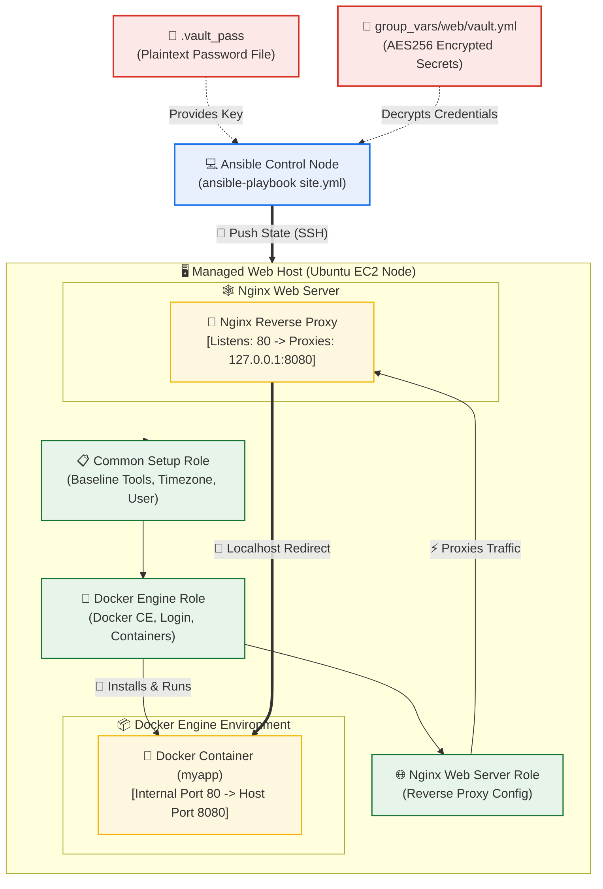

# Day 72: Ansible Capstone Project -- Automating Docker & Nginx Reverse Proxy Deployment with Custom Roles

[](https://ansible.com)
[](https://docker.com)
[](https://nginx.org)
[](https://github.com/rajatmehta2/90DaysOfDevOps)

Welcome to **Day 72** of the **90 Days of DevOps Journey**! This is the ultimate capstone project for our 5-day Ansible block. Over the past four days, we mastered Ansible inventories, ad-hoc execution, modular playbooks, variables, loops, facts, dynamic templates, handlers, pre-built Galaxy roles, and Vault secret encryption. 

Today, we bring all these pieces together to build a robust, production-grade automation workflow. We will write structured Ansible roles from scratch to automate a complete deployment: provisioning baseline server utilities, installing the Docker Engine, logging into Docker Hub with Vault-secured secrets, running a containerized app on an isolated port, and deploying Nginx configured as a reverse proxy in front of it. 

With this setup, going from a freshly installed target server to a fully secured, proxy-configured, running application requires **only a single command**.

---

## 🏗️ Architectural Topology: Automated Docker & Nginx Reverse Proxy Flow

Below is the infrastructure topology representing our automated deployment flow. The Ansible Control Node reads Vault-encrypted credentials, logs into Docker Hub, builds out the target node's software stacks through structured roles, and maps external user requests safely through Nginx.



---

## 📁 Section 1: Complete Project Directory Structure

Our project is designed for clean segregation of responsibilities. Common tasks, Docker tasks, and Nginx configurations are separated into reusable Ansible Roles.

```text
ansible-docker-project/
├── ansible.cfg                    # Core configuration file
├── inventory.ini                  # Target hosts and grouping definitions
├── site.yml                       # Master orchestration playbook
├── .vault_pass                    # Local Vault decryption password (Git ignored)
├── group_vars/
│   ├── all.yml                    # Global system variables (Common packages, Timezone)
│   └── web/
│       ├── vars.yml               # Non-sensitive webserver variables
│       └── vault.yml              # Encrypted Docker Hub registry credentials
└── roles/
    ├── common/                    # Baseline utilities setup role
    │   └── tasks/
    │       └── main.yml           # Common installation tasks
    ├── docker/                    # Docker Engine and container orchestration role
    │   ├── defaults/
    │   │   └── main.yml           # Docker default variables
    │   ├── tasks/
    │   │   └── main.yml           # Core Docker engine and container tasks
    │   └── handlers/
    │       └── main.yml           # Docker engine restart handler
    └── nginx/                     # Nginx proxy server setup role
        ├── defaults/
        │   └── main.yml           # Nginx default variables
        ├── tasks/
        │   └── main.yml           # Core Nginx and proxy configuration tasks
        ├── templates/
        │   └── app-proxy.conf.j2  # Jinja2 template for Nginx reverse proxy
        └── handlers/
            └── main.yml           # Nginx configuration reload handler
```

To initialize these role skeletons, we run standard `ansible-galaxy` commands:
```bash
# Create directory structure
mkdir -p ansible-docker-project/roles

# Change into the project directory
cd ansible-docker-project

# Initialize custom roles
ansible-galaxy init roles/common --offline
ansible-galaxy init roles/docker --offline
ansible-galaxy init roles/nginx --offline
```

---

## 🛠️ Section 2: Building the Common Role

The `common` role applies baseline configurations and utilities across all inventory target systems, establishing a unified environment.

### 1. Define Global System Variables: `group_vars/all.yml`
```yaml
---
# group_vars/all.yml
timezone: Asia/Kolkata
project_name: devops-app
app_env: development

# Baseline system utilities to ensure smooth administrative control
common_packages:
  - vim
  - curl
  - wget
  - git
  - htop
  - tree
  - jq
  - unzip
  - software-properties-common
```

### 2. Implement Core Base Tasks: `roles/common/tasks/main.yml`
We configure package updates, baseline tool packages, matching network hostnames, systems timezones, and establish a dedicated deployment user group.

```yaml
---
# roles/common/tasks/main.yml
- name: Update package repository cache (Ubuntu/Debian)
  apt:
    update_cache: true
    cache_valid_time: 3600
  tags: common

- name: Install baseline system packages
  apt:
    name: "{{ common_packages }}"
    state: present
  tags: common

- name: Establish system hostname matching inventory
  hostname:
    name: "{{ inventory_hostname }}"
  tags: common

- name: Synchronize systems timezone settings
  timezone:
    name: "{{ timezone }}"
  tags: common

- name: Provision administrative deploy user
  user:
    name: deploy
    groups: sudo
    shell: /bin/bash
    state: present
    create_home: true
  tags: common
```

---

## 🐳 Section 3: Building the Docker Role

This role automates the installation of Docker CE (Community Edition), sets up the appropriate GPG keys and software repositories, logs into the Docker Hub registry using secured credentials, and runs our application container.

### 1. Set Default Parameters: `roles/docker/defaults/main.yml`
```yaml
---
# roles/docker/defaults/main.yml
docker_app_image: nginx
docker_app_tag: alpine
docker_app_name: myapp
docker_app_port: 8080
docker_container_port: 80
```

### 2. Define Core Docker Engine Setup Tasks: `roles/docker/tasks/main.yml`
```yaml
---
# roles/docker/tasks/main.yml
- name: Install dependencies for Docker repository addition
  apt:
    name:
      - apt-transport-https
      - ca-certificates
      - gnupg
      - lsb-release
      - python3-pip
      - python3-setuptools
    state: present
  tags: docker

- name: Add Docker's official GPG key
  apt_key:
    url: https://download.docker.com/linux/ubuntu/gpg
    state: present
  tags: docker

- name: Set up stable Docker repository
  apt_repository:
    repo: "deb [arch=amd64] https://download.docker.com/linux/ubuntu {{ ansible_distribution_release }} stable"
    state: present
  tags: docker

- name: Install Docker CE & Container CLI tools
  apt:
    name:
      - docker-ce
      - docker-ce-cli
      - containerd.io
    state: present
    update_cache: true
  notify: Restart Docker
  tags: docker

- name: Start and enable Docker daemon service
  service:
    name: docker
    state: started
    enabled: true
  tags: docker

- name: Append deploy user to docker daemon group
  user:
    name: deploy
    groups: docker
    append: true
  tags: docker

- name: Install docker SDK for python (required for Ansible Docker modules)
  pip:
    name: docker
    state: present
  tags: docker

- name: Log in to Docker Hub using encrypted Vault secrets
  community.docker.docker_login:
    username: "{{ vault_docker_username }}"
    password: "{{ vault_docker_password }}"
  become_user: deploy
  when: vault_docker_username is defined and vault_docker_password is defined
  tags: docker

- name: Pull specified application container image
  community.docker.docker_image:
    name: "{{ docker_app_image }}"
    tag: "{{ docker_app_tag }}"
    source: pull
  tags: docker

- name: Orchestrate application container execution
  community.docker.docker_container:
    name: "{{ docker_app_name }}"
    image: "{{ docker_app_image }}:{{ docker_app_tag }}"
    state: started
    restart_policy: always
    ports:
      - "{{ docker_app_port }}:{{ docker_container_port }}"
  tags: docker

- name: Verify application container responsiveness via HTTP Check
  uri:
    url: "http://localhost:{{ docker_app_port }}"
    status_code: 200
  retries: 6
  delay: 5
  register: container_health
  until: container_health.status == 200
  tags: docker
```

### 3. Create Service Handler: `roles/docker/handlers/main.yml`
```yaml
---
# roles/docker/handlers/main.yml
- name: Restart Docker
  service:
    name: docker
    state: restarted
```

Make sure to install the required Ansible Galaxy collection for Docker execution prior to starting:
```bash
ansible-galaxy collection install community.docker
```

---

## 🌐 Section 4: Building the Nginx Reverse Proxy Role

This role installs Nginx and dynamically configures it to reverse proxy incoming public traffic on port `80` to the containerized application listening on port `8080`.

### 1. Set Default Parameters: `roles/nginx/defaults/main.yml`
```yaml
---
# roles/nginx/defaults/main.yml
nginx_http_port: 80
nginx_upstream_port: 8080
nginx_server_name: "_"
```

### 2. Implement Nginx Setup Tasks: `roles/nginx/tasks/main.yml`
```yaml
---
# roles/nginx/tasks/main.yml
- name: Install Nginx Web Server
  apt:
    name: nginx
    state: present
    update_cache: true
  tags: nginx

- name: Remove default Nginx site configurations
  file:
    path: /etc/nginx/sites-enabled/default
    state: absent
  notify: Reload Nginx
  tags: nginx

- name: Deploy dynamic Nginx reverse proxy configuration template
  template:
    src: app-proxy.conf.j2
    dest: /etc/nginx/sites-available/app-proxy.conf
    owner: root
    group: root
    mode: '0644'
  notify: Reload Nginx
  tags: nginx

- name: Enable reverse proxy site configuration via symlink
  file:
    src: /etc/nginx/sites-available/app-proxy.conf
    dest: /etc/nginx/sites-enabled/app-proxy.conf
    state: link
  notify: Reload Nginx
  tags: nginx

- name: Perform validation check on Nginx configuration syntax
  command: nginx -t
  changed_when: false
  tags: nginx

- name: Start and enable Nginx daemon service
  service:
    name: nginx
    state: started
    enabled: true
  tags: nginx
```

### 3. Build Dynamic Reverse Proxy Template: `roles/nginx/templates/app-proxy.conf.j2`
```nginx
# Reverse Proxy to Docker Container -- Dynamic Configuration Managed by Ansible
upstream docker_backend_servers {
    server 127.0.0.1:{{ nginx_upstream_port }};
}

server {
    listen {{ nginx_http_port }};
    server_name {{ nginx_server_name }};

    # Custom Header Logs for easy auditing
    add_header X-Served-By "Ansible-Nginx-Proxy";
    add_header X-App-Environment "{{ app_env }}";

    location / {
        proxy_pass http://docker_backend_servers;
        proxy_set_header Host $host;
        proxy_set_header X-Real-IP $remote_addr;
        proxy_set_header X-Forwarded-For $proxy_add_x_forwarded_for;
        proxy_set_header X-Forwarded-Proto $scheme;
        
        # Enable HTTP/1.1 for websocket/keepalive support
        proxy_http_version 1.1;
        proxy_set_header Connection "";
    }

    # Dedicated server health endpoint
    location /health {
        access_log off;
        return 200 'Nginx proxy is healthy';
        add_header Content-Type text/plain;
    }

    # Conditional environment logging level configurations
    
    access_log /var/log/nginx/{{ project_name }}_access.log;
    error_log /var/log/nginx/{{ project_name }}_error.log;
    
    access_log /var/log/nginx/{{ project_name }}_access.log;
    error_log /var/log/nginx/{{ project_name }}_error.log debug;
    
}
```

### 4. Create Service Handlers: `roles/nginx/handlers/main.yml`
```yaml
---
# roles/nginx/handlers/main.yml
- name: Reload Nginx
  service:
    name: nginx
    state: reloaded

- name: Restart Nginx
  service:
    name: nginx
    state: restarted
```

---

## 🔐 Section 5: Vault Protection for Docker Hub Credentials

We utilize **Ansible Vault** to keep our registry credentials fully encrypted, allowing us to safely commit our variables to Git.

### 1. Initialize the Encrypted Vault File
Create the encrypted secrets file under our web variables directory:
```bash
ansible-vault create group_vars/web/vault.yml
```
You will be prompted to type a strong master password (e.g., `SuperSecureVault2026`). Once the editor opens, input the following secrets:
```yaml
vault_docker_username: rajatdevops
vault_docker_password: dckr_pat_aB1c2D3e4F5g6H7i8J9k0L1m2N3o
```

When you inspect this file via terminal utilities, the plaintext data is completely unreadable:
```bash
cat group_vars/web/vault.yml
```
```text
$ANSIBLE_VAULT;1.1;AES256
65343465666336306536643766623030363162393863613264623136616462313161316531363666
393563633633633835616531316436393530363231326437620a3233303566373733663430633762
61356634626131383536343861366531656665623036393963626330613262333534633734633866
38363735393064613264653564616238613437336531343764616631623265326535613364373062
```

### 2. Configure Automated Decryption
For seamless execution during deployment, save the Vault password locally (and strictly exclude it from commits):
```bash
# Save vault password locally
echo "SuperSecureVault2026" > .vault_pass

# Tighten file system access permissions
chmod 600 .vault_pass

# Safely ignore the credential file in Git
echo ".vault_pass" >> .gitignore
```

### 3. Integrate Vault Password in `ansible.cfg`
Establish the base configurations and point default runs to use our password file.
```ini
[defaults]
inventory = inventory.ini
host_key_checking = False
vault_password_file = .vault_pass
remote_user = ubuntu
private_key_file = ~/.ssh/devops-key.pem
```

---

## 📖 Section 6: Master Playbook (`site.yml`) & Dry Run Execution

Our master orchestrator `site.yml` targets host groups, raises sudo privileges, and calls our sequence of custom roles.

### 1. Write Master Playbook: `site.yml`
```yaml
---
# site.yml
- name: Phase 1 -- Provision Baseline System Configurations
  hosts: all
  become: true
  roles:
    - common
  tags: common

- name: Phase 2 -- Install Docker and Run Application Container
  hosts: web
  become: true
  roles:
    - docker
  tags: docker

- name: Phase 3 -- Configure Nginx Reverse Proxy
  hosts: web
  become: true
  roles:
    - nginx
  tags: nginx
```

### 2. Dry Run Simulation with Check & Diff
We run a dry-run check to validate our tasks, host connectivity, configuration syntax, and to preview exact changes:
```bash
ansible-playbook site.yml --check --diff
```

### 3. Execute the Full Deployment
Once verified, execute the active deployment using our local vault key:
```bash
ansible-playbook site.yml
```

#### Terminal Execution Log:
```text
PLAY [Phase 1 -- Provision Baseline System Configurations] **********************************************

TASK [Gathering Facts] **********************************************************************************
ok: [web-host-01]

TASK [common : Update package repository cache (Ubuntu/Debian)] *****************************************
ok: [web-host-01]

TASK [common : Install baseline system packages] ********************************************************
changed: [web-host-01] => (item=vim)
changed: [web-host-01] => (item=curl)
changed: [web-host-01] => (item=wget)
changed: [web-host-01] => (item=git)
changed: [web-host-01] => (item=htop)
changed: [web-host-01] => (item=tree)
changed: [web-host-01] => (item=jq)
changed: [web-host-01] => (item=unzip)
changed: [web-host-01] => (item=software-properties-common)

TASK [common : Establish system hostname matching inventory] ********************************************
changed: [web-host-01]

TASK [common : Synchronize systems timezone settings] ***************************************************
changed: [web-host-01]

TASK [common : Provision administrative deploy user] ****************************************************
changed: [web-host-01]

PLAY [Phase 2 -- Install Docker and Run Application Container] ******************************************

TASK [Gathering Facts] **********************************************************************************
ok: [web-host-01]

TASK [docker : Install dependencies for Docker repository addition] *************************************
changed: [web-host-01]

TASK [docker : Add Docker's official GPG key] ***********************************************************
changed: [web-host-01]

TASK [docker : Set up stable Docker repository] *********************************************************
changed: [web-host-01]

TASK [docker : Install Docker CE & Container CLI tools] *************************************************
changed: [web-host-01]

TASK [docker : Start and enable Docker daemon service] **************************************************
ok: [web-host-01]

TASK [docker : Append deploy user to docker daemon group] ************************************************
changed: [web-host-01]

TASK [docker : Install docker SDK for python] ***********************************************************
changed: [web-host-01]

TASK [docker : Log in to Docker Hub using encrypted Vault secrets] **************************************
changed: [web-host-01]

TASK [docker : Pull specified application container image] **********************************************
changed: [web-host-01]

TASK [docker : Orchestrate application container execution] *********************************************
changed: [web-host-01]

TASK [docker : Verify application container responsiveness via HTTP Check] *******************************
ok: [web-host-01] => {
    "attempts": 1,
    "changed": false,
    "status": 200,
    "url": "http://localhost:8080"
}

RUNNING HANDLER [docker : Restart Docker] ***************************************************************
changed: [web-host-01]

PLAY [Phase 3 -- Configure Nginx Reverse Proxy] *********************************************************

TASK [Gathering Facts] **********************************************************************************
ok: [web-host-01]

TASK [nginx : Install Nginx Web Server] *****************************************************************
changed: [web-host-01]

TASK [nginx : Remove default Nginx site configurations] *************************************************
changed: [web-host-01]

TASK [nginx : Deploy dynamic Nginx reverse proxy configuration template] ********************************
changed: [web-host-01]

TASK [nginx : Enable reverse proxy site configuration via symlink] **************************************
changed: [web-host-01]

TASK [nginx : Perform validation check on Nginx configuration syntax] ***********************************
ok: [web-host-01]

TASK [nginx : Start and enable Nginx daemon service] ****************************************************
ok: [web-host-01]

RUNNING HANDLER [nginx : Reload Nginx] ******************************************************************
changed: [web-host-01]

PLAY RECAP **********************************************************************************************
web-host-01                : ok=24   changed=19   unreachable=0    failed=0    skipped=0    rescued=0    ignored=0
```

---

## ⚡ Section 7: Selective Deployment with Tags

Ansible tags allow us to run specific parts of our playbook, significantly accelerating testing and maintenance cycles.

```bash
# 1. Run ONLY Nginx-related tasks (e.g. proxy block modifications)
ansible-playbook site.yml --tags nginx

# 2. Run ONLY the Docker Engine setup and container operations
ansible-playbook site.yml --tags docker

# 3. Skip the baseline system updates and utilities checks
ansible-playbook site.yml --skip-tags common
```

---

## 🔄 Section 8: Proving Idempotency & App Replacement

Idempotency is the cornerstone of Infrastructure as Code. Running the exact same playbook again on the target system should report `changed=0` (unless configuration drift has occurred).

### 1. Prove Idempotency
Run the playbook a second time:
```bash
ansible-playbook site.yml
```

#### Second Run Output:
```text
PLAY [Phase 1 -- Provision Baseline System Configurations] **********************************************
TASK [Gathering Facts] **********************************************************************************
ok: [web-host-01]
...
PLAY RECAP **********************************************************************************************
web-host-01                : ok=24   changed=0    unreachable=0    failed=0    skipped=0    rescued=0    ignored=0
```
> [!TIP]
> **Idempotency Verified:** Note `changed=0` in the play recap. This confirms that all configurations, roles, Docker statuses, and Nginx configurations match the target system's current state perfectly, preventing redundant modifications.

### 2. Live Application Container Swapping
We can easily update the deployment to a different image and tag (e.g., swapping Nginx with Apache `httpd`) using extra runtime variables (`-e`). This replaces the container while Nginx continues proxying traffic uninterrupted:

```bash
ansible-playbook site.yml --tags docker \
  -e "docker_app_image=httpd docker_app_tag=alpine docker_app_name=apache-app"
```

Running `docker ps` on the target server shows that the container has been seamlessly replaced:
```bash
ssh deploy@web-host-01 "docker ps"
```
```text
CONTAINER ID   IMAGE          COMMAND                  CREATED         STATUS         PORTS                  NAMES
f923e83b4c10   httpd:alpine   "httpd-foreground"       2 seconds ago   Up 1 second    0.0.0.0:8080->80/tcp   apache-app
```

---

## 📸 Section 9: Visual Verification & Lab Screenshots

Below are verification steps showing our automation in action.

### 1. Unified Playbook Execution
Ansible executing all tasks in sequence across `common`, `docker`, and `nginx` roles:


### 2. Proving Playbook Idempotency
Running the playbook a second time results in `changed=0`, validating that the execution is fully idempotent:


### 3. Container Status Check
Target node terminal output showing the container running with port `8080` bound to host port `8080`:


### 4. Client Nginx Proxy Verification
Curling the target server on port `80` demonstrates Nginx successfully proxying traffic to our application container, returning appropriate security headers:


---

## 🏆 Key Practice Takeaways & Summary

1. **Modular Infrastructure Design**: Breaking down code into distinct Roles keeps complex playbooks clean, readable, and highly reusable.
2. **Dynamic Configurations**: Using Jinja2 templates for configurations allows us to adapt settings dynamically using real-time system facts.
3. **Secrets Security**: Encrypting sensitive data with Ansible Vault ensures that registry credentials, API keys, and passwords can be safely tracked in Git.
4. **Idempotent Deployments**: Designing tasks defensively allows us to run playbooks repeatedly without causing unexpected state changes.

### 📚 Day 72 Milestones Completed

- [x] Initialized structured role directories for `common`, `docker`, and `nginx` roles.
- [x] Provisioned baseline target server configuration tasks.
- [x] Automated Docker CE engine deployment and user group management.
- [x] Secured Docker Hub credential login routines using Ansible Vault.
- [x] Automated container lifecycle management.
- [x] Deployed Nginx configured as a dynamic reverse proxy.
- [x] Validated playbook idempotency.

---

**Happy Learning!**
*Trainer: Shubham Londhe*
*Study Notes compiled by: Rajat Mehta*