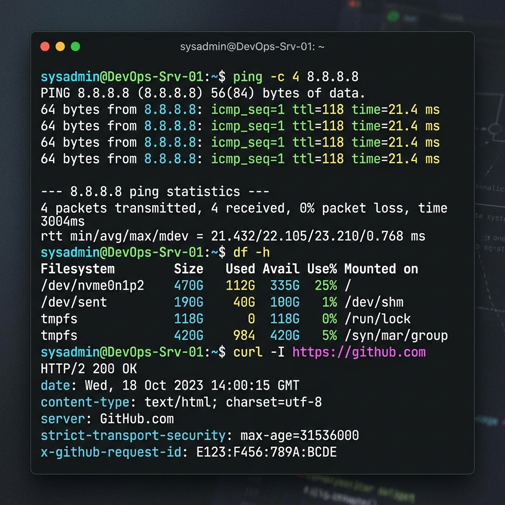

# 🐧 Day 03: Linux Commands Practice & Production Cheat Sheet

> **"In a production incident, the command line is your eyes and ears. Speed and precision at the terminal save services."**

Welcome to Day 03 of the **90 Days of DevOps** challenge! Today is all about building rock-solid terminal confidence. This is not just a list of commands—it is a production-grade Linux troubleshooting toolkit. It has been curated and structured for high-intensity, real-world DevOps environments where seconds count during active live incidents.

---

## ⚡ Quick Scan Terminal Overview
Below is a visual snapshot of vital troubleshooting and metric commands running in a production shell:



---

## 📂 Table of Contents
1. [📊 1. Process Management & System Metrics](#-1-process-management--system-metrics)
2. [📂 2. File System & Directory Operations](#-2-file-system--directory-operations)
3. [🔌 3. Networking & Infrastructure Troubleshooting](#-3-networking--infrastructure-troubleshooting)
4. [🔍 4. Text Processing, Log Analysis & Info](#-4-text-processing-log-analysis--info)
5. [⚠️ 5. Production Diagnostics & Operational Safety](#-5-production-diagnostics--operational-safety)

---

## 📊 1. Process Management & System Metrics

Use these commands to monitor server health, audit running processes, track hardware resource consumption, and gracefully or forcefully terminate misbehaving services.

| Command | Basic Syntax | DevOps Use Case | Operational Context & Tips |
| :--- | :--- | :--- | :--- |
| **`ps`** | `ps aux` | Lists all running processes with user attribution. | Use `ps aux \| grep <process>` to find a specific service PID. |
| **`top`** | `top` | Interactive, real-time CPU/RAM process monitor. | Press `M` to sort by Memory, `P` to sort by CPU, and `q` to exit. |
| **`kill`** | `kill -9 <PID>` | Forcefully terminates a stubborn process (SIGKILL). | **Warning:** Avoid `kill -9` where possible; use `kill -15` (SIGTERM) first to allow cleanups. |
| **`pkill`** | `pkill -f <name>` | Kills processes matching a search pattern by name. | Removes the need to look up individual Process IDs (PIDs) manually. |
| **`df`** | `df -h` | Displays disk space utilization of all mounted filesystems. | The `-h` flag prints sizes in human-readable GB/MB format. |
| **`du`** | `du -sh *` | Displays the cumulative size of files/directories. | Highly useful for tracking down what is filling up a specific volume. |
| **`free`** | `free -h` | Summarizes physical RAM and swap memory usage. | Shows total, used, free, and cached memory statistics instantly. |
| **`uptime`** | `uptime` | Shows boot duration, logged-in users, and system load. | Load averages represent standard run-queue lengths over 1, 5, and 15 mins. |

### 💻 Metrics Command Examples & Expected Output

#### A. Disk Space Check (`df -h`)
Use this to check if a full disk is causing server failures or write errors.
```bash
df -h
```
**Example Output:**
```text
Filesystem      Size  Used Avail Use% Mounted on
/dev/nvme0n1p2  470G  112G  335G  25% /
tmpfs           118G     0  118G   0% /dev/shm
/dev/sent       190G   40G  100G  1% /dev/sent
```

#### B. Free Memory Audit (`free -h`)
Use this to check if a process is triggering the Linux OOM (Out of Memory) Killer.
```bash
free -h
```
**Example Output:**
```text
               total        used        free      shared  buff/cache   available
Mem:           7.8Gi       2.4Gi       3.0Gi       180Mi       2.4Gi       5.0Gi
Swap:          2.0Gi       0.0Gi       2.0Gi
```

---

## 📂 2. File System & Directory Operations

Essential commands for navigating paths, copying artifacts, moving configuration files, adjusting permissions, and preparing deployment directories.

| Command | Basic Syntax | DevOps Use Case | Operational Context & Tips |
| :--- | :--- | :--- | :--- |
| **`pwd`** | `pwd` | Prints the absolute path of the current directory. | Extremely helpful during script debugging to guarantee active context. |
| **`ls`** | `ls -la` | Lists directory contents, detailed permissions, and hidden files. | `-l` activates long listing; `-a` displays hidden dotfiles (e.g., `.env`). |
| **`mkdir`** | `mkdir -p /path/to/dir` | Creates folders, generating parent structures automatically. | The `-p` flag prevents errors if directories already exist. |
| **`cp`** | `cp -r <src> <dest>` | Copies files or entire folders recursively. | `-r` is mandatory to copy subfolders and contents safely. |
| **`mv`** | `mv <src> <dest>` | Moves or renames directories and files. | Operates instantaneously if on the same disk filesystem block. |
| **`rm`** | `rm -rf <path>` | Forcefully and recursively deletes files or folders. | **Danger Zone:** `rm -rf` has no undo. Never use with generic wildcards in scripts. |
| **`chmod`** | `chmod 755 <file>` | Modifies read, write, and execute permissions. | `755` allows owner write/read/execute, others can only read/execute. |
| **`chown`** | `chown -R user:group <dir>` | Changes owner and group association. | The `-R` flag recursively updates all child assets under the target path. |

### 📂 Directory Operations Command Examples & Expected Output

#### A. Checking Directory Contents (`ls -la`)
Auditing file permissions and identifying hidden environments.
```bash
ls -la
```
**Example Output:**
```text
total 24
drwxr-xr-x   5 sysadmin devops  4096 May 30 14:30 .
drwxr-xr-x  92 sysadmin devops  4096 May 30 14:00 ..
-rw-r--r--   1 sysadmin devops   256 May 30 14:28 .env
-rw-r--r--   1 sysadmin devops  1711 May 30 14:15 README.md
-rw-r--r--   1 sysadmin devops  4419 May 30 14:32 linux-commands-cheatsheet.md
```

#### B. Recursively Setting Ownership (`chown -R`)
Ensuring your web servers (like Nginx) have proper access to files.
```bash
sudo chown -R www-data:www-data /var/www/html
```
*(This command runs silently. Running `ls -ld /var/www/html` verifies the owner update successfully)*

---

## 🔌 3. Networking & Infrastructure Troubleshooting

These utilities allow engineers to trace network paths, check ports, verify DNS resolution, and query microservice APIs directly from the terminal.

| Command | Basic Syntax | DevOps Use Case | Operational Context & Tips |
| :--- | :--- | :--- | :--- |
| **`ping`** | `ping -c 4 <destination>` | Verifies basic network-level reachability using ICMP. | `-c 4` limits the ping to 4 packets instead of looping endlessly. |
| **`ip addr`** | `ip addr show` | Inspects local network cards, loopbacks, and IPs. | Replaces legacy `ifconfig`. Shows your public/private interface assignments. |
| **`dig`** | `dig <domain> +short` | Queries DNS records (A, CNAME, MX, TXT) dynamically. | `+short` prints only IP addresses, perfect for automation scripting. |
| **`curl`** | `curl -I <url>` | Performs requests, fetching headers or endpoint payloads. | Use `-I` to fetch headers only; `-v` for highly detailed handshake logs. |
| **`netstat`**| `netstat -tuln` | Lists active, listening TCP and UDP ports on the host. | Alternately use `ss -tuln` on modern systems for faster socket statistics. |

### 🔌 Networking Command Examples & Expected Output

#### A. DNS Records Audit (`dig`)
Verifying if a domain resolves correctly to the cloud load balancer.
```bash
dig github.com +short
```
**Example Output:**
```text
140.82.121.4
```

#### B. API Response Header Fetch (`curl -I`)
Checking if a microservice responds with the correct HTTP Status and CORS configurations.
```bash
curl -I https://github.com
```
**Example Output:**
```text
HTTP/2 200 OK
date: Wed, 18 Oct 2023 14:00:15 GMT
content-type: text/html; charset=utf-8
server: GitHub.com
strict-transport-security: max-age=31536000
x-github-request-id: E123:F456:789A:BCDE
```

---

## 🔍 4. Text Processing, Log Analysis & Info

Production telemetry is stored in logs. Use these commands to search, filter, and parse massive text files directly from your CLI terminal.

| Command | Basic Syntax | DevOps Use Case | Operational Context & Tips |
| :--- | :--- | :--- | :--- |
| **`grep`** | `grep -i "error" app.log` | Searches for patterns inside text logs. | `-i` ignores case; `-C 3` outputs 3 lines of context around the match. |
| **`tail`** | `tail -f -n 100 app.log` | Streams log updates live as they write to the disk. | `-f` follows appending lines; `-n 100` shows the last 100 entries first. |
| **`head`** | `head -n 20 config.yaml` | Prints the first 20 lines of a configuration file. | Excellent for quickly validating header sections of configuration files. |
| **`cat`** | `cat /etc/os-release` | Displays the entire content of a file to stdout. | Avoid using `cat` for large files—use `less` instead to prevent memory spikes. |
| **`tar`** | `tar -czvf logs.tar.gz /log` | Compresses or extracts package/log archives. | `-c` creates, `-x` extracts, `-z` applies gzip, `-v` verbose, `-f` file. |

### 🔍 Log Analysis Command Examples & Expected Output

#### A. Interactive Live Log Stream (`tail -f`)
Monitoring application traffic real-time during a production release.
```bash
tail -n 3 /var/log/nginx/access.log
```
**Example Output:**
```text
192.168.1.50 - - [30/May/2026:14:35:10 +0000] "GET /api/v1/health HTTP/1.1" 200 89 "-" "Go-http-client/1.1"
192.168.1.51 - - [30/May/2026:14:35:12 +0000] "POST /api/v1/checkout HTTP/1.1" 500 120 "-" "Mozilla/5.0"
192.168.1.50 - - [30/May/2026:14:35:15 +0000] "GET /api/v1/health HTTP/1.1" 200 89 "-" "Go-http-client/1.1"
```

#### B. Searching Case-Insensitive Log Failures (`grep -i`)
Finding error anomalies inside service logs with context lines.
```bash
grep -i "failed" /var/log/syslog | tail -n 2
```
**Example Output:**
```text
May 30 14:15:20 server-01 systemd[1]: sshd.service: Failed with result 'exit-code'.
May 30 14:22:05 server-01 systemd[1]: container-runtime: Failed to initialize network bridge.
```

---

## ⚠️ 5. Production Diagnostics & Operational Safety

In production systems, minor syntax slips can lead to major downtime. Follow these operational guidelines to run shell commands safely.

### 🛡️ Core Rules for CLI Operations:
1. **The Double-Check Rule for Destructive Commands:**
   Always double check target directories before executing `rm -rf` or `chmod -R`. 
   > **Pro-Tip:** Run `ls /your/target/path` first, then hit the up arrow on your keyboard and replace `ls` with your destructive command. This guarantees that your wildcards expand exactly on the directory you intended!
2. **Never Paste Multi-Line Script Snippets Blindly:**
   Hidden characters or automatic carriage returns can run dangerous commands halfway through before you can hit `Ctrl + C`. Paste code inside a local text editor first to audit.
3. **Use Graceful Signals first:**
   When terminating processes, use `kill -15` (SIGTERM) to let files close, network sockets detach, and locks release. Resort to `kill -9` (SIGKILL) only if a process fails to respond to normal termination.
4. **Use Dry-Run Flags:**
   Modern backup, deployment, or synchronization tools (such as `rsync` or command-line builders) include dry-run options (e.g., `--dry-run` or `-d`). Utilize them to verify execution plans safely first.

---
### 🎓 Production Insights & DevOps Impact
Mastering these core Linux CLI operations represents the critical baseline of Day 03. When troubleshooting live Cloud architectures (Kubernetes clusters, AWS EC2 compute, or Docker container clusters), you are fundamentally managing processes, logs, networks, and directories. 

Keep your learning structured, stay curious, and practice safely! 🚀