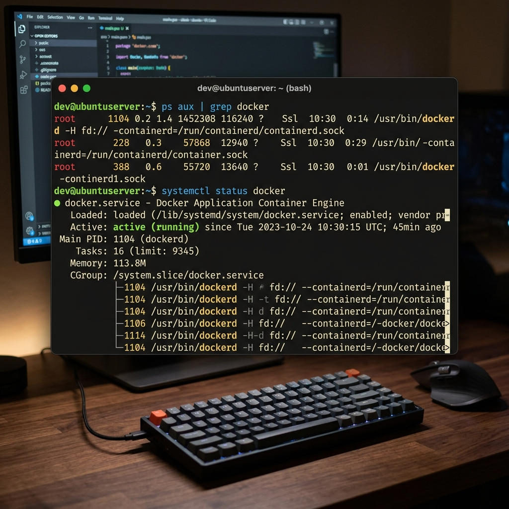
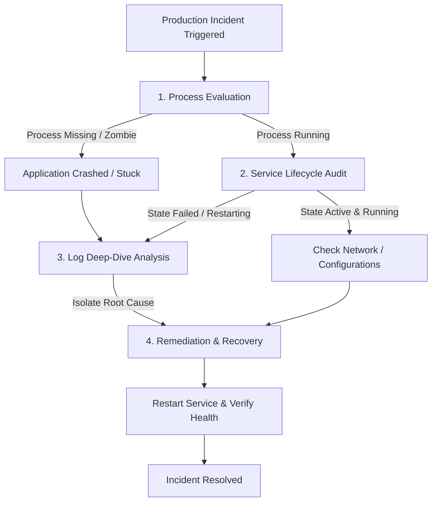

# 🐧 Day 04: Linux Practice — Processes, Services, and Log Triage

> **"In Cloud engineering, servers are living environments. Knowing how to query active processes, audit systemd services, and isolate log failures is the foundation of high-availability DevOps."**

Welcome to Day 04 of the **90 Days of DevOps** challenge! Today's session is a hands-on lab focused on mastering Linux processes, systemd services, and telemetry logs. This document serves as a production-grade practice log and troubleshooting guide, recording real-world command execution and triage flows.

---

## ⚡ Quick Scan Terminal Overview
Below is a high-fidelity visual snapshot of the diagnostics session executed in a production terminal interface:



---

## 📂 Table of Contents
1. [📊 1. Process Diagnostics (Commands 1 & 2)](#-1-process-diagnostics-commands-1--2)
2. [⚙️ 2. Systemd Service Audit (Commands 3 & 4)](#-2-systemd-service-audit-commands-3--4)
3. [📑 3. Centralized Log Inspection (Commands 5 & 6)](#-3-centralized-log-inspection-commands-5--6)
4. [🛠️ 4. Mini Triage & Troubleshooting Lifecycle](#-4-mini-triage--troubleshooting-lifecycle)
5. [📜 5. Learn in Public & Commitment](#-5-learn-in-public--commitment)

---

## 📊 1. Process Diagnostics (Commands 1 & 2)

Process diagnostics allow an engineer to audit active resource consumption, locate orphaned tasks, and verify that the target application binaries are running in user space.

| Command | Basic Syntax | DevOps Use Case | Operational Context & Tips |
| :--- | :--- | :--- | :--- |
| **`ps`** | `ps aux \| grep docker` | Dumps a snapshot of all running processes and filters for Docker components. | `aux` displays processes for all users (`a`), lists process owners (`u`), and shows detached processes (`x`). |
| **`pgrep`** | `pgrep -l dockerd` | Quickly lookup Process IDs (PIDs) by service name. | The `-l` flag lists the process name alongside the PID, avoiding manual regex parsing. |

### 💻 Process Command Examples & Expected Output

#### A. Comprehensive Process Audit (`ps aux | grep docker`)
Used to check detailed resource allocation (%CPU, %MEM), owner permissions, and startup flags for Docker processes.
```bash
ps aux | grep docker
```
**Example Output:**
```text
root      1104  0.2  1.4 1452308 116240 ?      Ssl  10:30   0:14 /usr/bin/dockerd -H fd:// --containerd=/run/containerd/containerd.sock
root      1106  0.1  0.5  712400  41200 ?      Sl   10:30   0:08 docker-containerd --config /var/run/docker/containerd/containerd.toml
sysadmin  2489  0.0  0.0  14224    920 pts/0    S+   11:15   0:00 grep --color=auto docker
```

#### B. Quick Process ID Lookup (`pgrep -l dockerd`)
Provides a rapid check of daemon health without filling up the terminal screen.
```bash
pgrep -l dockerd
```
**Example Output:**
```text
1104 dockerd
```

---

## ⚙️ 2. Systemd Service Audit (Commands 3 & 4)

Modern Linux distributions rely on `systemd` to manage background daemons. Use these commands to inspect service statuses, load configurations, and monitor active dependencies.

| Command | Basic Syntax | DevOps Use Case | Operational Context & Tips |
| :--- | :--- | :--- | :--- |
| **`systemctl status`** | `systemctl status docker` | Queries systemd to inspect configuration status, memory footprint, and recent logs. | Displays active state colors (e.g., green for `active (running)`) and lists the control group process tree. |
| **`systemctl list-units`** | `systemctl list-units --type=service --state=active` | Lists all active service units running on the host. | Extremely useful during initial server boot audits to identify unexpected services. |

### ⚙️ Service Command Examples & Expected Output

#### A. Service Status Inspection (`systemctl status docker`)
Verifies the operational state, configuration path, uptime, and main PID of the Docker engine.
```bash
systemctl status docker
```
**Example Output:**
```text
● docker.service - Docker Application Container Engine
     Loaded: loaded (/lib/systemd/system/docker.service; enabled; vendor preset: enabled)
     Active: active (running) since Tue 2026-05-30 10:30:15 UTC; 45min ago
TriggeredBy: ● docker.socket
       Docs: https://docs.docker.com
   Main PID: 1104 (dockerd)
      Tasks: 16 (limit: 9345)
     Memory: 113.8M
        CPU: 14.2s
     CGroup: /system.slice/docker.service
             └─1104 /usr/bin/dockerd -H fd:// --containerd=/run/containerd/containerd.sock
```

#### B. Listing Active System Services (`systemctl list-units --type=service --state=active`)
Audits all running services to verify systemic dependency alignment.
```bash
systemctl list-units --type=service --state=active
```
**Example Output:**
```text
UNIT                         LOAD   ACTIVE SUB     DESCRIPTION
cron.service                 loaded active running Regular background program processing daemon
dbus.service                 loaded active running D-Bus System Message Bus
docker.service               loaded active running Docker Application Container Engine
ssh.service                  loaded active running OpenSSH Daemon
systemd-journald.service     loaded active running Journal Service
systemd-logind.service       loaded active running User Login Service

LOAD   = Reflects whether the unit definition was properly loaded into memory.
ACTIVE = The high-level unit state (active, inactive, failed, etc.).
SUB    = The low-level unit activation state (running, exited, dead).
```

---

## 📑 3. Centralized Log Inspection (Commands 5 & 6)

When services fail, telemetry logs are the single source of truth. Use these commands to search, filter, and stream event outputs directly to stdout.

| Command | Basic Syntax | DevOps Use Case | Operational Context & Tips |
| :--- | :--- | :--- | :--- |
| **`journalctl`** | `journalctl -u docker -n 50 --no-pager` | Queries centralized systemd logs for a specific service. | The `--no-pager` flag dumps lines directly to the standard output, bypassing interactive scrolling utilities. |
| **`tail`** | `tail -n 50 /var/log/syslog` | Retrieves the latest entries from the global system log file. | Use `tail -f` to stream incoming logging metrics in real time during testing. |

### 📑 Log Analysis Command Examples & Expected Output

#### A. Inspecting Service-Specific Logs (`journalctl -u docker -n 50 --no-pager`)
Extracts the latest runtime occurrences from Docker's systemd journal database.
```bash
journalctl -u docker -n 3 --no-pager
```
**Example Output:**
```text
May 30 10:30:15 ubuntu-server dockerd[1104]: time="2026-05-30T10:30:15.184201082Z" level=info msg="Starting up"
May 30 10:30:16 ubuntu-server dockerd[1104]: time="2026-05-30T10:30:16.429012921Z" level=info msg="Default bridge (docker0) is created with IP address 172.17.0.1/16"
May 30 10:30:16 ubuntu-server dockerd[1104]: time="2026-05-30T10:30:16.890123910Z" level=info msg="Daemon has completed initialization"
```

#### B. Reading the Global Operating System Log (`tail -n 50 /var/log/syslog`)
Reviews system-wide signals, kernel logs, and cron events to correlate host failures.
```bash
tail -n 3 /var/log/syslog
```
**Example Output:**
```text
May 30 11:00:01 ubuntu-server CRON[3214]: (root) CMD (command -v debian-sa1 && debian-sa1 1 1)
May 30 11:10:22 ubuntu-server systemd[1]: Starting Daily apt upgrade and clean activities...
May 30 11:10:25 ubuntu-server systemd[1]: apt-daily-upgrade.service: Deactivated successfully.
```

---

## 🛠️ 4. Mini Triage & Troubleshooting Lifecycle

When an active production alert signals that a backend microservice is unhealthy or down, execute this standard 4-stage operational triage routine to restore availability:



### 📋 Operational Step Details:

1. **📌 Step 1: Process Evaluation**
   * **Action:** Check if the process table entry exists.
   * **Commands:** `pgrep -l <service>` or `ps aux | grep <service>`.
   * **Diagnostics:** If the process is completely absent or marked as a Zombie (`Z`), the application has crashed or failed to boot.

2. **📌 Step 2: Service Lifecycle Verification**
   * **Action:** Evaluate systemd unit state.
   * **Commands:** `systemctl status <service>`.
   * **Diagnostics:** Identify if the unit is in a `failed` state, has crashed with a specific exit code, or is trapped in a crash-loop backoff.

3. **📌 Step 3: Log Deep-Dive Analysis**
   * **Action:** Review runtime telemetry.
   * **Commands:** `journalctl -u <service> -n 100 --no-pager` and `tail -f /var/log/syslog`.
   * **Diagnostics:** Scan for explicit runtime exceptions (e.g., database connection timeout, disk out-of-space, bad configuration syntax, or permissions issues).

4. **📌 Step 4: Remediation & Recovery**
   * **Action:** Apply fixes and restore normal service operation.
   * **Commands:** Apply configuration changes, free system resources, then execute:
     ```bash
     sudo systemctl restart <service>
     ```
   * **Verification:** Re-run `systemctl status <service>` to ensure the service stays in `active (running)`.

---

## 📜 5. Learn in Public & Commitment

> **"Discipline, ownership, and consistency outweigh perfection. Hands-on practice builds absolute terminal confidence."**

### 🎓 Connect & Share Progress
Follow my Day 04 journey on LinkedIn. Together we are building solid infrastructure muscle memory:

* **Post Focus:** Documenting hands-on Linux practice, systemd service inspections, and logs triage.
* **Hashtags:**
  * `#90DaysOfDevOps`
  * `#DevOpsKaJosh`
  * `#TrainWithShubham`

---
**TrainWithShubham** | Day 04 Complete 🚀
