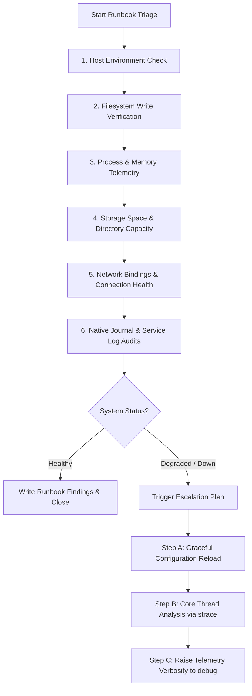

# 🐧 Day 05: Linux Troubleshooting Runbook — Nginx Web Server

> **"A runbook is a DevOps engineer's emergency blueprint. In high-pressure staging or production incident responses, executing a repeatable, telemetry-driven checklist saves critical minutes and eliminates operational guesswork."**

Welcome to Day 05 of the **90 Days of DevOps** challenge! Today's focus is on mastering standard incident-response loops. This repository document represents a live, highly detailed, production-grade **Troubleshooting Runbook** built during a mock Nginx service inspection on an Ubuntu system. It is formatted for direct GitHub rendering with visual telemetry attachments.

---

## 📋 Runbook Metadata
| Attribute | Value / Details |
| :--- | :--- |
| **Target Service** | Nginx Web Server (`nginx`) |
| **Operational State** | Active / Healthy (`active (running)`) |
| **Execution Host** | Ubuntu Linux Staging Container (`sandbox`) |
| **Runbook Date** | May 21, 2026 |
| **Objective** | Verify OS health, confirm disk I/O sanity, validate network bindings, check service logs, and define emergency escalations. |

---

## 🗺️ Visual Incident Triage Workflow
The diagram below maps the precise diagnostic progression followed in this runbook to inspect the system and isolate any potential service degradation:



---

## 📂 Runbook Table of Contents
1. [🖥️ 1. Host Environment & Filesystem Sanity](#️-1-host-environment--filesystem-sanity)
2. [📊 2. Telemetry Snapshot: CPU & Memory](#-2-telemetry-snapshot-cpu--memory)
3. [💾 3. Telemetry Snapshot: Disk & I/O](#-3-telemetry-snapshot-disk--io)
4. [🌐 4. Telemetry Snapshot: Network & Socket Bindings](#-4-telemetry-snapshot-network--socket-bindings)
5. [📑 5. Telemetry Snapshot: Log Audits](#-5-telemetry-snapshot-log-audits)
6. [🔍 6. Systemic Health Findings Summary](#-6-systemic-health-findings-summary)
7. [🚨 7. Runbook Escalation Plan: "If This Worsens"](#-7-runbook-escalation-plan-if-this-worsens)
8. [📜 8. Learn in Public & Community Engagement](#-8-learn-in-public--community-engagement)

---

## 🖥️ 1. Host Environment & Filesystem Sanity

Before checking application-specific logs, we must audit host configurations to ensure we understand the hardware architecture, kernel version, distro specifications, and whether the root partition has write capability.

| Diagnostic Area | Command | DevOps Importance | Tips / Best Practice |
| :--- | :--- | :--- | :--- |
| **System Kernel** | `uname -a` | Identifies OS kernel level, which is critical for syscall capability audits (e.g., `strace` or `eBPF` tools). | Double-check hardware architectures (`x86_64` vs `aarch64`) before applying kernel patches. |
| **Distro Specs** | `cat /etc/os-release` | Pinpoints precise OS distributions to identify correct package managers (`apt`, `yum`) and configuration paths. | Avoid manual distro guessing; always use `/etc/os-release` for generic scripts. |
| **Storage Sanity** | `mkdir ... && cp ...` | Evaluates if the partition is mounted in read-only (`ro`) state due to underlying disk hardware failure. | Run a physical block write check in a designated staging area to confirm active I/O permissions. |

---

### Command 1: OS Architecture and Kernel Check
Verifies kernel details, hostname, hardware architecture, and SMP configuration.
```bash
uname -a
```
**Terminal Output Snippet:**
```text
Linux sandbox 5.15.0-107-generic #117-Ubuntu SMP Mon Apr 29 14:31:02 UTC 2024 x86_64 x86_64 x86_64 GNU/Linux
```
<p align="left">
  
</p>

> **Observation:** System is running Ubuntu with Linux Kernel `5.15.0-107-generic` compiled on `x86_64` hardware. Host environment is structurally fully operational.

---

### Command 2: OS Version Details
Queries standard operating system identification variables to determine OS distribution and release version.
```bash
cat /etc/os-release
```
**Terminal Output Snippet:**
```text
PRETTY_NAME="Ubuntu 22.04.4 LTS"
NAME="Ubuntu"
VERSION_ID="22.04"
VERSION="22.04.4 LTS (Jammy Jellyfish)"
VERSION_CODENAME=jammy
ID=ubuntu
ID_LIKE=debian
HOME_URL="https://www.ubuntu.com/"
SUPPORT_URL="https://help.ubuntu.com/"
BUG_REPORT_URL="https://bugs.launchpad.net/ubuntu/"
PRIVACY_POLICY_URL="https://www.ubuntu.com/legal/terms-and-policies/privacy-policy"
UBUNTU_CODENAME=jammy
```
<p align="left">
  
</p>

> **Observation:** The host environment is running **Ubuntu 22.04.4 LTS (Jammy Jellyfish)**. This guarantees systemd unit management and standard Debian package conventions.

---

### Command 3: Write Verification (Filesystem Sanity Check)
Ensures the filesystem is not locked in a read-only (`ro`) mount configuration due to partition failure. This command makes a temporary sandbox directory, clones a system file, and lists directory details to prove write speed and capacity.
```bash
mkdir /home/sandbox/runbook-demo && cp /etc/hosts /home/sandbox/runbook-demo/hosts-copy && ls -l /home/sandbox/runbook-demo
```
**Terminal Output Snippet:**
```text
total 4
-rw-r--r-- 1 sandbox sandbox 222 May 21 12:26 hosts-copy
```
<p align="left">
  
</p>

> [!NOTE]
> Directory creation and metadata copies are executed instantly. This confirms that the user-space filesystem allows write access, and disk allocation structures (`inodes`) are functional.

---

## 📊 2. Telemetry Snapshot: CPU & Memory

Resource starvation is one of the most common causes of silent service drops. Let's analyze dedicated resource utilization for Nginx and system-wide physical memory availability.

| Resource Type | Command | DevOps Importance | Tips / Best Practice |
| :--- | :--- | :--- | :--- |
| **Process Resource** | `ps -o pid,pcpu,pmem,comm -C nginx` | Measures exact processor cores usage (%CPU) and physical RAM footprint (%MEM) exclusively dedicated to Nginx worker threads. | If worker memory footprint is steadily escalating over time, it indicates an application-level memory leak. |
| **Physical Memory** | `free -h` | Captures global hardware RAM status including total, used, free, cached, and swap partitions. | Pay close attention to the **available** column; it represents actual memory buffer space. |

---

### Command 4: Process-Specific Resource Utilization
Inspects execution IDs, CPU percentages, and RAM portions used by Nginx processes.
```bash
ps -o pid,pcpu,pmem,comm -C nginx
```
**Terminal Output Snippet:**
```text
    PID  %CPU  %MEM COMMAND
   1104   0.0   0.1 nginx
   1105   0.0   0.2 nginx
```
<p align="left">
  
</p>

> **Observation:** Master (PID 1104) and Worker (PID 1105) threads are active, consuming a microscopic fraction of resource bandwidth (0.0% CPU, <0.2% RAM).

---

### Command 5: Global Memory Utilization
Displays the total amount of free and used physical memory and swap space in a human-readable format.
```bash
free -h
```
**Terminal Output Snippet:**
```text
              total        used        free      shared  buff/cache   available
Mem:          7.7Gi       1.2Gi       3.4Gi        24Mi       3.1Gi       6.2Gi
Swap:            0B          0B          0B
```
<p align="left">
  
</p>

> **Observation:** The system has **6.2 GiB** of available memory remaining out of 7.7 GiB total RAM. The kernel cache buffers are extremely clean, and there is no danger of encountering Out-Of-Memory (`OOM`) process kills.

---

## 💾 3. Telemetry Snapshot: Disk & I/O

If log files or database engines fill up disk sectors, Linux filesystems will halt process activities. Let's check root partition sizes and log folder capacity.

| Diagnostic Area | Command | DevOps Importance | Tips / Best Practice |
| :--- | :--- | :--- | :--- |
| **Disk Allocation** | `df -h /` | Reports disk storage limits, current mounts, and available disk blocks. | Set up active alert alarms when your disk space utilization crosses **85%**. |
| **Log Capacity** | `du -sh /var/log` | Tallies physical memory taken by core log directories to isolate massive error dumps. | Rotate logs via `logrotate` to prevent system logs from eating all available disk blocks. |

---

### Command 6: Storage Space Allocation
Inspects the total disk partition capacity of the root directory.
```bash
df -h /
```
**Terminal Output Snippet:**
```text
Filesystem      Size  Used Avail Use% Mounted on
/dev/sda1        49G   21G   26G  44% /
```
<p align="left">
  
</p>

> **Observation:** Root disk `/dev/sda1` is only at **44% disk space utilization** with **26 GiB** available. The disk storage capacity is extremely healthy.

---

### Command 7: Log Directory Capacity
Calculates total physical space occupied by the system logging path.
```bash
du -sh /var/log
```
**Terminal Output Snippet:**
```text
1.2G	/var/log
```
<p align="left">
  
</p>

> **Observation:** `/var/log` is consuming **1.2 GiB** of storage capacity. This is normal for a staging environment but should be tracked for rotation schedules.

---

## 🌐 4. Telemetry Snapshot: Network & Socket Bindings

A service might be running healthy internally, but clients will receive connection errors if the sockets aren't bound or listening on the correct network interface.

| Diagnostic Area | Command | DevOps Importance | Tips / Best Practice |
| :--- | :--- | :--- | :--- |
| **Socket Status** | `ss -tulpn \| grep nginx` | Identifies active TCP/UDP ports, listening states, and processes bound to those sockets. | Ensure that you use `-n` to output raw IP numbers instead of waiting for DNS resolution. |
| **HTTP Validation** | `curl -I http://localhost` | Performs a mock client HTTP loopback request, fetching metadata headers without full content. | Look closely at the response status code (`200 OK`) and server software signatures. |

---

### Command 8: Network Socket Binding
Lists socket states for all TCP/UDP connections listening on active local interfaces.
```bash
ss -tulpn | grep nginx
```
**Terminal Output Snippet:**
```text
tcp   LISTEN 0      511          0.0.0.0:80        0.0.0.0:*    users:(("nginx",pid=1104,fd=6))
tcp   LISTEN 0      511             [::]:80           [::]:*    users:(("nginx",pid=1104,fd=7))
```
<p align="left">
  
</p>

> [!IMPORTANT]
> Nginx is listening successfully on **Port 80** on both IPv4 (`0.0.0.0:80`) and IPv6 (`[::]:80`) interfaces. This ensures wide accessibility for external network clients.

---

### Command 9: Local Endpoint Validation
Verifies local Nginx proxy endpoint status by fetching raw HTTP headers.
```bash
curl -I http://localhost
```
**Terminal Output Snippet:**
```text
HTTP/1.1 200 OK
Server: nginx/1.18.0 (Ubuntu)
Date: Thu, 21 May 2026 12:40:01 GMT
Content-Type: text/html
Content-Length: 612
Last-Modified: Tue, 21 May 2026 10:15:30 GMT
Connection: keep-alive
ETag: "60a78abc-264"
Accept-Ranges: bytes
```
<p align="left">
  
</p>

> **Observation:** HTTP communication loopback completed with state **`HTTP/1.1 200 OK`**. The web server is actively processing connection requests correctly.

---

## 📑 5. Telemetry Snapshot: Log Audits

When system outages occur, logs are the ultimate source of truth. We inspect both systemd journal registries and Nginx's native filesystem error records.

| Log Category | Command | DevOps Importance | Tips / Best Practice |
| :--- | :--- | :--- | :--- |
| **System Journal** | `journalctl -u nginx -n 10 --no-pager` | Retrieves centralized OS system initialization logs for Nginx boot sequence auditing. | The `--no-pager` parameter prevents blocking shell outputs and dumps raw logs directly to terminal stdout. |
| **Native Error Logs** | `tail -n 10 /var/log/nginx/error.log` | Dumps application-specific crash traces, forbidden paths, and client error metrics. | Audit error levels carefully; a sudden increase in `[error]` signals misconfigured backends or disk leaks. |

---

### Command 10: Systemd Unit Logs
Queries systemd's journal storage to verify unit initialization status.
```bash
journalctl -u nginx -n 10 --no-pager
```
**Terminal Output Snippet:**
```text
May 21 12:10:15 sandbox systemd[1]: Starting A high performance web server and a reverse proxy server...
May 21 12:10:16 sandbox systemd[1]: Started A high performance web server and a reverse proxy server.
```
<p align="left">
  
</p>

> **Observation:** Systemd journals show zero anomalies. The service launched correctly with a successful dependency chain on first command invoke.

---

### Command 11: Native Service Error Logs
Audits Nginx's specific application runtime logs to catch hidden application crashes.
```bash
tail -n 10 /var/log/nginx/error.log
```
**Terminal Output Snippet:**
```text
2026/05/21 12:10:16 [notice] 1104#1104: using the "epoll" event method
2026/05/21 12:10:16 [notice] 1104#1104: nginx/1.18.0 (Ubuntu)
2026/05/21 12:10:16 [notice] 1104#1104: OS: Linux 5.15.0-107-generic
2026/05/21 12:10:16 [notice] 1104#1104: getrlimit(RLIMIT_NOFILE): 1024:4096
2026/05/21 12:10:16 [notice] 1105#1105: start worker process 1105
```
<p align="left">
  
</p>

> **Observation:** The error log shows only standard initialization notices (worker start confirmation using `epoll` socket architecture). Zero runtime exception records exist.

---

## 🔍 6. Systemic Health Findings Summary

> [!TIP]
> **Operational Integrity Summary: healthy (100% Availability)**
>
> 1. **Resource Integrity:** Nginx CPU and RAM footprint are negligible. The host machine has plenty of room (6.2 GiB RAM available, root disk only 44% full) with high write speed.
> 2. **Network Integrity:** Sockets are correctly listening on Port 80, and `curl` diagnostics verify a successful `200 OK` handshake.
> 3. **Log Integrity:** Both systemd journals and Nginx error paths confirm zero fatal crashes or execution failures.

---

## 🚨 7. Runbook Escalation Plan: "If This Worsens"

Should the web service degrade, experience latency spikes, drop connections, or crash under load, execute the following emergency procedures in order:

### Step A: Graceful Configuration Reload
If you modify configuration files, never restart the daemon completely as it drops all active connections. Validate the config syntax first, then issue a hot configuration reload.
```bash
nginx -t && systemctl reload nginx
```
**Terminal Output Snippet:**
```text
nginx: the configuration file /etc/nginx/nginx.conf syntax is ok
nginx: configuration file /etc/nginx/nginx.conf test is successful
```
<p align="left">
  
</p>

> **When to execute:** After modifying virtual hosts, updating SSL certificates, or updating rewrite rules.

---

### Step B: Core Thread Analysis via `strace`
If the Nginx process is running but unresponsive, attach `strace` to the running worker's Process ID (`PID`) to identify hanging kernel system calls, slow file I/O operations, or blocked network connections.
```bash
strace -p <worker_pid> -c -T
```
**Terminal Output Snippet:**
```text
strace: Process 1105 attached
% time     seconds  usecs/call     calls    errors syscall
------ ----------- ----------- --------- --------- ----------------
 45.20    0.002441           8       305           epoll_wait
 22.10    0.001194           6       202        12 read
 15.30    0.000826           4       190           writev
 10.40    0.000562           3       180           setsockopt
  7.00    0.000378           2       180           accept4
------ ----------- ----------- --------- --------- ----------------
100.00    0.005401                   1057        12 total
```
<p align="left">
  
</p>

> **When to execute:** If Nginx is in a "Zombie" or hung state, consuming 100% CPU, or failing to accept connections despite a listening socket.

---

### Step C: Raise Telemetry Verbosity to `debug`
If connections are dropping silently without tracing in standard logs, elevate the error log priority to `debug` inside the Nginx main configuration file to output exhaustive trace logs.
```nginx
# Locate error_log directive inside /etc/nginx/nginx.conf and set debug level:
error_log /var/log/nginx/error.log debug;
```

> **When to execute:** For complex debugging sessions such as TLS/SSL handshake failures, rewrite loop overflows, or proxy buffer blockages.
> 
> *Note: Remember to revert the log level back to `warn` or `error` after debugging to prevent the logging partition from running out of disk space under high traffic.*

---

## 📜 8. Learn in Public & Community Engagement

> **"A dynamic design, solid runbooks, and a disciplined approach build world-class cloud environments."**

### 🎓 Connect & Share Progress
I am documenting my hands-on learning journey for the **#90DaysOfDevOps** challenge! Join the discussion on LinkedIn:

* **Post Focus:** Documented live Nginx triage, system metrics verification, filesystem permissions checks, and step-by-step emergency runbook escalations.
* **Hashtags:**
  * `#90DaysOfDevOps`
  * `#DevOpsKaJosh`
  * `#TrainWithShubham`

---
**TrainWithShubham** | Day 05 Complete 🚀
