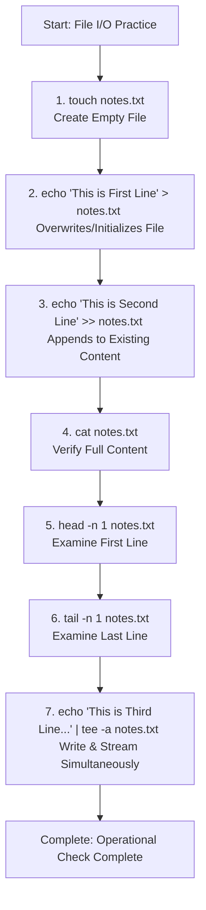

# 🐧 Day 06: Linux Fundamentals — Master Read & Write Text Files

> **"In DevOps, text manipulation is a fundamental superpower. Configuration files, system logs, environment definitions, and CI/CD pipelines are all represented as text files. Knowing how to efficiently create, write, append, and slice text files directly from the command line is essential for building automation and troubleshooting systems in real time."**

Welcome to Day 06 of the **90 Days of DevOps** challenge! Today's focus is on mastering essential Linux File I/O operations and input/output redirections. This practice guide documents hands-on file manipulation using standard commands (`touch`, `cat`, `head`, `tail`, `tee`) and redirection operators (`>` and `>>`), complete with real terminal execution outputs and visual verification screenshots.

---

## 📋 Practice Metadata

| Attribute | Details |
| :--- | :--- |
| **Concept** | Linux File I/O & Redirections |
| **Key Operators** | Standard Redirection (`>`), Append Redirection (`>>`), Pipe (`|`) |
| **Target Commands** | `touch`, `echo`, `cat`, `head`, `tail`, `tee` |
| **Execution Host** | Ubuntu Linux Environment |
| **Practice Date** | May 22, 2026 |
| **GitHub Target** | `90DaysOfDevOps/2026/day-06/` |

---

## 🗺️ File I/O Redirection & Flow Chart

The following flowchart illustrates the step-by-step pipeline executed to create, populate, append, stream, and query our text file:



---

## 📑 Table of Contents
1. [🛠️ 1. Core File I/O Reference Matrix](#️-1-core-file-io-reference-matrix)
2. [🚀 2. Step-by-Step Hands-On Practice Guide](#-2-step-by-step-hands-on-practice-guide)
   - [Step 1: Creating an Empty File (`touch`)](#step-1-creating-an-empty-file-touch)
   - [Step 2: Initializing Text Content (`>`)](#step-2-initializing-text-content-)
   - [Step 3: Appending Additional Content (`>>`)](#step-3-appending-additional-content-)
   - [Step 4: Reading Full File Content (`cat`)](#step-4-reading-full-file-content-cat)
   - [Step 5: Inspecting File Headers (`head`)](#step-5-inspecting-file-headers-head)
   - [Step 6: Inspecting File Footers (`tail`)](#step-6-inspecting-file-footers-tail)
   - [Step 7: Multiplexing Streams with `tee`](#step-7-multiplexing-streams-with-tee)
3. [🔍 3. Advanced DevOps Insights & Redirection Pitfalls](#-3-advanced-devops-insights--redirection-pitfalls)
4. [📜 4. Learn in Public & Community Engagement](#-4-learn-in-public--community-engagement)

---

## 🛠️ 1. Core File I/O Reference Matrix

Understanding standard stream channels (`stdin`, `stdout`, `stderr`) and core command utilities is critical before automating system setups:

| Utility / Operator | Stream Target | DevOps Primary Purpose | Pro-Tip / Best Practice |
| :--- | :--- | :--- | :--- |
| **`touch <file>`** | Filesystem inode | Creates empty files or updates access/modification timestamps without altering content. | Use to pre-allocate lockfiles or placeholder configs before configuration engines execute. |
| **`>`** | `stdout` -> File | Standard redirection operator. Overwrites the destination file's entire content. | **Use with caution!** A single `>` on a critical configuration or system database file will instantly erase existing contents. |
| **`>>`** | `stdout` -> File | Append redirection operator. Appends new lines to the end of the file without deleting existing text. | Perfect for adding entries to host files (`/etc/hosts`) or writing logs dynamically. |
| **`cat <file>`** | File -> `stdout` | Concatenates and displays full file content directly on the terminal. | Avoid using `cat` for huge files (e.g., multi-gigabyte access logs); it loads everything into standard output. Use `less` or `tail` instead. |
| **`head -n [X] <file>`** | File -> `stdout` | Displays the first `X` lines of a file (default is 10 lines). | Incredibly useful for inspecting metadata headers, CSV column structures, or the start of script files. |
| **`tail -n [X] <file>`** | File -> `stdout` | Displays the last `X` lines of a file (default is 10 lines). | Essential for viewing recent errors. Use `-f` (`tail -f`) to read growing system log streams actively. |
| **`tee -a <file>`** | `stdout` -> File & Terminal | Splices standard output, displaying it to the terminal screen and writing it to one or more files concurrently. | Use `tee -a` with `sudo` (`sudo tee -a`) when you need to write to root-owned files inside a pipeline. |

---

## 🚀 2. Step-by-Step Hands-On Practice Guide

Follow this logical process sequence to understand standard file interaction commands.

### Step 1: Creating an Empty File (`touch`)
We initialize a new text file named `notes.txt` using the `touch` utility. This allocates a clean inode in the filesystem structure.

```bash
touch notes.txt
```

**Terminal Output Visual Evidence:**
<p align="left">
  
</p>

> [!NOTE]
> Running `touch` on an existing file does not change its text contents. It merely updates the file's modification and access timestamps to the current system time, which is frequently used to trigger build tasks.

---

### Step 2: Initializing Text Content (`>`)
Next, we write our initial string to `notes.txt` using the standard output redirection operator (`>`).

```bash
echo "This is First Line" > notes.txt
```

**Terminal Output Visual Evidence:**
<p align="left">
   redirection" src="https://github.com/user-attachments/assets/d7d7de45-cb3f-4cdf-818e-3fd45264f767" />
</p>

> [!WARNING]
> The single redirection operator `>` is an **overwriting operation**. If `notes.txt` previously contained data, that data is instantly deleted and replaced by this command's output.

---

### Step 3: Appending Additional Content (`>>`)
To add a second line of text without losing our first line, we employ the append redirection operator (`>>`).

```bash
echo "This is Second Line" >> notes.txt
```

**Terminal Output Visual Evidence:**
<p align="left">
  > redirection" src="https://github.com/user-attachments/assets/d6e23041-0a88-45d4-8b00-c1c51b9888f4" />
</p>

> [!IMPORTANT]
> Keep in mind that when writing automation scripts, utilizing `>>` guarantees your script remains **non-destructive**. It safe-guards existing environment variables or configuration files by simply tacking new lines at the end.

---

### Step 4: Reading Full File Content (`cat`)
We print the complete contents of `notes.txt` to our terminal console using `cat`.

```bash
cat notes.txt
```

**Expected Terminal Output Snippet:**
```text
This is First Line
This is Second Line
```

**Terminal Output Visual Evidence:**
<p align="left">
  
</p>

---

### Step 5: Inspecting File Headers (`head`)
We fetch the topmost line of `notes.txt` to verify how we can slice files starting from line 1. We specify exactly 1 line with the `-n 1` flag.

```bash
head -n 1 notes.txt
```

**Expected Terminal Output Snippet:**
```text
This is First Line
```

**Terminal Output Visual Evidence:**
<p align="left">
  
</p>

> [!TIP]
> **Typo Correction Note:** In the initial execution run, a typo occurred where the file was referred to as `notest.txt` (extra 't'). In standard terminal environments, this produces a `No such file or directory` error. Keep spelling exact and syntax precise!

---

### Step 6: Inspecting File Footers (`tail`)
Similarly, we query the bottom of our text file to read only the latest addition. We request the final line with the `-n 1` flag.

```bash
tail -n 1 notes.txt
```

**Expected Terminal Output Snippet:**
```text
This is Second Line
```

**Terminal Output Visual Evidence:**
<p align="left">
  
</p>

> [!TIP]
> When monitoring production environments, combine `tail` with the `-f` (follow) switch: `tail -f /var/log/syslog`. This stays active in your session, updating the output in real-time as syslog lines are appended.

---

### Step 7: Multiplexing Streams with `tee`
In advanced workflows, we often want to print log outputs to our screen while sending them to a backup logfile. The `tee` utility is designed specifically for this, and the `-a` flag tells it to append rather than overwrite.

```bash
echo "This is Third Line using tee command" | tee -a notes.txt
```

**Expected Terminal Output Snippet:**
```text
This is Third Line using tee command
```

**Terminal Output Visual Evidence:**
<p align="left">
  
</p>

> [!IMPORTANT]
> **DevOps Pipeline Magic:** In bash, running `sudo echo "line" >> /etc/protected.conf` will fail because the redirection operator (`>>`) is executed by the unprivileged shell.
> The professional workaround is using `tee` inside a pipeline:
> `echo "line" | sudo tee -a /etc/protected.conf`
> This executes the echo in user space but executes the file write under administrative `sudo` privileges. Keep this pattern handy!

---

## 🔍 3. Advanced DevOps Insights & Redirection Pitfalls

### The Silent Destroyer: `>` vs `>>`
When operating configuration managers or modifying production systems, using standard redirections presents real risks:
- **`>` (Truncation Write)**: Closes the file, drops all existing byte allocations to zero, and writes fresh bytes. Perfect for initializing clean data, but catastrophic on live logs or config mappings.
- **`>>` (Append Write)**: Seeks directly to the end of the file descriptor and writes data, leaving pre-existing blocks completely untouched. Always prefer append in operational pipelines unless deliberate replacement is desired.

### File I/O Diagnostic Commands
As a DevOps engineer, you will regularly inspect active files. Here are two critical tools:
1. **`wc -l notes.txt`**: Counts lines in a file.
2. **`grep "Pattern" notes.txt`**: Searches for lines matching a string pattern.

---

Day 06 Complete 🚀