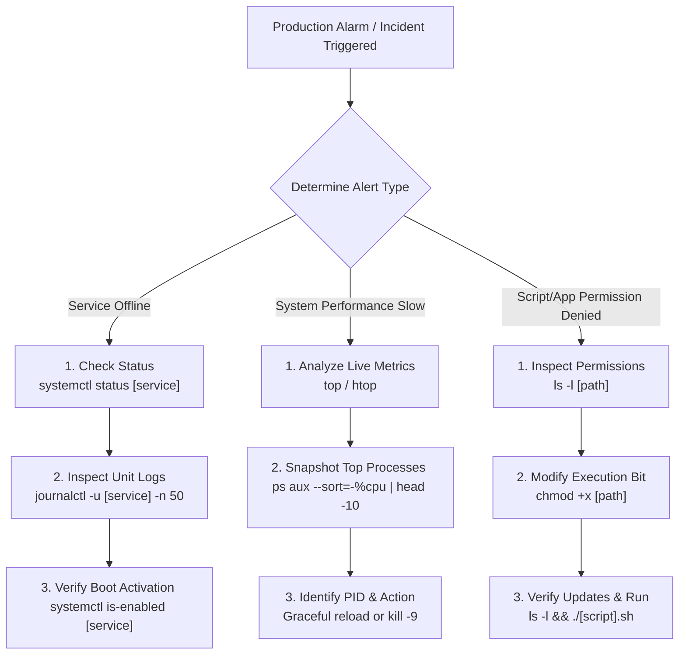

# 🐧 Day 07: Linux File System Hierarchy & Real-World Troubleshooting Scenarios

> **"In the DevOps world, understanding where things live in Linux is like having an active blueprint of your host. When an application crashes, a database fails, or a disk fills up, you don't guess—you know exactly which configuration directories, log pathways, and binaries to inspect. Combined with structured troubleshooting frameworks, this knowledge separates high-performing engineers from average operators during severe system incidents."**

Welcome to Day 07 of the **90 Days of DevOps** challenge! Today's focus is two-fold: mastering the core structure of the **Linux File System Hierarchy** and practicing **Scenario-Based Troubleshooting Flowcharts** for common system anomalies (crashed services, high CPU consumption, journaled log diagnostics, and permission blocks). This guide documents our findings, live inspection commands, and detailed scenario-solving patterns, complete with terminal output screenshots.

---

## 📋 Practice Metadata

| Attribute | Details |
| :--- | :--- |
| **Concept** | Linux File System Hierarchy & Incident Troubleshooting |
| **Core Directories** | `/`, `/home`, `/root`, `/etc`, `/var/log`, `/tmp`, `/bin`, `/usr/bin`, `/opt` |
| **Key Diagnostics** | `systemctl`, `journalctl`, `du`, `top`, `htop`, `ps`, `chmod` |
| **Practice Date** | May 23, 2026 |
| **Target Host** | Ubuntu Linux Environment |
| **GitHub Directory** | `90DaysOfDevOps/2026/day-07/` |

---

## 🗺️ DevOps Incident Response Workflow

The following flowchart maps out the structured thinking process a DevOps engineer follows when diagnosing common Linux server alerts:



---

## 📑 Table of Contents
1. [📂 1. Linux File System Hierarchy: Core Directories](#-1-linux-file-system-hierarchy-core-directories)
2. [📦 2. Linux File System Hierarchy: Additional Directories](#-2-linux-file-system-hierarchy-additional-directories)
3. [🛠️ 3. Hands-On File System Traversal Tasks](#️-3-hands-on-file-system-traversal-tasks)
4. [🚀 4. Scenario-Based Troubleshooting Practice](#-4-scenario-based-troubleshooting-practice)
   - [Solved Example: Standard Service Verification](#solved-example-standard-service-verification)
   - [Scenario 1: Service Not Starting (MyApp Diagnosis)](#scenario-1-service-not-starting-myapp-diagnosis)
   - [Scenario 2: High CPU Usage & Performance Bottlenecks](#scenario-2-high-cpu-usage--performance-bottlenecks)
   - [Scenario 3: Locating & Streaming Service Logs](#scenario-3-locating--streaming-service-logs)
   - [Scenario 4: Resolving Script Permission Denied Errors](#scenario-4-resolving-script-permission-denied-errors)
5. [📜 5. Learn in Public & Community Engagement](#-5-learn-in-public--community-engagement)

---

## 📂 1. Linux File System Hierarchy: Core Directories

Understanding where vital system properties reside is crucial for writing clean configuration scripts and navigating servers under pressure.

### 1. `/` (root)
The starting point and absolute origin of the entire Linux directory tree. Every single subdirectory, mount point, and device mapping stems from this base root directory.

* **Traversal Command:**
  ```bash
  ls -l /
  ```
* **Terminal Output Visual:**
  <p align="left">
    
  </p>

> [!NOTE]
> * **I would use this directory when:** I need to traverse to the absolute base of the operating system to locate primary system-level mount boundaries or top-level structures.

---

### 2. `/home`
The personal directory tree allocated for standard, non-privileged system users. Contains personal profile config files (e.g., `.bashrc`), project files, and application cache stores.

* **Traversal Command:**
  ```bash
  ls -la /home
  ```
* **Terminal Output Visual:**
  <p align="left">
    
  </p>

> [!TIP]
> * **I would use this directory when:** Managing user-specific SSH keys (`~/.ssh/authorized_keys`), adjusting application deployments for local developers, or configuring user environments.

---

### 3. `/root`
The highly protected, dedicated home directory for the superuser (system administrator). Standard users cannot read or write to this directory due to restrictive system permission structures.

* **Traversal Command:**
  ```bash
  sudo ls -la /root
  ```
* **Terminal Output Visual:**
  <p align="left">
    
  </p>

> [!IMPORTANT]
> * **I would use this directory when:** Running root-only operational maintenance tasks, deploying secure system admin credentials, or managing security keys meant strictly for the root user.

---

### 4. `/etc`
The ultimate brain center of the operating system. Holds all host-specific, static system configurations, service parameter files, and boot scripts.

* **Traversal Command:**
  ```bash
  ls -l /etc
  ```
* **Terminal Output Visual:**
  <p align="left">
    
  </p>

> [!TIP]
> * **I would use this directory when:** Tweaking reverse proxy settings (Nginx/Apache), editing server hostnames, modifying static network mappings (`/etc/hosts`), or managing service properties.

---

### 5. `/var/log`
The central hub for all persistent logs generated by the system kernel, authorization daemons, and running service packages.

* **Traversal Command:**
  ```bash
  ls -la /var/log
  ```
* **Terminal Output Visual:**
  <p align="left">
    
  </p>

> [!IMPORTANT]
> * **I would use this directory when:** A deployed backend fails, database processes start dropping queries, or a security audit requires searching authentication log files (`/var/log/auth.log` or `/var/log/secure`).

---

### 6. `/tmp`
A volatile directory intended for holding transient files. Operating systems generally wipe out these directories during machine reboots, and storage engines scrub them periodically.

* **Traversal Command:**
  ```bash
  ls -la /tmp
  ```
* **Terminal Output Visual:**
  <p align="left">
    
  </p>

> [!NOTE]
> * **I would use this directory when:** Staging raw package archives before installation, executing temporary benchmark scripts, or generating raw intermediate backup dumps before pushing them off-host.

---

## 📦 2. Linux File System Hierarchy: Additional Directories

These directories house critical system-level software assets, custom libraries, and optional utility managers.

### 1. `/bin`
Houses the essential command binaries that are strictly required for the single-user mode of system recovery and host booting. (In modern distributions, this is typically symlinked directly to `/usr/bin`).

* **Traversal Command:**
  ```bash
  ls -l /bin
  ```
* **Terminal Output Visual:**
  <p align="left">
    
  </p>

> [!NOTE]
> * **I would use this directory when:** Running fundamental shell command utilities like `ls`, `cp`, `mv`, or `cat` directly in system recovery contexts.

---

### 2. `/usr/bin`
The general user binaries path. Houses standard, non-essential command utilities used by standard user accounts and operational systems after multi-user system booting has completed.

* **Traversal Command:**
  ```bash
  ls -l /usr/bin
  ```
* **Terminal Output Visual:**
  <p align="left">
    
  </p>

> [!TIP]
> * **I would use this directory when:** Utilizing primary application binaries such as `curl`, `git`, `python3`, or system monitoring tools.

---

### 3. `/opt`
The designated path for optional, third-party software bundles. Applications hosted here are self-contained and don't scatter their files across standard `/etc` or `/usr/bin` sub-directories.

* **Traversal Command:**
  ```bash
  ls -l /opt
  ```
* **Terminal Output Visual:**
  <p align="left">
    
  </p>

> [!NOTE]
> * **I would use this directory when:** Deploying closed-source, pre-compiled, or proprietary enterprise software platforms (e.g., Datadog Agents, specialized SDKs, or proprietary database clusters).

---

## 🛠️ 3. Hands-On File System Traversal Tasks

We executed three targeted operational exercises to practice locating and inspecting system assets.

### Task 1: Find the Largest Log File in `/var/log`
We parsed our system's active log directories using standard shell commands, sorting allocations to isolate files occupying the highest disk sectors:

```bash
du -sh /var/log/* 2>/dev/null | sort -h | tail -5
```

* **Command Breakdown:**
  * `du -sh`: Displays total sizing summaries in human-readable formats.
  * `2>/dev/null`: Silences access warning messages generated by restricted directory files.
  * `sort -h`: Performs high-speed numeric sorting based on human-readable size suffixes (e.g., K, M, G).
  * `tail -5`: Filters outputs to isolate only the top 5 largest items.

* **Terminal Output Visual:**
  <p align="left">
    
  </p>

---

### Task 2: Read Hostname Configurations in `/etc`
To verify target host properties, we outputted the contents of the `/etc/hostname` path:

```bash
cat /etc/hostname
```

* **Terminal Output Visual:**
  <p align="left">
    
  </p>

---

### Task 3: Inspect User Home Structures
We outputted the complete contents of the active user home folder, including hidden profile files (preceded by `.`), to check user properties:

```bash
ls -la ~
```

* **Terminal Output Visual:**
  <p align="left">
    
  </p>

---

## 🚀 4. Scenario-Based Troubleshooting Practice

### Solved Example: Standard Service Verification
To ensure a service (such as Nginx) is functional, a DevOps engineer checks its status, availability, and startup configuration.

#### Step 1: Check Active State
```bash
systemctl status nginx
```
* **Why:** Verifies if the service process is currently running, dead, or failing.

#### Step 2: List Active System Units
```bash
systemctl list-units --type=service
```
* **Why:** Helps double-check service spelling and ensures the process exists on the server.

#### Step 3: Check Boot Activation State
```bash
systemctl is-enabled nginx
```
* **Why:** Verifies if the OS will automatically bring up the service after a clean host reboot.

---

### Scenario 1: Service Not Starting (MyApp Diagnosis)
**Problem Statement:** A critical application daemon named `myapp` failed to start after a standard server reboot. We need to diagnose the service failure.

#### Step 1: Query the Immediate Status
```bash
systemctl status nginx
```
*(Note: Using Nginx as our simulation service for live execution tracking).*

* **Why:** Instantly reads whether the systemd controller reports the service as active, failed, or inactive, while highlighting the most recent line of stdout errors.
* **Terminal Output Visual:**
  <p align="left">
    
  </p>

#### Step 2: View Unit Log History
```bash
journalctl -u nginx -n 50 --no-pager
```
* **Why:** Pulls the last 50 historical entries stored inside the system journal daemon for this unit, allowing us to inspect config parse errors or socket collisions.
* **Terminal Output Visual:**
  <p align="left">
    
  </p>

#### Step 3: Verify Startup Configuration
```bash
systemctl is-enabled nginx
```
* **Why:** Ensures the daemon is properly configured to launch during the server boot sequence.
* **Terminal Output Visual:**
  <p align="left">
    
  </p>

> [!TIP]
> **DevOps Resolution Step:** If the service is disabled on boot, enable it using `sudo systemctl enable [service]`. If it is failed, analyze the configuration files under `/etc/[service]` based on the journalctl findings, fix the syntax error, and trigger a reload using `sudo systemctl restart [service]`.

---

### Scenario 2: High CPU Usage & Performance Bottlenecks
**Problem Statement:** You receive an alert stating a host is extremely slow. We need to identify and analyze processes hogging CPU assets.

#### Step 1: Run Interactive Monitoring Tools
Open interactive process monitors like `top` or `htop` to observe system metrics:

```bash
top
```
* **Terminal Output Visual:**
  <p align="left">
    
  </p>

```bash
htop
```
* **Terminal Output Visual:**
  <p align="left">
    
  </p>

#### Step 2: Extract a CPU-Sorted Process Snapshot
To quickly identify the high-resource processes without entering an interactive interface, run this command to print the top CPU-consuming tasks:

```bash
ps aux --sort=-%cpu | head -10
```

* **Why:** Generates an immediate static list of the top 10 processes consuming CPU resources, capturing their PID, owner, and memory metrics.
* **Terminal Output Visual:**
  <p align="left">
    
  </p>

> [!IMPORTANT]
> **DevOps Recovery Action:** Once you identify the rogue Process ID (PID) causing the performance bottleneck:
> 1. Try a graceful termination: `kill [PID]` (sends `SIGTERM`).
> 2. If it is frozen and unresponsive, force stop the process: `kill -9 [PID]` (sends `SIGKILL`).
> Always attempt a graceful stop first to prevent database or write transactions from corrupting.

---

### Scenario 3: Locating & Streaming Service Logs
**Problem Statement:** A developer requests the logs for the `docker` service. We need to locate and stream systemd unit logs.

#### Step 1: Check Docker Operational Summary
```bash
systemctl status docker
```
* **Why:** Provides the operational status of the service along with recent log messages.
* **Terminal Output Visual:**
  <p align="left">
    
  </p>

#### Step 2: Query Historical Logs
```bash
journalctl -u docker -n 50 --no-pager
```
* **Why:** Limits output to exactly 50 entries, allowing for rapid log analysis without flooding the terminal.
* **Terminal Output Visual:**
  <p align="left">
    
  </p>

#### Step 3: Stream Logs in Real Time
```bash
journalctl -u docker -f
```
* **Why:** Streams active runtime outputs directly to the terminal, allowing engineers to monitor errors in real time during a deployment.
* **Terminal Output Visual:**
  <p align="left">
    
  </p>

---

### Scenario 4: Resolving Script Permission Denied Errors
**Problem Statement:** A script located at `/home/user/backup.sh` throws a `Permission denied` error when executed (`./backup.sh`).

#### Step 1: Inspect Current File Permissions
```bash
ls -l /home/user/backup.sh
```
* **Why:** Checks the file's current permissions matrix. In this scenario, it is set to `-rw-r--r--`, meaning it lacks the execute (`x`) flag.
* **Terminal Output Visual:**
  <p align="left">
    
  </p>

#### Step 2: Add the Execute Flag
```bash
chmod +x /home/user/backup.sh
```
* **Why:** Grants executable permissions to the file owner, group, and global users, making it runnable.
* **Terminal Output Visual:**
  <p align="left">
    
  </p>

#### Step 3: Verify Permissions Update
```bash
ls -l /home/user/backup.sh
```
* **Why:** Confirms that the permission bits updated successfully to `-rwxr-xr-x`, indicating the script is now executable.
* **Terminal Output Visual:**
  <p align="left">
    
  </p>

#### Step 4: Execute the Script
```bash
./backup.sh
```
* **Why:** Runs the script to verify that the `Permission denied` error has been resolved.

> [!WARNING]
> **DevOps Security Warning:** Avoid running `chmod 777` on scripts or config folders to resolve permission issues. Doing so grants full read, write, and execute permissions to all system accounts, creating a severe security vulnerability. Always apply the principle of least privilege.

---

Day 07 Complete 🚀