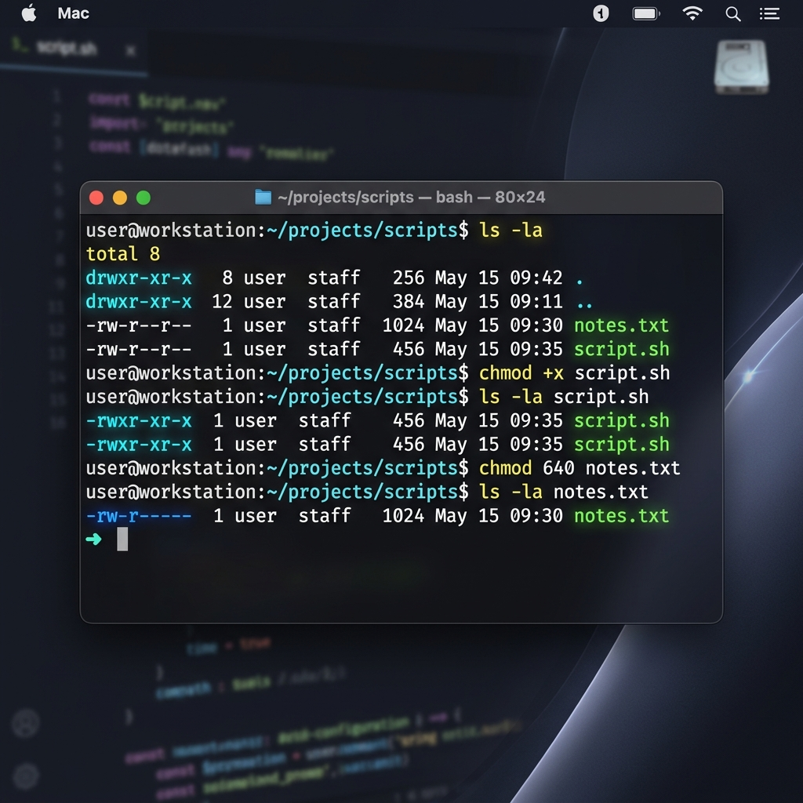

# Day 10: Linux File Permissions and File Operations

This documentation logs the completion of the Day 10 Challenge for the 90DaysOfDevOps initiative, focusing on understanding, modifying, and testing Linux file permissions and basic file operations.

---

## Table of Contents
1. [Overview](#overview)
2. [Task 1: Creating Files](#task-1-creating-files)
3. [Task 2: Reading and Viewing Files](#task-2-reading-and-viewing-files)
4. [Task 3: Linux Permission Model Analysis](#task-3-linux-permission-model-analysis)
5. [Task 4: Modifying Permissions](#task-4-modifying-permissions)
6. [Task 5: Testing Access Control Boundaries](#task-5-testing-access-control-boundaries)
7. [Verification Screenshot](#verification-screenshot)
8. [Key Technical Takeaways](#key-technical-takeaways)

---

## Overview
The primary objectives of this challenge include:
* Creating files using core Linux utilities.
* Viewing file contents using stream redirection and text manipulation commands.
* Analyzing the standard POSIX permission model.
* Enforcing access control restrictions using absolute and symbolic modes in `chmod`.
* Verifying operating system enforcement of permissions through boundary testing.

---

## Task 1: Creating Files
Three distinct files were created in the environment to serve as test subjects for permission modifications:

### Commands Executed:
```bash
# Create an empty file
touch devops.txt

# Create a file with content using redirection
echo "Learning File Permissions in DevOps is essential!" > notes.txt

# Create a shell script containing an echo statement
echo 'echo "Hello DevOps"' > script.sh
```

### Initial Permission Verification:
```bash
$ ls -l devops.txt notes.txt script.sh
-rw-r--r--  1 ToucanRajat  staff   0 May 30 02:14 devops.txt
-rw-r--r--  1 ToucanRajat  staff  50 May 30 02:14 notes.txt
-rw-r--r--  1 ToucanRajat  staff  20 May 30 02:14 script.sh
```
The files were created with default permissions of `644` (`-rw-r--r--`), which permits read and write access to the file owner, and read-only access to group members and others.

---

## Task 2: Reading and Viewing Files
Core Linux commands were utilized to inspect file streams and system databases:

### Commands and Outputs:
1. **Reading local file content:**
   ```bash
   $ cat notes.txt
   Learning File Permissions in DevOps is essential!
   ```
2. **Retrieving the first 5 lines of the system user database:**
   ```bash
   $ head -n 5 /etc/passwd
   ##
   # User Database
   # 
   # Note that this file is consulted directly only when the system is running
   # in single-user mode.  At other times this information is provided by
   ```
3. **Retrieving the last 5 lines of the system user database:**
   ```bash
   $ tail -n 5 /etc/passwd
   _spinandd:*:305:305:SPINAND Daemon:/var/empty:/usr/bin/false
   _corespeechd:*:306:306:CoreSpeech Services:/var/empty:/usr/bin/false
   _diagnosticservicesd:*:307:307:Diagnostic Services:/var/empty:/usr/bin/false
   _mds_stores:*:308:308:Spotlight File Metadata Index Daemon:/var/empty:/usr/bin/false
   _oahd:*:441:441:OAH Daemon:/var/empty:/usr/bin/false
   ```

---

## Task 3: Linux Permission Model Analysis
POSIX permissions are represented by a ten-character block containing file type and access rights for three user classes:

```
Permission Layout:
-  r w -  r - -  r - -
^  \___/  \___/  \___/
|    |      |      |
|  User   Group  Others
|
File Type ( - = Regular File, d = Directory )
```

### Permission Weight Definitions:
* **Read (r)** = `4`
* **Write (w)** = `2`
* **Execute (x)** = `1`
* **None (-)** = `0`

### Initial State Metrics for Created Files:
* **Symbolic representation:** `-rw-r--r--`
* **Owner (User):** `rw-` (4 + 2 + 0 = `6`)
* **Group:** `r--` (4 + 0 + 0 = `4`)
* **Others:** `r--` (4 + 0 + 0 = `4`)
* **Octal Notation:** `644`
* **Privileges:** The owner (`ToucanRajat`) has read and write capabilities. All other users are restricted to read-only capabilities.

---

## Task 4: Modifying Permissions
File access rights were altered to secure sensitive information and mark scripts as executable.

### Commands Executed:
```bash
# Grant execution permissions to the script
chmod +x script.sh

# Revoke write permissions from all classes for devops.txt
chmod -w devops.txt

# Configure restrictive permissions on notes.txt (User: rw, Group: r, Others: none)
chmod 640 notes.txt

# Create a project folder and apply default directory permissions
mkdir project
chmod 755 project
```

### Access State Comparison:

| Target File / Folder | Intended Access Level | Applied Command | Original Permission | Updated Permission | Octal Value |
| :--- | :--- | :--- | :--- | :--- | :---: |
| **`script.sh`** | Executable script | `chmod +x script.sh` | `-rw-r--r--` | `-rwxr-xr-x` | `755` |
| **`devops.txt`** | Read-only enforcement | `chmod -w devops.txt` | `-rw-r--r--` | `-r--r--r--` | `444` |
| **`notes.txt`** | Closed to external users | `chmod 640 notes.txt` | `-rw-r--r--` | `-rw-r-----` | `640` |
| **`project/`** | Standard shared directory | `chmod 755 project` | *New Directory* | `drwxr-xr-x` | `755` |

---

## Task 5: Testing Access Control Boundaries
To verify that the Linux kernel successfully enforces the newly configured access constraints, operations that violate these permissions were tested.

### Security Testing Results:

1. **Attempting to write to the read-only file (`devops.txt`):**
   ```bash
   $ echo "test" > devops.txt
   zsh: permission denied: devops.txt
   ```
   * **Behavior:** Denied. The kernel rejects the write instruction because the write (`w`) attribute has been revoked for all classes.

2. **Attempting to execute a file lacking execute privileges (`notes.txt`):**
   ```bash
   $ ./notes.txt
   zsh: permission denied: ./notes.txt
   ```
   * **Behavior:** Denied. The kernel blocks execution of the binary because the execution (`x`) attribute is not set.

---

## Verification Screenshot
The screenshot below documents the successful execution of the permission adjustments and the directory listings in the local terminal:



---

## Key Technical Takeaways
1. **Principle of Least Privilege**: Access permissions should always be restricted to the minimum set required for correct operation, especially when handling sensitive deployment variables or SSH keys.
2. **Directory Traversal**: The execute (`x`) attribute on a directory determines whether a user can traverse inside it (e.g., execute `cd` or access subdirectories), which is distinct from file execution.
3. **Octal vs. Symbolic Modes**: Mastery of both absolute octal values (e.g., `755`, `600`) and relative symbolic adjustments (e.g., `+x`, `-w`) is vital for configuring reliable and secure infrastructures in CI/CD, Docker containers, and cloud environments.
