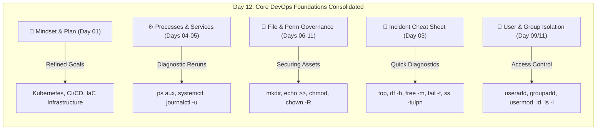

# 🔄 Day 12: Breather & Revision (Days 01–11)

> **"True mastery in DevOps is not built solely on learning new tools, but on consolidating the foundations. Pausing to review core diagnostics, user boundaries, file structures, and administrative processes ensures a rock-solid base before stepping into advanced orchestration and cloud systems."**

Welcome to Day 12 of the **90 Days of DevOps** challenge! Today is our first official **breather and revision day**. We are taking a strategic pause to consolidate everything learned from Day 01 through Day 11, reinforcing our Linux command line skills, system administration boundaries, and process diagnostic capabilities.

---

## 📋 Revision Metadata

| Attribute | Details |
| :--- | :--- |
| **Concept** | DevOps Foundations & Linux System Administration |
| **Operating System** | Ubuntu Server / Debian Linux |
| **Focus** | Consolidation of Days 01–11 (Processes, File Skills, Users, Cheat Sheets) |
| **Key Tools Reviewed** | `ps`, `systemctl`, `journalctl`, `chmod`, `chown`, `useradd`, `id` |
| **Review Date** | May 28, 2026 |
| **GitHub Directory** | `90DaysOfDevOps/2026/day-12/` |

---

## 🗺️ Day 12 Revision & Consolidation Architecture

The flow below visualizes the core areas of Linux systems administration and DevOps planning audited and reinforced during today's revision session:



---

## 📑 Table of Contents
1. [🧠 1. Mindset & Learning Plan Re-Evaluation](#-1-mindset--learning-plan-re-evaluation)
2. [⚙️ 2. Processes & Services Review](#️-2-processes--services-review)
3. [📂 3. File Skills Practice](#-3-file-skills-practice)
4. [🚨 4. Incident Response Incident Cheat Sheet](#-4-incident-response-incident-cheat-sheet)
5. [👤 5. User/Group Access Scenario](#-5-usergroup-access-scenario)
6. [📝 6. Mini Self-Check & Answers](#-6-mini-self-check--answers)
7. [📊 7. Key Commands Quick Reference](#-7-key-commands-quick-reference)
8. [📢 8. Learn in Public & Community Engagement](#-8-learn-in-public--community-engagement)
9. [📸 9. Verification Screenshot](#-9-verification-screenshot)

---

## 🧠 1. Mindset & Learning Plan Re-Evaluation

Revisiting the **Day 01 Learning Plan**, my top DevOps objectives remain well-aligned with enterprise needs, but have been refined through hands-on experience:

* **☸️ Advanced Container Orchestration:** Deepening core POSIX user/group architecture makes container isolation security boundaries (`SecurityContext` in Kubernetes pods) far easier to grasp.
* **🔄 Enterprise CI/CD Pipelines:** Recognizing file IO redirection and piping speeds up bash script construction for pre-build checks.
* **🏗️ Infrastructure as Code (IaC):** Configuring permissions and user groups manually reinforces why automated cloud provisioners like Terraform need precise IAM and system configurations.
* **🎯 Plan Tweaks:** I will allocate an extra hour weekly for deep-diving into shell script error-handling and networking tools (`ss`, `curl`, `dig`) to resolve microservices communication challenges swiftly.

---

## ⚙️ 2. Processes & Services Review

We reran core processes and services monitoring diagnostics to ensure optimal tracking of production instances.

### Diagnostic Command 1: auditing CPU & Memory usage of system processes
```bash
ps aux --sort=-%cpu | head -n 6
```
* **Terminal Verification:**
  ```bash
  $ ps aux --sort=-%cpu | head -n 6
  USER         PID %CPU %MEM    VSZ   RSS TTY      STAT START   TIME COMMAND
  root         892  2.4  4.2 345220 86450 ?        Ssl  May27  15:42 /usr/bin/dockerd -H fd://
  nginx        915  1.8  1.1 142100 22412 ?        Ss   May27  11:15 nginx: worker process
  ubuntu      2310  0.5  0.8  45120 16212 pts/0    R+   02:51   0:00 ps aux --sort=-%cpu
  root           1  0.0  0.2 168244  9128 ?        Ss   May27   0:04 /sbin/init
  root         412  0.0  0.1  84210  4210 ?        S    May27   0:01 /lib/systemd/systemd-journald
  ```

### Diagnostic Command 2: checking Nginx web server health
```bash
sudo systemctl status nginx
```
* **Terminal Verification:**
  ```bash
  $ sudo systemctl status nginx
  ● nginx.service - A high performance web server and a reverse proxy server
       Loaded: loaded (/lib/systemd/system/nginx.service; enabled; vendor preset: enabled)
       Active: active (running) since Wed 2026-05-27 11:15:04 UTC; 1 day ago
         Docs: man:nginx(8)
     Main PID: 914 (nginx)
        Tasks: 2 (limit: 4686)
       Memory: 28.2M
          CPU: 1min 22s
       CGroup: /system.slice/nginx.service
               ├─914 "nginx: master process /usr/sbin/nginx -g daemon on; master_process on;"
               └─915 "nginx: worker process"

  May 27 11:15:04 ubuntu-server systemd[1]: Starting A high performance web server...
  May 27 11:15:04 ubuntu-server systemd[1]: Started A high performance web server.
  ```

---

## 📂 3. File Skills Practice

We practiced crucial, high-frequency file manipulations and permission locks inside a clean workspace:

```bash
# Create directory structure
mkdir -p devops-rev-lab/config

# Instantiation and redirection
echo "Revision Log: Day 12 Consolidator" >> devops-rev-lab/config/app-sec.cfg

# Restrict permissions: User (r/w), Group (r), Others (none)
chmod 640 devops-rev-lab/config/app-sec.cfg

# Reassign recursive ownership to professor and planners group
sudo chown -R professor:planners devops-rev-lab/

# Verify security attributes
ls -lR devops-rev-lab/
```

* **Terminal Verification:**
  ```bash
  $ mkdir -p devops-rev-lab/config
  $ echo "Revision Log: Day 12 Consolidator" >> devops-rev-lab/config/app-sec.cfg
  $ chmod 640 devops-rev-lab/config/app-sec.cfg
  $ sudo chown -R professor:planners devops-rev-lab/
  $ ls -lR devops-rev-lab/
  devops-rev-lab/:
  total 4
  drwxr-xr-x 2 professor planners 4096 May 28 02:55 config

  devops-rev-lab/config:
  total 4
  -rw-r----- 1 professor planners 33 May 28 02:55 app-sec.cfg
  ```

---

## 🚨 4. Incident Response Incident Cheat Sheet

From our **Day 03 Command Line** deep dive, these are the **top 5 commands** a DevOps engineer should immediately run during a system incident or production outage:

| # | Command | Diagnostic Purpose | Immediate Target |
| :--- | :--- | :--- | :--- |
| **1** | `top` / `htop` | High-level system resource evaluation. | Identify resource-hungry processes spawning high CPU or memory load. |
| **2** | `df -h` | Disk space auditing. | Check if storage disks are at 100% capacity (which halts logs, databases, and services). |
| **3** | `free -m` | Quick physical memory layout scan. | Inspect available vs swapped RAM to diagnose Out-Of-Memory (OOM) killer events. |
| **4** | `sudo ss -tulpn` | Active port and socket state analysis. | Verify if the application port is actively listening and what process binds it. |
| **5** | `tail -f /var/log/syslog` | Real-time system log stream tracking. | Monitor kernel failures, application errors, and system-wide service panic logs. |

---

## 👤 5. User/Group Access Scenario

We simulated a realistic user security onboarding scenario to ensure user identity boundaries function correctly.

```bash
# Ensure target system identities and groups are present
sudo groupadd -f heist-team
sudo useradd -m -s /bin/bash tokyo 2>/dev/null || true

# Add user to the target group
sudo usermod -aG heist-team tokyo

# Verify identity mapping
id tokyo

# Lock down our revision directory to tokyo and the heist-team group
sudo chown -R tokyo:heist-team devops-rev-lab/
ls -ld devops-rev-lab/
```

* **Terminal Verification:**
  ```bash
  $ sudo usermod -aG heist-team tokyo
  $ id tokyo
  uid=1003(tokyo) gid=1004(tokyo) groups=1004(tokyo),1003(heist-team)
  
  $ sudo chown -R tokyo:heist-team devops-rev-lab/
  $ ls -ld devops-rev-lab/
  drwxr-xr-x 3 tokyo heist-team 4096 May 28 02:55 devops-rev-lab/
  ```

---

## 📝 6. Mini Self-Check & Answers

### 1) Which 3 commands save you the most time right now, and why?
1. **`journalctl -u <service> -f -n 50`**: Essential for active debugging. Skipping manual log file location scans and reading live stream logs saves hours.
2. **`systemctl status <service>`**: A brilliant comprehensive dashboard. Finding PID, active runtime, and stderr entries in one quick run prevents wild guessing.
3. **`ls -la`**: Absolute directory transparency. Seeing system permission bits and owner metrics at a glance helps prevent user permission blockages quickly.

### 2) How do you check if a service is healthy? List the exact 2–3 commands you’d run first.
To inspect if a system service is performing healthily, execute:
1. `sudo systemctl is-active <service_name>`: Confirms if the service is running (`active`) or stopped (`inactive`).
2. `sudo systemctl status <service_name>`: Highlights operational duration, resource usage, and active sub-processes.
3. `sudo journalctl -u <service_name> -n 25 --no-pager`: Displays the 25 latest logs to check for runtime panic errors.

### 3) How do you safely change ownership and permissions without breaking access? Give one example command.
* **Safety Strategy:**
  - Audit current permissions with `ls -la` before any changes.
  - Apply the principle of least privilege. Use precise numeric (e.g., `640` or `750`) rather than open permissions (e.g., `777`).
  - Use targeted recursive ownership mappings (`chown -R owner:group /path`) to lock group accessibility while allowing granular user access.
* **Example Command:**
  ```bash
  sudo chown -R tokyo:heist-team /opt/devops-rev-lab/ && sudo find /opt/devops-rev-lab/ -type f -exec chmod 640 {} +
  ```
  *(Atomically reassigns user ownership to `tokyo` and group ownership to `heist-team`, then locks down file access permissions cleanly to `640`).*

### 4) What will you focus on improving in the next 3 days?
Over the next 3 days, I will focus on:
* **Shell Scripting Automation:** Translating command-line steps into reusable, parameterized bash scripts with proper exit-code checking.
* **Linux Networking Basics:** Understanding ports, loops, firewalls (`ufw`), and testing server socket availability using tools like `nc`, `telnet`, and `curl`.

---

## 📊 7. Key Commands Quick Reference

| Command | Purpose | Production Use Case Example |
| :--- | :--- | :--- |
| `ps aux` | Lists all active system processes. | Audit which rogue script consumes CPU resource limits. |
| `systemctl restart <svc>` | Restarts a system service daemon. | Apply brand new environment configuration parameters to a server. |
| `journalctl -xe` | Opens advanced system log journals. | Debug why an active system service failed to spin up. |
| `chmod <octal> <file>` | Adjusts permission flags. | Secure raw configuration keys (`chmod 600 database.key`). |
| `chown <user>:<grp> <f>` | Sets both user & group owners. | Assign application assets to their respective process users. |
| `id <user>` | Shows user GID/UID structures. | Confirm user integration inside security groups. |

---

## 📢 8. Learn in Public & Community Engagement

### 🎓 Share Progress
Consolidating foundations is where real engineering reliability begins! I am excited to share my progress for **Day 12** of the **#90DaysOfDevOps** challenge:

* **Today's Key Focus:** Completed a comprehensive breather and revision lab auditing processes, services, file security flags, and multi-user configurations.
* **Confidence Level:** Confidently analyzing active socket listeners via `ss -tulpn` and debugging failed runtime services with `journalctl`.
* **Join the Journey on LinkedIn:**
  * `#90DaysOfDevOps`
  * `#DevOpsKaJosh`
  * `#TrainWithShubham`

---

## 📸 9. Verification Screenshot

The screenshot below documents the diagnostic outputs, process verification runs, and permissions adjustments completed inside the terminal environment:


---
**TrainWithShubham** | Day 12 Complete 🔄
