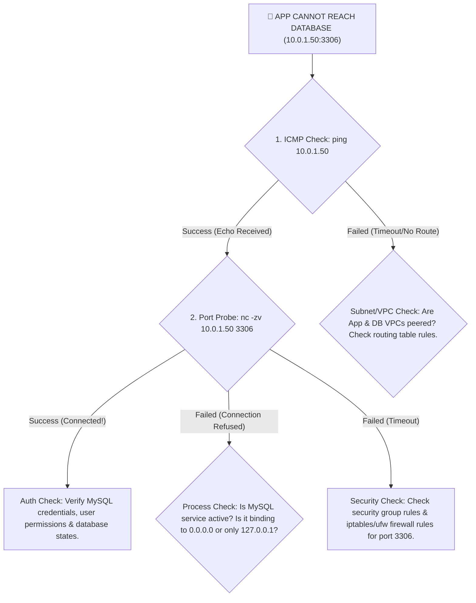
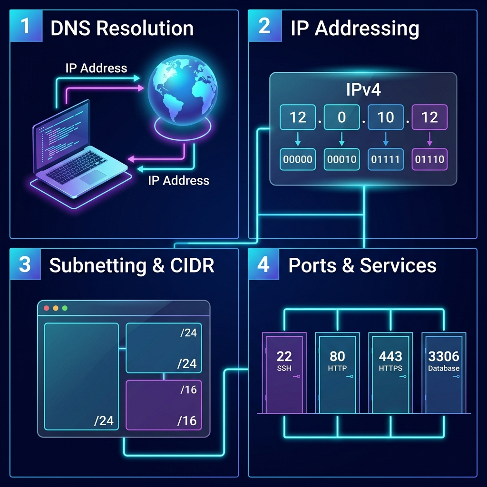

# 🌐 Day 15: Deep Dive into Core Networking Concepts — DNS, IP Addressing, Subnets & Ports

> **"In systems engineering, code is only as powerful as the network that carries it. To build highly available, scalable, and secure cloud environments, a DevOps engineer must master the flow of data packets. Today's lab moves from active endpoint diagnostics to the fundamental architecture of networking—breaking down DNS resolution flows, IPv4 addressing models, CIDR subnetting computations, and transport-level port routing."**

Welcome to Day 15 of the **90 Days of DevOps** challenge! Building on the diagnostic tools mastered on Day 14, today we lay a solid theoretical and practical foundation for the vital protocols, logical boundaries, and transport gateways that keep modern distributed systems running.

---

## 📋 Lab Metadata

| Attribute | Details |
| :--- | :--- |
| **Concept** | DNS Resolution, Classful/Classless IP Addressing, Subnetting Calculations, Port Binding |
| **Operating System** | macOS (Darwin Kernel 25.x) & POSIX Linux reference |
| **Key Diagnostics** | `dig`, `ifconfig`, `ip addr` (Linux), `lsof` (macOS), `ss` (Linux) |
| **Lab Date** | June 2, 2026 |
| **GitHub Directory** | `90DaysOfDevOps/2026/day-15/` |

---

## 🗺️ Networking Architecture & DNS Traversal Flow

When a client application interacts with a domain name, it triggers a chain of logical operations. The sequence below maps out how a client browser resolves a hostname and traverses subnets to establish socket connections across custom ports:

```mermaid
sequenceDiagram
    autonumber
    actor Client as 💻 Client Browser
    participant OS as ⚙️ Local OS / Resolver
    participant DNS as 🌐 Recursive DNS (8.8.8.8)
    participant Auth as 🏢 Authoritative NS
    participant App as 🖥️ Target Server (142.250.143.113)

    Client->>OS: Type "google.com" & hit Enter
    Note over OS: Checks browser cache & /etc/hosts
    OS-->>Client: Cache Miss
    OS->>DNS: Resolve "google.com" (UDP Port 53)
    Note over DNS: Traverses Root (.) & TLD (.com) servers
    DNS->>Auth: Query "google.com" records
    Auth-->>DNS: Return A Records & TTL (e.g., 98s)
    DNS-->>OS: Return IP Address Cache Payload
    OS-->>Client: Hand back Resolved IP (142.250.143.113)
    Client->>App: TCP Handshake (SYN -> SYN-ACK -> ACK) on Port 80/443
    Note over App: Router processes IP packet; forwards to server port binding
    App-->>Client: HTTP/HTTPS Response Payload (L7 payload)
```

---

## 📑 Table of Contents
1. [🔍 Task 1: DNS – How Names Become IPs](#-task-1-dns--how-names-become-ips)
2. [🎯 Task 2: IP Addressing Systems](#-task-2-ip-addressing-systems)
3. [🚀 Task 3: Classless Inter-Domain Routing (CIDR) & Subnetting](#-task-3-classless-inter-domain-routing-cidr--subnetting)
4. [🔌 Task 4: Ports – The Gateways to Services](#-task-4-ports--the-gateways-to-services)
5. [💡 Task 5: Incident Resolution & Scenario Interpretation](#-task-5-incident-resolution--scenario-interpretation)
6. [🧠 What I Learned Today](#-what-i-learned-today)
7. [📢 Learn in Public & Engagement](#-learn-in-public--engagement)
8. [🎨 Visual Networking Concepts Infographic](#-visual-networking-concepts-infographic)

---

## 🔍 Task 1: DNS – How Names Become IPs

### 1. The Anatomy of a DNS Resolution
When you type `google.com` in a browser, a highly coordinated sequence of lookups occurs in milliseconds:
1. **Local Check (L1):** The browser inspects its internal memory cache. If a match isn't found, it queries the operating system's local resolver cache, which checks the `/etc/hosts` static bindings file.
2. **Recursive Query (L2):** If unresolved, the OS sends a UDP packet on port `53` to the configured **Recursive DNS Resolver** (usually managed by your ISP or external public DNS pools like Cloudflare's `1.1.1.1` or Google's `8.8.8.8`).
3. **Hierarchical Traversal (L3):** The Recursive Resolver traverses the DNS root zone:
   - Queries a **Root Name Server (`.`)** to obtain the Name Server IP for the **Top-Level Domain (TLD) Server** (`.com`).
   - Queries the `.com` TLD Server to obtain the IP of the **Authoritative Name Server** delegated to manage `google.com` records.
4. **Authoritative Resolution (L4):** The resolver queries the Authoritative Name Server, which returns the primary IPv4 mapping (`A` record). This IP is passed back through the chain, cached locally by the OS/browser, and used to initiate the target socket connection.

### 2. Standard DNS Record Types

* **`A` (Address Record):** Directly maps a human-readable hostname to a 32-bit **IPv4** address (e.g., `google.com` to `142.250.143.113`).
* **`AAAA` (IPv6 Address Record):** Maps a hostname to a 128-bit **IPv6** address, facilitating next-generation internet protocol routing (e.g., `google.com` to `2404:6800:4009:823::200e`).
* **`CNAME` (Canonical Name Record):** Alias mapping that redirects one domain to another domain string instead of an IP (e.g., `www.google.com` pointing to the canonical endpoint `google.com`).
* **`MX` (Mail Exchanger Record):** Specifies the mail transfer agent servers responsible for processing incoming email streams for a domain, along with their preference priority (e.g., `10 smtp.google.com`).
* **`NS` (Name Server Record):** Identifies the authoritative DNS hostnames delegated to host and manage the zone file files for the domain (e.g., `ns1.google.com`).

### 3. Active Lab Run: Resolving DNS with `dig`

We execute a real-time DNS lookup for `google.com` using the Domain Information Groper (`dig`) utility:

```bash
dig google.com
```

#### Raw Command Output
```text
; <<>> DiG 9.10.6 <<>> google.com
;; global options: +cmd
;; Got answer:
;; ->>HEADER<<- opcode: QUERY, status: NOERROR, id: 55474
;; flags: qr rd ra; QUERY: 1, ANSWER: 6, AUTHORITY: 0, ADDITIONAL: 1

;; OPT PSEUDOSECTION:
; EDNS: version: 0, flags:; udp: 512
;; QUESTION SECTION:
;google.com.			IN	A

;; ANSWER SECTION:
google.com.		98	IN	A	142.250.143.113
google.com.		98	IN	A	142.250.143.138
google.com.		98	IN	A	142.250.143.100
google.com.		98	IN	A	142.250.143.101
google.com.		98	IN	A	142.250.143.139
google.com.		98	IN	A	142.250.143.102

;; Query time: 105 msec
;; SERVER: 8.8.8.8#53(8.8.8.8)
;; WHEN: Tue Jun 02 14:29:38 IST 2026
;; MSG SIZE  rcvd: 135
```

> [!NOTE]
> **DNS Diagnostic Analysis:**
> - **Resolved `A` Records:** The query resolved successfully with a status of `NOERROR`, returning 6 identical load-balanced IP endpoints in the **ANSWER SECTION**. The first returned IPv4 address is **`142.250.143.113`**.
> - **TTL (Time to Live):** The TTL value is **`98`** seconds. This instructs the OS and local resolvers to keep this resolution cached for 98 seconds before querying the upstream recursive servers again.
> - **Query Source:** The resolution was handled by the recursive DNS address **`8.8.8.8`** (Google's public resolver) over UDP port **`53`** in `105` milliseconds.

---

## 🎯 Task 2: IP Addressing Systems

### 1. Structure of an IPv4 Address
An IPv4 (Internet Protocol version 4) address is a 32-bit logical address represented in dotted-decimal format. It is split into **four 8-bit blocks (octets)** separated by periods (e.g., `192.168.1.10`). 
- **Binary Conversion Example:**
  $$\text{Dotted Decimal: } 192 \cdot 168 \cdot 1 \cdot 10$$
  $$\text{Binary Form: } 11000000 \cdot 10101000 \cdot 00000001 \cdot 00001010$$
- Every IPv4 address is divided into a **Network ID** (identifying the logical network boundaries) and a **Host ID** (identifying the specific network interface card on that subnetwork). The division point is determined entirely by the **subnet mask**.

### 2. Public vs. Private IP Addresses
* **Public IPs:** Globally unique IP addresses routed across the public internet. They are allocated by registries (IANA/APNIC/RIPE) to internet providers and edge devices, allowing servers to be publicly discoverable from any point in the world (e.g., Google DNS `8.8.8.8`).
* **Private IPs:** Isolated IP addresses designed only for local communication within private LANs, home networks, or cloud VPC environments. They are ignored by public internet routers and are translated via NAT (Network Address Translation) gateways to share a public IP when accessing outside resources.

### 3. Reserved Private IP Subnet Ranges (RFC 1918)

| RFC 1918 Class | Network Range | Subnet Mask | Usable Host Space | Typical Use Cases |
| :--- | :--- | :--- | :--- | :--- |
| **Class A** | `10.0.0.0 – 10.255.255.255` | `255.0.0.0 (/8)` | `16,777,214` usable | Large enterprise intranets, complex AWS/GCP VPCs |
| **Class B** | `172.16.0.0 – 172.31.255.255` | `255.240.0.0 (/12)`| `1,048,574` usable | Mid-size clusters, staging subnets, container networks |
| **Class C** | `192.168.0.0 – 192.168.255.255`| `255.255.0.0 (/16)`| `65,534` usable (total) | SOHO routers, home offices, default local host bridges |

### 4. Active Lab Run: Audit Local IP Interfaces

We run the network interface configuration utility to inspect local host IP assignments. 

> [!TIP]
> **OS Portability Note:**
> While standard Linux environments use the `ip addr show` command, macOS uses the classic BSD BSD standard tool **`ifconfig`**. We execute the macOS interface check for active interface hardware:

```bash
ifconfig en0 | grep "inet "
```

#### Raw Command Output
```text
inet 192.168.31.96 netmask 0xffffff00 broadcast 192.168.31.255
```

> [!NOTE]
> **Address Analysis:**
> - The active adapter `en0` has been assigned the IPv4 address **`192.168.31.96`**.
> - **Address Type:** This address is a **Private IP address** belonging to the Class C `192.168.x.x` private subnet range (RFC 1918).
> - **Subnet Mask Details:** The netmask `0xffffff00` (hexadecimal for `255.255.255.0` or `/24`) isolates this node inside a local logical network containing up to 254 usable local IPs.

---

## 🚀 Task 3: Classless Inter-Domain Routing (CIDR) & Subnetting

### 1. Understanding `/24` CIDR Notation
In an IP subnet address like `192.168.1.0/24`, the **`/24`** represents the CIDR prefix length. It tells us that the first **24 bits** of the address are fixed network address bits, leaving the remaining $32 - 24 = 8$ bits free for assigning to individual hosts.
* **Network Mask representation:**
  $$\text{Binary Mask: } \underbrace{11111111 \cdot 11111111 \cdot 11111111}_{24 \text{ bits fixed network}} \cdot \underbrace{00000000}_{8 \text{ bits host ID}}$$
  $$\text{Decimal Mask: } 255.255.255.0$$

### 2. Calculating Usable Host Space
To calculate the total number of usable host configurations in any subnet, we use the formula:
$$\text{Usable Hosts} = 2^{(32 - n)} - 2$$
*(where $n$ represents the CIDR prefix length).*

> [!IMPORTANT]
> **Why subtract 2?**
> - **Network Address (First IP):** Used to identify the subnet logical network itself (e.g., `192.168.1.0`).
> - **Broadcast Address (Last IP):** Used to send packets to all hosts inside the subnet simultaneously (e.g., `192.168.1.255`).

Let's compute usable capacities across standard blocks:
* **`/24` Subnet:** $2^{(32-24)} - 2 = 2^8 - 2 = 256 - 2 = \mathbf{254}$ usable hosts.
* **`/16` Subnet:** $2^{(32-16)} - 2 = 2^{16} - 2 = 65,536 - 2 = \mathbf{65,534}$ usable hosts.
* **`/28` Subnet:** $2^{(32-28)} - 2 = 2^4 - 2 = 16 - 2 = \mathbf{14}$ usable hosts.

### 3. Why DevOps Engineers Subnet
Subnetting is the practice of splitting a large network into smaller segments. It is a critical task for several reasons:
1. **Fault Isolation & Performance:** In huge networks, broadcast packets (like ARP queries) flood all devices. Subnetting restricts broadcast traffic to a small pool, reducing network latency and preventing broadcast storms.
2. **Robust Security Boundaries:** Subnets allow engineers to establish clear access controls. For example, database instances are placed in isolated private subnets, while Nginx servers are in public subnets. Firewalls and security groups allow only specific ports to bridge these networks.
3. **Optimized IP Allocations:** By dividing networks based on container, VM, or function sizing, cloud engineers ensure IP resource pools are not wasted.

### 4. Completed Subnetting Reference Matrix

| CIDR Prefix | Subnet Mask (Decimal) | Total IP Allocation | Usable Host Capacity | Class Reference |
| :--- | :--- | :--- | :--- | :--- |
| **`/16`** | `255.255.0.0` | `65,536` | **`65,534`** | Class B boundary |
| **`/24`** | `255.255.255.0` | `256` | **`254`** | Class C boundary |
| **`/28`** | `255.255.255.240` | `16` | **`14`** | Sub-allocated block |

---

## 🔌 Task 4: Ports – The Gateways to Services

### 1. What is a Port?
A port is a **16-bit numeric identifier** (ranging from `0` to `65535`) managed by the operating system at the **Transport Layer (L4)** of the networking stack. Ports act as specific virtual doors on a system. While an IP address directs traffic to a specific server, the port number directs incoming data streams to the exact software application listening for that traffic.

### 2. Common System & Database Ports

| Port | Standard Protocol / Service | Category | Real-world Purpose in DevOps |
| :--- | :--- | :--- | :--- |
| **`22`** | **SSH** (Secure Shell) | Well-Known | Secure remote server terminal access & SFTP file transfers |
| **`80`** | **HTTP** (Hypertext Transfer Protocol) | Well-Known | Unencrypted plain web server traffic |
| **`443`** | **HTTPS** (HTTP Secure) | Well-Known | Encrypted web server traffic using TLS/SSL certificate keys |
| **`53`** | **DNS** (Domain Name System) | Well-Known | Resolving domain names to IP addresses (UDP & TCP queries) |
| **`3306`** | **MySQL** Relational Database | Registered | Relational database client connections |
| **`6379`** | **Redis** Cache Cluster | Registered | Memory key-value store cache read/write pipelines |
| **`27017`**| **MongoDB** Document Store | Registered | NoSQL document database query streams |

### 3. Active Lab Run: Listening Port Audit

We check active loopback and network listening ports on our host machine.

> [!TIP]
> **OS Portability Note:**
> On Linux systems, `ss -tulpn` or `netstat -tulpn` displays active listeners. On macOS, we execute the standard diagnostic alternative:

```bash
lsof -i -P -n | grep LISTEN | head -n 5
```

#### Raw Command Output
```text
rapportd    986 ToucanRajat   10u  IPv4 0x86c4218e83a56472      0t0    TCP *:50081 (LISTEN)
ControlCe  1164 ToucanRajat   10u  IPv4 0x30ac4cc753b498e2      0t0    TCP *:7000 (LISTEN)
ControlCe  1164 ToucanRajat   12u  IPv4 0xd3a15ed0808707cc      0t0    TCP *:5000 (LISTEN)
ollama     1463 ToucanRajat    3u  IPv4 0x53e5c82a37696bb0      0t0    TCP 127.0.0.1:11434 (LISTEN)
Antigravi 56864 ToucanRajat   40u  IPv4 0xf059f07325653fa8      0t0    TCP 127.0.0.1:52302 (LISTEN)
```

#### Match Services to Listening Ports:
1. **Ollama Daemon (AI Server):** Bound to process PID `1463` and listening on loopback port **`11434`** (`127.0.0.1:11434`). This interface serves API endpoint requests for local Large Language Models.
2. **macOS ControlCenter Service:** Bound to process PID `1164` globally (`*`) on port **`5000`** and port **`7000`**. These are standard receivers for local device media handoffs (AirPlay, receiver ports).

---

## 💡 Task 5: Incident Resolution & Scenario Interpretation

### 🔍 Scenario A: Anatomy of `curl http://myapp.com:8080`
When executing this request, the client machine goes through the following networking phases:
1. **Domain Name Resolution (L7):** The client OS initiates a DNS lookup over port `53` to resolve the host string `myapp.com` to its target IP address (e.g., `54.210.12.80`).
2. **Custom Port Mapping (L4):** `curl` bypasses the standard default HTTP port `80` and packages the request segments with a target TCP port of `8080`.
3. **Packet Encapsulation & Routing (L3):** Packets containing the payload are created with the source IP (local host) and target destination IP (`54.210.12.80`). The packets are sent through the local default gateway, routing hops across ISPs, and to the server's cloud gateway.
4. **Application Socket Handoff (L4 -> L7):** The server receiving the packet checks the IP header, identifies TCP port `8080`, and routes the payload to the specific web server process (e.g., Node.js or Tomcat) listening on that socket.

---

### 🚨 Scenario B: Debugging `10.0.1.50:3306` Connectivity Failures
If an application is unable to reach a database at `10.0.1.50:3306`, execute this systematic troubleshooting checklist to find the root cause:



1. **Subnet & Peer Configuration (L3 Routing Audit):**
   Verify if the database subnet and the application server subnet have a valid route to communicate. Since `10.0.1.50` is a Class A private IP, the two instances must be in the same VPC or have a functional VPC Peering/Transit Gateway relationship configured.
2. **Security Groups & Network ACLs (Firewall Audit):**
   Check if the database host's Security Group (in AWS/GCP) or local firewall (`iptables` / `ufw`) is configured to accept incoming TCP traffic on port `3306` specifically from the application server's private security group or IP range.
3. **Database Listening Bindings (L4 Service Audit):**
   Log into the database server and check the active sockets using `lsof -i :3306` or `netstat -tulpn`. Ensure that the database service is running and bound to the public/private interfaces (`0.0.0.0` or `10.0.1.50`) rather than local loopback (`127.0.0.1`).

---

## 🧠 What I Learned Today

1. **The Critical Path of Domain Resolution:** DNS is more than just hostname-to-IP lookup. It is a hierarchical, highly-cached directory system. If recursive caching or authoritative TTLs are configured poorly, it can cause severe downtime or slow client performance during failovers.
2. **Subnetting is an Essential Safety Tool:** Subnetting is not just about organizing IPs; it is the foundation of network security. Isolating database zones into private subnets and using network boundaries prevents unauthorized access to backend components.
3. **The Importance of Port Binding Audits:** Modern microservices require clear port mappings. Knowing how to use diagnostic tools to inspect interface bindings (like `0.0.0.0` vs. `127.0.0.1`) is key to troubleshooting "connection refused" issues during deployments.

---

## 📢 Learn in Public & Engagement

### 🎓 Share Progress
Infrastructure is only as reliable as the logical network paths holding it together! I am thrilled to share my progress for **Day 15** of the **#90DaysOfDevOps** challenge:

* **Today's Key Focus:** Deep dive into foundational networking concepts, including DNS tree lookups, IP addressing structures, CIDR subnetting computations, and port multiplexing.
* **Lab Milestones:** Evaluated A-records and TTL properties with `dig`, audited local network adapters and private IP allocations, computed CIDR subnet tables, analyzed listening ports, and designed a robust database troubleshooting runbook.
* **Join the Journey on LinkedIn:**
  - `#90DaysOfDevOps`
  - `#DevOpsKaJosh`
  - `#TrainWithShubham`

---

## 🎨 Visual Networking Concepts Infographic

The infographic below summarizes the core concepts covered in today's lab—including DNS resolution paths, IPv4 structures, CIDR allocations, and listening service port mappings:



---
**TrainWithShubham** | Day 15 Complete 🌐
