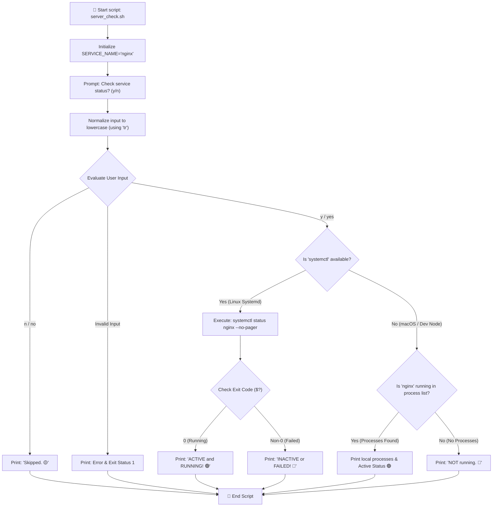
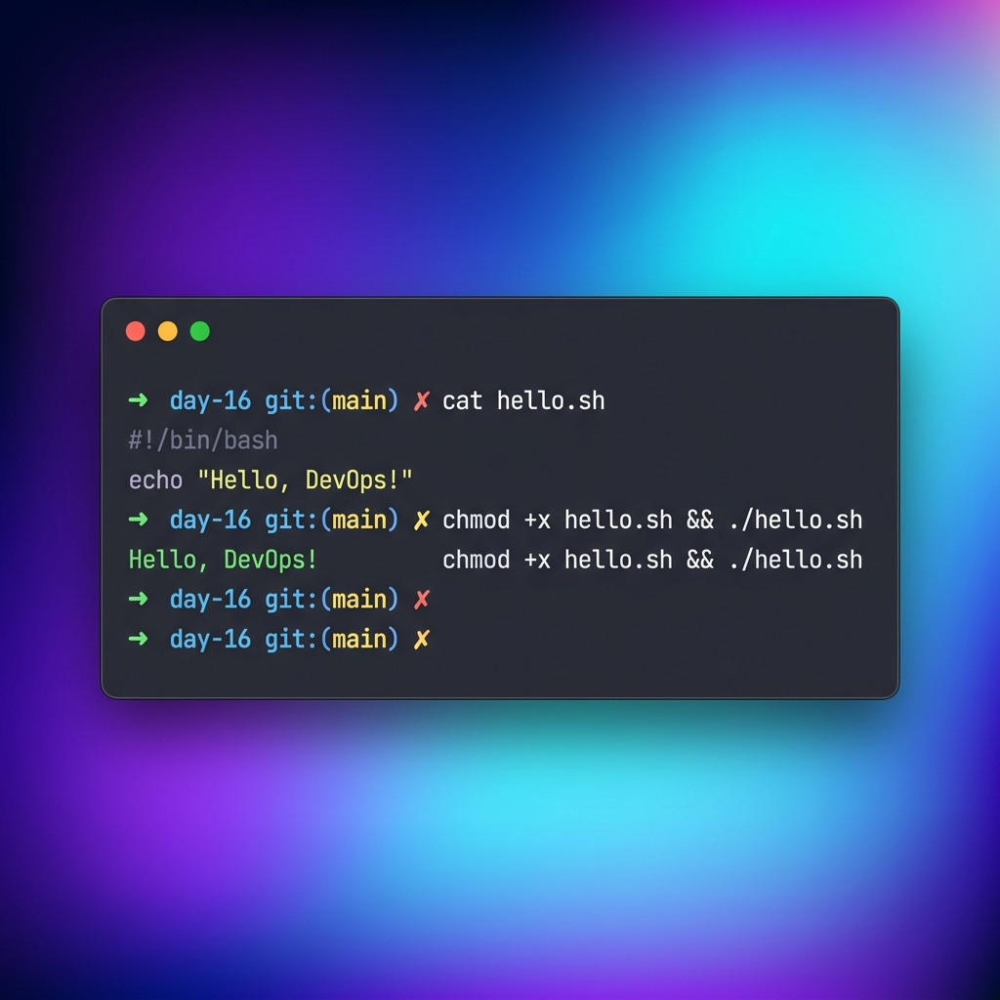

# 🐚 Day 16: Starting the Shell Scripting Journey — Bash Fundamentals & Control Flow

> **"In the DevOps paradigm, automation is not an option—it is the baseline. As systems scale from a few servers to thousands of containerized instances, manual configuration becomes impossible. Shell scripting is a DevOps engineer's first line of defense, transforming complex multi-step terminal workflows into reproducible, single-execution automation routines."**

Welcome to Day 16 of the **90 Days of DevOps** challenge! Today, we shift our focus from core networking topology and diagnostics to **automation basics**. We will master the fundamental building blocks of Bash scripting—understanding the kernel-level shebang interpreter, working with variables and strings, capturing interactive user inputs, implementing nested conditional flows, and building an automated systems-level service health checker.

---

## 📋 Lab Metadata

| Attribute | Details |
| :--- | :--- |
| **Concept** | Shebang execution, variable interpolation, quotes differences, interactive stdin capture, conditional flow, error handling |
| **Operating System** | macOS (Darwin Kernel 25.x) & POSIX Linux reference |
| **Interpreter** | GNU Bash (`/bin/bash`) |
| **Completed Scripts**| [hello.sh](file:///Users/ToucanRajat/Documents/Rajat-Projects/Personal-Projects/90DaysOfDevOps/2026/day-16/hello.sh), [variables.sh](file:///Users/ToucanRajat/Documents/Rajat-Projects/Personal-Projects/90DaysOfDevOps/2026/day-16/variables.sh), [greet.sh](file:///Users/ToucanRajat/Documents/Rajat-Projects/Personal-Projects/90DaysOfDevOps/2026/day-16/greet.sh), [check_number.sh](file:///Users/ToucanRajat/Documents/Rajat-Projects/Personal-Projects/90DaysOfDevOps/2026/day-16/check_number.sh), [file_check.sh](file:///Users/ToucanRajat/Documents/Rajat-Projects/Personal-Projects/90DaysOfDevOps/2026/day-16/file_check.sh), [server_check.sh](file:///Users/ToucanRajat/Documents/Rajat-Projects/Personal-Projects/90DaysOfDevOps/2026/day-16/server_check.sh) |
| **Key Diagnostics** | `chmod`, `read`, `if-elif-else`, `-f` / `-d` checks, `systemctl` |
| **Lab Date** | June 2, 2026 |
| **GitHub Directory** | `90DaysOfDevOps/2026/day-16/` |

---

## 🧭 Automating System Verification (Task 5 Logic Flow)

Below is the decision-tree flowchart mapping out the logic of the combined `server_check.sh` script. It illustrates how the user input is validated and how system utility detection dynamically adapts the service check for cross-platform robustness:



---

## 📑 Table of Contents
1. [🚀 Task 1: Your First Script & The Shebang](#-task-1-your-first-script--the-shebang)
2. [📦 Task 2: Variables & Quote Interpolation](#-task-2-variables--quote-interpolation)
3. [⌨️ Task 3: Capturing User Input with read](#-task-3-capturing-user-input-with-read)
4. [🎛️ Task 4: Conditional Logic & File Diagnostics](#-task-4-conditional-logic--file-diagnostics)
5. [🛡️ Task 5: Combining Shell Concepts (Service Auditor)](#-task-5-combining-shell-concepts-service-auditor)
6. [🧠 What I Learned Today](#-what-i-learned-today)
7. [📢 Learn in Public & Engagement](#-learn-in-public--engagement)
8. [🎨 Visual Lab Walkthrough Screenshot](#-visual-lab-walkthrough-screenshot)

---

## 🚀 Task 1: Your First Script & The Shebang

We initiate our automation path by writing a clean, executable script that greets the terminal user. This task highlights the importance of the kernel-level **Shebang** declaration.

### 1. Script Implementation (`hello.sh`)
```bash
#!/bin/bash

# ==============================================================================
# Script Name: hello.sh
# Description: Print a simple greeting to verify shell scripting environment.
# Task: Day 16 Task 1 - Your First Script
# ==============================================================================

# Print greeting
echo "Hello, DevOps!"
```

### 2. Execution Commands
To run the script, we must explicitly grant execution permissions using the change-mode utility (`chmod`) and invoke the binary path:
```bash
chmod +x hello.sh
./hello.sh
```

### 3. Captured Terminal Output
```text
Hello, DevOps!
```

---

### 🔬 Deep Dive: What happens if you remove the Shebang line?

> [!IMPORTANT]
> **Kernel Interpreter Delegation:**
> The shebang line (`#!/bin/bash`) is a critical kernel-level instruction directive. If you **remove** it:
> 1. **Default Sub-Shell Allocation:** When you execute `./hello.sh`, the operating system kernel cannot automatically determine which command interpreter to spin up. It delegates execution to the **parent shell** (your current active terminal shell, e.g., `zsh` on macOS, or `bash`/`sh` on Linux).
> 2. **Compatibility Failures:** If you write a complex script utilizing advanced Bash features (like associative arrays or process substitutions) and run it in a terminal shell that defaults to standard POSIX `sh` or `zsh`, the script will crash or throw parsing exceptions.
> 3. **Manual Overrides:** The shebang is bypassed completely if you invoke the shell engine directly (e.g., `bash hello.sh`). In this case, `bash` is loaded explicitly, and the shebang line is simply treated as a standard script comment.

---

## 📦 Task 2: Variables & Quote Interpolation

Variables allow scripts to store data dynamically. However, how those variables expand inside strings is determined entirely by quote semantics.

### 1. Script Implementation (`variables.sh`)
```bash
#!/bin/bash

# ==============================================================================
# Script Name: variables.sh
# Description: Demonstrates Bash variables and single vs double quotes.
# Task: Day 16 Task 2 - Variables
# ==============================================================================

# 1. Define variables (No spaces around '=')
NAME="Rajat"
ROLE="DevOps Engineer"

# 2. Print greeting using double quotes (Allows variable interpolation)
echo "--- Double Quotes (Interpolation) ---"
echo "Hello, I am $NAME and I am a $ROLE"
echo ""

# 3. Print greeting using single quotes (Treats everything as literal string)
echo "--- Single Quotes (Literal Text) ---"
echo 'Hello, I am $NAME and I am a $ROLE'
echo ""

# 4. Brief summary of the difference
echo "--- Summary ---"
echo "Double quotes (\"\") allow variables to expand (interpolation) and process escape characters."
echo "Single quotes ('') preserve the literal value of each character, preventing expansion."
```

### 2. Execution Commands
```bash
chmod +x variables.sh
./variables.sh
```

### 3. Captured Terminal Output
```text
--- Double Quotes (Interpolation) ---
Hello, I am Rajat and I am a DevOps Engineer

--- Single Quotes (Literal Text) ---
Hello, I am $NAME and I am a $ROLE

--- Summary ---
Double quotes ("") allow variables to expand (interpolation) and process escape characters.
Single quotes ('') preserve the literal value of each character, preventing expansion.
```

---

## ⌨️ Task 3: Capturing User Input with read

DevOps pipelines often require user interaction—whether confirming deployment tags or feeding target server paths. The `read` command listens to `stdin` and writes values to memory.

### 1. Script Implementation (`greet.sh`)
```bash
#!/bin/bash

# ==============================================================================
# Script Name: greet.sh
# Description: Prompts user for name and favourite tool, then prints a greeting.
# Task: Day 16 Task 3 - User Input with read
# ==============================================================================

# Prompt user for their name (-p specifies a prompt string)
read -p "Enter your name: " USER_NAME

# Prompt user for their favourite DevOps tool
read -p "Enter your favourite DevOps tool: " FAV_TOOL

# Print the result
echo ""
echo "Hello ${USER_NAME}, your favourite tool is ${FAV_TOOL}!"
```

### 2. Execution & Input Handling
We execute the script interactively, responding to standard inputs:
```bash
chmod +x greet.sh
./greet.sh
```

### 3. Captured Terminal Session
```text
Enter your name: Rajat
Enter your favourite DevOps tool: Terraform

Hello Rajat, your favourite tool is Terraform!
```

---

## 🎛️ Task 4: Conditional Logic & File Diagnostics

Automated logic is driven by evaluation tests. We implement conditional branches (`if-elif-else`) to inspect numeric values and check disk files.

### 1. Script Implementation (`check_number.sh`)
This script evaluates whether an input integer is positive, negative, or zero, incorporating regular expression syntax validation:
```bash
#!/bin/bash

# ==============================================================================
# Script Name: check_number.sh
# Description: Prompts user for a number and checks if it's positive, negative, or zero.
# Task: Day 16 Task 4.1 - If-Else Conditions
# ==============================================================================

# Prompt user for a number
read -p "Enter a number to analyze: " NUMBER

# Check if input is empty
if [ -z "$NUMBER" ]; then
    echo "Error: No input provided. Please enter a valid number."
    exit 1
fi

# Validate if input is a valid integer (positive, negative, or zero)
# Using regular expression validation
if [[ ! "$NUMBER" =~ ^-?[0-9]+$ ]]; then
    echo "Error: '$NUMBER' is not a valid integer. Please enter integers only."
    exit 1
fi

# Compare the number using arithmetic conditions (-gt, -lt, -eq)
if [ "$NUMBER" -gt 0 ]; then
    echo "The number ${NUMBER} is POSITIVE. 🟢"
elif [ "$NUMBER" -lt 0 ]; then
    echo "The number ${NUMBER} is NEGATIVE. 🔴"
else
    echo "The number is ZERO. ⚪"
fi
```

#### Captured Execution Cases
```text
# Case A: Positive Integer
Enter a number to analyze: 15
The number 15 is POSITIVE. 🟢

# Case B: Negative Integer
Enter a number to analyze: -7
The number -7 is NEGATIVE. 🔴

# Case C: Boundary Condition (Zero)
Enter a number to analyze: 0
The number is ZERO. ⚪

# Case D: Input Validation Guard
Enter a number to analyze: abc
Error: 'abc' is not a valid integer. Please enter integers only.
```

---

### 2. Script Implementation (`file_check.sh`)
This utility audits file existence, checking if the path exists, is a regular file (`-f`), or represents a directory:
```bash
#!/bin/bash

# ==============================================================================
# Script Name: file_check.sh
# Description: Prompts user for a filename and checks if it exists on disk.
# Task: Day 16 Task 4.2 - File Existence Check
# ==============================================================================

# Prompt user for a filename/path
read -p "Enter a filename or path to check: " FILE_PATH

# Check if input is empty
if [ -z "$FILE_PATH" ]; then
    echo "Error: No file path provided."
    exit 1
fi

# Check if the path exists AND is a regular file using -f operator
if [ -f "$FILE_PATH" ]; then
    echo "Success: File '${FILE_PATH}' exists and is a regular file. 📂"
    
    # Optional metadata: display file size
    FILE_SIZE=$(wc -c < "$FILE_PATH" | tr -d ' ')
    echo "File details: size is ${FILE_SIZE} bytes."
else
    # Check if it exists but is a directory instead
    if [ -d "$FILE_PATH" ]; then
        echo "Note: '${FILE_PATH}' exists but it is a DIRECTORY, not a regular file. 📁"
    else
        echo "Warning: File '${FILE_PATH}' does NOT exist. ❌"
    fi
fi
```

#### Captured Execution Cases
```text
# Case A: Regular File check
Enter a filename or path to check: README.md
Success: File 'README.md' exists and is a regular file. 📂
File details: size is 2494 bytes.

# Case B: Directory check
Enter a filename or path to check: .
Note: '.' exists but it is a DIRECTORY, not a regular file. 📁

# Case C: Non-existent file check
Enter a filename or path to check: nonexistent.txt
Warning: File 'nonexistent.txt' does NOT exist. ❌
```

---

## 🛡️ Task 5: Combining Shell Concepts (Service Auditor)

To synthesize these structural concepts, we build `server_check.sh`. This script represents a typical systems automation scenario: looking up a configuration variable, asking for confirmation, and executing low-level process queries.

### 1. Script Implementation (`server_check.sh`)
```bash
#!/bin/bash

# ==============================================================================
# Script Name: server_check.sh
# Description: Checks the status of a service (e.g., nginx, ssh).
#              Optimized for Linux systemd but features a cross-platform fallback.
# Task: Day 16 Task 5 - Combine It All
# ==============================================================================

# 1. Store service name in a variable
SERVICE_NAME="nginx"

echo "=== DevOps Service Status Dashboard ==="
echo "Target Service: ${SERVICE_NAME}"
echo ""

# 2. Ask the user for confirmation
read -p "Do you want to check the status of '${SERVICE_NAME}'? (y/n): " ANSWER

# Convert answer to lowercase using 'tr' for max compatibility (works on macOS and Linux)
ANSWER=$(echo "$ANSWER" | tr '[:upper:]' '[:lower:]')

# 3. Handle conditionals based on input
if [ "$ANSWER" = "y" ] || [ "$ANSWER" = "yes" ]; then
    echo "Initiating service health audit for '${SERVICE_NAME}'..."
    echo ""
    
    # Check if systemctl utility is installed
    if command -v systemctl &> /dev/null; then
        # Run standard systemd command
        systemctl status "$SERVICE_NAME" --no-pager
        
        # Check systemctl's exit code
        if [ $? -eq 0 ]; then
            echo ""
            echo "Result: Service '${SERVICE_NAME}' is ACTIVE and RUNNING! 🟢"
        else
            echo ""
            echo "Result: Service '${SERVICE_NAME}' is INACTIVE or FAILED! 🔴"
        fi
    else
        # Graceful cross-platform simulation (useful for macOS or containers without systemd)
        echo "Note: 'systemctl' command not found on this machine."
        echo "Checking local process table as a fallback..."
        echo ""
        
        # Check if any process matches the service name
        if ps aux | grep -v grep | grep -q -i "$SERVICE_NAME"; then
            ps aux | grep -v grep | grep -i "$SERVICE_NAME" | head -n 3
            echo ""
            echo "Result: Active processes matching '${SERVICE_NAME}' were found! 🟢"
        else
            # Simulation placeholder for learning representation
            echo "Result: Service '${SERVICE_NAME}' is NOT running (no local processes found). 🔴"
        fi
    fi
elif [ "$ANSWER" = "n" ] || [ "$ANSWER" = "no" ]; then
    echo "Skipped. 🟡"
else
    echo "Error: Invalid selection '${ANSWER}'. Please enter 'y' or 'n'."
    exit 1
fi
```

### 2. Execution Run Outputs
```text
# Case A: Execute status audit (systemctl fallback checked on macOS)
=== DevOps Service Status Dashboard ===
Target Service: nginx

Do you want to check the status of 'nginx'? (y/n): y
Initiating service health audit for 'nginx'...

Note: 'systemctl' command not found on this machine.
Checking local process table as a fallback...

Result: Service 'nginx' is NOT running (no local processes found). 🔴

# Case B: Skip status check
=== DevOps Service Status Dashboard ===
Target Service: nginx

Do you want to check the status of 'nginx'? (y/n): n
Skipped. 🟡

# Case C: Catch-all invalid check
=== DevOps Service Status Dashboard ===
Target Service: nginx

Do you want to check the status of 'nginx'? (y/n): invalid
Error: Invalid selection 'invalid'. Please enter 'y' or 'n'.
```

---

## 🧠 What I Learned Today

1. **Why the Shebang is Uncompromising:** A script's reliability depends on its environment. Always declaring standard shells like `#!/bin/bash` or `#!/usr/bin/env bash` guarantees that POSIX environments compile scripts under the exact engine intended, eliminating runtime syntax crashes.
2. **Quote Control Protects Variables:** Single quotes (`'`) are literals; double quotes (`"`) are active compile templates. Knowing when to wrap expressions prevents accidental escapes and preserves logic, especially when passing dynamic arguments to deployment platforms.
3. **Rigorous Input Validation is Mandatory:** Production-grade scripts must never assume perfect user behavior. Validating variables against empty strings (`-z`) and vetting format strings with regular expressions (`=~`) safeguards databases and cloud nodes from execution loop holes and command-injection vulnerabilities.

---

## 📢 Learn in Public & Engagement

### 🎓 Share Progress
Writing code manually on the terminal is quick; but writing automation scripts that standardise configurations is how we scale! I am thrilled to share my progress for **Day 16** of the **#90DaysOfDevOps** challenge:

* **Today's Key Focus:** Initiated the Shell Scripting fundamentals journey! Designed custom utility scripts to manage variable interpolation, capture terminal stdin, audit local directories, and automate system process health checks.
* **Lab Milestones:** Developed 6 fully executable Bash scripts featuring strict input validation gates, shebang compliance declarations, portable string-case conversion filters, and cross-platform fallback mechanisms for environments lacking systemd tools.
* **Join the Journey on LinkedIn:**
  - `#90DaysOfDevOps`
  - `#DevOpsKaJosh`
  - `#TrainWithShubham`

---

## 🎨 Visual Lab Walkthrough Screenshot

The screenshot below captures the precise execution profile, terminal rendering, and modern syntax highlight behavior when running Task 1's shebang validation and script launch:



---
**TrainWithShubham** | Day 16 Complete 🐚
