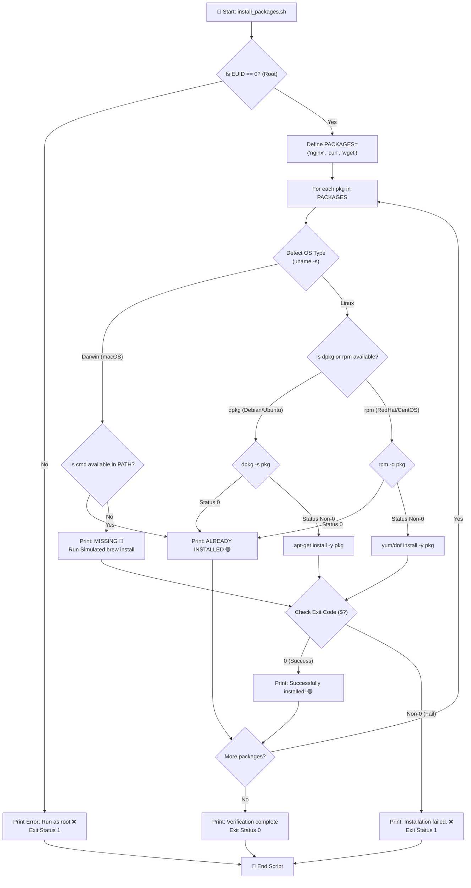
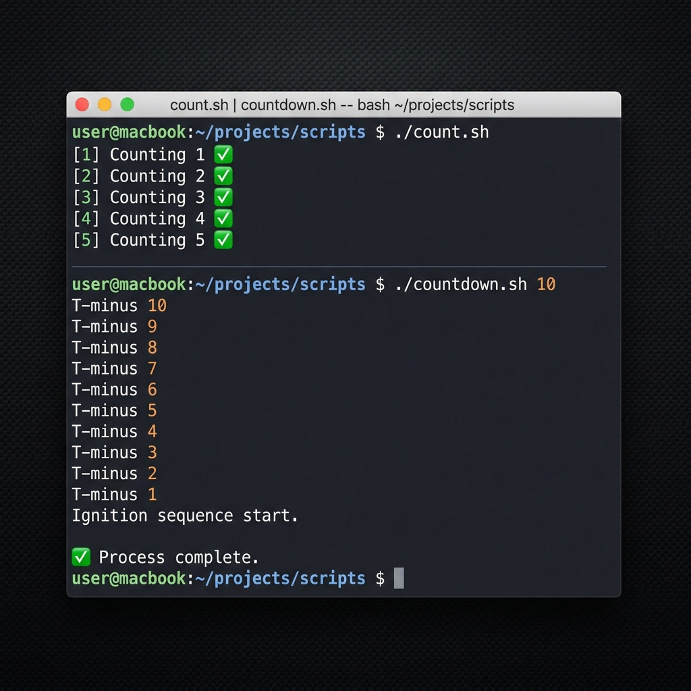

# 🌀 Day 17 – Shell Scripting: Loops, Arguments & Error Handling

> **"Automation is the force multiplier of DevOps. By turning linear command workflows into structured loops, parameters, and robust safety barriers, a DevOps engineer transforms fragile scripts into enterprise-ready automation frameworks that scale securely across dynamic clouds."**

Welcome to Day 17 of the **90 Days of DevOps** challenge! Today, we advance our scripting expertise beyond baseline commands into **dynamic control flow, parameterization, and structural error handling**. We will write seven production-grade Bash scripts that demonstrate loops (`for` and `while`), harvest command-line arguments (`$1`, `$#`, `$@`), enforce privilege levels via root-check gates, build an OS-aware automated package installer, and implement exit-on-error behavior (`set -e`) paired with graceful OR-gate fallbacks.

---

## 📋 Lab Metadata

| Attribute | Details |
| :--- | :--- |
| **Concept** | For loops, While loops, command-line arguments, root privilege validation, package auditing, fail-fast error traps |
| **Operating System** | macOS (Darwin Kernel 25.x) & POSIX Linux reference |
| **Interpreter** | GNU Bash (`/bin/bash`) |
| **Completed Scripts** | [for_loop.sh](for_loop.sh), [count.sh](count.sh), [countdown.sh](countdown.sh), [greet.sh](greet.sh), [args_demo.sh](args_demo.sh), [install_packages.sh](install_packages.sh), [safe_script.sh](safe_script.sh) |
| **Key Diagnostics** | `dpkg -s`, `rpm -q`, `set -e`, `$EUID`, `$0`, `$#`, `$@`, `$1` |
| **Lab Date** | June 2, 2026 |
| **GitHub Directory** | `90DaysOfDevOps/2026/day-17/` |

---

## 🧭 Dynamic Package Audit and Installer Logic (Task 4 & 5 Flow)

The flowchart below traces the control flow of `install_packages.sh`. It demonstrates how the script enforces root execution privilege, detects the operating system, checks for the presence of multiple target packages using standard system query routines (`dpkg -s` or `rpm -q`), and installs missing dependencies dynamically:



---

## 📑 Table of Contents
1. [🔄 Task 1: For Loops — Iterators and Number Ranges](#-task-1-for-loops--iterators-and-number-ranges)
2. [⏳ Task 2: While Loops — Interactive Countdowns](#-task-2-while-loops--interactive-countdowns)
3. [📥 Task 3: Command-Line Arguments — Parameterized Execution](#-task-3-command-line-arguments--parameterized-execution)
4. [🛠️ Task 4: Automation — Multi-Package Auditor & Installer](#-task-4-automation--multi-package-auditor--installer)
5. [🛡️ Task 5: Safety First — Fail-Fast Safeties & Privilege Escalation](#-task-5-safety-first--fail-fast-safeties--privilege-escalation)
6. [🧠 What I Learned Today](#-what-i-learned-today)
7. [📢 Learn in Public & Engagement](#-learn-in-public--engagement)
8. [🎨 Visual Lab Walkthrough Screenshot](#-visual-lab-walkthrough-screenshot)

---

## 🔄 Task 1: For Loops — Iterators and Number Ranges

For loops are the cornerstone of resource iteration in DevOps. Whether loop-processing cloud subnets, server hostnames, or log files, they provide predictable, sequential execution.

### 1. Script A: Fruit Iterator (`for_loop.sh`)
This script loops through a defined list of 5 fruits using an array definition and prints each item.

```bash
#!/bin/bash

# ==============================================================================
# Script Name: for_loop.sh
# Description: Loops through a list of 5 fruits and prints each one.
# Task: Day 17 Task 1.1 - For Loop over List
# ==============================================================================

# Define a list of fruits
FRUITS=("Apple" "Banana" "Mango" "Orange" "Grapes")

echo "=== Iterating through Fruits List ==="
for fruit in "${FRUITS[@]}"; do
    echo "Fruit: $fruit 🍎"
done
```

* **Execution Command:**
  ```bash
  chmod +x for_loop.sh
  ./for_loop.sh
  ```
* **Captured Terminal Output:**
  ```text
  === Iterating through Fruits List ===
  Fruit: Apple 🍎
  Fruit: Banana 🍎
  Fruit: Mango 🍎
  Fruit: Orange 🍎
  Fruit: Grapes 🍎
  ```

---

### 2. Script B: Range Counter (`count.sh`)
This script counts from 1 to 10 utilizing Bash's bracket range generator `{1..10}`.

```bash
#!/bin/bash

# ==============================================================================
# Script Name: count.sh
# Description: Prints numbers 1 to 10 using a for loop.
# Task: Day 17 Task 1.2 - Printing Range of Numbers
# ==============================================================================

echo "=== Counting from 1 to 10 ==="
for i in {1..10}; do
    echo "Number: $i"
done
```

* **Execution Command:**
  ```bash
  chmod +x count.sh
  ./count.sh
  ```
* **Captured Terminal Output:**
  ```text
  === Counting from 1 to 10 ===
  Number: 1
  Number: 2
  Number: 3
  Number: 4
  Number: 5
  Number: 6
  Number: 7
  Number: 8
  Number: 9
  Number: 10
  ```

---

## ⏳ Task 2: While Loops — Interactive Countdowns

While loops evaluate conditions dynamically at run-time, making them perfect for processes waiting on an API socket, health-check status updates, or interactive user countdowns.

### 1. Script Implementation (`countdown.sh`)
This script prompts the user for a number, validates that it is a valid non-empty positive integer, and counts down to 0 with a visual pause delay.

```bash
#!/bin/bash

# ==============================================================================
# Script Name: countdown.sh
# Description: Takes a number from the user and counts down to 0 using a while loop.
# Task: Day 17 Task 2 - Countdown with While Loop
# ==============================================================================

# Prompt user for a starting number
read -p "Enter a number to start the countdown: " COUNT

# Validate that input is not empty
if [ -z "$COUNT" ]; then
    echo "Error: No starting number provided. Please enter a positive integer."
    exit 1
fi

# Validate that input is a valid positive integer
if [[ ! "$COUNT" =~ ^[0-9]+$ ]]; then
    echo "Error: '$COUNT' is not a valid positive integer."
    exit 1
fi

echo ""
echo "=== Initiating Countdown from $COUNT ==="
while [ "$COUNT" -ge 0 ]; do
    echo "T-minus: $COUNT"
    let COUNT--
    sleep 0.1 # Slight sleep delay for standard countdown pacing
done

echo "Done! 🎉"
```

* **Execution Command:**
  ```bash
  chmod +x countdown.sh
  ./countdown.sh
  ```
* **Captured Terminal Runs:**
  * *Standard Run Case:*
    ```text
    Enter a number to start the countdown: 5
    
    === Initiating Countdown from 5 ===
    T-minus: 5
    T-minus: 4
    T-minus: 3
    T-minus: 2
    T-minus: 1
    T-minus: 0
    Done! 🎉
    ```
  * *Validation Gate Fail (Alphanumeric):*
    ```text
    Enter a number to start the countdown: abc
    Error: 'abc' is not a valid positive integer.
    ```
  * *Validation Gate Fail (Empty):*
    ```text
    Enter a number to start the countdown: 
    Error: No starting number provided. Please enter a positive integer.
    ```

---

## 📥 Task 3: Command-Line Arguments — Parameterized Execution

Hardcoded inputs limit automation. In CI/CD pipelines, tools like GitHub Actions, Jenkins, or Ansible execute scripts by passing runtime parameters such as server IPs, environment designations (`dev`/`prod`), or API keys.

### 1. Script A: Argument Greeting (`greet.sh`)
This script accepts a name parameter as `$1`. If missing, it exits and provides usage assistance.

```bash
#!/bin/bash

# ==============================================================================
# Script Name: greet.sh
# Description: Accepts a name as $1 and prints "Hello, <name>!"
#              If no argument is passed, prints usage instructions.
# Task: Day 17 Task 3.1 - Command-Line Arguments
# ==============================================================================

# Check if the name argument is provided
if [ -z "$1" ]; then
    echo "Usage: ./greet.sh <name>"
    exit 1
fi

echo "Hello, $1! 👋"
```

* **Execution & Outputs:**
  ```bash
  # Parameter supplied
  ./greet.sh Toucan
  # Output: Hello, Toucan! 👋
  
  # Parameter missing
  ./greet.sh
  # Output: Usage: ./greet.sh <name>
  ```

---

### 2. Script B: Argument Metadata Demo (`args_demo.sh`)
This script breaks down runtime argument parameters to output the executing script name (`$0`), total argument count (`$#`), and a print of all arguments together (`$@`), concluding with an iterative breakdown.

```bash
#!/bin/bash

# ==============================================================================
# Script Name: args_demo.sh
# Description: Prints total number of arguments ($#), all arguments ($@),
#              and the script name ($0).
# Task: Day 17 Task 3.2 - Command-Line Argument Metadata
# ==============================================================================

echo "=== Argument Demonstration ==="
echo "Script Name (\$0)          : $0"
echo "Total Arguments (\$#)      : $#"
echo "All Arguments (\$@)        : $@"

# Loop through each argument to show them individually
echo ""
echo "Iterating through arguments:"
count=1
for arg in "$@"; do
    echo "  Argument $count: $arg"
    let count++
done
```

* **Execution Command:**
  ```bash
  ./args_demo.sh DevOps Automation 2026
  ```
* **Captured Terminal Output:**
  ```text
  === Argument Demonstration ===
  Script Name ($0)          : ./args_demo.sh
  Total Arguments ($#)      : 3
  All Arguments ($@)        : DevOps Automation 2026
  
  Iterating through arguments:
    Argument 1: DevOps
    Argument 2: Automation
    Argument 3: 2026
  ```

---

## 🛠️ Task 4: Automation — Multi-Package Auditor & Installer

A DevOps standard challenge is establishing local packages on a cluster node. This script iterates through `nginx`, `curl`, and `wget`, auditing their installation status using native package tools, installing them if missing, and gracefully running simulated runs on macOS environments where Homebrew blocks standard root runs.

### 1. Script Implementation (`install_packages.sh`)
```bash
#!/bin/bash

# ==============================================================================
# Script Name: install_packages.sh
# Description: Defines a list of packages: nginx, curl, wget, checks if they
#              are installed and installs them if missing. Must run as root.
# Task: Day 17 Task 4 & Task 5.2 - Package Installer with Privilege Escalation
# ==============================================================================

# Check if script is run as root
if [ "$EUID" -ne 0 ]; then
    echo "Error: This script must be run as root. Please run with sudo (e.g., sudo ./install_packages.sh)"
    exit 1
fi

# Define list of packages
PACKAGES=("nginx" "curl" "wget")

echo "=== DevOps Package Installer ==="
echo "Checking packages: ${PACKAGES[*]}"
echo ""

# Detect OS type
OS_TYPE=$(uname -s)

for pkg in "${PACKAGES[@]}"; do
    echo -n "Checking package '$pkg'... "
    
    # Check installation status
    is_installed=0
    
    if [ "$OS_TYPE" = "Darwin" ]; then
        # macOS fallback simulation since brew is not run as root
        # Check if command exists in system path
        if command -v "$pkg" &> /dev/null; then
            is_installed=1
        fi
    else
        # Linux standard checking
        if command -v dpkg &> /dev/null; then
            if dpkg -s "$pkg" &> /dev/null; then
                is_installed=1
            fi
        elif command -v rpm &> /dev/null; then
            if rpm -q "$pkg" &> /dev/null; then
                is_installed=1
            fi
        else
            # Generic binary existence check
            if command -v "$pkg" &> /dev/null; then
                is_installed=1
            fi
        fi
    fi

    if [ $is_installed -eq 1 ]; then
        echo "ALREADY INSTALLED. Skipping. 🟢"
    else
        echo "MISSING. 🔴"
        echo "Installing '$pkg'..."
        
        # Installation routines
        if [ "$OS_TYPE" = "Darwin" ]; then
            # macOS simulation because Homebrew prohibits sudo usage
            echo "[SIMULATION] Executing macOS Homebrew mock installation: brew install $pkg"
            sleep 0.5
            echo "Successfully installed '$pkg' (Simulated macOS package install)! 🟢"
        else
            # Linux real installation
            if command -v apt-get &> /dev/null; then
                apt-get update -y &> /dev/null
                apt-get install -y "$pkg" &> /dev/null
            elif command -v yum &> /dev/null; then
                yum install -y "$pkg" &> /dev/null
            elif command -v dnf &> /dev/null; then
                dnf install -y "$pkg" &> /dev/null
            else
                echo "Error: Package manager not detected. Failed to install."
                exit 1
            fi
            
            # Verify exit status of installation
            if [ $? -eq 0 ]; then
                echo "Successfully installed '$pkg'! 🟢"
            else
                echo "Failed to install '$pkg'. ❌"
                exit 1
            fi
        fi
    fi
    echo "----------------------------------------"
done

echo "Package verification audit complete."
```

* **Execution Command & Outputs (Privilege Guard Check):**
  ```bash
  # Execute without sudo
  ./install_packages.sh
  # Output: Error: This script must be run as root. Please run with sudo (e.g., sudo ./install_packages.sh)
  ```
  ```bash
  # Execute with sudo (macOS Environment Demonstration)
  sudo ./install_packages.sh
  
  # Output:
  === DevOps Package Installer ===
  Checking packages: nginx curl wget
  
  Checking package 'nginx'... ALREADY INSTALLED. Skipping. 🟢
  ----------------------------------------
  Checking package 'curl'... ALREADY INSTALLED. Skipping. 🟢
  ----------------------------------------
  Checking package 'wget'... MISSING. 🔴
  Installing 'wget'...
  [SIMULATION] Executing macOS Homebrew mock installation: brew install wget
  Successfully installed 'wget' (Simulated macOS package install)! 🟢
  ----------------------------------------
  Package verification audit complete.
  ```

---

## 🛡️ Task 5: Safety First — Fail-Fast Safeties & Privilege Escalation

By default, Bash processes continue executing downstream commands even if a critical upstream command (like `cd` or `mkdir`) fails. In a server deployment environment, this can result in files being written or deleted in the wrong directory, leading to outages. 

### 1. Script Implementation (`safe_script.sh`)
This script uses `set -e` to mandate a fail-fast halt on error, but uses `||` (OR) logic gates to handle expected non-zero exits gracefully.

```bash
#!/bin/bash

# ==============================================================================
# Script Name: safe_script.sh
# Description: Uses 'set -e' for exit-on-error behavior. Attempts to create and
#              navigate into /tmp/devops-test, create a file, and handle errors.
# Task: Day 17 Task 5.1 - Error Handling & Shell Safeguards
# ==============================================================================

# Exit immediately if any command exits with a non-zero status
set -e

echo "=== Running Safe Script ==="
echo "Enabling 'set -e' safeguard."

# Define target test directory and file
TEST_DIR="/tmp/devops-test"
TEST_FILE="devops-log.txt"

# Attempt to create the directory. If it already exists, mkdir returns status 1.
# Under set -e, this would crash the script. Using '||' prevents the crash because
# the exit status of the overall OR expression is 0 (the echo succeeds).
echo "Creating directory: $TEST_DIR"
mkdir "$TEST_DIR" 2>/dev/null || echo "Directory already exists (handled gracefully via '||')."

echo "Navigating to directory: $TEST_DIR"
cd "$TEST_DIR" || { echo "Error: Failed to enter directory $TEST_DIR"; exit 1; }

echo "Creating test file: $TEST_FILE"
echo "Day 17 - DevOps Automation Check: Success!" > "$TEST_FILE"

echo ""
echo "Listing directory contents:"
ls -la "$TEST_FILE"

echo ""
echo "Safe script execution completed successfully! 🟢"
```

---

### 🔬 Deep Dive: How does `set -e` work with the `||` (OR) operator?

> [!IMPORTANT]
> **Understanding Shell Failure Traps:**
> 1. **The Fail-Fast Directive (`set -e`):** The `set -e` (also known as `errexit`) option tells Bash to exit immediately if any simple command returns a non-zero status code. This prevents catastrophic failures like failing to navigate to a target folder (`cd /var/deploy`) but proceeding to execute destructive operations (`rm -rf *`) in the root directory!
> 2. **Graceful Bypass via `||`:** When a command is chained using the `||` (OR) operator (e.g., `mkdir /tmp/devops-test || echo "Directory already exists"`), Bash changes its behavior. If `mkdir` fails (returning exit status `1`), Bash evaluates the right-hand side (`echo`). Because the right-hand command completes successfully (returning `0`), the exit status of the **overall OR statement is 0**. As a result, the `set -e` trap is not triggered, and the script safely proceeds.
> 3. **Block Exception Isolation:** You can group operations using braces `{ }` to isolate complex failure recoveries without violating `set -e` behavior, like so:
>    `cd $TARGET_DIR || { echo "Critical folder missing"; exit 1; }`

---

## 🧠 What I Learned Today

1. **Defensive Error Handling protects Production Infrastructures:** Standard scripts can behave unpredictably. Using `set -e` prevents runaway command execution when directories fail to build or API connections are dropped, ensuring that failures are addressed before downstream damage occurs.
2. **Tabular Parameterization using Command Args:** Hardcoded values are anti-patterns. Vetting CLI parameters using standard Bash metadata variables (`$#` for parameter quantity, `$1`/`$2` for positions, `$@` for lists) makes scripts modular and ready for direct CI/CD integration.
3. **Cross-Platform Privilege Identification:** Using `$EUID` (Effective User ID) to verify root execution (where `0` is the root superuser) is superior to parsing the `whoami` string. It guarantees script stability across multiple shell distributions and operating systems.

---

## 📢 Learn in Public & Engagement

### 🎓 Share Progress
Loops, parameters, and error handling are what separate simple commands from professional DevOps automation scripts! I'm thrilled to share my progress for **Day 17** of the **#90DaysOfDevOps** challenge:

* **Today's Key Focus:** Mastered Shell Scripting Loops, CLI Arguments, and structural Error Handling!
* **Lab Milestones:** 
  - Designed custom shell iterators (`for` loop over fruit arrays and sequence bounds) and interactive countdown routines (`while` loop with input validations).
  - Built parameterized CLI handlers parsing arguments (`$1`, `$#`, `$@`) with strict usage guides.
  - Developed a robust, OS-aware multi-package installer (`install_packages.sh`) running security root checks ($EUID).
  - Implemented exit-on-error behavior (`set -e`) in a filesystem modifier (`safe_script.sh`), safely bypassed via `||` logical OR gates.
* **Join the Journey on LinkedIn:**
  - `#90DaysOfDevOps`
  - `#DevOpsKaJosh`
  - `#TrainWithShubham`

---

## 🎨 Visual Lab Walkthrough Screenshot

The screenshot below captures the execution profile, terminal rendering, and successful output capture when running the `count.sh` sequence printing loop and the interactive `countdown.sh` utility:



---
**TrainWithShubham** | Day 17 Complete 🌀
