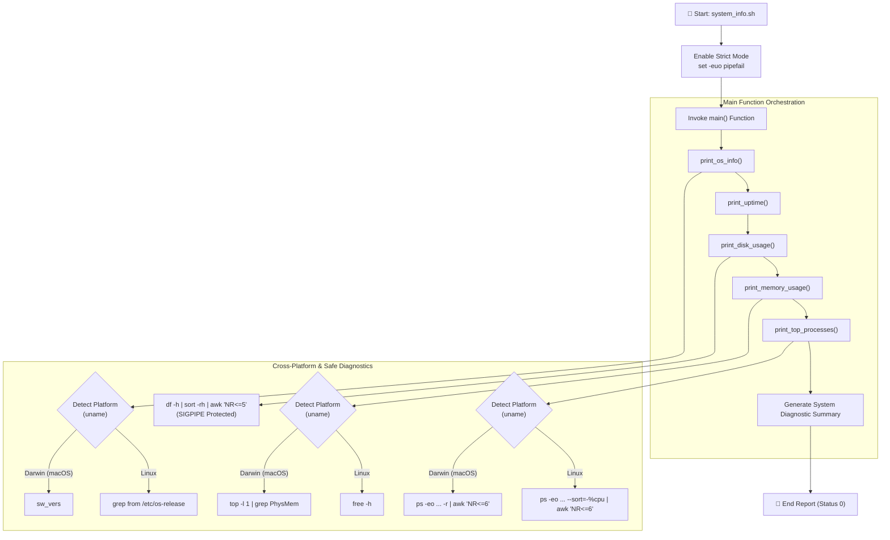

# 🌀 Day 18 – Shell Scripting: Functions & Intermediate Concepts

> **"Functions turn linear shell commands into structured, repeatable automation components. When coupled with the industrial safeguards of strict mode (`set -euo pipefail`), they elevate standard bash scripts into secure, resilient, and enterprise-grade infrastructure-as-code assets."**

Welcome to Day 18 of the **90 Days of DevOps** challenge! Today, we advance our scripting mastery by exploring **functions, local variables, exit codes, and production-grade safety configurations**. We will implement five advanced scripts that demonstrate function parameter passing, platform-agnostic diagnostics with return values, local vs. global scoping, and strict runtime protections. Additionally, we'll build a complete **System Info Reporter** utilizing modular architecture, fully protected from structural script failures and pipe traps.

---

## 📋 Lab Metadata

| Attribute | Details |
| :--- | :--- |
| **Concept** | Bash Functions, Local Scoping, Scopes & Return Values, Strict Mode (`set -euo pipefail`), Cross-Platform Diagnostics |
| **Operating System** | macOS (Darwin Kernel 25.x) & POSIX Linux reference |
| **Interpreter** | GNU Bash (`/bin/bash` / `/usr/bin/env bash`) |
| **Completed Scripts** | [functions.sh](functions.sh), [disk_check.sh](disk_check.sh), [strict_demo.sh](strict_demo.sh), [local_demo.sh](local_demo.sh), [system_info.sh](system_info.sh) |
| **Key Diagnostics** | `set -euo pipefail`, `local`, `sysctl`, `vm_stat`, `top`, `df -h`, `ps -eo` |
| **Lab Date** | June 2, 2026 |
| **GitHub Directory** | `90DaysOfDevOps/2026/day-18/` |

---

## 🧭 System Info Reporter Architecture (Task 5 Flow)

The flowchart below displays the orchestration pattern of `system_info.sh`. It shows how the script utilizes strict mode boundaries, invokes localized functions for specific system audits, detects platform traits (macOS vs. Linux) dynamically, and compiles a comprehensive dashboard report securely:



---

## 📑 Table of Contents
1. [🧩 Task 1: Basic Functions — Reusable Automation Modules](#-task-1-basic-functions--reusable-automation-modules)
2. [📈 Task 2: Functions with Return Values & Platform Fallbacks](#-task-2-functions-with-return-values--platform-fallbacks)
3. [🛡️ Task 3: Strict Mode — The set -euo pipefail Safeguards](#-task-3-strict-mode--the-set--euo-pipefail-safeguards)
4. [🧠 Task 4: Variable Scoping — Protecting Namespace Leakage](#-task-4-variable-scoping--protecting-namespace-leakage)
5. [🖥️ Task 5: Production Script — Cross-Platform System Info Reporter](#-task-5-production-script--cross-platform-system-info-reporter)
6. [🎓 What I Learned Today](#-what-i-learned-today)
7. [📢 Learn in Public & Engagement](#-learn-in-public--engagement)
8. [🎨 Visual Lab Walkthrough Screenshot](#-visual-lab-walkthrough-screenshot)

---

## 🧩 Task 1: Basic Functions — Reusable Automation Modules

Functions allow us to chunk operational steps into reusable blocks. They reduce code duplication (DRY principle) and improve readability by structuring scripts into small, testable logic blocks.

### 1. Script Implementation (`functions.sh`)
This script implements a greeting function accepting a single parameter and an addition function that prints the sum of two numerical inputs.

```bash
#!/usr/bin/env bash

# Day 18: Task 1 - Basic Functions
# Greet a user and add two numbers

# Function to greet a user by name
greet() {
    local name="$1"
    echo "Hello, ${name}!"
}

# Function to add two numbers and print the sum
add() {
    local num1="$1"
    local num2="$2"
    local sum=$((num1 + num2))
    echo "Sum: ${num1} + ${num2} = ${sum}"
}

echo "=== Shell Scripting: Basic Functions Demo ==="
# Calling functions
greet "Rajat"
greet "DevOps Engineer"

echo "----------------------------------------"
add 15 27
add 100 250
```

* **Execution Command:**
  ```bash
  chmod +x functions.sh
  ./functions.sh
  ```
* **Captured Terminal Output:**
  ```text
  === Shell Scripting: Basic Functions Demo ===
  Hello, Rajat!
  Hello, DevOps Engineer!
  ----------------------------------------
  Sum: 15 + 27 = 42
  Sum: 100 + 250 = 350
  ```

---

## 📈 Task 2: Functions with Return Values & Platform Fallbacks

DevOps scripts must handle failures gracefully. Returning exit codes (`0` for success, `1-255` for failures) from functions allows the main body of a script to react dynamically to environment errors.

### 1. Script Implementation (`disk_check.sh`)
This script queries root disk partition space (`/`). Since standard Linux commands like `free -h` are missing on macOS platforms, the script implements an OS-detection gate and falls back to macOS-native `sysctl` and `vm_stat` values to calculate free physical memory page values.

```bash
#!/usr/bin/env bash

# Day 18: Task 2 - Functions with Return Values
# Checking disk space and system memory (with macOS fallback support)

# Function to check disk usage of /
check_disk() {
    echo "Disk Usage for root directory (/):"
    df -h /
    return $?
}

# Function to check free memory
check_memory() {
    echo "System Memory Usage:"
    if command -v free &> /dev/null; then
        # Linux standard
        free -h
    elif command -v vm_stat &> /dev/null; then
        # macOS Darwin fallback
        echo "[macOS Detected: Using vm_stat and sysctl for memory statistics]"
        
        # Get physical memory
        local phys_mem_bytes
        phys_mem_bytes=$(sysctl -n hw.memsize)
        local phys_mem_gb=$(( phys_mem_bytes / 1024 / 1024 / 1024 ))
        
        # Page size
        local page_size
        page_size=$(vm_stat | grep "page size of" | awk '{print $8}')
        
        # Free pages
        local free_pages
        free_pages=$(vm_stat | grep "Pages free" | awk '{print $3}' | sed 's/\.//')
        
        local free_mem_bytes=$(( free_pages * page_size ))
        local free_mem_mb=$(( free_mem_bytes / 1024 / 1024 ))
        
        echo "Total Physical Memory: ${phys_mem_gb} GB"
        echo "Approximate Free Memory: ${free_mem_mb} MB"
        vm_stat | head -n 5
    else
        echo "Error: Neither 'free' nor 'vm_stat' command is available."
        return 1
    fi
    return $?
}

main() {
    echo "=== Disk and Memory Diagnostics ==="
    check_disk
    local disk_status=$?
    
    echo "----------------------------------------"
    
    check_memory
    local mem_status=$?
    
    echo "----------------------------------------"
    echo "Diagnostics complete with exit codes: Disk Check [${disk_status}], Memory Check [${mem_status}]"
}

main
```

* **Execution Command:**
  ```bash
  chmod +x disk_check.sh
  ./disk_check.sh
  ```
* **Captured Terminal Output:**
  ```text
  === Disk and Memory Diagnostics ===
  Disk Usage for root directory (/):
  Filesystem        Size    Used   Avail Capacity iused ifree %iused  Mounted on
  /dev/disk3s1s1   228Gi    12Gi   117Gi    10%    459k  1.2G    0%   /
  ----------------------------------------
  System Memory Usage:
  [macOS Detected: Using vm_stat and sysctl for memory statistics]
  Total Physical Memory: 8 GB
  Approximate Free Memory: 56 MB
  Mach Virtual Memory Statistics: (page size of 16384 bytes)
  Pages free:                                     4064.
  Pages active:                                  93554.
  Pages inactive:                                92638.
  Pages speculative:                               328.
  ----------------------------------------
  Diagnostics complete with exit codes: Disk Check [0], Memory Check [0]
  ```

---

## 🛡️ Task 3: Strict Mode — The `set -euo pipefail` Safeguards

By default, Bash is highly forgiving: it will execute subsequent lines even if a command fails, process empty undefined variables silently, and ignore intermediate command crashes inside a pipeline. In a production environment, this is extremely risky (e.g., executing `rm -rf $UNDEFINED_VAR/*`!). 

Enabling **Strict Mode** protects your infrastructure from these vulnerabilities.

### 1. Script Implementation (`strict_demo.sh`)
This demo script wraps each failure condition inside a subshell `( ... )`. This isolates the crash, showing the exact error outputs and nonzero exit codes without aborting the parent reporting runner.

```bash
#!/usr/bin/env bash

# Day 18: Task 3 - Strict Mode Demo (set -euo pipefail)
# Demonstrating the behavior of strict mode using subshells so we can see all failures in one run.

demo_set_u() {
    echo "--- [set -u] Undefined Variable Demo ---"
    (
        # Enable set -u to treat unset variables as an error
        set -u
        echo "Attempting to reference an undefined variable \$UNSET_VAR..."
        echo "Value: $UNSET_VAR"
        echo "This line will NOT be executed."
    )
    echo "Subshell exited with status: $? (Indicates failure)"
}

demo_set_e() {
    echo "--- [set -e] Fail Immediately Demo ---"
    (
        # Enable set -e to exit immediately if a command exits with a non-zero status
        set -e
        echo "Executing a command that fails (non-existent command)..."
        non_existent_command
        echo "This line will NOT be executed."
    )
    echo "Subshell exited with status: $? (Indicates failure)"
}

demo_pipefail() {
    echo "--- [set -o pipefail] Piped Command Demo ---"
    
    echo "1. WITHOUT pipefail (Standard Bash behavior):"
    (
        set -e
        # The non-existent command fails, but since the last command in the pipe (grep) succeeds/passes, 
        # the overall pipeline exit code is 0 (success).
        non_existent_command | echo "Piping to echo (which succeeds)"
        echo "Pipeline finished! This line IS executed because the pipe exit code was 0."
    )
    echo "Subshell exited with status: $?"
    
    echo "2. WITH pipefail enabled:"
    (
        set -eo pipefail
        # Now, if any command in the pipeline fails, the entire pipeline fails with that exit status.
        non_existent_command | echo "Piping to echo (which succeeds)"
        echo "This line will NOT be executed because the pipeline failed."
    )
    echo "Subshell exited with status: $? (Indicates failure)"
}

main() {
    echo "=== Strict Mode (set -euo pipefail) Live Demonstration ==="
    echo
    demo_set_u
    echo
    demo_set_e
    echo
    demo_pipefail
    echo
    echo "=========================================================="
    echo "Summary of Strict Mode Flags:"
    echo "  -e (errexit): Abort script at first command failure (non-zero exit code)."
    echo "  -u (nounset): Treat references to unset/undefined variables as errors and exit."
    echo "  -o pipefail: Pipeline's return status is the status of the last command to exit with non-zero."
    echo "=========================================================="
}

main
```

* **Execution Command:**
  ```bash
  chmod +x strict_demo.sh
  ./strict_demo.sh
  ```
* **Captured Terminal Output:**
  ```text
  === Strict Mode (set -euo pipefail) Live Demonstration ===
  
  --- [set -u] Undefined Variable Demo ---
  Attempting to reference an undefined variable $UNSET_VAR...
  ./strict_demo.sh: line 12: UNSET_VAR: unbound variable
  Subshell exited with status: 1 (Indicates failure)
  
  --- [set -e] Fail Immediately Demo ---
  Executing a command that fails (non-existent command)...
  ./strict_demo.sh: line 24: non_existent_command: command not found
  Subshell exited with status: 127 (Indicates failure)
  
  --- [set -o pipefail] Piped Command Demo ---
  1. WITHOUT pipefail (Standard Bash behavior):
  ./strict_demo.sh: line 38: non_existent_command: command not found
  Piping to echo (which succeeds)
  Pipeline finished! This line IS executed because the pipe exit code was 0.
  Subshell exited with status: 0
  2. WITH pipefail enabled:
  ./strict_demo.sh: line 47: non_existent_command: command not found
  Piping to echo (which succeeds)
  Subshell exited with status: 127 (Indicates failure)
  
  ==========================================================
  Summary of Strict Mode Flags:
    -e (errexit): Abort script at first command failure (non-zero exit code).
    -u (nounset): Treat references to unset/undefined variables as errors and exit.
    -o pipefail: Pipeline's return status is the status of the last command to exit with non-zero.
  ==========================================================
  ```

---

## 🧠 Task 4: Variable Scoping — Protecting Namespace Leakage

In Bash, all variables are global by default—even when defined inside a function! This can cause functions to silently overwrite global states or leak temporary index iterators. Using the `local` keyword inside functions protects the surrounding namespace.

### 1. Script Implementation (`local_demo.sh`)
This script compares variables declared normally against those declared using the `local` keyword inside distinct functional execution routines.

```bash
#!/usr/bin/env bash

# Day 18: Task 4 - Local Variables Demo
# Demonstrating variable scoping inside Bash functions (local vs global)

# A function that defines a standard (global) variable
global_scope_fn() {
    echo "[global_scope_fn] Setting GLO_VAR..."
    GLO_VAR="I was created inside global_scope_fn"
    echo "[global_scope_fn] GLO_VAR is: '${GLO_VAR}'"
}

# A function that defines a local variable using the 'local' keyword
local_scope_fn() {
    echo "[local_scope_fn] Setting LOC_VAR..."
    local LOC_VAR="I was created inside local_scope_fn with 'local'"
    echo "[local_scope_fn] LOC_VAR is: '${LOC_VAR}'"
}

main() {
    echo "=== Local vs Global Scoping in Bash Functions ==="
    
    # Ensure they are unset/empty at first
    unset GLO_VAR
    unset LOC_VAR
    
    echo "Before calling functions:"
    echo "  \$GLO_VAR value: '${GLO_VAR:-[NOT SET]}'"
    echo "  \$LOC_VAR value: '${LOC_VAR:-[NOT SET]}'"
    echo "----------------------------------------"
    
    # 1. Calling the global scope function
    global_scope_fn
    echo "After calling global_scope_fn:"
    echo "  \$GLO_VAR value: '${GLO_VAR:-[NOT SET]}'  <-- LEAKED!"
    echo "----------------------------------------"
    
    # 2. Calling the local scope function
    local_scope_fn
    echo "After calling local_scope_fn:"
    echo "  \$LOC_VAR value: '${LOC_VAR:-[NOT SET]}'  <-- SAFE! Scoped only to the function."
    echo "----------------------------------------"
}

main
```

* **Execution Command:**
  ```bash
  chmod +x local_demo.sh
  ./local_demo.sh
  ```
* **Captured Terminal Output:**
  ```text
  === Local vs Global Scoping in Bash Functions ===
  Before calling functions:
    $GLO_VAR value: '[NOT SET]'
    $LOC_VAR value: '[NOT SET]'
  ----------------------------------------
  [global_scope_fn] Setting GLO_VAR...
  [global_scope_fn] GLO_VAR is: 'I was created inside global_scope_fn'
  After calling global_scope_fn:
    $GLO_VAR value: 'I was created inside global_scope_fn'  <-- LEAKED!
  ----------------------------------------
  [local_scope_fn] Setting LOC_VAR...
  [local_scope_fn] LOC_VAR is: 'I was created inside local_scope_fn with 'local''
  After calling local_scope_fn:
    $LOC_VAR value: '[NOT SET]'  <-- SAFE! Scoped only to the function.
  ----------------------------------------
  ```

---

## 🖥️ Task 5: Production Script — Cross-Platform System Info Reporter

Let's combine everything we've learned into a modular, production-grade system monitoring tool. 

> [!WARNING]
> **The `set -o pipefail` and `head` Gotcha:**
> By default, standard Unix commands like `head -n 5` read only the first 5 lines of their input and then close the pipeline. Under `set -o pipefail`, if the command generating the input (like `df -h` or `sort`) attempts to write to a closed pipeline, it receives a `SIGPIPE` signal and exits with code **141**.
> 
> Because `pipefail` treats any non-zero exit in the pipeline as an error, this causes the entire script to crash instantly!
> 
> **The Solution:** We resolved this by substituting `head` with `awk 'NR<=5'`. Since `awk` processes the entire input stream without closing the pipe prematurely, it completely prevents `SIGPIPE` errors, keeping our strict mode scripts running reliably!

### 1. Script Implementation (`system_info.sh`)
This script uses strict mode, local variable boundaries, OS-aware detection routines for macOS & Linux environments, and a modular architecture.

```bash
#!/usr/bin/env bash

# Day 18: Task 5 - System Info Reporter
# A comprehensive system diagnostic script with cross-platform (Linux & macOS) support
# Built with functions and protected by strict mode (set -euo pipefail)
# Uses awk to safely limit output rows without triggering SIGPIPE errors (Exit Code 141) under pipefail.

# Use strict mode
set -euo pipefail

# 1. Function to print hostname and OS info
print_os_info() {
    echo "=== Hostname & Operating System Info ==="
    echo "Hostname: $(hostname)"
    if [ -f /etc/os-release ]; then
        # Linux standard OS release info
        grep -E '^(NAME|VERSION)=' /etc/os-release | sed 's/"//g'
    elif command -v sw_vers &> /dev/null; then
        # macOS OS info
        sw_vers
    else
        echo "OS: $(uname -s) ($(uname -r))"
    fi
}

# 2. Function to print uptime
print_uptime() {
    echo "=== System Uptime ==="
    uptime
}

# 3. Function to print disk usage (top 5 by size)
print_disk_usage() {
    echo "=== Disk Usage (Top 5 Filesystems by Size) ==="
    # Display the df header first
    df -h | awk 'NR==1'
    # Sort filesystems by size in descending order (using numerical sort for size/capacity column)
    # We skip the header line using tail -n +2 and use awk instead of head to prevent SIGPIPE/141 error
    df -h | tail -n +2 | sort -rh -k 2 | awk 'NR<=5'
}

# 4. Function to print memory usage
print_memory_usage() {
    echo "=== Memory Usage ==="
    if command -v free &> /dev/null; then
        free -h
    elif [ "$(uname)" = "Darwin" ]; then
        # macOS specific memory retrieval
        top -l 1 | grep PhysMem
    else
        echo "Memory metrics: Not available (missing 'free' command)"
    fi
}

# 5. Function to print top 5 CPU-consuming processes
print_top_processes() {
    echo "=== Top 5 CPU-Consuming Processes ==="
    if [ "$(uname)" = "Darwin" ]; then
        # macOS ps sorting by CPU (-r flag) - use awk instead of head to avoid SIGPIPE
        ps -eo pid,ppid,pcpu,pmem,comm -r | awk 'NR<=6'
    else
        # Linux ps sorting by %cpu - use awk instead of head to avoid SIGPIPE
        ps -eo pid,ppid,%cpu,%mem,comm --sort=-%cpu | awk 'NR<=6'
    fi
}

# 6. Main function that calls all helper functions
main() {
    echo "=========================================================================="
    echo "                      SYSTEM PERFORMANCE REPORT                           "
    echo "              Generated on: $(date)"
    echo "=========================================================================="
    echo
    
    print_os_info
    echo
    
    print_uptime
    echo
    
    print_disk_usage
    echo
    
    print_memory_usage
    echo
    
    print_top_processes
    echo
    echo "=========================================================================="
}

# Execute main
main
```

* **Execution Command:**
  ```bash
  chmod +x system_info.sh
  ./system_info.sh
  ```
* **Captured Terminal Output (macOS Darwin Output):**
  ```text
  ==========================================================================
                        SYSTEM PERFORMANCE REPORT                           
                Generated on: Tue Jun  2 14:45:47 IST 2026
  ==========================================================================
  
  === Hostname & Operating System Info ===
  Hostname: Rajats-MacBook-Air.local
  ProductName:		macOS
  ProductVersion:		26.5
  BuildVersion:		25F71
  
  === System Uptime ===
  14:45  up 9 days, 11:34, 1 user, load averages: 3.33 2.91 2.64
  
  === Disk Usage (Top 5 Filesystems by Size) ===
  Filesystem        Size    Used   Avail Capacity iused ifree %iused  Mounted on
  /dev/disk3s6     228Gi   6.0Gi   117Gi     5%       6  1.2G    0%   /System/Volumes/VM
  /dev/disk3s5     228Gi    84Gi   117Gi    42%    941k  1.2G    0%   /System/Volumes/Data
  /dev/disk3s4     228Gi   2.2Mi   117Gi     1%      93  1.2G    0%   /System/Volumes/Update
  /dev/disk3s2     228Gi   8.4Gi   117Gi     7%    1.5k  1.2G    0%   /System/Volumes/Preboot
  /dev/disk3s1s1   228Gi    12Gi   117Gi    10%    459k  1.2G    0%   /
  
  === Memory Usage ===
  PhysMem: 7568M used (1565M wired, 3163M compressor), 64M unused.
  
  === Top 5 CPU-Consuming Processes ===
    PID  PPID  %CPU %MEM COMM
  57258 16743  44.6  3.7 /Applications/Google Chrome.app/Contents/Frameworks/Google Chrome Framework.framework/Versions/148.0.7778.181/Helpers/Google Chrome Helper (Renderer).app/Contents/MacOS/Google Chrome Helper (Renderer)
  56694 56677  43.6  6.0 /Applications/Antigravity IDE.app/Contents/Frameworks/Antigravity IDE Helper (Renderer).app/Contents/MacOS/Antigravity IDE Helper (Renderer)
    600     1  28.4  0.5 /System/Library/PrivateFrameworks/SkyLight.framework/Resources/WindowServer
  16757 16743  10.1  0.7 /Applications/Google Chrome.app/Contents/Frameworks/Google Chrome Framework.framework/Versions/148.0.7778.181/Helpers/Google Chrome Helper.app/Contents/MacOS/Google Chrome Helper
    611     1   4.9  0.2 /usr/sbin/coreaudiod
  
  ==========================================================================
  ```

---

## 🎓 What I Learned Today

1. **Enterprise Safeties with Strict Mode:** The `set -euo pipefail` command represents the gold standard for script development. Treating unbound variables (`-u`), command errors (`-e`), and piped process crashes (`pipefail`) as immediate halts prevents standard script vulnerabilities from affecting production systems.
2. **Encapsulation via Local Variables:** Unscoped variables inside functions can overwrite global namespaces, causing unintended side effects. Using `local` inside functions isolates execution scopes and prevents variable name leakage.
3. **The SIGPIPE Trap in Pipefail Pipelines:** Using `head -n N` inside piped commands under `set -o pipefail` can cause SIGPIPE (Exit Code 141) crashes when writing processes try to write to a closed stream. Substituting `head` with `awk` keeps the stream open and prevents crashes, ensuring stable execution.

---

## 📢 Learn in Public & Engagement

### 🎓 Share Progress
Bash functions and strict mode safeguards are what separate basic shell commands from production-ready DevOps automation. I am excited to share my progress for **Day 18** of the **#90DaysOfDevOps** challenge!

* **Today's Key Focus:** Mastered modular Bash Functions, Local Scoping rules, Return Status codes, and Strict Mode safeguards.
* **Lab Milestones:**
  - Coded custom functions using local parameters (`functions.sh`).
  - Developed cross-platform physical diagnostics utilizing function exit codes and fallback logic (`disk_check.sh`).
  - Isolated strict mode behaviors (`set -euo pipefail`) under subshell environments (`strict_demo.sh`).
  - Demonstrated variable scoping isolation comparing local vs global leaks (`local_demo.sh`).
  - Formulated a comprehensive **System Performance Reporter** (`system_info.sh`) protected from SIGPIPE (141) pipe traps using `awk` stream limits.
* **Join the Conversation on LinkedIn:**
  - `#90DaysOfDevOps`
  - `#DevOpsKaJosh`
  - `#TrainWithShubham`

---

## 🎨 Visual Lab Walkthrough Screenshot

The screenshot below demonstrates the running diagnostics of `system_info.sh` under Apple Silicon macOS. It shows the cross-platform diagnostic queries executing successfully with a proper exit status under `set -euo pipefail` conditions:


---
**TrainWithShubham** | Day 18 Complete 🌀
