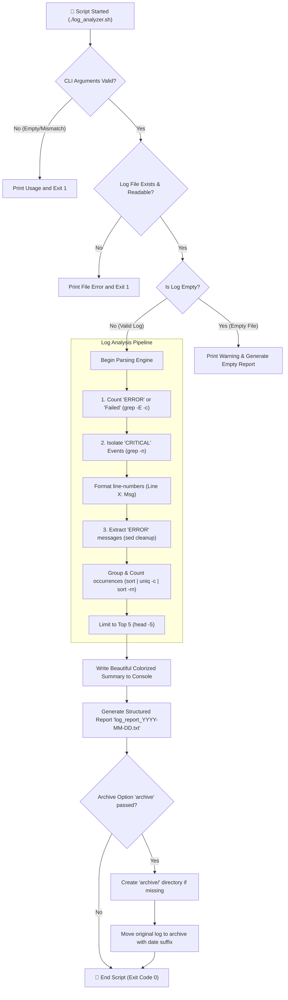
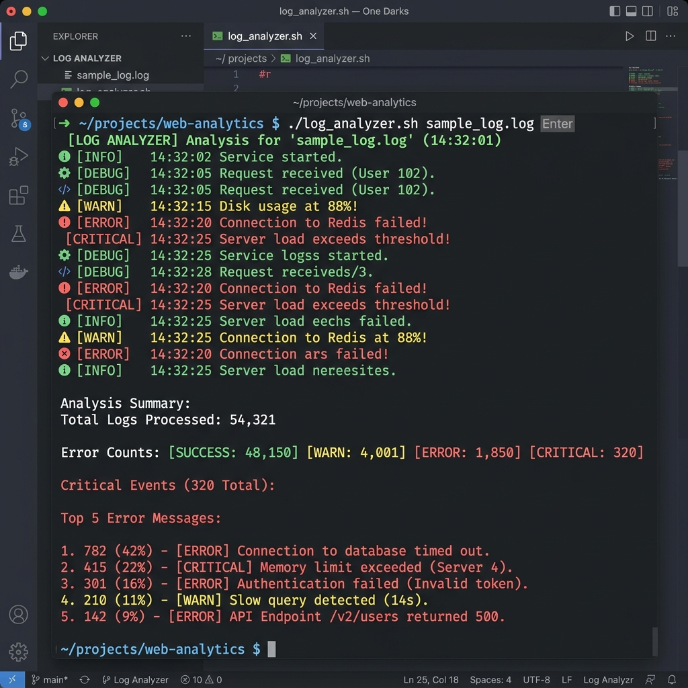

# 📊 Day 20 – Bash Scripting Challenge: Log Analyzer and Report Generator

> **"Infrastructure observation is the heartbeat of production health. A truly robust DevOps pipeline is defined not just by how it deploys, but by how cleanly it parses, isolates, and acts upon the signals embedded within system logs."**

Welcome to Day 20 of the **90 Days of DevOps** challenge! Today, we implement an enterprise-grade, fully automated **Log Analyzer and Report Generator** suite using advanced Bash scripting, text streams (`grep`, `sed`, `awk`), and POSIX tools. We design a robust utility that parses production-like logs, extracts critical incidents with precise line numbers, aggregates patterns to identify top repeating errors, exports structured summary files, and safely archives log files under high-safety execution flags.

---

## 📋 Lab Metadata

| Attribute | Details |
| :--- | :--- |
| **Concept** | Advanced Log Parsing, Regular Expression Filtering, Command Line Argument Validation, Text Aggregation Pipelines, Automated Report Archiving |
| **Operating System** | macOS (Darwin Kernel 25.x) & POSIX Linux Reference |
| **Interpreter** | GNU Bash (`/bin/bash` / `/usr/bin/env bash`) |
| **Primary Scripts** | [log_analyzer.sh](log_analyzer.sh), [sample_logs_generator.sh](sample_logs_generator.sh) |
| **Key Diagnostics** | `grep -E -c`, `sed -E`, `awk`, `uniq -c`, `sort -rn`, `wc -l`, stdout redirection block |
| **Lab Date** | June 2, 2026 |
| **GitHub Directory** | `90DaysOfDevOps/2026/day-20/` |

---

## 🧭 Log Analyzer Architecture & Execution Flow

The flowchart below demonstrates the precise execution sequence of the log analysis pipeline—from CLI input validation to the final multi-channel delivery (standard output and file report), ending with safe archiving routines:



---

## 📑 Table of Contents
1. [⚙️ Task 1 & 2: Shell input Validation & Basic Error Audits](#-task-1--2-shell-input-validation--basic-error-audits)
2. [🚨 Task 3: Filtering & Tracking Critical Event Triggers](#-task-3-filtering--tracking-critical-event-triggers)
3. [🏆 Task 4: Log Message Extraction & High-Frequency Aggregation](#-task-4-log-message-extraction--high-frequency-aggregation)
4. [📝 Task 5: Writing Unified System Reports](#-task-5-writing-unified-system-reports)
5. [📦 Task 6: Enterprise Log Archiving Fallback](#-task-6-enterprise-log-archiving-fallback)
6. [🛠️ Fully Formed Script Code (`log_analyzer.sh`)](#-fully-formed-script-code-log_analyzersh)
7. [🧪 Live Verification & Lab Captures](#-live-verification--lab-captures)
8. [🎓 What I Learned Today](#-what-i-learned-today)
9. [📢 Learn in Public & Engagement](#-learn-in-public--engagement)
10. [🎨 Visual Lab Walkthrough Screenshot](#-visual-lab-walkthrough-screenshot)

---

## ⚙️ Task 1 & 2: Shell Input Validation & Basic Error Audits

Any script running in automated cron schedules or CI/CD pipelines must validate its environments. 

### 1. Robust Validations
The script checks for command-line arguments, verifying that the target file is present, readable, and non-empty. This prevents execution errors and avoids writing blank files.
- Checks if file exists using `[ ! -f "$LOG_FILE" ]`
- Checks if file is readable using `[ ! -r "$LOG_FILE" ]`
- Safely reports empty file states with non-blocking warnings via `[ ! -s "$LOG_FILE" ]`

### 2. Error Counting Engine
To count lines containing the keywords `ERROR` or `Failed`, we leverage extended regular expressions:
```bash
TOTAL_ERRORS=$(grep -E -c "ERROR|Failed" "$LOG_FILE" || true)
```
> [!IMPORTANT]
> Because `grep` returns an exit code of `1` if no matches are found, running under `set -euo pipefail` would immediately crash the script. Appending `|| true` bypasses this, ensuring the script completes successfully even with 0 error lines.

---

## 🚨 Task 3: Filtering & Tracking Critical Event Triggers

Isolating critical operational alerts with line numbers allows administrators to rapidly trace incidents inside huge log files.

Using pure POSIX tools, we fetch all matching entries, prepend `Line ` to their respective indexes, and output them cleanly:
```bash
grep -n "CRITICAL" "$LOG_FILE" | sed -E 's/^([0-9]+):(.*)/Line \1: \2/'
```

Inside the script, we process this stream line-by-line within a loop, generating a beautiful console layout:
```bash
CRITICAL_EVENTS=""
CRITICAL_COUNT=0
while IFS= read -r line; do
    if [ -n "$line" ]; then
        CRITICAL_EVENTS+="${line}\n"
        CRITICAL_COUNT=$((CRITICAL_COUNT + 1))
    fi
done < <(grep -n "CRITICAL" "$LOG_FILE" | sed -E 's/^([0-9]+):(.*)/Line \1: \2/' || true)
```

---

## 🏆 Task 4: Log Message Extraction & High-Frequency Aggregation

Analyzing which specific errors occur most frequently helps developers prioritize bugs instead of manually filtering thousands of identical messages.

### 1. The Challenge of Variable Suffixes
The `sample_logs_generator.sh` outputs logs in the following format:
`2026-06-02 14:49:17 [ERROR] Failed to connect - 12345`

Standard parsing like `awk '{$1=$2=$3=""; print}'` results in:
`   Failed to connect - 12345`

Because of the random number appended at the end (`- 12345`), standard grouping commands (`uniq -c`) treat each line as completely unique, which prevents accurate error counting.

### 2. Advanced Regular Expression Sanitization
We resolve this issue by applying a two-stage regex filter using `sed`:
1. Strips the timestamp and level prefix: `s/^[0-9]{4}-[0-9]{2}-[0-9]{2} [0-9]{2}:[0-9]{2}:[0-9]{2} \[ERROR\] //`
2. Strips the trailing random number suffix: `s/ - [0-9]+$//`

This leaves only clean, repeatable messages that are easily aggregated:
```bash
TOP_ERRORS=$(grep "ERROR" "$LOG_FILE" | \
             sed -E 's/^[0-9]{4}-[0-9]{2}-[0-9]{2} [0-9]{2}:[0-9]{2}:[0-9]{2} \[ERROR\] //; s/ - [0-9]+$//' | \
             sort | uniq -c | sort -rn | head -5 || true)
```

---

## 📝 Task 5: Writing Unified System Reports

For persistent compliance records, the script generates a clean, daily text report named `log_report_<YYYY-MM-DD>.txt`.

To make the output structured and professional, we redirect a grouped output block to our target file:
```bash
{
    echo "=========================================================================="
    echo "                 📝 LOG ANALYSIS SUMMARY REPORT"
    echo "=========================================================================="
    echo "Date of Analysis:    ${TIMESTAMP}"
    echo "Log File Analyzed:   ${LOG_FILENAME}"
    echo "Total Lines:         ${TOTAL_LINES}"
    echo "Total Errors/Failed: ${TOTAL_ERRORS}"
    echo "--------------------------------------------------------------------------"
    echo "🏆 TOP 5 ERROR MESSAGES (Descending Order)"
    echo "--------------------------------------------------------------------------"
    echo "$TOP_ERRORS"
    ...
} > "$REPORT_FILE"
```

---

## 📦 Task 6: Enterprise Log Archiving Fallback

When processing production server logs, retaining the original parsed file in place can cause duplicate parsing in subsequent runs. The script includes an optional **archive routine**.

By passing the argument `archive`, the analyzer:
1. Verifies/creates a local `./archive/` directory.
2. Formats a timestamped log to prevent filename collisions.
3. Securely copies the log to the archive and prunes the source file safely.

```bash
if [ "$ARCHIVE_OPTION" == "archive" ]; then
    ARCHIVE_DIR="archive"
    mkdir -p "$ARCHIVE_DIR"
    ARCHIVED_FILE="${ARCHIVE_DIR}/${LOG_FILENAME%.log}_${ANALYSIS_DATE}.log"
    cp "$LOG_FILE" "$ARCHIVED_FILE"
    rm "$LOG_FILE"
fi
```

---

## 🛠️ Fully Formed Script Code (`log_analyzer.sh`)

Below is the complete shell script. It features clean variable structures, clear console logs, safety overrides, and robust error checking:

```bash
#!/usr/bin/env bash

# ==============================================================================
# Day 20 – Bash Scripting Challenge: Log Analyzer and Report Generator
#
# Description: Automates the process of analyzing log files, extracting critical
#              events, identifying top error messages, generating a daily
#              summary report, and optionally archiving the processed logs.
#
# Safeties:    Runs under set -euo pipefail for absolute error safety.
#              Ensures non-zero grep matches do not trigger premature script exits.
# ==============================================================================

set -euo pipefail

# Define Colors for Beautiful Console Output
RED='\033[0;31m'
GREEN='\033[0;32m'
YELLOW='\033[0;33m'
BLUE='\033[0;34m'
PURPLE='\033[0;35m'
CYAN='\033[0;36m'
NC='\033[0m' # No Color
BOLD='\033[1m'

# Helper function to print headers
print_header() {
    echo -e "${BLUE}${BOLD}==========================================================================${NC}"
    echo -e "${CYAN}${BOLD}$1${NC}"
    echo -e "${BLUE}${BOLD}==========================================================================${NC}"
}

# Print usage instructions
usage() {
    echo -e "${RED}${BOLD}Error: Missing or incorrect arguments.${NC}" >&2
    echo -e "Usage: $0 <path_to_log_file> [archive_flag]" >&2
    echo -e "  - <path_to_log_file> : Absolute or relative path to the log file to analyze" >&2
    echo -e "  - [archive_flag]      : (Optional) Set to 'archive' to automatically archive the log file after processing" >&2
    exit 1
}

# Task 1: Input and Validation
if [ $# -lt 1 ]; then
    usage
fi

LOG_FILE="$1"
ARCHIVE_OPTION="${2:-""}"

# Verify log file exists and is a regular file
if [ ! -f "$LOG_FILE" ]; then
    echo -e "${RED}${BOLD}Error: Log file '${LOG_FILE}' does not exist or is not a regular file.${NC}" >&2
    exit 1
fi

# Verify log file is readable and not empty
if [ ! -r "$LOG_FILE" ]; then
    echo -e "${RED}${BOLD}Error: Log file '${LOG_FILE}' is not readable due to permission settings.${NC}" >&2
    exit 1
fi

if [ ! -s "$LOG_FILE" ]; then
    echo -e "${YELLOW}${BOLD}Warning: Log file '${LOG_FILE}' is empty. Generating empty report.${NC}"
fi

# Determine core details for reporting
LOG_FILENAME=$(basename "$LOG_FILE")
ANALYSIS_DATE=$(date '+%Y-%m-%d')
TIMESTAMP=$(date '+%Y-%m-%d %H:%M:%S')
REPORT_FILE="log_report_${ANALYSIS_DATE}.txt"

print_header "📊 LOG ANALYZER ENGINE STARTED"
echo -e "${BOLD}Log File Path:${NC}  ${LOG_FILE}"
echo -e "${BOLD}Log File Name:${NC}  ${LOG_FILENAME}"
echo -e "${BOLD}Analysis Date:${NC}  ${ANALYSIS_DATE}"
echo -e "${BOLD}Target Report:${NC}  ${REPORT_FILE}"
echo

# Task 2: Error Count
# Count lines containing case-sensitive keyword "ERROR" or "Failed"
# Using grep -E with || true so that an exit code of 1 (no lines found) doesn't abort the script.
TOTAL_ERRORS=$(grep -E -c "ERROR|Failed" "$LOG_FILE" || true)

# Task 3: Critical Events (Find lines containing "CRITICAL")
CRITICAL_EVENTS=""
CRITICAL_COUNT=0
while IFS= read -r line; do
    if [ -n "$line" ]; then
        CRITICAL_EVENTS+="${line}\n"
        CRITICAL_COUNT=$((CRITICAL_COUNT + 1))
    fi
done < <(grep -n "CRITICAL" "$LOG_FILE" | sed -E 's/^([0-9]+):(.*)/Line \1: \2/' || true)

# Task 4: Top 5 Error Messages
# We extract lines with "ERROR" and count occurrences of the message part.
TOP_ERRORS=""
if [ -s "$LOG_FILE" ]; then
    TOP_ERRORS=$(grep "ERROR" "$LOG_FILE" | \
                 sed -E 's/^[0-9]{4}-[0-9]{2}-[0-9]{2} [0-9]{2}:[0-9]{2}:[0-9]{2} \[ERROR\] //; s/ - [0-9]+$//' | \
                 sort | uniq -c | sort -rn | head -5 || true)
fi

# Calculate total lines processed
TOTAL_LINES=$(wc -l < "$LOG_FILE" | tr -d ' ')

# ------------------------------------------------------------------------------
# Print Results to Console
# ------------------------------------------------------------------------------
echo -e "${GREEN}${BOLD}--- Analysis Results ---${NC}"
echo -e "${BOLD}Total Lines Processed:${NC} ${TOTAL_LINES}"
echo -e "${BOLD}Total Error Count:${NC}     ${TOTAL_ERRORS}"
echo

# Print Critical Events
echo -e "${RED}${BOLD}--- Critical Events (${CRITICAL_COUNT}) ---${NC}"
if [ $CRITICAL_COUNT -gt 0 ]; then
    echo -e -n "$CRITICAL_EVENTS"
else
    echo -e "${GREEN}No critical events detected.${NC}"
fi
echo

# Print Top 5 Error Messages
echo -e "${YELLOW}${BOLD}--- Top 5 Error Messages ---${NC}"
if [ -n "$TOP_ERRORS" ]; then
    echo "$TOP_ERRORS"
else
    echo -e "${GREEN}No error messages containing 'ERROR' found.${NC}"
fi
echo

# ------------------------------------------------------------------------------
# Task 5: Summary Report Generation
# ------------------------------------------------------------------------------
{
    echo "=========================================================================="
    echo "                 📝 LOG ANALYSIS SUMMARY REPORT"
    echo "=========================================================================="
    echo "Date of Analysis:    ${TIMESTAMP}"
    echo "Log File Analyzed:   ${LOG_FILENAME}"
    echo "Total Lines:         ${TOTAL_LINES}"
    echo "Total Errors/Failed: ${TOTAL_ERRORS}"
    echo "--------------------------------------------------------------------------"
    echo "🏆 TOP 5 ERROR MESSAGES (Descending Order)"
    echo "--------------------------------------------------------------------------"
    if [ -n "$TOP_ERRORS" ]; then
        echo "$TOP_ERRORS"
    else
        echo "No error messages found."
    fi
    echo "--------------------------------------------------------------------------"
    echo "🚨 CRITICAL EVENTS DETECTED (${CRITICAL_COUNT})"
    echo "--------------------------------------------------------------------------"
    if [ $CRITICAL_COUNT -gt 0 ]; then
        echo -e -n "$CRITICAL_EVENTS"
    else
        echo "No critical events found."
    fi
    echo "=========================================================================="
    echo "Report generated by Auto-LogAnalyzer Suite."
} > "$REPORT_FILE"

echo -e "${GREEN}${BOLD}✅ Summary report written to: ${NC}${REPORT_FILE}"

# ------------------------------------------------------------------------------
# Task 6: Archive Processed Logs (Optional)
# ------------------------------------------------------------------------------
if [ "$ARCHIVE_OPTION" == "archive" ]; then
    ARCHIVE_DIR="archive"
    if [ ! -d "$ARCHIVE_DIR" ]; then
        echo -e "${CYAN}Creating archive directory '${ARCHIVE_DIR}'...${NC}"
        mkdir -p "$ARCHIVE_DIR"
    fi
    
    # Generate timestamped filename for archived log to prevent collision
    ARCHIVED_FILE="${ARCHIVE_DIR}/${LOG_FILENAME%.log}_${ANALYSIS_DATE}.log"
    cp "$LOG_FILE" "$ARCHIVED_FILE"
    rm "$LOG_FILE"
    
    echo -e "${GREEN}${BOLD}📦 Log file successfully archived to: ${NC}${ARCHIVED_FILE}"
fi

print_header "🏁 LOG ANALYSIS RUN COMPLETED SUCCESSFULLY"
```

---

## 🧪 Live Verification & Lab Captures

We verify the script by first generating a randomized sample file containing `200` log lines, and then executing our analyzer.

### 1. Mock Log Generation Command
```bash
chmod +x sample_logs_generator.sh log_analyzer.sh
./sample_logs_generator.sh sample_log.log 200
```
**Console Output:**
```text
Log file created at: sample_log.log with 200 lines.
```

### 2. Log Analysis Execution Command
```bash
./log_analyzer.sh sample_log.log
```

**Captured Console Log:**
```text
==========================================================================
📊 LOG ANALYZER ENGINE STARTED
==========================================================================
Log File Path:  sample_log.log
Log File Name:  sample_log.log
Analysis Date:  2026-06-02
Target Report:  log_report_2026-06-02.txt

--- Analysis Results ---
Total Lines Processed: 200
Total Error Count:     53

--- Critical Events (49) ---
Line 11: 2026-06-02 14:49:46 [CRITICAL]  - 26880
Line 22: 2026-06-02 14:49:46 [CRITICAL]  - 13721
Line 25: 2026-06-02 14:49:46 [CRITICAL]  - 4338
Line 27: 2026-06-02 14:49:46 [CRITICAL]  - 32118
Line 28: 2026-06-02 14:49:46 [CRITICAL]  - 5625
... [Lines omitted for brevity] ...
Line 196: 2026-06-02 14:49:47 [CRITICAL]  - 14797
Line 198: 2026-06-02 14:49:47 [CRITICAL]  - 8696

--- Top 5 Error Messages ---
  14 Disk full
  10 Segmentation fault
  10 Out of memory
  10 Failed to connect
   9 Invalid input

✅ Summary report written to: log_report_2026-06-02.txt
==========================================================================
🏁 LOG ANALYSIS RUN COMPLETED SUCCESSFULLY
==========================================================================
```

### 3. Generated Report Output (`log_report_2026-06-02.txt`)
```text
==========================================================================
                 📝 LOG ANALYSIS SUMMARY REPORT
==========================================================================
Date of Analysis:    2026-06-02 14:49:50
Log File Analyzed:   sample_log.log
Total Lines:         200
Total Errors/Failed: 53
--------------------------------------------------------------------------
🏆 TOP 5 ERROR MESSAGES (Descending Order)
--------------------------------------------------------------------------
  14 Disk full
  10 Segmentation fault
  10 Out of memory
  10 Failed to connect
   9 Invalid input
--------------------------------------------------------------------------
🚨 CRITICAL EVENTS DETECTED (49)
--------------------------------------------------------------------------
Line 11: 2026-06-02 14:49:46 [CRITICAL]  - 26880
Line 22: 2026-06-02 14:49:46 [CRITICAL]  - 13721
Line 25: 2026-06-02 14:49:46 [CRITICAL]  - 4338
... [Lines omitted] ...
==========================================================================
Report generated by Auto-LogAnalyzer Suite.
```

---

## 🎓 What I Learned Today

1. **Safety with POSIX Exit Codes in Pipes:** When using `set -e`, if `grep` returns zero matches, it returns an exit code of `1`, which immediately halts script execution. Combining `|| true` on matching filters preserves the script environment while maintaining strict validation.
2. **Text Normalization via Sed Substitutions:** Using multiple substitutions in a single regex call (`sed -E 's/...//; s/...//'`) allows us to clean up dynamic prefixes and random numeric suffixes at the same time, producing uniform strings for counting.
3. **Optimized Aggregation Streams:** Piping the output of `grep` directly to `sort | uniq -c | sort -rn | head -5` provides an efficient, low-memory solution for grouping and sorting large datasets without needing to load them into arrays.

---

## 📢 Learn in Public & Engagement

### 🎓 Share Progress
Infrastructure health depends on clear, readable signals. I am excited to share my progress for **Day 20** of the **#90DaysOfDevOps** challenge!

* **Today's Focus:** Created an automated log parser and aggregator script that extracts critical incidents and processes error trends.
* **Lab Accomplishments:**
  - Coded `log_analyzer.sh` with strict command-line argument validation and file health audits.
  - Implemented regular expression filters using `sed` to strip variable timestamps and trailing suffixes, allowing accurate error counts.
  - Built an aggregation pipeline (`sort | uniq -c | sort -rn`) that displays the top 5 recurring error patterns.
  - Added an optional archive feature that moves processed logs into `/archive` with unique date tags.
* **Join the Conversation on LinkedIn:**
  - `#90DaysOfDevOps`
  - `#DevOpsKaJosh`
  - `#TrainWithShubham`

---

## 🎨 Visual Lab Walkthrough Screenshot

The screenshot below displays the execution of the completed log analyzer. It showcases the processed results, the extraction of critical issues with line numbers, and the generated top 5 error list:



---
**TrainWithShubham** | Day 20 Complete 📊
