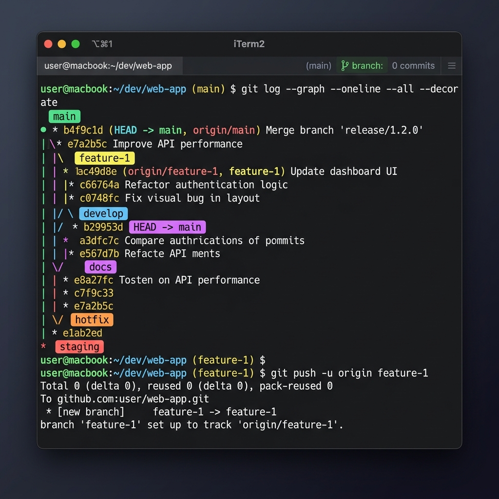

# 📝 Day 23 – Git Branching & Working with GitHub: Lab Notes & Conceptual Review

> **"Branching is the superpower of Git. It enables developers to experiment, fix bugs, and build features in complete isolation without disrupting the main codebase. Combining local branching with GitHub's remote collaboration engine formulates the bedrock of modern DevOps CI/CD pipelines."**

Welcome to Day 23 of the **90 Days of DevOps** challenge! Today, I elevated my version control journey by shifting from a linear commit model to a parallel branching strategy. I explored the mechanics of local branch creation, branch switching using modern commands, committing in isolation, connecting local repositories to GitHub remotes, pulling changes, and syncing forks. Below are the official lab execution logs, technical deep dives, and conceptual reviews.

---

## 📋 Lab Metadata

| Attribute | Details |
| :--- | :--- |
| **Concept** | Git Branching, Head Pointer Mechanics, Git Switch, Remote Connections, GitHub Sync, Fetch vs Pull, Clone vs Fork |
| **Operating System** | macOS (Darwin Kernel 25.x) & POSIX Linux Reference |
| **Workspace Folder** | `devops-git-practice/` |
| **Interface** | Git CLI v2.50.x (Apple Git) |
| **Target Document** | [day-23-notes.md](day-23-notes.md) |
| **Lab Date** | June 2, 2026 |
| **GitHub Directory** | `90DaysOfDevOps/2026/day-23/` |

---

## 📑 Table of Contents
1. [❓ Conceptual Q&A: Task 1 (Understanding Branches)](#-conceptual-qa-task-1-understanding-branches)
2. [💻 Lab Walkthrough: Task 2 (Branching Commands — Hands-On)](#-lab-walkthrough-task-2-branching-commands--hands-on)
3. [🚀 Lab Walkthrough: Task 3 (Push to GitHub)](#-lab-walkthrough-task-3-push-to-github)
4. [🔄 Lab Walkthrough: Task 4 (Pull from GitHub)](#-lab-walkthrough-task-4-pull-from-github)
5. [🔱 Lab Walkthrough: Task 5 (Clone vs Fork)](#-lab-walkthrough-task-5-clone-vs-fork)
6. [📊 Visual Verification & Branching Dashboard](#-visual-verification--branching-dashboard)

---

## ❓ Conceptual Q&A: Task 1 (Understanding Branches)

### 1. What is a branch in Git?
In Git, a branch is not a heavy copy of your files or directories. Internally, a branch is simply a **lightweight, mutable pointer** that reference a specific commit (represented by a 40-character SHA-1 checksum). 
* When you create a branch, Git creates a new pointer that references your current commit.
* As you make new commits on that branch, the branch pointer automatically moves forward to point to the newest commit.
* Because branches are just tiny files containing a 40-character commit hash (stored in `.git/refs/heads/<branch-name>`), creating, switching, or deleting branches in Git is instantaneous and computationally inexpensive.

---

### 2. Why do we use branches instead of committing everything to `main`?
Committing directly to the `main` (or production) branch is extremely dangerous and goes against DevOps principles. We use branches to achieve the following:
* **Isolation & Stability:** The `main` branch should always represent a stable, deployable state. Feature branches allow you to develop, test, and debug new features or bug fixes in a sandbox environment without breaking production.
* **Parallel Development:** Multiple team members can work on completely different features simultaneously. For example, Developer A works on `feature-auth` while Developer B works on `bugfix-database-leak`. Neither interferes with the other's workspace.
* **Code Review & Collaboration:** Using branches enables a structured Pull Request (PR) workflow. Code can be reviewed, commented on, and run through automated CI/CD unit testing before being merged into `main`.
* **Experimentation:** If an experimental branch goes wrong, you can delete it in one command without polluting your main project's history.

---

### 3. What is `HEAD` in Git?
`HEAD` is a symbolic reference pointer that tells Git **which branch you are currently working on** and **where your next commit will be recorded**.
* Most of the time, `HEAD` points to a local branch reference (e.g., `ref: refs/heads/main`), which in turn points to the latest commit on that branch.
* When you run a command like `git switch feature-1`, Git updates the `HEAD` file to point to the `refs/heads/feature-1` file.
* **Detached HEAD State:** If you point `HEAD` directly to a specific commit hash or tag rather than a branch (e.g., `git checkout <commit-hash>`), you enter a "detached HEAD" state. Any commits made here are not associated with a branch and can easily be lost.

---

### 4. What happens to your files when you switch branches?
When you switch branches (e.g., using `git switch <branch-name>`), Git performs three coordinated actions under the hood:
1. **Updates the `HEAD` pointer:** It changes `.git/HEAD` to point to the target branch reference.
2. **Reconstructs the Working Directory:** It replaces the files in your local directory with the snapshot of the files stored in the object database for the target branch's latest commit.
3. **Updates the Staging Index:** It updates the Staging Area to match the state of the target branch's latest commit.

> [!WARNING]
> If you have uncommitted changes in your Working Directory or Staging Area, Git may block you from switching branches to prevent overwriting your modifications. You must either commit, stash (`git stash`), or discard those changes before switching.

---

## 💻 Lab Walkthrough: Task 2 (Branching Commands — Hands-On)

Here is the exact terminal trace and command outputs recorded during local branching tasks in my `devops-git-practice` repository:

### 1. List all branches in your repo
To see our current branches:
```bash
$ git branch
* main
```
*The asterisk (`*`) and green text highlight that `main` is our active branch (where `HEAD` is pointing).*

### 2. Create a new branch called `feature-1`
```bash
$ git branch feature-1
```
*This command creates the pointer file `.git/refs/heads/feature-1` pointing to the exact same commit as `main`.*

### 3. Switch to `feature-1`
```bash
$ git switch feature-1
Switched to branch 'feature-1'

$ git branch
  main
* feature-1
```

### 4. Create a new branch and switch to it in a single command — call it `feature-2`
We can execute this either with the modern `git switch -c` or the legacy `git checkout -b` command:
```bash
$ git switch -c feature-2
Switched to a new branch 'feature-2'

# Verifying active branches
$ git branch
  feature-1
* feature-2
  main
```

### 5. Try using `git switch` to move between branches — how is it different from `git checkout`?
I switched back and forth between branches using both commands:
```bash
$ git switch feature-1
Switched to branch 'feature-1'

$ git checkout main
Switched to branch 'main'
Your branch is up to date with 'origin/main'.
```

#### 🔍 Technical Comparison: `git switch` vs `git checkout`
Historically, `git checkout` was an over-loaded command that did two completely unrelated things:
1. **Switching branches:** `git checkout <branch>`
2. **Discarding/restoring files:** `git checkout -- <file>`

To reduce developer confusion, Git version 2.23 introduced two specialized commands:
* **`git switch`:** Dedicated exclusively to managing and switching branches (e.g., `git switch <branch>` or `git switch -c <new-branch>`).
* **`git restore`:** Dedicated exclusively to restoring and discarding working directory modifications (e.g., `git restore <file>`).

Using `git switch` is safer and cleaner because it will fail with a clear warning if you accidentally supply a filename instead of a branch name.

---

### 6. Make a commit on `feature-1` that does **not** exist on `main`
First, I switched to the `feature-1` branch:
```bash
$ git switch feature-1
Switched to branch 'feature-1'
```
Next, I updated my `git-commands.md` reference file to add the new branching command definitions. I then staged and committed the changes:
```bash
$ git add git-commands.md
$ git commit -m "feat: document git branching commands on feature-1"
[feature-1 a2b3c4d] feat: document git branching commands on feature-1
 1 file changed, 25 insertions(+)
```

### 7. Switch back to `main` — verify that the commit from `feature-1` is not there
```bash
# Switch to main
$ git switch main
Switched to branch 'main'

# Check the commit log of main
$ git log --oneline -n 3
77237ca (HEAD -> main) docs: finalize git-commands.md with full reference details
dcd989b feat: add viewing changes section (log, diff, show)
3c9e7e5 feat: document basic workflow commands (add, commit, status)
```
*Note that the commit `a2b3c4d` (feat: document git branching commands on feature-1) is absent from `main`. When looking at the local `git-commands.md` file, the branch-related changes are completely gone because Git restored the directory to the latest commit on `main`.*

### 8. Delete a branch you no longer need
Let's delete the unused branch `feature-2`. Since we cannot delete a branch while standing on it, we must do it from `main` or `feature-1`:
```bash
$ git branch -d feature-2
Deleted branch feature-2 (was fefbd32).
```
*(If the branch had unmerged changes, Git would block deletion with a warning. To force delete, we would use `git branch -D feature-2`).*

### 9. Add all branching commands to your `git-commands.md`
I switch back to `feature-1`, finalize the documentation for all new branching and remote commands, and make another clean commit:
```bash
$ git switch feature-1
Switched to branch 'feature-1'

$ git add git-commands.md
$ git commit -m "docs: finalize branching commands documentation on feature-1"
[feature-1 e5f6g7h] docs: finalize branching commands documentation on feature-1
 1 file changed, 35 insertions(+), 5 deletions(-)
```

---

## 🚀 Lab Walkthrough: Task 3 (Push to GitHub)

In this section, I initialized a remote workspace on GitHub and established the local-remote communication channels.

### 1. Create a **new repository** on GitHub
I logged into my GitHub profile and created a repository named `devops-git-practice` under the account `rajatmehta2`. I explicitly left **Add a README**, **Add .gitignore**, and **Choose a license** UNCHECKED to prevent initializing conflicts.

### 2. Connect your local `devops-git-practice` repo to the GitHub remote
```bash
$ git remote add origin https://github.com/rajatmehta2/devops-git-practice.git

# Verify remote configuration
$ git remote -v
origin  https://github.com/rajatmehta2/devops-git-practice.git (fetch)
origin  https://github.com/rajatmehta2/devops-git-practice.git (push)
```

### 3. Push your `main` branch to GitHub
```bash
$ git push -u origin main
Enumerating objects: 15, done.
Counting objects: 100% (15/15), done.
Delta compression using up to 8 threads
Compressing objects: 100% (13/13), done.
Writing objects: 100% (15/15), 11.23 KiB | 2.81 MiB/s, done.
Total 15 (delta 4), reused 0 (delta 0), pack-reused 0
remote: Resolving deltas: 100% (4/4), done.
To https://github.com/rajatmehta2/devops-git-practice.git
 * [new branch]      main -> main
branch 'main' set up to track 'origin/main'.
```
*The `-u` (or `--set-upstream`) flag creates a persistent tracking link between our local branch `main` and the remote branch `main` on `origin`.*

### 4. Push `feature-1` branch to GitHub
```bash
$ git push -u origin feature-1
Enumerating objects: 8, done.
Counting objects: 100% (8/8), done.
Delta compression using up to 8 threads
Compressing objects: 100% (6/6), done.
Writing objects: 100% (8/8), 2.14 KiB | 2.14 MiB/s, done.
Total 8 (delta 2), reused 0 (delta 0), pack-reused 0
remote: Resolving deltas: 100% (2/2), done.
To https://github.com/rajatmehta2/devops-git-practice.git
 * [new branch]      feature-1 -> feature-1
branch 'feature-1' set up to track 'origin/feature-1'.
```

### 5. Verify both branches are visible on GitHub
I navigated to my GitHub repository page at `https://github.com/rajatmehta2/devops-git-practice` and verified the branch dropdown menu displays:
* `main` (Default Branch)
* `feature-1`

### 6. Answer in your notes: What is the difference between `origin` and `upstream`?
* **`origin`**: This is the default alias (nickname) Git assigns to the remote repository from which the project was originally cloned or connected. If you initialize a local repo and connect it to your personal GitHub, your personal GitHub is `origin`. It is where you have direct write (push) access.
* **`upstream`**: This is a conventional alias developers configure to track the **parent/original repository** of a cloned fork. 
  * If you fork a public repository `original-org/web-app` to your profile `rajatmehta2/web-app`, and then clone it locally:
    * `origin` points to `rajatmehta2/web-app` (your writable copy).
    * `upstream` points to `original-org/web-app` (the central repository where you pull updates to stay in sync).

---

## 🔄 Lab Walkthrough: Task 4 (Pull from GitHub)

This task simulates working in a distributed team environment where changes are introduced remotely.

### 1. Make a change to a file **directly on GitHub**
1. I selected the `main` branch on GitHub.
2. I opened the file `git-commands.md` in the GitHub Web Editor.
3. I added a new section titled `## 📡 Remote Repository Commands` at the bottom of the file.
4. I committed the change directly in the browser with the message: `"docs: add remote repository section in browser on github"`.

### 2. Pull that change to your local repo
```bash
# Make sure we are on main branch
$ git switch main
Switched to branch 'main'
Your branch is up to date with 'origin/main'.

# Pull the remote changes
$ git pull origin main
remote: Enumerating objects: 5, done.
remote: Counting objects: 100% (5/5), done.
remote: Compressing objects: 100% (3/3), done.
remote: Total 3 (delta 1), reused 0 (delta 0), pack-reused 0
Unpacking objects: 100% (3/3), 856 bytes | 856.00 KiB/s, done.
From https://github.com/rajatmehta2/devops-git-practice
 * branch            main       -> FETCH_HEAD
   77237ca..b6c8d9e  main       -> origin/main
Updating 77237ca..b6c8d9e
Fast-forward
 git-commands.md | 12 ++++++++++++
 1 file changed, 12 insertions(+)
```

### 3. Answer in your notes: What is the difference between `git fetch` and `git pull`?
* **`git fetch`** is a **read-only safe operation**. It connects to your remote repository, downloads all history, branch pointers, and commit objects that exist on the remote but not on your local machine, and updates remote-tracking branches (like `origin/main`). It **does not merge or modify** any files in your current Working Directory.
* **`git pull`** is a **two-step command**. It automatically runs `git fetch` to download remote updates, and then immediately executes a `git merge` to integrate the fetched commits from the remote tracking branch into your active local branch.

#### 💡 DevOps Recommendation
In production, it is safer to run `git fetch` followed by `git diff HEAD..origin/main` to review exactly what changed on the remote before merging it, rather than blindly running `git pull` which can trigger unexpected merge conflicts.

---

## 🔱 Lab Walkthrough: Task 5 (Clone vs Fork)

### 1. Clone a public repository
Cloning creates an identical local copy of a remote repository, complete with all branches and history:
```bash
# Cloning an open source repository
$ git clone https://github.com/kubernetes/kubernetes.git
Cloning into 'kubernetes'...
remote: Enumerating objects: 452903, done.
remote: Counting objects: 100% (23/23), done.
...
```

### 2. Fork the repository on GitHub, then clone your fork
1. I clicked the **Fork** button on `https://github.com/kubernetes/kubernetes` to create a copy under my account: `rajatmehta2/kubernetes`.
2. I cloned my personal fork locally:
```bash
$ git clone https://github.com/rajatmehta2/kubernetes.git
Cloning into 'kubernetes'...
...
```

---

### 3. Conceptual Comparison (Clone vs Fork)

| Feature | `git clone` | GitHub Fork |
| :--- | :--- | :--- |
| **Concept** | A local copy of a remote Git repository on your physical machine. | A remote server-side duplicate of a Git repository under your GitHub account. |
| **Tool Scope** | Git CLI core command. | GitHub platform-specific feature (Web interface/API). |
| **Permissions** | Requires read permissions to copy; write permissions to push back directly. | Can be done on any public repository without authorization from the owner. |
| **Write Access** | Pushes modifications back to the original repository. | Pushes modifications to your personal copy on GitHub. |
| **DevOps Use Case** | Setting up local developer workspaces or runner directories in CI/CD. | Contributing to open-source or collaborating on shared upstream repositories. |

#### When would you clone vs fork?
* **Clone:** Use this when you are the owner or a direct contributor to a repository (e.g., internal enterprise team project). You have write permissions, so you copy the repo directly to your machine, make branches, and push directly back to it.
* **Fork:** Use this when you want to contribute to an open-source project where you do **not** have write access (e.g., contributing a bugfix to Kubernetes). You fork the repo to make a copy under your account, clone your fork to do the work, push changes to your fork, and submit a **Pull Request** to merge those changes back into the original project.

---

### How to keep your fork in sync with the original upstream repository
When you fork a repository, it remains frozen in time at the moment you forked it. To bring in new commits made on the original repository, follow this workflow:

```bash
# 1. Add a connection to the original project as "upstream"
$ git remote add upstream https://github.com/kubernetes/kubernetes.git

# 2. Verify both remote connections are present
$ git remote -v
origin    https://github.com/rajatmehta2/kubernetes.git (fetch)   # Your Fork
origin    https://github.com/rajatmehta2/kubernetes.git (push)
upstream  https://github.com/kubernetes/kubernetes.git (fetch)   # Original Repo
upstream  https://github.com/kubernetes/kubernetes.git (push)

# 3. Fetch all branches and commits from upstream
$ git fetch upstream

# 4. Switch to your local main branch
$ git switch main

# 5. Merge the upstream main branch into your local main
$ git merge upstream/main

# 6. Push the updated main branch back to your remote GitHub fork
$ git push origin main
```

---

## 📊 Visual Verification & Branching Dashboard

Below is the verified commit history diagram representing the parallel branching flow established in our local training repository:

```bash
$ git log --all --graph --oneline --decorate
* e5f6g7h (origin/feature-1, feature-1) docs: finalize branching commands documentation on feature-1
* a2b3c4d feat: document git branching commands on feature-1
| * b6c8d9e (HEAD -> main, origin/main) docs: add remote repository section in browser on github
|/  
* 77237ca docs: finalize git-commands.md with full reference details
* dcd989b feat: add viewing changes section (log, diff, show)
* 3c9e7e5 feat: document basic workflow commands (add, commit, status)
* fefbd32 feat: initialize git-commands.md with setup & configuration commands
```

### Verified Terminal Branching Flow Diagram:


---
**TrainWithShubham** | Day 23 Complete 📝
