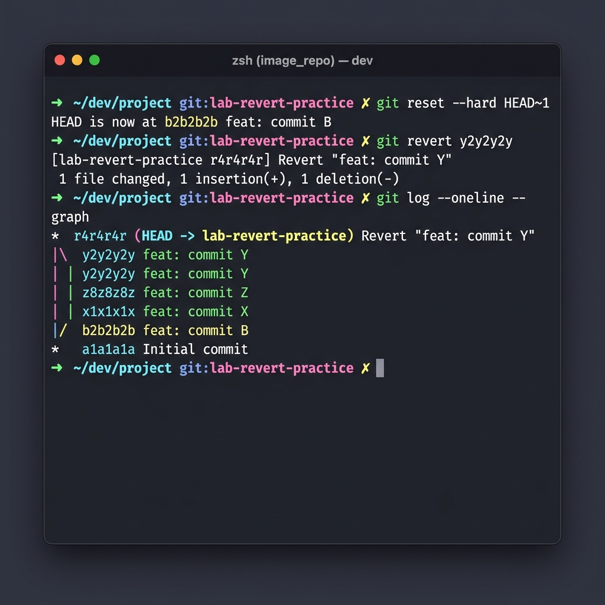

# 📘 Days 22–25 – Git Reference & Master Command Guide

> **"A professional DevOps engineer does not just track version history; they manage it with absolute architectural control. From linearizing histories to safely reverting production regressions and implementing enterprise branching strategies, command-line Git mastery is the foundation of robust CI/CD pipelines and stable codebases."**

Welcome to the **Ultimate Git Reference & Master Command Guide** compiled for the **90 Days of DevOps** challenge! This document consolidates all core and advanced Git commands practiced from **Days 22 to 25**. It serves as a high-density, zero-friction developer cheat sheet covering setup, basic workflows, remote coordination, branching, merging, stashing, cherry-picking, resets, and reverts.

---

## 📋 Lab Metadata

| Attribute | Details |
| :--- | :--- |
| **Concept** | Git Master Command Reference (Days 22–25): Core Workflow, Branching, Remotes, Merging, Rebasing, Stashing, Resets & Reverts |
| **Operating System** | macOS (Darwin Kernel 25.x) & POSIX Linux Reference |
| **Interface** | Git CLI v2.50.x (Apple Git) |
| **Target Document** | [git-commands.md](git-commands.md) |
| **Key Command Interfaces** | `git config`, `git branch`, `git remote`, `git merge`, `git rebase`, `git stash`, `git reset`, `git revert` |
| **Lab Date** | June 2, 2026 |
| **GitHub Directory** | `90DaysOfDevOps/2026/day-25/` |

---

## 📑 Table of Contents
1. [📊 Master Git Commands Matrix](#-master-git-commands-matrix)
2. [⚙️ 1. Setup & Configuration](#-1-setup--configuration)
3. [📝 2. Basic Workflow Operations](#-2-basic-workflow-operations)
4. [🌿 3. Branching & Context Switching](#-3-branching--context-switching)
5. [🌐 4. Remote Repository Coordination](#-4-remote-repository-coordination)
6. [🔀 5. Merging, Rebasing & Squashing](#-5-merging-rebasing--squashing)
7. [📦 6. Stashing Stack & Cherry-Picking](#-6-stashing-stack--cherry-picking)
8. [🛡️ 7. Undo Safety Nets: Reset & Revert](#-7-undo-safety-nets-reset--revert)
9. [🎨 Visual History Command Flows](#-visual-history-command-flows)

---

## 📊 Master Git Commands Matrix

Below is a syntax lookup matrix summarizing all operations covered from Days 22–25:

| Category | Command Syntax | Description (1 Line Summary) | DevOps Use Case |
| :--- | :--- | :--- | :--- |
| **Setup & Config** | `git init` | Initializes a brand-new local Git repository. | Bootstrapping a new microservice locally. |
| **Setup & Config** | `git config --global user.name "<name>"` | Configures the default commit author name. | Establishing developer identity across projects. |
| **Basic Workflow** | `git status` | Displays file modifications, untracked items, and staged state. | Auditing changes before committing. |
| **Basic Workflow** | `git add <file>` | Stages specified file modifications for the next commit. | Incrementally preparing changes for save points. |
| **Basic Workflow** | `git commit -m "<message>"` | Records staged snapshots into local history. | Creating structured, traceable history points. |
| **Basic Workflow** | `git log --oneline --graph` | Renders a compressed graphical view of commit history. | Visualizing release branches and merge points. |
| **Basic Workflow** | `git diff` | Shows differences between unstaged modifications and HEAD. | Inspecting precise code edits before staging. |
| **Branching** | `git branch <branch-name>` | Creates a new branch from the current active branch. | Isolating new feature work from stable code. |
| **Branching** | `git switch <branch-name>` | Switches active focus to the specified branch. | Context switching to begin feature development. |
| **Branching** | `git switch -c <branch-name>` | Creates a new branch and immediately switches to it. | Rapid bootstrapping of feature branches. |
| **Remote** | `git remote add <name> <url>` | Registers a link to an external upstream repository. | Hooking local code to GitHub, GitLab, or Bitbucket. |
| **Remote** | `git clone <url>` | Copies a remote repository into a new local directory. | Bootstrapping an existing workspace for development. |
| **Remote** | `git fetch <remote>` | Downloads historical metadata from remote without merging. | Reviewing remote upstream changes safely. |
| **Remote** | `git pull <remote> <branch>`| Fetches remote changes and immediately merges them. | Syncing local branch with team updates. |
| **Remote** | `git push <remote> <branch>`| Uploads local branch commits to the remote repository. | Sharing finished feature commits with the team/CI. |
| **Merge / Rebase** | `git merge <branch>` | Merges changes from target branch into active branch. | Integrating feature branch back into main. |
| **Merge / Rebase** | `git merge --no-ff <branch>` | Forces creation of a merge commit (no fast-forward). | Preserving branch existence in history audits. |
| **Merge / Rebase** | `git rebase <base-branch>` | Re-applies active branch commits on top of target branch. | Linearizing feature history before Pull Requests. |
| **Merge / Rebase** | `git rebase -i HEAD~N` | Launches interactive menu to edit/squash local commits. | Cleaning up chaotic local history. |
| **Stash / Cherry** | `git stash push -m "<msg>"` | Temporarily caches local uncommitted changes to a stack. | Pausing work to implement urgent hotfixes. |
| **Stash / Cherry** | `git stash pop` | Applies latest stashed changes and deletes them from stack. | Resuming paused work on active branch. |
| **Stash / Cherry** | `git cherry-pick <commit>` | Copies a specific commit from another branch to HEAD. | Porting a critical hotfix to release branch. |
| **Reset / Revert** | `git reset --soft <commit>` | Undoes commits; keeps changes in Staging Area. | Re-grouping changes or editing commit messages. |
| **Reset / Revert** | `git reset --mixed <commit>`| Undoes commits; keeps changes in Working Directory. | Unstaging commits to rework changes. |
| **Reset / Revert** | `git reset --hard <commit>` | Undoes commits; permanently deletes all changes. | Complete discard of failed work or bad state. |
| **Reset / Revert** | `git revert <commit>` | Appends a new commit that undoes the targeted commit. | Safely correcting errors on shared branches. |

---

## ⚙️ 1. Setup & Configuration

Establishing a consistent Git identity and environment is critical for authentication and logging across production workflows.

### Core Commands

#### A. Initialize a Local Repository
* **Syntax:** `git init`
* **Output:**
  ```text
  Initialized empty Git repository in /Users/ToucanRajat/devops-git-practice/.git/
  ```

#### B. Configure Git Commit Author Identity
* **Syntax:**
  ```bash
  git config --global user.name "Toucan Rajat"
  git config --global user.email "rajat@devops.local"
  ```

#### C. View Active Configurations
* **Syntax:** `git config --list`
* **Output:**
  ```text
  user.name=Toucan Rajat
  user.email=rajat@devops.local
  core.repositoryformatversion=0
  core.filemode=true
  core.bare=false
  ```

---

## 📝 2. Basic Workflow Operations

The standard developmental feedback loop in Git centers on tracking modifications, staging changes, and committing stable milestones.

### Core Commands

#### A. Query Repository Workspace Status
* **Syntax:** `git status`
* **Output:**
  ```text
  On branch main
  Your branch is up to date with 'origin/main'.

  Changes not staged for commit:
    (use "git add <file>..." to update what will be committed)
  	modified:   server.js

  Untracked files:
    (use "git add <file>..." to include in what will be committed)
  	config.env
  ```

#### B. Stage File Modifications
* **Syntax:**
  ```bash
  git add server.js             # Stage specific file
  git add .                     # Stage all modifications and untracked items
  ```

#### C. Record Workspace Snapshot
* **Syntax:** `git commit -m "feat: implement primary authentication endpoint"`
* **Output:**
  ```text
  [main a1b2c3d] feat: implement primary authentication endpoint
   1 file changed, 12 insertions(+), 2 deletions(-)
  ```

#### D. View History Logs
* **Syntax:** `git log --oneline --graph --all`
* **Output:**
  ```text
  * a1b2c3d (HEAD -> main, origin/main) feat: implement primary authentication endpoint
  * c0c0c0c docs: update project roadmap
  ```

#### E. Inspect Specific File Changes
* **Syntax:** `git diff server.js`
* **Output:**
  ```diff
  diff --git a/server.js b/server.js
  index e69de29..248d8b1 100644
  --- a/server.js
  +++ b/server.js
  @@ -1 +1,4 @@
  +const express = require('express');
  +const app = express();
  +app.listen(3000);
  ```

---

## 🌿 3. Branching & Context Switching

Branching isolates developmental paths to prevent unfinished or experimental changes from destabilizing the core codebase.

### Core Commands

#### A. List Local and Remote Branches
* **Syntax:** `git branch -a`
* **Output:**
  ```text
  * main
    feature/dashboard
    remotes/origin/main
  ```

#### B. Create a New Branch
* **Syntax:** `git branch feature/payment`

#### C. Switch Branches
* **Syntax:** `git switch feature/payment`
* **Output:**
  ```text
  Switched to branch 'feature/payment'
  ```

#### D. Create and Switch in a Single Operation
* **Syntax:** `git switch -c feature/security`
* **Output:**
  ```text
  Switched to a new branch 'feature/security'
  ```

---

## 🌐 4. Remote Repository Coordination

Remotes connect your local development space to shared platforms (like GitHub) for team collaboration and CI/CD triggers.

### Core Commands

#### A. Add an Upstream Remote Link
* **Syntax:** `git remote add origin https://github.com/rajatmehta2/90DaysOfDevOps.git`

#### B. Clone an Existing Remote
* **Syntax:** `git clone https://github.com/rajatmehta2/90DaysOfDevOps.git`
* **Output:**
  ```text
  Cloning into '90DaysOfDevOps'...
  remote: Enumerating objects: 1540, done.
  remote: Counting objects: 100% (1540/1540), done.
  Receiving objects: 100% (1540/1540), 12.42 MiB | 8.42 MiB/s, done.
  ```

#### C. Download Metadata from Remote (No Integration)
* **Syntax:** `git fetch origin`

#### D. Pull Remote Changes (Fetch + Merge)
* **Syntax:** `git pull origin main`
* **Output:**
  ```text
  From https://github.com/rajatmehta2/90DaysOfDevOps
   * branch            main       -> FETCH_HEAD
  Already up to date.
  ```

#### E. Push Local Commits to Remote
* **Syntax:** `git push -u origin feature/payment`
* **Output:**
  ```text
  Enumerating objects: 5, done.
  Writing objects: 100% (3/3), 324 bytes | 324.00 KiB/s, done.
  To https://github.com/rajatmehta2/90DaysOfDevOps.git
   * [new branch]      feature/payment -> feature/payment
  Branch 'feature/payment' set up to track remote branch 'feature/payment' from 'origin'.
  ```

---

## 🔀 5. Merging, Rebasing & Squashing

Synchronizing branches is achieved by either merging branch histories or rewriting commit streams via rebasing.

### Core Commands

#### A. Standard Merge (Fast-Forward or 3-Way)
* **Syntax:** `git merge feature/dashboard`
* **Output (3-Way Merge Commit):**
  ```text
  Merge made by the 'ort' strategy.
   dashboard.js | 5 +++++
   1 file changed, 5 insertions(+)
  ```

#### B. Force Merge Commit (No Fast-Forward)
* **Syntax:** `git merge --no-ff feature/dashboard -m "merge: integrate dashboard feature"`

#### C. Squash Merge (Compress History)
* **Syntax:**
  ```bash
  git merge --squash feature/dashboard
  git commit -m "feat: implement full user dashboard analytics"
  ```
* **Output:**
  ```text
  Squash commit -- not updating HEAD
  Automatic merge went well; stopped before committing as requested
  [main d1e2f3g] feat: implement full user dashboard analytics
   1 file changed, 10 insertions(+)
  ```

#### D. Rebase Branch onto Base
* **Syntax:** `git rebase main`
* **Output:**
  ```text
  Successfully rebased and updated refs/heads/feature/dashboard.
  ```

#### E. Interactive Rebase (Clean local commits)
* **Syntax:** `git rebase -i HEAD~3`
* **Menu Simulator:**
  ```text
  pick d4b3c2a feat: implement basic login function
  squash e6f5d4c feat: add authentication validator
  pick a1b2c3d feat: implement basic signup function

  # Rebase b6c8d9e..a1b2c3d onto b6c8d9e (3 commands)
  ```

---

## 📦 6. Stashing Stack & Cherry-Picking

Stashing lets you save unfinished changes to a local stack to clear your workspace, while cherry-picking lets you copy a single commit from another branch.

### Core Commands

#### A. Stash Work-in-Progress (Tracked & Staged)
* **Syntax:** `git stash push -m "WIP: API controller refactoring"`
* **Output:**
  ```text
  Saved working directory and index state WIP on main: d1e2f3g feat: implement full user dashboard...
  ```

#### B. List Cached Stashes
* **Syntax:** `git stash list`
* **Output:**
  ```text
  stash@{0}: On main: WIP: API controller refactoring
  stash@{1}: On main: WIP: theme styling configuration
  ```

#### C. Apply Latest Stash and Remove from Stack
* **Syntax:** `git stash pop`
* **Output:**
  ```text
  On branch main
  Changes not staged for commit:
  	modified:   server.js
  Dropped refs/stash@{0} (f8d7b6a...)
  ```

#### D. Apply Specific Stash and Retain in Stack
* **Syntax:** `git stash apply stash@{1}`

#### E. Cherry-Pick a Specific Commit
* **Syntax:** `git cherry-pick f222222`
* **Output:**
  ```text
  [main d7e8f9c] fix: resolve high memory leak in dashboard rendering
   Date: Tue Jun 2 15:05:00 2026 +0530
   1 file changed, 1 insertion(+)
  ```

---

## 🛡️ 7. Undo Safety Nets: Reset & Revert

Undoing mistakes safely depends on your environment (local private vs. shared public).

### Core Commands

#### A. Soft Reset (Undo commit, keep changes staged)
* **Syntax:** `git reset --soft HEAD~1`
* **Verification:** `git status` reveals changes are staged in the **Index** (Staging Area).

#### B. Mixed Reset (Undo commit, unstage changes)
* **Syntax:** `git reset --mixed HEAD~1`
* **Verification:** `git status` reveals changes are unstaged in the **Working Directory**.

#### C. Hard Reset (Undo commit, destroy all changes)
* **Syntax:** `git reset --hard HEAD~1`
* **Warning:** ⚠️ This is a destructive operation. All modifications are lost.
* **Output:**
  ```text
  HEAD is now at b2b2b2b feat: commit B - implement primary navigation bar
  ```

#### D. Revert Commit (Record counter-history)
* **Syntax:** `git revert y2y2y2y --no-edit`
* **Use Case:** Safe undoing on pushed, shared branches.
* **Output:**
  ```text
  [main r4r4r4r] Revert "feat: commit Y - append analytics tracking module"
   1 file changed, 1 deletion(-)
  ```

#### E. Audit the Safety Net
* **Syntax:** `git reflog`
* **Output:**
  ```text
  b2b2b2b HEAD@{0}: reset: moving to HEAD~1
  c3c3c3c HEAD@{1}: commit: feat: commit C - append copyright footer
  b2b2b2b HEAD@{2}: reset: moving to HEAD~1
  c3c3c3c HEAD@{3}: commit: feat: commit C - append copyright footer
  ```

---

## 🎨 Visual History Command Flows

Below is a visual dashboard representing how Git reset, revert, and branching commands flow across repositories:



---
**TrainWithShubham** | Days 22–25 Complete 📘
