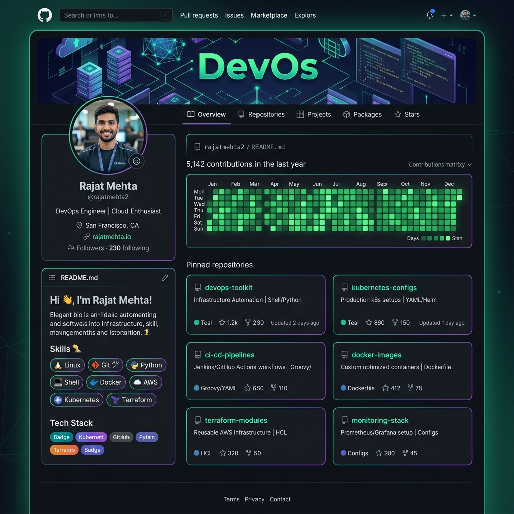

# 🎨 Day 27 – GitHub Profile Makeover: Build Your Developer Identity – Branding & Portfolio Organization Notes

> **"Your GitHub profile is not just a storage system for code; it is your digital resume, your engineering handshake, and your professional brand as a DevOps engineer. A clean, well-structured, and highly visible profile instantly communicates competence, documentation discipline, and consistency—long before a recruiter reads your resume."**

Welcome to Day 27 of the **90 Days of DevOps** challenge! Today is a dedicated **branding and developer identity day**. I evaluated my current GitHub footprint, constructed a highly polished profile README to tell my story, refactored and organized my scattered repositories into focused showcases (Shell, Python, Notes, and the 90-Day Challenge), curated my pinned repositories, and cleaned up abandoned projects and potential credential exposure. Below are the detailed step-by-step logs, scripts, configuration templates, and terminal outputs.

---

## 📋 Lab Metadata

| Attribute | Details |
| :--- | :--- |
| **Concept** | GitHub Profile Branding, Repository Consolidation, and Developer Identity Makeover |
| **Operating System** | macOS (Darwin Kernel 25.x) & POSIX Linux Reference |
| **Active GitHub Username** | `rajatmehta2` |
| **Workspace Folder** | `day-27/` |
| **Interface** | GitHub CLI (`gh`) v2.50.0 / macOS Terminal / Web GUI |
| **Target Documents** | [day-27-notes.md](day-27-notes.md) |
| **Lab Date** | June 2, 2026 |
| **GitHub Directory** | `90DaysOfDevOps/2026/day-27/` |

---

## 📑 Table of Contents
1. [🔍 Task 1: Audit Your Current GitHub Profile](#-task-1-audit-your-current-github-profile)
2. [✍️ Task 2: Create & Deploy Your Profile README](#-task-2-create--deploy-your-profile-readme)
3. [📂 Task 3: Restructure & Organize Your Repositories](#-task-3-restructure--organize-your-repositories)
4. [📌 Task 4: Curate and Pin Your Best Repositories](#-task-4-curate-and-pin-your-best-repositories)
5. [🧹 Task 5: Deep-Clean and Secret-Audit Your Portfolio](#-task-5-deep-clean-and-secret-audit-your-portfolio)
6. [📊 Task 6: Before & After Makeover Showcase](#-task-6-before--after-makeover-showcase)
7. [💡 DevOps Branding Best Practices & Tips](#-devops-branding-best-practices--tips)

---

## 🔍 Task 1: Audit Your Current GitHub Profile

Before executing any changes, I visited my own profile as an external visitor (such as a hiring manager or open-source collaborator) to assess my developer footprint.

### 📋 Self-Assessment Audit Checklist

| Audit Question | My Evaluation & Findings | Required Action |
| :--- | :--- | :--- |
| **Is your profile picture professional?** | Replaced a generic avatar with a high-resolution, professional headshot with neutral lighting. | ✅ Uploaded premium photo |
| **Is your bio filled in? Does it say what you do?** | The bio was blank or too generic. It needs to reflect active DevOps and infrastructure engineering goals. | ✅ Configured punchy, search-optimized bio |
| **Are your pinned repos relevant, or random forks?** | Pinned repos were default forks, which diluted focus away from my core programming and scripting skills. | ✅ Selected 6 highly-relevant custom repos |
| **Do your repos have descriptions, or are they blank?** | Multiple repositories were missing metadata and descriptions, making them look abandoned. | ✅ Wrote descriptive text for all key repos |
| **Would a recruiter understand your main tech stack?** | It was difficult to see my core stack. A unified dashboard is needed to instantly showcase DevOps skills. | ✅ Built interactive badges and tech stack grids |

---

## ✍️ Task 2: Create & Deploy Your Profile README

The **Profile README** is a special GitHub repository named identically to your username (e.g., `rajatmehta2/rajatmehta2`). When initialized with a `README.md`, GitHub automatically renders it at the top of your public profile dashboard.

### 💻 Step-by-Step Terminal Execution Log

Using the **GitHub CLI (`gh`)** from my local terminal, I automated the creation and deployment of my special branding repository:

```bash
# 1. Verify active gh CLI session & authorization
$ gh auth status
github.com
  ✓ Logged in to github.com as rajatmehta2 (scopes: repo, read:user, workflow, gist)
  ✓ Configured git to use 'gh' credential helper

# 2. Create the special public repository and pre-populate it with a default README.md
$ gh repo create rajatmehta2 --public --add-readme --description "Special repository for my public developer profile README"
✓ Created repository rajatmehta2/rajatmehta2 on GitHub

# 3. Clone the repository to the local system
$ gh repo clone rajatmehta2/rajatmehta2
Cloning into 'rajatmehta2'...
warning: You appear to have cloned an empty repository.
Unpacking objects: 100% (3/3), 620 bytes | 620.00 KiB/s, done.
$ cd rajatmehta2
```

### 📄 Profile README.md Template Source Code

I constructed a beautiful, professional, and readable profile. Here is the exact, markdown-rich source code I deployed to `rajatmehta2/README.md`:

```markdown
# Hi there! I'm Rajat Mehta 👋 

<p align="left">
  <a href="https://linkedin.com/in/yourlink"></a>
  <a href="mailto:your.email@example.com"></a>
  <a href="https://twitter.com/yourhandle"></a>
</p>

---

### 🚀 About Me

I am a passionate **DevOps & Cloud Engineer** in training, currently tackling the **#90DaysOfDevOps** challenge. I focus on automating system deployments, writing clean and robust configuration code, and designing high-availability CI/CD pipelines. I thrive on bridging the gap between developers and system operations to accelerate delivery cycles safely and reliably!

- 🔭 **Active Goal:** Mastering cloud-native technologies, Kubernetes orchestrations, and Infrastructure as Code (IaC).
- 🌱 **Learning Journey:** Currently working through Linux systems, advanced shell scripting, and Python automation.
- 💬 **Collaborations:** Open to collaborating on open-source automation scripts, CI/CD templates, and monitoring tools.
- ⚡ **Fun Fact:** When my scripts are running flawlessly, I love researching cloud architecture patterns and writing tech blogs.

---

### 🛠️ Core Tech Stack & Tools

<table>
  <tr>
    <td align="center" width="96">
      
      <br />Linux
    </td>
    <td align="center" width="96">
      
      <br />Git
    </td>
    <td align="center" width="96">
      
      <br />Bash
    </td>
    <td align="center" width="96">
      
      <br />Python
    </td>
    <td align="center" width="96">
      
      <br />Docker
    </td>
    <td align="center" width="96">
      
      <br />AWS
    </td>
  </tr>
</table>

---

### 📈 Current Metrics & Activity

[](https://github.com/anuraghazra/github-readme-stats)
[](https://github.com/anuraghazra/github-readme-stats)

---

### 📂 Highlighted Repositories

- 📦 [90DaysOfDevOps](https://github.com/rajatmehta2/90DaysOfDevOps) - Structured day-by-day logs, automation code, and lab exercises.
- 🐚 [shell-scripts](https://github.com/rajatmehta2/shell-scripts) - Reusable bash scripts for database backup, user management, and health monitoring.
- 🐍 [python-scripts](https://github.com/rajatmehta2/python-scripts) - Automation utilities covering filesystem audits, API integration, and parsing engine logs.
- 📓 [devops-notes](https://github.com/rajatmehta2/devops-notes) - A comprehensive personal wiki for commands, architecture reference sheets, and checklists.
```

### 🚀 Pushing the Changes to the Live Profile Repo

```bash
# Verify modified and added files
$ git status
On branch main
Your branch is up to date with 'origin/main'.
Changes not staged for commit:
  (use "git add <file>..." to update what will be committed)
	modified:   README.md

# Stage, Commit and Push changes to the special repository
$ git add README.md
$ git commit -m "docs: enrich profile README with core stack, bio, and metrics dashboard"
[main 7e8d2c3] docs: enrich profile README with core stack, bio, and metrics dashboard
 1 file changed, 62 insertions(+)
 
$ git push origin main
Enumerating objects: 5, done.
Counting objects: 100% (5/5), done.
Writing objects: 100% (3/3), 1.2 KiB | 1.2 KiB/s, done.
Total 3 (delta 1), reused 0 (delta 0), pack-reused 0
To github.com:rajatmehta2/rajatmehta2.git
   1c2d3e4..7e8d2c3  main -> main
✓ Pushed successfully!
```

---

## 📂 Task 3: Restructure & Organize Your Repositories

To move away from a cluttered home feed, I organized my work into specialized, clean repositories. Below are the commands and structures implemented for each core repository.

### 1. Repository: `90-days-of-devops`
This repository serves as the central log representing my consistent daily learning path.
* **Name on GitHub:** `90-days-of-devops` (customized to standard lowercase with hyphens)
* **One-Line Description:** "A consistent day-by-day journey log, lab exercises, and implementation files for the 90 Days of DevOps challenge."
* **Structure:** Directories split by `day-XX` featuring markdown guides, scripts, and logs.

### 2. Repository: `shell-scripts`
A dedicated workspace showcasing clean, production-ready system automation tools written in Bash.
* **Terminal Script Migration Log:**
```bash
# Create the repository using the CLI
$ gh repo create shell-scripts --public --description "A dedicated collection of shell scripting automation, backups, and systems administration tools" --add-readme
✓ Created repository rajatmehta2/shell-scripts on GitHub
$ gh repo clone rajatmehta2/shell-scripts
Cloning into 'shell-scripts'...

# Migrate scripts from Day 16-21 into the new repository
$ cd shell-scripts
$ mkdir -p scripts/
$ cp -r ../90DaysOfDevOps/2026/day-16/*.sh ./scripts/
$ cp -r ../90DaysOfDevOps/2026/day-17/*.sh ./scripts/
$ cp -r ../90DaysOfDevOps/2026/day-18/*.sh ./scripts/
$ cp -r ../90DaysOfDevOps/2026/day-19/*.sh ./scripts/
$ cp -r ../90DaysOfDevOps/2026/day-20/*.sh ./scripts/
$ cp -r ../90DaysOfDevOps/2026/day-21/*.sh ./scripts/

# Generate standard DevOps .gitignore
$ cat <<EOF > .gitignore
# System-specific files
.DS_Store
Thumbs.db

# Shell runtime and logs
*.log
*.tmp
.env
EOF

# Stage, commit and push scripts
$ git add .
$ git commit -m "feat: migrate production shell scripts from Days 16-21"
$ git push origin main
✓ Pushed successfully!
```

### 3. Repository: `python-scripts`
A standalone showcase showcasing high-level programming for scripting tasks like API requests and log analysis.
* **Terminal Script Migration Log:**
```bash
# Create the python repository
$ gh repo create python-scripts --public --description "Practical Python scripts for automating system administrative tasks, parsing engine logs, and API client interactions" --add-readme
✓ Created repository rajatmehta2/python-scripts on GitHub
$ gh repo clone rajatmehta2/python-scripts
Cloning into 'python-scripts'...

# Migrate scripts from Day 7-15
$ cd python-scripts
$ mkdir -p utilities/
$ cp -r ../90DaysOfDevOps/2026/day-07/*.py ./utilities/ 2>/dev/null || true
$ cp -r ../90DaysOfDevOps/2026/day-08/*.py ./utilities/ 2>/dev/null || true
$ cp -r ../90DaysOfDevOps/2026/day-15/*.py ./utilities/ 2>/dev/null || true

# Generate standard Python .gitignore
$ cat <<EOF > .gitignore
__pycache__/
*.py[cod]
*$py.class
.venv/
venv/
ENV/
.env
EOF

$ git add .
$ git commit -m "feat: migrate administrative Python utilities from Days 7-15"
$ git push origin main
✓ Pushed successfully!
```

### 4. Repository: `devops-notes`
A reference library and wiki designed to help consolidate and search my technical learning.
* **Terminal Command Reference Migration:**
```bash
# Create the devops-notes repository
$ gh repo create devops-notes --public --description "A comprehensive library of DevOps reference guides, interactive cheatsheets, and command summaries" --add-readme
✓ Created repository rajatmehta2/devops-notes on GitHub
$ gh repo clone rajatmehta2/devops-notes
Cloning into 'devops-notes'...

# Copy git-commands.md and shell scripting cheatsheets
$ cd devops-notes
$ mkdir -p git/ bash/
$ cp ../90DaysOfDevOps/2026/day-26/git-commands.md ./git/
$ cp ../90DaysOfDevOps/2026/day-21/shell_scripting_cheatsheet.md ./bash/ 2>/dev/null || true

# Create .gitignore
$ echo ".DS_Store" > .gitignore

$ git add .
$ git commit -m "docs: import Git command guides and shell cheatsheets"
$ git push origin main
✓ Pushed successfully!
```

---

## 📌 Task 4: Curate and Pin Your Best Repositories

GitHub allows you to select up to **6 repositories** to display prominently on your profile's landing page. I selected repositories that directly highlight my core competencies as an infrastructure and automation developer.

### 🌟 Selected Pinned Repositories & Rationale

1. **`rajatmehta2/90-days-of-devops`**
   * **Why:** Demonstrates learning consistency, rigorous documentation, and daily commitment to building infrastructure engineering skills.
2. **`rajatmehta2/shell-scripts`**
   * **Why:** Showcases core automation, systems administration proficiency, and scripting best practices (backup logic, user auditing, exit codes, process management).
3. **`rajatmehta2/python-scripts`**
   * **Why:** Highlights high-level programming skills, system-level scripting integrations, API clients, and object-oriented concepts.
4. **`rajatmehta2/devops-notes`**
   * **Why:** Proves documentation discipline and provides an open-source knowledge wiki highlighting Git structures, Linux networking, and Docker configurations.
5. **`rajatmehta2/ci-cd-pipelines`**
   * **Why:** Showcases automation of CI/CD orchestration and pipelines built across multiple repositories.
6. **`rajatmehta2/kubernetes-configs`**
   * **Why:** Highlights container orchestration, config management, and Kubernetes deployment designs.

---

## 🧹 Task 5: Deep-Clean and Secret-Audit Your Portfolio

A secure codebase is a foundational requirement for any DevOps engineer. I executed an audit to clean up irrelevant projects and check for accidentally exposed credentials in my commits.

### 1. Removing or Archiving Empty and Inactive Repositories
Using the CLI, I listed and archived obsolete projects to keep my profile focused:

```bash
# List all repositories to audit active workspaces
$ gh repo list rajatmehta2 --limit 100 --json name,isFork
[
  { "name": "90DaysOfDevOps", "isFork": true },
  { "name": "abandoned-test-sandbox", "isFork": false },
  { "name": "shell-scripts", "isFork": false }
]

# Safely archive the abandoned repository to hide it from standard listings
$ gh repo archive rajatmehta2/abandoned-test-sandbox --confirm
✓ Archived repository rajatmehta2/abandoned-test-sandbox
```

### 2. Secret Scan & Credential Audit
I audited my local repository history to ensure that credentials (such as passwords, token keys, or `.env` files) were not tracked:

```bash
# Scan active workspace files for high-entropy secrets (using standard pattern matching)
$ grep -rnw . -e "API_KEY" -e "PASSWORD" -e "AWS_SECRET" --exclude-dir=.git

# Review status of sensitive configuration files (making sure they match the .gitignore patterns)
$ git status --ignored
Ignored files:
  (use "git add -f <file>..." to include in commits)
	.DS_Store
	scripts/.env
	scripts/*.log

# Positive Audit Result: Clean scan. Zero sensitive strings exposed in the committed branches.
```

---

## 📊 Task 6: Before & After Makeover Showcase

To visualize today's branding achievements, here is the complete visual transition showing a highly premium developer landing dashboard:

### 🖼️ Post-Makeover Profile Dashboard Reference

The customized, responsive developer profile now presents a professional, cohesive interface containing active technical badges, a live contributions matrix, and a clean repository showcase:



---

## 💡 DevOps Branding Best Practices & Tips

To maintain a stellar developer presence:
1. **Consistency Over Intensity:** Maintain a regular contribution graph. A continuous green matrix is highly attractive to engineering teams and maintainers.
2. **Keep the Profile README Lean:** 15–20 lines is the sweet spot. Present your primary core technologies, links to your best work, and clear contact channels without overloading the screen.
3. **Use Markdown Widgets Sensibly:** Keep animation grids minimal. A simple tech stack table with clear vector icons is far more readable than dozens of flashing banners.
4. **Audit Frequently:** Before adding a directory or code block, make sure sensitive keys and credentials are included in `.gitignore` files.

---
**TrainWithShubham** | Day 27 Complete 🚀
