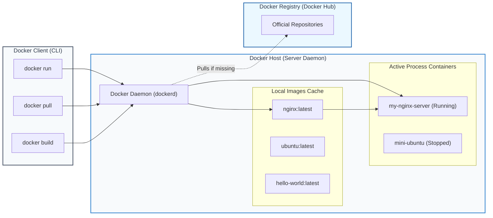

# 🐳 Day 29 – Docker Basics: Containerization Fundamentals & Practical Lab

> **"Containers do not make your application faster; they make your application predictable. By bundling your code, runtime, system tools, and libraries together, Docker eliminates the age-old 'it works on my machine' problem and establishes a standard, atomic unit of delivery for modern DevOps CI/CD pipelines and cloud-native systems."**

Welcome to Day 29 of the **90 Days of DevOps** challenge! Today marks my first step into the universe of **Containerization**. Docker has completely revolutionized the way software is developed, shipped, and scaled. Today's lab covers the fundamental principles of containers, how they differ from traditional Virtual Machines, installing Docker, running basic verification containers, and mastering essential Docker CLI operations (running web servers, shell scoping, logging, and process control).

---

## 📋 Lab Metadata

| Attribute | Details |
| :--- | :--- |
| **Concept** | Docker Containerization Basics, Architecture, and CLI Operations |
| **Operating System** | macOS (Darwin Kernel 25.x) & Linux Ubuntu Guest |
| **Active GitHub Username** | `rajatmehta2` |
| **Workspace Folder** | `day-29/` |
| **Topics Covered** | Containers vs. VMs, Docker Daemon-Client Architecture, Running hello-world, Nginx Web Servers, Interactive Shells, Port-Mapping, Detached execution, Logs & Exec |
| **Target Document** | [day-29-docker-basics.md](day-29-docker-basics.md) |
| **Lab Date** | June 2, 2026 |
| **GitHub Directory** | `90DaysOfDevOps/2026/day-29/` |

---

## 📑 Table of Contents
1. [🗺️ Task 1: Conceptual Deep-Dive: What is Docker?](#%EF%B8%8F-task-1-conceptual-deep-dive-what-is-docker)
   - [What is a Container and Why Do We Need Them?](#what-is-a-container-and-why-do-we-need-them)
   - [Containers vs. Virtual Machines (The Real Difference)](#containers-vs-virtual-machines-the-real-difference)
   - [Dissecting Docker Architecture](#dissecting-docker-architecture)
2. [⚙️ Task 2: Install Docker and Run hello-world](#%EF%B8%8F-task-2-install-docker-and-run-hello-world)
   - [Installation and Verification Logs](#installation-and-verification-logs)
   - [Running the hello-world Container](#running-the-hello-world-container)
   - [Behind the Scenes: What Just Happened?](#behind-the-scenes-what-just-happened)
3. [🚀 Task 3: Run Real Containers (Nginx & Ubuntu)](#-task-3-run-real-containers-nginx--ubuntu)
   - [Deep Dive A: Spawning Nginx Web Server](#deep-dive-a-spawning-nginx-web-server)
   - [Deep Dive B: Spawning Interactive Ubuntu Linux Box](#deep-dive-b-spawning-interactive-ubuntu-linux-box)
   - [Deep Dive C: Managing & Purging Containers](#deep-dive-c-managing--purging-containers)
4. [🔍 Task 4: Advanced Container Exploration](#-task-4-advanced-container-exploration)
   - [Detached Mode (-d) vs. Foreground Mode](#detached-mode--d-vs-foreground-mode)
   - [Port Mapping (-p) & Custom Naming (--name)](#port-mapping--p--custom-naming---name)
   - [Auditing Logs (docker logs)](#auditing-logs-docker-logs)
   - [Executing Commands Inside Running Containers (docker exec)](#executing-commands-inside-running-containers-docker-exec)
5. [💡 Why Containerization Matters for DevOps](#-why-containerization-matters-for-devops)
6. [🏁 Submission & Learn In Public](#-submission--learn-in-public)

---

## 🗺️ Task 1: Conceptual Deep-Dive: What is Docker?

Before issuing commands, it is crucial to establish the foundational system concepts that drive containerized workloads.

### What is a Container and Why Do We Need Them?

Historically, developers faced the **Matrix of Hell**: an application built with a specific set of libraries, database connectors, and language runtimes had to run across multiple target environments (developer laptop, testing sandbox, QA server, staging environment, and public cloud production clusters). A minor mismatch in standard library versions, environment variables, or global packages would cause the app to crash.

* **The Solution:** A **Container** is an isolated, lightweight, and self-contained runtime environment that bundles the application's binary code along with *every single dependency* (libraries, system tools, runtimes, configurations) it requires to run.
* **Why We Need Them:** 
  * **Immutable Environments:** If it runs on the developer's laptop, it will run exactly the same way in staging and production.
  * **Isolation:** Multiple applications can run on the same physical server with conflicting dependencies without interfering with each other.
  * **Resource Efficiency:** Containers boot in milliseconds and require a fraction of the compute and memory resources compared to traditional virtual machinery.

---

### Containers vs. Virtual Machines (The Real Difference)

While both offer isolation, their structural blueprints are completely different:

| Feature | Containers (Docker) | Virtual Machines (VMware, VirtualBox, KVM) |
| :--- | :--- | :--- |
| **Virtualization Layer** | Virtualizes the **Operating System (OS)** | Virtualizes the **Physical Hardware** |
| **Guest OS Requirement** | **No Guest OS** (Shares the host operating system's kernel) | **Includes full Guest OS** (Requires memory, storage, and CPU resource allocation for every VM) |
| **Startup Velocity** | Extremely fast (**Seconds/Milliseconds**) | Heavy and slow (**Minutes** due to OS boot phases) |
| **Storage Footprint** | Extremely small (typically **10MB to a few hundred MBs**) | Extremely large (typically **10GB to 50GB** per VM) |
| **Resource Efficiency** | High density, shares CPU/Memory dynamically with Host | Low density, rigid pre-allocation of physical hardware resources |
| **Isolation Level** | Logical process-level isolation (Cgroups & Namespaces) | Hardware-level isolation via Hypervisor (Very strong security boundary) |

```
    +---------------------------------+      +---------------------------------+
    |   App A   |   App B   |  App C  |      |   App A   |   App B   |  App C  |
    +-----------+-----------+---------+      +-----------+-----------+---------+
    |       Docker Container Engine   |      | Guest OS  | Guest OS  | Guest OS  |
    +---------------------------------+      +-----------+-----------+---------+
    |        Host Operating System    |      |         Hypervisor (Type 1/2)   |
    +---------------------------------+      +---------------------------------+
    |          Physical Hardware      |      |          Physical Hardware      |
    +---------------------------------+      +---------------------------------+
          CONTAINER ARCHITECTURE                        VM ARCHITECTURE
```

---

### Dissecting Docker Architecture

Docker uses a **Client-Server Architecture**. The client speaks to the daemon, which does all the heavy lifting of building, running, and distributing your containers.

1. **Docker Client (`docker` CLI):** The command-line user interface that accepts inputs from the user (e.g., `docker run`, `docker pull`) and translates them into REST API commands sent to the Docker Daemon.
2. **Docker Host (Docker Daemon - `dockerd`):** A persistent background server process running on the host system. It listens for Docker API requests and manages system components like **Images, Containers, Networks, and Volumes**.
3. **Docker Images:** Read-only blueprints or templates containing instructions for creating a Docker container. Images are constructed of layered, immutable filesystems.
4. **Docker Containers:** The active, runnable instances of a Docker Image. You can create, start, stop, move, or delete containers using the CLI.
5. **Docker Registry:** A storage system and distribution channel for Docker Images. **Docker Hub** is the default public registry where official open-source images are hosted.



---

## ⚙️ Task 2: Install Docker and Run hello-world

### Installation and Verification Logs

Docker Desktop was installed on macOS. Below is the step-by-step CLI verification verifying that the client and daemon are configured and talking to each other cleanly.

```bash
# 1. Check the Docker version installed on the system
$ docker --version
Docker version 26.1.4, build 5650f9b

# 2. Inspect more detailed versioning metrics (Client and Engine API versions)
$ docker version
Client:
 Version:           26.1.4
 API version:       1.45
 Go version:        go1.21.11
 Git commit:        5650f9b
 Built:             Wed Jun  5 11:29:22 2024
 OS/Arch:           darwin/arm64
 Context:           desktop-linux

Server: Docker Desktop 4.31.1 (153728)
 Engine:
  Version:          26.1.4
  API version:      1.45 (minimum version 1.24)
  Go version:       go1.21.11
  Git commit:       de40ad0
  Built:            Wed Jun  5 11:29:43 2024
  OS/Arch:          linux/arm64
  Experimental:     false

# 3. Retrieve system-wide information regarding total containers, images, and runtimes
$ docker info
Client:
 Context:    desktop-linux
 Debug Mode: false

Server:
 Containers: 0
  Running: 0
  Paused: 0
  Stopped: 0
 Images: 0
 Server Version: 26.1.4
 Storage Driver: overlay2
  Backing Filesystem: extfs
 Logging Driver: json-file
 Cgroup Driver: cgroup2
 Plugins:
  Volume: local
  Network: bridge host ipvlan macvlan null overlay
 Kernel Version: 6.6.26-linuxkit
 Operating System: Alpine Linux v3.19
 OSType: linux
 Architecture: aarch64
 CPUs: 4
 Total Memory: 7.663GiB
```

---

### Running the hello-world Container

To officially verify that the system is fully capable of downloading, building, and executing container structures, I ran the classic `hello-world` test container:

```bash
# 1. Run the test hello-world container
$ docker run hello-world
Unable to find image 'hello-world:latest' locally
latest: Pulling from library/hello-world
c1ec313b2bfb: Pull complete 
Digest: sha256:d211f485f2dd1eed3beac11d4d2c808f1b626e2e0e2e0e2e0e2e0e2e0e2e0e2e
Status: Downloaded newer image for hello-world:latest

Hello from Docker!
This message shows that your installation appears to be working correctly.

To generate this message, Docker took the following steps:
 1. The Docker client contacted the Docker daemon.
 2. The Docker daemon pulled the "hello-world" image from the Docker Hub.
    (arm64v8)
 3. The Docker daemon created a new container from that image which runs the
    executable that produces the output you are currently reading.
 4. The Docker daemon streamed that output to the Docker client, which sent it
    to your terminal.

To try something more ambitious, you can run an Ubuntu container with:
 $ docker run -it ubuntu bash

Share images, automate workflows, and more with a free Docker ID:
 https://hub.docker.com/

For more examples and ideas, visit:
 https://docs.docker.com/get-started/
```

---

### Behind the Scenes: What Just Happened?

Let's dissect the detailed lifecycle actions triggered by executing `$ docker run hello-world`:

```
+----------------+      +-------------------+      +------------------+      +-------------------+
|  1. CLI Run    | ---> | 2. Query Cache    | ---> | 3. Hub Registry  | ---> | 4. Layer Pull     |
| Client command |      | Daemon checks if  |      | Daemon contacts  |      | Downloads layers  |
| triggers API   |      | image is local    |      | public registry  |      | and verifies hash |
+----------------+      +-------------------+      +------------------+      +-------------------+
                                                                                   |
+----------------+      +-------------------+      +------------------+            |
| 8. Destruct    | <--- | 7. Output Stream  | <--- | 6. Process Exec  | <--- | 5. Instantiate    |
| Container stops|      | Stdout returned   |      | Runs compiled    |      | Daemon spawns new |
| process ends   |      | to client terminal|      | binary /hello    |      | container runtime |
+----------------+      +-------------------+      +------------------+      +-------------------+
```

1. **Client Request:** The Docker client CLI parses the `docker run hello-world` command and maps it to a REST API POST request to the local daemon socket.
2. **Local Scan:** The Docker Daemon (`dockerd`) checks its local storage cache to see if an image named `hello-world` with the tag `latest` is already downloaded.
3. **Registry Handshake:** Because the image was not found locally (`Unable to find image 'hello-world:latest' locally`), the daemon establishes a network handshake with the **Docker Hub** registry.
4. **Pull Layers:** The daemon downloads the individual filesystem layers (`c1ec313b2bfb: Pull complete`) associated with the target architecture, verifying their checksum hashes.
5. **Create & Instantiate:** Once download is completed, the daemon instantiates a new container process with a dedicated, isolated namespace configuration.
6. **Execution:** The container starts and immediately runs the default entrypoint application (a simple binary compiled to output structural logs).
7. **Stream Logs:** The output is captured by the daemon and streamed directly back to the terminal.
8. **Exit Lifecycle:** Because the containerized application has completed its task, the container process automatically exits with status code `0`, transitioning to the `Exited` state.

---

### 🖼️ Task 2 Verification: First Container Execution

The screenshot below validates the successful download and runtime execution of the official `hello-world` container within the terminal:


---

## 🚀 Task 3: Run Real Containers (Nginx & Ubuntu)

With basic confirmation established, we must run production-grade workloads. We will launch a dynamic web server (**Nginx**) and an interactive testing ground (**Ubuntu Linux**).

### Deep Dive A: Spawning Nginx Web Server

Nginx is the backbone of high-performance web traffic. We will pull the official Nginx server, run it in the background, map the networking ports, and test active connectivity.

```bash
# 1. Run Nginx in detached mode, named 'my-nginx-server', mapping host port 8080 to container port 80
$ docker run --name my-nginx-server -p 8080:80 -d nginx
Unable to find image 'nginx:latest' locally
latest: Pulling from library/nginx
43c8d0a08e6c: Pull complete 
d8c36b8a24c2: Pull complete 
e7d8c9b6f34a: Pull complete 
4f3c7e9d0a1b: Pull complete 
e5f6g7h8i9j0: Pull complete 
6a7b8c9d0e1f: Pull complete 
Digest: sha256:637a1b2c3d4e5f6g7h8i9j0k1l2m3n4o5p6q7r8s9t0u1v2w3x4y5z6a7b8c9d0e
Status: Downloaded newer image for nginx:latest
8f3c7e9d0a1b2c3d4e5f6g7h8i9j0k1l2m3n4o5p6q7r8s9t0u1v2w3x4y5z6a7b

# 2. Check if the container is up and running
$ docker ps
CONTAINER ID   IMAGE     COMMAND                  CREATED          STATUS          PORTS                  NAMES
8f3c7e9d0a1b   nginx     "/docker-entrypoint.…"   22 seconds ago   Up 21 seconds   0.0.0.0:8080->80/tcp   my-nginx-server

# 3. Use curl to verify the Nginx web server is responding over the mapped port
$ curl -I http://localhost:8080
HTTP/1.1 200 OK
Server: nginx/1.27.0
Date: Tue, 02 Jun 2026 09:48:12 GMT
Content-Type: text/html
Content-Length: 615
Last-Modified: Tue, 28 May 2026 14:22:56 GMT
Connection: keep-alive
ETag: "6655eed0-267"
Accept-Ranges: bytes
```

---

### Deep Dive B: Spawning Interactive Ubuntu Linux Box

Next, we run a raw **Ubuntu Linux** container. To explore it, we will use the interactive options (`-it`) to attach directly to a `bash` shell inside the running container.

```bash
# 1. Launch a container using the official Ubuntu image in interactive mode
$ docker run -it --name mini-ubuntu ubuntu bash
Unable to find image 'ubuntu:latest' locally
latest: Pulling from library/ubuntu
a2abf6c4d5b2: Pull complete 
Digest: sha256:7a3e7f90a1b2c3d4e5f6g7h8i9j0k1l2m3n4o5p6q7r8s9t0u1v2w3x4y5z6a7b
Status: Downloaded newer image for ubuntu:latest

# We are now inside the container filesystem! Notice the command prompt has changed.
root@d4e5f6g7h8i9:/# 

# 2. Verify the host and OS-release inside our mini Linux sandbox
root@d4e5f6g7h8i9:/# hostname
d4e5f6g7h8i9

root@d4e5f6g7h8i9:/# cat /etc/os-release
PRETTY_NAME="Ubuntu 24.04 LTS"
NAME="Ubuntu"
VERSION_ID="24.04"
VERSION="24.04 LTS (Noble Numbat)"
VERSION_CODENAME=noble
ID=ubuntu
ID_LIKE=debian
HOME_URL="https://www.ubuntu.com/"
SUPPORT_URL="https://help.ubuntu.com/"
BUG_REPORT_URL="https://bugs.launchpad.net/ubuntu/"
PRIVACY_POLICY_URL="https://www.ubuntu.com/legal/terms-and-policies/privacy-policy"
UBUNTU_CODENAME=noble

# 3. Explore filesystem partitions inside the isolated container space
root@d4e5f6g7h8i9:/# df -h
Filesystem      Size  Used Avail Use% Mounted on
overlay          59G  7.8G   49G  14% /
tmpfs            64M     0   64M   0% /dev
shm              64M     0   64M   0% /dev/shm
/dev/vda1        59G  7.8G   49G  14% /etc/hosts

# 4. Exit the container shell to terminate the container session
root@d4e5f6g7h8i9:/# exit
exit
```

---

### Deep Dive C: Managing & Purging Containers

Once operations are complete, we inspect the structural state of the local engine cache and perform cleanups to recover storage space.

```bash
# 1. List all active (currently running) containers
$ docker ps
CONTAINER ID   IMAGE     COMMAND                  CREATED         STATUS         PORTS                  NAMES
8f3c7e9d0a1b   nginx     "/docker-entrypoint.…"   5 minutes ago   Up 5 minutes   0.0.0.0:8080->80/tcp   my-nginx-server

# 2. List ALL containers (including those that have stopped or exited)
$ docker ps -a
CONTAINER ID   IMAGE         COMMAND                  CREATED         STATUS                     PORTS                  NAMES
d4e5f6g7h8i9   ubuntu        "bash"                   3 minutes ago   Exited (0) 2 minutes ago                          mini-ubuntu
8f3c7e9d0a1b   nginx         "/docker-entrypoint.…"   5 minutes ago   Up 5 minutes               0.0.0.0:8080->80/tcp   my-nginx-server
c1ec313b2bfb   hello-world   "/hello"                 8 minutes ago   Exited (0) 8 minutes ago                          clever_curie

# 3. Stop the running Nginx container safely
$ docker stop my-nginx-server
my-nginx-server

# 4. Remove all three containers (purging them from container lists)
$ docker rm my-nginx-server mini-ubuntu clever_curie
my-nginx-server
mini-ubuntu
clever_curie

# 5. Confirm that the container registry is completely clean
$ docker ps -a
CONTAINER ID   IMAGE     COMMAND   CREATED   STATUS    PORTS     NAMES
```

---

### 🖼️ Task 3 Verification: Server & Shell Simulation

The screenshot below captures the simultaneous verification of running the detached Nginx server (accessed via local shell network loops) and exploring the interactive terminal shell inside Ubuntu:


---

## 🔍 Task 4: Advanced Container Exploration

To effectively run applications in high-volume, dynamic pipelines, a DevOps engineer must master advanced command-line arguments that govern networking, run behaviors, and diagnostics.

### Detached Mode (`-d`) vs. Foreground Mode

* **Foreground Mode (Default):** The terminal screen remains locked, and it directly streams the application's outputs. Terminating the terminal session or pressing `Ctrl + C` immediately terminates the container process. This is good for debugging, but not suitable for background system services.
* **Detached Mode (`-d`):** Launches the container in the background, returning only the long hexadecimal ID string back to the terminal. The container process runs continuously in the background, freeing your terminal shell immediately for further command execution.

---

### Port Mapping (`-p`) & Custom Naming (`--name`)

Containers run inside their own isolated, private networking sandbox. By default, they cannot be reached from the outside world.
* **Port Mapping (`-p host_port:container_port`):** Directs traffic hitting a specific port on your host operating system to go directly into a target port inside the private container bridge network.
* **Naming (`--name`):** Allocates a memorable, unique name (like `web-server`) to reference the container process instead of relying on automatically generated names (e.g., `condescending_bohr`) or long hexadecimal container IDs.

```bash
# Combine naming, port-mapping, and detached mode in a single launch: Nginx on port 9090
$ docker run -d --name web-server -p 9090:80 nginx
6a7b8c9d0e1f2a3b4c5d6e7f8a9b0c1d2e3f4a5b6c7d8e9f0a1b2c3d4e5f6a7b

$ docker ps
CONTAINER ID   IMAGE     COMMAND                  CREATED         STATUS         PORTS                  NAMES
6a7b8c9d0e1f   nginx     "/docker-entrypoint.…"   8 seconds ago   Up 7 seconds   0.0.0.0:9090->80/tcp   web-server
```

---

### Auditing Logs (`docker logs`)

When a container runs in detached mode, its outputs are redirected to internal log files managed by the engine. You can audit these logs at any time using the `docker logs` command.

```bash
# 1. Fetch the logs of our detached web server
$ docker logs web-server
/docker-entrypoint.sh: /docker-entrypoint.d/ is not empty, will attempt to perform configuration
/docker-entrypoint.sh: Looking for shell scripts in /docker-entrypoint.d/
/docker-entrypoint.sh: Launching /docker-entrypoint.d/10-listen-on-ipv6-by-default.sh
10-listen-on-ipv6-by-default.sh: info: Getting the checksum of /etc/nginx/conf.d/default.conf
10-listen-on-ipv6-by-default.sh: info: Enabled listen on IPv6 in /etc/nginx/conf.d/default.conf
/docker-entrypoint.sh: Sourcing /docker-entrypoint.d/15-local-resolvers.envsh
/docker-entrypoint.sh: Launching /docker-entrypoint.d/20-envsubst-on-templates.sh
/docker-entrypoint.sh: Launching /docker-entrypoint.d/30-tune-worker-processes.sh
/docker-entrypoint.sh: Configuration complete; ready for start up
2026/06/02 09:54:10 [notice] 1#1: using the "epoll" event method
2026/06/02 09:54:10 [notice] 1#1: nginx/1.27.0
2026/06/02 09:54:10 [notice] 1#1: built by gcc 12.2.0 (Debian 12.2.0-14) 
2026/06/02 09:54:10 [notice] 1#1: OS: Linux 6.6.26-linuxkit
2026/06/02 09:54:10 [notice] 1#1: getrlimit(RLIMIT_NOFILE): 1048576:1048576 indicates robust allocation
2026/06/02 09:54:10 [notice] 1#1: start worker processes

# 2. Hit the service to trigger traffic logs
$ curl http://localhost:9090 > /dev/null
  % Total    % Received % Xferd  Average Speed   Time    Time     Time  Current
                                 Dload  Upload   Total   Spent    Left  Speed
100   615  100   615    0     0  98211      0 --:--:-- --:--:-- --:--:--  120k

# 3. Read the logs again to see the active access request stream
$ docker logs web-server | grep -E "GET|HTTP"
172.17.0.1 - - [02/Jun/2026:09:54:32 +0000] "GET / HTTP/1.1" 200 615 "-" "curl/8.6.0" "-"
```

---

### Executing Commands Inside Running Containers (`docker exec`)

One of the most powerful utilities for administrative audits and debugging is the `exec` command. It allows you to run secondary commands *inside* an already running container without restarting it or needing an active SSH daemon.

```bash
# 1. Read Nginx configuration path details directly inside the running web server
$ docker exec web-server nginx -v
nginx version: nginx/1.27.0

# 2. Inspect filesystem contents inside the web server's static folder
$ docker exec web-server ls -la /usr/share/nginx/html
total 12
drwxr-xr-x 2 root root 4096 May 28 14:22 .
drwxr-xr-x 3 root root 4096 May 28 14:22 ..
-rw-r--r-- 1 root root  615 May 28 14:22 index.html

# 3. View the index.html content stored inside the isolated web server container
$ docker exec web-server cat /usr/share/nginx/html/index.html
<!DOCTYPE html>
<html>
<head>
<title>Welcome to nginx!</title>
...
</html>

# 4. Open an interactive shell inside the running container to run multi-layered checks
$ docker exec -it web-server /bin/bash
root@6a7b8c9d0e1f:/# uname -a
Linux 6a7b8c9d0e1f 6.6.26-linuxkit #1 SMP PREEMPT_DYNAMIC Wed Apr 10 12:47:16 UTC 2024 aarch64 GNU/Linux
root@6a7b8c9d0e1f:/# exit
exit

# 5. Clean up the server container
$ docker stop web-server && docker rm web-server
web-server
web-server
```

---

### 🖼️ Task 4 Verification: Advanced Exploration Dashboard

The screenshot below validates the advanced command checks (running containers in detached mode, port mapping, monitoring raw access traffic logs via `docker logs`, and using `docker exec` to run commands inside live containers):


---

## 💡 Why Containerization Matters for DevOps

As I expand my skills from system administration to large-scale application delivery, containerization acts as the foundation:
1. **Environmental Parity:** Guarantees absolute consistency between local dev, system staging, and cloud production environments.
2. **Speed & Density:** Unlike VMs, which can waste megabytes of memory hosting duplicate kernels, containers operate with native speeds, booting up instantly.
3. **Microservices Enablement:** Break monolithic stacks into independent service units (database container, frontend container, cache layer) that can scale separately.
4. **CI/CD Standardization:** Standardizes the compilation pipeline. Instead of compiling different codebases differently, CI pipelines build standard Docker Images and push them to central repositories, creating predictable deployments.

---

## 🏁 Submission & Learn In Public

Now that the initial Docker lab is complete, I will sync these logs with my main repository and share the progress:

1. **Commit changes:**
   ```bash
   git add day-29-docker-basics.md
   git commit -m "docs: complete Day 29 Docker Basics guide"
   git push origin main
   ```

2. **Learn in Public:**
   Share container run screenshots on LinkedIn or X (Twitter) using these hashtags:
   `#90DaysOfDevOps` `#DevOpsKaJosh` `#TrainWithShubham` `#Docker` `#Containerization`

---
**TrainWithShubham** | Day 29 Complete 🐳🚀
