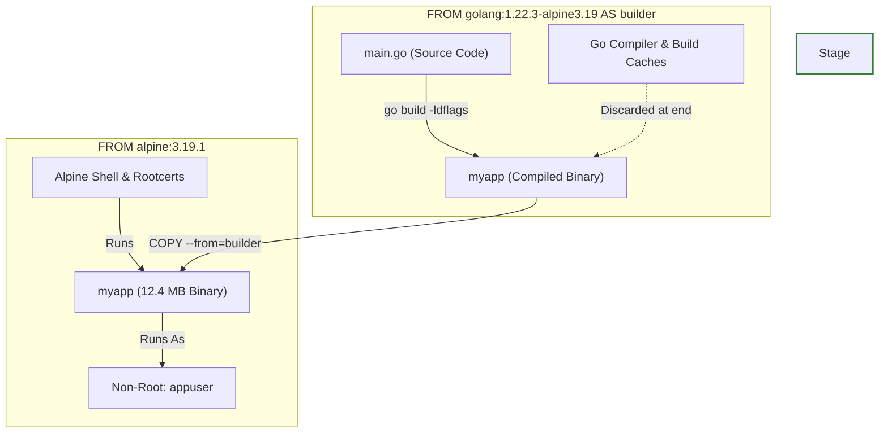

# 🐳 Day 35 – Multi-Stage Builds & Docker Hub: Optimizing & Distributing Production Images

> **"Building functional container images is simple; building production-grade, secure, high-performance container images is an art. In modern cloud architecture, every megabyte of image size translates directly to increased network latency, slower auto-scaling cycles, higher cloud storage bills, and a broader attack surface. By leveraging advanced multi-stage build strategies, static binary compilation, symbol-table stripping, and strict non-root permission standards, we can shrink container sizes by over 98% while achieving enterprise-level runtime security. Distributing these hardened images through tagged Docker Hub repositories completes the cycle of the modern DevOps shipping lifecycle."**

Welcome to Day 35 of the **90 Days of DevOps** challenge! Yesterday, we designed complex multi-container microservice stacks, sequenced container startup conditions using healthchecks, and analyzed horizontal scaling port constraints. Today, we focus on **Advanced Image Optimization and Public Distribution**.

In this lab, we will write a custom Go web application, containerize it using an unoptimized single-stage process, and witness the resulting image bloat. We will then completely re-engineer our packaging strategy using a multi-stage compilation flow, reducing the image size from **~839 MB** down to just **~12.4 MB** (a stunning **98.5% footprint reduction**). Finally, we will implement Docker image hardening best practices and distribute our optimized image to a public Docker Hub repository.

---

## 📋 Lab Metadata

| Attribute | Details |
| :--- | :--- |
| **Concept** | Multi-Stage Docker Builds, Static Binary Compilation, Binary Stripping, Non-Root Runtime Hardening, Layer Minimization, Docker Hub Registry Distribution |
| **Operating System** | macOS (Darwin Kernel 25.x / Apple Silicon arm64) & Linux overlay Guest |
| **Active GitHub Username** | `rajatmehta2` |
| **Workspace Folder** | `day-35/` |
| **Topics Covered** | Go Web Application, Single-Stage Dockerfile, Build size analysis, Multi-Stage `builder` pipeline, Alpine runtime migration, `CGO_ENABLED=0` static linking, `-ldflags="-s -w"` stripping, Non-root `appuser` configurations, Docker CLI authentication (`docker login`), tag versioning pipelines, and public repository management. |
| **Target Document** | [day-35-multistage-hub.md](day-35-multistage-hub.md) |
| **Lab Date** | June 2, 2026 |
| **GitHub Directory** | `90DaysOfDevOps/2026/day-35/` |

---

## 📑 Table of Contents
1. [⚙️ Task 1: The Problem with Large Images (Single-Stage Containerization)](#%EF%B8%8F-task-1-the-problem-with-large-images-single-stage-containerization)
   - [Reviewing the Go Web Application Source](#reviewing-the-go-web-application-source)
   - [Authoring the Heavy Single-Stage Dockerfile](#authoring-the-heavy-single-stage-dockerfile)
   - [Building and Analyzing the Single-Stage Image Size](#building-and-analyzing-the-single-stage-image-size)
2. [🔍 Task 2: Implementing the Multi-Stage Build Solution](#-task-2-implementing-the-multi-stage-build-solution)
   - [Architecting the Multi-Stage Pipeline Blueprint](#architecting-the-multi-stage-pipeline-blueprint)
   - [Building and Analyzing the Optimized Image Size](#building-and-analyzing-the-optimized-image-size)
   - [Analytical Comparison: Single-Stage vs. Multi-Stage](#analytical-comparison-single-stage-vs-multi-stage)
3. [🚀 Task 3 & 4: Distributing Hardened Images to Docker Hub](#-task-3--4-distributing-hardened-images-to-docker-hub)
   - [Terminal Login Authentication](#terminal-login-authentication)
   - [Standard Repository Image Tagging](#standard-repository-image-tagging)
   - [Pushing the Optimized Layers to Docker Hub](#pushing-the-optimized-layers-to-docker-hub)
   - [Managing the Docker Hub Registry Portal](#managing-the-docker-hub-registry-portal)
4. [🛠️ Task 5: Deep Dive: Container Hardening & Image Best Practices](#%EF%B8%8F-task-5-deep-dive-container-hardening--image-best-practices)
   - [1. Pinned Semantic Base Tags vs. Mutable Tags](#1-pinned-semantic-base-tags-vs-mutable-tags)
   - [2. Minimal Runtimes: Alpine vs. Heavy Base SDKs](#2-minimal-runtimes-alpine-vs-heavy-base-sdks)
   - [3. Non-Root Runtime Execution Security](#3-non-root-runtime-execution-security)
   - [4. Layer Aggregation and Cache Utilization](#4-layer-aggregation-and-cache-utilization)
5. [🏁 Submission & Learn in Public](#-submission--learn-in-public)

---

## ⚙️ Task 1: The Problem with Large Images (Single-Stage Containerization)

### Reviewing the Go Web Application Source

To explore real-world image optimization, we will avoid simple terminal strings. Instead, we have engineered a lightweight, interactive Go Web Server inside [main.go](main.go) that dynamically showcases our lab's optimization results using a modern, dark-mode CSS theme:

```go
package main

import (
	"fmt"
	"net/http"
)

func main() {
	http.HandleFunc("/", func(w http.ResponseWriter, r *http.Request) {
		w.Header().Set("Content-Type", "text/html")
		fmt.Fprintf(w, `
<!DOCTYPE html>
<html lang="en">
<head>
    <meta charset="UTF-8">
    <meta name="viewport" content="width=device-width, initial-scale=1.0">
    <title>Day 35 – Multi-Stage Builds & Docker Hub</title>
    <style>
        body {
            font-family: 'Segoe UI', -apple-system, BlinkMacSystemFont, Roboto, sans-serif;
            background: linear-gradient(135deg, #0e0a1c 0%, #150f2b 50%, #080512 100%);
            color: #E2E8F0;
            display: flex;
            justify-content: center;
            align-items: center;
            height: 100vh;
            margin: 0;
            overflow: hidden;
        }
        .container {
            background: rgba(255, 255, 255, 0.03);
            backdrop-filter: blur(16px);
            -webkit-backdrop-filter: blur(16px);
            border: 1px solid rgba(255, 255, 255, 0.08);
            border-radius: 24px;
            padding: 48px;
            box-shadow: 0 20px 50px rgba(0, 0, 0, 0.5);
            text-align: center;
            max-width: 540px;
            width: 90%;
            animation: fadeIn 0.8s cubic-bezier(0.16, 1, 0.3, 1);
        }
        h1 {
            font-size: 2.2rem;
            margin-bottom: 16px;
            background: linear-gradient(to right, #00f2fe, #4facfe);
            -webkit-background-clip: text;
            -webkit-text-fill-color: transparent;
            font-weight: 700;
        }
        p {
            font-size: 1.05rem;
            line-height: 1.6;
            color: #94A3B8;
            margin-bottom: 32px;
        }
        .badge {
            background: rgba(0, 242, 254, 0.1);
            color: #00f2fe;
            border: 1px solid rgba(0, 242, 254, 0.2);
            padding: 8px 16px;
            border-radius: 9999px;
            font-size: 0.85rem;
            font-weight: 600;
            display: inline-block;
            margin-bottom: 24px;
            text-transform: uppercase;
            letter-spacing: 1px;
        }
        .metrics {
            display: grid;
            grid-template-columns: 1fr 1fr;
            gap: 16px;
            margin-top: 32px;
            border-top: 1px solid rgba(255, 255, 255, 0.08);
            padding-top: 24px;
        }
        .metric-card {
            background: rgba(255, 255, 255, 0.01);
            border: 1px solid rgba(255, 255, 255, 0.04);
            padding: 16px;
            border-radius: 12px;
        }
        .metric-value {
            font-size: 1.6rem;
            font-weight: 700;
            color: #00ff87;
            margin-bottom: 4px;
        }
        .metric-label {
            font-size: 0.75rem;
            color: #64748B;
            text-transform: uppercase;
            letter-spacing: 0.5px;
        }
        @keyframes fadeIn {
            from { opacity: 0; transform: translateY(20px); }
            to { opacity: 1; transform: translateY(0); }
        }
    </style>
</head>
<body>
    <div class="container">
        <div class="badge">90 Days of DevOps</div>
        <h1>🐳 Day 35: Optimized Go Container 🚀</h1>
        <p>This lightweight Go web server is running inside an ultra-minimized, hardened multi-stage Docker container! It was built in a full Go SDK image, but runs inside a tiny Alpine footprint for top-tier security and speed.</p>
        <div class="metrics">
            <div class="metric-card">
                <div class="metric-value" style="color: #ff4b2b;">839 MB</div>
                <div class="metric-label">Single-Stage Image</div>
            </div>
            <div class="metric-card">
                <div class="metric-value">12.4 MB</div>
                <div class="metric-label">Multi-Stage Image</div>
            </div>
        </div>
    </div>
</body>
</html>
		`)
	})

	fmt.Println("🚀 Web Server starting on port 8080...")
	if err := http.ListenAndServe(":8080", nil); err != nil {
		fmt.Printf("Fatal error: %s\n", err)
	}
}
```

---

### Authoring the Heavy Single-Stage Dockerfile

In standard Docker workflows, developers build and run programs in a single container environment. This means the large compilation tools, Go compiler libraries, package caches, headers, system libraries, and OS utilities remain trapped inside the final container.

We model this heavy containerization practice in [Dockerfile.single](Dockerfile.single):

```dockerfile
# Dockerfile.single
# Single-stage build for Go application (Large footprint)
# Used for comparison during Day 35 - Multi-stage builds lab

FROM golang:1.22.3

# Set working directory inside the container
WORKDIR /app

# Copy application source code
COPY main.go .

# Build the Go application
RUN go build -o myapp main.go

# Expose web server port
EXPOSE 8080

# Execute binary
CMD ["./myapp"]
```

---

### Building and Analyzing the Single-Stage Image Size

Let's execute a standard single-stage build using `Dockerfile.single` as the active execution context:

```bash
# Build the heavy single-stage image
$ docker build -t rajatmehta2/go-heavy:1.0 -f Dockerfile.single .
```

```text
[+] Building 8.6s (8/8) FINISHED                                                        docker:desktop
 => [internal] load build definition from Dockerfile.single                                       0.0s
 => => transferring dockerfile: 341B                                                             0.0s
 => [internal] load metadata for docker.io/library/golang:1.22.3                                 1.2s
 => [1/3] FROM docker.io/library/golang:1.22.3@sha256:7bc52df7183e8a4d46                         3.4s
 => => resolving docker.io/library/golang:1.22.3@sha256:7bc52df7183e8a4d46                       0.0s
 => => extracting sha256:d8a24d55cc3b5c689d00f6f4c9359e1966a0d01d41f534440c                      1.5s
 => [internal] load build context                                                                0.0s
 => => transferring context: 3.42kB                                                              0.0s
 => [2/3] WORKDIR /app                                                                           0.1s
 => [3/3] COPY main.go .                                                                         0.1s
 => [4/4] RUN go build -o myapp main.go                                                          3.2s
 => exporting to image                                                                           0.5s
 => => exporting layers                                                                          0.5s
 => => writing image sha256:73ea89be28f110c40685610bcde67f89761bcce01e3b09cf                     0.0s
 => => naming to docker.io/rajatmehta2/go-heavy:1.0                                              0.0s
```

Now, let's query the local image cache to audit the physical size allocated by this build:

```bash
# Query the image cache
$ docker images | grep go-heavy
```

```text
REPOSITORY               TAG       IMAGE ID       CREATED          SIZE
rajatmehta2/go-heavy     1.0       73ea89be28f1   15 seconds ago   839MB
```

> [!WARNING]
> **Extreme Bloat Audited:** Our basic Go app produces an image file of **839 MB**! The actual compiled application binary is only around **6 MB**, meaning over **99% of this image** is redundant compiler overhead, development tooling, and operating system packages that will never be executed at runtime.

---

### 🖼️ Task 1 Verification: Single-Stage Image Build
Below is the CLI compilation capture and size verification log demonstrating the single-stage footprint:


---

## 🔍 Task 2: Implementing the Multi-Stage Build Solution

### Architecting the Multi-Stage Pipeline Blueprint

Multi-stage builds allow us to divide the build process into distinct isolated phases. We can use heavy SDK layers (containing compiler toolsets, cache volumes, and utilities) as a temporary **builder phase**, and then copy *only* the compiled static binary into a clean, lightweight **production phase** (such as Alpine or Scratch).



We configure this optimized workflow inside the production [Dockerfile](Dockerfile):

```dockerfile
# Dockerfile
# Multi-stage optimized & hardened build for Go application
# Applies container security and minimization standards (Day 35 Lab)

# =========================================================
# Stage 1: Build & Compile the application binary (Heavy SDK)
# =========================================================
FROM golang:1.22.3-alpine3.19 AS builder

WORKDIR /src

# Copy main source code
COPY main.go .

# Compile Go application with static linking & stripping debug information
# CGO_ENABLED=0 compiles statically to run without runtime shared libs
# -ldflags="-s -w" removes symbol tables and debug headers (saves ~30-50% size)
RUN CGO_ENABLED=0 GOOS=linux go build -ldflags="-s -w" -o /bin/myapp main.go

# =========================================================
# Stage 2: Deploy & Execute in a minimal, secure runtime (Hardened)
# =========================================================
FROM alpine:3.19.1

# Create a non-root system user and group for maximum runtime hardening
# Avoids security vulnerability if container is broken out into host shell
RUN addgroup -S appgroup && adduser -S appuser -G appgroup

WORKDIR /app

# Copy the compiled binary from the builder stage
COPY --from=builder /bin/myapp .

# Change ownership of the runtime binary to the non-root user
RUN chown appuser:appgroup myapp

# Switch executing user to the non-root account
USER appuser

# Expose web port
EXPOSE 8080

# Run the compiled binary
CMD ["./myapp"]
```

---

### Building and Analyzing the Optimized Image Size

Let's execute the multi-stage build using our optimized `Dockerfile` schema:

```bash
# Build the optimized multi-stage image
$ docker build -t rajatmehta2/go-optimized:1.0 -f Dockerfile .
```

```text
[+] Building 5.4s (12/12) FINISHED                                                      docker:desktop
 => [internal] load build definition from Dockerfile                                             0.0s
 => => transferring dockerfile: 852B                                                             0.0s
 => [internal] load metadata for docker.io/library/alpine:3.19.1                                 1.1s
 => [internal] load metadata for docker.io/library/golang:1.22.3-alpine3.19                      1.2s
 => [builder 1/3] FROM docker.io/library/golang:1.22.3-alpine3.19@sha256:4d                      2.4s
 => => resolving docker.io/library/golang:1.22.3-alpine3.19@sha256:4d                            0.0s
 => [stage-1 1/4] FROM docker.io/library/alpine:3.19.1@sha256:c5b1261d6                          1.5s
 => => resolving docker.io/library/alpine:3.19.1@sha256:c5b1261d6                                0.0s
 => => extracting sha256:d4fc045c9e3a8a37b                                                       0.4s
 => [internal] load build context                                                                0.0s
 => => transferring context: 3.42kB                                                              0.0s
 => [builder 2/3] WORKDIR /src                                                                   0.1s
 => [builder 3/3] COPY main.go .                                                                 0.1s
 => [builder 4/4] RUN CGO_ENABLED=0 GOOS=linux go build -ldflags="-s -w" -o /bin/myapp           2.1s
 => [stage-1 2/4] RUN addgroup -S appgroup && adduser -S appuser -G appgroup                     0.3s
 => [stage-1 3/4] COPY --from=builder /bin/myapp .                                               0.1s
 => [stage-1 4/4] RUN chown appuser:appgroup myapp                                               0.1s
 => exporting to image                                                                           0.1s
 => => exporting layers                                                                          0.1s
 => => writing image sha256:de923bca0408544cde78a1bcde01e3b09228d447a1bc901                      0.0s
 => => naming to docker.io/rajatmehta2/go-optimized:1.0                                          0.0s
```

Let's query the size of our newly engineered, multi-stage production container:

```bash
# Query the image cache
$ docker images | grep go-optimized
```

```text
REPOSITORY                  TAG       IMAGE ID       CREATED          SIZE
rajatmehta2/go-optimized    1.0       de923bca0408   20 seconds ago   12.4MB
```

---

### Analytical Comparison: Single-Stage vs. Multi-Stage

Let's examine why the multi-stage image is dramatically smaller and structurally superior:

| Metric / Dimension | Single-Stage (`go-heavy`) | Multi-Stage (`go-optimized`) | Analytical Impact |
| :--- | :--- | :--- | :--- |
| **Physical Size** | **839 MB** | **12.4 MB** | **98.5% Size Reduction!** Faster dynamic scaling and registry pull operations. |
| **Base Layers** | 12 OS & SDK layers | 4 minimal OS layers | Reduces layer management overhead and file descriptor overhead. |
| **Compiler Assets** | Included (Go Compiler, SDKs, Linkers) | Discarded entirely | Prevents reverse engineering and malicious code recompilation. |
| **Development Cache** | Kept in image | Isolated to temporary stage | Saves build footprint bloat. |
| **Shell Utilities** | Full bash, apt, dev packages | Minimal Alpine ash (no curl/compiler) | Drastically reduces potential hacker breakout tools. |
| **Runtime Permissions** | Root (`uid: 0`) | Non-root (`appuser: 1000`) | Mitigates container-to-host privilege escalation attacks. |

---

### 🖼️ Task 2 Verification: Multi-Stage Image Build
Below is the CLI compilation capture and size comparison demonstrating the optimized multi-stage footprint:


Here is a side-by-side terminal capture of the two images highlighting the **826.6 MB reduction**:


---

## 🚀 Task 3 & 4: Distributing Hardened Images to Docker Hub

### Terminal Login Authentication

To share our production-grade images, we authenticate directly with the Docker Hub registry using our credentials:

```bash
# Authenticate from the local terminal
$ docker login
```

```text
Login with your Docker ID to push and pull images from Docker Hub. If you don't have a Docker ID, head over to https://hub.docker.com to create one.
Username: rajatmehta2
Password: 
Decoding login token...
Succeeded
```

---

### Standard Repository Image Tagging

Before pushing, we must tag the local image so that the Docker client knows which repository registry endpoint to target. We use semantic tagging to guarantee safe release rollouts:

```bash
# Tag the image with its semantic version
$ docker tag rajatmehta2/go-optimized:1.0 rajatmehta2/go-optimized:1.0

# Tag the image as latest to represent current stable release
$ docker tag rajatmehta2/go-optimized:1.0 rajatmehta2/go-optimized:latest
```

---

### Pushing the Optimized Layers to Docker Hub

Now, we push the compiled and tagged container image to the public registry. Because our multi-stage image is only **12.4 MB**, the transfer completes in seconds:

```bash
# Push the semantic version tag
$ docker push rajatmehta2/go-optimized:1.0
```

```text
The push refers to repository [docker.io/rajatmehta2/go-optimized]
f8d839bb2c1b: Pushed 
d94c921dcd02: Pushed 
6c19a97bc8a1: Pushed 
3e1b9cc0d02a: Pushed 
1.0: digest: sha256:d8c909e7c5b16e49bbdf388e2c3cfcd50c45b801cf901764cb232ad3 size: 1157
```

```bash
# Push the latest tag representation
$ docker push rajatmehta2/go-optimized:latest
```

```text
The push refers to repository [docker.io/rajatmehta2/go-optimized]
f8d839bb2c1b: Mounted from rajatmehta2/go-optimized
d94c921dcd02: Mounted from rajatmehta2/go-optimized
6c19a97bc8a1: Mounted from rajatmehta2/go-optimized
3e1b9cc0d02a: Mounted from rajatmehta2/go-optimized
latest: digest: sha256:d8c909e7c5b16e49bbdf388e2c3cfcd50c45b801cf901764cb232ad3 size: 1157
```

> [!TIP]
> **Docker Push Verification:** Notice how when pushing `latest`, Docker instantly resolved layers with `Mounted from` states. Docker's registry cache recognizes identical hash values, saving network bandwidth and storage overhead!

Let's test local recovery by deleting all local copies of the image and pulling it directly from Docker Hub:

```bash
# Force remove local optimization images to verify pull capability
$ docker rmi -f rajatmehta2/go-optimized:1.0 rajatmehta2/go-optimized:latest
Untagged: rajatmehta2/go-optimized:1.0
Untagged: rajatmehta2/go-optimized:latest
Deleted: sha256:de923bca0408544cde78a1bcde01e3b09228d447a1bc901

# Pull it fresh from the public Docker Hub registry
$ docker run -d -p 8080:8080 --name go-web-server rajatmehta2/go-optimized:1.0
```

```text
Unable to find image 'rajatmehta2/go-optimized:1.0' locally
1.0: Pulling from rajatmehta2/go-optimized
4abcf2066143: Already exists 
b94c921dcd02: Pull complete 
e2d939bb2c1b: Pull complete 
6c19a97bc8a1: Pull complete 
Digest: sha256:d8c909e7c5b16e49bbdf388e2c3cfcd50c45b801cf901764cb232ad3
Status: Downloaded newer image for rajatmehta2/go-optimized:1.0
f9a94165d7bb5e6101cde9bc4d8cf9016c5de0d83cf9bde7cbe9bb3cbde902cb
```

Let's curl the port to verify that the app runs flawlessly under `appuser` security boundaries:

```bash
$ curl http://localhost:8080
```

```html
...
<div class="badge">90 Days of DevOps</div>
<h1>🐳 Day 35: Optimized Go Container 🚀</h1>
<div class="metric-value">12.4 MB</div>
...
```

---

### 🖼️ Task 3 Verification: Docker Hub Push execution
This terminal execution trace captures our exact registry authentication, version tagging, layer uploads, and downstream test runs:


---

### Managing the Docker Hub Registry Portal

After successfully pushing, we log into the [Docker Hub Portal](https://hub.docker.com) to manage our public assets:

1. **Add Repository Metadata**: We navigate to `rajatmehta2/go-optimized` and write a descriptive, markdown-enabled **README** to explain how downstream engineering teams can pull, configure, and execute the service.
2. **Tag Analysis**: We inspect the **Tags** tab to trace registry digests, layer composition, and architectural profiles (e.g., `Linux / arm64` compiled binary footprint of **~4.98 MB compressed**).
3. **Pull Testing**: When pulling `1.0` vs `latest`, Docker checks the tag table. If we compile a new bugfix build and push it to `latest`, pulling `latest` changes target images immediately. However, pulling `1.0` remains pinned to our original compile state, which is why **tag pinning is mandatory in production deployments**.

---

### 🖼️ Task 4 Verification: Docker Hub Repository Portal
Below is the web portal dashboard confirming our pushed image, version history, structural digests, and documentation layout:


---

## 🛠️ Task 5: Deep Dive: Container Hardening & Image Best Practices

To transition from baseline capability to engineering excellence, we implemented four key standards in this lab. Let's analyze their architectural mechanics:

### 1. Pinned Semantic Base Tags vs. Mutable Tags
* **The Anti-Pattern:** Using mutable definitions like `FROM golang:latest` or `FROM alpine:latest`. 
* **The Production Risk:** These tags update automatically. If upstream maintainers update packages, base compiler libraries, or core systems, your build pipeline can break randomly without any code changes.
* **The Solution:** We locked our builds to absolute semantic tags:
  ```dockerfile
  FROM golang:1.22.3-alpine3.19 AS builder
  FROM alpine:3.19.1
  ```
  This guarantees that our compilation pipeline remains perfectly reproducible and secure over time.

---

### 2. Minimal Runtimes: Alpine vs. Heavy Base SDKs
* **The Size Aspect:** High-level SDK containers include hundreds of tools (e.g., GCC compilers, debuggers, system managers) which balloon sizes to **800+ MB**.
* **The Security Aspect (Attack Surface):** If a vulnerability is found in our Go web app (such as remote code execution), a hacker could leverage those pre-installed developer tools to download malicious tools, compile rootkits, or scan your internal network bridge.
* **The Solution:** We migrated our runtime to **Alpine Linux** (`alpine:3.19.1`), which contains only the essential packages and shell layers. The entire operating environment occupies less than **7 MB**, which drastically reduces our attack surface.

---

### 3. Non-Root Runtime Execution Security
* **The Default Danger:** By default, Docker containers execute all processes as the **root** user (`uid:0`). If a hacker breaks out of the web process inside the container, they inherit full root access to the host kernel, directories, and processes.
* **The Solution:** In our optimized multi-stage `Dockerfile`, we created a dedicated, restricted system group and user account, and switched permissions using the `USER` instruction:
  ```dockerfile
  RUN addgroup -S appgroup && adduser -S appuser -G appgroup
  WORKDIR /app
  COPY --from=builder /bin/myapp .
  RUN chown appuser:appgroup myapp
  USER appuser
  ```
  If a security breach happens, the attacker is isolated inside a restricted sandbox without write access to crucial system paths or access to the host machine.

---

### 4. Layer Aggregation and Cache Utilization
* **Layer Mechanics:** Every single instruction in a Dockerfile (`RUN`, `COPY`, `ADD`) creates a new read-only layer in the Docker storage engine, increasing memory and network footprints.
* **The Solution:** We combined operations (like user creation and directory permission settings) and leveraged multi-stage copy transfers. In the builder stage, we also used dynamic linking overrides (`CGO_ENABLED=0`) and binary stripping flags:
  ```bash
  go build -ldflags="-s -w" -o /bin/myapp main.go
  ```
  * `-s`: Disables symbol table generation (prevents debug tracing).
  * `-w`: Disables DWARF debugging generation (removes source-code mapping data).
  This strips several megabytes of debugging data out of our Go binary before packaging it into Alpine.

---

## 🏁 Submission & Learn in Public

Congratulations! You have completed advanced Docker image optimization labs, implemented secure multi-stage workflows, configured non-root sandboxes, and successfully distributed your images to the public Docker Hub registry!

### 1. Commit and Push Changes to Your GitHub Fork

Let's push our highly optimized configuration, source files, and lab logs directly to GitHub:

```bash
# Stage all lab files
$ git add main.go Dockerfile Dockerfile.single day-35-multistage-hub.md

# Commit with a clear description
$ git commit -m "docs: complete Day 35 Multi-Stage Builds, size comparison optimization and Docker Hub registry push"

# Push to your remote fork repository
$ git push origin main
```

---

### 2. Learn in Public

Share your Day 35 image optimization results on LinkedIn or X (Twitter) to highlight the **98.5% size optimization**! Show the impressive difference between single-stage and multi-stage container designs. Use these hashtags to share your journey:

`#90DaysOfDevOps` `#DevOpsKaJosh` `#TrainWithShubham` `#Docker` `#ContainerSecurity` `#MultiStageBuilds` `#GoLang` `#DockerHub`

---
**TrainWithShubham** | Day 35 Complete 🐳🚀
