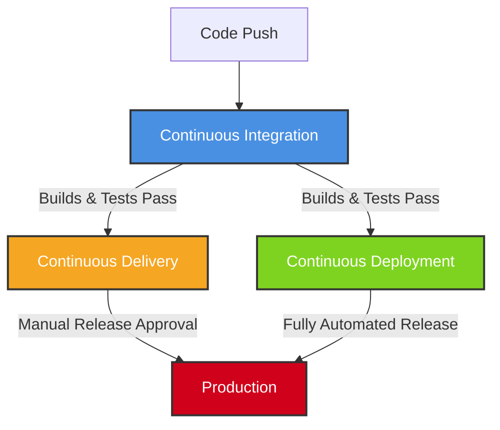
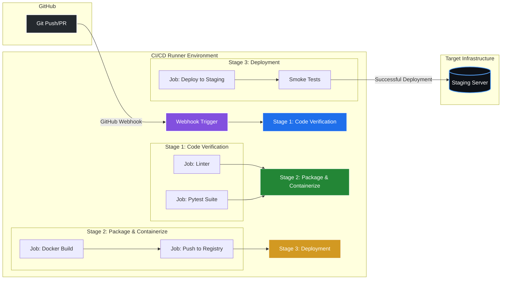
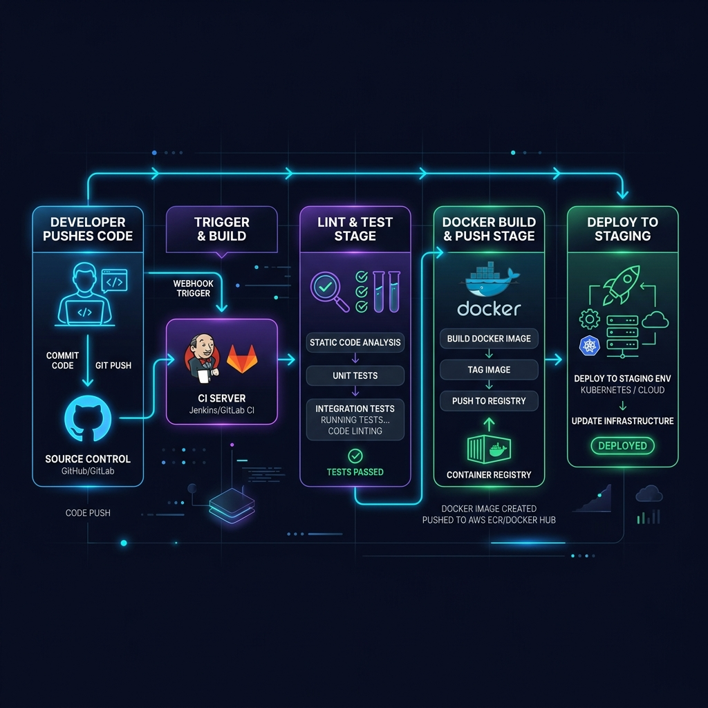

# Day 39: Understanding the Foundations of CI/CD 🚀

Welcome to **Day 39 of the 90 Days of DevOps Challenge!** Today is dedicated to mastering the concepts, philosophy, and architectural patterns of **Continuous Integration (CI)**, **Continuous Delivery (CD)**, and **Continuous Deployment (CD)**. 

Before writing code or configuring pipeline engines, we must understand the core problems CI/CD solves, the anatomy of a pipeline, and how modern DevOps teams automate the journey from a developer's keyboard to a production environment.

---

## 🏗️ Task 1: The Problem (Manual Deployments)

Imagine a team of **5 developers** all writing and pushing code to the same repository. They do not have automation and rely entirely on **manual deployments** to production.

### 1. What can go wrong?
* **Integration Hell:** Developers work in isolation for days or weeks. When they finally merge their branches, they encounter massive merge conflicts. Resolving these manually is error-prone, frustrates the team, and wastes valuable development time.
* **"Works on My Machine" Syndrome:** Code runs perfectly on a developer's laptop but fails immediately in production due to subtle environmental differences (different OS, missing packages, local database modifications, or hardcoded paths).
* **High Risk of Human Error:** Manual deployments require humans to run commands, modify config files, restart services, and copy binaries. A simple typo, out-of-order execution, or forgotten step can bring down the entire system.
* **Lack of Visibility and Auditing:** If production breaks, it is incredibly difficult to trace back to *who* broke it, *what* exact change caused the failure, or *when* it was introduced.
* **Slow Feedback Loops:** A bug might sit in the codebase undetected for weeks until a QA engineer manually tests the feature or, worse, a customer encounters it in production.

### 2. What does "it works on my machine" mean and why is it a real problem?
It refers to a scenario where code behaves correctly in a developer's localized environment but breaks when run in staging or production. This is a critical problem in software engineering because:
* **Environmental Configuration Drift:** A developer might have specific packages, libraries, or system-level dependencies installed globally that aren't documented or packaged in production.
* **Local State / Hardcoded Configs:** Code might rely on files, credentials, or databases that exist locally on the developer's laptop but aren't present or configured in the cloud environment.
* **Development vs. Production Parity:** Differences in Operating Systems (e.g., developing on macOS but deploying to Linux) can lead to file path errors, performance mismatches, or system call incompatibilities.

> [!IMPORTANT]
> The solution to "It works on my machine" is to standardize the execution environment (using containers like **Docker**) and automate the test/build cycle in a clean, neutral environment (using a **CI Runner**).

### 3. How many times a day can a team safely deploy manually?
* **Realistically:** Maybe **once**—or more accurately, **zero times a day safely**. 
* **The Reality:** A manual deployment often takes hours of verification, manual testing, configuration, and stressful debugging. Doing this multiple times a day is unsustainable, highly stressful, and mathematically increases the probability of bringing down the system. Most manual deployment teams release code once every two weeks or once a month to minimize stress and control risks.

---

## 🔄 Task 2: CI vs. CD (The Ultimate Comparison)

Understanding the nuances between **Continuous Integration**, **Continuous Delivery**, and **Continuous Deployment** is vital for any DevOps Engineer.



### 1. Continuous Integration (CI)
* **Definition:** The practice of automatically building, testing, and merging code changes back to a shared repository (e.g., `main` branch) as frequently as possible (ideally multiple times a day).
* **What it catches:** Merge conflicts, syntax issues, compilation errors, failing unit tests, security lints, and dependency errors.
* **Real-world Example:** A developer opens a Pull Request on GitHub. GitHub Actions is immediately triggered, running code linters (`flake8`), code formatting checks (`black`), and a suite of unit tests (`pytest`). If any test fails, the PR is blocked from merging.

### 2. Continuous Delivery (CDel)
* **Definition:** An extension of CI where the codebase is always in a deployable state. The pipeline automatically runs tests, compiles the application, builds Docker images, and pushes them to a registry. However, the deployment to production **requires manual intervention** (e.g., clicking a button).
* **How it differs from CI:** It focuses on the package, release, and deployment stages (not just building and testing). It stops right before production, leaving the final release decision to a human.
* **Real-world Example:** After CI succeeds, the pipeline packages the application into a Docker image, pushes it to Docker Hub, and deploys it to a Staging environment. The Product Manager manually clicks a "Deploy to Production" button in Jenkins or GitHub Actions during low-traffic hours to initiate the final rollout.

### 3. Continuous Deployment (CDep)
* **Definition:** A step further than Continuous Delivery. Every change that successfully passes all automated pipeline stages is deployed directly to production **without any human intervention**.
* **How it differs from Delivery:** There is no manual gatekeeper. Automation is trusted entirely.
* **Real-world Example:** A software developer pushes a bug fix to the `main` branch. The automated pipeline tests, packages, and deploys the change to the Kubernetes production cluster within 10 minutes. The fix is live to millions of users without a single meeting or manual approval.

### Summary Matrix

| Feature | Continuous Integration (CI) | Continuous Delivery (CD) | Continuous Deployment (CD) |
| :--- | :--- | :--- | :--- |
| **Primary Goal** | Validate code changes | Keep code always deployable | Automatically release to production |
| **Trigger** | Code Push / PR | Code Push to release branch | Code Push to release branch |
| **Automation Level**| Automated test & build | Automated up to Staging/Pre-prod | 100% Automated |
| **Prod Deployment** | Manual | **Manual (Human Gatekeeper)** | **Automated (No Human)** |
| **Risk Mitigation** | Early detection of bugs | Controlled releases | Relies on comprehensive test suites |

---

## 🔬 Task 3: Anatomy of a CI/CD Pipeline

A modern CI/CD pipeline is broken down into structured components. Here is what each part represents:

* **Trigger:** The event that initiates the pipeline. Examples include:
  * **Code Event:** Pushing a commit, opening/merging a Pull Request.
  * **Temporal Event:** A CRON schedule (e.g., running integration tests every night at midnight).
  * **Manual Event:** A developer manually clicking "Run Workflow" in the UI.
* **Stage:** A logical collection of jobs that represents a phase in the delivery lifecycle. Stages are executed sequentially (e.g., `Lint` ➡️ `Test` ➡️ `Build` ➡️ `Deploy`). If jobs in a stage fail, the pipeline halts immediately.
* **Job:** A specific suite of tasks executed on a single runner machine. Multiple jobs within the same stage can run in parallel (e.g., running unit tests and static code analysis at the same time).
* **Step:** A single execution task or command run sequentially inside a job. Examples:
  * Checking out the Git code.
  * Installing python dependencies: `pip install -r requirements.txt`.
  * Running a shell command: `pytest`.
* **Runner:** The computational engine (virtual machine, Docker container, or physical host) where the jobs are executed. (e.g., GitHub-hosted `ubuntu-latest` VMs, self-hosted Kubernetes runner pods).
* **Artifact:** The output files, binaries, or packages generated during a job that need to be saved and potentially passed to subsequent stages or downloaded by developers (e.g., a compiled `.war` file, test coverage HTML reports, or Docker `.tar` image).

---

## 🎨 Task 4: Visualizing the Pipeline

### Scenario
> A developer pushes code to GitHub. The app is tested, built into a Docker image, and deployed to a staging server.

Here is the architectural workflow showing the triggers, stages, jobs, and runners involved:



### High-Fidelity Infrastructure Infographic

Below is a professional, high-fidelity visualization mapping this exact workflow from the git push to a staging cluster:



---

## 🛠️ Practical Mock Demonstration: Local vs. CI/CD Operations

To appreciate CI/CD, let's see how a DevOps engineer runs linting, testing, and container builds locally, and how that gets mapped directly to the automated pipeline scripts.

### 1. Developer's Local Terminal Operations
Before pushing code, the developer performs verification manually:

```bash
# Step 1: Run code linter
flake8 . --count --select=E9,F63,F7,F82 --show-source --statistics

# Step 2: Run test suite
pytest tests/ -v

# Step 3: Build Docker Image
docker build -t toucanrajat/devops-app:v1.0.0 .
```

#### Mock Output (Local Operations):
```text
$ flake8 . --count --select=E9,F63,F7,F82 --show-source --statistics
0
$ pytest tests/ -v
============================= test session starts ==============================
platform darwin -- Python 3.12.3, pytest-8.1.1, pluggy-1.4.0
rootdir: /Users/ToucanRajat/Documents/Rajat-Projects/Personal-Projects/90DaysOfDevOps/2026/day-39
collected 3 items

tests/test_app.py::test_homepage_status_code PASSED                      [ 33%]
tests/test_app.py::test_api_response_format PASSED                       [ 66%]
tests/test_app.py::test_database_connection PASSED                        [100%]

============================== 3 passed in 0.42s ===============================
$ docker build -t toucanrajat/devops-app:v1.0.0 .
[+] Building 4.8s (8/8) FINISHED
 => [internal] load build definition from Dockerfile                        0.1s
 => [internal] load .dockerignore                                           0.1s
 => [internal] load metadata for docker.io/library/python:3.12-alpine       1.2s
 => [1/3] FROM docker.io/library/python:3.12-alpine@sha256:d8c              0.0s
 => [2/3] WORKDIR /app                                                      0.2s
 => [3/3] COPY . /app && pip install -r requirements.txt                    2.8s
 => exporting to image                                                      0.4s
 => => exporting layers                                                     0.3s
 => => writing image sha256:f7a26c483a93cd7785b98a12                        0.1s
 => => naming to docker.io/toucanrajat/devops-app:v1.0.0                    0.0s
```

---

## 🔍 Task 5: Explore in the Wild (FastAPI Workflow)

Let's study a production-grade CI/CD system by looking at the official open-source repository for [FastAPI (tiangolo/fastapi)](https://github.com/fastapi/fastapi). 

Inside their `.github/workflows/` directory sits a highly optimized test runner workflow, standardly named `test.yml` or `build.yml`.

### Simplified Structure of a FastAPI `test.yml` Workflow:

```yaml
name: Test

on:
  push:
    branches:
      - master
  pull_request:
    types:
      - opened
      - synchronize

jobs:
  test:
    runs-on: ubuntu-latest
    strategy:
      matrix:
        python-version: ["3.8", "3.9", "3.10", "3.11", "3.12"]
        os: [ubuntu-latest, windows-latest, macos-latest]

    steps:
      - name: Checkout Code
        uses: actions/checkout@v4

      - name: Set up Python ${{ matrix.python-version }}
        uses: actions/setup-python@v5
        with:
          python-version: ${{ matrix.python-version }}

      - name: Install uv (Fast dependency manager)
        uses: astral-sh/setup-uv@v3
        with:
          version: "latest"

      - name: Install dependencies
        run: uv pip install -r requirements-tests.txt --system

      - name: Run Tests & Generate Coverage
        run: pytest --cov=fastapi --cov-report=xml

      - name: Upload Coverage to Codecov
        uses: codecov/codecov-action@v4
        with:
          file: ./coverage.xml
```

### Analysis Checklist

1. **What triggers it?**
   * Pushing code directly to the `master` branch.
   * Creating a new Pull Request, or updating an existing PR (`synchronize` type).
2. **How many jobs does it have?**
   * The simplified YAML contains **1 master job** (`test`). However, using the **Strategy Matrix** (`python-version` x `os`), this single job spawns **15 parallel runs** (5 Python versions × 3 Operating Systems) to guarantee cross-platform compatibility!
3. **What does it do? (DevOps Analysis)**
   * **Retrieves Code:** Pulls the repository code using `actions/checkout@v4`.
   * **Sets Environment:** Dynamically configures the test system for the specific Python version in the matrix.
   * **Installs Modern Package Tooling:** Installs the high-performance package manager `uv` developed by Astral.
   * **Installs Dependencies:** Resolves testing and framework packages inside a clean environment.
   * **Runs Test Suite:** Executes `pytest` with coverage tracking, ensuring code changes did not break FastAPI functionality.
   * **Reports Code Health:** Uploads the XML coverage report to `Codecov` so maintainers can visually see what percentage of codebase was verified.

---

## 💡 Key Takeaways for Day 39
* **CI/CD is a methodology**, not just a tool. Tools (Jenkins, GitHub Actions, GitLab CI) simply facilitate the process.
* **A failing pipeline is a success**, not a failure! It successfully prevented broken code from reaching production.
* **Paradigm Shift:** Moving from manual deployment to automated deployment increases stability, velocity, and dev happiness.

---

## 📱 Learn in Public
Share your conceptual knowledge on LinkedIn and social channels to build your brand as a DevOps expert!

```text
Day 39 of the #90DaysOfDevOps challenge completed! Today, I explored the vital architecture of CI/CD. From understanding "Integration Hell" to mapping pipeline anatomy and inspecting real-world FastAPI workflows on GitHub. 

Ready to write our first automation script tomorrow! 

#90DaysOfDevOps #DevOpsKaJosh #TrainWithShubham #ContinuousIntegration #ContinuousDeployment #Docker #GithubActions
```

---
*Created in collaboration with **TrainWithShubham**.*
