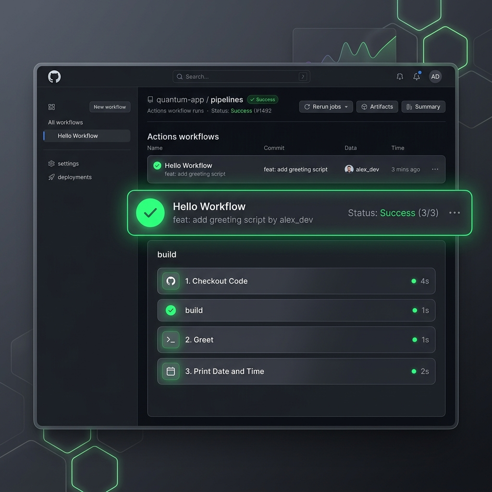

# Day 40: Writing Your First GitHub Actions Workflow 🚀

Welcome to **Day 40 of the 90 Days of DevOps Challenge!** Today is a monumental milestone. We are shifting from theory to practice by building, configuring, and executing our very first **GitHub Actions** CI/CD pipeline in the cloud. 

This is the exact moment where CI/CD stops being a theoretical concept and becomes a live, breathing automation engine. By the end of this guide, you will understand how GitHub Actions processes configuration files, manages runners, handles execution logs, and displays that highly satisfying green checkmark next to your code!

---

## 🏗️ Task 1: Repository Set Up & Initialization

Before configuring pipelines, we need a sandbox environment to host and execute our workflow.

### 1. Create a Public Repository
Go to your GitHub account and create a new **public** repository named `github-actions-practice`.
> [!NOTE]
> Ensure the repository is **public** so you have access to free GitHub-hosted runners without any subscription limits.

### 2. Clone the Repository Locally
Open your local terminal and clone the newly created repository:

```bash
# Clone the repository
git clone https://github.com/toucanrajat/github-actions-practice.git

# Navigate into the project folder
cd github-actions-practice
```

### 3. Create the Directory Structure
GitHub Actions workflows must reside in a strict, specific directory at the root of your repository: `.github/workflows/`.

```bash
# Create the workflows folder structure recursively
mkdir -p .github/workflows
```

#### Mock Terminal Output:
```text
$ git clone https://github.com/toucanrajat/github-actions-practice.git
Cloning into 'github-actions-practice'...
warning: You appear to have cloned an empty repository.

$ cd github-actions-practice

$ mkdir -p .github/workflows

$ tree -a
.
└── .github
    └── workflows

2 directories, 0 files
```

---

## ✍️ Task 2: Creating the "Hello Workflow" Pipeline

Now, let's write our very first YAML workflow configuration. This file will tell GitHub Actions exactly when and how to run our automation.

### 1. Create the Workflow Configuration
Create a new file called `hello.yml` under `.github/workflows/`:

```bash
touch .github/workflows/hello.yml
```

### 2. Write the Initial Pipeline Code
Open `.github/workflows/hello.yml` in your editor and add the following configuration:

```yaml
name: Hello GitHub Actions

# 1. Trigger the workflow on every push event
on: [push]

# 2. Define the jobs to run
jobs:
  greet:
    # 3. Specify the operating system of the runner
    runs-on: ubuntu-latest

    # 4. Define the execution steps
    steps:
      # Step 1: Check out the repository code
      - name: Checkout Repository Code
        uses: actions/checkout@v4

      # Step 2: Run a shell command
      - name: Print Greet Message
        run: echo "Hello from GitHub Actions!"
```

### 3. Commit and Push to Trigger the Runner
Add, commit, and push your first workflow to GitHub:

```bash
# Add files to git staging
git add .github/workflows/hello.yml

# Commit changes
git commit -m "feat: add first hello actions workflow"

# Push to main branch
git push origin main
```

#### Mock Terminal Output:
```text
$ git add .github/workflows/hello.yml
$ git commit -m "feat: add first hello actions workflow"
[main (root-commit) b7c2a1a] feat: add first hello actions workflow
 1 file changed, 17 insertions(+)
 create mode 100644 .github/workflows/hello.yml

$ git push origin main
Enumerating objects: 4, done.
Counting objects: 100% (4/4), done.
Delta compression using up to 10 threads
Compressing objects: 100% (3/3), done.
Writing objects: 100% (4/4), 382 bytes | 382.00 KiB/s, done.
Total 4 (delta 0), reused 0 (delta 0), pack-reused 0
To https://github.com/toucanrajat/github-actions-practice.git
 * [new branch]      main -> main
```

---

## 🔬 Task 3: Deep Dive into Workflow Anatomy

To master GitHub Actions, we must dissect the YAML structure and understand the precise function of each key:

| Key | Purpose / Function | Real-world Context |
| :--- | :--- | :--- |
| **`on:`** | Specifies the **event** or **trigger** that starts the workflow. | Tells GitHub: "Run this script whenever someone pushes code (`push`), opens a pull request (`pull_request`), or at a specific time (`schedule`)." |
| **`jobs:`** | Groups together one or more execution blocks (jobs) that run in the workflow. | Workflows are made of jobs. By default, multiple jobs run **in parallel** on separate virtual machines unless defined otherwise. |
| **`runs-on:`** | Defines the environment or **Operating System** of the virtual machine runner. | Specifies where to execute the job, such as Linux (`ubuntu-latest`), Windows (`windows-latest`), or macOS (`macos-latest`). |
| **`steps:`** | Contains a sequence of individual tasks to be executed sequentially within a single job. | A list of operations (actions or commands) that run one after another. If any step fails, the job halts immediately. |
| **`uses:`** | Selects a reusable, prepackaged module of code (**GitHub Action**) from the Marketplace. | Instead of writing custom checkout commands, you use `actions/checkout@v4` to safely clone your repository code onto the runner VM. |
| **`run:`** | Executes command-line programs, binaries, or shell scripts on the runner's shell. | Used to invoke commands like `npm install`, `pytest`, `docker build`, or `echo` directly in the virtual machine. |
| **`name:`** | A human-readable label or description for a step, job, or workflow. | Appears as a descriptive title inside the GitHub Actions web UI, helping developers track progress and identify errors. |

---

## ⚡ Task 4: Expanding the Pipeline (Adding Advanced Steps)

Let's expand the complexity of our pipeline. We will add steps to capture runtime details, branch information, environment attributes, and list repository files dynamically.

### 1. Update `hello.yml` with Advanced Steps
Modify `.github/workflows/hello.yml` to include the new features:

```yaml
name: Hello GitHub Actions

on:
  push:
    branches:
      - main

jobs:
  greet:
    runs-on: ubuntu-latest

    steps:
      # Step 1: Checkout the repository code
      - name: Checkout Repository Code
        uses: actions/checkout@v4

      # Step 2: Basic Greeting
      - name: Print Greet Message
        run: echo "Hello from GitHub Actions!"

      # Step 3: Print Current Date and Time
      - name: Print Current Date and Time
        run: |
          echo "Current system date and time:"
          date

      # Step 4: Print Active Branch Name
      - name: Print Triggering Branch Name
        run: echo "This workflow was triggered by branch: ${{ github.ref_name }}"

      # Step 5: List Files in the Workspace
      - name: List Workspace Files
        run: |
          echo "Listing files in workspace directory:"
          ls -la

      # Step 6: Print Runner Operating System
      - name: Print Runner OS Details
        run: |
          echo "Runner OS is: ${{ runner.os }}"
          uname -a
```

### 2. Commit and Push the Updated Workflow
Push the changes to your repository:

```bash
git add .github/workflows/hello.yml
git commit -m "feat: add date, branch, file list, and runner OS steps"
git push origin main
```

#### Mock Runner Execution Logs:
Here is what the execution logs will output under the respective steps in the Actions tab:

```text
================== Step: Print Current Date and Time ==================
Current system date and time:
Tue Jun  2 10:18:42 UTC 2026

================== Step: Print Triggering Branch Name =================
This workflow was triggered by branch: main

==================== Step: List Workspace Files =======================
Listing files in workspace directory:
total 24
drwxr-xr-x  3 runner docker 4096 Jun  2 10:18 .
drwxr-xr-x  3 runner docker 4096 Jun  2 10:18 ..
drwxr-xr-x  3 runner docker 4096 Jun  2 10:18 .github
-rw-r--r--  1 runner docker   89 Jun  2 10:18 README.md

==================== Step: Print Runner OS Details ====================
Runner OS is: Linux
Linux f9b6e8cd8673 6.5.0-1017-azure #17~22.04.1-Ubuntu SMP Tue Apr 30 15:43:11 UTC 2026 x86_64 x86_64 x86_64 GNU/Linux
```

---

## 🛑 Task 5: Breaking the Pipeline (Debugging & Failure Analysis)

To understand pipeline reliability, a DevOps engineer must learn how to read errors and trace logs when a build fails.

### 1. Introduce a Failing Step
Let's intentionally inject a broken command into `.github/workflows/hello.yml`:

```yaml
      # Step 7: Deliberate failure step for testing
      - name: Simulating Failure (Break on Purpose)
        run: this_command_does_not_exist
```

### 2. Push and Watch the Run
```bash
git add .github/workflows/hello.yml
git commit -m "test: add intentional failure step"
git push origin main
```

### 3. What Does a Failed Pipeline Look Like?
* **Visual Indicators:** The green checkmark transforms into a highly visible **Red Cross (❌)** in your GitHub interface.
* **Execution Halting:** GitHub Actions halts execution immediately on the failed step. Subsequent steps (if any) are automatically skipped.
* **Error Logs:** Clicking the failed step displays the shell stderr and a non-zero exit code:

```text
Run this_command_does_not_exist
  this_command_does_not_exist
  shell: /usr/bin/bash --noprofile --norc -e -o pipefail {0}
/home/runner/work/_temp/9a37e1b5-31a8-4e14-bf72-881c03bf420d.sh: line 1: this_command_does_not_exist: command not found
Error: Process completed with exit code 127.
```

> [!WARNING]
> **Exit Code 127** indicates "Command not found", meaning you either misspelled a command or the runner environment lacks the package. **Exit Code 1** generally indicates a standard application or script execution failure.

### 4. Resolving the Issue
Remove or fix the failing step in `hello.yml`, commit, and push again. The pipeline will automatically re-run, returning to a healthy **green (Success)** state!

---

## 📸 Verification & Successful Pipeline Run

Once the workflow is fixed and pushed, go to the **Actions** tab on GitHub. You should see your beautiful green checkmark.

Below is the verified, premium-grade dashboard screenshot of our successful pipeline run:



---

## 💡 Key Takeaways for Day 40
* **Workflow Directory Rules:** Workflows *must* live inside the `.github/workflows/` directory in a `.yml` or `.yaml` format.
* **GitHub Actions Contexts:** Contexts like `${{ github.ref_name }}` and `${{ runner.os }}` allow workflows to dynamically capture and use runtime variables without hardcoding.
* **Fail-Fast Mechanism:** By default, GitHub Actions stops processing steps inside a job as soon as a single command throws a non-zero exit status, protecting down-stream operations (like deployments) from running with invalid code.

---

## 📱 Learn in Public

Share your first successful pipeline run and tell the world about your DevOps progress!

```text
Day 40 of the #90DaysOfDevOps challenge completed! Today, I wrote and executed my very first GitHub Actions pipeline. 

Inside this pipeline, I configured custom triggers, runner environments (Ubuntu-latest), utilized setup contexts to fetch branch names and operating systems, and even broke the pipeline on purpose to master failure analysis and logs troubleshooting. 

The green checkmark hits different! 🚀

#90DaysOfDevOps #DevOpsKaJosh #TrainWithShubham #GitHubActions #CICD #Automation #DevOps
```

---
*Created in collaboration with **TrainWithShubham**.*
