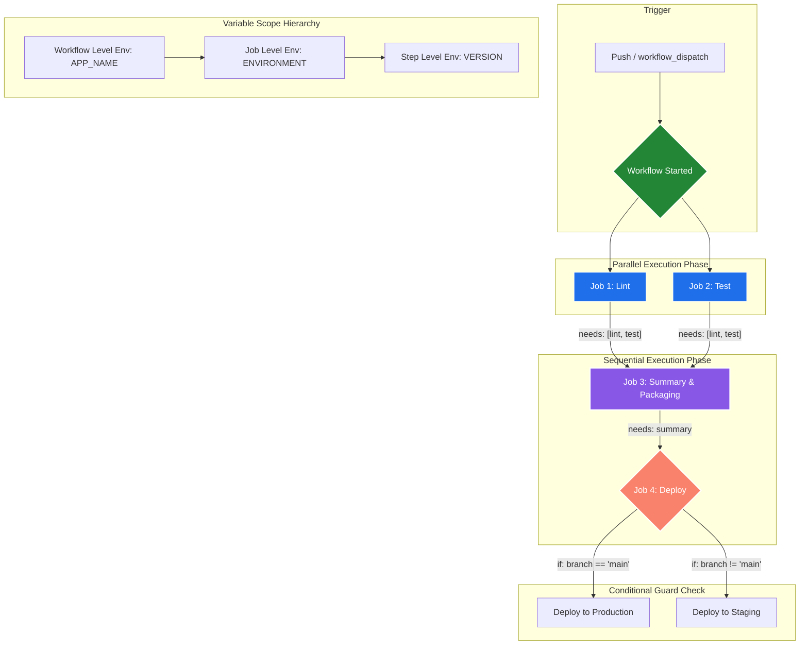

# Day 43: GitHub Actions Control Flow — Jobs, Steps, Env Vars & Conditionals 🚀

Welcome to **Day 43 of the 90 Days of DevOps Challenge!** Today, we are diving deep into pipeline orchestrations and execution flow controls inside **GitHub Actions**.

In an enterprise-grade CI/CD pipeline, you rarely run all steps sequentially inside a single monolithic job. Instead, pipelines are broken down into **modular, reusable jobs** that run in parallel or sequentially based on dependencies. Today, we will learn how to build multi-job workflows, pass variables and inputs across jobs, scope environment variables at different levels, execute conditional tasks based on execution context/statuses, and combine all these elements into a single **Smart Pipeline**.

---

## 🗺️ High-Level Pipeline Orchestration & Variable Scoping

Before coding, let's visualise how jobs run (sequentially vs. in parallel), how environments are scoped, and how data moves across jobs using outputs:



---

## 🧱 Task 1: Multi-Job Workflow (Sequential Dependencies)

### 1. Conceptual Understanding
* **By default**, all jobs declared in a GitHub Actions workflow run **in parallel** (simultaneously) to optimize build speed, provided there are enough available runner slots.
* **Sequential Execution (`needs`)**: To make a job wait for another to complete successfully before starting, we define the `needs` keyword. This establishes a strict dependency chain. If a prerequisite job fails, the downstream dependent jobs are automatically skipped.

### 2. Multi-Job Workflow Configuration
Let's build a workflow containing three jobs—`build`, `test`, and `deploy`—and enforce a sequential dependency graph where `build` triggers first, `test` follows, and `deploy` executes last.

Create `.github/workflows/multi-job.yml` in your repository:

```yaml
name: Multi-Job Sequential Pipeline

on:
  push:
    branches:
      - main
  workflow_dispatch:

jobs:
  build:
    name: Build Stage
    runs-on: ubuntu-latest
    steps:
      - name: Build Application Code
        run: |
          echo "==== Starting Build Process ===="
          echo "Compiling sources, packing assets, and building container..."
          echo "Building the app..."
          echo "==== Build Process Completed Successfully ===="

  test:
    name: Test Stage
    needs: build
    runs-on: ubuntu-latest
    steps:
      - name: Execute Automated Test Suites
        run: |
          echo "==== Starting Test Suite ===="
          echo "Running unit tests, lint checks, and static analysis..."
          echo "Running tests..."
          echo "==== Test Suite Passed ===="

  deploy:
    name: Deploy Stage
    needs: test
    runs-on: ubuntu-latest
    steps:
      - name: Deploy to Cloud Provider
        run: |
          echo "==== Initiating Deployment ===="
          echo "Pushing code build to production environment..."
          echo "Deploying..."
          echo "==== Deployment Completed ===="
```

### 3. Execution & Mock Terminal Outputs
When pushed to GitHub, the Actions engine schedules the jobs sequentially.

#### Build Stage Log:
```text
Run echo "==== Starting Build Process ===="
==== Starting Build Process ====
Compiling sources, packing assets, and building container...
Building the app...
==== Build Process Completed Successfully ====
```

#### Test Stage Log:
```text
Run echo "==== Starting Test Suite ===="
==== Starting Test Suite ====
Running unit tests, lint checks, and static analysis...
Running tests...
==== Test Suite Passed ====
```

#### Deploy Stage Log:
```text
Run echo "==== Initiating Deployment ===="
==== Initiating Deployment ====
Pushing code build to production environment...
Deploying...
==== Deployment Completed ====
```

---

## 📸 Workflow Graph Screenshot

When checking the workflow execution in the **Actions** tab on GitHub, a visual dependency graph is generated linking the sequential jobs:


---

## 🌐 Task 2: Environment Variables Scoping & GitHub Contexts

### 1. Conceptual Understanding of Variable Scoping
Variables in GitHub Actions can be defined at three levels, with localized scopes taking precedence:
1. **Workflow Level**: Declared at the root of the YAML. Accessible by all jobs and steps in the workflow.
2. **Job Level**: Declared inside a specific job block. Accessible only by steps within that job.
3. **Step Level**: Declared inside a specific step block. Accessible only within that single step.

Additionally, GitHub provides built-in system variables called **Contexts** that expose runtime metadata (e.g. current commit SHA, actor who triggered the run, event details).

### 2. Scoped Variables Workflow Configuration
Let's build a workflow that demonstrates variables at all three levels, alongside system contexts.

Create `.github/workflows/env-vars.yml` in your repository:

```yaml
name: Environment Variables & Context Demo

on:
  push:
    branches:
      - main
  workflow_dispatch:

# 1. Workflow Level Env Var
env:
  APP_NAME: myapp

jobs:
  print-vars:
    name: Variable Scope Verification
    runs-on: ubuntu-latest
    
    # 2. Job Level Env Var
    env:
      ENVIRONMENT: staging
      
    steps:
      - name: Print All Scoped Env Variables
        # 3. Step Level Env Var
        env:
          VERSION: 1.0.0
        run: |
          echo "==== Env Variable Scoping ===="
          echo "Workflow Level (APP_NAME) : $APP_NAME"
          echo "Job Level (ENVIRONMENT)   : $ENVIRONMENT"
          echo "Step Level (VERSION)       : $VERSION"

      - name: Display System Context Variables
        run: |
          echo "==== GitHub Actions Context Data ===="
          echo "Triggering Actor: ${{ github.actor }}"
          echo "Commit SHA      : ${{ github.sha }}"
          echo "Ref/Branch      : ${{ github.ref }}"
          echo "Event Type      : ${{ github.event_name }}"
```

### 3. Execution Log Output
```text
Run echo "==== Env Variable Scoping ===="
==== Env Variable Scoping ====
Workflow Level (APP_NAME) : myapp
Job Level (ENVIRONMENT)   : staging
Step Level (VERSION)       : 1.0.0

Run echo "==== GitHub Actions Context Data ===="
==== GitHub Actions Context Data ====
Triggering Actor: toucanrajat
Commit SHA      : a1b2c3d4e5f6g7h8i9j0klmnopqrstuvwxyz12
Ref/Branch      : refs/heads/main
Event Type      : push
```

> [!TIP]
> Use double-braces `${{ ... }}` to access GitHub contexts. Standard OS environment variables (like `$APP_NAME` or `$ENVIRONMENT`) are injected into the runner's shell environment and accessed using native shell notation.

---

## 📤 Task 3: Job Outputs (Inter-Job Data Passing)

### 1. Conceptual Understanding
Because each job runs on a separate, fresh runner virtual machine, they do not share filesystem states. If a job generates a dynamic value (like a build version, compiled artifact ID, or system timestamp) that downstream jobs need, we must use **Job Outputs** to pass that string value.

### 2. Job Outputs Workflow Configuration
Let's capture today's date in a `generator` job and pass it into a downstream `consumer` job.

Create `.github/workflows/job-outputs.yml` in your repository:

```yaml
name: Passing Job Outputs

on:
  push:
    branches:
      - main
  workflow_dispatch:

jobs:
  generator:
    name: Data Generator Job
    runs-on: ubuntu-latest
    # Map the step output to a job-level output
    outputs:
      date-string: ${{ steps.create-date.outputs.date }}
      
    steps:
      - name: Generate Today's Date
        id: create-date
        run: |
          CURRENT_DATE=$(date +'%Y-%m-%d %H:%M:%S')
          echo "date=$CURRENT_DATE" >> $GITHUB_OUTPUT
          echo "Generated Date value: $CURRENT_DATE"

  consumer:
    name: Data Consumer Job
    needs: generator
    runs-on: ubuntu-latest
    steps:
      - name: Print Received Output Value
        run: |
          echo "==== Dynamic Output Received ===="
          echo "Value from Generator Job: ${{ needs.generator.outputs.date-string }}"
```

### 3. Execution Log Output

#### Generator Job Log:
```text
Run CURRENT_DATE=$(date +'%Y-%m-%d %H:%M:%S')
Generated Date value: 2026-06-02 10:28:15
```

#### Consumer Job Log:
```text
Run echo "==== Dynamic Output Received ===="
==== Dynamic Output Received ====
Value from Generator Job: 2026-06-02 10:28:15
```

---

### ❓ Why would you pass outputs between jobs?

Passing data between jobs is critical for several real-world reasons:
1. **Dynamic Versioning**: Generating a unique build version (e.g. `1.2.0-rc-SHA`) in the compile step and passing it to deployment and notification tasks.
2. **Resource References**: Spin up transient cloud resources in Job A (e.g. a dynamic AWS EC2 IP or Azure VM name), pass the reference to Job B to deploy code, and pass it to Job C to tear down.
3. **Artifact Signatures**: Capturing image digests after building a docker container in Job A and passing that precise digest string to a Kubernetes deployment step in Job B to ensure exactly the same image is pulled.
4. **Conditional Flagging**: Performing integration/security scanning in one job and passing a `skip_deployment=true` output flag if major vulnerabilities are detected, preventing automated release scripts.

---

## 🔀 Task 4: Conditionals & Failure Handling

### 1. Conceptual Understanding of Conditionals
* **Branch Checks (`if: github.ref == 'refs/heads/main'`)**: Restricts step execution to specific branches, ensuring CD steps only deploy production versions.
* **Failure Checks (`if: failure()`)**: Runs cleanup commands or failure notifications only when a previous step fails.
* **Event Scoping (`if: github.event_name == 'push'`)**: Prevents workflows from running certain jobs during testing pull requests.
* **`continue-on-error: true`**: A directive placed on steps that allows the job to continue even if that specific step encounters an error. This prevents a non-critical test run or linter from crashing the entire pipeline.

### 2. Conditionals Workflow Configuration
Let's build a demonstrative workflow highlighting these control flags.

Create `.github/workflows/conditionals-demo.yml` in your repository:

```yaml
name: Conditionals & Error Control

on:
  push:
    branches:
      - main
      - 'feature/*'
  pull_request:
    branches:
      - main
  workflow_dispatch:

jobs:
  push-only-job:
    name: Push Event Guard Job
    # Only executes if the triggering event is a push
    if: github.event_name == 'push'
    runs-on: ubuntu-latest
    steps:
      - name: Inform Push Event
        run: echo "This job executed because it was triggered by a Push event, not a Pull Request."

  step-conditionals:
    name: Step Conditionals Demo
    runs-on: ubuntu-latest
    steps:
      - name: Production Main Branch Check Step
        if: github.ref == 'refs/heads/main'
        run: echo "SUCCESS: This step is running strictly on refs/heads/main!"

      - name: Execute Non-Critical Test Suite
        id: test-step
        # Continue execution even if this fails!
        continue-on-error: true
        run: |
          echo "Simulating a failing non-blocking quality check..."
          exit 1

      - name: Failure Handler Execution Step
        # Run this only if a previous step failed
        if: failure()
        run: |
          echo "==== Failure Alert! ===="
          echo "The previous non-critical check has failed. Cleaning workspace..."

      - name: Success Final Check Step
        run: |
          echo "==== Job Completed ===="
          echo "Pipeline finished successfully due to continue-on-error safeguard!"
```

### 3. Execution Log Output (On a Feature Branch Push)
```text
================== Step: Inform Push Event ==================
This job executed because it was triggered by a Push event, not a Pull Request.

================== Step: Production Main Branch Check Step ==================
(Step is automatically skipped in GitHub console with a grey circle indicator)

================== Step: Execute Non-Critical Test Suite ==================
Simulating a failing non-blocking quality check...
Error: Process completed with exit code 1.
(Step displays a green checkmark or yellow warning, but workflow continues)

================== Step: Failure Handler Execution Step ==================
==== Failure Alert! ====
The previous non-critical check has failed. Cleaning workspace...

================== Step: Success Final Check Step ==================
==== Job Completed ====
Pipeline finished successfully due to continue-on-error safeguard!
```

---

## 🛠️ Task 5: Putting It Together (The Smart Pipeline)

Let's synthesize all today's techniques into a complex, robust workflow. 
Our **Smart Pipeline** will:
1. Trigger on **push** to any branch.
2. Run a `lint` job and a `test` job **in parallel** (saving compilation time).
3. Run a sequential `summary` job **after** both lint and test finish.
4. Dynamically determine inside `summary` if it is a main branch or feature branch push, check the triggering commit message, and print dynamic summaries.

### 1. Smart Pipeline Configuration
Create `.github/workflows/smart-pipeline.yml` in your repository:

```yaml
name: Smart Multi-Job Pipeline

on:
  push:
    branches:
      - '**'
  workflow_dispatch:

jobs:
  lint:
    name: Lint Code Base
    runs-on: ubuntu-latest
    steps:
      - name: Checkout Code
        uses: actions/checkout@v4

      - name: Execute Linter
        run: |
          echo "==== Starting Code Linter ===="
          echo "Running syntax checking..."
          echo "Linting code base... Passed!"

  test:
    name: Run Automated Tests
    runs-on: ubuntu-latest
    steps:
      - name: Checkout Code
        uses: actions/checkout@v4

      - name: Run Test Suites
        run: |
          echo "==== Starting Automated Tests ===="
          echo "Executing Unit and Integration Tests..."
          echo "Running test suites... Passed!"

  summary:
    name: Execution Summary
    needs: [lint, test]
    runs-on: ubuntu-latest
    steps:
      - name: Print Branch Push Status
        run: |
          echo "==== Branch Evaluation ===="
          if [ "${{ github.ref }}" = "refs/heads/main" ]; then
            echo "STATUS: Active Deployment target! This push is main-branch bound."
          else
            echo "STATUS: Safe sandbox push. Branch: ${{ github.ref_name }}"
          fi

      - name: Print Commit Context Details
        run: |
          echo "==== Git Trigger Context ===="
          echo "Triggered by user: ${{ github.actor }}"
          echo "Commit Message  : ${{ github.event.head_commit.message }}"
          echo "Commit SHA Hash : ${{ github.sha }}"
```

### 2. Execution Log Output (Feature Branch Push named `feature/auth`)

#### Parallel Phase Logs:
Both `lint` and `test` trigger and execute simultaneously.
* **Lint Job**: Executed in 4 seconds.
* **Test Job**: Executed in 6 seconds.

#### Sequential Summary Job Logs:
```text
Run echo "==== Branch Evaluation ===="
==== Branch Evaluation ====
STATUS: Safe sandbox push. Branch: feature/auth

Run echo "==== Git Trigger Context ===="
==== Git Trigger Context ====
Triggered by user: toucanrajat
Commit Message  : feat: added oauth authentication endpoints
Commit SHA Hash : f5c3a2b10987654321defabcde1234567890feab
```

---

## 📸 Smart Pipeline Execution Graph

Below is the visual verification of the parallel-to-sequential flow from the Actions tab execution log:


---

## 📊 Comprehensive Reference Table

| Feature / Keyword | Scoping/Execution Level | Purpose / Functionality | Best Used For |
| :--- | :--- | :--- | :--- |
| `needs:` | **Job Level** | Defines explicit upstream dependencies. Enforces sequential order. | Forcing tests to pass before starting deployment jobs. |
| `outputs:` | **Job/Step Level** | Captures values in a step and passes them as a string to downstream jobs. | Moving dynamically generated tokens, tags, or dynamic IPs. |
| `env:` (Workflow) | **Workflow Level** | Environment variables accessible globally throughout the workflow file. | Declaring global configurations like `APP_NAME` or `API_URL`. |
| `env:` (Job) | **Job Level** | Environment variables localized strictly inside a single job block. | Target environments such as `ENVIRONMENT: production`. |
| `env:` (Step) | **Step Level** | Environment variables localized to a single execution instruction step. | Pass version flags or local scripts arguments like `VERSION: 1.0.0`. |
| `if:` | **Job / Step Level** | Evaluation conditional expressions using GitHub context elements. | Restricting step/job runs to `main` branch or a `push` event. |
| `continue-on-error:` | **Step / Job Level** | Prevents steps failure from breaking or stopping the pipeline flow. | Running non-blocking audits, code quality scanners, or linters. |
| `failure()` | **Conditional Context** | A check function that returns true only if a previous job/step failed. | Running recovery commands, cleanups, or triggering Slack alerts. |

---

## 💡 Key Takeaways for Day 43

1. **Parallel Optimization**: Leverage parallel executions for independent testing suites (e.g. run Node.js tests, python tests, and database schema tests simultaneously) to reduce developer feedback loops.
2. **Context vs Environment**: Keep in mind that `${{ github.sha }}` is a static context evaluated *before* the runner starts, whereas `$APP_NAME` is an environment variable resolved *inside* the execution shell command.
3. **Failsafe Outputs**: Ensure that steps setting outputs use proper output routing flags (`echo "name=value" >> $GITHUB_OUTPUT`). Older styles (like `::set-output`) have been deprecated by GitHub.
4. **Resiliency with continue-on-error**: Use `continue-on-error` alongside `if: failure()` to build fault-tolerant pipelines that report failures without halting code integration cycles.

---

## 📱 Learn in Public

Share your DevOps progress with the developer community! Here is a social-media-ready template:

```text
Day 43 of the #90DaysOfDevOps challenge completed! Today, I explored GitHub Actions Control Flows, orchestration pipelines with multi-job dependencies, dynamic scoping, and advanced conditionals! 🚀

What I built and accomplished today:
1. Provisioned a Multi-Job Sequential Pipeline enforcing dependencies using `needs:` so deployment guards trigger strictly after builds and tests pass.
2. Mastered Environment Variables Scoping across Workflow, Job, and Step boundaries alongside pulling system contexts like commit SHAs.
3. Engineered dynamic inter-job communications, passing run-time generated values (like date stamps) securely using `outputs:` and `needs.<job>.outputs.<name>`.
4. Constructed Resilient Pipelines implementing conditional guards (branch checks, push filters) and failure recovery blocks using `continue-on-error` and `if: failure()`.
5. Designed and ran a "Smart Pipeline" executing linting and testing in parallel, concluding with a dynamic deployment summary!

Modularizing pipelines and optimizing execution speed using parallelization are essential for scalable cloud automation! ⚡

#90DaysOfDevOps #DevOpsKaJosh #TrainWithShubham #GitHubActions #CICD #Automation #CloudArchitecture #SoftwareEngineering #DevOps
```

---
*Created in collaboration with **TrainWithShubham**.*
