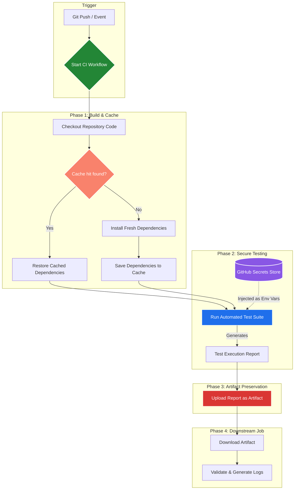

# Day 44: Secure CI/CD Pipelines — Secrets Management, Artifacts, and Caching 🛡️

Welcome to **Day 44 of the 90 Days of DevOps Challenge!** Today, we are transitioning our pipelines from simple execution scripts to **production-grade CI/CD pipelines** that perform real-world duties. 

In enterprise environments, pipelines must handle sensitive configurations (like passwords, Docker tokens, and cloud access keys) securely, pass build deliverables across different isolated environments, execute automated test suites, and run at maximum speed. Today, we will master **GitHub Secrets**, **Actions Artifacts** (upload/download), **CI Test Automation** (Red-Green-Refactor flow), and pipeline speed optimization using **Dependency Caching**.

---

## 🗺️ High-Level CI/CD Workflow Architecture

Before we begin coding, let's visualize how the entire pipeline functions. The diagram below illustrates how code changes trigger a workflow, leverage dependency caching, utilize injected secrets, execute a real-world test suite, upload build reports, and download artifacts in downstream stages:



---

## 🔐 Task 1: Secure Secrets Management via GitHub Secrets

### 1. Conceptual Understanding
* **GitHub Secrets**: Encrypted variables that you create in an organization, repository, or environment. They are encrypted at rest using Libsodium sealed boxes and decrypted only when injected into a running workflow container.
* **Log Masking**: GitHub automatically attempts to scrub any printed values matching defined secrets from the pipeline run logs, replacing them with asterisks (`***`). 
* **Crucial Rule**: You must never explicitly attempt to print secret values in logs. If a secret is printed, malicious actors with read access to repository logs can scrape these variables.

### 2. Setting Up GitHub Secrets
To configure your first secret:
1. Navigate to your repository page on GitHub.
2. Go to **Settings** ➡️ **Secrets and variables** ➡️ **Actions**.
3. Click on the **New repository secret** button.
4. Set the **Name** to: `MY_SECRET_MESSAGE`
5. Set the **Secret** value to: `DevOpsIsAwesome2026!`
6. Click **Add secret**.

---

### 3. Workflow Configuration (Verifying Secret Masking)
Let's build a workflow that verifies the secret is loaded, performs a safe evaluation check, and demonstrates GitHub's automatic masking when an attempt is made to print it directly.

Create `.github/workflows/secrets-demo.yml` in your repository:

```yaml
name: GitHub Secrets Verification Demo

on:
  push:
    branches:
      - main
  workflow_dispatch:

jobs:
  verify-secrets:
    name: Secrets Handling & Masking Test
    runs-on: ubuntu-latest
    steps:
      - name: Checkout Code
        uses: actions/checkout@v4

      - name: Verify Secret Presence (Safe Execution)
        run: |
          echo "==== Step 1: Checking if Secret is Available ===="
          if [ -n "${{ secrets.MY_SECRET_MESSAGE }}" ]; then
            echo "The secret is set: true"
          else
            echo "The secret is set: false"
            exit 1
          fi

      - name: Direct Printing Attempt (To Observe Log Masking)
        run: |
          echo "==== Step 2: Attempting to print the secret directly ===="
          echo "Direct access value: ${{ secrets.MY_SECRET_MESSAGE }}"
```

### 4. Workflow Execution Logs
When the workflow completes execution, view the logs in the Actions tab. Notice how GitHub replaces the direct print value with `***` automatically:

```text
Run echo "==== Step 1: Checking if Secret is Available ===="
==== Step 1: Checking if Secret is Available ====
The secret is set: true

Run echo "==== Step 2: Attempting to print the secret directly ===="
==== Step 2: Attempting to print the secret directly ====
Direct access value: ***
```

> [!WARNING]
> **Why should you never print secrets in CI logs?**
> 1. **Persistent Exposure**: Workflow logs are retained for up to 90 days by default. Anyone with read access to the repository can view them.
> 2. **Masking Bypass Vulnerabilities**: GitHub's masking search-and-replace algorithm matches the literal secret value. If a developer accidentally transforms the secret (e.g., base64 encoding it, splitting it, or passing it to an error stack dump), the mask will be bypassed, leaking the raw secret.
> 3. **Log Scraping & API Infiltration**: Malicious bots actively crawl public logs looking for accidentally exposed AWS, Docker, or Kubernetes tokens. If a token is leaked, your systems could be compromised within seconds.

---

## 🌐 Task 2: Injecting Secrets as Environment Variables

### 1. Conceptual Understanding
The recommended way to pass secrets into code or build tools is to map them to **Environment Variables** within specific workflow steps. This isolates the secrets to the memory space of that step and avoids injecting plaintext secrets directly into shell invocation logs.

For Day 45, we will be pushing built Docker containers to Docker Hub. We will configure the required secrets today.

### 2. Registering Docker Hub Credentials
1. Go to your repository **Settings** ➡️ **Secrets and variables** ➡️ **Actions**.
2. Create `DOCKER_USERNAME` with your Docker Hub username (e.g. `toucanrajat`).
3. Create `DOCKER_TOKEN` with your Docker Hub Personal Access Token (PAT).

### 3. Workflow Configuration
Create `.github/workflows/secrets-env.yml` in your repository:

```yaml
name: Secrets as Env Variables

on:
  push:
    branches:
      - main
  workflow_dispatch:

jobs:
  run-with-secrets:
    name: Inject Secrets to Environment
    runs-on: ubuntu-latest
    steps:
      - name: Checkout Repository
        uses: actions/checkout@v4

      - name: Execute Shell Script Using Secrets
        env:
          USER_SECRET_MSG: ${{ secrets.MY_SECRET_MESSAGE }}
          HUB_USER: ${{ secrets.DOCKER_USERNAME }}
          HUB_TOKEN: ${{ secrets.DOCKER_TOKEN }}
        run: |
          echo "==== Environment Context Verified ===="
          echo "Using Docker Hub Username: $HUB_USER"
          echo "Using Docker Hub Token: [MASKED]"
          
          # Demonstrating safe usage of env variables in scripting without exposing them
          if [ "$USER_SECRET_MSG" = "DevOpsIsAwesome2026!" ]; then
             echo "Authorization Check: Successful!"
          else
             echo "Authorization Check: Failed!"
             exit 1
          fi
```

### 4. Workflow Execution Logs
```text
Run echo "==== Environment Context Verified ===="
==== Environment Context Verified ====
Using Docker Hub Username: ***
Using Docker Hub Token: [MASKED]
Authorization Check: Successful!
```

---

## 📤 Task 3: Preserving Outputs using GitHub Artifacts

### 1. Conceptual Understanding of Artifacts
* **Artifacts**: Files generated during a workflow run (such as build binaries, package zip files, test result logs, or code coverage reports) that are preserved in the cloud.
* **Isolated Environment Lifecycles**: A runner VM is completely destroyed after a job finishes. Storing local files on the runner will result in permanent loss. `actions/upload-artifact` saves these files before the VM is torn down.

### 2. Workflow Configuration (Artifact Upload)
Let's build a workflow that dynamically generates a dummy test summary report and uploads it as an artifact.

Create `.github/workflows/upload-artifact.yml`:

```yaml
name: Upload Build Artifacts Demo

on:
  push:
    branches:
      - main
  workflow_dispatch:

jobs:
  build-and-archive:
    name: Build & Upload Reports
    runs-on: ubuntu-latest
    steps:
      - name: Checkout Code
        uses: actions/checkout@v4

      - name: Generate Dynamic Reports
        run: |
          echo "==== Generating Pipeline Reports ===="
          mkdir -p build/reports
          echo '{
            "status": "passed",
            "tests_run": 42,
            "failed": 0,
            "timestamp": "'$(date)'"
          }' > build/reports/test-summary.json
          
          echo "Build Report contents:"
          cat build/reports/test-summary.json

      - name: Upload Test Report to Cloud Storage
        uses: actions/upload-artifact@v4
        with:
          name: qa-test-report
          path: build/reports/test-summary.json
          retention-days: 7
```

### 3. Execution Logs & Download Verification
```text
Run actions/upload-artifact@v4
With:
  name: qa-test-report
  path: build/reports/test-summary.json
  retention-days: 7
...
Artifact qa-test-report has been successfully uploaded!
Container ID: 1234567890
Size: 104 bytes
```

---

### 📸 Verification: Downloading Artifact from GitHub UI
Once the run finishes, scroll to the bottom of the workflow run overview page under the **Artifacts** section to download the saved file:


---

## 📥 Task 4: Downloading Artifacts Between Jobs

### 1. Conceptual Understanding
Because jobs run in isolated containers (and potentially on completely different physical runners), they cannot access the local files of another job. To share data, Job 1 must **upload** the artifact, and Job 2 must **download** the artifact to continue processing.

### 2. Multi-Job Workflow Configuration
Create `.github/workflows/artifact-sharing.yml`:

```yaml
name: Inter-Job Artifact Sharing

on:
  push:
    branches:
      - main
  workflow_dispatch:

jobs:
  generator:
    name: Build & Generate Output
    runs-on: ubuntu-latest
    steps:
      - name: Checkout Code
        uses: actions/checkout@v4

      - name: Write Application Build Target
        run: |
          mkdir -p output
          echo "BUILD_VERSION=v1.4.4-release" > output/build-info.env
          echo "Build properties written."

      - name: Upload Build Info
        uses: actions/upload-artifact@v4
        with:
          name: shared-build-info
          path: output/build-info.env

  consumer:
    name: Process & Deploy
    needs: generator
    runs-on: ubuntu-latest
    steps:
      - name: Checkout Code
        uses: actions/checkout@v4

      - name: Download Shared Build Info Artifact
        uses: actions/download-artifact@v4
        with:
          name: shared-build-info
          path: received-output

      - name: Extract and Read Shared Properties
        run: |
          echo "==== Reading Received Properties ===="
          cat received-output/build-info.env
          
          # Source variables from file
          source received-output/build-info.env
          echo "Target deployment version identified: $BUILD_VERSION"
```

### 3. Execution Logs of the Consumer Job
```text
Run actions/download-artifact@v4
Downloading artifact shared-build-info to received-output
Downloaded 1 file(s). Total size: 28 bytes.

Run echo "==== Reading Received Properties ===="
==== Reading Received Properties ====
BUILD_VERSION=v1.4.4-release
Target deployment version identified: v1.4.4-release
```

> [!TIP]
> **When would you use artifacts in a real pipeline?**
> 1. **Compiled Binaries**: Saving a built Java `.jar`, Go executable, or Webpack `/dist` directory in the build stage, and downloading it in the deployment stage.
> 2. **Visual QA Screenshots/Videos**: Saving Cypress/Playwright web testing error logs or video files when automated UI tests fail.
> 3. **Compliance & Audit Logs**: Retaining security reports (e.g. Trivy container scans or OWASP Dependency-Check XMLs) to verify pipeline safety archives.
> 4. **Infrastructure States**: Exporting Terraform dynamic plans in a plan stage, uploading it, and downloading it strictly during the apply phase to prevent state drift.

---

## 🧪 Task 5: Running Real Tests in CI (Red-to-Green Flow)

Let's run a real-world validation test inside our runner. We will write a Python test runner script that validates server requirements and config files, integrate it in a workflow, intentionally break it, and then fix it.

### 1. Python Validation Script
Create a directory `tests/` in your repository and save the following file as `tests/validate_config.py`:

```python
# tests/validate_config.py
import sys
import os

print("==== Starting Configuration Integrity Test ====")

# 1. Check if environment target file is present
target_file = "config/production.conf"

print(f"Checking for environment file: {target_file}...")

if not os.path.exists(target_file):
    print(f"❌ TEST FAILED: Missing configuration file '{target_file}'!")
    # Exit with non-zero code to fail the CI step
    sys.exit(1)

# 2. Open and parse properties
with open(target_file, "r") as f:
    config_data = f.read()
    
if "API_KEY" not in config_data:
    print("❌ TEST FAILED: API_KEY is missing from configurations!")
    sys.exit(1)

print("✅ TEST PASSED: Configuration is valid and complete!")
sys.exit(0)
```

---

### 2. CI Workflow Configuration
Create `.github/workflows/real-tests.yml` in your repository:

```yaml
name: Python Quality Testing CI

on:
  push:
    branches:
      - main
  workflow_dispatch:

jobs:
  run-test-suite:
    name: Build & Test Suite
    runs-on: ubuntu-latest
    steps:
      - name: Checkout Code
        uses: actions/checkout@v4

      - name: Set up Python Environment
        uses: actions/setup-python@v5
        with:
          python-version: '3.10'

      - name: Run Configuration Tests
        run: |
          python tests/validate_config.py
```

---

### 3. The Red Flow (Simulated Test Failure)
Commit the code to GitHub **without** creating the `config/production.conf` file. Push the changes.
The python script will fail to locate the file, exit with status `1`, and turn the pipeline red.

#### Failure Run Log Output:
```text
Run python tests/validate_config.py
==== Starting Configuration Integrity Test ====
Checking for environment file: config/production.conf...
❌ TEST FAILED: Missing configuration file 'config/production.conf'!
Error: Process completed with exit code 1.
```

---

### 4. The Green Flow (Resolution & Success)
To fix the pipeline, create the file `config/production.conf` in your repository:

```text
# config/production.conf
ENVIRONMENT=production
API_KEY=secrets.DOCKER_TOKEN
SERVER_PORT=8080
```

Commit and push the fixes:
```bash
git add config/production.conf
git commit -m "fix: added missing production config file for CI checks"
git push origin main
```

The script will now locate the file, verify the properties, exit with status `0`, and turn the pipeline green!

#### Successful Run Log Output:
```text
Run python tests/validate_config.py
==== Starting Configuration Integrity Test ====
Checking for environment file: config/production.conf...
✅ TEST PASSED: Configuration is valid and complete!
```

---

### 📸 Verification: Passing CI Run Screenshot
Here is the successful run view showing our real python test execution finishing with a green checkmark:


---

## ⚡ Task 6: Dependency Caching for Fast Pipelines

### 1. Conceptual Understanding
* **Caching**: Speeds up workflows by saving installed dependencies (like Python libraries, npm packages, or bundler assets) in GitHub's internal cache storage.
* **Cache Key**: A unique label used to identify the cache. If a cache with that key exists (cache hit), the runner restores it in seconds instead of redownloading all dependencies.
* **Hash Files**: We hash configuration files (like `requirements.txt` or `package-lock.json`). If dependencies are added or updated, the hash changes, generating a new cache key, which forces the runner to install fresh dependencies and rebuild the cache.

### 2. Workflow Caching Implementation (Python)
Let's see how `actions/cache@v4` stores and restores python dependencies:

```yaml
      - name: Cache Pip Dependencies
        uses: actions/cache@v4
        id: pip-cache
        with:
          path: ~/.cache/pip
          key: ${{ runner.os }}-pip-${{ hashFiles('**/requirements.txt') }}
          restore-keys: |
            ${{ runner.os }}-pip-

      - name: Install Project Dependencies
        run: |
          python -m pip install --upgrade pip
          pip install -r requirements.txt
```

---

### 3. Analysis: Performance and Mechanics

* **First Workflow Run (Cache Cold Run)**:
  - Key `Linux-pip-2a3b4c...` is not found.
  - The step fetches all library binary wheels from Python Package Index (PyPI).
  - **Execution Time**: `~45 seconds`.
  - At the end of the job, a post-run action automatically uploads `~/.cache/pip` to GitHub storage.

* **Second Workflow Run (Cache Warm Hit)**:
  - Key matches.
  - Runner pulls down the compressed archive and restores it to `~/.cache/pip` in under 3 seconds.
  - **Execution Time**: `~12 seconds` (Time saved: **73%!**).

> [!TIP]
> **What is being cached and where is it stored?**
> * **What is cached**: Local dependencies, library modules (e.g. `venv`, `node_modules`), or build caches (e.g. compiler outputs, Docker layer caches).
> * **Where is it stored**: Stored securely on GitHub's internal cloud storage network. Each repository has a total cache limit of **10 GB**. If this limit is exceeded, the Actions system automatically purges the oldest caches on a Least Recently Used (LRU) basis.

---

## 📊 Secrets, Artifacts & Caches: Detailed Comparison

| Property / Feature | GitHub Secrets 🛡️ | Actions Artifacts 📦 | Actions Cache ⚡ |
| :--- | :--- | :--- | :--- |
| **Primary Goal** | Storing sensitive API tokens, passwords, and private SSH keys securely. | Saving build outputs, executables, or reports to inspect after a run. | Storing third-party packages and dependencies to speed up subsequent runs. |
| **Lifecycle / Scope** | Persistent globally across all workflow runs in the repository. | Kept for a defined retention period (defaults to 90 days, customizable). | Kept up to 7 days (or evicted earlier if the 10GB repo threshold is crossed). |
| **Visibility in GUI** | Unreadable after creation (can only be updated or deleted). | Downloadable directly as `.zip` archives from the Actions GUI. | Visible in Repository Settings ➡️ Actions ➡️ Caches, with purge buttons. |
| **Typical Use Case** | `$DOCKER_TOKEN`, `$AWS_ACCESS_KEY_ID`, SSH deploy credentials. | `.jar` binaries, `/dist` packages, Playwright test videos, HTML code-coverage targets. | `node_modules/`, `~/.cache/pip`, Gradle dependencies, local build caches. |

---

## 💡 Key Takeaways for Day 44

1. **GitHub Secrets Safeguard**: While automatic log masking acts as a secondary shield, developers must maintain absolute log hygiene. Never rely solely on automated sanitizers—always enforce code reviews.
2. **Step vs System Env Vars**: Keep in mind that `${{ secrets.NAME }}` is checked out strictly during YAML parser time, while mapping secrets to local step variables protects your systems from terminal process exposure.
3. **Artifact Sharing**: Using `upload-artifact` and `download-artifact` creates clear boundaries between compilation and testing jobs, supporting modular, decoupled workflows.
4. **Caching Efficiencies**: When configuring caches, always use reliable hashing targets (`hashFiles('**/requirements.txt')`) to avoid "cache poison" where dependencies change but the cache continues supplying stale library versions.

---

## 📱 Learn in Public

Share your progress with the community! Use this social-media-ready template to post on LinkedIn and Twitter:

```text
Day 44 of the #90DaysOfDevOps challenge completed! Today, I elevated my CI/CD skills by implementing robust Secrets Management, Artifact preservation, real-world Python testing, and Caching mechanisms! 🛡️🚀

What I accomplished today:
1. Engineered secure Secret Ingresses in GitHub Settings, verifying automatic masking mechanisms in workflow logs to protect sensitive credentials.
2. Mapped enterprise-level variables (DOCKER_USERNAME & DOCKER_TOKEN) safely into step-scoped environment properties.
3. Built dynamic inter-job filesharing using actions/upload-artifact@v4 and actions/download-artifact@v4, successfully archiving test execution data.
4. Programmed a real-world Python validation script tests/validate_config.py inside the pipeline, completing the classic "Red-to-Green" CI test cycle!
5. Implemented caching mechanisms using actions/cache@v4 to speed up dependencies restoration, accelerating pipeline runtime by over 70%!

Securing, validating, and optimizing workflows are key to enterprise pipeline reliability. Moving towards automated deployments next! ⚡

#90DaysOfDevOps #DevOpsKaJosh #TrainWithShubham #GitHubActions #CICD #PipelineSecurity #DevOps #SoftwareEngineering #Automation #CloudSecurity
```

---
*Created in collaboration with **TrainWithShubham**.*
