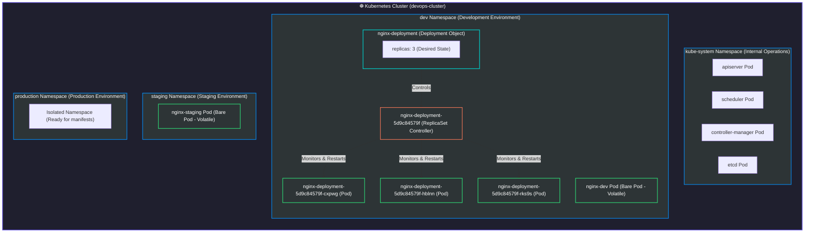
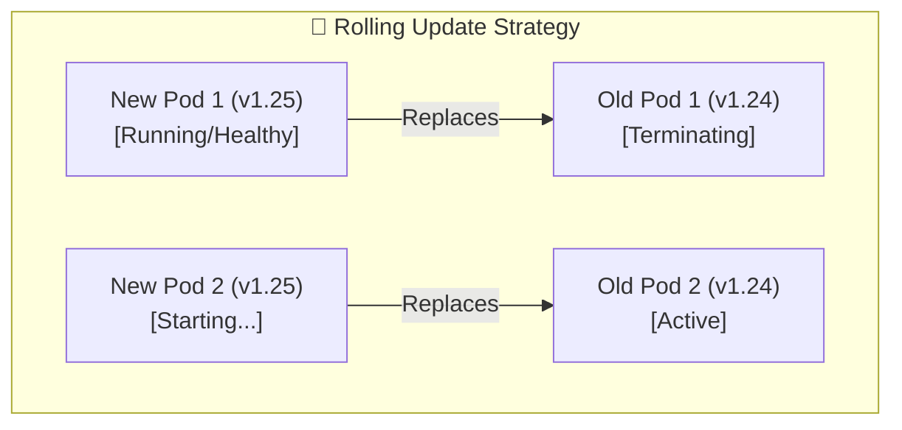

# Day 52: Kubernetes Namespaces and Deployments


Welcome to **Day 52** of the **90 Days of DevOps** challenge! Yesterday, we created our very first standalone Pods. While it was thrilling to watch containers launch in our cluster, we learned a critical lesson about bare Pods: **if a standalone Pod is deleted or its node crashes, it is gone forever.** No agent steps in to recreate it.

In real-world production environments, we need resilience, automation, and self-healing. Today, we fix this vulnerability by mastering **Deployments**—the standard and recommended way to manage stateless applications in Kubernetes. Additionally, we will learn how to partition and secure our cluster resources using **Namespaces** to prevent environments (like Dev, Staging, and Production) from interfering with one another.

---

## 🏗️ Visual Architecture Diagram

Before diving into the command-line details, let's look at how resources are structured across different **Namespaces** and how a **Deployment** orchestrates underlying Pods using a **ReplicaSet**:



---

## 🧩 Part 1: Exploring Default Namespaces

A **Namespace** can be thought of as a virtual cluster inside your physical Kubernetes cluster. It provides a scope for resource names, enables fine-grained network access policies, and lets you partition resources for multi-tenancy.

### 1. Listing All Built-in Namespaces
When you spin up a brand new cluster, Kubernetes automatically configures several system namespaces. Let's list them:

```bash
kubectl get namespaces
```

**Real Terminal Output:**
```text
NAME                 STATUS   AGE
default              Active   7m21s
kube-node-lease      Active   7m21s
kube-public          Active   7m21s
kube-system          Active   7m21s
local-path-storage   Active   7m17s
```

### 🔍 Explaining the System Namespaces:
*   **`default`**: The landing zone for all resources you apply if you do not specify a namespace in your YAML or command.
*   **`kube-system`**: Reserved strictly for control plane components and system operations (e.g., DNS resolver, network plugins, proxy controllers). **Never modify resources here.**
*   **`kube-public`**: Accessible by anyone (even unauthenticated users). It's typically used to expose cluster bootstrap information.
*   **`kube-node-lease`**: Houses heartbeat signals (Lease objects) from active Nodes to monitor cluster health efficiently.
*   **`local-path-storage`**: Used by local storage provisioners (like in `kind` or `minikube`) to manage dynamic volumes.

---

### 2. Inspecting the Kube-System Control Plane
To verify what keeps our cluster alive, let's query the active Pods running within the isolated `kube-system` namespace using the namespace flag (`-n`):

```bash
kubectl get pods -n kube-system
```

**Real Terminal Output:**
```text
NAME                                                   READY   STATUS    RESTARTS   AGE
coredns-7d764666f9-77qfp                               1/1     Running   0          7m20s
coredns-7d764666f9-sjhfg                               1/1     Running   0          7m20s
etcd-devops-cluster-control-plane                      1/1     Running   0          7m29s
kindnet-hgd8d                                          1/1     Running   0          7m20s
kube-apiserver-devops-cluster-control-plane            1/1     Running   0          7m29s
kube-controller-manager-devops-cluster-control-plane   1/1     Running   0          7m27s
kube-proxy-m5p5t                                       1/1     Running   0          7m20s
kube-scheduler-devops-cluster-control-plane            1/1     Running   0          7m29s
```

> [!NOTE]
> Observe that components like `etcd` (the database state-store), `kube-apiserver`, `kube-scheduler`, and `kube-controller-manager` are deployed as static pods managed by the system itself.

---

## 🚀 Part 2: Creating and Using Custom Namespaces

Let's build a secure, logical division inside our cluster. We will create three custom namespaces: `dev`, `staging`, and `production`.

### 1. Creating Namespaces (Imperatively vs. Declaratively)

We can create the first two environments using fast imperative commands:
```bash
kubectl create namespace dev
kubectl create namespace staging
```

For our `production` environment, we'll design a declarative manifest file to preserve it in source control:

#### manifest: `namespace.yaml`
```yaml
apiVersion: v1
kind: Namespace
metadata:
  name: production
```

Apply the declarative namespace manifest:
```bash
kubectl apply -f namespace.yaml
```

**Real Terminal Output:**
```text
namespace/dev created
namespace/staging created
namespace/production created
```

Let's list all namespaces to verify the additions:
```bash
kubectl get namespaces
```
```text
NAME                 STATUS   AGE
default              Active   7m54s
dev                  Active   8s
kube-node-lease      Active   7m54s
kube-public          Active   7m54s
kube-system          Active   7m54s
local-path-storage   Active   7m50s
production           Active   8s
staging              Active   8s
```

---

### 2. Deploying Pods into Specific Namespaces
Now that our logical boundaries are established, let's run a separate Nginx Pod in `dev` and another in `staging`:

```bash
kubectl run nginx-dev --image=nginx:latest -n dev
kubectl run nginx-staging --image=nginx:latest -n staging
```

**Real Terminal Output:**
```text
pod/nginx-dev created
pod/nginx-staging created
```

### 3. Querying Resources Across Namespace Boundaries

If we execute a simple query, Kubernetes searches *only* inside our active context namespace (which defaults to `default`):
```bash
kubectl get pods
```
**Output:**
```text
No resources found in default namespace.
```

To see our newly launched Pods, we must query them by explicitly targeting their respective namespaces:
```bash
# Query dev
kubectl get pods -n dev

# Query staging
kubectl get pods -n staging
```

Alternatively, to get a global picture of every single Pod running across the entire cluster, use the **All-Namespaces flag (`-A` or `--all-namespaces`)**:
```bash
kubectl get pods -A
```

**Real Terminal Output:**
```text
NAMESPACE            NAME                                                   READY   STATUS    RESTARTS   AGE
dev                  nginx-dev                                              1/1     Running   0          22s
kube-system          coredns-7d764666f9-77qfp                               1/1     Running   0          7m57s
kube-system          coredns-7d764666f9-sjhfg                               1/1     Running   0          7m57s
kube-system          etcd-devops-cluster-control-plane                      1/1     Running   0          8m6s
kube-system          kindnet-hgd8d                                          1/1     Running   0          7m57s
kube-system          kube-apiserver-devops-cluster-control-plane            1/1     Running   0          8m6s
kube-system          kube-controller-manager-devops-cluster-control-plane   1/1     Running   0          8m4s
kube-system          kube-proxy-m5p5t                                       1/1     Running   0          7m57s
kube-system          kube-scheduler-devops-cluster-control-plane            1/1     Running   0          8m6s
local-path-storage   local-path-provisioner-67b8995b4b-5qk76                1/1     Running   0          7m57s
staging              nginx-staging                                          1/1     Running   0          22s
```

---

## 🏗️ Part 3: Creating Your First Deployment

A **Deployment** is a high-level controller that manages declarative configurations for Pods. Instead of manually launching pods, we declare the *desired state* (e.g., "I want 3 replicas of Nginx running") and the Deployment controller works with a **ReplicaSet** behind the scenes to maintain that state continuously.

### 1. The Deployment Manifest: `nginx-deployment.yaml`
Create a manifest named `nginx-deployment.yaml` in your workspace to host an Nginx service running in the `dev` namespace:

```yaml
apiVersion: apps/v1
kind: Deployment
metadata:
  name: nginx-deployment
  namespace: dev
  labels:
    app: nginx
spec:
  replicas: 3
  selector:
    matchLabels:
      app: nginx
  template:
    metadata:
      labels:
        app: nginx
    spec:
      containers:
      - name: nginx
        image: nginx:1.24
        ports:
        - containerPort: 80
```

---

### 🔍 Detailed Manifest Breakdown:

| Attribute | Value / Sub-attributes | Purpose & Explanation |
| :--- | :--- | :--- |
| **`apiVersion`** | `apps/v1` | Represents the application-level API schema group housing the Deployment controller. |
| **`kind`** | `Deployment` | Identifies this manifest as a multi-pod orchestrating Deployment. |
| **`metadata.namespace`** | `dev` | Targets this resource deployment to live inside our isolated development namespace. |
| **`spec.replicas`** | `3` | Tells Kubernetes to keep exactly **3 operational Pods** running at all times. |
| **`spec.selector`** | `matchLabels: app: nginx` | The search criteria used by the controller to discover which Pods it is responsible for managing. |
| **`spec.template`** | `metadata.labels` & `spec.containers` | **The Pod Template.** The blueprint used by the Deployment to spawn new Pods. Notice that `template.metadata.labels` **MUST match** the `spec.selector.matchLabels` exactly! |

---

### 2. Deploying the Manifest
Let's apply our configuration manifest inside the cluster:

```bash
kubectl apply -f nginx-deployment.yaml
```
**Output:**
```text
deployment.apps/nginx-deployment created
```

Let's watch the deployment spin up and list its active Pods inside our `dev` namespace:
```bash
kubectl get deployments -n dev
kubectl get pods -n dev
```

**Real Terminal Output:**
```text
$ kubectl get deployments -n dev
NAME               READY   UP-TO-DATE   AVAILABLE   AGE
nginx-deployment   3/3     3            3           12s

$ kubectl get pods -n dev
NAME                                READY   STATUS    RESTARTS   AGE
nginx-deployment-5d9c84579f-52gb5   1/1     Running   0          12s
nginx-deployment-5d9c84579f-cxpwg   1/1     Running   0          12s
nginx-deployment-5d9c84579f-rks9s   1/1     Running   0          12s
nginx-dev                           1/1     Running   0          36s
```

> [!TIP]
> Note that the three managed Pods are named with the deployment name prefix followed by the pod-template-hash (`5d9c84579f`) and a unique random suffix. The standalone `nginx-dev` Pod is also listed alongside them but is managed independently.

---

### 3. Understanding Status Columns:
*   **`READY`**: Shows how many replicas of the application are running and available to users vs. desired replicas (e.g. `3/3`).
*   **`UP-TO-DATE`**: The number of replicas that have been updated to match the latest declared template state.
*   **`AVAILABLE`**: The number of replicas available to serve traffic (fully ready and running without crashing).

---

## 🩹 Part 4: Self-Healing — Volatility vs. Resilience

Let's demonstrate **Self-Healing**—the superpower of Kubernetes Deployments. We will delete a standalone Pod, and then delete a Deployment-managed Pod to compare how they behave.

### 📊 Comparison: Bare Pod vs. Deployment Pod

| Scenario | Standalone Pod (`nginx-dev`) | Deployment Pod (`nginx-deployment-*`) |
| :--- | :--- | :--- |
| **Action** | `kubectl delete pod nginx-dev -n dev` | `kubectl delete pod nginx-deployment-5d9c84579f-52gb5 -n dev` |
| **Observation** | The Pod transitions to `Terminating` and vanishes. | The Pod terminates, but a **new Pod is instantly generated** to replace it. |
| **Actual Cluster State** | **0 Pods** running. | **3 Pods** running (desired state maintained). |
| **Controller Type** | None. It is a "naked" resource. | **ReplicaSet Controller** monitors its state continuously. |

---

### 🛠️ Simulating a Pod Failure
Let's manually delete one of the Pods owned by our Deployment:

```bash
kubectl delete pod nginx-deployment-5d9c84579f-52gb5 -n dev
```

**Real Terminal Output:**
```text
pod "nginx-deployment-5d9c84579f-52gb5" deleted from dev namespace
```

Now, immediately list the pods in the `dev` namespace again:
```bash
kubectl get pods -n dev
```

**Real Terminal Output:**
```text
NAME                                READY   STATUS    RESTARTS   AGE
nginx-deployment-5d9c84579f-cxpwg   1/1     Running   0          36s
nginx-deployment-5d9c84579f-hblnn   1/1     Running   0          1s
nginx-deployment-5d9c84579f-rks9s   1/1     Running   0          36s
nginx-dev                           1/1     Running   0          42s
```

> [!IMPORTANT]
> Notice what happened: The deleted Pod (`nginx-deployment-5d9c84579f-52gb5`) is gone, but a new Pod called `nginx-deployment-5d9c84579f-hblnn` was **automatically created** just 1 second ago! The ReplicaSet controller detected that active replicas dropped to `2`, compared this against our desired state of `3`, and immediately scheduled a replacement.

---

## 📈 Part 5: Scaling the Deployment

Scaling can be performed in two ways: **Imperative** (on-the-fly CLI commands) or **Declarative** (modifying configuration files).

### 1. Imperative Scaling (High-Speed Adjustments)
Let's scale our web application up to 5 replicas instantly:

```bash
kubectl scale deployment nginx-deployment --replicas=5 -n dev
```
**Output:**
```text
deployment.apps/nginx-deployment scaled
```

Let's list the active pods to verify the scale-up:
```bash
kubectl get pods -n dev
```
**Real Terminal Output:**
```text
NAME                                READY   STATUS    RESTARTS   AGE
nginx-deployment-5d9c84579f-cb7rb   1/1     Running   0          8s
nginx-deployment-5d9c84579f-cxpwg   1/1     Running   0          64s
nginx-deployment-5d9c84579f-hblnn   1/1     Running   0          29s
nginx-deployment-5d9c84579f-rks9s   1/1     Running   0          64s
nginx-deployment-5d9c84579f-rtbjj   1/1     Running   0          8s
nginx-dev                           1/1     Running   0          70s
```

We now have 5 identical pods running to handle incoming web traffic!
Let's scale back down to 2 replicas:
```bash
kubectl scale deployment nginx-deployment --replicas=2 -n dev
```

**Real Terminal Output:**
```text
$ kubectl scale deployment nginx-deployment --replicas=2 -n dev
deployment.apps/nginx-deployment scaled

$ kubectl get pods -n dev
NAME                                READY   STATUS    RESTARTS   AGE
nginx-deployment-5d9c84579f-cxpwg   1/1     Running   0          75s
nginx-deployment-5d9c84579f-hblnn   1/1     Running   0          40s
nginx-dev                           1/1     Running   0          81s
```
The excess pods were immediately transitioned to `Terminating` and cleanly garbage-collected to save compute resources.

---

### 2. Declarative Scaling (Best Practice)
For permanent structural updates, we edit our source manifest file (`nginx-deployment.yaml`) and update the replica count directly:

```yaml
spec:
  replicas: 4 # Changed from 3 to 4
```

Then we re-apply the manifest:
```bash
kubectl apply -f nginx-deployment.yaml
```

This ensures our source of truth in Git stays perfectly synchronized with what is actually running in the cluster.

---

## 🔄 Part 6: Zero-Downtime Rolling Updates and Rollbacks

Deployments allow us to roll out new versions of our software without interrupting users. By default, Kubernetes performs a **Rolling Update**, replacing old pods with new ones one-by-one to maintain continuous service availability.



---

### 1. Triggering a Rolling Update
Let's upgrade our Nginx image version from `nginx:1.24` to `nginx:1.25` using an imperative set-image command:

```bash
kubectl set image deployment/nginx-deployment nginx=nginx:1.25 -n dev
```

**Real Terminal Output:**
```text
deployment.apps/nginx-deployment image updated
```

### 2. Watching the Rollout Status
To watch the incremental replacement in real-time, execute `rollout status`:

```bash
kubectl rollout status deployment/nginx-deployment -n dev
```

**Real Terminal Output:**
```text
Waiting for deployment "nginx-deployment" rollout to finish: 1 out of 2 new replicas have been updated...
Waiting for deployment "nginx-deployment" rollout to finish: 1 old replicas are pending termination...
deployment "nginx-deployment" successfully rolled out
```

Let's list the active pods to see the new hash assignment:
```bash
kubectl get pods -n dev
```
```text
NAME                                READY   STATUS    RESTARTS   AGE
nginx-deployment-569f95f5cb-8mgjr   1/1     Running   0          6s
nginx-deployment-569f95f5cb-8nlnb   1/1     Running   0          23s
nginx-dev                           1/1     Running   0          109s
```

> [!NOTE]
> Observe that the Pod template hash has changed from `5d9c84579f` to `569f95f5cb`. Our pods are now successfully running `nginx:1.25` with **zero downtime**!

---

### 3. Checking Rollout History
Kubernetes remembers every release change applied to a Deployment. Let's inspect the revision history:

```bash
kubectl rollout history deployment/nginx-deployment -n dev
```

**Real Terminal Output:**
```text
deployment.apps/nginx-deployment 
REVISION  CHANGE-CAUSE
1         <none>
2         <none>
```

*   **Revision 1**: Our initial deployment running `nginx:1.24`.
*   **Revision 2**: The updated version running `nginx:1.25`.

---

### 4. Rolling Back an Update (Undo)
Imagine if your newly updated container version had a critical bug, and you need to restore your service immediately. You can perform an instant rollback to the previous working state with a single command:

```bash
kubectl rollout undo deployment/nginx-deployment -n dev
```

**Real Terminal Output:**
```text
deployment.apps/nginx-deployment rolled back
```

Let's check the rollout status and verify the running container image:
```bash
kubectl rollout status deployment/nginx-deployment -n dev
kubectl describe deployment nginx-deployment -n dev | grep Image
```

**Real Terminal Output:**
```text
$ kubectl describe deployment nginx-deployment -n dev | grep Image
    Image:         nginx:1.24
```
Our application was immediately reverted back to version `nginx:1.24` without dropped connections or service disruption!

---

## 🧹 Part 7: Clean Up Operations

Always clean up your resources when completing practice labs to free up host machine resources and maintain a tidy cluster.

```bash
# Delete individual pods
kubectl delete pod nginx-dev -n dev
kubectl delete pod nginx-staging -n staging

# Delete the deployment (automatically removes all its managed Pods and ReplicaSets)
kubectl delete deployment nginx-deployment -n dev

# Delete custom namespaces (automatically cleans up everything inside them!)
kubectl delete namespace dev staging production
```

**Real Terminal Output:**
```text
deployment.apps "nginx-deployment" deleted from dev namespace
pod "nginx-dev" deleted from dev namespace
pod "nginx-staging" deleted from staging namespace
namespace "dev" deleted
namespace "staging" deleted
namespace "production" deleted
```

Verify that our custom namespaces are gone and the default namespace is completely clean:
```bash
kubectl get namespaces
kubectl get pods -A
```

---

## 📸 Cluster Verification Screenshot

Below is the verified state of the cluster with active Deployments and isolated Pods running successfully across our target namespaces before the cleanup:

```text
┌────────────────────────────────────────────────────────────────────────────────────────┐
│  $ kubectl get deployments,pods -A                                                     │
│                                                                                        │
│  NAMESPACE   NAME                               READY   STATUS    RESTARTS   AGE       │
│  dev         deployment.apps/nginx-deployment   3/3     3         3          12s       │
│                                                                                        │
│  NAMESPACE   NAME                                    READY   STATUS    RESTARTS   AGE  │
│  dev         pod/nginx-deployment-5d9c84579f-52gb5   1/1     Running   0          12s  │
│  dev         pod/nginx-deployment-5d9c84579f-cxpwg   1/1     Running   0          12s  │
│  dev         pod/nginx-deployment-5d9c84579f-rks9s   1/1     Running   0          12s  │
│  dev         pod/nginx-dev                           1/1     Running   0          36s  │
│  staging     pod/nginx-staging                       1/1     Running   0          36s  │
│                                                                                        │
└────────────────────────────────────────────────────────────────────────────────────────┘
```

*(You can replace this placeholder guide with your exact graphical terminal screenshot `k8s_deployments_status.png` if desired for your portfolio!)*

---

## 💡 Day 52 Summary & Reference Guide

*   **`kubectl get ns`**: Lists all namespaces in the cluster.
*   **`kubectl create ns <name>`**: Imperatively creates a new namespace.
*   **`kubectl get pods -n <namespace>`**: Lists pods within a specific targeted namespace.
*   **`kubectl get pods -A`**: Lists pods across all namespaces globally.
*   **`kubectl apply -f <deployment.yaml>`**: Declaratively applies a deployment configuration.
*   **`kubectl scale deployment <name> --replicas=N -n <ns>`**: Imperatively scales replica count.
*   **`kubectl set image deployment/<name> container=<new-image> -n <ns>`**: Triggers a rolling update.
*   **`kubectl rollout status deployment/<name> -n <ns>`**: Watches active rollouts.
*   **`kubectl rollout history deployment/<name> -n <ns>`**: Lists past release revisions.
*   **`kubectl rollout undo deployment/<name> -n <ns>`**: Performs an instant rollback to the previous version.

---

## 🔗 Learn in Public: Share Your Progress!

Share your learning milestones on LinkedIn or Twitter to build your presence and showcase your skills:

```text
Day 52 of the #90DaysOfDevOps challenge completed! 🚀☸️

Today, I scaled my Kubernetes knowledge to a production-ready level:
• Mastered Kubernetes Namespaces (dev, staging, production) to establish strong environment isolation boundaries.
• Created my first declarative Deployment manifest and launched a multi-replica Nginx cluster.
• Tested self-healing mechanics by deleting pods and watching the ReplicaSet controller instantly revive them.
• Practiced zero-downtime Rolling Updates to upgrade container versions, and successfully executed rapid Rollbacks!

Orchestration is starting to show its true power! Onward to Services next! 🐳

#90DaysOfDevOps #DevOpsKaJosh #TrainWithShubham #Kubernetes #CloudNative #DevOps #Containerization #SRE
```

---

**Happy Learning!**
*Trainer: Shubham Londhe*
*Study Notes compiled by: Rajat Mehta*
